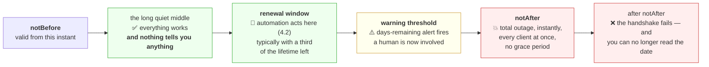

# 4.1 — Expiry is a date, not a warning

## One-line answer

A certificate carries a `notAfter` timestamp, and at that instant **every client rejects it simultaneously
with no grace period, no degradation and no prior notice** — which makes certificate expiry the only
outage in this curriculum whose exact date and time you can know months in advance, and therefore the only
one that is entirely inexcusable.

---

## The story

🎬 **The scene.** A market trader with a licence pinned to the side of his stall. It has a date printed on
it. The date is in fifteen months, so he stops seeing it, the way you stop seeing a poster on your own
wall.

Fifteen months pass. He is a good trader. Nothing about his stall changes. The vegetables are the same,
the prices are the same, the customers are the same.

😬 **The naive fix.** He assumes somebody will tell him. A letter, a phone call, an inspector's warning.

💥 **Why it fails.** On a Sunday morning the inspector walks past, glances at the card, and closes the
stall. There was no warning because **the card was the warning**, and it had been sitting there in plain
sight for four hundred and fifty days saying exactly when this would happen.

He is not shut down for doing anything wrong. He is shut down for a date passing.

💡 **The insight.** **A deadline that is written down and visible is not a risk — it is a scheduled event
you have decided not to look at.** The failure is never in the mechanism; it is in the absence of anything
that turns a printed date into an action. And the fix is never "be more careful". It is "make a machine
read the date".

---

## The idea in plain language

Every certificate contains two timestamps. RFC 5280, verified at
`https://www.rfc-editor.org/rfc/rfc5280.html` on **2026-08-25**, defines the validity field as
*"Validity ::= SEQUENCE { notBefore Time, notAfter Time }"* and says the certificate is valid *"from
notBefore through notAfter, inclusive."*

Everything operationally important follows from four properties of that pair:

**It is absolute, not relative.** `notAfter` is an instant in universal time. It does not depend on when
the certificate was installed, how much it is used, or whether anyone has looked at it.

**There is no grace period.** At `notAfter` plus one second, verification fails. There is no window, no
soft-fail, no reduced functionality. **The transition from working to not working is instantaneous and
total.**

**Every client fails at once.** Not a percentage. Not the ones with old software. **All of them**, because
they are all reading the same field and the same clock.

**Nothing tells you in advance.** No protocol message, no header, no server-side event. The information is
sitting inside a file, available to anyone who reads it, and **reading it is entirely your responsibility.**

Together those make certificate expiry unlike almost every other outage you will meet. A disk fills
gradually ([Day 5, 3.1](../../../day-005-linux-for-operators-ii/parts/03-the-disk-that-fills/3.1-df-du-and-why-they-disagree.md)).
Memory pressure builds ([Day 6, 4.4](../../../day-006-resources-and-the-oom-killer/parts/04-the-oom-killer/4.4-pressure-the-signal-that-warns-you-first.md)).
Latency creeps. **Certificate expiry is a step function with a published timestamp**, and that combination
is unique.

### `notBefore` also matters, and people forget it entirely

A certificate is invalid *before* `notBefore` too. Two situations produce this:

**A freshly issued certificate deployed too early**, on a machine whose clock is slightly ahead. Rare, and
baffling when it happens.

**A machine with a badly wrong clock** — a container without time synchronisation, an embedded device, a
virtual machine resumed from a snapshot. **The certificate is fine and the client's clock is wrong**, and
the error text blames the certificate.

This is why `notBefore` errors are almost always a clock problem, and why *"check the date on both
machines"* is a genuinely useful first question.

### The lifetimes are getting shorter, and this changes the operational answer

Certificate validity periods used to be measured in years. They are not any more, and the direction of
travel is aggressive.

Verified against the CA/Browser Forum Baseline Requirements at
`https://cabforum.org/working-groups/server/baseline-requirements/requirements/` on **2026-08-25**, whose
Relevant Dates table gives:

| Maximum validity for subscriber certificates | Effective from |
| --- | --- |
| 398 days | previously |
| **200 days** | **2026-03-15 — this is the current limit** |
| 100 days | 2027-03-15 |
| 47 days | 2029-03-15 |

**Read the last row as an operator.** A forty-seven-day certificate must be renewed roughly eight times a
year. **That is not something a human calendar reminder can carry.** The industry is deliberately making
manual renewal impossible, because manual renewal is the thing that fails — and
[4.2](4.2-renewal-and-the-automation-that-must-not-fail.md) is about what replaces it.

The rationale is worth knowing because it will come up: shorter lifetimes limit the damage from a
compromised key, and they reduce reliance on revocation, which has never worked reliably in practice.

---

## Why Kriya needs it

**Day 40** gives `pulse` a certificate through an ingress, and **Day 58** automates renewal. This part is
why that automation exists rather than being optional.

**Day 79** builds symptom-based alerting and **Day 82** writes runbooks. Certificate expiry is the
canonical example of a **cause-based** alert that is genuinely correct — you alert on the cause (days
remaining) rather than the symptom (everything is broken), because by the time the symptom appears the
outage is total and the fix takes longer than the outage you are trying to prevent.

**Day 84** covers capacity and calendar-driven risk. **Day 231** is production readiness, where "what
expires, when, and what renews it" is a review question.

**Day 232** is day-2 operations: the certificate that expires while you are on holiday is the archetypal
day-2 problem, and the archetypal answer is that it should never have been a human's job.

---

## The mechanism

Read the dates, compute the remaining time, and build the check that turns the date into a signal.

**Reading the dates:**

```bash
openssl s_client -connect www.rfc-editor.org:443 -servername www.rfc-editor.org </dev/null 2>/dev/null \
  | openssl x509 -noout -subject -dates
```

**Line by line:**

- The `s_client` half fetches the leaf certificate, with SNI set
  ([3.4](../03-tls/3.4-sni-one-address-many-certificates.md)).
- `-dates` — prints both `notBefore` and `notAfter`. Verified against `openssl x509 -help` on
  **2026-08-25**: *"Print both notBefore and notAfter fields"*.
- `-noout` — suppress the certificate body, which would otherwise bury the two lines you want.

```text
subject=CN=rfc-editor.org
notBefore=Jul 14 08:22:41 2026 GMT
notAfter=Oct 12 08:22:40 2026 GMT
```

**Note the lifetime: roughly ninety days**, well inside the current two-hundred-day maximum. Short
lifetimes are already the norm for automated issuers, which is a consequence of
[4.2](4.2-renewal-and-the-automation-that-must-not-fail.md) rather than of the rules.

### The one-flag check that belongs in monitoring

`openssl` has a purpose-built answer, and it is the most useful certificate flag there is:

```bash
CERT=$(openssl s_client -connect www.rfc-editor.org:443 -servername www.rfc-editor.org </dev/null 2>/dev/null)
for days in 7 30 60 90; do
  seconds=$((days * 86400))
  if echo "$CERT" | openssl x509 -noout -checkend "$seconds" >/dev/null 2>&1; then
    printf 'still valid in %2d days: yes\n' "$days"
  else
    printf 'still valid in %2d days: NO  <-- renew before here\n' "$days"
  fi
done
```

**Line by line:**

- `CERT=$(...)` — fetch once and reuse. **Fetching inside the loop would make four separate TLS
  handshakes**, which is wasteful and, against a rate-limited endpoint, rude.
- `-checkend <seconds>` — verified against `openssl x509 -help` on **2026-08-25**:
  *"Check whether cert expires in the next arg seconds"*. **It exits `0` if the certificate is still valid
  at that future moment and non-zero if it is not** — an exit code, which is exactly what a monitoring
  system reads ([Day 4, 3.3](../../../day-004-linux-for-operators-i/parts/03-exit-codes/3.3-the-exit-code-your-gate-already-reads.md)).
- `$((days * 86400))` — shell arithmetic; 86400 seconds in a day. Writing the multiplication out rather
  than pasting `2592000` keeps the intent readable.
- `>/dev/null 2>&1` — discard output; **the exit code is the whole answer.**
- The `else` branch prints a marker, because a check that reports only success teaches you nothing about
  where the boundary is.

```text
still valid in  7 days: yes
still valid in 30 days: yes
still valid in 60 days: NO  <-- renew before here
still valid in 90 days: NO  <-- renew before here
```

**That transition between thirty and sixty is the certificate's remaining life, located by bisection** —
and it is the number a monitoring system should be exporting continuously rather than discovering during
an incident.

### Computing days remaining as a number

An exit code is enough for an alert; a *number* is what you want on a dashboard:

```python
"""Report days remaining on the certificate served by a host. Exit non-zero when low."""

import datetime as dt
import socket
import ssl
import sys

WARN_DAYS = 30


def days_remaining(host: str, port: int = 443) -> tuple[str, float]:
    context = ssl.create_default_context()
    with socket.create_connection((host, port), timeout=10) as raw:
        with context.wrap_socket(raw, server_hostname=host) as tls:
            cert = tls.getpeercert()
    not_after = cert["notAfter"]
    expires = dt.datetime.strptime(not_after, "%b %d %H:%M:%S %Y %Z").replace(tzinfo=dt.UTC)
    return not_after, (expires - dt.datetime.now(dt.UTC)).total_seconds() / 86400


def main(hosts: list[str]) -> int:
    worst = float("inf")
    for host in hosts:
        try:
            raw_date, remaining = days_remaining(host)
        except (OSError, ssl.SSLError) as exc:
            print(f"{host:32} ERROR  {type(exc).__name__}: {exc}")
            worst = -1.0
            continue
        flag = "  <-- WARN" if remaining < WARN_DAYS else ""
        print(f"{host:32} {raw_date}  {remaining:7.1f} days{flag}")
        worst = min(worst, remaining)
    return 0 if worst >= WARN_DAYS else 1


if __name__ == "__main__":
    sys.exit(main(sys.argv[1:] or ["www.rfc-editor.org"]))
```

**Line by line:**

- `context = ssl.create_default_context()` — **verification stays on.** A checker that used
  `verify=False` would happily report the expiry of a certificate it could not otherwise trust
  ([3.5](../03-tls/3.5-verification-and-the-flag-that-turns-it-off.md)), which is the wrong tool doing
  half a job.
- `tls.getpeercert()` — the parsed certificate as a dictionary. **It returns an empty dict when
  verification is disabled**, which is another reason the line above matters.
- `"%b %d %H:%M:%S %Y %Z"` — the `strptime` format matching OpenSSL's date rendering,
  `Oct 12 08:22:40 2026 GMT`. **`%b` is the abbreviated month name and is locale-sensitive**, which is a
  real portability trap: on a machine with a non-English locale this parse fails. A production version
  would set the locale explicitly or parse the ASN.1 directly.
- `.replace(tzinfo=dt.UTC)` — the parsed value is naive; certificate times are UTC by definition, so this
  attaches the correct zone. **Subtracting a naive datetime from an aware one raises `TypeError`**, and
  that is the bug this line exists to prevent.
- `dt.datetime.now(dt.UTC)` — an aware "now". Using `utcnow()` would produce a naive value and reintroduce
  the same error; it is also deprecated in modern Python.
- `total_seconds() / 86400` — days as a float, so a dashboard can plot a smooth line rather than a
  staircase.
- `except (OSError, ssl.SSLError)` — a host that is unreachable or whose certificate is *already* invalid
  must not crash the checker. **`worst = -1.0` makes that case fail the exit code**, because "I could not
  check" is not "everything is fine" (Principle 10).
- `return 0 if worst >= WARN_DAYS else 1` — **the exit code is the interface.** Any scheduler, CI job or
  monitoring agent can consume it without parsing text.
- `sys.argv[1:] or [...]` — accept a list of hosts, with a default so it runs with no arguments.

Save it as `lab/certcheck.py` and run it:

```bash
uv run python days/day-008-http-and-tls/lab/certcheck.py www.rfc-editor.org www.iana.org expired.badssl.com
echo "exit=$?"
```

**Line by line:** three hosts — two healthy and one deliberately broken — so you can see both branches and
confirm the exit code responds.

```text
www.rfc-editor.org               Oct 12 08:22:40 2026 GMT     48.0 days
www.iana.org                     Nov  3 23:59:59 2026 GMT     70.6 days
expired.badssl.com               ERROR  SSLCertVerificationError: [SSL: CERTIFICATE_VERIFY_FAILED] certificate verify failed: certificate has expired (_ssl.c:1010)
exit=1
```

**The third line is the important one.** An already-expired certificate cannot be inspected by a verifying
client at all — the handshake fails before you can read the date. **So a days-remaining monitor stops
producing a number at exactly the moment you most want one**, and the check must treat "could not connect"
as a failure rather than as missing data. That distinction is the difference between an alert that fires
and a graph that goes blank.



---

## When it breaks

**The expired certificate, from a client.** The error you will see first:

```text
httpx2.ConnectError: [SSL: CERTIFICATE_VERIFY_FAILED] certificate verify failed:
certificate has expired (_ssl.c:1010)
```

**What it says:** expired.
**What it actually means:** the certificate's `notAfter` is in the past according to **this client's
clock**. Almost always that means the certificate really has expired; occasionally it means the client's
clock is wrong.
**The smallest fix:** renew and deploy. **There is no other fix** — no flag on the server, no
configuration change, no restart.
**How to tell the two causes apart in ten seconds:** compare `date -u` on the client with the `notAfter`
value. If the certificate expired last week and the client thinks it is next year, the clock is the
problem.

**The same failure from `curl`, which words it differently:**

```text
curl: (60) SSL certificate problem: certificate has expired
More details here: https://curl.se/docs/sslcerts.html
```

**What it says:** the same thing.
**Why it is worth pasting both:** at three in the morning you will be searching for whichever string you
happen to have, and knowing they are the same failure saves you from concluding you have two problems.
**The trap in `curl`'s message:** it suggests reading about certificates, and the page it links explains
`--insecure`. **That is the road to [3.5](../03-tls/3.5-verification-and-the-flag-that-turns-it-off.md)**,
and it is being offered to you by the error message itself.

**`notBefore` in the future — the clock problem.** Much rarer, much more confusing:

```text
ssl.SSLCertVerificationError: [SSL: CERTIFICATE_VERIFY_FAILED] certificate verify failed:
certificate is not yet valid (_ssl.c:1010)
```

**What it says:** not yet valid.
**What it actually means:** **the client's clock is behind**, or the certificate was deployed before its
start date. A container without time synchronisation, a virtual machine resumed from an old snapshot, or
a device whose battery died are the usual causes.
**The smallest fix:** fix the clock, not the certificate.
**Why it is worth recognising instantly:** every instinct says to look at the certificate, and the
certificate is fine. **The tell is that it fails from one machine and works from another** — which is
never true of a genuinely expired certificate, because that fails everywhere at once.

**The renewal that was never deployed.** The failure that catches teams who *did* automate:

```text
$ openssl s_client -connect api.example.com:443 -servername api.example.com </dev/null 2>/dev/null | openssl x509 -noout -dates
notBefore=Jan 15 00:00:00 2026 GMT
notAfter=Aug 02 23:59:59 2026 GMT

$ openssl x509 -in /etc/certs/api.example.com/fullchain.pem -noout -dates
notBefore=Jul 20 00:00:00 2026 GMT
notAfter=Nov 07 23:59:59 2026 GMT
```

**What it says:** two different certificates — one on disk, one being served.
**What it actually means:** **renewal succeeded and the process was never reloaded.** The new certificate
is sitting in the right place, correct and unused, while the server holds the old one in memory from
start-up.
**The smallest fix:** reload the server — a `SIGHUP` for most, which is exactly the reopen mechanism from
[Day 5, 4.2](../../../day-005-linux-for-operators-ii/parts/04-logs-that-rotate/4.2-rotation-the-mechanism.md).
**Why it is the most dangerous variant:** every dashboard that checks the *file* says fine. Only a check
that connects **over the network** sees the truth, which is the single strongest argument for outside-in
monitoring in this whole day.

**The check that was pointed at the wrong thing.** The silent version:

```text
$ curl -sk -o /dev/null -w '%{http_code}\n' https://api.example.com/healthz
200
```

...three days after the certificate expired.
**What it says:** healthy.
**What it actually means:** `-k` disabled verification, so the health check cannot see expiry at all
([3.5](../03-tls/3.5-verification-and-the-flag-that-turns-it-off.md)). **The one automated observer that
was looking at the endpoint had been blinded to the one failure it could have caught.**
**The smallest fix:** remove `-k`.
**Principle 11 in one sentence:** a gate that cannot go red is not a gate, and `-k` is how an HTTPS check
becomes one.

---

## In production

**What a professional writes instead of the teaching version.** They do not check certificates by hand at
all. Renewal is automated ([4.2](4.2-renewal-and-the-automation-that-must-not-fail.md)), and on top of it
sits an **independent** expiry monitor that connects over the network from outside — deliberately not
sharing code or configuration with the renewal system, so a failure of the renewer is visible rather than
correlated. The monitor covers **every** endpoint, including internal ones, staging, the ones behind a VPN
and the ones nobody remembers, because the certificate that expires is always the one that was not on the
list.

**What degrades at scale.** The inventory. One certificate is a calendar entry; two hundred across three
environments, four clusters, a dozen internal services and a handful of client certificates is a database
— and the failure is never the certificate you know about. **Shorter lifetimes make this strictly worse
for manual processes and strictly better for automated ones**, which is precisely the industry's
intention: at forty-seven days, a manual process is not merely risky, it is arithmetically impossible to
sustain.

**The failure that only shows with real traffic.** Nothing about expiry needs traffic — it is a clock. But
the *discovery* depends on traffic in a cruel way: an endpoint with continuous traffic is discovered
within seconds by users, and an endpoint used once a quarter is discovered by the quarterly job, failing,
at the worst possible moment. **Low-traffic endpoints are where expiry incidents actually live**, and they
are the ones least likely to be in the monitoring.

**The review comment a senior engineer leaves.** *"The expiry check reads the PEM file on disk. That will
not catch the failure we actually had last year, which was a successful renewal that the process never
reloaded — the file was correct and the served certificate was not. Make the check connect to the endpoint
and read what is served."*

**The signal you would alert on.** **Days remaining, as a gauge, per endpoint** — and this is one of the
few genuinely correct **cause-based** alerts in operations, because the symptom is a total outage and by
then it is too late to act. Two thresholds: a **warning** with enough runway that a human can investigate a
failed renewal during working hours, and a **page** when it is close enough that inaction means a
certain outage. The exact numbers follow the renewal cadence — with automation renewing at a third of the
lifetime remaining, a warning at half of that remaining window and a page at a quarter of it gives two
independent chances to notice.

Two further rules that make the alert work: **"could not connect" must alert, not go blank**, since an
already-expired certificate cannot be inspected at all; and **the monitor must be independent of the
renewer**, or a single failure silences both. You would **not** alert on the certificate *changing*, which
is normal and constant under automation.

**Blast radius.** This part adds no capability to `pulse`. It performs read-only TLS handshakes and parses
dates. **Nothing is renewed, installed or written.** Worst case: a checker script reports a wrong number
because of a locale-dependent date parse, which is called out in the walkthrough above. Who can trigger
it: you. What bounds it: read-only operations with explicit timeouts.

**Cost.** `0` model calls, `0` tokens, `0` CI minutes, `0` disk, negligible RAM. **Network: a handful of
TLS handshakes to public hosts, no bodies transferred.** `openssl` is already present with Git for Windows
(`OpenSSL 3.5.6`, recorded in `docs/PACKAGES.md`), so no package is added.

**The interview question.** *"How do you make sure a certificate never expires in production?"* The answer
that lands describes two independent systems: *"Automated renewal, and a completely separate monitor that
watches days remaining — separate on purpose, because if the monitor shares code or configuration with the
renewer then one failure takes out both. The monitor has to connect over the network rather than reading
the file on disk, because the failure I have actually seen is a renewal that succeeded and a process that
was never reloaded: correct file, stale certificate in memory, and every file-based check green. It also
has to treat 'could not connect' as an alert rather than as missing data, because once the certificate has
actually expired you cannot read its expiry any more. And with the maximum lifetime now two hundred days
and dropping to forty-seven, manual renewal has stopped being an option — that is the point of the
schedule."*

---

## Check yourself

```bash
uv run python days/day-008-http-and-tls/lab/certcheck.py www.rfc-editor.org www.iana.org expired.badssl.com; echo "exit=$?"
```

Three hosts: two report days remaining, one reports an error, and the exit code is non-zero. **Confirm
that the error line is treated as a failure rather than as a missing value** — and say why a monitor that
skipped unreachable hosts would be silent during exactly the incident it exists to catch.

**Say out loud, without scrolling up:** *Explain why certificate expiry is a cause-based alert rather than
a symptom-based one, and why that is correct here when it usually is not. Then describe the failure mode
where renewal succeeds and the site still goes down, and say which kind of check catches it.*
