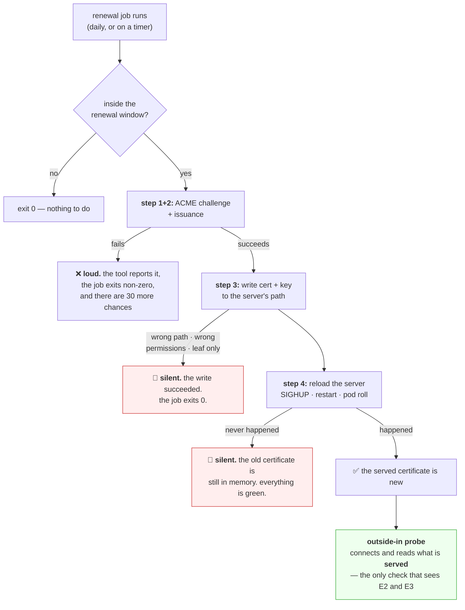

# 4.2 — Renewal, and the automation that must not fail

## One-line answer

Renewal is a four-step pipeline — **prove you control the name, get a certificate, put it where the server
reads it, make the server reload it** — and every real certificate outage is a failure of step three or
four while steps one and two reported success, which is why the only monitoring that works watches what is
*served* rather than what was *issued*.

---

## The story

🎬 **The scene.** A building with an automatic sprinkler system. It was installed years ago. There is a
green light on the panel by the door, and the light has been green since the day it was fitted.

Every quarter a contractor comes to service it. He signs the card on the wall.

😬 **The naive fix.** Everyone treats the green light and the signed card as proof that the building is
protected. Which is reasonable — that is what they are for.

💥 **Why it fails.** A refurbishment two years ago capped the water feed to the third floor. The panel
still shows green, because the panel monitors the *panel*. The contractor signs the card because the
system responds to his test, which he performs on the ground floor. **Every indicator in the building is
reporting on a part of the system that is working.**

Nobody has ever tested whether water comes out of a sprinkler head on the third floor.

💡 **The insight.** **Automation that reports on itself reports on the part that ran, not on the outcome
you wanted.** A renewal job that exits zero has proved that a renewal job exited zero. The only check
worth trusting is one that asks the question a user would ask, from where a user stands — and that check
must not share any machinery with the thing it is checking.

---

## The idea in plain language

[4.1](4.1-expiry-is-a-date-not-a-warning.md) established that certificates expire on a schedule and that
lifetimes are shrinking towards forty-seven days. **Renewal therefore has to be a program.** This part is
about what that program does and where it goes wrong.

### The four steps, and which ones actually fail

**Step 1 — prove you control the name.** A certificate authority will not issue a certificate for
`api.example.com` to anyone who asks. You must demonstrate control, and the mechanism is called a
**challenge**.

**Step 2 — obtain the certificate.** The client generates a key pair, sends a signing request, passes the
challenge, and receives a signed certificate plus its intermediates
([3.3](../03-tls/3.3-the-certificate-and-the-chain-of-trust.md)).

**Step 3 — install it.** Write the certificate and key where the server expects them, with the right
ownership and permissions
([Day 5, 2.2](../../../day-005-linux-for-operators-ii/parts/02-permissions/2.2-reading-and-changing-a-mode.md)).

**Step 4 — make the server use it.** A running server holds its certificate **in memory from start-up**.
Writing a new file changes nothing until the process is told to reload.

**Steps 1 and 2 fail loudly.** They involve a network exchange with an authority that returns errors, and
the tooling reports them.

**Steps 3 and 4 fail silently.** A file written to the wrong path is a successful write. A server that was
never reloaded is a healthy server. **Both leave the renewal job exiting zero**, and both produce an
outage on `notAfter`.

### ACME, and the two challenge types

The protocol that automates steps 1 and 2 is **ACME** — Automatic Certificate Management Environment, RFC
8555. It is what makes free, automated certificates possible, and its two common challenges have very
different operational properties:

| Challenge | How you prove control | Needs | Wildcards |
| --- | --- | --- | --- |
| **HTTP-01** | serve a specific file at `/.well-known/acme-challenge/<token>` over plain HTTP | port 80 reachable from the internet | ❌ no |
| **DNS-01** | publish a specific `TXT` record at `_acme-challenge.<name>` | API access to your DNS provider | ✅ yes |

**HTTP-01 is simpler and has a hard constraint:** the authority must reach your server from the public
internet on port 80. That rules it out for anything internal, anything behind a VPN, and anything on a
private network — which is most of what you will operate.

**DNS-01 works anywhere**, because the proof is published in DNS rather than served by the machine. It is
also the only way to get a wildcard certificate. Its cost is that your renewal automation now holds
credentials that can modify your DNS zone — **a significant capability, and one that belongs in the blast
radius section rather than in a footnote.**

**And DNS-01 inherits every property of DNS from [Day 7](../../../day-007-networking-for-operators/parts/02-dns/2.2-records-ttl-and-the-cache-you-do-not-control.md).**
The `TXT` record must propagate before the authority checks it, and propagation is bounded below by the
TTL and above by nothing. **A DNS-01 renewal that fails intermittently is almost always a propagation
race**, and that day's part is the address for why.

### Renew early, and why the number is a third

Automation renews when a fixed fraction of the lifetime remains — commonly a third, which for a
ninety-day certificate means renewing with thirty days left.

**The margin is not caution; it is arithmetic.** If renewal runs daily and the window is thirty days, you
get thirty consecutive chances to succeed before anything breaks. A renewal system that tried once, on the
last day, would need to be perfect. **One that tries thirty times needs only to work once**, and that is
the difference between a system that pages you and one that does not.

It also means a failure is **visible for thirty days before it is urgent** — which is exactly the runway
[4.1](4.1-expiry-is-a-date-not-a-warning.md)'s warning threshold is designed to use.

---

## Why Kriya needs it

**Day 40** gives `pulse` a certificate through an ingress; **Day 58** installs the controller that renews
it. This part is the mental model those days assume.

**Day 55** is GitOps, and a certificate is the awkward case: it is state that must change without a commit,
so it sits deliberately outside the declarative loop. Knowing *why* is a Day 55 discussion that starts
here.

**Day 30** covers image churn and **Day 232** day-2 operations, where the reload step meets container
immutability: a container cannot be `SIGHUP`'d as easily as a package-managed server, so the answer becomes
"restart the pod", which has its own consequences
([Day 4, 4.1](../../../day-004-linux-for-operators-i/parts/04-the-service-died/4.1-graceful-shutdown-for-pulse.md)).

**Day 218** covers supply chain and **Day 220** auditability, where *"who can issue a certificate for our
domain"* and *"what holds the DNS credentials"* are the questions this part's blast radius answers.

---

## The mechanism

You cannot run a real ACME exchange here — it requires a publicly reachable name, which Addendum 01's
zero-cost constraint and this machine's position behind a router both rule out. **So this section builds
the parts you can build honestly:** the renewal decision, the install-and-reload sequence, and the check
that catches the silent failures.

### The renewal decision, which is the whole scheduling logic

```python
"""Decide whether a certificate should be renewed now. Exit codes drive the caller."""

import datetime as dt
import subprocess
import sys
from pathlib import Path

RENEW_AT_FRACTION = 1 / 3  # renew once this fraction of the lifetime remains


def dates(pem: Path) -> tuple[dt.datetime, dt.datetime]:
    out = subprocess.run(
        ["openssl", "x509", "-in", str(pem), "-noout", "-dates"],
        capture_output=True,
        text=True,
        check=True,
    ).stdout
    parsed = {}
    for line in out.splitlines():
        key, _, value = line.partition("=")
        parsed[key] = dt.datetime.strptime(value, "%b %d %H:%M:%S %Y %Z").replace(tzinfo=dt.UTC)
    return parsed["notBefore"], parsed["notAfter"]


def should_renew(pem: Path, now: dt.datetime | None = None) -> tuple[bool, float, float]:
    now = now or dt.datetime.now(dt.UTC)
    not_before, not_after = dates(pem)
    lifetime = (not_after - not_before).total_seconds()
    remaining = (not_after - now).total_seconds()
    return remaining < lifetime * RENEW_AT_FRACTION, remaining / 86400, lifetime / 86400


if __name__ == "__main__":
    path = Path(sys.argv[1])
    renew, days_left, days_total = should_renew(path)
    print(f"lifetime {days_total:.1f} days, {days_left:.1f} remaining -> renew={renew}")
    sys.exit(1 if renew else 0)
```

**Line by line:**

- `RENEW_AT_FRACTION = 1 / 3` — **a fraction of the lifetime, not a fixed number of days.** That matters
  because lifetimes are shrinking ([4.1](4.1-expiry-is-a-date-not-a-warning.md)): a hard-coded thirty-day
  threshold is sensible for a ninety-day certificate and impossible for a forty-seven-day one.
- `subprocess.run([...], check=True)` — a list rather than a string, so no shell is involved and a path
  containing a space or a quote cannot become a command. `check=True` raises on a non-zero exit rather
  than silently continuing with empty output (Principle 10).
- `capture_output=True, text=True` — collect stdout as a string rather than bytes.
- `line.partition("=")` — `notAfter=Oct 12 08:22:40 2026 GMT` splits at the **first** `=`, which is what
  `partition` gives you and what `split("=")` would get wrong if a value contained one.
- `.replace(tzinfo=dt.UTC)` — as in [4.1](4.1-expiry-is-a-date-not-a-warning.md), certificate times are
  UTC and the parse produces a naive value.
- `lifetime = not_after - not_before` — **the certificate's own declared lifetime**, read from the
  certificate rather than assumed. A renewal system that assumes ninety days and receives forty-seven has
  silently moved its own threshold.
- `sys.exit(1 if renew else 0)` — **inverted on purpose.** Exit `1` means "action needed", so a caller can
  write `check_renewal.py cert.pem || renew.sh` and have the renewal run exactly when it should. This is
  the same exit-code-as-interface idea as
  [Day 4, 3.3](../../../day-004-linux-for-operators-i/parts/03-exit-codes/3.3-the-exit-code-your-gate-already-reads.md).

Test it against a certificate you make yourself, which also previews
[5.2](../05-pulse-on-tls/5.2-serving-pulse-over-tls-on-purpose.md):

```bash
mkdir -p days/day-008-http-and-tls/lab/certs && cd days/day-008-http-and-tls/lab/certs
export MSYS_NO_PATHCONV=1
openssl req -x509 -newkey rsa:2048 -noenc -keyout short.key -out short.pem -days 9 \
  -subj "/CN=renewal-demo.local" -addext "subjectAltName=DNS:renewal-demo.local" 2>/dev/null
cd - > /dev/null
uv run python days/day-008-http-and-tls/lab/check_renewal.py days/day-008-http-and-tls/lab/certs/short.pem
echo "exit=$?"
```

**Line by line:**

- `openssl req -x509` — generate a self-signed certificate directly, verified against `openssl req -help`
  on **2026-08-25**: *"Output an X.509 certificate structure instead of a cert request"*.
- `-newkey rsa:2048` — generate a fresh key pair at the same time. **Two thousand and forty-eight bits is
  the working minimum**; anything shorter is rejected by modern clients.
- `-noenc` — do not encrypt the private key. Verified on **2026-08-25** as the current spelling; `-nodes`
  is the deprecated alias you will still see everywhere. **An encrypted key would need a passphrase at
  every server start**, which is the reason server keys are conventionally unencrypted and protected by
  file permissions instead.
- `-days 9` — a nine-day lifetime, so a third of it is three days and the renewal decision is easy to
  reason about.
- `-subj "/CN=..."` — supply the subject non-interactively. Without it `openssl` asks a series of
  questions, which breaks any script.
- `-addext "subjectAltName=DNS:renewal-demo.local"` — **the SAN, which is the field that actually matters**
  ([3.3](../03-tls/3.3-the-certificate-and-the-chain-of-trust.md)). Omit it and the certificate is useless
  to any modern client no matter what the `CN` says.
- `cd - > /dev/null` — return to the previous directory quietly.
- `export MSYS_NO_PATHCONV=1` — **the Git Bash trap, and you will hit it within a minute of starting.**
  MSYS rewrites any argument that looks like a Unix path into a Windows one, so `/CN=renewal-demo.local`
  becomes `C:/Program Files/Git/CN=renewal-demo.local` and `openssl` refuses it with *"subject name is
  expected to be in the format /type0=value0/type1=value1/type2=..."*. This variable disables the
  rewriting. Verified on this machine on **2026-08-25**; the alternative spelling is a doubled leading
  slash, `//CN=...`.

```text
lifetime 9.0 days, 9.0 remaining -> renew=False
exit=0
```

Now make one that is already inside its renewal window:

```bash
cd days/day-008-http-and-tls/lab/certs
export MSYS_NO_PATHCONV=1
openssl req -x509 -newkey rsa:2048 -noenc -keyout due.key -out due.pem -days 2 \
  -subj "/CN=renewal-demo.local" -addext "subjectAltName=DNS:renewal-demo.local" 2>/dev/null
cd - > /dev/null
uv run python days/day-008-http-and-tls/lab/check_renewal.py days/day-008-http-and-tls/lab/certs/due.pem
echo "exit=$?"
```

**Line by line:** a two-day certificate is entirely inside a one-third-of-nine-days window, so the
decision flips. `2>/dev/null` hides `openssl`'s progress chatter, which is on stderr.

```text
lifetime 2.0 days, 2.0 remaining -> renew=True
exit=1
```

**Two certificates, two decisions, one exit code each.** That exit code is the entire interface between
"should we renew" and "renew" — and keeping those two things separate is what makes the decision testable
without ever contacting an authority.

### The step that actually fails: install and reload



Reproduce the reload failure, because it is the one that costs people a Sunday. Serve a certificate, swap
the file underneath, and see what the server still presents. This uses the TLS server from
[5.2](../05-pulse-on-tls/5.2-serving-pulse-over-tls-on-purpose.md), so run this after that part — or read
it now and run it then:

```bash
cd days/day-008-http-and-tls/lab/certs
cp short.pem serving.pem && cp short.key serving.key
uv run uvicorn pulse.api:app --host 127.0.0.1 --port 8443 \
  --ssl-certfile serving.pem --ssl-keyfile serving.key --log-level warning &
sleep 3
echo "--- served now ---"
echo | openssl s_client -connect 127.0.0.1:8443 -servername renewal-demo.local 2>/dev/null | openssl x509 -noout -dates
echo "--- 'renewing': overwrite the files on disk ---"
cp due.pem serving.pem && cp due.key serving.key
echo "--- file on disk ---"
openssl x509 -in serving.pem -noout -dates
echo "--- still served (no reload) ---"
echo | openssl s_client -connect 127.0.0.1:8443 -servername renewal-demo.local 2>/dev/null | openssl x509 -noout -dates
```

**Line by line:**

- `--ssl-certfile` and `--ssl-keyfile` — uvicorn's TLS options, verified against uvicorn's settings
  documentation on **2026-08-25**: *"`--ssl-keyfile <path>` - The SSL key file"* and
  *"`--ssl-certfile <path>` - The SSL certificate file"*.
- `cp short.pem serving.pem` — the server reads `serving.pem` at start-up, so the copy is what gets loaded.
- `echo | openssl s_client` — feed it an empty line so it exits after the handshake, the same trick as
  `</dev/null` in [3.3](../03-tls/3.3-the-certificate-and-the-chain-of-trust.md).
- `cp due.pem serving.pem` **after** the server is running — this is the renewal, simulated exactly: a
  successful write of a new certificate to the correct path.
- The final `s_client` is the whole point: it asks the **running server** what it is presenting.

```text
--- served now ---
notBefore=Aug 25 09:58:14 2026 GMT
notAfter=Sep  3 09:58:14 2026 GMT
--- 'renewing': overwrite the files on disk ---
--- file on disk ---
notBefore=Aug 25 09:58:31 2026 GMT
notAfter=Aug 27 09:58:31 2026 GMT
--- still served (no reload) ---
notBefore=Aug 25 09:58:14 2026 GMT
notAfter=Sep  3 09:58:14 2026 GMT
```

**The file on disk and the certificate being served are different, and every file-based check would report
success.** The renewal worked. The install worked. Step four did not happen, and the only observer that
can tell is one that connects.

Clean up:

```bash
kill %1 2>/dev/null; sleep 1; netstat -ano | grep ':8443' || echo "port 8443 clear"
```

**Line by line:** `%1` is the most recent background job. The `netstat` confirmation rather than trust is
the [Day 7](../../../day-007-networking-for-operators/parts/01-addresses-and-ports/1.4-the-port-that-was-already-in-use.md)
habit — a `kill` that did not take is indistinguishable from one that did until you look.

---

## When it breaks

**HTTP-01 challenge failure — the authority could not reach you:**

```text
Challenge failed for domain api.example.com
http-01 challenge for api.example.com
Detail: 203.0.113.10: Fetching http://api.example.com/.well-known/acme-challenge/
  x8Kd3nQ1vT9pL2mR: Timeout during connect (likely firewall problem)
```

**What it says:** a timeout fetching the challenge file.
**What it actually means:** port 80 is not reachable from the internet — a firewall, a security group, or
a redirect from HTTP to HTTPS that also redirects the challenge path. **The last one is the common trap**:
a "redirect all HTTP to HTTPS" rule that does not exempt `/.well-known/acme-challenge/`.
**The smallest fix:** exempt that path from the redirect, or move to DNS-01.
**Why this failure is the good kind:** it is loud, it is attributed, and it happens with a month of runway
left. **Compare it with the two silent failures below.**

**DNS-01 challenge failure — a propagation race:**

```text
Challenge failed for domain api.example.com
dns-01 challenge for api.example.com
Detail: DNS problem: NXDOMAIN looking up TXT for _acme-challenge.api.example.com
  - check that a DNS record exists for this domain
```

**What it says:** the `TXT` record does not exist.
**What it actually means, usually:** it does exist, and the authority's resolver has not seen it yet — or
worse, has a cached `NXDOMAIN` from before it was created. **That is negative caching, straight from
[Day 7, 2.2](../../../day-007-networking-for-operators/parts/02-dns/2.2-records-ttl-and-the-cache-you-do-not-control.md)**,
and creating the record again does nothing.
**The smallest fix:** make the client wait for propagation before asking for validation — every ACME client
has a setting for this — and lower the zone's negative-caching TTL.
**Why it is confusing:** it is intermittent. It works most days, which is the worst possible failure
frequency because nobody investigates it.

**The leaf-only install.** Step three, done nearly right:

```text
$ curl -sS https://api.example.com/healthz
curl: (60) SSL certificate problem: unable to get local issuer certificate
```

...while a browser shows a padlock.
**What it actually means:** `cert.pem` was deployed where `fullchain.pem` belonged, so the intermediates
are missing ([3.3](../03-tls/3.3-the-certificate-and-the-chain-of-trust.md)). Browsers cope; nothing else
does.
**The smallest fix:** deploy the full chain.
**Why it survives:** the person deploying it tested in a browser, and the browser was the one client in the
world that could not detect the mistake.

**The reload that never happened.** Step four, and the reason this part exists:

```text
$ openssl x509 -in /etc/letsencrypt/live/api.example.com/fullchain.pem -noout -enddate
notAfter=Nov 12 08:14:02 2026 GMT

$ echo | openssl s_client -connect api.example.com:443 -servername api.example.com 2>/dev/null \
    | openssl x509 -noout -enddate
notAfter=Aug 26 08:14:02 2026 GMT
```

**What it says:** the file expires in November and the site expires tomorrow.
**What it actually means:** the server loaded its certificate at start-up and has never been told to look
again. **The renewal job succeeded, logged success, and the certificate it produced is being ignored.**
**The smallest fix:** reload the server — and then fix the automation so the reload is part of the renewal
rather than a separate hope.
**The check that catches it:** the two commands above, side by side, as a scheduled job. **If the file and
the wire disagree, you have this bug**, and the comparison is three lines of shell.

**The certificate that renewed itself into a different name.** The subtle one:

```text
ssl.SSLCertVerificationError: [SSL: CERTIFICATE_VERIFY_FAILED] certificate verify failed:
Hostname mismatch, certificate is not valid for 'api.example.com'.
```

...on a certificate issued this morning.
**What it actually means:** the renewal configuration lists a set of names, somebody edited the ingress to
add a hostname and did not add it to the certificate configuration, and the renewal quietly issued a
correct certificate for the **old** list. **Renewal is not "the same certificate again" — it is a fresh
issuance from whatever the configuration currently says.**
**The smallest fix:** add the name and re-issue.
**The control that prevents it:** the outside-in probe should assert the **SAN list**, not just the expiry —
otherwise it is watching the wrong property of the right object.

---

## In production

**What a professional writes instead of the teaching version.** They use an existing ACME client or
controller rather than writing one — `cert-manager` in Kubernetes (Day 58), or the system's own service
elsewhere — because the protocol has edge cases and the tooling is mature and free. What they own is the
**glue**: the reload hook in step four, the DNS credentials' scope, and the monitoring. And they run
renewal **frequently and idempotently**: a job that runs daily and does nothing when nothing is due is
vastly safer than one that runs monthly and must succeed.

**What degrades at scale.** Rate limits and blast radius, in opposite directions. Certificate authorities
limit issuance per domain per week, so a renewal loop that fails and retries aggressively can exhaust the
quota and lock you out of renewing anything for that domain — **turning a small failure into a week-long
one.** Meanwhile a single wildcard certificate covering everything is convenient until it is the single
thing whose failure takes down every service at once. Neither extreme is right, and the trade is worth
being deliberate about.

**The failure that only shows with real traffic.** Nothing here needs traffic — but the *reload* does
interact with it. A reload under load must not drop in-flight connections, and a naive restart does
exactly that ([Day 4, 4.2](../../../day-004-linux-for-operators-i/parts/04-the-service-died/4.2-the-shutdown-that-dropped-requests.md)).
**So the renewal that works perfectly in a test at midnight can cause a small burst of connection errors
at midday**, and the fix is graceful reload rather than restart — a property of the server you must check
before relying on it.

**The review comment a senior engineer leaves.** *"The renewal cron writes the new certificate and exits.
Nothing reloads the server, so we are relying on the weekly deploy to pick it up — which means a quiet
week is an outage. Add the reload to the renewal hook, and add a probe that compares the served expiry
with the file's, because that is the failure this class of bug always produces."*

**The signal you would alert on.** Three, and they are deliberately independent:

**Days remaining, measured on the wire** ([4.1](4.1-expiry-is-a-date-not-a-warning.md)) — the backstop that
catches every failure mode regardless of cause.
**Renewal job failures** — early warning with a month of runway, and the only signal that tells you *which*
step failed.
**Served-versus-installed disagreement** — the specific detector for the reload failure, which neither of
the other two catches until it is nearly too late.

The rule that makes them worth having: **the monitoring must not share code or configuration with the
renewal system.** A probe that reads the same configuration file the renewer writes will happily confirm
that a broken configuration is being applied consistently. You would **not** alert on individual challenge
retries, which are normal.

**Blast radius.** This part introduces the most significant capability in Day 8, and it is worth stating
plainly even though nothing here exercises it: **a renewal system holds credentials that can obtain
certificates for your domain, and with DNS-01 it can modify your DNS zone.** Worst case if those
credentials leak: an attacker issues a valid certificate for any name in your zone — which defeats every
protection in [3.1](../03-tls/3.1-what-tls-actually-promises.md) for every client — or redirects your
traffic entirely. Who can trigger it: anyone who can read the renewal system's secrets. What bounds it: an
API token scoped to a single zone and to `TXT` records only, rotated on a schedule, plus **Certificate
Authority Authorization (`CAA`) records** in DNS, which name the only authorities permitted to issue for
your domain and are the one control that limits the damage from a compromised account elsewhere.

**On this machine, today, none of that is live.** What actually runs here writes self-signed certificates
into `days/day-008-http-and-tls/lab/certs/` and starts a loopback server. Worst case: a few kilobytes of
key material in a lab directory, deleted at the end of the day — and `.gitignore` must cover it before it
exists (Principle 9), which the hub's §3 handles.

**Cost.** `0` model calls, `0` tokens, `0` CI minutes. **Disk: a handful of PEM files, a few kilobytes.**
RAM: one uvicorn process at roughly 60 MB. `0` network — **everything in this section is local**, which is
deliberate: a real ACME exchange would require a public name, and Addendum 01 does not permit registering
one that needs a card.

**The interview question.** *"Your certificate renewal is automated and the site went down anyway. What
happened?"* The answer that lands goes straight to the silent steps: *"Almost certainly the renewal
succeeded and the server never picked it up. A running server holds its certificate in memory from
start-up, so writing a new file changes nothing until it reloads — and the renewal job exits zero either
way, so every log and every file-based check says fine. The way you catch it is a probe that connects and
reads what is actually served, then compares that expiry with the file on disk; if they disagree, that is
the bug. The other possibility is the same shape one step earlier: the leaf was installed without its
intermediates, which works in browsers because they cache intermediates and fails in every other client.
Both failures share a property worth naming — the automation reported on itself rather than on the
outcome."*

---

## Check yourself

```bash
uv run python days/day-008-http-and-tls/lab/check_renewal.py days/day-008-http-and-tls/lab/certs/short.pem; echo "  exit=$?"
uv run python days/day-008-http-and-tls/lab/check_renewal.py days/day-008-http-and-tls/lab/certs/due.pem;   echo "  exit=$?"
```

Two certificates with different lifetimes, two renewal decisions, two exit codes. **Confirm that the
decision uses the certificate's own declared lifetime rather than a hard-coded number of days** — then say
what would go wrong with a fixed thirty-day threshold once the maximum lifetime reaches forty-seven days.

**Say out loud, without scrolling up:** *Name the four steps of renewal and say which two fail silently.
Then describe the check that catches both of them, and explain why it must not read the certificate file
on disk.*
