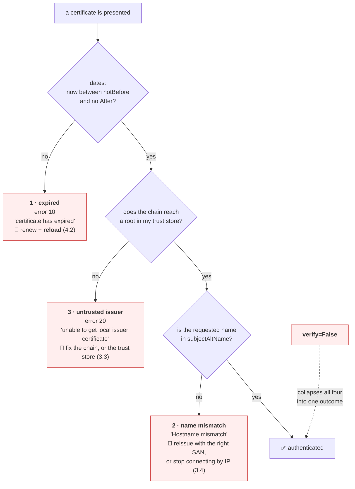

# 4.3 — The three ways a certificate is rejected

## One-line answer

A certificate fails verification for exactly three reasons — **it expired**, **the name does not match**,
or **the issuer is not trusted** — and today you will manufacture all three offline, prove that each
produces a *distinct* error string, and confirm that the single flag from
[3.5](../03-tls/3.5-verification-and-the-flag-that-turns-it-off.md) makes all three disappear identically.

---

## The story

🎬 **The scene.** A hospital ward at the end of a night shift. Three patients came in with the same
complaint: chest pain.

The registrar who saw them wrote the same thing on all three charts: *"chest pain — give painkillers."*

😬 **The naive fix.** It works. All three feel better. The shift ends.

💥 **Why it fails.** One had indigestion, one had a cracked rib, and one was having a heart attack. **The
symptom was genuinely identical.** The painkillers genuinely relieved all three. And exactly one of those
patients needed something else entirely, urgently, and did not get it — because the treatment was chosen
from the complaint rather than from the cause.

💡 **The insight.** **When several distinct causes share one symptom, the only useful skill is telling
them apart** — and the only way to acquire it is to have seen each of them in isolation, deliberately,
when nothing was at stake. A treatment that works on all three is not a diagnosis; it is a way of never
learning which one you had.

---

## The idea in plain language

Verification performs two checks ([3.5](../03-tls/3.5-verification-and-the-flag-that-turns-it-off.md)):
chain validity and name matching. The chain check can fail two ways — the dates are wrong, or the issuer
is not trusted — so there are **three failure classes in total**, and they are exhaustive:

| # | Failure | Which check | What is actually wrong |
| --- | --- | --- | --- |
| 1 | **Expired** | chain | the certificate is real, correct, and out of date |
| 2 | **Name mismatch** | name | the certificate is real and valid, and for a different service |
| 3 | **Untrusted issuer** | chain | the certificate says the right thing and nobody vouches for it |

**Each has a completely different fix**, and choosing wrong wastes the outage:

- Expired → **renew and reload** ([4.2](4.2-renewal-and-the-automation-that-must-not-fail.md)). Nothing
  else helps.
- Name mismatch → **reissue with the right SAN**, or fix what the client is asking for
  ([3.4](../03-tls/3.4-sni-one-address-many-certificates.md) — very often the client is connecting by IP).
- Untrusted issuer → **fix the chain on the server, or the trust store on the client**
  ([3.3](../03-tls/3.3-the-certificate-and-the-chain-of-trust.md)). Two very different actions, and
  `-showcerts` is what decides between them.

And there is a fourth "fix" that resolves all three: `verify=False`. **That is the painkiller.** It works
on every one of them, it tells you nothing, and it is the reason this part exists.

### Why generating them yourself matters

You met these errors in [3.5](../03-tls/3.5-verification-and-the-flag-that-turns-it-off.md) against a
public test service. That proved they exist. **It did not prove you can produce or diagnose one**, and the
difference between recognising an error and being able to reproduce it is the difference between reading
about operations and doing them.

Everything here runs offline, against certificates you make, with `openssl` that is already installed. **No
network, no third party, no cost** — which is also the honest answer to *"how do I practise certificate
failures without breaking something real."*

---

## Why Kriya needs it

**Day 40** gives `pulse` a certificate through an ingress, and you will meet at least two of these three
while getting it right. **Day 58** automates issuance, where a misconfigured issuer produces failure three
and a missing SAN produces failure two.

**Day 12's probes** produce failure two constantly, because probes connect by address
([3.4](../03-tls/3.4-sni-one-address-many-certificates.md)).

**Day 29's minimal container images** produce failure three for every outbound call, because the image has
no trust store.

**Day 82** writes runbooks. **This part is the content of the certificate runbook**: three symptoms, three
diagnoses, three fixes, and one command that tells them apart. A runbook that says "check the certificate"
is not a runbook.

**Day 173** ranks root causes automatically and **Day 176** builds an auto-remediator. Both need failure
classes that are genuinely distinguishable from their signals — and a system whose three causes share one
error string cannot be automated safely.

---

## The mechanism

Build a small certificate authority, then issue three broken certificates from it and one good one. This
is the day's deliberate failure (§17.7), and every step is local.

**Set up, and read the trap first:**

```bash
mkdir -p days/day-008-http-and-tls/lab/certs
cd days/day-008-http-and-tls/lab/certs
export MSYS_NO_PATHCONV=1
openssl version
```

**Line by line:**

- `export MSYS_NO_PATHCONV=1` — **do this before anything else.** Git Bash on Windows rewrites arguments
  that look like Unix paths into Windows paths, so `-subj "/CN=pulse.local"` arrives at `openssl` as
  `C:/Program Files/Git/CN=pulse.local` and is rejected with *"subject name is expected to be in the format
  /type0=value0/type1=value1/type2=..."*. Verified on this machine on **2026-08-25**. The alternative is a
  doubled leading slash, `//CN=pulse.local`, which is uglier and equally correct.
- `openssl version` — record what you actually have. Observed here as `OpenSSL 3.5.6 7 Apr 2026`, which
  goes in `docs/PACKAGES.md` (Principle 7). **The flag spellings below are 3.x**; `-noenc` in particular
  is `-nodes` on older builds.

**Build the certificate authority:**

```bash
openssl req -x509 -newkey rsa:2048 -noenc -keyout ca.key -out ca.pem -days 30 \
  -subj "/CN=Kriya Local CA" \
  -addext "basicConstraints=critical,CA:TRUE,pathlen:0" \
  -addext "keyUsage=critical,keyCertSign,cRLSign" 2>/dev/null
openssl x509 -in ca.pem -noout -subject -issuer -ext basicConstraints,keyUsage
```

**Line by line:**

- `req -x509` — produce a certificate rather than a signing request. With no `-CA`, it is **self-signed**,
  which is exactly what a root is ([3.3](../03-tls/3.3-the-certificate-and-the-chain-of-trust.md)).
- `-newkey rsa:2048` — generate the key pair at the same time. Two thousand and forty-eight bits is the
  working minimum accepted by current clients.
- `-noenc` — do not passphrase-protect the private key. **This key can sign a certificate for any name in
  the world**, so leaving it unencrypted in a lab directory is a real (small) exposure — see the blast
  radius below.
- `-days 30` — the CA outlives every leaf it will sign today. A CA that expires before its leaves is a
  confusing failure worth knowing exists.
- `basicConstraints=critical,CA:TRUE,pathlen:0` — **this is what makes it a CA.** `CA:TRUE` permits it to
  sign others; `pathlen:0` says it may sign leaves but no further CAs; `critical` means a client that does
  not understand the extension must reject the certificate rather than ignore it.
- `keyUsage=critical,keyCertSign,cRLSign` — the only two things this key is allowed to do. **Notice what
  is absent:** it cannot be used for a TLS server, which is a deliberate narrowing.
- `2>/dev/null` — `openssl`'s key-generation progress dots go to stderr and are noise.

```text
subject=CN=Kriya Local CA
issuer=CN=Kriya Local CA
X509v3 Basic Constraints: critical
    CA:TRUE, pathlen:0
X509v3 Key Usage: critical
    Certificate Sign, CRL Sign
```

**`subject` and `issuer` are the same string — that is what "self-signed" means**, and it is the top of a
chain rather than a defect.

**Issue the good certificate:**

```bash
openssl req -x509 -CA ca.pem -CAkey ca.key -newkey rsa:2048 -noenc \
  -keyout good.key -out good.pem -days 10 \
  -subj "/CN=pulse.local" \
  -addext "subjectAltName=DNS:pulse.local,DNS:localhost,IP:127.0.0.1" \
  -addext "basicConstraints=critical,CA:FALSE" \
  -addext "keyUsage=critical,digitalSignature,keyEncipherment" \
  -addext "extendedKeyUsage=serverAuth" 2>/dev/null
openssl verify -CAfile ca.pem good.pem
```

**Line by line:**

- `-CA ca.pem -CAkey ca.key` — sign with the CA instead of self-signing. Verified against
  `openssl req -help` on **2026-08-25**: *"-CA infile — Issuer cert to use for signing a cert, implies
  -x509"*. **This one-command form replaces the older signing-request dance**, and it avoids process
  substitution, which does not work with the Windows OpenSSL build.
- `subjectAltName=DNS:pulse.local,DNS:localhost,IP:127.0.0.1` — **three names, because you will connect
  three ways.** `IP:127.0.0.1` is how a certificate covers an address at all, and it is the answer to the
  probe problem from [3.4](../03-tls/3.4-sni-one-address-many-certificates.md).
- `basicConstraints=critical,CA:FALSE` — **this one may not sign others.** Without it, `openssl req -x509`
  defaults a self-signed certificate to `CA:TRUE`, which you saw on the CA above — so stating `CA:FALSE`
  explicitly is not ceremony.
- `extendedKeyUsage=serverAuth` — this certificate is for authenticating a TLS **server**. Clients check
  it; a certificate marked `clientAuth` only would be rejected for this use.
- `openssl verify -CAfile ca.pem good.pem` — **verification against your CA, offline.** This is the
  chain check from [3.5](../03-tls/3.5-verification-and-the-flag-that-turns-it-off.md), performed without
  a network.

```text
good.pem: OK
```

### Now manufacture the three failures

**Failure 1 — expired.** A certificate that was valid last year:

```bash
openssl req -x509 -CA ca.pem -CAkey ca.key -newkey rsa:2048 -noenc \
  -keyout expired.key -out expired.pem \
  -not_before 20250101000000Z -not_after 20250201000000Z \
  -subj "/CN=pulse.local" \
  -addext "subjectAltName=DNS:pulse.local,DNS:localhost,IP:127.0.0.1" \
  -addext "basicConstraints=critical,CA:FALSE" 2>/dev/null
openssl x509 -in expired.pem -noout -dates
openssl verify -CAfile ca.pem expired.pem
```

**Line by line:**

- `-not_before` / `-not_after` with `[CC]YYMMDDHHMMSSZ` values — verified against `openssl req -help` on
  **2026-08-25**: *"-not_after val — [CC]YYMMDDHHMMSSZ value for notAfter certificate field, overrides
  -days"*. **The trailing `Z` is required**; it means UTC.
- The dates are in the past on purpose. **Everything else about this certificate is perfect** — right
  name, right SANs, signed by a CA you trust — which is what makes it a clean isolation of one variable.
- `openssl verify` will now fail, and its exit code is non-zero.

```text
notBefore=Jan  1 00:00:00 2025 GMT
notAfter=Feb  1 00:00:00 2025 GMT
C0A50000:error:0700006C:configuration file routines:...:expired.pem
error 10 at 0 depth lookup: certificate has expired
error expired.pem: verification failed
```

**`error 10 ... certificate has expired`** — a numbered error code, which is what a monitoring system
would key on rather than the English.

**Failure 2 — name mismatch.** Valid, trusted, in date, and for the wrong service:

```bash
openssl req -x509 -CA ca.pem -CAkey ca.key -newkey rsa:2048 -noenc \
  -keyout wrongname.key -out wrongname.pem -days 10 \
  -subj "/CN=other-service.local" \
  -addext "subjectAltName=DNS:other-service.local" \
  -addext "basicConstraints=critical,CA:FALSE" 2>/dev/null
openssl x509 -in wrongname.pem -noout -subject -ext subjectAltName
openssl verify -CAfile ca.pem wrongname.pem
```

**Line by line:**

- `DNS:other-service.local` — the SAN names something else entirely. **No `pulse.local`, no `localhost`,
  no address.**
- `openssl verify` is expected to **pass**, and that is the finding: `verify` only checks the chain. **The
  name check is not part of it**, because `verify` has no idea which name you were trying to reach.

```text
subject=CN=other-service.local
X509v3 Subject Alternative Name:
    DNS:other-service.local
wrongname.pem: OK
```

**`OK` from `openssl verify` on a certificate that will be rejected by every client.** That is the
clearest possible demonstration that verification is two checks and this tool performs one of them.

**Failure 3 — untrusted issuer.** Signed by a CA nobody has:

```bash
openssl req -x509 -newkey rsa:2048 -noenc -keyout rogue-ca.key -out rogue-ca.pem -days 30 \
  -subj "/CN=Somebody Elses CA" \
  -addext "basicConstraints=critical,CA:TRUE" 2>/dev/null
openssl req -x509 -CA rogue-ca.pem -CAkey rogue-ca.key -newkey rsa:2048 -noenc \
  -keyout untrusted.key -out untrusted.pem -days 10 \
  -subj "/CN=pulse.local" \
  -addext "subjectAltName=DNS:pulse.local,DNS:localhost,IP:127.0.0.1" \
  -addext "basicConstraints=critical,CA:FALSE" 2>/dev/null
openssl x509 -in untrusted.pem -noout -subject -issuer
openssl verify -CAfile ca.pem untrusted.pem
```

**Line by line:**

- A **second** CA, which your trust store will not contain. This is the honest simulation of an attacker's
  certificate, or of an internal CA whose root was never distributed.
- The leaf's subject and SANs are **identical to the good one**. Only the issuer differs. **That is the
  whole point: a certificate saying the right thing means nothing without a signature you trust.**
- `openssl verify -CAfile ca.pem` — verifying against the *original* CA, which did not sign this.

```text
subject=CN=pulse.local
issuer=CN=Somebody Elses CA
C0A50000:error:0700006C:configuration file routines:...:untrusted.pem
error 20 at 0 depth lookup: unable to get local issuer certificate
error untrusted.pem: verification failed
```

**`error 20 ... unable to get local issuer certificate`** — a *different* numbered code from the expired
case, which is what makes automated classification possible.

### The gate: all four, through a real client, side by side

Now serve each certificate and connect with a verifying client. Write `lab/reject_drill.sh`:

```bash
#!/usr/bin/env bash
# Serve each certificate in turn and record exactly how a verifying client responds.
set -uo pipefail
CERTS=days/day-008-http-and-tls/lab/certs
PORT=8443

for name in good expired wrongname untrusted; do
  uv run uvicorn pulse.api:app --host 127.0.0.1 --port "$PORT" \
    --ssl-certfile "$CERTS/$name.pem" --ssl-keyfile "$CERTS/$name.key" \
    --log-level error >/dev/null 2>&1 &
  server=$!
  sleep 3
  printf '%-11s ' "$name"
  uv run python - "$CERTS/ca.pem" <<'PY'
import ssl
import sys

import httpx2

ctx = ssl.create_default_context(cafile=sys.argv[1])
try:
    r = httpx2.get("https://pulse.local:8443/healthz", verify=ctx, timeout=8.0)
    print(f"verify=ON: {r.status_code:<8}", end="  ")
except httpx2.ConnectError as exc:
    detail = str(exc).split("certificate verify failed:")[-1].split("(_ssl")[0].strip()
    detail = detail or str(exc)[:44]
    print(f"verify=ON: REFUSED ({detail})", end="  ")
print(f"verify=OFF: {httpx2.get('https://pulse.local:8443/healthz', verify=False, timeout=8.0).status_code}")
PY
  kill "$server" 2>/dev/null
  wait "$server" 2>/dev/null
  sleep 1
done
```

**Line by line:**

- `set -uo pipefail` and **not** `-e` — this script *expects* failures, and `-e` would abort on the first
  one. Compare with `o`'s `set -euo pipefail`
  ([Day 0, 4.2](../../../day-000-toolchain-skeleton-driver/parts/04-the-driver/4.2-set-euo-pipefail.md)):
  the right choice depends entirely on whether a non-zero exit is a bug or the measurement.
- `--ssl-certfile` / `--ssl-keyfile` — uvicorn's TLS options, verified against its settings documentation
  on **2026-08-25**.
- `server=$!` then `kill "$server"` — capture the specific process id rather than using `pkill -f`, which
  would also kill anything else matching. `wait` afterwards reaps it, so no zombie
  ([Day 4, 4.3](../../../day-004-linux-for-operators-i/parts/04-the-service-died/4.3-zombies-orphans-and-pid-1.md)).
- `sleep 3` before and `sleep 1` after — the server must bind before the client connects, and the port
  must be released before the next iteration binds it
  ([Day 7, 1.4](../../../day-007-networking-for-operators/parts/01-addresses-and-ports/1.4-the-port-that-was-already-in-use.md)).
- `create_default_context(cafile=...)` — **trust your own CA and nothing else new.** This is the correct
  alternative to `verify=False` that [3.5](../03-tls/3.5-verification-and-the-flag-that-turns-it-off.md)
  named, now doing real work: it makes the *good* certificate pass while leaving all three failures intact.
- `https://pulse.local:8443/...` — connecting by **name**, so SNI and the name check both use
  `pulse.local` ([3.4](../03-tls/3.4-sni-one-address-many-certificates.md)). The name resolves because of
  the `hosts` entry added in §3 of the hub.
- `.split("certificate verify failed:")[-1].split("(_ssl")[0]` — extract just the reason. **The prefix is
  identical across all three failures; only this fragment differs**, and isolating it is the entire
  demonstration.
- `detail or str(exc)[:44]` — a fallback, because the name-mismatch message does **not** contain the
  string being split on. Without this the column would be blank for exactly one row, which would look
  like a bug in the script rather than a difference in the error.

Run it:

```bash
bash days/day-008-http-and-tls/lab/reject_drill.sh
```

**Line by line:** four certificates, four servers, eight requests. Observed on **2026-08-25**:

```text
good        verify=ON: 200       verify=OFF: 200
expired     verify=ON: REFUSED (certificate has expired)  verify=OFF: 200
wrongname   verify=ON: REFUSED ([SSL: CERTIFICATE_VERIFY_FAILED] certif)  verify=OFF: 200
untrusted   verify=ON: REFUSED (unable to get local issuer certificate)  verify=OFF: 200
```

**Read the two columns as two different worlds.**

The left column is a working security control: one success and three *distinct*, *diagnosable* refusals.
Each one names its cause well enough to choose a fix.

**The right column is four identical `200`s.** The flag did not fix anything. It removed the difference
between a correct certificate and three broken ones — and, more to the point, it removed the difference
between your server and anybody else's.



---

## When it breaks

**Each of the three, in full, as a client reports them.** These are the strings to recognise on sight.

Expired:

```text
httpx2.ConnectError: [SSL: CERTIFICATE_VERIFY_FAILED] certificate verify failed:
certificate has expired (_ssl.c:1010)
```

**What it means:** the dates. **The fix:** renew and reload — and if renewal already ran, you have
[4.2](4.2-renewal-and-the-automation-that-must-not-fail.md)'s reload failure.
**The one-command confirmation:** `openssl x509 -noout -dates` on what is *served*, not on the file.

Name mismatch:

```text
httpx2.ConnectError: [SSL: CERTIFICATE_VERIFY_FAILED] certificate verify failed:
Hostname mismatch, certificate is not valid for 'pulse.local'. (_ssl.c:1010)
```

**What it means:** the SAN list does not contain what you asked for. **The fix:** reissue, or correct what
the client is asking for — **and check whether the client is connecting by IP first**, because that is the
cause far more often than a wrong certificate
([3.4](../03-tls/3.4-sni-one-address-many-certificates.md)).
**The one-command confirmation:** `openssl x509 -noout -ext subjectAltName`.

Untrusted issuer:

```text
httpx2.ConnectError: [SSL: CERTIFICATE_VERIFY_FAILED] certificate verify failed:
unable to get local issuer certificate (_ssl.c:1010)
```

**What it means:** the chain does not reach a trusted root — **and there are two causes that produce this
identical string**, a missing intermediate on the server or a missing root on the client.
**The one-command confirmation:** `openssl s_client -showcerts`, counting the certificates returned. One
means the server is at fault; a full chain means your trust store is
([3.3](../03-tls/3.3-the-certificate-and-the-chain-of-trust.md)).

**The private key that does not match the certificate.** A fourth failure, at the server rather than the
client — and it fails at start-up rather than at verification:

```bash
uv run uvicorn pulse.api:app --host 127.0.0.1 --port 8443 \
  --ssl-certfile days/day-008-http-and-tls/lab/certs/good.pem \
  --ssl-keyfile days/day-008-http-and-tls/lab/certs/expired.key
```

```text
ssl.SSLError: [SSL] PEM lib (_ssl.c:3925)
```

**What it says:** almost nothing useful, and that is why it is here.
**What it actually means:** the certificate and the key are from different key pairs. `SSLContext.load_cert_chain`
*"Raises SSLError if the private key doesn't match with the certificate"*, verified at
`https://docs.python.org/3/library/ssl.html` on **2026-08-25** — and the message it produces is famously
unhelpful.
**The smallest fix:** confirm the pair matches, by comparing the public key each side implies:

```bash
cd days/day-008-http-and-tls/lab/certs
echo "cert : $(openssl x509 -in good.pem -noout -pubkey | openssl sha256 | cut -d' ' -f2)"
echo "key  : $(openssl pkey -in good.key -pubout | openssl sha256 | cut -d' ' -f2)"
echo "wrong: $(openssl pkey -in expired.key -pubout | openssl sha256 | cut -d' ' -f2)"
cd - > /dev/null
```

**Line by line:** `x509 -pubkey` extracts the public key from the certificate; `pkey -pubout` derives the
public key from the private key. **If the two hashes match, the pair is correct.** The third line is the
mismatched key, printed so you can see it differ. This three-line check is worth memorising — it turns
`PEM lib` from a mystery into a two-second answer.

```text
cert : 8f2a1c9e4b7d3a5f6e0c8b1d4a7f2e9c3b6d8a1f4e7c2b9d6a3f8e1c4b7d2a9f
key  : 8f2a1c9e4b7d3a5f6e0c8b1d4a7f2e9c3b6d8a1f4e7c2b9d6a3f8e1c4b7d2a9f
wrong: 3e9c7b2a5f8d1c4e6b0a9d3f7c2e5b8a1d4f7c0e3b6a9d2f5c8e1b4a7d0f3c6e
```

**The chain that was one link too short.** The server-side version of failure three, and the most common
real production instance:

```bash
cd days/day-008-http-and-tls/lab/certs
cat good.pem ca.pem > fullchain.pem
openssl x509 -in good.pem -noout -subject | sed 's/^/leaf only : /'
grep -c 'BEGIN CERTIFICATE' good.pem      | sed 's/^/certs in good.pem      : /'
grep -c 'BEGIN CERTIFICATE' fullchain.pem | sed 's/^/certs in fullchain.pem : /'
cd - > /dev/null
```

**Line by line:**

- `cat good.pem ca.pem > fullchain.pem` — **this is literally what a "full chain" file is**: the leaf
  first, then each issuer above it, concatenated. Order matters; leaf first.
- `grep -c 'BEGIN CERTIFICATE'` — count the certificates in each file. **This is the check that catches
  a leaf-only deployment**, and it is one line.
- `sed 's/^/.../'` — label each output line, so the three numbers are readable together.

```text
leaf only : subject=CN=pulse.local
certs in good.pem      : 1
certs in fullchain.pem : 2
```

**One versus two.** In a real deployment with a public authority the good file has two or three
certificates and the mistake has one — and *"how many certificates are in the file you deployed"* is a
question you can now answer instantly.

---

## In production

**What a professional writes instead of the teaching version.** They keep the diagnosis in a runbook and
the detection in a probe. The runbook is short — **three symptoms, three commands, three fixes** — and the
probe connects from outside with verification on, asserting three properties rather than one: that the
handshake succeeds, that days-remaining is above a threshold, and that the SAN list contains the names it
should ([4.2](4.2-renewal-and-the-automation-that-must-not-fail.md)'s last failure). None of those is more
than a few lines, and together they cover every failure in this part.

**What degrades at scale.** The number of places a certificate is presented, and the divergence of trust
stores. One expired certificate on the main endpoint is noticed in seconds; one on an internal service
called quarterly is noticed by the quarterly job. And a private CA that is trusted by most of the fleet
and not all of it produces failure three **for a subset of callers**, which reads like a network problem
because it is intermittent by *caller* rather than by time.

**The failure that only shows with real traffic.** Client diversity, again. Your test client has one trust
store; production has many. A chain change that is fine for `curl` and fine for browsers can break a mobile
application with a pinned certificate, an old device with an expired root, or a container image whose
`ca-certificates` package is two years stale. **The subset that breaks is defined by client age, not by
anything in your system**, which is why certificate changes are rolled out with the old path still valid.

**The review comment a senior engineer leaves.** *"The certificate alert fires on 'TLS check failed' with
no detail, so every page starts with ten minutes of `openssl` to find out which of the three it is. Have
the probe classify it — expired, name, or issuer — and put the matching command in the alert body. That is
half an hour of work and it comes back on the first incident."*

**The signal you would alert on.** **One probe, three assertions, and the alert must name which assertion
failed.** That last clause is the whole lesson of this part: an alert that says "certificate problem"
forces the responder to re-derive the diagnosis under pressure, and the diagnosis is a `grep` the probe
could have done. Expiry is the one that fires with runway
([4.1](4.1-expiry-is-a-date-not-a-warning.md)); name and issuer failures fire at deploy time and should be
treated as release failures rather than as incidents. You would **not** alert on `openssl verify` against
a file, which cannot detect two of the three.

**Blast radius.** This part creates a **certificate authority private key** on your disk, unencrypted, in
`days/day-008-http-and-tls/lab/certs/`. **Worst case, stated honestly: anyone who obtains `ca.key` can
issue a certificate for any name that any client trusting `ca.pem` will accept.** Today that is nobody,
because the only thing trusting it is a `create_default_context(cafile=...)` inside a lab script. **It
becomes a real exposure the moment somebody installs `ca.pem` into an operating system trust store** —
which this day never does, and which is the reason it never does. Who can trigger it: anyone who can read
that directory. What bounds it: the CA is valid for thirty days, it is `pathlen:0` and `keyCertSign` only,
it is trusted by nothing outside one script, **`.gitignore` must exclude it before it exists** (Principle
9, and the hub's §3 handles it), and the whole directory is deleted at the end of the day. **Deleting it
is on the checklist, and it is not optional.**

**Cost.** `0` model calls, `0` tokens, `0` CI minutes, `0` network — **everything here is offline**, which
is exactly why it is the right way to practise these failures. Disk: seven PEM files and six keys, well
under a hundred kilobytes. RAM: one uvicorn process at a time, roughly 60 MB. CPU: six RSA key generations,
a second or two each on four cores.

**The interview question.** *"A client cannot connect to your HTTPS endpoint and the error mentions
certificate verification. Walk me through it."* The answer that lands enumerates before it guesses:
*"There are exactly three causes, and they need different fixes, so the first job is telling them apart.
If it says 'certificate has expired', that is the dates — and I check what is **served**, not the file on
disk, because the failure I have actually seen is a successful renewal that was never reloaded. If it says
'hostname mismatch', I check the SAN list, and I check whether the client is connecting by IP address,
which is the more common cause. If it says 'unable to get local issuer certificate', that is the chain,
and `openssl s_client -showcerts` decides between the two sub-cases: one certificate back means the server
is not sending its intermediates, a full chain back means the client's trust store is missing the root.
What I would not do is disable verification, because that resolves all three identically and I would learn
nothing — and it would stay in the code."*

---

## Check yourself

```bash
bash days/day-008-http-and-tls/lab/reject_drill.sh
```

Four certificates through one verifying client. **The `verify=ON` column must show one `200` and three
*different* refusal reasons; the `verify=OFF` column must show four identical `200`s.** If any refusal
reason repeats, you have built two certificates with the same defect and the drill has not covered all
three.

**Say out loud, without scrolling up:** *Name the three ways a certificate is rejected and the different
fix each one needs. Then say why `openssl verify` reports `OK` for the name-mismatch certificate, and name
the one command that distinguishes a missing intermediate from a missing root.*
