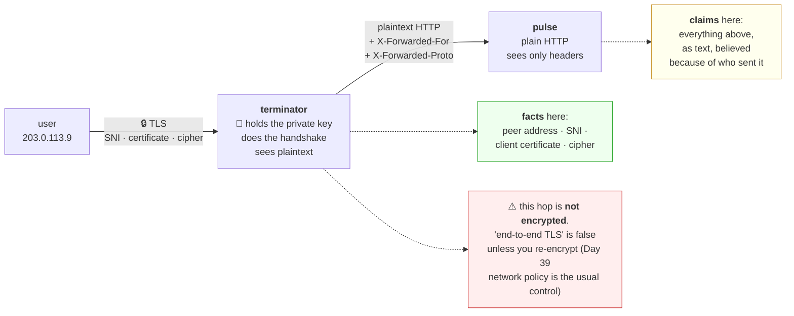

# 5.1 — Where TLS terminates, and what you stop seeing

## One-line answer

**Termination** is the point where the encrypted channel ends and plaintext begins, and moving it — from
your process to a proxy at the edge — buys you certificate management, HTTP/2 and per-request load
balancing, at the cost that **your service can no longer observe anything about the original connection**
and must instead believe a set of headers that anyone could have written.

---

## The story

🎬 **The scene.** A company that receives sealed letters from clients. For years each department opened
its own post.

Then they hire a post room. One person opens everything, reads the address, writes a note on the top of
each letter — *"came in by courier"*, *"from the Manchester office"*, *"marked urgent"* — and sends the
open pages upstairs in an internal envelope.

😬 **The naive fix.** Everyone upstairs treats the notes as facts. They are handwritten by a colleague, on
company paper, and they have always been right.

💥 **Why it fails.** The internal envelopes travel through a corridor anyone can walk down. Somebody drops
one in, addressed to accounts, with a note on top that says *"from the Manchester office"*. Nothing about
it is distinguishable from a real one. **The note was never a fact — it was the post room's testimony**,
and it only means anything if you know it came from the post room.

💡 **The insight.** **A trusted intermediary converts facts into claims, and a claim is only as good as
your ability to establish who made it.** The post room is a good idea; treating its notes as observations
is not. The fix is not to abolish the post room — it is to be precise about which pieces of paper you will
accept, and from whom.

---

## The idea in plain language

**TLS termination** is the point in the path where the encryption ends. Whoever terminates holds the
private key, does the handshake, and sees the plaintext request.

There are three arrangements, and each is a real production choice:

| Arrangement | Where the key lives | What your service sees | What it costs |
| --- | --- | --- | --- |
| **Termination at the edge** | proxy / ingress / load balancer | plain HTTP, plus headers | the hop from proxy to service is plaintext |
| **Passthrough** | your service | the real TLS connection | you manage certificates per replica; no L7 routing |
| **Re-encryption** | both — proxy decrypts, then re-encrypts | its own TLS from the proxy | two handshakes; two certificate sets |

**Termination at the edge is the normal choice**, and it is what Day 37's ingress will do. The reasons are
concrete: certificates are managed in one place
([4.2](../04-certificates-in-time/4.2-renewal-and-the-automation-that-must-not-fail.md)); the proxy can
route on path and header ([1.4](../01-the-message/1.4-headers-are-the-contract.md)) because it can read
them; and it can balance per request rather than per connection
([2.3](../02-the-connection/2.3-http2-multiplexing-and-what-it-does-not-fix.md)).

### What your service loses, precisely

The moment TLS terminates in front of you, four facts that used to be **observations** become **claims**:

| Fact | Before termination | After termination |
| --- | --- | --- |
| the client's address | the socket's peer address — a TCP fact | `X-Forwarded-For`, a header |
| whether the request was HTTPS | you did the handshake | `X-Forwarded-Proto`, a header |
| the hostname requested | SNI, in the handshake | `Host`, a header |
| the client's certificate (mutual TLS) | the peer certificate | a header the proxy synthesises |

**All four move from the transport layer to the application layer**, and the application layer is text
anyone can write. That is the whole security consequence of termination, and it is why
[1.4](../01-the-message/1.4-headers-are-the-contract.md) spent a section on trusting `X-Forwarded-For`.

### The rule that makes it safe

**Trust a forwarded header only from an address you have named, and strip it from everyone else.**

Both halves matter. Naming the trusted proxies is obvious. **Stripping the header at the edge is the half
people forget**: if a client can send `X-Forwarded-For` and your proxy *appends* rather than *replaces*,
the header arrives at your service as a list whose first entry is attacker-controlled — and code that
naively takes the first entry as "the real client" is reading a value the attacker chose.

uvicorn implements this with two settings, verified against its settings documentation on **2026-08-25**:
`--proxy-headers` / `--no-proxy-headers` manages `X-Forwarded-Proto` and `X-Forwarded-For` and is *enabled
by default but restricted to `forwarded-allow-ips`*, and `--forwarded-allow-ips` defaults to
`$FORWARDED_ALLOW_IPS` or `127.0.0.1`, with `'*'` meaning trust all sources.

**Read that as a design worth copying: the feature is on, and the trust list is tiny.** The dangerous
configuration exists and you have to type it.

### The `X-Forwarded-Proto` trap that produces a redirect loop

A service that redirects HTTP to HTTPS needs to know whether the request *arrived* over HTTPS. After
termination it did not — the hop it can see is plaintext — so it must read `X-Forwarded-Proto`.

If that header is missing or ignored, the service sees "HTTP", redirects to HTTPS, the proxy terminates the
new request and forwards it as HTTP again, and the service redirects again. **An infinite redirect loop
caused by a missing header**, and the browser reports it as `ERR_TOO_MANY_REDIRECTS` with no clue as to
which component is responsible.

---

## Why Kriya needs it

**Day 37** puts an ingress controller in front of `pulse` and terminates TLS there. Every fact in this part
becomes operational that day.

**Day 34's Service** and **Day 39's network policy** define the plaintext hop between the proxy and the pod
— which is the segment this arrangement leaves unencrypted, and network policy is one of the controls that
makes that acceptable.

**Day 62's RED metrics** and **Day 67's structured logs** both record a client address, and after
termination that value is a header. **A logging pipeline that records the wrong address is an audit trail
that names the wrong actor**, which is Day 220's concern.

**Day 78** sets an SLI, and a request that failed at the proxy never reached your service — so your own
success rate can be perfect while the user-visible one is not. **The measurement point and the termination
point are the same question.**

**Day 205** authenticates MCP servers, where mutual TLS at the edge produces exactly the "certificate as a
header" row in the table above.

---

## The mechanism

Build the two-hop arrangement locally and watch the facts turn into claims. You need a terminating proxy;
rather than installing one, write a minimal one so that nothing about it is a mystery.

Write `lab/terminator.py`:

```python
"""A minimal TLS-terminating proxy: accepts HTTPS, forwards plain HTTP, adds the headers."""

import os

import httpx2
from fastapi import FastAPI, Request, Response

UPSTREAM = os.environ.get("UPSTREAM", "http://127.0.0.1:8000")
STRIP_INBOUND = {"x-forwarded-for", "x-forwarded-proto", "x-forwarded-host", "forwarded"}
HOP_BY_HOP = {"connection", "keep-alive", "transfer-encoding", "upgrade", "te", "trailer"}

app = FastAPI(docs_url=None, redoc_url=None)
client = httpx2.AsyncClient(timeout=10.0)


@app.api_route("/{path:path}", methods=["GET", "POST", "PUT", "DELETE", "HEAD"])
async def forward(path: str, request: Request) -> Response:
    outbound = {
        name: value
        for name, value in request.headers.items()
        if name.lower() not in STRIP_INBOUND and name.lower() not in HOP_BY_HOP
    }
    outbound["x-forwarded-for"] = request.client.host if request.client else "unknown"
    outbound["x-forwarded-proto"] = "https"
    outbound["x-forwarded-host"] = request.headers.get("host", "")

    upstream = await client.request(
        request.method,
        f"{UPSTREAM}/{path}",
        content=await request.body(),
        headers=outbound,
    )
    passthrough = {
        name: value for name, value in upstream.headers.items() if name.lower() not in HOP_BY_HOP
    }
    return Response(
        content=upstream.content, status_code=upstream.status_code, headers=passthrough
    )
```

**Line by line:**

- `STRIP_INBOUND` — **the half people forget.** Any `X-Forwarded-*` arriving from a client is discarded
  before anything else happens, so a caller cannot pre-set its own address. **This is the strip half of
  the rule**, and without it everything below is decorative.
- `HOP_BY_HOP` — headers that describe *this* connection and must not be forwarded
  ([1.4](../01-the-message/1.4-headers-are-the-contract.md)). Forwarding `Connection: close` would
  propagate a client's decision about its own connection into the proxy's pool
  ([2.1](../02-the-connection/2.1-keep-alive-and-the-connection-you-reuse.md)).
- `httpx2.AsyncClient(timeout=10.0)` at module level — **one pooled client for the process lifetime**, not
  one per request ([2.2](../02-the-connection/2.2-the-connection-pool-and-its-limits.md)). A proxy that
  built a client per request would handshake per request, which is the exact anti-pattern
  [3.2](../03-tls/3.2-the-handshake-and-what-it-costs.md) measured.
- `@app.api_route("/{path:path}", methods=[...])` — a catch-all route. The `:path` converter is what allows
  the captured value to contain slashes; a plain `{path}` would match one segment only.
- `outbound["x-forwarded-for"] = request.client.host` — **the observation, converted into a claim.** This
  is the exact line where a TCP fact becomes a piece of text. Everything downstream believes it because of
  where it came from, not because of anything in the header.
- `x-forwarded-proto = "https"` — hard-coded, because this proxy only listens on TLS. A real proxy sets it
  from the actual scheme of the inbound connection.
- `content=await request.body()` — read the body once and forward it. Note that this **buffers**: a real
  proxy streams, and a buffering proxy is a memory risk on large uploads
  ([Day 6](../../../day-006-resources-and-the-oom-killer/parts/01-memory/1.1-virtual-memory-and-why-the-number-is-a-lie.md)).
  Naming that limitation is part of the teaching.
- The response filter — the same hop-by-hop rule on the way back, because `Transfer-Encoding` from the
  upstream describes the upstream's connection, not this one. **Forwarding it produces a body the client
  cannot frame** ([1.1](../01-the-message/1.1-a-request-is-text-with-a-shape.md)).

Now start the two hops. `pulse` on plain HTTP, the terminator on TLS in front of it, using the certificate
from [4.3](../04-certificates-in-time/4.3-the-three-ways-a-certificate-is-rejected.md):

```bash
uv run uvicorn pulse.api:app --host 127.0.0.1 --port 8000 --log-level warning &
CERTS=days/day-008-http-and-tls/lab/certs
uv run uvicorn --app-dir days/day-008-http-and-tls/lab terminator:app \
  --host 127.0.0.1 --port 8443 \
  --ssl-certfile "$CERTS/good.pem" --ssl-keyfile "$CERTS/good.key" \
  --log-level warning &
sleep 3
netstat -ano | grep -iE ':(8000|8443).*listening'
```

**Line by line:**

- Two servers: `pulse` on 8000 in the clear, the terminator on 8443 with TLS. **This is the production
  arrangement in miniature** — the encrypted segment stops at the proxy and the second hop is plaintext.
- `--ssl-certfile` / `--ssl-keyfile` — uvicorn's TLS options, verified **2026-08-25**.
- The `netstat` confirms both bound before anything is sent, so a later connection error is not misread
  ([Day 7, 1.4](../../../day-007-networking-for-operators/parts/01-addresses-and-ports/1.4-the-port-that-was-already-in-use.md)).

Now watch a fact become a claim. Use the echo endpoint from
[1.4](../01-the-message/1.4-headers-are-the-contract.md):

```bash
CERTS=days/day-008-http-and-tls/lab/certs
echo "--- direct to pulse, plain HTTP: the TCP peer IS the client ---"
curl -sS http://127.0.0.1:8000/healthz -w '\n'
echo "--- through the terminator over HTTPS ---"
curl -sS --cacert "$CERTS/ca.pem" --resolve pulse.local:8443:127.0.0.1 \
  https://pulse.local:8443/healthz -w '\n'
```

**Line by line:**

- `--cacert "$CERTS/ca.pem"` — **trust your own CA for this one request.** Not `-k`. This is the correct
  narrowing from [3.5](../03-tls/3.5-verification-and-the-flag-that-turns-it-off.md), and it means an
  expired or wrong-named certificate would still be refused.
- `--resolve pulse.local:8443:127.0.0.1` — connect to loopback while keeping the name for SNI, `Host` and
  verification ([3.4](../03-tls/3.4-sni-one-address-many-certificates.md)). **This is why no `hosts` file
  edit is needed for `curl`.**
- `-w '\n'` — a trailing newline, because these endpoints return JSON with none.

```text
--- direct to pulse, plain HTTP: the TCP peer IS the client ---
{"status":"ok"}
--- through the terminator over HTTPS ---
{"status":"ok"}
```

**Identical from the outside, and completely different underneath.** Show the difference by asking `pulse`
what it saw. Point the terminator at the echo service instead:

```bash
UPSTREAM=http://127.0.0.1:8024 uv run uvicorn --app-dir days/day-008-http-and-tls/lab terminator:app \
  --host 127.0.0.1 --port 8444 \
  --ssl-certfile days/day-008-http-and-tls/lab/certs/good.pem \
  --ssl-keyfile days/day-008-http-and-tls/lab/certs/good.key --log-level warning &
sleep 3
echo "--- what the upstream sees, through the terminator ---"
curl -sS --cacert days/day-008-http-and-tls/lab/certs/ca.pem \
  --resolve pulse.local:8444:127.0.0.1 \
  -H 'X-Forwarded-For: 203.0.113.99' \
  https://pulse.local:8444/echo | uv run python -m json.tool
```

**Line by line:**

- `UPSTREAM=http://127.0.0.1:8024` — the echo service from
  [1.4](../01-the-message/1.4-headers-are-the-contract.md), which must be running.
- `-H 'X-Forwarded-For: 203.0.113.99'` — **a spoofed header, sent deliberately.** The terminator's
  `STRIP_INBOUND` should discard it and substitute the real peer address.
- `python -m json.tool` — pretty-print the JSON, so the header list is readable.

```text
--- what the upstream sees, through the terminator ---
{
    "client": "127.0.0.1",
    "headers": {
        "host": "pulse.local:8444",
        "accept": "*/*",
        "user-agent": "curl/8.16.0",
        "x-forwarded-for": "127.0.0.1",
        "x-forwarded-proto": "https",
        "x-forwarded-host": "pulse.local:8444"
    }
}
```

**Three things happened, and each one is the point of a different table above.**

The spoofed `203.0.113.99` is **gone** — stripped at the edge and replaced with the observed peer. That is
the strip half of the rule doing its job.

`x-forwarded-proto: https` is the **only** evidence the upstream has that TLS was ever involved. Its own
connection was plaintext. Delete that header and the upstream cannot distinguish an HTTPS request from a
plain one.

And `client` reads `127.0.0.1` — the *proxy's* address, not the user's. **Any log line, rate limiter or
audit record that uses the socket peer is now recording the proxy on every single request.**



### Proving the trust boundary matters

Now bypass the proxy and talk to the upstream directly, as an attacker inside the network would:

```bash
echo "--- direct to the upstream, spoofing the header the proxy would have set ---"
curl -sS -H 'X-Forwarded-For: 203.0.113.99' -H 'X-Forwarded-Proto: https' \
  http://127.0.0.1:8024/echo | uv run python -m json.tool | grep -E 'client|forwarded'
```

**Line by line:** the same spoofed headers, sent straight to the upstream with no proxy in between.
**Nothing strips them now**, because the stripping lived in the proxy that was skipped.

```text
    "client": "127.0.0.1",
        "x-forwarded-for": "203.0.113.99",
        "x-forwarded-proto": "https",
```

**The upstream accepted both.** It has no way to tell this request from one the proxy forwarded — the
headers are identical, and the only difference is the address the connection came from, which is exactly
the thing `--forwarded-allow-ips` exists to check. **The header is not the control; the trust list is.**

---

## When it breaks

**The redirect loop.** The classic termination bug:

```text
$ curl -sS -o /dev/null -w '%{http_code} %{redirect_url}\n' -L --max-redirs 5 https://api.example.com/
curl: (47) Maximum (5) redirects followed
```

and in a browser:

```text
ERR_TOO_MANY_REDIRECTS
```

**What it says:** the request kept being redirected.
**What it actually means:** the application redirects HTTP to HTTPS, and after termination **every request
it sees is HTTP**. It redirects; the proxy terminates the new request; it arrives as HTTP again.
**The smallest fix:** read `X-Forwarded-Proto`, and make sure the proxy sets it. In uvicorn that means
`--proxy-headers` with the proxy's address in `--forwarded-allow-ips`.
**Why it is confusing:** nothing is broken in either component. Each is behaving correctly on the
information it has, and the loop is a property of the pair.

**Every request logged from one address.** The silent one:

```text
2026-08-25T11:02:14Z INFO  request client=10.0.4.7  path=/predict  status=200
2026-08-25T11:02:14Z INFO  request client=10.0.4.7  path=/predict  status=200
2026-08-25T11:02:15Z INFO  request client=10.0.4.7  path=/predict  status=200
```

**What it says:** one very busy client.
**What it actually means:** `10.0.4.7` is the ingress. **Every request in the system is being attributed to
the proxy**, so per-client rate limiting limits nothing, abuse detection sees one actor, and the audit
trail names the wrong party.
**The smallest fix:** read the forwarded header instead of the socket peer — **and only from the trusted
range**, or you have replaced a useless value with an attacker-controlled one.
**How you notice:** the distinct-client-address count in your logs is suspiciously small and equal to the
number of ingress replicas.

**A trusted header from an untrusted source.** The dangerous one:

```text
$ curl -sS -H 'X-Forwarded-For: 127.0.0.1' https://api.example.com/admin/metrics
{"internal": true, "requests_total": 918273}
```

**What it says:** an internal-only endpoint answered.
**What it actually means:** something in the path decided "requests from `127.0.0.1` are internal" and read
that from a header a client can set. **An access control implemented on a claim rather than an
observation.**
**The smallest fix:** strip `X-Forwarded-*` at the edge, and never authorise on an address.
**The general rule worth carrying to Day 216:** **network position is not authentication.** It is a useful
signal and it is not a credential, and after termination it is not even a signal — it is a string.

**A `413` from a component you did not configure.** The invisible-limit case:

```text
HTTP/1.1 413 Content Too Large
server: nginx
content-length: 178
```

**What it says:** the body was too large.
**What it actually means:** the **proxy** rejected it. Your service has no limit configured and never saw
the request. Termination inserted a component with its own opinions about body size, header size, timeouts
and protocol versions, **and none of those appear in your configuration.**
**The smallest fix:** raise the proxy's limit, or reduce the payload — but first, find out which component
sent the response, which the `server` header usually reveals.
**The habit this teaches:** when a status code appears that your code cannot produce, identify the emitter
before investigating the cause ([1.3](../01-the-message/1.3-the-status-codes-an-operator-reads.md)).

**Mutual TLS that stopped being mutual.** The subtle one:

```text
$ curl -sS https://api.example.com/secure --cert client.pem --key client.key
{"error": "no client certificate presented"}
```

...with a valid client certificate.
**What it actually means:** the proxy terminates TLS, so **it** receives the client certificate and your
service does not. Unless the proxy is configured to verify it and forward the result as a header, the
information is destroyed at the termination point.
**The smallest fix:** configure client-certificate verification at the proxy and forward the subject as a
header — **and then trust that header only from the proxy**, which is the same rule as everything else in
this part.
**Why it is worth knowing now:** Day 205 authenticates MCP servers and this is exactly the arrangement it
lands in.

---

## In production

**What a professional writes instead of the teaching version.** They do not write a proxy — they configure
one, and what they own is the **header contract**: a written list of what the edge strips, what it adds and
what it forwards untouched, kept next to the routing rules and reviewed together
([1.4](../01-the-message/1.4-headers-are-the-contract.md)). In the application, the trusted-proxy list is
configuration rather than code, so it can change when the network does, and it is **never** `*`.

**What degrades at scale.** The number of hops, and the honesty of the phrase "end to end". A real path may
be CDN → load balancer → ingress → sidecar → service, with TLS terminated and re-established two or three
times and `X-Forwarded-For` growing one entry per hop. **The client's real address ends up somewhere in the
middle of a comma-separated list**, and "take the first entry" and "take the last entry" are both wrong —
the correct answer is to count back from the right by the number of hops you trust. Getting that arithmetic
wrong is a rate limiter that limits nobody.

**The failure that only shows with real traffic.** The plaintext segment. In a test everything is on
loopback and the hop from proxy to service is meaningless. In production it crosses a network — a pod
network, a VPC, sometimes a datacentre — and **that segment is unencrypted.** Nothing fails; the exposure
is simply real, and it is the reason network policy (Day 39) and service meshes exist. The moment somebody
asks *"is our traffic encrypted end to end"*, the honest answer requires knowing exactly where termination
happens, and the answer is very often "no, and here is the compensating control".

**The review comment a senior engineer leaves.** *"`--forwarded-allow-ips '*'` in the deployment means any
pod in the cluster can set `X-Forwarded-For` and we will believe it. Our rate limiter reads that header, so
right now anyone inside the network can bypass it with one header. Set it to the ingress's service CIDR."*

**The signal you would alert on.** **The count of requests carrying an `X-Forwarded-*` header from outside
the trusted range** — that is either a misconfiguration or a probe of your trust boundary, and both deserve
immediate attention. Second, **the distinct-client-address cardinality in your logs**: if it collapses to a
handful, you have started logging the proxy, and that is a silent degradation of every per-client signal
you own. You would **not** alert on the plaintext hop itself, which is a design property rather than an
event — it belongs in a threat model (Day 216), not in a pager.

**Blast radius.** This part introduces a genuine capability: a proxy that forwards arbitrary requests to an
upstream. **Worst case: an open forwarding proxy that lets anyone who can reach it make requests to
anything it can reach** — which is a real class of vulnerability, and one that has been used to reach cloud
metadata endpoints from the inside. It is bounded here by a hard-coded `UPSTREAM` that cannot be set
per-request, by binding to `127.0.0.1`, and by being deleted at the end of the day. **The rule worth
carrying: a proxy whose destination comes from the request is not a proxy, it is a vulnerability.** Who can
trigger it: anything on this machine. What bounds it: loopback, one fixed upstream, and the checklist entry
that deletes it.

**Cost.** `0` model calls, `0` tokens, `0` CI minutes, `0` network beyond loopback. Disk: reuses the
certificates from [4.3](../04-certificates-in-time/4.3-the-three-ways-a-certificate-is-rejected.md). **RAM:
three uvicorn processes at roughly 60 MB each, so about 180 MB** — stop the lab servers from sections 1 and
2 first, because this machine has four cores (Addendum 02 §3) and the `core` profile assumes one service,
not five.

**The interview question.** *"Where does TLS terminate in your system, and what does that mean for the
service?"* The answer that lands names the consequence rather than the topology: *"At the ingress, which is
the normal choice — it centralises certificate management, lets us route on path and header, and gives us
per-request load balancing. What it costs is that the service no longer observes anything about the
original connection. The client address, the protocol, the hostname and any client certificate all become
headers, which means they become claims rather than facts. So the rule is that we strip every
`X-Forwarded-*` at the edge and only trust them from the ingress's address range — because if a client can
set the header, then anything we authorise or rate-limit on it is bypassable with one `curl` flag. And I
would be precise about the wording: the hop from ingress to pod is plaintext, so 'encrypted end to end' is
not true, and the compensating control is network policy."*

---

## Check yourself

```bash
CERTS=days/day-008-http-and-tls/lab/certs
echo -n 'through the proxy : '; curl -sS --cacert "$CERTS/ca.pem" --resolve pulse.local:8444:127.0.0.1 -H 'X-Forwarded-For: 203.0.113.99' https://pulse.local:8444/echo | grep -o '"x-forwarded-for":"[^"]*"'
echo -n 'direct to upstream: '; curl -sS -H 'X-Forwarded-For: 203.0.113.99' http://127.0.0.1:8024/echo | grep -o '"x-forwarded-for":"[^"]*"'
```

The same spoofed header, sent two ways. **Through the proxy it is replaced with the observed address;
straight to the upstream it survives untouched.** Say which of those two paths a request from outside your
network would take, and what stops the other one.

**Say out loud, without scrolling up:** *Name four things your service stops being able to observe once TLS
terminates in front of it, and say what each one becomes instead. Then state the two-part rule for trusting
a forwarded header, and explain why the half people forget is the one that matters.*
