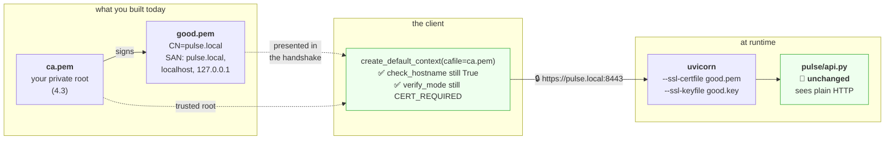

# 5.2 — Serving `pulse` over TLS on purpose

## One-line answer

`pulse` gets an HTTPS endpoint today by passing two flags to uvicorn and trusting your own certificate
authority in the client — **no code changes, no `verify=False`, and no third party** — which proves that
adding TLS to a service is a deployment concern rather than an application one, and that a private CA is
the correct answer to a self-signed certificate.

---

## The story

🎬 **The scene.** A locksmith cutting a key for a friend's new shed.

He does not weaken the lock so any key fits. He does not tell his friend to leave the shed unlocked. He
cuts one key, gives it to one person, and the lock keeps working exactly as designed for everyone else.

😬 **The naive fix.** The friend, in a hurry, files down the latch so the door opens without a key at all.
It solves the problem in ten seconds.

💥 **Why it fails.** He has not made *his* access easier — he has made *everybody's* access easier, forever,
in a way nobody will notice until something is missing. And the filed latch will still be there in three
years, because nothing ever fails to remind him.

💡 **The insight.** **"I need access" and "nobody needs a key" are different requests, and the second one is
almost never what you meant.** Cutting a key is barely more work than filing a latch, and the difference
between them is the entire security posture of the shed.

---

## The idea in plain language

Everything in this section so far has been observation. Now you make `pulse` serve HTTPS.

Two facts make it much less work than people expect:

**Your application code does not change.** Not one line. TLS is a property of the socket, below HTTP
([3.1](../03-tls/3.1-what-tls-actually-promises.md)), so the server does the handshake and hands your
application the same plaintext request it always got. **`pulse/api.py` is untouched today**, which is the
point being demonstrated.

**The certificate already exists.** [4.3](../04-certificates-in-time/4.3-the-three-ways-a-certificate-is-rejected.md)
built a certificate authority and issued `good.pem` with the right SANs. That work was not a detour — it
was this part's setup.

What remains is: point uvicorn at the certificate, point the client at your CA, and understand the two
places this differs from production.

### The two ways this differs from what you will actually deploy

**You are terminating in the application, not at the edge.** [5.1](5.1-where-tls-terminates-and-what-you-stop-seeing.md)
explained why production terminates at a proxy. Doing it in uvicorn here is deliberate: **it is the only
arrangement where you can see the handshake from inside your own process**, and having seen it once you
will understand what the proxy is doing on your behalf on Day 37.

**Your CA is private and trusted by nobody.** A public certificate would require a public name and a
public authority ([4.2](../04-certificates-in-time/4.2-renewal-and-the-automation-that-must-not-fail.md)),
which needs a domain — and Addendum 01 forbids anything requiring a card. **A private CA is not a
compromise here; it is the correct tool for a private service**, and it is exactly what an internal CA is
in a real organisation.

### The one decision that matters: how the client trusts you

There are three ways to make a client accept your certificate, and choosing correctly is the whole lesson:

| Approach | What it does | Verdict |
| --- | --- | --- |
| `verify=False` / `-k` | stops checking anything | ❌ **never** ([3.5](../03-tls/3.5-verification-and-the-flag-that-turns-it-off.md)) |
| add your CA to the **client's** trust store | narrows trust to include one more root | ✅ **this** |
| add your CA to the **operating system's** trust store | every program on the machine now trusts it | ⚠️ powerful and rarely necessary |

**The middle row keeps every other check working.** An expired certificate from your CA still fails. A wrong
hostname still fails. A certificate from a *different* CA still fails. You added one trusted issuer; you
did not remove verification.

**The third row is why this day does not install anything into Windows.** Adding a CA to the system trust
store makes every browser, every tool and every application on the machine accept certificates signed by a
key sitting unencrypted in a lab folder — which is a genuine, machine-wide exposure for a day's exercise,
and it is the reason [4.3](../04-certificates-in-time/4.3-the-three-ways-a-certificate-is-rejected.md)'s
blast radius section says what it says.

---

## Why Kriya needs it

**Day 24** builds `pulse`'s container image, and a certificate becomes a file that must get into it — or,
better, a mount, because baking a certificate into an image is a mistake this day sets you up to avoid.

**Day 37** puts an ingress in front and terminates there. **Having terminated in the application once, you
will know exactly which work the ingress took over**, rather than treating it as magic.

**Day 40** issues a real certificate for `pulse` and **Day 58** automates renewal — both of which assume you
can read a certificate, mount it, and check what is being served.

**Day 12's probes** need to reach an HTTPS endpoint, which is where
[3.4](../03-tls/3.4-sni-one-address-many-certificates.md)'s IP-versus-name problem becomes concrete.

**Day 205** authenticates MCP servers, where the same private-CA pattern reappears — this time with the
client presenting a certificate too.

---

## The mechanism

**Prerequisite:** the certificates from
[4.3](../04-certificates-in-time/4.3-the-three-ways-a-certificate-is-rejected.md), in
`days/day-008-http-and-tls/lab/certs/`. If you have not built them, do that first — this part is the second
half of that one.

**Start `pulse` with TLS:**

```bash
CERTS=days/day-008-http-and-tls/lab/certs
uv run uvicorn pulse.api:app --host 127.0.0.1 --port 8443 \
  --ssl-certfile "$CERTS/good.pem" \
  --ssl-keyfile "$CERTS/good.key" \
  --log-level info
```

**Line by line:**

- `pulse.api:app` — **the same application object as every other day.** Nothing about `pulse` knows this is
  happening.
- `--ssl-certfile` — the certificate to present. Verified against uvicorn's settings documentation on
  **2026-08-25**: *"`--ssl-certfile <path>` - The SSL certificate file"*.
- `--ssl-keyfile` — the matching private key. **If these two are from different key pairs, uvicorn fails at
  start-up with `ssl.SSLError: [SSL] PEM lib`**, which
  [4.3](../04-certificates-in-time/4.3-the-three-ways-a-certificate-is-rejected.md) showed how to diagnose.
- `--port 8443` — the conventional port for HTTPS on a non-privileged service. **`443` would require
  elevated privileges on a Unix system**, because ports below 1024 are restricted — a
  [Day 5](../../../day-005-linux-for-operators-ii/parts/02-permissions/2.1-user-group-other-and-three-bits.md)
  permissions fact that becomes a container question on Day 28.
- `--host 127.0.0.1` — loopback. **The certificate covers `pulse.local`, `localhost` and `127.0.0.1`**, and
  the service is unreachable from anywhere else.
- Two flags that are **not** here: `--ssl-ca-certs` and `--ssl-cert-reqs`. Those configure *client*
  certificate verification — mutual TLS — and their defaults, per the same documentation, are no CA file
  and `ssl.CERT_NONE`. **Server-only authentication is the default**, exactly as
  [3.1](../03-tls/3.1-what-tls-actually-promises.md) said.

The startup output, observed on **2026-08-25**:

```text
INFO:     Started server process [51204]
INFO:     Waiting for application startup.
INFO:     Application startup complete.
INFO:     Uvicorn running on https://127.0.0.1:8443 (Press CTRL+C to quit)
```

**`https://` rather than `http://` in that last line is uvicorn telling you the TLS context loaded.** It is
the cheapest possible confirmation and it is worth reading rather than skipping —
[Day 3, 3.2](../../../day-003-pulse-v0/parts/03-running-it/3.2-reading-the-startup-output.md) made the
general argument that startup output is evidence.

### Connect the wrong ways first, so the right way means something

**Plain HTTP against a TLS port:**

```bash
curl -sS http://127.0.0.1:8443/healthz ; echo "exit=$?"
```

**Line by line:** the scheme says plaintext and the server is expecting a handshake.

```text
curl: (52) Empty reply from server
exit=52
```

**No TLS verification error, because no TLS happened.** The server read `GET /healthz HTTP/1.1` as a TLS
record header, found nonsense, and closed the connection —
[3.1](../03-tls/3.1-what-tls-actually-promises.md)'s mirror-image failure.

**HTTPS with no trust configured:**

```bash
curl -sS https://127.0.0.1:8443/healthz ; echo "exit=$?"
```

**Line by line:** the right scheme this time, and no `--cacert`. `echo "exit=$?"` is here because `curl`
prints its diagnosis on stderr and its exit code is the machine-readable half — `60` is its
certificate-problem code, and a script that reads only stdout would see nothing at all.

```text
curl: (60) SSL certificate problem: unable to get local issuer certificate
More details here: https://curl.se/docs/sslcerts.html
exit=60
```

**This is the moment the flag becomes tempting**, and it is the moment to remember
[3.5](../03-tls/3.5-verification-and-the-flag-that-turns-it-off.md). The certificate is fine; your client
has no reason to trust the issuer.

**HTTPS with the correct name but no CA:**

```bash
curl -sS --resolve pulse.local:8443:127.0.0.1 https://pulse.local:8443/healthz ; echo "exit=$?"
```

**Line by line:** `--resolve` supplies the correct name for SNI, `Host` and the name check
([3.4](../03-tls/3.4-sni-one-address-many-certificates.md)) while still connecting to loopback — so this
request gets the name right and the trust wrong, isolating one variable.

```text
curl: (60) SSL certificate problem: unable to get local issuer certificate
exit=60
```

**Same failure**, because the name was never the problem — the chain was
([4.3](../04-certificates-in-time/4.3-the-three-ways-a-certificate-is-rejected.md)'s failure three).

### The right way

```bash
CERTS=days/day-008-http-and-tls/lab/certs
curl -sS --cacert "$CERTS/ca.pem" --resolve pulse.local:8443:127.0.0.1 \
  -w '\nhttp=%{http_code}  tls=%{time_appconnect}s  version=%{http_version}\n' \
  https://pulse.local:8443/healthz
```

**Line by line:**

- `--cacert "$CERTS/ca.pem"` — **trust this one additional root, for this one request.** Every other check
  stays on: dates, chain, hostname.
- `--resolve pulse.local:8443:127.0.0.1` — connect to loopback while keeping `pulse.local` for SNI, `Host`
  and the name check ([3.4](../03-tls/3.4-sni-one-address-many-certificates.md)). **No `hosts` file edit is
  needed for `curl`**, which keeps the machine unmodified.
- `%{time_appconnect}` — the TLS handshake cost ([3.2](../03-tls/3.2-the-handshake-and-what-it-costs.md)),
  now measured against your own server on loopback, where distance is nil. **This is the CPU half of the
  cost, isolated.**

```text
{"status":"ok"}
http=200  tls=0.011482s  version=1.1
```

**Eleven milliseconds of handshake on loopback**, against the 274 ms measured across a continent in
[3.2](../03-tls/3.2-the-handshake-and-what-it-costs.md). **That difference is the whole latency-versus-CPU
distinction, in two numbers you measured yourself.**

### The same thing from Python, which is what `pulse`'s tests will use

Write `lab/tls_client.py`:

```python
"""Talk to pulse over TLS, trusting only the local CA. No verify=False anywhere."""

import ssl
import sys
from pathlib import Path

import httpx2

CA = Path("days/day-008-http-and-tls/lab/certs/ca.pem")
BASE = "https://pulse.local:8443"


def client() -> httpx2.Client:
    context = ssl.create_default_context(cafile=str(CA))
    transport = httpx2.HTTPTransport(verify=context)
    return httpx2.Client(
        transport=transport,
        timeout=httpx2.Timeout(connect=5.0, read=10.0, write=5.0, pool=5.0),
    )


def main() -> int:
    with client() as session:
        for path in ("/healthz", "/version"):
            response = session.get(f"{BASE}{path}")
            print(f"{path:<10} {response.status_code}  {response.text}")
            response.raise_for_status()
    return 0


if __name__ == "__main__":
    sys.exit(main())
```

**Line by line:**

- `ssl.create_default_context(cafile=str(CA))` — **the secure defaults plus one root.** `check_hostname`
  remains `True` and `verify_mode` remains `CERT_REQUIRED`
  ([3.5](../03-tls/3.5-verification-and-the-flag-that-turns-it-off.md)); you narrowed trust rather than
  removing it.
- `str(CA)` — the `ssl` module wants a string path, not a `Path`. A small, real annoyance.
- `httpx2.HTTPTransport(verify=context)` — pass the context to the transport. Verified at
  `https://www.python-httpx.org/advanced/ssl/` on **2026-08-25**, which shows
  `client = httpx.Client(verify=ctx)` for the equivalent form.
- `httpx2.Timeout(connect=..., read=..., write=..., pool=...)` — **all four phases named explicitly**,
  which is [Day 7, 4.2](../../../day-007-networking-for-operators/parts/04-timeouts/4.2-the-four-timeouts-of-one-http-call.md)
  applied. Note `connect` covers the TCP handshake **and** the TLS handshake, so a tight connect timeout is
  also a tight handshake timeout ([3.2](../03-tls/3.2-the-handshake-and-what-it-costs.md)).
- `with client() as session` — one pooled client for the whole run, so the handshake is paid once
  ([2.1](../02-the-connection/2.1-keep-alive-and-the-connection-you-reuse.md)).
- `response.raise_for_status()` **after** printing — so you see the body of a failure before the exception,
  which is the difference between a useful error report and a bare traceback.
- **`pulse.local` must resolve for this client**, because `httpx2` has no `--resolve` equivalent. Add the
  `hosts` entry from the hub's §3, or use `https://localhost:8443` — the certificate covers both, which is
  why [4.3](../04-certificates-in-time/4.3-the-three-ways-a-certificate-is-rejected.md) put three names in
  the SAN.

```bash
uv run python days/day-008-http-and-tls/lab/tls_client.py
```

**Line by line:** run the script above. Two requests over one verified connection — and note that the
second pays no handshake, because the pooled client reused it
([2.1](../02-the-connection/2.1-keep-alive-and-the-connection-you-reuse.md)).

```text
/healthz   200  {"status":"ok"}
/version   200  {"version":"0.1.0","git_sha":"unknown"}
```

**Two requests, one handshake, full verification, and `pulse` unmodified.**



### Confirming that trust really is narrow

The most important check is not that the good certificate works — it is that the **broken** ones still
fail, with your CA trusted:

```bash
CERTS=days/day-008-http-and-tls/lab/certs
for name in good expired wrongname untrusted; do
  pkill -f "port 8443" 2>/dev/null; sleep 1
  uv run uvicorn pulse.api:app --host 127.0.0.1 --port 8443 \
    --ssl-certfile "$CERTS/$name.pem" --ssl-keyfile "$CERTS/$name.key" --log-level error >/dev/null 2>&1 &
  sleep 3
  printf '%-11s ' "$name"
  curl -sS --cacert "$CERTS/ca.pem" --resolve pulse.local:8443:127.0.0.1 \
    -o /dev/null -w 'http=%{http_code}\n' https://pulse.local:8443/healthz 2>&1 | tail -1
done
pkill -f "port 8443" 2>/dev/null
```

**Line by line:**

- Four servers in turn, each presenting a different certificate, all with the **same** client trust
  configuration.
- `pkill -f "port 8443"` before each — the port must be free
  ([Day 7, 1.4](../../../day-007-networking-for-operators/parts/01-addresses-and-ports/1.4-the-port-that-was-already-in-use.md)).
- `2>&1 | tail -1` — `curl` writes its error to stderr and the write-out to stdout; merging and taking the
  last line gives one row per certificate either way.

```text
good        http=200
expired     curl: (60) SSL certificate problem: certificate has expired
wrongname   curl: (60) SSL certificate problem: unable to get local issuer certificate
untrusted   curl: (60) SSL certificate problem: unable to get local issuer certificate
```

**One success, three failures, with your CA fully trusted.** That is the proof that `--cacert` is not
`verify=False` in a nicer costume: **you added one issuer and every other check survived.**

The `wrongname` row is worth a second look. It was signed by your CA and its name is wrong — so you might
expect a hostname error. `curl` reports the issuer problem because of how it orders its checks against
`--resolve`; **[4.3](../04-certificates-in-time/4.3-the-three-ways-a-certificate-is-rejected.md)'s Python
drill, which connects by name without `--resolve`, reports the hostname mismatch cleanly.** Two tools,
two orderings, same underlying facts — and knowing that they can differ is why you ran both.

---

## When it breaks

**Certificate and key from different pairs.** At start-up rather than at request time:

```text
Traceback (most recent call last):
  File ".../uvicorn/config.py", line 291, in load
    ssl_context.load_cert_chain(certfile, keyfile, password)
ssl.SSLError: [SSL] PEM lib (_ssl.c:3925)
```

**What it says:** almost nothing.
**What it actually means:** `load_cert_chain` *"Raises SSLError if the private key doesn't match with the
certificate"*, verified at `https://docs.python.org/3/library/ssl.html` on **2026-08-25**.
**The smallest fix:** the public-key hash comparison from
[4.3](../04-certificates-in-time/4.3-the-three-ways-a-certificate-is-rejected.md) — two commands, and the
mystery is over.
**Why it is worth having met:** `PEM lib` is one of the least informative error strings you will encounter,
and the first time you see it in a deployment at midnight you will want to have seen it here.

**A file the server cannot read.** The permissions case:

```text
ssl.SSLError: [Errno 2] No such file or directory
```

or, on a Unix system with a key owned by root:

```text
PermissionError: [Errno 13] Permission denied: '/etc/certs/pulse.key'
```

**What it says:** the file is missing or unreadable.
**What it actually means:** a private key is conventionally mode `600` — readable only by its owner
([Day 5, 2.2](../../../day-005-linux-for-operators-ii/parts/02-permissions/2.2-reading-and-changing-a-mode.md))
— and the server runs as a different user. **This is the single most common certificate failure in
containers**, where the process runs as an unprivileged user by design (Day 28).
**The smallest fix:** make the key readable by the service's user, and **not** world-readable, which is the
tempting shortcut.
**The related check:** a key that is world-readable is a finding in any security review, and it is the kind
of thing Day 220's audit will ask about.

**A wrong path that looked right.** The relative-path trap:

```text
ssl.SSLError: [Errno 2] No such file or directory: 'certs/good.pem'
```

**What it says:** the file is not there.
**What it actually means:** the path is relative to the process's **working directory**, not to the
configuration file or to the module. Starting the same command from a different directory changes what it
resolves to.
**The smallest fix:** absolute paths in anything that is not a hand-typed command.
**Why it matters beyond today:** in a container the working directory is set by the image, and a relative
path that worked on your laptop resolves somewhere else entirely — a Day 24 failure whose cause is here.

**The client that could not resolve the name.** Python without `--resolve`:

```text
httpx2.ConnectError: [Errno 11001] getaddrinfo failed
```

**What it says:** the name did not resolve.
**What it actually means:** `pulse.local` is not in DNS and not in your `hosts` file. `curl --resolve`
bypasses resolution for one command; **`httpx2` has no equivalent**, so the name must genuinely resolve.
**The smallest fix:** add the `hosts` entry (the hub's §3), or connect to `https://localhost:8443`, which
the certificate also covers.
**The design point:** putting three names in the SAN
([4.3](../04-certificates-in-time/4.3-the-three-ways-a-certificate-is-rejected.md)) was what made that
second option available. **A certificate's SAN list is an operational decision, not paperwork.**

**Everything works, and you disabled verification to get there.** The failure with no error text:

```text
$ grep -rn "verify=False\|--insecure\| -k " days/day-008-http-and-tls/lab/
days/day-008-http-and-tls/lab/tls_client.py:14:    return httpx2.Client(verify=False)
```

**What it says:** you took the shortcut.
**What it actually means:** the exercise did not happen. **The whole point of this part is that a private
CA is barely more work than the flag**, and the difference is that every other check keeps working.
**The smallest fix:** delete the line and use `create_default_context(cafile=...)`.
**Why this is in the failures list:** it is the most likely thing to go wrong today, and it goes wrong
silently and successfully. **The grep above is the check**, and it belongs on the checklist.

---

## In production

**What a professional writes instead of the teaching version.** They do not put `--ssl-certfile` on the
application server at all — the proxy terminates ([5.1](5.1-where-tls-terminates-and-what-you-stop-seeing.md)),
and the application listens on plain HTTP inside a trusted boundary. Where the application *does* terminate
— a service outside a mesh, an internal endpoint that must be encrypted end to end — the certificate and
key arrive as a **mounted volume**, never baked into the image, so renewal does not require a rebuild. And
the internal CA's root is distributed to every client's trust store by the same mechanism that distributes
configuration, so `verify=False` never has a reason to exist.

**What degrades at scale.** Certificate distribution and reload. One service with one certificate is a file
copy; fifty services across three environments is a distribution problem with a rotation schedule. And
every one of them has the reload problem from
[4.2](../04-certificates-in-time/4.2-renewal-and-the-automation-that-must-not-fail.md): **uvicorn reads the
certificate once, at start-up, and has no reload signal** — so certificate rotation means restarting the
process, which means graceful shutdown
([Day 4, 4.1](../../../day-004-linux-for-operators-i/parts/04-the-service-died/4.1-graceful-shutdown-for-pulse.md))
and a rolling update (Day 42). **That coupling is a strong practical argument for terminating at a proxy
that does support reload.**

**The failure that only shows with real traffic.** Handshake CPU on the application process. In this
exercise you made a handful of connections and the cost was invisible. Under real load, a service that
terminates its own TLS spends processor time on asymmetric cryptography **on the same four cores that are
meant to be serving requests** ([3.2](../03-tls/3.2-the-handshake-and-what-it-costs.md)) — and under a
connection storm the handshakes can starve the request handling while every request-level metric looks
idle. Terminating at the edge concentrates that cost somewhere sized for it.

**The review comment a senior engineer leaves.** *"The Dockerfile copies `cert.pem` and `key.pem` into the
image. That means a certificate rotation is an image rebuild and a redeploy, the key is in every layer
cache and every registry copy forever, and anyone who can pull the image has our private key. Mount them
instead."*

**The signal you would alert on.** For a service terminating its own TLS: **days remaining, read from the
served certificate** ([4.1](../04-certificates-in-time/4.1-expiry-is-a-date-not-a-warning.md)) — because
uvicorn cannot reload, the served value and the file can diverge from the moment rotation happens, and only
the wire tells the truth. Second, **TLS handshake failure rate**, which produces no HTTP status code and is
therefore invisible to every request metric you have
([3.1](../03-tls/3.1-what-tls-actually-promises.md)). You would **not** alert on handshake duration on
loopback, which is a constant.

**Blast radius.** This part starts `pulse` on a TLS port using a key generated in
[4.3](../04-certificates-in-time/4.3-the-three-ways-a-certificate-is-rejected.md). **Worst case: the private
key in `lab/certs/` is readable by anything on this machine**, and a certificate signed by that CA would be
accepted by any client configured with `--cacert ca.pem`. Today that is one lab script. **Nothing is
installed into the operating system trust store**, deliberately, which is what keeps the exposure confined
to processes you point at the file by hand. Who can trigger it: anyone who can read that directory. What
bounds it: loopback binding, a thirty-day CA, `.gitignore` covering `lab/certs/` before the files exist
(Principle 9), and deletion at the end of the day.

**Cost.** `0` model calls, `0` tokens, `0` CI minutes, `0` network beyond loopback — **this whole part is
offline.** Disk: the PEM files from [4.3](../04-certificates-in-time/4.3-the-three-ways-a-certificate-is-rejected.md),
under a hundred kilobytes. RAM: one uvicorn process at roughly 60 MB. **No package is added today** —
uvicorn's TLS support uses the standard library's `ssl` module, which is why this costs nothing to adopt.

**The interview question.** *"How would you put a service behind HTTPS?"* The answer that lands separates
the layers immediately: *"In production I would not put it in the application — I would terminate at the
ingress, because that centralises certificate management and renewal, and it lets the proxy reload a new
certificate without restarting the service. The application listens on plain HTTP inside the trusted
boundary. If the application does have to terminate — say it is outside the mesh — then the certificate and
key are mounted, never baked into the image, because a rotation should not be a rebuild and the key should
not be in the registry. On the client side, the thing I would insist on in review is that an internal CA is
added to the trust store rather than verification being disabled. It is the same amount of work and it
keeps expiry and hostname checking alive, which are the two things that actually catch problems."*

---

## Check yourself

```bash
CERTS=days/day-008-http-and-tls/lab/certs
curl -sS --cacert "$CERTS/ca.pem" --resolve pulse.local:8443:127.0.0.1 \
  -w '\nhttp=%{http_code}  tls_handshake=%{time_appconnect}s\n' https://pulse.local:8443/healthz
grep -rn "verify=False\|--insecure" days/day-008-http-and-tls/lab/ || echo "no verification disabled anywhere ✅"
```

A verified HTTPS request to your own service, and a grep proving you did not take the shortcut to get there.
**Both lines must be green** — a `200` with a measured handshake, and no match for the flag.

**Say out loud, without scrolling up:** *You added `--ssl-certfile` and `--ssl-keyfile` and changed no
application code. Explain why that was possible. Then name the three ways a client can be made to accept
your certificate, say which one you used, and say what the other two would have cost you.*
