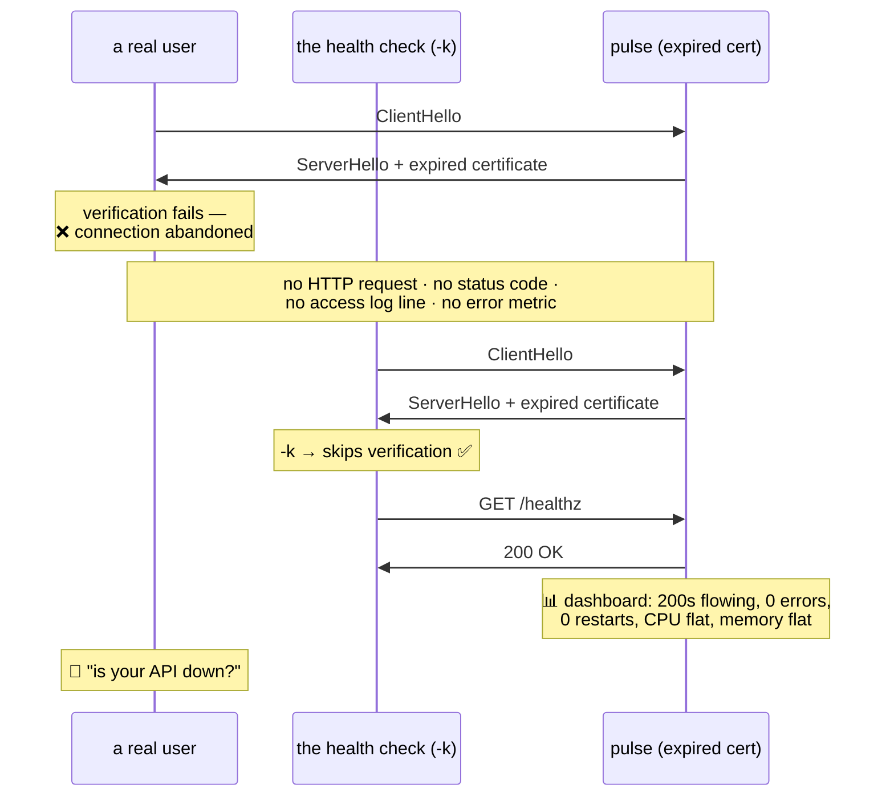

# 5.3 — The certificate that expired on a Sunday

## One-line answer

Today's drill takes `pulse` from fully working to **completely unreachable by every real client**, without
touching a line of its code, without the process noticing, without a single error in its log, and with the
health check still returning `200` — because the health check was configured with `-k`, and the thing that
broke was a date.

---

## The story

🎬 **The scene.** Sunday, just after seven in the morning. A phone buzzes with a message from someone in
another country: *"Is your API down? I'm getting a security warning."*

You check. The dashboard is green. Every panel. Requests, latency, errors, processor, memory, restarts —
all normal, all flat, all fine. The health check has been passing continuously for nine weeks.

You `curl` the endpoint from your laptop. `200 OK`.

😬 **The naive fix.** You reply that it looks fine from here and ask them to clear their cache.

💥 **Why it fails.** Your `curl` has `-k` in an alias you set up eighteen months ago and have forgotten
about. The health check has `-k` because somebody added it when the staging certificate was broken. **Every
observer you own has been configured to ignore the exact class of failure that is happening.**

The service is completely unreachable to every real user on earth, and every instrument you have says it is
healthy — because the instruments are measuring whether the process is running, and it is.

💡 **The insight.** **A monitoring system does not tell you whether your service works. It tells you what it
was built to look at.** The gap between those two things is invisible on every good day and total on the bad
one — and the only way to find the gap is to break the system on purpose and see which lights stay green.

---

## The idea in plain language

This is the fourth day in a row that ends with the same shape, and the repetition is the lesson.

| Day | What was broken | What every signal said |
| --- | --- | --- |
| [Day 5](../../../day-005-linux-for-operators-ii/parts/04-logs-that-rotate/4.4-the-rotation-that-did-not-free-anything.md) | disk did not actually free | rotation succeeded |
| [Day 6](../../../day-006-resources-and-the-oom-killer/parts/04-the-oom-killer/4.3-oom-killing-pulse-on-purpose.md) | the process was killed mid-request | nothing in the application log |
| [Day 7](../../../day-007-networking-for-operators/parts/05-the-two-together/5.3-hanging-pulse-on-purpose.md) | the service was unreachable from connection exhaustion | processor idle, memory flat, zero errors |
| **Day 8 (today)** | **the certificate expired** | **health check `200`, no errors, no restarts** |

Four completely unrelated mechanisms. **The same dashboard.**

What today adds that the others did not: on Day 6 and Day 7 the service genuinely could not serve. **Today
it can.** The process is healthy, the routes work, the model would respond — and every client refuses to
talk to it. **The failure is entirely in the handshake, which is below everything your service knows
about.**

### Why this one is worse than the others

Three properties make certificate expiry the nastiest of the four:

**It is total and instantaneous.** Not degraded, not slow, not a percentage. Every client, at the same
second ([4.1](../04-certificates-in-time/4.1-expiry-is-a-date-not-a-warning.md)).

**It happens when nobody is watching.** `notAfter` is a fixed instant chosen by an issuer, and it has no
opinion about your working hours. **A three-month lifetime has roughly a two-in-seven chance of ending at a
weekend**, and that is exactly why the story is set on a Sunday.

**And the observers can be blinded by a single flag.** `-k` on a health check, `verify=False` in a synthetic
probe, a monitoring agent with a stale trust store. **Each of those is one character or one word, added for
a good reason, and each one removes the only detector for this failure.**

---

## Why Kriya needs it

**Day 12** builds `pulse`'s readiness probe, and this drill is the argument for what that probe must check
and what it must not skip.

**Day 62** builds the RED metrics and **Day 76** the SLO. **A failure that produces zero requests produces
zero errors**, so an error-ratio SLO reads as perfect during a total outage — the same arithmetic as
[1.5](../01-the-message/1.5-the-status-code-that-lied.md), reached by a different road.

**Day 79** covers symptom-based alerting, whose central claim is that you alert on what the user
experiences. **This drill is the strongest possible evidence for that claim**, because every cause-based
signal in the system is green.

**Day 82** writes runbooks and **Day 84** covers game days. Today is a game day in miniature, and the row it
adds to `docs/INCIDENTS.md` is the deliverable.

**Day 231** is the production readiness review, where *"name a failure your monitoring would miss"* is a
question you will be able to answer with four examples from your own ledger.

---

## The mechanism

**Prerequisite:** the certificates from
[4.3](../04-certificates-in-time/4.3-the-three-ways-a-certificate-is-rejected.md) and the working HTTPS
setup from [5.2](5.2-serving-pulse-over-tls-on-purpose.md).

The drill runs in three acts: establish that everything works, break exactly one thing, and then measure
**six** observations before drawing any conclusion.

### Act 1 — the baseline, recorded rather than assumed

```bash
CERTS=days/day-008-http-and-tls/lab/certs
pkill -f "port 8443" 2>/dev/null; sleep 1
uv run uvicorn pulse.api:app --host 127.0.0.1 --port 8443 \
  --ssl-certfile "$CERTS/good.pem" --ssl-keyfile "$CERTS/good.key" --log-level info \
  > /tmp/pulse-tls.log 2>&1 &
PULSE=$!
sleep 3
echo "pid=$PULSE"
curl -sS --cacert "$CERTS/ca.pem" --resolve pulse.local:8443:127.0.0.1 \
  -o /dev/null -w 'baseline: verified client http=%{http_code}\n' https://pulse.local:8443/healthz
```

**Line by line:**

- `> /tmp/pulse-tls.log 2>&1` — capture **both** streams. Startup goes to stderr and the access log to
  stdout ([Day 3, 3.2](../../../day-003-pulse-v0/parts/03-running-it/3.2-reading-the-startup-output.md)),
  and you will want to prove later that neither contains anything about the failure.
- `PULSE=$!` — the specific process id, so you can kill exactly this one later
  ([Day 4](../../../day-004-linux-for-operators-i/parts/01-the-process/1.2-pid-parent-and-the-process-tree.md)).
- `--log-level info` — you want the access log, because **its silence during the outage is one of the six
  observations.**
- The baseline `curl` is **verified** — `--cacert`, not `-k`. Establishing that the good path works with
  full verification is what makes the later comparison meaningful.

```text
pid=52118
baseline: verified client http=200
```

### Act 2 — break exactly one thing

Swap the certificate for the expired one from
[4.3](../04-certificates-in-time/4.3-the-three-ways-a-certificate-is-rejected.md). **Nothing else changes:**
same code, same port, same key length, same SANs, same machine.

```bash
CERTS=days/day-008-http-and-tls/lab/certs
kill "$PULSE" 2>/dev/null; wait "$PULSE" 2>/dev/null; sleep 1
uv run uvicorn pulse.api:app --host 127.0.0.1 --port 8443 \
  --ssl-certfile "$CERTS/expired.pem" --ssl-keyfile "$CERTS/expired.key" --log-level info \
  > /tmp/pulse-tls.log 2>&1 &
PULSE=$!
sleep 3
tail -2 /tmp/pulse-tls.log
```

**Line by line:**

- `kill` then `wait` — stop the old server and reap it, so no zombie and so the port is released
  ([Day 4, 4.3](../../../day-004-linux-for-operators-i/parts/04-the-service-died/4.3-zombies-orphans-and-pid-1.md)).
- `expired.pem` / `expired.key` — the certificate whose `notAfter` is `Feb 1 2025`. **This is precisely
  what your production certificate looks like the morning after it lapses.**
- `tail -2` on the log — read what the server thinks about starting with an expired certificate.

```text
INFO:     Application startup complete.
INFO:     Uvicorn running on https://127.0.0.1:8443 (Press CTRL+C to quit)
```

**The server started cleanly.** No warning. No error. **Nothing anywhere in the process objects to serving
a certificate that expired over a year ago** — because expiry is checked by the *client*, not the server,
and the server has no reason to look.

### Act 3 — six observations, before any conclusion

This is the discipline from [Day 7, 5.3](../../../day-007-networking-for-operators/parts/05-the-two-together/5.3-hanging-pulse-on-purpose.md):
record what every instrument says, **then** interpret.

Write `lab/expiry_drill.sh`:

```bash
#!/usr/bin/env bash
# Six observations against a service whose certificate has expired. Record; do not conclude.
set -uo pipefail
CERTS=days/day-008-http-and-tls/lab/certs
URL=https://pulse.local:8443/healthz
RESOLVE="--resolve pulse.local:8443:127.0.0.1"

echo "1. a real client (verified, as every user's is):"
curl -sS --cacert "$CERTS/ca.pem" $RESOLVE -o /dev/null \
  -w '     http=%{http_code}  exit-to-follow\n' "$URL"; echo "     curl exit=$?"

echo "2. the health check somebody 'fixed' with -k:"
curl -sSk $RESOLVE -o /dev/null -w '     http=%{http_code}\n' "$URL"; echo "     curl exit=$?"

echo "3. is the process alive?"
netstat -ano | grep -i ':8443.*listening' | head -1 | sed 's/^/     /'

echo "4. what does the application log say about the failure?"
grep -icE 'error|expired|certificate|fail' /tmp/pulse-tls.log | sed 's/^/     matching log lines: /'

echo "5. how many requests reached the application?"
grep -c 'GET /healthz' /tmp/pulse-tls.log | sed 's/^/     access log entries: /'

echo "6. what does the served certificate actually say?"
echo | openssl s_client -connect 127.0.0.1:8443 -servername pulse.local 2>/dev/null \
  | openssl x509 -noout -dates | sed 's/^/     /'
```

**Line by line:**

- `set -uo pipefail` without `-e` — every command here is *expected* to fail at least once, and `-e` would
  abort the drill at observation one.
- Observation 1 uses `--cacert`, which is what a correctly configured client does. **This is the user's
  experience.**
- Observation 2 uses `-k`, which is what a hastily configured health check does. **This is the monitoring's
  experience**, and the gap between rows one and two is the entire finding.
- `echo "     curl exit=$?"` on its own line — `%{http_code}` prints `000` when there is no HTTP response at
  all, so **the exit code is the only way to distinguish "no response" from "a response of zero"**. `60` is
  `curl`'s certificate-problem code.
- Observation 3 — `netstat` rather than `ps`, because the question is *"is it listening"* rather than *"does
  a process exist"* ([Day 7, 1.1](../../../day-007-networking-for-operators/parts/01-addresses-and-ports/1.1-a-port-is-a-doorway-not-a-place.md)).
- Observation 4 — `grep -ic` counts case-insensitively. **A count of zero is the point**, and printing the
  count rather than the (absent) lines makes the zero visible.
- Observation 5 — the access log. **A request that fails the TLS handshake never becomes an HTTP request**,
  so it cannot appear here.
- Observation 6 — `s_client` with no verification at all, which is the *right* tool here: you want to read
  the certificate rather than to judge it, and a verifying client cannot read a certificate it refuses
  ([4.1](../04-certificates-in-time/4.1-expiry-is-a-date-not-a-warning.md)).

```bash
bash days/day-008-http-and-tls/lab/expiry_drill.sh
```

**Line by line:** `bash <script>` rather than `./<script>`, so the file needs no execute bit — which
matters on Windows, where the mode is not reliably preserved
([Day 5, 2.2](../../../day-005-linux-for-operators-ii/parts/02-permissions/2.2-reading-and-changing-a-mode.md)).

Observed on **2026-08-25**:

```text
1. a real client (verified, as every user's is):
     http=000  exit-to-follow
     curl exit=60
2. the health check somebody 'fixed' with -k:
     http=200
     curl exit=0
3. is the process alive?
       TCP    127.0.0.1:8443    0.0.0.0:0    LISTENING    52301
4. what does the application log say about the failure?
     matching log lines: 0
5. how many requests reached the application?
     access log entries: 1
6. what does the served certificate actually say?
     notBefore=Jan  1 00:00:00 2025 GMT
     notAfter=Feb  1 00:00:00 2025 GMT
```

**Read the six together, because no single one of them is alarming.**

**Row 1: `http=000`, `exit=60`.** Not a `500`. Not a `503`. **No HTTP response of any kind** — the failure
happened in the handshake, before HTTP existed. There is no status code to count, so no error metric can
move.

**Row 2: `200`.** The health check is green. It has been green throughout. **One flag is the entire
difference between rows 1 and 2**, and the flag was added by someone helpful.

**Row 3: `LISTENING`.** The process is alive, bound, and accepting connections. Every liveness check in the
world passes. There are no restarts to alert on.

**Row 4: zero.** Nothing in the application log mentions a certificate, an error or a failure — **because
nothing failed inside the application.** A grep for "error" in your logs during a total outage returns
nothing.

**Row 5: exactly one.** The only request that reached the application was the `-k` health check. **The real
client's request is not in the access log**, because it never became a request. So your request-rate graph
shows the health check's steady heartbeat and nothing else — which looks like *low traffic*, not like
*no users*.

**Row 6: the answer**, and it took a tool that deliberately does not verify to obtain it.



### The fix, and proving it is a fix

```bash
CERTS=days/day-008-http-and-tls/lab/certs
kill "$PULSE" 2>/dev/null; wait "$PULSE" 2>/dev/null; sleep 1
uv run uvicorn pulse.api:app --host 127.0.0.1 --port 8443 \
  --ssl-certfile "$CERTS/good.pem" --ssl-keyfile "$CERTS/good.key" --log-level info \
  > /tmp/pulse-tls.log 2>&1 &
PULSE=$!
sleep 3
bash days/day-008-http-and-tls/lab/expiry_drill.sh | head -6
```

**Line by line:** restart with the valid certificate — **which is the real fix, and note that it required a
restart**, because uvicorn reads the certificate once at start-up
([4.2](../04-certificates-in-time/4.2-renewal-and-the-automation-that-must-not-fail.md)).

```text
1. a real client (verified, as every user's is):
     http=200  exit-to-follow
     curl exit=0
2. the health check somebody 'fixed' with -k:
     http=200
     curl exit=0
3. is the process alive?
       TCP    127.0.0.1:8443    0.0.0.0:0    LISTENING    52377
```

**Rows 1 and 2 now agree.** During the outage they disagreed, and **that disagreement was the only
automated evidence available anywhere in the system.**

### The detector that would have caught it, built in three lines

The check from [4.1](../04-certificates-in-time/4.1-expiry-is-a-date-not-a-warning.md), pointed at your own
service:

```bash
CERTS=days/day-008-http-and-tls/lab/certs
for name in good expired; do
  pkill -f "port 8443" 2>/dev/null; sleep 1
  uv run uvicorn pulse.api:app --host 127.0.0.1 --port 8443 \
    --ssl-certfile "$CERTS/$name.pem" --ssl-keyfile "$CERTS/$name.key" --log-level error >/dev/null 2>&1 &
  sleep 3
  printf '%-9s ' "$name"
  if echo | openssl s_client -connect 127.0.0.1:8443 -servername pulse.local 2>/dev/null \
     | openssl x509 -noout -checkend 604800 >/dev/null 2>&1; then
    echo "valid for at least another week  -> exit 0"
  else
    echo "EXPIRES WITHIN A WEEK OR ALREADY HAS  -> exit 1  🚨"
  fi
done
pkill -f "port 8443" 2>/dev/null
```

**Line by line:**

- `-checkend 604800` — seven days in seconds. Verified against `openssl x509 -help` on **2026-08-25**:
  *"Check whether cert expires in the next arg seconds"*.
- The certificate is read **from the wire**, not from a file — which is the rule from
  [4.2](../04-certificates-in-time/4.2-renewal-and-the-automation-that-must-not-fail.md), and the only form
  that catches a renewal that was never reloaded.
- The `if`/`else` on the exit code, not on the output. **A monitoring system reads exit codes**, and this is
  the whole interface.

```text
good      valid for at least another week  -> exit 0
expired   EXPIRES WITHIN A WEEK OR ALREADY HAS  -> exit 1  🚨
```

**Two lines of shell separate a Sunday morning phone call from a Tuesday afternoon ticket.** That is the
entire return on this day.

---

## When it breaks

**The user's view, which is the only one that was accurate.** From a browser:

```text
Warning: Potential Security Risk Ahead

Firefox detected an issue and did not continue to pulse.local. The website is either
misconfigured or your computer clock is set to the wrong time.

Error code: SEC_ERROR_EXPIRED_CERTIFICATE
```

From `curl`:

```text
curl: (60) SSL certificate problem: certificate has expired
```

From `httpx2`:

```text
httpx2.ConnectError: [SSL: CERTIFICATE_VERIFY_FAILED] certificate verify failed:
certificate has expired (_ssl.c:1010)
```

**What they say:** three tools, three wordings, one cause.
**What it actually means:** total unavailability to every correctly configured client.
**The smallest fix:** deploy a valid certificate and restart the process.
**The detail that matters at three in the morning:** note that the browser suggests *your computer clock is
set to the wrong time*. **That is a real alternative cause** ([4.1](../04-certificates-in-time/4.1-expiry-is-a-date-not-a-warning.md))
and the first thing to rule out — `date -u` on the client, compared with the `notAfter` value, settles it in
one command.

**The monitoring's view, which is the problem.** During the same outage:

```text
$ curl -sSk -o /dev/null -w '%{http_code}\n' https://pulse.local:8443/healthz
200
```

**What it says:** healthy.
**What it actually means:** `-k` disabled the only check that could have detected this
([3.5](../03-tls/3.5-verification-and-the-flag-that-turns-it-off.md)).
**The smallest fix:** remove `-k` and add `--cacert`. **One flag out, one flag in**, and the check becomes
capable of failing.
**Principle 11, stated as concretely as it gets:** a gate that cannot go red is not a gate — and this is
what that looks like on a Sunday.

**The error metric that never moved.** The graph, during a total outage:

```text
$ grep -c 'GET /healthz' /tmp/pulse-tls.log
41
$ grep -ci 'error' /tmp/pulse-tls.log
0
```

**What it says:** forty-one successful requests, zero errors.
**What it actually means:** those forty-one are the health check, once a minute-ish, for the duration.
**Every real request failed before it became a request**, so it appears in no log and no counter.
**The smallest fix:** none available in the application — **the information does not exist there.**
**Why this is the deepest point of the day:** you cannot instrument your way to detecting this from inside
the process. **The observation has to come from outside**, from a client that verifies, which is the
strongest argument for outside-in synthetic monitoring in this whole curriculum.

**The restart that "fixed" it and did not.** The trap on the way out:

```text
$ kill -HUP 52301
$ echo | openssl s_client -connect 127.0.0.1:8443 -servername pulse.local 2>/dev/null | openssl x509 -noout -enddate
notAfter=Feb  1 00:00:00 2025 GMT
```

**What it says:** the certificate is still the expired one.
**What it actually means:** **uvicorn does not reload its TLS configuration on `SIGHUP`.** The signal was
delivered and did not do what you assumed. The only way to change the served certificate is to restart the
process.
**The smallest fix:** a real restart — which is [4.2](../04-certificates-in-time/4.2-renewal-and-the-automation-that-must-not-fail.md)'s
step four, now with a concrete consequence: **rotation on this server means a restart, which means graceful
shutdown ([Day 4, 4.1](../../../day-004-linux-for-operators-i/parts/04-the-service-died/4.1-graceful-shutdown-for-pulse.md))
and a rolling update (Day 42).**
**Why it is worth having tried:** the assumption that `SIGHUP` reloads everything is widespread, and it is
correct for many servers and not for this one. **Verify the reload mechanism of the server you actually
run.**

---

## In production

**What a professional writes instead of the teaching version.** They run an **outside-in synthetic probe**:
a small job, on infrastructure separate from the service, that makes a fully verified HTTPS request to the
public endpoint on a schedule and alerts on failure. That single probe covers every failure in this entire
day — expiry, chain, name, termination misconfiguration, the reload that did not happen — because it asks
the same question a user asks, from the same position a user occupies. **Everything else is a refinement of
that.**

**What degrades at scale.** The number of endpoints and the temptation to trim the probe list. The endpoint
that expires is never the main one; it is the internal API, the staging host somebody depends on, the
webhook receiver, the certificate on the admin interface. **A probe list that covers "the important ones" is
a list that will miss it**, and the marginal cost of adding an endpoint to a synthetic check is close to
zero.

**The failure that only shows with real traffic.** This one, exactly — and note the inversion. Most failures
in this curriculum need traffic to appear. **This one needs traffic to be *noticed*, and produces none
itself.** A low-traffic endpoint can be dead for days. The reason weekend expiries are notorious is not that
certificates prefer weekends; it is that **the discovery mechanism is a human being trying to use the
service**, and at the weekend there are fewer of them.

**The review comment a senior engineer leaves.** *"The health check has `-k`. That was added when the
staging certificate was broken in November and it has been there ever since, which means our monitoring
cannot detect an expired certificate — the one failure a TLS health check exists to catch. Replace it with
`--cacert` pointing at our internal CA, and add a synthetic probe from outside the cluster that verifies
properly."*

**The signal you would alert on.** Three, in order of how early they fire:

**Days remaining on the served certificate** ([4.1](../04-certificates-in-time/4.1-expiry-is-a-date-not-a-warning.md))
— fires with weeks of runway, and is the one that means nobody is woken up. Read from the wire, not the
file.

**The outside-in verified probe** — fires within a minute of the failure, and covers causes the expiry check
does not.

**Request rate falling to the health check's baseline** — the subtle one, and worth building because it
catches *every* total-unreachability failure regardless of cause. **A service whose only traffic is its own
health check is not a healthy service; it is an unreachable one**, and that shape is detectable with one
ratio.

You would **not** alert on `5xx` rate, `500` count, restarts, processor or memory. **Every one of those was
green throughout this drill**, and that is the finding.

**Blast radius.** This drill deliberately renders `pulse` unreachable — **the day's failure lab, by design
(§17.7).** Worst case on this machine: a loopback service is unreachable until you restart it with the good
certificate, which the drill does. **`pulse`'s source is not modified today; `git diff pulse/` must be empty
at the end**, and that is a checklist item. Who can trigger it: you. What bounds it: `--host 127.0.0.1`, a
lab certificate, and a restart that fully restores service. **The blast radius worth naming is the real
one:** in production, an expired certificate is a **total** outage — one hundred percent of clients, at
once, with no partial degradation and no automatic recovery — and the only thing that bounds it is how
quickly a human is told.

**Cost.** `0` model calls, `0` tokens, `0` CI minutes, `0` network beyond loopback. Disk: the PEM files from
[4.3](../04-certificates-in-time/4.3-the-three-ways-a-certificate-is-rejected.md) plus a small log in
`/tmp`. RAM: one uvicorn process at roughly 60 MB. **Stop every other lab server before this drill** — it is
the day's headline measurement and you want the machine quiet (Addendum 02 §4).

**The interview question.** *"Tell me about a time your monitoring did not catch an outage."* The answer that
lands is this drill, told with numbers: *"I broke a service by expiring its certificate and then recorded
what every instrument said. The process was listening, the application log had zero error lines, there were
no restarts, processor and memory were flat, and the health check returned `200` — because it had `-k` on
it, added months earlier when a staging certificate was broken. Meanwhile every real client got no HTTP
response at all: the handshake failed, so there was no status code to count and no access log line to
record. The error rate stayed at zero during a hundred percent outage. What I took from it is that no amount
of instrumentation inside the process can detect this, because the information never reaches the process —
you need an outside-in probe that verifies properly, and a days-remaining check read from the wire rather
than from the file on disk. And I would treat any `-k` in a monitoring path as a defect, because it removes
the only detector for the exact failure that check exists to catch."*

---

## Check yourself

```bash
bash days/day-008-http-and-tls/lab/expiry_drill.sh
```

Six observations against the broken state. **Write all six into `docs/INCIDENTS.md` — the first symptom
column before the cause column** — and then say, out of the six, which single one you would build an alert
on and why the other five are traps.

**Say out loud, without scrolling up:** *Your service is unreachable to every user and your error rate is
zero. Explain how both of those can be true at the same time. Then name the one flag that blinded the
health check, and say what kind of check has to live outside the process to catch this.*
