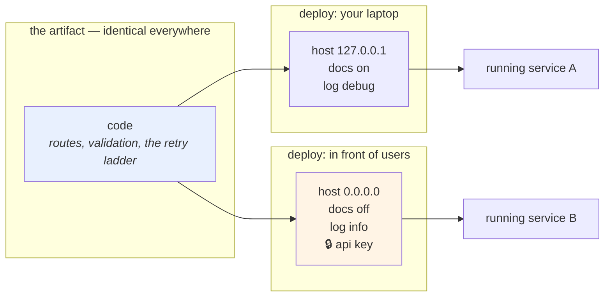

# 1.1 — What configuration actually is

## One-line answer

Configuration is **everything that is likely to vary between deploys of the same code** — and the test for
whether you have separated it correctly is whether you could make this repository public right now without
compromising a single credential.

---

## The story

🎬 **The scene.** A touring theatre company. One play, forty towns.

The script is the same everywhere: the same lines, the same cues, the same order. What changes in every town
is the stuff around the play — which door the actors come in through, the four-digit code on that door, the
phone number of the local box office, how many seats there are, and whether the interval is long or short
because this venue's bar is slow.

On the first night, in the first town, the stage manager writes the stage-door code onto page one of the
script in pen. It is faster than keeping a separate list, and it works perfectly.

😬 **The naive fix.** Before the second town, someone photocopies the script — forty copies, one per person
— and posts them out. The code is on page one of all forty.

💥 **Why it fails.** Two things go wrong at once, and only the second one is obvious.

The obvious one: the code on page one is for a building two hundred miles away, and the new venue's code is
nowhere at all. Forty people are standing outside a locked door holding the right answer to the wrong
question.

The one nobody notices for a year: **forty copies of a working door code are now in forty different bags,
in forty different houses.** One of them gets left on a train. There is no way to know which, no way to
collect them back, and no way to tell whether anybody used it. The door code has to be changed at a venue
the company has already left.

💡 **The insight.** **The thing that changes between performances does not belong inside the thing that
stays the same.** Not because it is untidy — because the moment it is inside, it travels everywhere the
script travels, it cannot be changed without reprinting, and you lose the ability to say who has it.

---

## The idea in plain language

Your service is made of two very different kinds of thing, and telling them apart is the entire subject of
today.

**Code** is what the service *does*. Read a ticket, validate it, decide a priority, return an answer. It is
identical everywhere the service runs — on your laptop, on a test machine, in front of real users. If it is
not identical everywhere, then "we tested it" means nothing, because you tested something else.

**Configuration** is what the service needs *to know* in order to do that in one particular place. Where is
the database? What port do I listen on? How loud should the logs be? What is the password for the thing I
depend on?

The canonical definition is worth quoting exactly, because it is sharper than most people's mental version
of it. From `https://12factor.net/config`, fetched on **2026-08-25**:

> *"An app's config is everything that is likely to vary between deploys (staging, production, developer
> environments, etc)."*

Read the words *"between deploys"* carefully, because they are doing all the work.

**A deploy is one running copy of the service.** The copy on your laptop is a deploy. The copy your
colleague runs is a different deploy. The copy that serves real users is a deploy. If a value can differ
between two of those copies while the code is the same, it is configuration. If it cannot, it is code.

### The test you can actually apply

"Likely to vary between deploys" is still a judgement, so here is the mechanical version. Ask of any value:

**"If I changed this on one running copy and not the others, would that be a bug — or would it be a
deployment?"**

- The number of retries on a failing call: changing it in one place is a *deployment decision*. **Configuration.**
- The order in which a retry backs off — one second, then two, then four: changing that in one place is a
  *behaviour difference between copies of the same version*, which is exactly the thing that makes an
  incident unreproducible. **Code.**
- The address of the database: **configuration**, obviously.
- The SQL you send to the database: **code**, equally obviously.
- Whether interactive API documentation is served: **configuration** — you want it on your laptop and off in
  front of users, and Day 3 already made that decision
  ([Day 3, 3.3](../../../day-003-pulse-v0/parts/03-running-it/3.3-the-interactive-docs-and-why-you-turn-them-off.md)).

### The second test, which is the one that matters

The same page gives a second test, and it is the one to memorise, because it converts an abstract question
into something you can check in a few seconds:

> *"A litmus test for whether an app has all config correctly factored out of the code is whether the
> codebase could be made open source at any moment, without compromising any credentials."*

**Could you make this repository public, right now, in the next few seconds, without leaking anything?**

For Project Kriya that is not hypothetical. The plan says this repository goes public in Phase 23
(`docs/00_MASTER_PLAN.md` §13). Every value you type between now and then is a value that will be readable
by strangers. Today is where that stops being a future problem.

### What "config" does *not* mean

There is a trap in the word, and the same page names it:

> *"Note that this definition of 'config' does not include internal application config … This type of
> config does not vary between deploys, and so is best done in the code."*

Which routes exist, which validator runs on which field, how the modules are wired together — those live in
files people call "config" in ordinary speech, and they are **code**. They are identical in every deploy.
Putting them in an environment variable does not make the service more flexible; it makes it a service whose
behaviour you cannot predict from its version number.

**A useful way to say it:** configuration answers *where* and *how much*. Code answers *what* and *in what
order*.

### The three properties that follow

Once you accept that split, three things follow, and every later day in this phase depends on them:

| Property | What it means | What breaks without it |
| --- | --- | --- |
| **Same artifact everywhere** | One build runs in every deploy; only its config differs | "It worked in staging" becomes meaningless — Day 10 |
| **Config is externally supplied** | The service is *told* its config; it does not contain it | You cannot change a value without a code change and a release — Day 16 |
| **Config can be secret** | Some of it must never be readable by everyone who can read the code | A credential in git is a credential you cannot un-publish — [4.2](../04-secrets/4.2-the-seven-places-a-secret-leaks.md), Day 11 |

---

## Why Kriya needs it

**Day 10 is unwritable without this part.** Promotion — moving one build from a test deploy to a real one —
only means something if the build is genuinely the same object and only the configuration differs. If the
code carries its own values, "promoting" it is really "rebuilding it", and the thing you tested is not the
thing you shipped.

**Day 22** puts `pulse` in a container image. An image is immutable by construction: whatever value is baked
in at build time is in every copy of that image forever, in every environment, including the one you did not
mean. The habits you form today decide whether that is a feature or a trap.

**Day 35** supplies configuration to a container in Kubernetes through a `ConfigMap` and a `Secret`, which
are two objects that exist *only because* this separation exists. If you have not internalised why they are
two objects rather than one, the day is memorisation.

**Day 57** manages secrets properly, with a real secret store, and **Day 17** stops a token from being
printed by a build. Both of those are the grown-up version of what
[section 4](../04-secrets/4.1-what-makes-a-secret-a-secret.md) starts today.

**Day 126** points `pulse` at a model provider. That means a base URL, a model name, a timeout and an API
key — one configuration object holding three ordinary values and one that must never be seen. **The shape
of that object is decided today**, and changing it later means changing every deploy at once.

---

## The mechanism

Here is the split, made concrete, on the service you already have.

`pulse` today has exactly one thing that could vary between deploys, and it is hidden inside a command
rather than declared anywhere: the address it listens on
([Day 3, 3.1](../../../day-003-pulse-v0/parts/03-running-it/3.1-the-server-the-port-and-the-process.md)).

```bash
uv run uvicorn pulse.api:app --host 127.0.0.1 --port 8000
```

**Line by line:**

- `--host 127.0.0.1` — **this is configuration**, and it is currently supplied by whoever types the command.
  Day 7 established that this value decides who can reach the service at all
  ([Day 7, 1.3](../../../day-007-networking-for-operators/parts/01-addresses-and-ports/1.3-binding-127-0-0-1-versus-0-0-0-0.md)),
  and Day 22 will need it to be `0.0.0.0` inside a container. The same code, two deploys, two values. That
  is the definition.
- `--port 8000` — also configuration, for the same reason, and it will be different the moment two copies
  run on one machine.
- `pulse.api:app` — **this is code.** It names the module and the object inside it. It is the same in every
  deploy that runs this version, and a deploy where it differs is not a differently-configured `pulse`; it
  is a different program.

**The problem with the command line as the only interface** is that nothing declares what the values *are*.
There is no list. A new person has to read the shell history to discover that the service has settings at
all, and the service itself cannot tell you what it was given.

Now the inventory. Walk the service and write down every value that could differ between two running
copies:

```bash
grep -rnE '127\.0\.0\.1|localhost|8000|http://|https://|token|key|password|secret' pulse/ tests/ \
  --include='*.py' || echo "no candidates found in pulse/ yet"
```

**Line by line:**

- `grep -rn` — recursive, with line numbers, so every hit is a place you can go and look at.
- The pattern is deliberately crude: addresses, ports, URLs and the four words that most often precede a
  credential. **A crude pattern that you actually run beats a careful one you plan to write later**, and this
  is the same command you will run on Day 17 in a build, where it becomes a gate rather than a habit.
- `--include='*.py'` — restrict to source. Without it you match this document, the lock file and every log
  you have ever written, and the noise trains you to ignore the output.
- `|| echo "..."` — `grep` exits `1` when it finds nothing, which under `set -e` in a script stops the
  script. Day 4 covered why an exit code is a fact rather than a formality
  ([Day 4, 3.1](../../../day-004-linux-for-operators-i/parts/03-exit-codes/3.1-the-exit-code-is-the-whole-return-value.md)).

On a clean checkout of `pulse` as Day 3 left it, this is the honest result:

```text
no candidates found in pulse/ yet
```

**That is not a pass mark — it is a starting line.** `pulse` has no configuration in its code because
`pulse` has no configuration at all. Every value that varies is currently supplied by a human typing a
command, which works for exactly one deploy: the one with the human in front of it.

### The inventory that today builds

Here is what `pulse` will actually need, written out before any code, because a list you can argue about is
worth more than a class you have to refactor:

```text
name              kind      example        secret?  why it varies
────────────────  ────────  ─────────────  ───────  ─────────────────────────────────────────
environment       enum      dev            no       Day 10: which deploy this is
host              string    127.0.0.1      no       Day 7: loopback here, 0.0.0.0 in a container
port              int       8000           no       two copies on one machine need two ports
log_level         enum      info           no       Day 67: debug locally, info in front of users
docs_enabled      bool      true           no       Day 3: on for you, off for strangers
request_timeout   float     3.0            no       Day 7: the number that saves the system
model_api_key     secret    (none yet)     YES      Day 126: the first real credential
```

**Line by line:**

- **`environment`** is first on purpose. It is the only value in the list whose job is to *describe the
  deploy rather than change behaviour*, and Day 10 is built on it. It is also the value most likely to be
  abused — [1.2](1.2-the-environment-is-the-interface.md) explains why grouping other settings underneath
  it is a mistake the twelve-factor page calls out by name.
- **`kind`** is a column because it is the entire subject of [1.3](1.3-everything-from-the-environment-is-a-string.md):
  every one of these arrives as text, and `port` being an `int` is a promise somebody has to keep.
- **`docs_enabled` is a `bool`**, which is the single most dangerous type in configuration. `"false"` is a
  non-empty string, and a non-empty string is true. That is not a hypothetical — it is
  [1.3](1.3-everything-from-the-environment-is-a-string.md)'s failure.
- **`secret?` is a column, not a comment.** The moment one row differs from the others in how it may be
  logged, printed, echoed or stored, that difference has to be in the type system rather than in somebody's
  memory ([4.3](../04-secrets/4.3-redaction-that-actually-holds.md)).
- **`model_api_key` has no example value.** Writing a plausible fake key in a documentation table is how a
  plausible fake key ends up pasted into a real deploy. The example column for a secret says `(none yet)`
  and later says `(see .env.example)` — never a value that looks like one.
- **Every row names the day that needs it.** A setting with no named consumer is a setting somebody added
  because it seemed general, and it will still be there, unread, on Day 232.



The diagram is the whole day in one picture: **one box on the left, many boxes on the right, and an arrow
that carries no values.**

---

## When it breaks

**The value that was true when it was written.** The most common shape, and it never announces itself:

```text
httpx2.ConnectError: [Errno 111] Connection refused

  File "pulse/client.py", line 14, in fetch
    return httpx2.get("http://127.0.0.1:5432/health", timeout=3.0)
```

**What it says:** nothing is listening on that address.
**What it actually means:** the address was correct on the laptop of the person who typed it, and this deploy
is a different machine. **The code is not wrong; the code is in the wrong place to know the answer.**
**The smallest fix:** the value comes from outside — which is [1.2](1.2-the-environment-is-the-interface.md).
**Why it is worse than it looks:** the error is at *call* time, not at *start* time, so the service came up,
reported healthy, accepted traffic and then failed on the first request that used the dependency. Section 3
exists entirely to move this failure earlier.

**The value that was changed in one place.** The second most common:

```text
$ git log --oneline -3 -- pulse/api.py
a91f0c2 bump timeout to 30 for the demo
4c7de81 add /predict
d091a30 initial service
```

**What it says:** somebody changed a timeout for a demonstration.
**What it actually means:** they changed it *in the code*, so it is now 30 in every deploy, forever, including
the one in front of users where Day 7's argument says a long timeout is how a service dies
([Day 7, 4.1](../../../day-007-networking-for-operators/parts/04-timeouts/4.1-a-timeout-is-a-decision-not-a-safety-net.md)).
**The smallest fix:** the demo deploy gets a different value, not the code.
**The tell:** a commit message that names a *situation* rather than a *behaviour*. "for the demo", "for
staging", "while we debug" — every one of those is configuration wearing a commit's clothes, and Day 11
will teach you to spot it in a log you are reading at 2am.

**The repository that could not be published.** The one that has no error message at all:

```text
$ git log --all -S 'sk-' --oneline
7f21ba4 wire up the provider client
```

**What it says:** a string beginning `sk-` was introduced by one commit and is in this repository's history.
**What it actually means:** it is in every clone, every fork, every backup and every laptop that has ever run
`git clone`. **Deleting it now changes nothing** — Day 11 explains exactly why
([Day 11, 5.2](../../../day-011-version-control-for-operators/parts/05-repo-as-memory/5.2-the-secret-that-reached-history.md)).
**The smallest fix:** there is no fix. There is only rotation: the credential is dead and a new one is issued.
**Why this part starts with the litmus test:** because this failure has no symptom, no alert and no exit
code. The only detector is the question *"could this be public right now?"*, asked before rather than after.

---

## In production

**What a professional writes instead of the teaching version.** They keep a written inventory of every
setting, like the table above, and it lives in the repository next to the code rather than in a wiki. It has
a column nobody expects: **who changes this, and when**. A setting that only the person who wrote it has ever
changed is a setting that should probably be a constant, and a setting that changes during incidents needs to
be changeable without a deployment — which is a different mechanism with a different blast radius, and Day 18
and Day 44 are where that argument happens.

**What degrades at scale.** The number of settings. A service with six settings has a configuration; a
service with a hundred and sixty has a configuration *language*, and nobody knows what a given deploy is
actually running. The failure mode is specific and worth naming: **combinatorial untestedness.** With a
hundred boolean flags there are more combinations than atoms worth counting, so the combination running in
front of users has, with certainty, never been tested. Mature teams treat adding a setting as a cost, not a
feature, and periodically delete the ones whose value has been the same in every deploy for a year.

**The failure that only shows with real traffic.** Configuration that is *correct* in every deploy and
*different* in one, in a way that only matters under load. A pool size of 10 and a pool size of 100 behave
identically on your laptop and differently at a thousand requests per second
([Day 8, 2.2](../../../day-008-http-and-tls/parts/02-the-connection/2.2-the-connection-pool-and-its-limits.md)).
This is why "it is configured the same" must be *checked* rather than *believed*, and why Day 10 builds a
parity check rather than trusting a memory.

**The review comment a senior engineer leaves.** *"This adds `RETRY_COUNT` as an environment variable, which
is right, and `RETRY_BACKOFF_BASE` and `RETRY_JITTER_MS` next to it, which is not. Nobody will ever set the
last two per-deploy, and now the retry ladder can differ between two copies of the same version — so when one
pod behaves differently in an incident we will not be able to tell whether it is the load balancer or the
config. Make the ladder code and keep the count."*

**The signal you would alert on.** Not a page, but absolutely a dashboard panel and, better, an assertion:
**the service should expose what it was configured with**, secrets redacted, and something should compare
that across deploys. A single number — *"count of settings that differ between deploys, excluding the ones on
the allowed-to-differ list"* — is the highest-value configuration signal there is, and Day 10 builds the
first version of it. You would **not** alert on a configuration *change*; changes are the point. You alert on
**unexplained divergence**, which is a different thing.

**Blast radius.** This part adds no capability to `pulse` and runs no server. It reads files with `grep` and
reads git history. Worst case: a `grep` pattern matches nothing and you conclude wrongly that the repository
is clean — which is exactly why [4.2](../04-secrets/4.2-the-seven-places-a-secret-leaks.md) enumerates leak
paths rather than trusting one pattern. Who can trigger it: you. What bounds it: every command here is
read-only; nothing writes, deletes or pushes.

**Cost.** `0` model calls, `0` tokens, `0` CI minutes, `0` new packages, `0` disk, `0` network. This part is
a table and two `grep`s.

**The interview question.** *"How do you decide whether something belongs in code or in configuration?"* The
answer that lands is not a definition, it is a test: *"I ask whether two running copies of the same version
could legitimately have different values for it. If yes, it is config; if a difference would be a bug, it is
code. Then I apply the harder test — could this repository be public right now without leaking a credential
— because that is the one that catches the real mistakes. And I push back on config that nobody will ever
vary, because every setting multiplies the number of untested combinations running in production, and the
combination in front of users is already one that has never been tested."*

---

## Check yourself

```bash
grep -rnE '127\.0\.0\.1|localhost|:8000|http://|token|key|password|secret' pulse/ tests/ --include='*.py' \
  || echo "clean — pulse has no embedded configuration yet"
git log --all -S 'sk-' --oneline || echo "no provider-key-shaped string has ever been committed"
```

Two questions, both read-only: *does the code contain values that vary between deploys*, and *has a
credential ever entered this history*. Run both now, while the honest answer is "no", so you know what a
clean result looks like before you have something to hide.

**Say out loud, without scrolling up:** *Give the two tests for whether a value is configuration — the
"between deploys" test and the litmus test — and then name one value in `pulse` that sounds like
configuration and is actually code, with the reason.*
