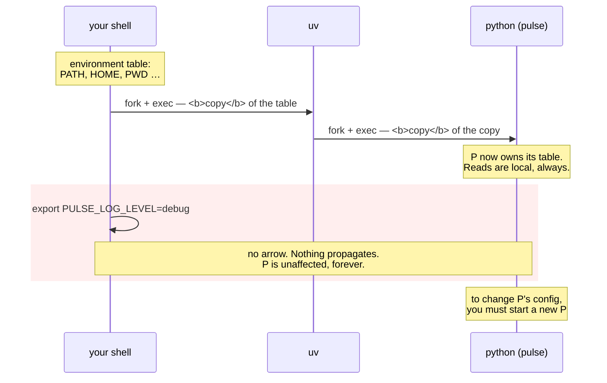

# 1.2 — The environment is the interface

## One-line answer

Every process is handed a small dictionary of strings when it starts — its **environment** — and that
dictionary is the one configuration channel that every operating system, every language, every container
runtime and every scheduler already agrees on, which is why it is the interface rather than a config file.

---

## The story

🎬 **The scene.** A courier arrives at a warehouse with a parcel. Taped to the parcel is an envelope, and in
the envelope is a single sheet of paper: the delivery address, the recipient's name, and a note saying
whether a signature is required.

The warehouse is in one country, the courier company is another company entirely, the parcel came from a
third. None of them share software, a language or a filing system. They share one thing: **everybody knows
what an envelope taped to a parcel means.**

😬 **The naive fix.** A clever warehouse manager decides the envelope is primitive. He builds a portal.
Senders log in and enter delivery details in a form, and the parcel arrives bare. It is a much better
system, in the sense that it has search, and validation, and a history.

💥 **Why it fails.** The next courier company has its own portal. The warehouse across town has a
spreadsheet. The overseas partner uses paper. Now the manager maintains four integrations, and every new
partner is a project rather than a delivery. Worse: when a parcel arrives with nothing on it, there is no
longer any way to find out where it should go, because the answer was never *with the parcel*.

💡 **The insight.** **The lowest common denominator wins the integration problem.** A mechanism that
everybody already implements beats a better mechanism that each party has to adopt — and the value travelling
*with* the thing beats the value stored somewhere the thing has to go and look up.

---

## The idea in plain language

Here is the mechanism, from the bottom.

**Every running program on a Unix-like system carries a small table of name–value pairs.** Both the names and
the values are plain text. That table is called the **environment**, and each entry is an **environment
variable**. `PATH` is one you have used without noticing: it is how a shell knows where to find `git`.

Day 4 established what a process is and where one comes from — a program plus the state that makes it a
running thing, created by an existing process
([Day 4, 1.1](../../../day-004-linux-for-operators-i/parts/01-the-process/1.1-a-process-is-not-a-program.md)).
The environment is part of that state, and it has three properties that between them decide everything in
this part:

**One — it is inherited.** When a process starts another process, the child gets a *copy* of the parent's
environment. Your shell has an environment; `uv` inherits it; `uvicorn` inherits it from `uv`; `pulse`
inherits it from `uvicorn`. Nobody had to pass anything along explicitly. That is why a value you set in a
terminal is visible four levels down.

**Two — it is a copy, taken once.** The child's table is *its own* from the moment it starts. Changing the
parent's afterwards changes nothing in the child. This is the single most common surprise in this part, and
it has a name worth remembering: **a process's environment is a snapshot, not a subscription.**

**Three — it is strings all the way down.** There are no numbers, no booleans, no lists, no null. `PORT` is
not the number 8000; it is the three-character-plus text `"8000"`. [1.3](1.3-everything-from-the-environment-is-a-string.md)
is entirely about what that costs you.

### Why this, rather than a config file

A configuration file feels more civilised. It has structure, comments and types. The twelve-factor argument
against relying on one is specific, and it is worth reading rather than paraphrasing. From
`https://12factor.net/config`, fetched on **2026-08-25**:

> *"Another approach to config is the use of config files which are not checked into revision control … This
> is a huge improvement over using constants which are checked into the code repo, but still has weaknesses:
> it's easy to mistakenly check in a config file to the repo; there is a tendency for config files to be
> scattered about in different places and different formats, making it hard to see and manage all the config
> in one place. Further, these formats tend to be language- or framework-specific."*

And the positive case:

> *"Env vars are easy to change between deploys without changing any code; unlike config files, there is
> little chance of them being checked into the code repo accidentally; and unlike custom config files, or
> other config mechanisms such as Java System Properties, they are a language- and OS-agnostic standard."*

**"Language- and OS-agnostic standard" is the whole argument.** Everything downstream in this curriculum
speaks it natively and nothing had to agree in advance:

| Where you meet it | How config arrives | Day |
| --- | --- | --- |
| a shell | `PULSE_PORT=8001 uv run ...` | today |
| Docker | `docker run -e PULSE_PORT=8001` | Day 24 |
| Docker Compose | an `environment:` block | Day 26 |
| Kubernetes | `env:` and `envFrom:` on a container | Day 35 |
| a CI runner | repository or job variables | Day 13 |
| a model provider client | `GOOGLE_GENAI_USE_VERTEXAI`, `GROQ_API_KEY` | Day 125 |

Six completely unrelated systems, one mechanism, no adapters. That is what a lowest common denominator buys.

### The trap the same page names, which is Day 10's problem

There is one more paragraph on that page, and it is the one everybody skips:

> *"Sometimes apps batch config into named groups (often called 'environments') named after specific
> deploys, such as the development, test, and production environments in Rails. This method does not scale
> cleanly … In a twelve-factor app, env vars are granular controls, each fully orthogonal to other env vars.
> They are never grouped together as 'environments', but instead are independently managed for each deploy."*

Read that against tomorrow's title — *Environments and promotion* — and you have found a genuine tension
rather than a contradiction, so it is worth stating plainly now:

**An environment is a useful word for "which deploy is this".** It is not a useful mechanism for *deriving*
settings. `PULSE_ENVIRONMENT=prod` is a fine variable: it labels the deploy, it goes into every log line
(Day 67) and every metric (Day 62), and it is how you tell two dashboards apart. But
`if environment == "prod": timeout = 30` inside your code is the anti-pattern the paragraph is warning about
— because now the value cannot be seen from outside, cannot be changed for one deploy, and a new deploy
called `staging-eu` silently gets the `dev` branch of that `if`.

**The rule:** the environment *name* is data. The environment *name* is never a switch.
[Day 10, 1.4](../../../day-010-environments-and-promotion/parts/01-what-an-environment-is/1.4-the-environment-name-is-not-a-switch.md)
takes this apart properly, with the failure it causes.

---

## Why Kriya needs it

**Day 24** runs `pulse` in a container, where there *is no shell you can log into to fix something*. The
only ways in are the image (fixed at build time) and the environment (supplied at run time). A service that
reads config any other way is a service you cannot configure in a container without rebuilding it.

**Day 35** supplies that environment from a `ConfigMap` and a `Secret`. Both objects exist to produce
environment variables in a container, and their entire design — including why they are two objects — assumes
the mechanism in this part.

**Day 67** puts structured logging into `pulse`, and the first fields every log line will carry are the
service name, the version and the environment. Two of those three are configuration read exactly the way
this part describes.

**Day 125** is where this stops being convenience and starts being safety: the model provider's key arrives
as an environment variable and must never arrive any other way. Addendum 01 requires
`GOOGLE_GENAI_USE_VERTEXAI=FALSE` for the free path — an environment variable that decides whether a call is
free or billable. **That is not configuration hygiene; that is the money.**

**Day 232** (day-2 operations) asks you to answer *"what is this deploy actually running with?"* about a
service you set up months earlier. The answer is only possible because the config was external and
inspectable rather than compiled in.

---

## The mechanism

Look at the table your own shell is carrying:

```bash
printenv | sort | head -12
printenv | wc -l
```

**Line by line:**

- `printenv` with no arguments prints the whole environment, one `NAME=value` per line. It is a tiny program
  whose only job is to print its own inherited table — which is itself the demonstration: it did not ask for
  the values, it was *given* them.
- `sort` because the order is not meaningful and an unsorted list is harder to scan.
- `wc -l` — the count. **Look at the number.** Most people are surprised it is in the dozens; every one of
  those was inherited by every command you have run today.

```text
ALLUSERSPROFILE=C:\ProgramData
APPDATA=C:\Users\you\AppData\Roaming
COMSPEC=C:\WINDOWS\system32\cmd.exe
HOME=C:\Users\you
HOSTNAME=your-machine
LANG=en_US.UTF-8
LOGNAME=you
MSYSTEM=MINGW64
PATH=/mingw64/bin:/usr/bin:/c/Users/you/bin:...
PWD=/c/Users/you/OneDrive/Desktop/Projects/kriya
SHELL=C:\Program Files\Git\usr\bin\bash.exe
TERM=xterm-256color
61
```

Now set one and watch it be inherited:

```bash
PULSE_PORT=8001 uv run python -c "import os; print('the child sees:', os.environ.get('PULSE_PORT'))"
echo "the shell afterwards sees: ${PULSE_PORT:-<unset>}"
```

**Line by line:**

- `PULSE_PORT=8001 <command>` — an assignment *immediately before* a command sets the variable **for that
  command only**. This is the form to use in every example in this curriculum: it cannot leak into later
  commands, and it cannot be forgotten and left set.
- `os.environ` — Python's view of the same table, a mapping of `str` to `str`. Verified against
  `https://docs.python.org/3/library/os.html` on **2026-08-25**: *"A mapping object where keys and values are
  strings that represent the process environment."*
- `.get('PULSE_PORT')` rather than `os.environ['PULSE_PORT']` — `.get` returns `None` for a missing key;
  the subscript raises `KeyError`. Neither is right in real code, and [3.1](../03-fail-fast/3.1-fail-fast-the-crash-that-saves-the-night.md)
  argues that the second is much closer to right than the first.
- `${PULSE_PORT:-<unset>}` — shell syntax for *"the value, or this text if it is unset"*. It is here to prove
  the variable is gone afterwards.
- Note that the value passed through **three** processes to get there: bash → `uv` → `python`. Nobody wrote
  code to forward it.

```text
the child sees: 8001
the shell afterwards sees: <unset>
```

### Inheritance, and the snapshot

Now the property that causes real incidents. Start a process, change the variable, and ask the running
process what it sees:

```bash
uv run python -c "
import os, time, sys
print('at start :', os.environ.get('PULSE_LOG_LEVEL', '<unset>')); sys.stdout.flush()
time.sleep(6)
print('6s later :', os.environ.get('PULSE_LOG_LEVEL', '<unset>'))
" &
CHILD=$!
sleep 2
export PULSE_LOG_LEVEL=debug
echo "parent set PULSE_LOG_LEVEL=debug while the child was running"
wait $CHILD
unset PULSE_LOG_LEVEL
```

**Line by line:**

- `&` puts the Python process in the background so the shell can keep going — Day 4's process tree, with your
  shell as the parent ([Day 4, 1.2](../../../day-004-linux-for-operators-i/parts/01-the-process/1.2-pid-parent-and-the-process-tree.md)).
- `CHILD=$!` — `$!` is the process ID of the most recent background job, so the shell can wait for exactly
  that one rather than for everything.
- `sys.stdout.flush()` — without it the first line may sit in a buffer and appear *after* the shell's message,
  making the ordering of the demonstration look wrong when it is not. Day 5's logging section met the same
  buffering ([Day 5, 4.1](../../../day-005-linux-for-operators-ii/parts/04-logs-that-rotate/4.1-why-a-log-file-is-an-operational-liability.md)).
- `export PULSE_LOG_LEVEL=debug` — `export` marks a shell variable to be passed to *future* children. **Not
  to existing ones.** That word "future" is the entire lesson.
- `unset` at the end so the variable does not leak into the rest of your session and quietly change a later
  experiment.

```text
at start : <unset>
parent set PULSE_LOG_LEVEL=debug while the child was running
6s later : <unset>
```

**The running process never saw it.** Its table was copied at start and is now its own private property.
There is no notification, no reload and no error — just a value that is set in your shell, visibly correct
in `printenv`, and absent from the process you set it for.



**This is why "restart the service to pick up the config" is not laziness — it is the only mechanism there
is.** A process cannot be told a new environment. Day 41's rolling update exists precisely because changing
configuration means replacing processes, and replacing processes has to be done without dropping requests.

### Seeing another process's environment

You can read what a *running* process was given, which is the single most useful debugging move in this part:

```bash
PULSE_ENVIRONMENT=dev uv run uvicorn pulse.api:app --host 127.0.0.1 --port 8000 &
sleep 3
PID=$(pgrep -f 'uvicorn pulse.api:app' | head -1)
echo "pid: $PID"
tr '\0' '\n' < /proc/$PID/environ 2>/dev/null | grep -E '^PULSE_' \
  || powershell -NoProfile -Command "(Get-Process -Id $PID).StartInfo" 2>/dev/null \
  || echo "no /proc on this shell — see the note below"
kill $PID
```

**Line by line:**

- `/proc/<pid>/environ` — on Linux, a file holding that process's environment as **NUL-separated** text. This
  is the same `/proc` filesystem Day 6 used to read memory numbers
  ([Day 6, 1.1](../../../day-006-resources-and-the-oom-killer/parts/01-memory/1.1-virtual-memory-and-why-the-number-is-a-lie.md)).
- `tr '\0' '\n'` — turn the NUL separators into newlines so it is readable. Without it the whole file prints
  as one run-on line and looks corrupted.
- `grep -E '^PULSE_'` — only our own variables. **Do not print the whole thing casually**, and remember why:
  a real service's environment is exactly where its credentials are. This command is a credential dump on
  any machine that matters, which is [4.2](../04-secrets/4.2-the-seven-places-a-secret-leaks.md)'s leak
  number four.
- The `||` fallbacks exist because **Git Bash on Windows has no `/proc`.** Say so in the document rather than
  letting the reader think the command failed: on this machine the honest answer is that you cannot read
  another process's environment from Git Bash, and you will be able to from WSL2 on Day 21 and from
  `kubectl exec` on Day 36.

```text
pid: 24118
PULSE_ENVIRONMENT=dev
```

---

## When it breaks

**The variable that was set in the other terminal.** The most common configuration bug there is:

```text
$ echo $PULSE_PORT
8001
$ curl -sS -o /dev/null -w '%{http_code}\n' http://127.0.0.1:8001/healthz
000
curl: (7) Failed to connect to 127.0.0.1 port 8001 after 2 ms: Could not connect to server
```

**What it says:** nothing is listening on 8001.
**What it actually means:** the service is running on 8000, because it was started from a *different shell* —
one whose environment did not have the variable, or which started the process before the `export`.
**The smallest fix:** stop the service and start it again from the shell that has the value, or better, set
it inline on the command that starts it so the two can never disagree.
**Why it eats an evening:** `echo $PULSE_PORT` says `8001`, so every check you run confirms the value is
correct. **You are querying the wrong process's environment**, and the shell will confirm your wrong belief
as many times as you ask it.

**`export` forgotten.** The quieter cousin:

```text
$ PULSE_PORT=8001
$ uv run python -c "import os; print(os.environ.get('PULSE_PORT'))"
None
```

**What it says:** the child sees nothing.
**What it actually means:** an assignment on its own line creates a **shell variable**, which is private to
the shell. Only `export` (or the inline `VAR=value command` form) puts it in the table that children inherit.
**The smallest fix:** `export PULSE_PORT=8001`, or the inline form.
**The reason this is confusing:** `echo $PULSE_PORT` prints `8001` in both cases. The shell can see it; the
child cannot. **The variable exists in a place children do not look.**

**The name that is nearly right.** The one with no error at all:

```text
$ PULSE_LOGLEVEL=debug uv run uvicorn pulse.api:app --port 8000
INFO:     Started server process [22140]
INFO:     Uvicorn running on http://127.0.0.1:8000 (Press CTRL+C to quit)
```

**What it says:** a normal, successful startup.
**What it actually means:** the service expected `PULSE_LOG_LEVEL` and you supplied `PULSE_LOGLEVEL`. The
variable was accepted by the shell (any name is a legal name), passed to the process (which took it happily),
and read by nobody. **Logging is at the default level and there is no message anywhere saying so.**
**The smallest fix:** a settings layer that *rejects* unknown variables instead of ignoring them — which is
exactly what [2.3](../02-typed-settings/2.3-naming-prefixes-and-the-variable-nobody-read.md) builds, and it
is the single strongest argument for not reading `os.environ` by hand.

**The value that changed underneath you.** The snapshot problem, in its real clothing:

```text
$ kubectl set env deployment/pulse PULSE_LOG_LEVEL=debug
deployment.apps/pulse env updated
$ kubectl logs deployment/pulse --tail=2
INFO  request completed path=/predict status=200
INFO  request completed path=/predict status=200
```

**What it says:** the update was accepted.
**What it actually means:** in this case it worked *only because* changing a Deployment's `env` triggers new
pods — new processes, with new environments. Had you edited a `ConfigMap` mounted as environment variables
instead, the change would have landed in the object and **not** in any running process, and there would be no
error to tell you. Day 35 makes exactly this distinction, and it is this part's snapshot rule wearing
Kubernetes clothes.

---

## In production

**What a professional writes instead of the teaching version.** They never rely on the ambient shell. Every
process is started by something that supplies the environment explicitly — a unit file, a Compose file, a
Pod spec — so the configuration of a running service is *readable from a file in a repository* rather than
from the memory of whoever started it. The habit shows up in small ways: they use the inline
`VAR=value command` form in documentation and chat, never `export`, because a pasted `export` outlives the
paste and silently configures the next thing you run.

**What degrades at scale.** Two things. First, **size**: the environment is passed to every child process,
and everything a service spawns pays for it. It is measured in kilobytes, not megabytes, and there are
platform limits; a team that puts a certificate chain in an environment variable will meet one. Second, and
much more important, **visibility**: at ten services the environment is a good interface, and at three
hundred nobody can answer "which deploys have this variable set" without a tool that reads them all. That
tool is what Day 55's GitOps repository becomes — the environment for every deploy, in git, diffable.

**The failure that only shows with real traffic.** A variable read *per request* rather than at startup.
`os.environ.get(...)` inside a request handler works perfectly and costs a dictionary lookup, so nobody
notices — until an operator changes it and nothing happens, or until a test sets it and leaks into the next
test. The behaviour is undefined in the worst way: **correct, until somebody expects it to be dynamic.**
[2.4](../02-typed-settings/2.4-the-settings-object-read-at-import-time.md) is the whole story.

**The review comment a senior engineer leaves.** *"This reads `os.environ` in three different modules. That
means there is no single place that says what this service can be configured with, and no place that can
reject a typo. Read it once, at startup, into one object, and pass the object. If a module needs a value it
should be given it, not go looking."*

**The signal you would alert on.** None, directly — an environment variable does not emit anything. What you
do instead is **make the resolved configuration observable**: `pulse` will expose it on an endpoint, with
secrets redacted ([5.1](../05-pulse-configured/5.1-pulse-config-the-settings-object.md)), and every log line
will carry the environment name (Day 67). The alert that follows is not on the config; it is
`config_hash` appearing with more than one distinct value inside a single deploy — which means your rollout
is half-done, and Day 41 will page you for it. You would **not** alert on a value changing.

**Blast radius.** This part starts one uvicorn process on port 8000 and kills it, and reads `/proc` for one
process. Worst case: a stale background process left listening on 8000, which will make the *next* part's
demonstration measure the wrong server — the hazard Day 8 named as trap 7. Who can trigger it: you. What
bounds it: every backgrounded command in this part is killed explicitly by PID, and the day's checklist
verifies with `netstat` rather than trusting `kill`.

**Cost.** `0` model calls, `0` tokens, `0` CI minutes, `0` new packages, `0` network. RAM: one uvicorn
process, roughly 60 MB, for a few seconds. Disk: `0`.

**The interview question.** *"How does configuration get into a containerised service, and what happens when
you change it?"* The answer that shows experience covers the snapshot: *"Environment variables, supplied by
whatever starts the process — and the key property is that a process gets a copy of that table at exec time
and never sees a change afterwards. So 'changing the config' always means replacing the process. That is why
a config change is a rollout, why you need the rollout to be safe before you need dynamic config, and why
`kubectl set env` works while editing a mounted ConfigMap's values does not always. If somebody tells me a
config change is live without a restart, my first question is which mechanism is re-reading it, and my second
is what happens if two replicas re-read it at different moments."*

---

## Check yourself

```bash
PULSE_ENVIRONMENT=dev uv run python -c "
import os
print('PULSE_ENVIRONMENT :', os.environ.get('PULSE_ENVIRONMENT', '<unset>'))
print('PULSE_PORT        :', os.environ.get('PULSE_PORT', '<unset>'))
print('total variables   :', len(os.environ))
"
```

One variable set, one not, and a count of everything that was inherited without being asked for.

**Say out loud, without scrolling up:** *Explain why setting an environment variable in your shell does not
change a service that is already running — and then say what that fact implies about how a configuration
change reaches a service in production.*
