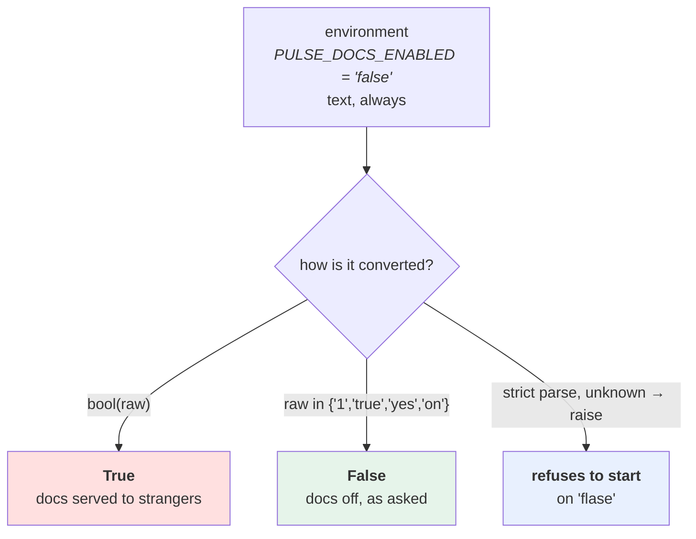

# 1.3 — Everything from the environment is a string

## One-line answer

The environment holds text and nothing else, so **every type your configuration has is a promise somebody has
to keep by converting it** — and the conversion that goes wrong most often and most quietly is the boolean,
because in Python `bool("false")` is `True`.

---

## The story

🎬 **The scene.** A hospital ward. Above each bed, a small whiteboard, and on it the nurse writes the
patient's fluid restriction for the day. It is a whiteboard, so everything on it is handwriting: a number, a
word, sometimes a dash.

One morning a bed's board reads `1.5` and another reads `1,5` and a third reads `one and a half`. All three
nurses meant the same thing. All three boards are correct English.

😬 **The naive fix.** The new pump software reads the boards through a camera and takes the first characters
it recognises as a number.

💥 **Why it fails.** `1,5` becomes `1`. Nobody typed a wrong value, nobody misread anything, and the machine
did exactly what it was told. The board is a **surface for text**; the meaning was in the nurse's head, and
the camera is not in the nurse's head.

And the worst board is the one that reads `no restriction`. The camera finds no number, and the software's
author wrote *"if we can't read a number, don't restrict"* — which is the single most reasonable-sounding
line of code on this page and the most dangerous.

💡 **The insight.** **A channel that carries text carries no meaning.** Every type — number, yes/no, list,
date — exists only where somebody converts the text and says what an unconvertible value means. If nobody
decides, the default decides, and the default was chosen by whoever wrote the language.

---

## The idea in plain language

`os.environ` is a mapping of `str` to `str`. That is the whole type system. Verified against
`https://docs.python.org/3/library/os.html` on **2026-08-25**: *"A mapping object where keys and values are
strings that represent the process environment."*

So when your inventory from [1.1](1.1-what-configuration-actually-is.md) says `port` is an `int` and
`docs_enabled` is a `bool`, those are not facts about the environment. They are **claims your code must make
true**, and each one has three questions attached:

1. **What text converts to what value?** Is `"1"` true? Is `"yes"`? Is `"True"`? Is `"TRUE"`?
2. **What happens to text that does not convert?** `PULSE_PORT=eight-thousand` — crash, ignore, or default?
3. **What does "not set at all" mean, and is it different from "set to empty"?**

That third question is the one people have never thought about, and it matters. `PULSE_API_KEY` **unset**
usually means *"nobody configured this"*. `PULSE_API_KEY=` — set, to the empty string — usually means *"the
deployment system tried to configure this and had nothing to give"*. Those are wildly different situations,
and the first is a mistake while the second is an incident.

### The boolean is where the bodies are

Here is the fact to burn in, because it has taken real services down and it takes ten seconds to demonstrate:

**In Python, a non-empty string is true. `"false"` is a non-empty string.**

So this line, which appears in an enormous amount of production code, is always true unless the variable is
missing or empty:

```text
DEBUG = bool(os.environ.get("DEBUG"))
```

Setting `DEBUG=false` to turn debugging *off* turns it *on*. Setting `DEBUG=0` turns it on. Setting
`DEBUG=no` turns it on. The only ways to make it false are to unset it or set it to nothing at all — which is
the exact opposite of what a person typing `DEBUG=false` believes.

**And it produces no error, no warning and no log line.** The service starts, reports healthy, and behaves
in a way somebody explicitly asked it not to.

### What "the right conversion" looks like

There is no universal answer, but there is a defensible one, and it is worth choosing deliberately rather
than inheriting:

| Type | Accept | Reject | Why |
| --- | --- | --- | --- |
| bool | `1 true yes on` / `0 false no off`, any case | everything else, loudly | the set is small, so anything outside it is a typo, and a typo must not silently become a default |
| int | digits, optional sign | `""`, `8000.0`, `8_000`, whitespace-only | an unparseable port is not a port; there is no sensible fallback |
| float | anything `float()` accepts, minus `nan` and `inf` | `nan`, `inf` | a timeout of `inf` is a service that hangs — Day 7's whole argument |
| enum | exactly the listed values | anything else | `PULSE_ENVIRONMENT=prod` versus `production` must not both be accepted silently as different deploys |
| list | one separator, chosen and documented | ambiguous separators | comma or space; pick one, because a value containing the other is coming |
| secret | any non-empty text | empty | an empty credential is worse than a missing one — [4.1](../04-secrets/4.1-what-makes-a-secret-a-secret.md) |

**The `bool` row is the one that matters**, and note what it says: *reject everything else, loudly*. Not
"default to false". A value of `PULSE_DOCS_ENABLED=flase` should stop the service, because the alternative is
a service running with docs in a state nobody chose.

---

## Why Kriya needs it

**Day 3 already made a decision this part can break.** The interactive documentation endpoint is a real
capability — it lists every route and every field of every model
([Day 3, 3.3](../../../day-003-pulse-v0/parts/03-running-it/3.3-the-interactive-docs-and-why-you-turn-them-off.md)).
The moment `docs_enabled` becomes configuration, `docs_enabled=false` failing to disable it is an information
disclosure with a two-line cause.

**Day 7's timeouts are floats supplied from outside.** A timeout that fails to parse and falls back to "no
timeout" is precisely the failure that took `pulse` down on Day 7
([Day 7, 4.1](../../../day-007-networking-for-operators/parts/04-timeouts/4.1-a-timeout-is-a-decision-not-a-safety-net.md)),
reached by a completely different route.

**Day 35** puts these values in a Kubernetes `ConfigMap`, where every value is quoted YAML and the classic
YAML trap is waiting: an unquoted `no` in YAML has historically parsed as boolean false, and an unquoted
`8000` as an integer that Kubernetes then refuses because the field wants a string. Two type systems in a
row, both invisible.

**Day 44** configures an autoscaler with numbers that arrive as text: minimum replicas, maximum replicas,
target utilisation. **A maximum that silently defaults is trap #4 from the plan's §5.1** — an autonomy with
no brake — reached through a parsing bug rather than a design decision.

**Day 126** sets `GOOGLE_GENAI_USE_VERTEXAI=FALSE` because Addendum 01 requires the free path. If that string
is read with `bool(...)`, it is `True`, and the client takes the billable route. **This part is the one that
protects the zero-cost rule from a type error.**

---

## The mechanism

Demonstrate the boolean first, because seeing it is more convincing than reading it:

```bash
uv run python -c "
for raw in ['true', 'True', 'false', 'False', '0', 'no', 'off', '', 'flase']:
    print(f'{raw!r:>10}  bool()={bool(raw)!s:<6}  sensible={raw.strip().lower() in {\"1\",\"true\",\"yes\",\"on\"}}')
"
```

**Line by line:**

- `bool(raw)` — the naive conversion, exactly as it appears in real code. It answers one question only: *is
  this string non-empty?*
- `raw.strip().lower() in {...}` — the honest conversion: strip surrounding whitespace, lower the case,
  and compare against an explicit set of accepted truths.
- `.strip()` is not decoration. **A value that arrives from a `.env` file or a YAML block routinely carries a
  trailing space**, and `"true "` is not `"true"`.
- `{"1","true","yes","on"}` — a `set`, so membership is a single lookup and the accepted vocabulary is
  visible in one place rather than spread across an `or` chain.
- `'flase'` is in the list on purpose. Look at what both columns say about it, and notice that **neither one
  raises**. Both silently pick an answer; only a third option — refusing — is correct, and that is
  [3.2](../03-fail-fast/3.2-validating-the-value-not-just-its-presence.md).

```text
    'true'  bool()=True    sensible=True
    'True'  bool()=True    sensible=True
   'false'  bool()=True    sensible=False
   'False'  bool()=True    sensible=False
       '0'  bool()=True    sensible=False
      'no'  bool()=True    sensible=False
     'off'  bool()=True    sensible=False
        ''  bool()=False   sensible=False
   'flase'  bool()=True    sensible=False
```

**Read the `'false'` row again.** `bool()` says `True`. That is the bug, in one line, and it is in more
production code than any other single mistake in this day.

### Unset, empty, and whitespace are three different things

```bash
uv run python -c "
import os
for name in ['PULSE_A', 'PULSE_B', 'PULSE_C']:
    present = name in os.environ
    value = os.environ.get(name)
    print(f'{name}: present={present!s:<5} value={value!r:<8} get_or_default={os.environ.get(name, \"DEFAULT\")!r}')
" 
echo '--- now with B set to empty and C set to a single space ---'
PULSE_B= PULSE_C=' ' uv run python -c "
import os
for name in ['PULSE_A', 'PULSE_B', 'PULSE_C']:
    present = name in os.environ
    value = os.environ.get(name)
    print(f'{name}: present={present!s:<5} value={value!r:<8} get_or_default={os.environ.get(name, \"DEFAULT\")!r}')
"
```

**Line by line:**

- `name in os.environ` — the *presence* question, which is a completely different question from *"what is the
  value"*. Almost all configuration bugs of this class come from asking only the second one.
- `os.environ.get(name, "DEFAULT")` — the crucial demonstration: **a default only applies when the key is
  absent.** An empty string is a value, so the default does not fire, and the code gets `""` where it expected
  `"DEFAULT"`.
- `PULSE_B=` — the shell's syntax for *set to empty*. This is exactly what a deployment system produces when
  it substitutes a variable that has no value — a template rendering `PULSE_B=${SOME_UNSET_THING}` yields
  precisely this.
- `PULSE_C=' '` — a single space, which is what happens when a value is copied out of a spreadsheet, a chat
  message or a YAML block scalar.
- `!r` in the f-string — `repr`, so an empty string prints as `''` and a space prints as `' '`. **Without
  `!r` those two print identically as nothing**, and the entire demonstration becomes invisible.

```text
PULSE_A: present=False value=None     get_or_default='DEFAULT'
PULSE_B: present=False value=None     get_or_default='DEFAULT'
PULSE_C: present=False value=None     get_or_default='DEFAULT'
--- now with B set to empty and C set to a single space ---
PULSE_A: present=False value=None     get_or_default='DEFAULT'
PULSE_B: present=True  value=''       get_or_default=''
PULSE_C: present=True  value=' '      get_or_default=' '
```

**`PULSE_B` is set, and its default did not apply.** A service reading `os.environ.get("PULSE_API_KEY", None)`
and checking `if key is None` will sail straight past an empty key and send an empty credential to a provider
— which returns a `401`, hours later, from a code path nobody was watching.

### Numbers, and the failure that has a fallback

```bash
uv run python -c "
import os

def port_naive() -> int:
    try:
        return int(os.environ.get('PULSE_PORT', '8000'))
    except ValueError:
        return 8000

def port_honest() -> int:
    raw = os.environ.get('PULSE_PORT', '8000')
    return int(raw)

print('naive :', port_naive())
try:
    print('honest:', port_honest())
except ValueError as exc:
    print('honest: refused ->', exc)
"
```

**Line by line:**

- `port_naive` is the version almost everybody writes first, and its `except ValueError: return 8000` is the
  camera deciding *"no restriction"*. It converts a **configuration error** into a **silent behaviour
  change**, and the service comes up on a port nobody asked for.
- `port_honest` does not catch. `int()` raises `ValueError` on anything it cannot parse, and letting it
  propagate is the correct behaviour — this is Principle 10, *fail honestly and loudly*, applied to a
  three-line function.
- `os.environ.get('PULSE_PORT', '8000')` — note the default is the **string** `'8000'`, not the integer.
  Keeping the whole pipeline as text until one explicit conversion means there is exactly one place where the
  type is decided. A default of `8000` (an int) would make the function sometimes-convert and
  sometimes-not, and the bug that hides there only appears when the variable is set.
- The `try` in the *caller*, not the function, is deliberate: this demonstration needs to show the exception,
  and real code would let it kill the process — see [3.1](../03-fail-fast/3.1-fail-fast-the-crash-that-saves-the-night.md).

Run it twice, once clean and once with a bad value:

```text
$ PULSE_PORT=8001 <the command above>
naive : 8001
honest: 8001

$ PULSE_PORT=eight-thousand-and-one <the command above>
naive : 8000
honest: refused -> invalid literal for int() with base 10: 'eight-thousand-and-one'
```

**The naive version printed `8000` and told you nothing.** Somebody asked for a different port, got the
default, and the only evidence is a service listening where they did not expect. The honest version produced
a sentence containing the variable's actual value, which is a bug report you can act on.



**All three arrows are one line of code.** The difference between them is the entire type story of
configuration.

---

## When it breaks

**The boolean that meant the opposite.** The one with real consequences:

```text
$ PULSE_DOCS_ENABLED=false uv run uvicorn pulse.api:app --port 8000 &
$ curl -sS -o /dev/null -w '%{http_code}\n' http://127.0.0.1:8000/docs
200
```

**What it says:** the documentation endpoint answered successfully.
**What it actually means:** you asked for it to be off. The value `"false"` was read with `bool()`, which is
`True`, so the code took the "enabled" branch. **Every route and every field of every request model is now
readable by anyone who can reach the service.**
**The smallest fix:** an explicit truth set, and — better — refusing values outside it.
**Why it is the worst kind of bug:** it has no error, no log line, and the check that would catch it is
`curl /docs`, which nobody runs because nobody suspects. It is discovered by a stranger.

**The port that fell back.** The quiet one:

```text
INFO:     Started server process [18242]
INFO:     Uvicorn running on http://127.0.0.1:8000 (Press CTRL+C to quit)
```

**What it says:** a completely normal startup on 8000.
**What it actually means:** `PULSE_PORT` was `80O0` — with a capital letter O instead of a zero — and a
`try/except ValueError` turned that into the default.
**The smallest fix:** delete the `except`.
**Why the output is the evidence:** the startup line **does** contain the truth. Day 3 spent a whole part on
reading it ([Day 3, 3.2](../../../day-003-pulse-v0/parts/03-running-it/3.2-reading-the-startup-output.md)),
and this is why: the only signal that your configuration was ignored is a number in a line everybody scrolls
past.

**The empty credential.** The one that fails far from its cause:

```text
httpx2.HTTPStatusError: Client error '401 Unauthorized' for url 'https://api.example.com/v1/models'
{"error":{"message":"You didn't provide an API key.","type":"invalid_request_error"}}
```

**What it says:** no key was provided.
**What it actually means:** a key *was* provided — the empty string — because the deployment template
substituted a variable that did not exist. `os.environ.get("KEY")` returned `""`, which is not `None`, so the
`if key is None:` guard did not fire.
**The smallest fix:** treat empty as missing for every secret, explicitly, and refuse at startup
([3.2](../03-fail-fast/3.2-validating-the-value-not-just-its-presence.md)).
**Why it costs a night:** the failure is at first *use*, which may be hours after startup and on a machine
that has already reported healthy for a long time.

**The float that became infinite.** The rarest and the most spectacular:

```text
>>> float("inf")
inf
>>> httpx2.get("http://127.0.0.1:9999/", timeout=float("inf"))
   ... hangs forever ...
```

**What it says:** nothing. It never returns.
**What it actually means:** `float()` accepts `"inf"`, `"Infinity"` and `"nan"` as valid input, so a timeout
read from configuration can legally be "never". Day 7 established that a call with no timeout is how a
service dies with every signal green
([Day 7, 5.3](../../../day-007-networking-for-operators/parts/05-the-two-together/5.3-hanging-pulse-on-purpose.md)).
**The smallest fix:** bound the value as well as parsing it — a timeout is `> 0` and `< some ceiling`, and
pydantic will express that in one line in [2.2](../02-typed-settings/2.2-adopting-pydantic-settings.md).

---

## In production

**What a professional writes instead of the teaching version.** They never hand-parse. Not because
hand-parsing is hard, but because hand-parsing is *distributed*: six modules, six slightly different truth
sets, and the `no`/`off`/`0` question answered differently in each. One typed settings object with one
converter per type, at one place, is the whole of the professional version — and that is
[section 2](../02-typed-settings/2.1-hand-rolling-the-settings-object.md), which is why this section
hand-rolls it once and then stops.

**What degrades at scale.** Not performance — **agreement.** At three services with the same boolean
convention, everything is fine. At thirty, a value that means "on" in one service means "off" in another, and
the person setting `FEATURE_X=0` across a fleet gets a different answer per service. Large organisations end
up with a written configuration standard for exactly this reason, and its first line is always the boolean
vocabulary.

**The failure that only shows with real traffic.** A numeric setting that parses fine and is *wrong by an
order of magnitude* — a pool size read as `5` because someone wrote `5,0`, or a timeout read as `3` when they
meant `0.3`. Parsing succeeded, so nothing complained. It behaves identically on your laptop and turns into
Day 8's connection-pool queue at a thousand requests per second
([Day 8, 2.2](../../../day-008-http-and-tls/parts/02-the-connection/2.2-the-connection-pool-and-its-limits.md)).
**The lesson: parsing correctly is necessary and not sufficient — bounds are the other half.**

**The review comment a senior engineer leaves.** *"`int(os.environ.get('WORKERS', 4))` — two problems. The
default is an int and the value is a str, so this function returns a different type depending on whether the
variable is set, and mypy will not catch it because `os.environ.get` is typed as returning `str | None`. And
there is no upper bound, so `WORKERS=1000` is accepted and will fork a thousand processes on a four-core
node. Parse it, bound it, and put both in the settings class."*

**The signal you would alert on.** Not the values themselves — but **the service should log its resolved
configuration once at startup, with secrets redacted, at INFO level**. That single line is the highest-value
diagnostic in this whole day: it converts "which port did it think it was using" from an investigation into a
`grep`. You would not alert on it. You would, however, page on the *absence* of a startup line in a deploy
that is supposed to be running, which is a liveness question rather than a configuration one, and Day 74's
alert on it will be built from exactly this observation.

**Blast radius.** This part runs Python one-liners and, in one failure demonstration, a uvicorn process on
port 8000 that serves interactive documentation to loopback only. Worst case: that process is left running
with docs enabled — on `127.0.0.1`, so it is reachable from this machine and nowhere else
([Day 7, 1.3](../../../day-007-networking-for-operators/parts/01-addresses-and-ports/1.3-binding-127-0-0-1-versus-0-0-0-0.md)).
Who can trigger it: you. What bounds it: the loopback bind, and the checklist's `netstat` sweep at the end of
the day.

**Cost.** `0` model calls, `0` tokens, `0` CI minutes, `0` new packages, `0` network, `0` disk. RAM: one
short-lived uvicorn process, roughly 60 MB.

**The interview question.** *"What is the most common configuration bug you have seen?"* The answer that
lands is specific and cheap to verify: *"A boolean read as `bool(os.environ.get(...))`. `'false'` is a
non-empty string, so it is `True`, and setting a flag to `false` turns it on. It has no error and no log
line, so it is found by someone noticing behaviour rather than by any check. I treat that as a type problem
rather than a code-review problem now — the environment carries text, so every type is a conversion, and
conversions belong in one settings object that refuses values it does not recognise instead of defaulting.
The related one is `os.environ.get(name, default)` not firing for an empty string, which is how empty
credentials reach providers."*

---

## Check yourself

```bash
uv run python -c "
raw = 'false'
print('bool(raw)                       ->', bool(raw))
print('raw.lower() in {1,true,yes,on}  ->', raw.strip().lower() in {'1','true','yes','on'})
print('os.environ.get with a default fires only when ABSENT, not when EMPTY')
"
```

**Say out loud, without scrolling up:** *Name the three distinct states an environment variable can be in,
say which two your code is most likely to confuse, and explain why `DEBUG=false` turns debugging on.*
