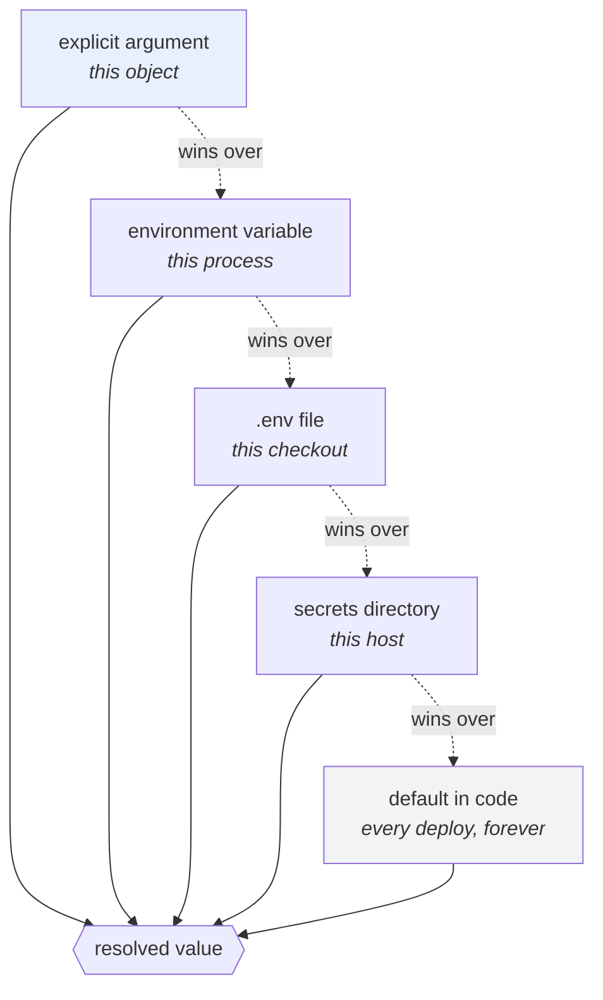

# 1.4 — The precedence ladder: who wins when two sources disagree

## One-line answer

Configuration almost never comes from one place, so a service needs a **written, ordered list of sources**
where the one closest to the deploy wins — and the single most useful thing that list can do is tell you,
at startup, which source a value actually came from.

---

## The story

🎬 **The scene.** A restaurant kitchen at the start of service.

There is a printed menu on the wall — the standing recipes, the way everything is made unless somebody says
otherwise. There is a whiteboard next to it with today's changes, because the fish delivery was short. There
is a note taped to one order ticket saying *"no dairy"*. And there is the head chef, standing behind the
line, who occasionally says a thing out loud.

Every cook in that kitchen knows the order without being told: the chef's voice beats the ticket, the ticket
beats the whiteboard, the whiteboard beats the menu on the wall.

😬 **The naive fix.** A new cook, on their first night, decides the wall menu is the authority because it is
printed and permanent, and the whiteboard is just somebody's handwriting.

💥 **Why it fails.** They send out four plates of the dish that was crossed off because the fish did not
arrive. Nothing they did was careless — they applied *an* order of precedence. They applied the wrong one,
because nobody had ever written it down; everyone else had absorbed it.

💡 **The insight.** **When several sources can answer the same question, the order between them is itself a
piece of information — and if it is not written down, every person and every program will invent a different
one.** The order that works is always the same shape: the more specific to *this moment and this place*, the
higher it wins.

---

## The idea in plain language

By the end of today, a value like `PULSE_PORT` could be stated in four different places at once:

- a **default** written in the code, because most deploys are happy with `8000`;
- a **`.env` file** on your laptop, because you always run on `8001` to avoid a clash;
- an **environment variable**, because the thing that started this process was told to use `9000`;
- an **explicit argument**, because a test constructed the settings object directly with `1234`.

All four are legitimate. All four can be present simultaneously. **Exactly one has to win**, and the choice
of which is not arbitrary — there is a principle underneath it.

**The principle: the source closest to *this particular running copy* wins.**

A default in the code applies to every deploy that ever existed, so it is the weakest possible statement. An
environment variable applies to one process on one machine right now, so it is the strongest ordinary one. A
value passed directly into the settings object applies to *this one construction of it*, which is narrower
still — that is why tests use it.

That principle produces the ladder, and it is worth stating the general form before the concrete one,
because the general form is what you will apply to tools this curriculum has not met yet:

| Rung | Source | Scope of the statement | Who sets it |
| --- | --- | --- | --- |
| highest | explicit arguments | this one object, in this one process | a test, or a piece of code |
| ↑ | environment variables | this process | whatever started it |
| ↑ | a `.env` file | this checkout, on this machine | the developer sitting here |
| ↑ | a secrets directory | this host or container | the platform |
| lowest | defaults in code | every deploy of this version, forever | whoever wrote the code |

**Read the "scope" column downwards and the ordering stops being a convention you memorise and becomes
something you can derive.** Narrow beats broad. That is all it is.

### The concrete ladder for this project

Section 2 adopts `pydantic-settings`, and its documented order is exactly the ladder above. Quoted verbatim
from `https://docs.pydantic.dev/latest/concepts/pydantic_settings/`, fetched on **2026-08-25**:

> *"In the case where a value is specified for the same Settings field in multiple ways, the selected value is
> determined as follows (in descending order of priority):*
>
> *If `cli_parse_args` is enabled, arguments passed in at the CLI.*
> *Arguments passed to the Settings class initialiser.*
> *Environment variables, e.g. `my_prefix_special_function` as described above.*
> *Variables loaded from a dotenv (.env) file.*
> *Variables loaded from the secrets directory.*
> *The default field values for the Settings model."*

Two things about that list are worth noticing before you use it.

**The environment beats the `.env` file.** That is the right way round and it is the one people get backwards.
`.env` is a convenience for a human sitting at a keyboard; the environment is how a platform speaks. If a
Kubernetes Pod spec sets `PULSE_PORT=9000` and a `.env` file that accidentally got baked into an image says
`8001`, the platform must win, or the platform cannot configure anything.
[1.5](1.5-dotenv-is-a-developer-convenience.md) is entirely about that file and why it must never be the
deployment mechanism.

**The secrets directory is *below* the `.env` file**, which surprises people who assume "more secure" means
"higher priority". Priority is not a security property. It is a specificity property, and a directory of
secret files mounted by a platform is a host-level fact, broader than a file in this particular checkout.

### The rule that makes the ladder usable

A ladder you cannot observe is a ladder you will misremember. So:

**Whatever your service resolves its configuration to, it must be able to say where each value came from.**

Not in a debugger, not by reasoning — printed, on demand, at startup or from a flag. Every hour anybody has
ever lost to configuration precedence was an hour spent guessing at something the program already knew.

---

## Why Kriya needs it

**Day 13** runs `pulse`'s tests in continuous integration, where the runner injects its own environment
variables and a `.env` file does not exist. A test that passes locally and fails in CI *because it was
silently reading your laptop's `.env`* is the first CI mystery almost everybody meets, and knowing the ladder
is what turns it into a two-minute fix.

**Day 26** starts `pulse` under Docker Compose, which reads a `.env` file **of its own** — for substituting
into the Compose file itself — that is a *different file with the same name* doing a *different job* at a
*different layer*. Two `.env` mechanisms in one directory, and only the ladder tells you which one produced
the value you are looking at.

**Day 35** layers a `ConfigMap` and a `Secret` into one container, then Day 53 layers Helm values on top of
that, then Day 55 layers a Kustomize overlay on top of *that*. By then a single value has five possible
origins and the question *"where did this come from?"* is asked in an incident rather than at leisure.

**Day 126** must guarantee that `GOOGLE_GENAI_USE_VERTEXAI=FALSE` wins over anything else that might set it.
That is a precedence question with a bill attached, and Addendum 01 is unambiguous about the answer.

---

## The mechanism

Build the ladder by hand once, so the adopted version in [2.2](../02-typed-settings/2.2-adopting-pydantic-settings.md)
is a convenience rather than a mystery. This is Principle 4 — build first, adopt after.

Create a scratch file to stand in for a `.env`:

```bash
mkdir -p days/day-009-configuration-and-secrets/lab
cd days/day-009-configuration-and-secrets/lab
printf 'PULSE_PORT=8001\nPULSE_LOG_LEVEL=debug\n' > sample.env
cat sample.env
```

**Line by line:**

- `mkdir -p` — `-p` creates parents and does not complain if the directory already exists, so the command is
  safe to re-run. Day 0's `./o scaffold` makes this directory too; doing it explicitly means this part is
  readable standalone.
- `printf` rather than `echo` — `printf` interprets `\n` identically everywhere, while `echo -e` differs
  between shells. **This matters in a document somebody will paste into a shell you did not test.**
- The file is called `sample.env`, **not `.env`**. A file named `.env` in the repository root is a landmine
  even when it holds nothing secret, and [1.5](1.5-dotenv-is-a-developer-convenience.md) explains exactly
  which foot it takes off.

```text
PULSE_PORT=8001
PULSE_LOG_LEVEL=debug
```

Now the resolver — the ladder, written out, with the origin recorded next to every value:

```python
# lab/ladder.py — resolve one setting through four sources and say which one won.
from __future__ import annotations

import os
from pathlib import Path

DEFAULTS: dict[str, str] = {"PULSE_PORT": "8000", "PULSE_LOG_LEVEL": "info"}


def read_env_file(path: Path) -> dict[str, str]:
    """Parse a KEY=value file. Deliberately naive - see 1.5 for what it does not handle."""
    values: dict[str, str] = {}
    if not path.is_file():
        return values
    for line in path.read_text(encoding="utf-8").splitlines():
        line = line.strip()
        if not line or line.startswith("#") or "=" not in line:
            continue
        key, _, value = line.partition("=")
        values[key.strip()] = value.strip()
    return values


def resolve(name: str, overrides: dict[str, str], env_file: Path) -> tuple[str, str]:
    """Return (value, source) for one setting, highest-priority source first."""
    if name in overrides:
        return overrides[name], "explicit argument"
    if name in os.environ:
        return os.environ[name], "environment"
    file_values = read_env_file(env_file)
    if name in file_values:
        return file_values[name], f"file {env_file.name}"
    if name in DEFAULTS:
        return DEFAULTS[name], "default in code"
    raise KeyError(f"{name} has no value from any source")


if __name__ == "__main__":
    overrides = {"PULSE_LOG_LEVEL": "warning"} if os.environ.get("USE_OVERRIDE") else {}
    for setting in ("PULSE_PORT", "PULSE_LOG_LEVEL"):
        value, source = resolve(setting, overrides, Path("sample.env"))
        print(f"{setting:<16} = {value:<10} (from {source})")
```

**Line by line:**

- `from __future__ import annotations` — lets annotations be written as plain text, so `dict[str, str]`
  works without importing anything from `typing`. It is the first line of nearly every module in this
  project.
- `DEFAULTS` as a module-level `dict[str, str]` — **string values, not integers**, so the whole ladder deals
  in one type and conversion happens exactly once, after resolution. That is
  [1.3](1.3-everything-from-the-environment-is-a-string.md)'s rule turned into a design decision.
- `read_env_file` returns `{}` for a missing file rather than raising. **A missing `.env` is normal** — it is
  absent in CI and in every container — so its absence is not an error. Contrast that with a *malformed*
  file, which is an error and is not handled here on purpose; see *When it breaks*.
- `line.partition("=")` rather than `line.split("=")` — `partition` splits on the **first** `=` only and
  always returns three parts. `split("=")` on `URL=https://x/?a=1` gives you three pieces and a bug.
- `if not line or line.startswith("#") or "=" not in line: continue` — the three things that are not
  settings. Note the order: cheapest test first, and `"=" not in line` last because it scans the string.
- `resolve` returns a **tuple of `(value, source)`**, and that second element is the entire point of this
  part. A resolver that returns only the value has thrown away the answer to the question you will actually
  ask at 2am.
- The `if` chain is in **descending priority order, top to bottom**, and it returns on the first match. That
  ordering is the ladder, made executable — and putting the rungs in source order means a reader can check
  the implementation against the table above by eye.
- `name in overrides` before `name in os.environ` — presence, not truthiness, exactly as
  [1.3](1.3-everything-from-the-environment-is-a-string.md) demanded, so an empty override still counts as a
  statement.
- `raise KeyError(...)` at the bottom rather than returning `None`. A setting with no value from any source
  is a programming error, not a runtime condition, and Principle 10 says it surfaces.
- `if os.environ.get("USE_OVERRIDE")` — a deliberately crude switch, used only to demonstrate the top rung.
  Note that it is exactly the `bool`-of-a-string bug from [1.3](1.3-everything-from-the-environment-is-a-string.md),
  living in a lab file where it cannot hurt anything. **Spotting it is the exercise.**

Now walk the ladder from the bottom up. Four runs, one rung at a time:

```bash
cd days/day-009-configuration-and-secrets/lab
echo '--- 1. nothing set: defaults ---'
mv sample.env sample.env.hidden
uv run python ladder.py
mv sample.env.hidden sample.env

echo '--- 2. the file appears ---'
uv run python ladder.py

echo '--- 3. the environment speaks over the file ---'
PULSE_PORT=9000 uv run python ladder.py

echo '--- 4. an explicit argument beats everything ---'
PULSE_PORT=9000 USE_OVERRIDE=1 uv run python ladder.py
```

**Line by line:**

- `mv sample.env sample.env.hidden` — the cheapest possible way to make a file not exist for one command, and
  reversible in the next line. **Do not `rm` a file you are about to want.**
- Each run changes exactly one thing from the run above it. That is the discipline the whole day rests on:
  when four sources interact, changing two at once teaches you nothing.
- The inline `VAR=value command` form again, so nothing leaks into the next demonstration
  ([1.2](1.2-the-environment-is-the-interface.md)).

```text
--- 1. nothing set: defaults ---
PULSE_PORT        = 8000       (from default in code)
PULSE_LOG_LEVEL   = info       (from default in code)
--- 2. the file appears ---
PULSE_PORT        = 8001       (from file sample.env)
PULSE_LOG_LEVEL   = debug      (from file sample.env)
--- 3. the environment speaks over the file ---
PULSE_PORT        = 9000       (from environment)
PULSE_LOG_LEVEL   = debug      (from file sample.env)
--- 4. an explicit argument beats everything ---
PULSE_PORT        = 9000       (from environment)
PULSE_LOG_LEVEL   = warning    (from explicit argument)
```

**Look at run 3.** Two settings, two different sources, in one process, at one moment. That is the normal
state of a real service and it is why "where is this configured?" has no single answer — only a ladder and a
report.



### The adopted version already reports its sources

The point of building it by hand is to recognise the tool when it arrives.
`pydantic-settings` ships the same report, and it is worth knowing the switch exists before you need it at
2am. From the same page, fetched **2026-08-25**:

> *"Setting the `PYDANTIC_SETTINGS_DEBUG` environment variable to a truthy value (`1`, `true`, `yes`, or
> `on`) makes pydantic-settings log, at DEBUG level, the dictionary collected by every source in priority
> order (highest first)."*

Its output is the same shape as `ladder.py`'s, which is the whole argument for hand-rolling first:

```text
Resolving settings for 'Settings' (sources in priority order, highest first):
  InitSettingsSource: {'port': 9000}
  EnvSettingsSource: {'name': 'from_env'}
  DotEnvSettingsSource: {}
  SecretsSettingsSource: {}
  DefaultSettingsSource: {}
```

---

## When it breaks

**The file you did not know was being read.** The classic:

```text
$ PULSE_PORT=9000 uv run python ladder.py
PULSE_PORT        = 9000       (from environment)
PULSE_LOG_LEVEL   = debug      (from file sample.env)
```

**What it says:** log level is `debug`.
**What it actually means:** you never set it. A file in the current working directory did, and that file has
been there for weeks. **Notice the second-order effect: the answer depends on the directory you ran the
command from.** Run the same service from a different folder and the log level changes.
**The smallest fix:** log the resolved configuration *and its sources* at startup, once. It is three lines
and it deletes this entire failure class.
**Why it is nastier in a container:** the working directory is set by the image, so "which directory" is a
build-time decision nobody remembers making.

**The malformed line that vanished.** The silent one:

```text
$ printf 'PULSE_PORT 8001\n' >> sample.env
$ uv run python ladder.py
PULSE_PORT        = 8000       (from default in code)
```

**What it says:** the default is in use.
**What it actually means:** the line has a space where the `=` should be, so `"=" not in line` skipped it —
the parser treated a typo as a comment. `read_env_file` **is wrong here and deliberately so**: silently
ignoring an unparseable line is exactly the behaviour that makes a `.env` file untrustworthy.
**The smallest fix:** raise on a line that is neither blank, nor a comment, nor a `KEY=value` pair.
**The lesson:** this is [1.3](1.3-everything-from-the-environment-is-a-string.md)'s *"reject, do not
default"* rule at the file level rather than the value level, and it is the same rule.

**The override that was never used.** The one that wastes an afternoon:

```text
$ PULSE_LOG_LEVEL=warning uv run uvicorn pulse.api:app --port 8000
INFO:     Started server process [30124]
DEBUG:    ...far more output than you asked for...
```

**What it says:** debug logging, despite an environment variable asking for warnings.
**What it actually means:** something later in the chain re-set it — a library reading its own configuration,
a framework's own `logging.basicConfig`, or a second `.env` load after the first. **Precedence is only a
property of the resolver; anything that writes to the same target *after* resolution has silently added a
rung to the top of the ladder.**
**The smallest fix:** resolve once, apply once, and never let a module reconfigure a global after startup —
which is [2.4](../02-typed-settings/2.4-the-settings-object-read-at-import-time.md)'s subject.

**The two `.env` files.** The one that only exists in this project after Day 26:

```text
$ docker compose up
WARN[0000] The "PULSE_PORT" variable is not set. Defaulting to a blank string.
```

**What it says:** Compose could not find a variable.
**What it actually means:** Compose reads `.env` **for substituting into `compose.yaml` itself**, which is a
completely different job from the application reading `.env` for its own settings. The application's file may
be present and correct; Compose is looking at its own layer. **Two mechanisms, one filename, one directory.**
**The smallest fix:** name them differently and pass the application's file explicitly. Day 26 will do this,
and it will make more sense there because you met the trap here.

---

## In production

**What a professional writes instead of the teaching version.** They do not write a resolver at all — they
use one, and they spend their effort on the **report**. The line that matters in a real service's startup log
is not "started"; it is the resolved configuration with each value's origin, secrets redacted. It costs a few
lines to emit and it is the first thing anyone looks at during a configuration incident. The second thing
they do is **reduce the number of rungs**: a production deploy usually has exactly two sources — defaults and
the environment — because `.env` files and secrets directories are development and platform conveniences
respectively, and a deploy with four live sources is a deploy nobody can reason about.

**What degrades at scale.** The number of *layers above the service*, not inside it. By Day 55 a value passes
through a Helm chart default, a values file, an overlay, a `ConfigMap` and a container `env:` before it
becomes an environment variable — and the ladder in this part only covers the last two rungs. Mature teams
answer this by making the *rendered* output inspectable at every layer: `helm template`, `kustomize build`,
`kubectl get configmap -o yaml`. **The general skill is: at every layer, be able to print what that layer
produced, rather than what you think it produced.**

**The failure that only shows with real traffic.** Precedence that differs between replicas. Nine pods get
their value from a `ConfigMap` and one — restarted during a rollout — picked up a newer version of it. Every
individual pod is correct, the fleet is not, and the symptom is a percentage of requests behaving
differently. Day 41 names the mechanism, and the reason it is in this part is that **the ladder is per
process, so "the configuration" is not a single object in a system with more than one replica.**

**The review comment a senior engineer leaves.** *"This falls back to the `.env` file if the environment
variable is missing, which is the right order, but nothing anywhere records which one was used. Add the
source to the startup log. Every configuration incident I have been in was resolved by someone finally
printing that, and it was usually about an hour in."*

**The signal you would alert on.** A hash of the resolved, redacted configuration, exposed as a label or a
metric — **`config_hash`**. You do not alert on its value; you alert on **more than one distinct value across
replicas of the same deploy for longer than a rollout should take**, because that means a rollout is stuck
half-done. That single signal covers a surprising fraction of "some requests are weird" incidents, and it
costs one label. You would **not** alert on the sources themselves.

**Blast radius.** This part writes and reads `sample.env` inside this day's `lab/` directory, which
`.gitignore` already excludes (`days/*/lab/`, written on Day 0). It starts no server and contacts no network.
Worst case: `sample.env` is left behind and quietly changes a later experiment in this same directory — which
is precisely the failure the part teaches, so the checklist deletes it. Who can trigger it: you. What bounds
it: the file lives under `lab/`, is never named `.env`, and holds no credential.

**Cost.** `0` model calls, `0` tokens, `0` CI minutes, `0` new packages, `0` network. Disk: two files, well
under a kilobyte. RAM: negligible.

**The interview question.** *"A setting has the wrong value in production. Walk me through how you find out
why."* The answer that shows experience does not start with the code: *"First I ask the service what it
resolved and where each value came from, because anything else is guessing. If it cannot tell me, that is the
first bug and I fix it, because I will need it again. Then I walk the ladder from the top: an explicit
argument in code, then the process environment — which I read from the platform, not from my own shell,
because those are different processes — then any file, then the default. The order matters and it is always
narrow-beats-broad. The two answers I expect are a file nobody remembered, or two layers above the service
that both set it, in which case the fix is to delete one of them rather than to change both."*

---

## Check yourself

```bash
cd days/day-009-configuration-and-secrets/lab
uv run python ladder.py
PULSE_PORT=9000 uv run python ladder.py
```

Two runs, one variable, and the `(from ...)` column changing. **Say which rung moved and which one did not,
and why the one that did not move is a hazard rather than a convenience.**

**Say out loud, without scrolling up:** *State the precedence order from strongest to weakest, then give the
one-sentence principle that generates that order — and say why the environment must beat a `.env` file rather
than the other way round.*
