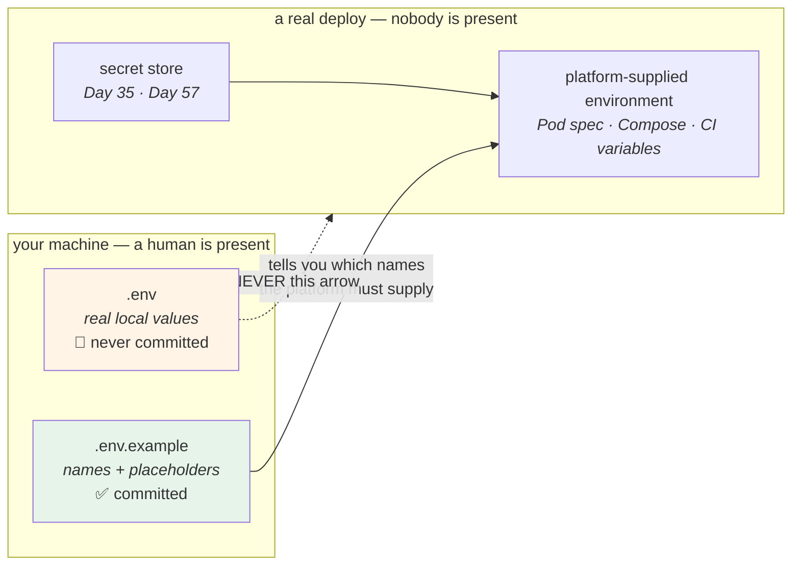

# 1.5 — `.env` is a developer convenience, not a deployment mechanism

## One-line answer

A `.env` file exists so that one human at one keyboard does not have to type six exports before every run —
it has **no standard, no schema, no access control and no audit trail**, so the moment it becomes how a real
deploy is configured you have replaced a platform mechanism with an untracked file that anybody can read.

---

## The story

🎬 **The scene.** A workshop. On the wall by the door, a hook with a spare key on it, and a strip of masking
tape underneath with a biro note: *back door, bins, and the padlock on the shed*.

It is enormously convenient. Everybody who works there knows the hook. Nobody has ever had to go and find the
owner to get into the bin store.

😬 **The naive fix.** The business grows. They open a second workshop, then a third. The obvious move: put a
hook by the door in each one, with the same note.

💥 **Why it fails.** The hook was never a system. It has no record of who took a key, no way to remove
somebody's access when they leave, no way to tell whether the shed padlock has been changed, and no way to
give the delivery driver the bin key without also giving them the back door. It worked in one workshop
because one person could see the whole room. **At three workshops the hook is not a smaller version of a
security system — it is the absence of one, repeated.**

And the part that stings: the third workshop's landlord photographs the wall for an insurance file. The note
is legible in the photo. The photo is in a shared folder.

💡 **The insight.** **A thing that works because a human is standing next to it does not scale by being
copied.** The convenience and the mechanism are different objects, and confusing them is how a private note
ends up in a photograph in a shared folder.

---

## The idea in plain language

A **dotenv file** — almost always named `.env` — is a plain text file of `KEY=value` lines that a library
reads at startup and turns into environment variables for that process.

That is the whole idea. It exists for one reason: [1.2](1.2-the-environment-is-the-interface.md) established
that a process's environment is set by whoever starts it, and when the person starting it is *you*, at a
keyboard, forty times a day, typing six variables every time is miserable. The file remembers them for you.

Three things follow, and each one is a rule.

**One — there is no specification.** There is no RFC, no standard grammar, no reference parser. Every
language's dotenv library made its own decisions about quoting, escaping, comments, multi-line values,
variable interpolation and whether `export` is allowed at the start of a line. Two libraries reading the same
file can produce different values, and both are "correct" because there is nothing to be correct against.

This project uses `python-dotenv`, which arrives underneath `pydantic-settings`. The documentation says so
explicitly — from `https://docs.pydantic.dev/latest/concepts/pydantic_settings/`, fetched on **2026-08-25**:

> *"Because python-dotenv is used to parse the file, bash-like semantics such as `export` can be used …"*

**"Bash-like" is not "bash".** It is one library's choice, and it is worth knowing which library you have,
because the answer to "why did that value come out with the quotes still on it" lives there.

**Two — it is a file on a disk, with a file's permissions and none of a secret's protections.** Day 5
established what a file mode is and who can read what
([Day 5, 2.1](../../../day-005-linux-for-operators-ii/parts/02-permissions/2.1-user-group-other-and-three-bits.md)).
A `.env` created by an editor is usually world-readable. It is included in backups, in editor session
restores, in `tar` archives, in "let me just zip up the project and send it to you", and — this is the one
that actually happens — in a container image, because `COPY . .` copies everything.

**Three — it is invisible to everything that manages deploys.** No platform reads it, no audit log records a
change to it, no review approves an edit, and nothing tells you two machines have different copies. Compare
that with an environment variable set by a Kubernetes Deployment: it is in a YAML file, in git, in a pull
request, with a diff and an author and a date.

### So what is it actually for?

Two legitimate jobs, and no others:

| Job | Why it is fine |
| --- | --- |
| holding a developer's **local** settings | scoped to one checkout on one machine; nothing else reads it |
| holding **fake** credentials for local runs | a local placeholder key that is not valid anywhere real |

And one thing it must never be:

**The way a real deploy gets its configuration.** Not because it would not work — it works fine, which is the
problem — but because it discards every property that makes configuration operable: reviewability,
auditability, and the ability to say what a given deploy is running with.

### The two files, and why one is committed

The pattern this project uses is the standard one and it is worth naming now, because
[5.2](../05-pulse-configured/5.2-env-example-the-contract-with-a-stranger.md) builds it properly:

- **`.env`** — real values, on your machine, **never committed**. Day 0 wrote it into `.gitignore` before it
  existed.
- **`.env.example`** — every variable name, with a comment and a *harmless* placeholder value, **always
  committed**. It is the schema and the documentation, and it is how a stranger who clones the repository
  learns what the service needs.

Note that `.gitignore` already carries `!.env.example` — an un-ignore rule written on Day 0 for a file that
did not exist yet. **That is Principle 9 in its purest form**: the protection is written before the thing it
protects.

---

## Why Kriya needs it

**Day 22 builds a container image for `pulse`.** The most common Dockerfile line in the world is `COPY . .`,
and the most common accident that follows is a `.env` with a real credential now inside an image that gets
pushed to a registry. **An image layer is immutable and content-addressed** — removing the file in a later
layer does not remove it from the image. Day 23's `.dockerignore` exists for this, and the reason it exists
is this part.

**Day 26** runs Compose, which reads a file named `.env` *for its own substitution* — a second mechanism with
the same filename, described in [1.4](1.4-the-precedence-ladder.md).

**Day 17** makes a build fail if a credential appears in it. That gate only means something if you already
understand which files credentials live in and how they travel.

**Day 57** replaces the file entirely with a real secret store, and **Day 35's `Secret` object** is the
intermediate step. Both of them are answers to a question this part asks: *who else can read this, and how
would you know?*

**Day 126** is the first day with a credential worth stealing. Everything in this part is theory until then
and a live hazard afterwards.

---

## The mechanism

Start with what a naive parser does to values that are not simple, because this is where the "no
specification" problem becomes concrete. Reuse `read_env_file` from
[1.4](1.4-the-precedence-ladder.md) — the deliberately naive one — and feed it awkward but entirely realistic
lines:

```bash
cd days/day-009-configuration-and-secrets/lab
cat > awkward.env <<'EOF'
PULSE_PORT=8001
PULSE_MOTD="hello  world"
PULSE_NOTE=don't
PULSE_URL=https://example.test/path?a=1&b=2
PULSE_TRAILING=value   
PULSE_HASHY=abc#not-a-comment
export PULSE_EXPORTED=yes
PULSE_EMPTY=
EOF
cat -A awkward.env | tail -4
```

**Line by line:**

- `cat > file <<'EOF'` — a here-document. The **quoted** `'EOF'` is the important part: it stops the shell
  expanding `$`, backticks and `\` inside the block, so what lands in the file is exactly what you typed.
  With an unquoted `EOF`, `?a=1&b=2` and any `$` would be mangled before the file was ever written.
- `PULSE_MOTD="hello  world"` — quotes around a value containing spaces. **The question a parser has to
  answer is whether the quotes are part of the value.** There is no universally right answer, which is the
  point.
- `PULSE_NOTE=don't` — an unmatched apostrophe, which some parsers treat as an opening quote and then run to
  the end of the file looking for its partner.
- `PULSE_HASHY=abc#not-a-comment` — a `#` inside a value. A parser that strips comments naively turns this
  into `abc`.
- `PULSE_TRAILING=value   ` — three trailing spaces, invisible in every editor.
- `export PULSE_EXPORTED=yes` — legal in bash, meaningless as a variable name if taken literally.
- `cat -A` — show non-printing characters: `$` marks end of line, so trailing whitespace becomes visible.
  **This is the command to reach for whenever a value "looks right" and behaves wrong.**

```text
PULSE_TRAILING=value   $
PULSE_HASHY=abc#not-a-comment$
export PULSE_EXPORTED=yes$
PULSE_EMPTY=$
```

Now run the naive parser over it:

```bash
uv run python -c "
from pathlib import Path
import sys
sys.path.insert(0, '.')
from ladder import read_env_file
for key, value in read_env_file(Path('awkward.env')).items():
    print(f'{key:<18} -> {value!r}')
"
```

**Line by line:**

- `sys.path.insert(0, '.')` — makes the current directory importable so `ladder.py` from
  [1.4](1.4-the-precedence-ladder.md) can be reused. In a lab script this is fine; **in `pulse/` it would be
  a bug**, because it makes imports depend on where the process was started.
- `read_env_file` is imported rather than retyped, so the demonstration is provably about the same parser
  the previous part used.
- `{value!r}` — `repr` again, so quotes and trailing spaces are visible
  ([1.3](1.3-everything-from-the-environment-is-a-string.md)).

```text
PULSE_PORT         -> '8001'
PULSE_MOTD         -> '"hello  world"'
PULSE_NOTE         -> "don't"
PULSE_URL          -> 'https://example.test/path?a=1&b=2'
PULSE_TRAILING     -> 'value'
PULSE_HASHY        -> 'abc#not-a-comment'
export PULSE_EXPORTED -> 'yes'
PULSE_EMPTY        -> ''
```

**Three defects in eight lines.** `PULSE_MOTD` kept its quotes — a value of `"hello  world"` including the
quote characters, which will appear in your logs and confuse everyone. `export PULSE_EXPORTED` became a
variable name containing a space, which no environment can hold. And `PULSE_TRAILING` was silently stripped,
which is *correct here* and would be wrong if the trailing space mattered — a password, for instance.

**None of these raised.** Every one produced a plausible-looking value.

That is the argument for not writing your own, and it is the argument this whole day is built on: **build the
mechanism once so you understand it, then adopt the library so you stop maintaining it** (Principle 4). The
library that arrives in [2.2](../02-typed-settings/2.2-adopting-pydantic-settings.md) handles all eight lines
because somebody has already lost the afternoon you are about to.

### Proving the file is not committable

The file is only safe because of a rule written before it existed. Verify the rule rather than trusting it:

```bash
cd "$(git rev-parse --show-toplevel)"
printf 'PULSE_MODEL_API_KEY=not-a-real-key-just-a-placeholder\n' > .env
git check-ignore -v .env && echo "✅ .env is ignored by a rule written on Day 0"
git check-ignore -v .env.example || echo "✅ .env.example is NOT ignored — it is meant to be committed"
git status --short
rm .env
```

**Line by line:**

- `git rev-parse --show-toplevel` — the repository root, whatever directory you are standing in. Hard-coding
  a relative path here would break the moment somebody runs it from `lab/`.
- The value is `not-a-real-key-just-a-placeholder` and it says so in the value itself. **Never write a
  realistic-looking fake credential in a document or a test**; realistic fakes get copied into real places,
  and a value that reads as obviously fake cannot.
- `git check-ignore -v <path>` — prints the file and rule that cause a path to be ignored, and exits `0` when
  ignored and `1` when not. **The `-v` is the whole value of the command**: it names the line of `.gitignore`
  doing the work, so you are verifying a specific rule rather than a vague feeling.
- The second `check-ignore` has `|| echo`, because for `.env.example` the *expected* exit code is `1`.
  Reading that inverted logic correctly is Day 4's exit-code lesson
  ([Day 4, 3.1](../../../day-004-linux-for-operators-i/parts/03-exit-codes/3.1-the-exit-code-is-the-whole-return-value.md)).
- `git status --short` between the two — a `.env` holding a credential must produce **no output at all**
  here. An untracked-file line (`?? .env`) would mean the next `git add -A` commits it.
- `rm .env` — the file is deleted immediately. It has served its purpose, and a `.env` left lying around is
  the hazard this part is about.

```text
.gitignore:5:.env	.env
✅ .env is ignored by a rule written on Day 0
✅ .env.example is NOT ignored — it is meant to be committed
```

**`git status --short` printed nothing**, which is the result you want and the one that is easy to miss
because it looks like the command did not run.



**The dotted arrow is the whole part.** Everything else on the diagram is fine.

---

## When it breaks

**The `.env` that was committed.** The one with no undo:

```text
$ git log --all --oneline -- .env
c41a9e7 wip: get the local run working
```

**What it says:** a commit touched `.env`.
**What it actually means:** the file is in the repository's history, in every clone and every fork, and
**deleting it in a later commit does not remove it** — Day 11 explains exactly why
([Day 11, 5.2](../../../day-011-version-control-for-operators/parts/05-repo-as-memory/5.2-the-secret-that-reached-history.md)).
**The smallest fix:** there is none for the exposure. The credential is rotated — a new one issued, the old
one revoked — and only then is the history question worth discussing.
**How it happened despite `.gitignore`:** `.gitignore` only affects **untracked** files. If the file was
committed once before the rule existed, or added with `git add -f`, git keeps tracking it and the ignore rule
does nothing. This is the single most surprising thing about `.gitignore` and Day 11 will make you prove it.

**The `.env` inside a container image.** The one that ships:

```text
$ docker history pulse:0.1.0 --no-trunc | head -3
IMAGE          CREATED         CREATED BY
<missing>      2 days ago      COPY . . # buildkit
<missing>      2 days ago      RUN uv sync --frozen
```

**What it says:** everything in the build directory was copied into the image.
**What it actually means:** including `.env`, including `.git/`, including whatever else was lying around.
Anybody who can pull the image can read the file — **and `RUN rm .env` in a later layer does not help**,
because the earlier layer still contains it and layers are immutable.
**The smallest fix:** a `.dockerignore` that excludes `.env` and `.git`, written before the first build.
Day 23.
**Why the fix must come first:** an image is usually pushed to a registry as soon as it builds, and a pushed
layer is not something you can quietly withdraw.

**The value with quotes in it.** The confusing one:

```text
INFO:     Uvicorn running on http://"127.0.0.1":8000 (Press CTRL+C to quit)
```

**What it says:** an address with quote characters in it.
**What it actually means:** the `.env` line was `PULSE_HOST="127.0.0.1"` and the parser kept the quotes.
`python-dotenv` strips matched surrounding quotes; the naive parser above does not; a shell would.
**The smallest fix:** do not quote values that do not need quoting, and read your service's startup line
rather than assuming.
**Why it is worth showing:** the failure appears in a **different** subsystem — DNS resolution, or a bind —
with an error that never mentions configuration, and the only clue is the two extra characters in a line
everybody skims.

**The stale `.env` in CI.** The one that only fails in the place you cannot debug:

```text
pydantic_core._pydantic_core.ValidationError: 1 validation error for Settings
model_api_key
  Field required [type=missing, input_value={'environment': 'ci'}, input_type=dict]
```

**What it says:** a required field has no value.
**What it actually means:** it worked on your laptop because your `.env` supplied it, and CI has no `.env`
because `.env` is not committed — correctly. **The test was never testing what you thought.**
**The smallest fix:** the CI job supplies the variable, and `.env.example` is what tells you which ones it
must supply.
**Why this error is a good outcome:** it is loud, it is at startup, and it names the field. That is
[section 3](../03-fail-fast/3.1-fail-fast-the-crash-that-saves-the-night.md) working exactly as designed —
compare it with the version that starts happily and fails four hours later.

---

## In production

**What a professional writes instead of the teaching version.** In production there is no `.env` at all. The
process is started by something that supplies the environment explicitly, and the settings object is
configured to read a dotenv file only when one is present — which it is on a laptop and is not anywhere else.
The `.env.example` is treated as a real artifact: it is reviewed, it is updated in the same pull request as
the code that adds a setting, and there is a check that fails if a setting exists in the code and not in the
example. That last check is small and prevents the most common onboarding failure there is.

**What degrades at scale.** Drift between the file and reality. One `.env` on one laptop is a fact; twelve
`.env` files on twelve laptops is twelve slightly different beliefs about what the service needs, and the
person whose file is oldest is the one who cannot reproduce a bug. There is no mechanism to reconcile them
because there is no mechanism at all — that is the recurring point of this part. Teams that grow past this
either generate the file from a source of truth or stop using it.

**The failure that only shows with real traffic.** A `.env` that reached a real deploy and *worked*, so
nobody noticed. The service runs correctly for months, configured by a file nobody can see, until the day
somebody needs to change a value and discovers the platform's configuration has no effect — because
[1.4](1.4-the-precedence-ladder.md)'s ladder puts the environment above the file only if the file is being
read as a file. Change the wrong rung and nothing happens, twice, and now you have an incident and a mystery.

**The review comment a senior engineer leaves.** *"The Dockerfile has `COPY . .` and there is no
`.dockerignore` in this PR. That will put `.env` and the whole `.git` directory in the image, which means the
credential and the entire history are readable by anyone who can pull it. Add the `.dockerignore` in this
change, not the next one — the image gets pushed by CI as soon as this merges."*

**The signal you would alert on.** Not on the file — on its *arrival somewhere it should not be*. Two cheap
checks earn their keep: a CI job that fails if a tracked file named `.env` exists in the repository, and an
image scan that fails if `.env` is present in any layer (Day 30). Neither is a page; both are gates. And a
third, which is the one that actually catches real incidents: **a secret scanner that runs over the diff of
every push** (Day 17). You would not alert a human at 3am about a `.env` file; you would refuse the build.

**Blast radius.** This part creates `awkward.env` under this day's `lab/` and, briefly, a `.env` at the
repository root containing an obviously-fake placeholder. Worst case: the root `.env` is left in place and a
later command reads it, changing a result silently. Who can trigger it: you. What bounds it: the value is not
a real credential by construction, `git check-ignore` proves it cannot be committed *before* it is written,
and `rm .env` runs in the same block. The day's checklist verifies with `git status --short` that nothing
survived.

**Cost.** `0` model calls, `0` tokens, `0` CI minutes, `0` new packages, `0` network. Disk: two small text
files. RAM: negligible.

**The interview question.** *"Is it OK to use a `.env` file?"* The answer that separates people who have
operated a service from people who have read about it: *"On a laptop, yes — it is a keystroke saver and
nothing else. In a deploy, no, and not for security reasons first. It is because a file on a disk has no
review, no audit and no way to answer 'what is this deploy configured with'. The security consequences follow
from that: it gets copied into images, into backups and into archives, and `.gitignore` does not protect a
file that was ever tracked. What I actually insist on is the pair — `.env` ignored, `.env.example` committed
and reviewed — because the example file is the schema, and it is what makes a missing variable in CI a clear
error instead of a mystery."*

---

## Check yourself

```bash
cd "$(git rev-parse --show-toplevel)"
git check-ignore -v .env ; echo "exit=$?"
git check-ignore -v .env.example ; echo "exit=$? (1 is correct here)"
ls -la days/day-009-configuration-and-secrets/lab/*.env 2>/dev/null || echo "no lab env files yet"
```

Two exit codes that must differ, and a rule from Day 0 named in the output.

**Say out loud, without scrolling up:** *Give the two legitimate jobs of a `.env` file and the one job it must
never have — then explain why adding `.env` to `.gitignore` does not protect a `.env` that was committed last
week.*
