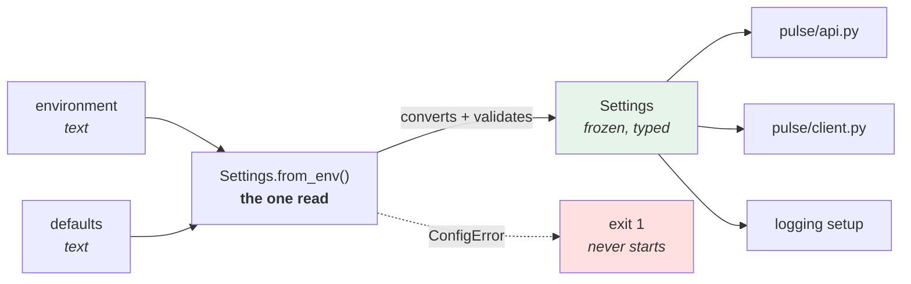

# 2.1 — Hand-rolling the settings object

## One-line answer

Read the environment **once, in one place, into one frozen object with real types**, and pass that object
around — because the alternative, `os.environ.get` scattered through six modules, has no list of what the
service can be configured with and no way to reject a typo.

---

## The story

🎬 **The scene.** A small building firm. Every morning the foreman reads the job sheet out loud once, at the
gate, and everyone writes down the bit they need: the address, the delivery window, which skip is theirs, and
the code for the site gate.

😬 **The naive fix.** A new foreman decides the reading-out is a waste of everybody's morning. The job sheet
is pinned in the site hut. Anyone who needs something goes and looks.

💥 **Why it fails.** Not immediately. It fails on the day someone changes the delivery window on the sheet at
eleven o'clock. Three people had already read it, four had not, and now the site is running on two different
beliefs about the same fact with no way to tell who holds which. Then it fails again, differently, when the
plasterer looks for a value that was never on the sheet, does not find it, assumes the usual, and is wrong.

Nobody misread anything. **The problem is that "go and look when you need it" has no moment where the sheet
is complete and agreed.**

💡 **The insight.** **Read the shared facts once, at a known moment, into one thing everybody holds — and
after that moment nobody goes back to the source.** The value is not in the reading; it is in there being a
single instant when the answer became fixed, and a single object that has all of it.

---

## The idea in plain language

Here is the shape of the problem in code, before any solution.

Scattered reads look harmless:

```text
# in pulse/api.py
port = int(os.environ.get("PULSE_PORT", "8000"))

# in pulse/client.py
timeout = float(os.environ.get("PULSE_TIMEOUT", "3"))

# in pulse/logging.py
level = os.environ.get("PULSE_LOG_LEVEL", "info")
```

Every line is defensible on its own. Together they have five problems, and only the last one is obvious:

1. **There is no list.** Nothing anywhere says what this service can be configured with. To find out, you
   grep — and grep finds what exists, not what is intended.
2. **A typo is silent.** `PULSE_LOGLEVEL` is a legal variable name that nobody reads
   ([1.2](../01-configuration/1.2-the-environment-is-the-interface.md)).
3. **The type conversion is duplicated**, so the truth vocabulary drifts
   ([1.3](../01-configuration/1.3-everything-from-the-environment-is-a-string.md)).
4. **It happens at an unknown time.** If `pulse/client.py` reads its value inside a function, it reads it
   *per call*, and the service's behaviour depends on the environment at that instant rather than at startup
   ([2.4](2.4-the-settings-object-read-at-import-time.md)).
5. **Nothing can validate the whole.** "The timeout must be less than the deadline" is a statement about two
   settings, and there is no object that holds both.

The fix is a **settings object**: one class, one instance, built once, from a known set of sources, with real
types, at a known moment. Everything else in the service is *given* it.

### What "frozen" buys you

The object should be immutable — in Python, a `dataclass` with `frozen=True`, which makes assignment to its
attributes raise.

That is not tidiness. It is a load-bearing property, and the reason is Day 4's process model
([Day 4, 1.1](../../../day-004-linux-for-operators-i/parts/01-the-process/1.1-a-process-is-not-a-program.md)):
a process's environment is a snapshot, so **its configuration is a fact about the moment it started**. A
settings object that can be mutated is an invitation to a bug where the service's behaviour depends on when a
question was asked. If configuration must change, the process is replaced — that is the whole argument of
[1.2](../01-configuration/1.2-the-environment-is-the-interface.md), and `frozen=True` is that argument
expressed in the type system so the compiler enforces it rather than a code reviewer.

### Why build this by hand at all

Because Principle 4 says so, and the reason is worth restating: **you are about to adopt a library that does
all of this, and a library you adopt without having built the mechanism once is a library whose failure modes
are magic.** In [2.2](2.2-adopting-pydantic-settings.md) `pydantic-settings` will produce an error message
you have to read at 3am. Having written the version that produces a *worse* message is what makes the better
one legible.

This is also, deliberately, a part that ends by throwing its own code away. **The hand-rolled object is not
what `pulse` will ship.** It exists in `lab/`, it teaches the shape, and then the library replaces it — which
is how "build first, adopt after" is supposed to feel.

---

## Why Kriya needs it

**[5.1](../05-pulse-configured/5.1-pulse-config-the-settings-object.md) writes the real one** into
`pulse/config.py` this same day, and every day after Day 9 imports it. The shape is decided here.

**Day 67** adds structured logging, and the first thing a log line carries is the service, version and
environment — fields that come from this object rather than from three separate reads.

**Day 110** measures `pulse`'s startup, and startup is *when this object is built*. A settings object that
reads a file, contacts a secret store or resolves DNS is a settings object that has moved work into the most
latency-sensitive moment a service has.

**Day 147** runs an evaluation loop with a model provider, a timeout, a concurrency limit and a token budget
— four settings that constrain each other. `budget_tokens` being smaller than `tokens_per_call` is a
configuration error that only an object holding both can catch, and it is trap #4 from the plan's §5.1 if it
is not caught.

**Day 232** asks what a deploy is running with, months later. The answer is *"ask the settings object; it can
print itself"* — and that only exists if there is one.

---

## The mechanism

Write the object. Every line is explained afterwards, and note what it deliberately does **not** do.

```python
# lab/settings_by_hand.py - one object, one read, real types. Thrown away in 2.2.
from __future__ import annotations

import os
from dataclasses import dataclass, fields

TRUE_VALUES = frozenset({"1", "true", "yes", "on"})
FALSE_VALUES = frozenset({"0", "false", "no", "off"})


class ConfigError(ValueError):
    """A setting could not be read. Raised at startup, never during a request."""


def _raw(name: str, default: str | None) -> str:
    value = os.environ.get(name, default)
    if value is None:
        raise ConfigError(f"{name} is required and is not set")
    return value.strip()


def _as_bool(name: str, default: str | None = None) -> bool:
    raw = _raw(name, default).lower()
    if raw in TRUE_VALUES:
        return True
    if raw in FALSE_VALUES:
        return False
    raise ConfigError(
        f"{name}={raw!r} is not a boolean; use one of {sorted(TRUE_VALUES | FALSE_VALUES)}"
    )


def _as_int(name: str, default: str | None = None) -> int:
    raw = _raw(name, default)
    try:
        return int(raw)
    except ValueError as exc:
        raise ConfigError(f"{name}={raw!r} is not an integer") from exc


@dataclass(frozen=True, slots=True)
class Settings:
    """Everything pulse can be configured with. Built once, at startup, never mutated."""

    environment: str
    host: str
    port: int
    docs_enabled: bool

    @classmethod
    def from_env(cls) -> Settings:
        return cls(
            environment=_raw("PULSE_ENVIRONMENT", "dev"),
            host=_raw("PULSE_HOST", "127.0.0.1"),
            port=_as_int("PULSE_PORT", "8000"),
            docs_enabled=_as_bool("PULSE_DOCS_ENABLED", "true"),
        )

    def describe(self) -> str:
        return "\n".join(f"  {f.name:<14} = {getattr(self, f.name)!r}" for f in fields(self))
```

**Line by line:**

- `TRUE_VALUES` / `FALSE_VALUES` as `frozenset` — one vocabulary, defined once, at module level.
  `frozenset` rather than `set` because these are constants and nothing should be able to add to them. Note
  that `false` is in `FALSE_VALUES` and **not** treated by truthiness, which is the entire bug from
  [1.3](../01-configuration/1.3-everything-from-the-environment-is-a-string.md), fixed here in two lines.
- `class ConfigError(ValueError)` — a **specific** exception, per `CLAUDE.md`'s house style. Subclassing
  `ValueError` rather than `Exception` means existing `except ValueError` handlers still behave sensibly, and
  the docstring states the operational contract: *raised at startup, never during a request*. That sentence
  is the difference between a service that refuses to start and one that returns a `500`.
- `_raw` returns `str` and raises when a required value is absent — **it never returns `None`**. Every
  converter downstream can therefore assume it has text, which is why none of them has a `None` check.
- `value.strip()` in one place — the trailing-whitespace problem from
  [1.5](../01-configuration/1.5-dotenv-is-a-developer-convenience.md), solved once rather than in four
  converters. **A password is the one value you would not strip**, and section 4 comes back to that.
- `default: str | None` — the default is a **string**, so it goes through exactly the same conversion as a
  supplied value. If the default were `8000` (an `int`) it would skip `_as_int` entirely, and the day the
  parser has a bug your defaults would be the only values not exercising it.
- `_as_bool` raises on anything outside both sets. **`flase` stops the service.** That is
  [1.3](../01-configuration/1.3-everything-from-the-environment-is-a-string.md)'s *reject, do not default*
  rule, and the error message lists the acceptable values so the reader does not have to find the source.
- `sorted(TRUE_VALUES | FALSE_VALUES)` — `|` is set union, `sorted` makes the message deterministic. **An
  error message whose contents change between runs is a message you cannot search for.**
- `raise ConfigError(...) from exc` — the `from` clause keeps the original `ValueError` in the traceback as
  *"The above exception was the direct cause of the following exception"*. Without it you get a shorter
  traceback and lose which library complained. `CLAUDE.md` forbids catching an exception to swallow it; this
  is the legitimate case — catching to *add* information and re-raising a more specific type.
- `@dataclass(frozen=True, slots=True)` — `frozen=True` makes attribute assignment raise `FrozenInstanceError`
  (the immutability argument above). `slots=True` removes the per-instance `__dict__`, which prevents typos
  like `settings.hosts` from silently creating a new attribute, and costs nothing.
- Field order is **required first, then defaulted** — a dataclass rule, and here everything has a default
  supplied in `from_env` rather than on the field itself. That is deliberate: **defaults live with the
  reading, not with the type**, so the class describes *what pulse has* and `from_env` describes *how it is
  found*.
- `from_env` is a `classmethod` returning `Settings`, not an `__init__` that reads the environment. **The
  constructor stays pure**, so a test can build a `Settings` directly with explicit values and never touch
  the environment at all — which is the top rung of [1.4](../01-configuration/1.4-the-precedence-ladder.md)'s
  ladder, and the reason that rung exists.
- `describe()` uses `dataclasses.fields(self)`, so it lists every field automatically. **A `describe` that
  names fields by hand is a `describe` that will be out of date within a month**, and this is the method that
  answers "what is this deploy actually running with".
- `!r` on the values so an empty string is visibly `''`
  ([1.3](../01-configuration/1.3-everything-from-the-environment-is-a-string.md)).

Now use it:

```bash
cd days/day-009-configuration-and-secrets/lab
uv run python -c "
import sys; sys.path.insert(0, '.')
from settings_by_hand import Settings, ConfigError
s = Settings.from_env()
print('resolved settings:'); print(s.describe())
print('frozen?', end=' ')
try:
    s.port = 1
except Exception as exc:
    print(type(exc).__name__, '-', exc)
"
```

**Line by line:**

- `Settings.from_env()` — the one read. Everything after this line uses the object.
- The `try` around `s.port = 1` proves `frozen=True` is doing something rather than being decoration.
- `type(exc).__name__` — the class name, because the point is *which* exception, not the message.

```text
resolved settings:
  environment    = 'dev'
  host           = '127.0.0.1'
  port           = 8000
  docs_enabled   = True
frozen? FrozenInstanceError - cannot assign to field 'port'
```

Now supply values, and then supply a bad one:

```bash
cd days/day-009-configuration-and-secrets/lab
echo '--- good values ---'
PULSE_ENVIRONMENT=staging PULSE_PORT=8001 PULSE_DOCS_ENABLED=false \
  uv run python -c "import sys; sys.path.insert(0,'.'); from settings_by_hand import Settings; print(Settings.from_env().describe())"

echo '--- the boolean that used to lie ---'
PULSE_DOCS_ENABLED=flase \
  uv run python -c "import sys; sys.path.insert(0,'.'); from settings_by_hand import Settings; print(Settings.from_env().describe())"
echo "exit=$?"
```

**Line by line:**

- The first run sets three variables inline, so nothing leaks into the second run
  ([1.2](../01-configuration/1.2-the-environment-is-the-interface.md)).
- `PULSE_DOCS_ENABLED=false` — the value that `bool()` would have read as `True`. Watch it come out `False`.
- `PULSE_DOCS_ENABLED=flase` — the typo. **This is the check that must be able to fail**, and it fails on
  purpose here rather than in front of users.
- `echo "exit=$?"` — the exit code is the interface. A configuration error must be a **non-zero exit**, not a
  warning, because that is what makes a container restart-loop instead of serving wrongly
  ([Day 4, 3.1](../../../day-004-linux-for-operators-i/parts/03-exit-codes/3.1-the-exit-code-is-the-whole-return-value.md)).

```text
--- good values ---
  environment    = 'staging'
  host           = '127.0.0.1'
  port           = 8001
  docs_enabled   = False
--- the boolean that used to lie ---
Traceback (most recent call last):
  ...
settings_by_hand.ConfigError: PULSE_DOCS_ENABLED='flase' is not a boolean; use one of ['0', '1', 'false', 'no', 'off', 'on', 'true', 'yes']
exit=1
```

**`docs_enabled = False`.** The three-line converter did what a whole class of production code fails to do.



**Three arrows out of one box.** Compare that with the scattered version, where each of those three boxes had
its own arrow back to the environment.

### What this version still cannot do

Be honest about the gap, because it is the argument for [2.2](2.2-adopting-pydantic-settings.md):

| Missing | Consequence | Fixed by |
| --- | --- | --- |
| unknown-variable detection | `PULSE_LOGLEVEL` is still ignored silently | `extra="forbid"` — [2.3](2.3-naming-prefixes-and-the-variable-nobody-read.md) |
| bounds | `PULSE_PORT=0` and `PULSE_PORT=999999` are both accepted | field constraints — [2.2](2.2-adopting-pydantic-settings.md) |
| all errors at once | it raises on the first bad value; the second is a second run | pydantic reports every error together |
| `.env` support | nothing reads a file | `env_file=` — [2.2](2.2-adopting-pydantic-settings.md) |
| secret types | a credential would print in `describe()` | `SecretStr` — [4.3](../04-secrets/4.3-redaction-that-actually-holds.md) |
| a schema | nothing can generate `.env.example` from it | the model — [5.2](../05-pulse-configured/5.2-env-example-the-contract-with-a-stranger.md) |

Six rows, and every one of them is a bug you would eventually write yourself. **That is what adopting a
library is for, and it is only a good trade once you can name all six.**

---

## When it breaks

**The field added in one place.** The most common maintenance failure:

```text
Traceback (most recent call last):
  File "<string>", line 3, in <module>
TypeError: Settings.__init__() missing 1 required positional argument: 'request_timeout'
```

**What it says:** the constructor was called without a field.
**What it actually means:** somebody added `request_timeout: float` to the dataclass and did not add it to
`from_env`. **This error is a good outcome**: it is loud, at startup, and names the field. The scattered
version has no equivalent — adding a setting there means adding a read, and forgetting means a default nobody
declared.
**The smallest fix:** add the line to `from_env`.
**The design point:** the failure is *possible* because there are two places. `pydantic-settings` collapses
them into one, and that is most of why it is worth adopting.

**The first error only.** The one that wastes three runs:

```text
settings_by_hand.ConfigError: PULSE_PORT='80O0' is not an integer
```

**What it says:** the port is wrong.
**What it actually means:** the port is wrong *and* you do not yet know whether anything else is. You fix it,
re-run, and learn about the next one. Three bad values means three cycles.
**The smallest fix:** collect errors rather than raising on the first — which is real work to do well, and is
exactly what pydantic already does.
**Why it matters more than it sounds:** in CI each cycle is a pipeline run, and in a container each cycle is a
crash-loop backoff.

**The required value that was empty.** The one from [1.3](../01-configuration/1.3-everything-from-the-environment-is-a-string.md),
now with a twist:

```text
$ PULSE_ENVIRONMENT= uv run python -c "...Settings.from_env()..."
  environment    = ''
  host           = '127.0.0.1'
  port           = 8000
  docs_enabled   = True
```

**What it says:** environment is the empty string.
**What it actually means:** `_raw` only raises when `os.environ.get` returns `None`, and an empty value is not
`None`. **The converter has the same hole as the code it replaced.**
**The smallest fix:** treat empty as absent for values where empty is meaningless, and say so per field
rather than globally — because an empty *log prefix* may be perfectly valid while an empty *environment name*
never is.
**Why it is here rather than hidden:** the hand-rolled object is supposed to have holes you can see. This one
is deliberate, and finding it is one of the day's `TODO(me)` items.

**The typo that still does nothing.** The unchanged one:

```text
$ PULSE_PROT=8001 uv run python -c "...print(Settings.from_env().describe())"
  environment    = 'dev'
  host           = '127.0.0.1'
  port           = 8000
  docs_enabled   = True
```

**What it says:** the defaults.
**What it actually means:** `PULSE_PROT` was set, accepted by the shell, inherited by the process, and read by
nobody. **The single object did not fix this**, because nothing is comparing the supplied names against the
known ones.
**The smallest fix:** compare them — which is one flag in [2.3](2.3-naming-prefixes-and-the-variable-nobody-read.md)
and about thirty lines by hand.

---

## In production

**What a professional writes instead of the teaching version.** They do not write this class at all; they use
a library. But the shape survives exactly: **one type, one construction point, immutable, injected**. The
detail that separates a good implementation from a mediocre one is where the object is *built* — at the
composition root, the one function that wires the application together, and nowhere else. A settings object
constructed inside a module at import time is the subject of [2.4](2.4-the-settings-object-read-at-import-time.md)
and is the most common way this pattern is spoiled.

**What degrades at scale.** Not the object — the **breadth of what it holds**. A settings class that grows to
sixty fields stops being a description of a service and becomes a dumping ground, and the tell is fields that
only one module uses. The professional move is to nest: a `Settings` holding a `DatabaseSettings` and a
`ModelSettings`, so each subsystem is handed only what it needs and the blast radius of a bad value is
visible in the type. Day 126 will do this when `pulse` gains a model provider, and `env_nested_delimiter` is
how the library expresses it.

**The failure that only shows with real traffic.** A settings object built **per request**. It works, it is
correct, and it costs a few hundred microseconds of environment reads and validation on every call — until
the object gains a `.env` read or, worse, a network call to a secret store, at which point the service's p99
acquires a dependency nobody put on the request-path diagram from Day 2
([Day 2, 1.1](../../../day-002-shape-of-production-system/parts/01-the-request-path/1.1-a-request-is-a-path-not-a-function-call.md)).
**Build it once; the request path must not touch configuration.**

**The review comment a senior engineer leaves.** *"`Settings` is not frozen, and `configure_logging()` mutates
`settings.log_level` when the `--verbose` flag is passed. That means the object is no longer a description of
how this process started, and the first time we debug 'why is this pod logging differently' we will read the
object and be told a lie. Make it frozen and build a second one for the flag case."*

**The signal you would alert on.** One: **the service logs its settings object, once, at startup, at INFO,
with secrets redacted** — `describe()` is that line. It is not an alert; it is the diagnostic that makes half
the alerts in this curriculum answerable. The alerting version arrives on Day 74 as *"a deploy that has not
logged a startup line since it was restarted"*, which is a liveness signal built on this one. You would **not**
emit a metric per setting; a gauge per configuration value is exactly the cardinality mistake the plan names
as trap #2.

**Blast radius.** This part writes one file under `lab/`, runs it a handful of times and starts no server. The
only capability introduced is a class that can stop a process by raising, which is the intended behaviour and
the subject of [3.1](../03-fail-fast/3.1-fail-fast-the-crash-that-saves-the-night.md). Worst case: an
environment variable left exported from an earlier experiment makes a later run print a value you did not set
— which is why every command here uses the inline form. Who can trigger it: you. What bounds it: no network,
no writes outside `lab/`, no credential involved.

**Cost.** `0` model calls, `0` tokens, `0` CI minutes, `0` new packages, `0` network, `0` disk beyond one
small file. RAM: negligible.

**The interview question.** *"Where does your service read its configuration?"* The answer that lands is a
single sentence with a consequence attached: *"Once, at startup, into one frozen typed object, which is then
passed to whatever needs it — nothing else reads the environment. The reason is not tidiness: it means there
is a list of what the service can be configured with, one place where a value is converted and rejected, one
moment when the configuration is fixed, and one object that can print itself into the startup log. The two
failure modes I look for in a code review are a settings object built inside a request handler, which puts
configuration on the request path, and a mutable one, which means the object stops describing how the process
actually started."*

---

## Check yourself

```bash
cd days/day-009-configuration-and-secrets/lab
PULSE_DOCS_ENABLED=false uv run python -c "import sys; sys.path.insert(0,'.'); from settings_by_hand import Settings; print(Settings.from_env().describe())"
PULSE_DOCS_ENABLED=flase uv run python -c "import sys; sys.path.insert(0,'.'); from settings_by_hand import Settings; print(Settings.from_env().describe())" ; echo "exit=$?"
```

One run that reads `false` as `False`, and one that refuses `flase` with a non-zero exit. **Both are the
point.**

**Say out loud, without scrolling up:** *Give three things a single settings object gives you that scattered
`os.environ.get` calls cannot — and then name two things this hand-rolled version still cannot do.*
