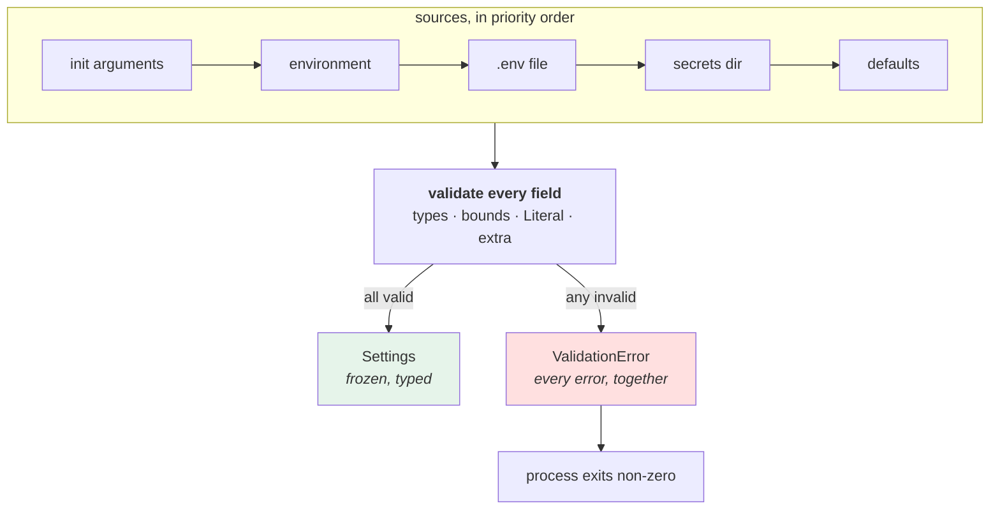

# 2.2 — Adopting `pydantic-settings`

## One-line answer

`pydantic-settings` is the hand-rolled object from [2.1](2.1-hand-rolling-the-settings-object.md) with the six
holes filled: it declares the settings **once** as a typed model, walks the whole precedence ladder for you,
reports **every** error at once with the offending value quoted, and enforces bounds as part of the type.

---

## The story

🎬 **The scene.** A joiner who has been making his own chisels. He is good at it. He knows exactly how the
steel behaves, why the bevel is that angle, and what happens when it is not.

😬 **The naive fix** — the one people expect him to make — is to keep making them, because he can, and
because a bought chisel is somebody else's opinion.

💥 **Why it fails.** He is not in the chisel business. Every hour at the grinder is an hour not spent on the
staircase. And his chisels are good but they are not *hardened consistently*, because that takes a furnace
and a thermometer and a hundred repetitions to get right, and he has done eleven.

💡 **The insight.** **Having built it once is what makes buying it safe.** He can look at a bought chisel and
know, from the grind and the ring of it, what it will do — and when it chips, he knows why. The person who
never made one has a tool that is either fine or mysterious, with no third option.

---

## The idea in plain language

`pydantic-settings` is a small library built on top of `pydantic`, which you already have — Day 3 installed
FastAPI, and FastAPI's request validation *is* pydantic
([Day 3, 2.4](../../../day-003-pulse-v0/parts/02-the-service/2.4-predict-the-contract-before-the-model.md)).
So the mental model transfers exactly: you already know that declaring `subject: str = Field(min_length=1)`
turns a class into a validator that produces a `422` on bad input. This is the same thing, pointed at the
environment instead of at a request body, producing a **refusal to start** instead of a `422`.

The whole of it is:

- you write a class inheriting `BaseSettings` instead of `BaseModel`;
- fields become environment variables, matched by name;
- `model_config = SettingsConfigDict(...)` says where to look and how strictly;
- constructing the class reads all the sources and validates everything.

Verified against `https://docs.pydantic.dev/latest/concepts/pydantic_settings/`, fetched **2026-08-25**:

> *"If you create a model that inherits from `BaseSettings`, the model initialiser will attempt to determine
> the values of any fields not passed as keyword arguments by reading from the environment."*

### What it does that [2.1](2.1-hand-rolling-the-settings-object.md) could not

Take the six-row table from the end of the previous part and cross the rows off:

| The gap | How the library closes it |
| --- | --- |
| unknown variables ignored | `extra="forbid"` on a dotenv source raises rather than shrugs — [2.3](2.3-naming-prefixes-and-the-variable-nobody-read.md) |
| no bounds | `Field(ge=1, le=65535)` is part of the type, so a port is bounded by declaration |
| first error only | pydantic collects **every** failure and reports them together |
| no `.env` support | `env_file=".env"` — one key in the config dict |
| no secret type | `SecretStr` redacts in `repr`, `str` and JSON — [4.3](../04-secrets/4.3-redaction-that-actually-holds.md) |
| no schema | the model **is** a schema, so `.env.example` can be generated from it — [5.2](../05-pulse-configured/5.2-env-example-the-contract-with-a-stranger.md) |

And it adds one thing nobody thinks to ask for and everybody eventually needs: **it can tell you which source
each value came from**, which is [1.4](../01-configuration/1.4-the-precedence-ladder.md)'s report, built in.

### The one thing to be careful about

A library that does this much has defaults, and two of them will surprise you:

**Environment variable names are matched case-insensitively by default.** From the same page, fetched
**2026-08-25**: *"By default, environment variable names are case-insensitive."* So a field called `port`
matches `PORT`, `port` and `Port`. That is convenient and it is also how you collide with a platform variable
you did not intend to read — which is [2.3](2.3-naming-prefixes-and-the-variable-nobody-read.md)'s entire
subject, and the reason every field in this project gets a prefix.

**Defaults are validated too.** From the same page: *"Unlike pydantic `BaseModel`, default values of
`BaseSettings` fields are validated by default."* This is the right behaviour and it catches a real class of
bug — a default that violates its own constraint fails on the first run rather than on the day somebody stops
setting the variable.

---

## Why Kriya needs it

**[5.1](../05-pulse-configured/5.1-pulse-config-the-settings-object.md) ships this into `pulse/config.py`
today.** Everything after Day 9 imports it: Day 24's container, Day 35's `ConfigMap`, Day 67's log fields,
Day 126's provider client.

**Day 126** needs `SecretStr` specifically. A provider key held as a plain `str` will eventually be printed —
by a traceback, by a debug log, by a `/version` endpoint somebody extended
([4.2](../04-secrets/4.2-the-seven-places-a-secret-leaks.md)). Held as a `SecretStr` it prints as
`**********` everywhere by default, and getting the real value requires typing `.get_secret_value()`, which
is a line a reviewer can search for.

**Day 147** needs constraints across fields — a token budget that must exceed the per-call cost — and
pydantic expresses that as a model validator in four lines rather than as a comment nobody runs.

**Day 35** benefits from nesting: `PULSE_MODEL__API_KEY` mapping onto `settings.model.api_key` keeps a
Kubernetes `Secret` and a `ConfigMap` as two clean groups rather than a flat list of fourteen names.

---

## The mechanism

Install it first. **This is the first new dependency since Day 3** — four consecutive days added nothing, and
that streak ends here for a reason worth stating.

```bash
curl -sS --compressed https://pypi.org/pypi/pydantic-settings/json | tr ',' '\n' | grep -m1 -o '"version":"[^"]*"'
uv add pydantic-settings==2.15.0
uv run python -c "import pydantic_settings, pydantic; print('pydantic-settings', pydantic_settings.__version__); print('pydantic', pydantic.VERSION)"
```

**Line by line:**

- The `curl` is not decoration — it is Principle 7 in one command. **Look the version up on the day you use
  it** rather than copying the number below, because this document was written on **2026-08-25** and the
  answer moves. `tr ',' '\n'` splits the JSON onto lines so `grep -m1` can stop at the first match instead of
  downloading and parsing the whole document, which is large enough to time out on a slow connection.
- `uv add pydantic-settings==2.15.0` — an exact `==` pin, never a range and never bare. `uv add` writes it
  into `pyproject.toml` and updates `uv.lock`, and both are committed
  ([Day 0](../../../day-000-toolchain-skeleton-driver/LESSON.md)).
- **It brings `python-dotenv` with it.** Verified on **2026-08-25** from the same PyPI metadata:
  `pydantic-settings 2.15.0` requires `pydantic>=2.7.0`, `python-dotenv>=0.21.0` and
  `typing-inspection>=0.4.0`. That is why [1.5](../01-configuration/1.5-dotenv-is-a-developer-convenience.md)
  named `python-dotenv` as the parser: it is the transitive dependency doing the `.env` work, and knowing
  which library parses your file is how you answer "why did the quotes survive".
- `pydantic` is **already present** — FastAPI depends on it, so this adds no new major component to the
  service. Print its version anyway; a settings library and a validation library disagreeing about pydantic
  major versions is a real and unpleasant failure.
- Both versions go into `docs/PACKAGES.md` today, with the date and the reason (Principle 7).

```text
"version":"2.15.0"
Resolved 14 packages in 1.13s
Installed 2 packages in 92ms
 + pydantic-settings==2.15.0
 + python-dotenv==1.2.3
pydantic-settings 2.15.0
pydantic 2.13.4
```

Now the model. Put it in `lab/` first — `pulse/config.py` is written in
[5.1](../05-pulse-configured/5.1-pulse-config-the-settings-object.md), after section 3 has added the
fail-fast argument and section 4 has added the secret:

```python
# lab/settings_pydantic.py - the same four settings as 2.1, declared once.
from __future__ import annotations

from typing import Literal

from pydantic import Field
from pydantic_settings import BaseSettings, SettingsConfigDict


class Settings(BaseSettings):
    """Everything pulse can be configured with. One declaration; the sources are config."""

    model_config = SettingsConfigDict(
        env_prefix="PULSE_",
        env_file="sample.env",
        env_file_encoding="utf-8",
        extra="forbid",
        frozen=True,
    )

    environment: Literal["dev", "staging", "prod"] = "dev"
    host: str = "127.0.0.1"
    port: int = Field(default=8000, ge=1, le=65535)
    docs_enabled: bool = True
    request_timeout: float = Field(default=3.0, gt=0, le=60)


if __name__ == "__main__":
    settings = Settings()
    for name, value in settings.model_dump().items():
        print(f"  {name:<16} = {value!r}")
```

**Line by line:**

- `class Settings(BaseSettings)` — the only structural difference from a FastAPI request model, which is
  `BaseModel`. Everything you learned on Day 3 about fields, defaults and validation applies unchanged.
- `model_config = SettingsConfigDict(...)` — the configuration *of the configuration*. It is a class
  attribute rather than a decorator or an `__init__` argument, so it travels with the class and a subclass
  can override one key.
- `env_prefix="PULSE_"` — every field name is prefixed when looked up, so `port` reads `PULSE_PORT`.
  **This is not cosmetic.** The default prefix is `''` (verified on the docs page, **2026-08-25**: *"The
  default `env_prefix` is `''` (empty string)"*), and with no prefix a field called `host` would read the
  variable `HOST`, which is set by real platforms for entirely unrelated reasons.
  [2.3](2.3-naming-prefixes-and-the-variable-nobody-read.md) is the failure this line prevents.
- `env_file="sample.env"` — the dotenv rung of [1.4](../01-configuration/1.4-the-precedence-ladder.md)'s
  ladder. It is `sample.env` here because this is a lab file;
  [5.1](../05-pulse-configured/5.1-pulse-config-the-settings-object.md) uses `.env`, and
  [1.5](../01-configuration/1.5-dotenv-is-a-developer-convenience.md) explains why the difference matters.
  **A missing file is not an error** — that is the documented behaviour and the reason the same code works in
  CI and in a container.
- `env_file_encoding="utf-8"` — state it. The default is the operating system's, which on Windows is not
  UTF-8, and a value with a non-ASCII character then decodes differently on two machines. **This is a
  one-word line that removes a class of "works on my machine".**
- `extra="forbid"` — **the line that fixes [2.1](2.1-hand-rolling-the-settings-object.md)'s biggest hole.**
  An unknown key coming from the dotenv file is rejected rather than ignored. Note carefully what it does
  *not* do, because the documentation is precise about it and the difference matters:
  *"with the default `extra='forbid'` an unmatched dotenv entry is kept as an extra input and raises a
  `ValidationError`, while a plain environment variable is simply not picked up"* (fetched **2026-08-25**).
  **A typo in the file is caught; a typo in a real environment variable is not.**
  [2.3](2.3-naming-prefixes-and-the-variable-nobody-read.md) closes the second half.
- `frozen=True` — the same immutability argument as [2.1](2.1-hand-rolling-the-settings-object.md), one
  keyword instead of a decorator. Assignment raises `ValidationError`.
- `environment: Literal["dev", "staging", "prod"]` — an **enumeration expressed as a type**. This is the
  single highest-value line in the file: `PULSE_ENVIRONMENT=production` now fails loudly instead of quietly
  creating a fourth environment that no dashboard filters on. Day 10 depends on this being exact.
- `port: int = Field(default=8000, ge=1, le=65535)` — the bound and the value in one declaration. `ge` and
  `le` are *greater-or-equal* and *less-or-equal*; the range is the actual TCP port range from Day 7
  ([Day 7, 1.1](../../../day-007-networking-for-operators/parts/01-addresses-and-ports/1.1-a-port-is-a-doorway-not-a-place.md)).
  **A capability arriving with its bound in the same line** is Principle 13 at the smallest possible scale.
- `request_timeout: float = Field(default=3.0, gt=0, le=60)` — `gt=0` strictly, because a timeout of zero is
  either "immediate failure" or "no timeout" depending on the library, and neither is something you want to
  arrive by accident. `le=60` is a judgement, and a stated judgement beats an unbounded field: Day 7's
  argument is that an unbounded wait is how a service dies
  ([Day 7, 4.1](../../../day-007-networking-for-operators/parts/04-timeouts/4.1-a-timeout-is-a-decision-not-a-safety-net.md)),
  and `float("inf")` is a legal float that this line refuses.
- `settings.model_dump()` — pydantic's dict of field values, which is what `describe()` was doing by hand.
  **It is also what will need care in section 4**, because by default it dumps a `SecretStr` as
  `**********` rather than the value, and that is a feature.

Run it. First with nothing set:

```bash
cd days/day-009-configuration-and-secrets/lab
rm -f sample.env
uv run python settings_pydantic.py
```

**Line by line:**

- `rm -f sample.env` — remove the dotenv rung so the first run shows pure defaults. `-f` so a missing file is
  not an error.
- No `sys.path` juggling this time: the file is run directly rather than imported, so the module lives in the
  script's own directory automatically.

```text
  environment      = 'dev'
  host             = '127.0.0.1'
  port             = 8000
  docs_enabled     = True
  request_timeout  = 3.0
```

Now the ladder, in one command per rung:

```bash
cd days/day-009-configuration-and-secrets/lab
printf 'PULSE_PORT=8001\nPULSE_DOCS_ENABLED=false\n' > sample.env
echo '--- file only ---';           uv run python settings_pydantic.py
echo '--- environment over file ---'; PULSE_PORT=9000 uv run python settings_pydantic.py
echo '--- which source? ---';       PULSE_PORT=9000 PYDANTIC_SETTINGS_DEBUG=1 uv run python -c "
import logging; logging.basicConfig(level=logging.DEBUG)
import settings_pydantic  # noqa: F401 - importing runs nothing; we build it below
from settings_pydantic import Settings
Settings()
" 2>&1 | grep -E 'SettingsSource|Resolving'
```

**Line by line:**

- The three runs change one rung at a time — the same discipline as
  [1.4](../01-configuration/1.4-the-precedence-ladder.md).
- `PYDANTIC_SETTINGS_DEBUG=1` — the built-in source report, verified on the docs page **2026-08-25**. It is
  the library's version of `ladder.py`'s `(from ...)` column, and it is the command to remember for 2am.
- `logging.basicConfig(level=logging.DEBUG)` — required, and the documentation says so: *"The output is
  emitted on the `pydantic_settings` logger, so make sure DEBUG-level logging is enabled."* Without it the
  variable is set, the report is generated, and nothing appears — which looks exactly like the feature not
  working.
- `# noqa: F401` with a reason on the same line — `ruff` would flag the unused import, and `CLAUDE.md`
  requires a `noqa` to say why it is there. This one exists to make the import order explicit in a
  demonstration.
- `2>&1 | grep` — logging writes to standard error by default, so without the redirect the `grep` sees
  nothing and you conclude, wrongly, that the report is empty. **This is one of the most common
  self-inflicted "the tool is broken" moments there is.**

```text
--- file only ---
  environment      = 'dev'
  host             = '127.0.0.1'
  port             = 8001
  docs_enabled     = False
  request_timeout  = 3.0
--- environment over file ---
  environment      = 'dev'
  host             = '127.0.0.1'
  port             = 9000
  docs_enabled     = False
  request_timeout  = 3.0
--- which source? ---
Resolving settings for 'Settings' (sources in priority order, highest first):
  InitSettingsSource: {}
  EnvSettingsSource: {'port': '9000'}
  DotEnvSettingsSource: {'port': '8001', 'docs_enabled': 'false'}
  SecretsSettingsSource: {}
  DefaultSettingsSource: {}
```

**Read the last block carefully.** `port` appears in two sources with two different values, and the report
shows both — it does not hide the loser. That is what makes it useful: you can see the value you expected,
sitting in a source that was outranked.



---

## When it breaks

**Every error at once.** The improvement over [2.1](2.1-hand-rolling-the-settings-object.md), and the first
thing worth seeing:

```text
$ PULSE_PORT=99999 PULSE_ENVIRONMENT=production PULSE_REQUEST_TIMEOUT=-1 uv run python settings_pydantic.py
Traceback (most recent call last):
  File "settings_pydantic.py", line 27, in <module>
    settings = Settings()
pydantic_core._pydantic_core.ValidationError: 3 validation errors for Settings
environment
  Input should be 'dev', 'staging' or 'prod' [type=literal_error, input_value='production', input_type=str]
    For further information visit https://errors.pydantic.dev/2.13/v/literal_error
port
  Input should be less than or equal to 65535 [type=less_than_equal, input_value='99999', input_type=str]
    For further information visit https://errors.pydantic.dev/2.13/v/less_than_equal
request_timeout
  Input should be greater than 0 [type=greater_than, input_value='-1', input_type=str]
    For further information visit https://errors.pydantic.dev/2.13/v/greater_than
```

**What it says:** three validation errors, each naming the field, the rule, and the value that broke it.
**What it actually means:** you can fix all three and run once. Compare with the hand-rolled version's one
error per run — in a container that is three crash-loop cycles instead of one.
**The detail worth noticing:** `input_type=str` on every line. **The value arrived as text and was converted**
— exactly [1.3](../01-configuration/1.3-everything-from-the-environment-is-a-string.md)'s point, printed by
the library in every error it produces.
**The smallest fix:** correct the values. `production` is not `prod`, and the `Literal` is what caught it.

**The dotenv key nobody declared.** `extra="forbid"` doing its job:

```text
$ printf 'PULSE_PORT=8001\nPULSE_LOGLEVEL=debug\n' > sample.env
$ uv run python settings_pydantic.py
pydantic_core._pydantic_core.ValidationError: 1 validation error for Settings
loglevel
  Extra inputs are not permitted [type=extra_forbidden, input_value='debug', input_type=str]
```

**What it says:** a key that is not a field.
**What it actually means:** you wrote `PULSE_LOGLEVEL` and there is no such setting — probably a typo for a
setting that does not exist yet, or the name changed and the file did not. **The variable-nobody-read failure
from [1.2](../01-configuration/1.2-the-environment-is-the-interface.md) is now an error.**
**The smallest fix:** delete the line or add the field.
**The limitation to remember:** this only fired because the key was in the **file**. The same typo as a real
environment variable is still silent, and [2.3](2.3-naming-prefixes-and-the-variable-nobody-read.md) is where
that is dealt with.

**Frozen means frozen.** The one that catches a bad habit:

```text
>>> s = Settings()
>>> s.port = 9999
pydantic_core._pydantic_core.ValidationError: 1 validation error for Settings
port
  Instance is frozen [type=frozen_instance, input_value=9999, input_type=int]
```

**What it says:** the instance cannot be modified.
**What it actually means:** something tried to change the configuration of a running process, which
[1.2](../01-configuration/1.2-the-environment-is-the-interface.md) established is not a thing that can
happen. **The error is the design working**, not an obstacle to route around with `model_copy`.
**The smallest fix:** if a test needs different settings, build a different `Settings` — that is what the
init-arguments rung of the ladder is for.

**The `.env` that was read from somewhere else.** The confusing one:

```text
$ cd /c/Users/you && uv run python /path/to/lab/settings_pydantic.py
  port             = 8000
```

**What it says:** the default, despite a `sample.env` containing `8001`.
**What it actually means:** `env_file="sample.env"` is a **relative path**, resolved against the process's
current working directory, not against the file the class is written in. You ran it from elsewhere, so no
file was found — and a missing dotenv file is silently fine, which is correct behaviour that here produces a
confusing result.
**The smallest fix:** for a real service, resolve the path explicitly relative to a known root, or accept the
convention that the service is started from its own directory and **write that down**.
**Why this is worth a paragraph:** it is the same class of bug as
[1.4](../01-configuration/1.4-the-precedence-ladder.md)'s *"the answer depends on which directory you ran the
command from"*, and in a container the working directory is set by a `WORKDIR` line somebody wrote once and
nobody remembers.

---

## In production

**What a professional writes instead of the teaching version.** Almost exactly this, with three additions.
They **nest** related settings into sub-models so a subsystem receives only its own group. They add a
**model validator** for the rules that span fields — *"the per-call timeout must be smaller than the total
deadline"* is a two-line validator and an incident avoided (Day 7's budget argument,
[Day 7, 5.1](../../../day-007-networking-for-operators/parts/05-the-two-together/5.1-the-timeout-budget-down-the-request-path.md)).
And they treat the settings model as **public API of the deployment**: adding a required field with no default
is a breaking change to every deploy, so it lands with the same care as a breaking change to an HTTP contract.

**What degrades at scale.** Startup time and startup *dependencies*. A settings model that reads a `.env`, a
secrets directory and — in the versions of this library that support it — a cloud secret manager, is doing
I/O before the process can serve anything. On one service nobody notices; across a fleet restarting during an
incident, a settings layer that makes a network call is a thundering herd against whatever it calls, at the
exact moment that dependency is least able to take it. **Keep startup configuration local; fetch remote
secrets deliberately and cache them.** Day 57 is where this argument is settled.

**The failure that only shows with real traffic.** A `Literal` or a bound that is correct and *too tight*. A
`request_timeout` capped at 60 is fine until an operator legitimately needs 90 during a degraded-dependency
incident and the service refuses to start — turning a slow system into a down one, at 3am, because of a
number chosen casually months earlier. **Bounds are a capability restriction and they deserve the same
thought as the capability.** State the reasoning next to the number, and prefer bounds that exclude the
catastrophic rather than bounds that encode today's expectation.

**The review comment a senior engineer leaves.** *"`env_prefix` is missing, so `host` will read the `HOST`
environment variable. Our CI runner sets `HOST`, and half our container images inherit a `HOSTNAME`. Add the
prefix — and while you are there, `port: int` with no bounds means `PULSE_PORT=0` binds to a random free port
and the service comes up somewhere nobody can find it."*

**The signal you would alert on.** The same one as [2.1](2.1-hand-rolling-the-settings-object.md), now
cheaper: log `settings.model_dump()` once at startup, at INFO, with secrets redacted by type rather than by a
denylist. Add one gauge — **`config_hash`** as a label on an info-metric, not as a value — so
[1.4](../01-configuration/1.4-the-precedence-ladder.md)'s divergence alert is possible. You would **not**
alert on a `ValidationError` at startup as a separate signal: the process exits non-zero, and the thing that
pages you is "the deploy is not running", which already exists and is Day 74.

**Blast radius.** This part adds a dependency to the project — the first since Day 3 — and writes two files
under `lab/`. A new dependency is a real capability change: it is code from outside this repository that runs
inside your process. What bounds it: an exact `==` pin, `uv.lock` committed so the resolution is reproducible,
a dated row in `docs/PACKAGES.md`, and the fact that the package is a hard dependency of nothing that talks to
the network. Who can trigger a change to it: anyone with commit access, visibly, in a diff of two files. Day
15's SBOM and Day 30's image scan are where this stops being an honour system.

**Cost.** `0` model calls, `0` tokens, `0` CI minutes. **New packages: 2** (`pydantic-settings==2.15.0` direct,
`python-dotenv==1.2.3` transitive). Disk: roughly 200 KB in `.venv`. Network: one PyPI metadata fetch and two
small wheel downloads. RAM: negligible.

**The interview question.** *"Why use a settings library rather than reading environment variables directly?"*
The answer that shows you have done both: *"Because the library gives you four things that are tedious to
maintain by hand and expensive to get wrong: one declaration that is also the documentation, every validation
error reported together instead of one per restart, bounds as part of the type so a capability arrives with
its limit, and a secret type that redacts itself in reprs and JSON. I wrote the hand-rolled version first, so
I know what it costs — the two holes I could not close cheaply were rejecting unknown variables and
collecting all the errors, and those are exactly the two the library is worth having for. The thing I check
in review is the prefix, because with no prefix your fields collide with platform variables like `HOST` and
`PORT` that somebody else set for a completely different reason."*

---

## Check yourself

```bash
cd days/day-009-configuration-and-secrets/lab
PULSE_PORT=99999 PULSE_ENVIRONMENT=production uv run python settings_pydantic.py ; echo "exit=$?"
PULSE_PORT=9000 PYDANTIC_SETTINGS_DEBUG=1 uv run python -c "
import logging; logging.basicConfig(level=logging.DEBUG)
from settings_pydantic import Settings; Settings()" 2>&1 | grep -E 'SettingsSource'
```

Two errors in one run and a non-zero exit; then a report naming every source and what each one supplied.

**Say out loud, without scrolling up:** *Name three things `pydantic-settings` does that the hand-rolled
object could not, and then state precisely which kind of typo `extra="forbid"` catches and which kind it does
not.*
