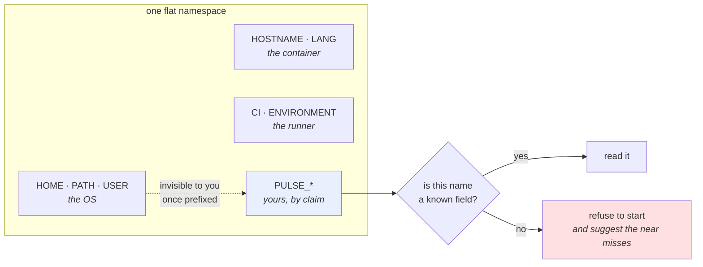

# 2.3 — Naming, prefixes, and the variable nobody read

## One-line answer

Your service shares one namespace with the operating system, the shell, the container runtime, the CI runner
and every library in the process — so **every setting gets a prefix**, and the only way to catch a
misspelled variable is to compare what was *supplied* against what the service *knows about* and refuse the
difference.

---

## The story

🎬 **The scene.** A shared office kitchen with one fridge and no labels.

Everyone puts their lunch in. Everyone takes their lunch out. It works for eleven people and it works because
each of them recognises their own container on sight.

😬 **The naive fix.** Person twelve arrives with an identical blue box from the same shop as person four.

💥 **Why it fails.** Not with an argument — with a *silence*. Person four eats person twelve's lunch, notices
nothing, and person twelve comes down at one o'clock to find their box gone and assumes they left it at home.
**Nobody detects the collision.** There is no error, no complaint and no evidence. It happens again the next
week.

And the second failure is worse and quieter: person nine writes `MILK — DO NOT USE` on a carton in biro on
the *side*, where the fridge light does not reach. It is a perfectly clear instruction that nobody ever reads.
There is no mechanism by which anyone finds out it exists.

💡 **The insight.** **In a shared namespace, two things kill you: a name that collides with somebody else's,
and a name that nobody is looking for.** The first needs a prefix. The second needs somebody to compare the
labels in the fridge against the list of people who claim to have put something in it.

---

## The idea in plain language

The environment is one flat namespace, shared by everything in the process and everything above it. Day 4's
process model explains why: the table is inherited, so your service sees every variable set by the shell, the
container runtime, the orchestrator, the CI runner and the base image
([Day 4, 1.1](../../../day-004-linux-for-operators-i/parts/01-the-process/1.1-a-process-is-not-a-program.md)).

That produces two distinct failures, and they need two distinct fixes.

### Failure one — collision: your name is somebody else's name

Here are names that are genuinely, routinely set by things that are not your service:

| Name | Set by | What it means to them |
| --- | --- | --- |
| `HOME` | the operating system | the user's home directory |
| `PATH` | the shell | where to find executables |
| `USER` · `LOGNAME` | login | who you are |
| `HOSTNAME` | container runtimes | the container's hostname |
| `PORT` | many platform-as-a-service hosts | the port they expect you to listen on |
| `HOST` | assorted tools and CI runners | wildly inconsistent |
| `DEBUG` | dozens of libraries | dozens of different things |
| `LOG_LEVEL` | dozens of libraries | usually theirs, not yours |
| `ENVIRONMENT` | CI systems, deployment tools | their notion of environment, not yours |
| `CI` | every CI runner on earth | "you are in CI" |

Now recall [2.2](2.2-adopting-pydantic-settings.md)'s two defaults, both verified on
`https://docs.pydantic.dev/latest/concepts/pydantic_settings/` on **2026-08-25**: the default `env_prefix` is
the empty string, and *"By default, environment variable names are case-insensitive."*

Put those together. A settings class with a field called `host` and no prefix will read the variable `HOST` —
or `Host`, or `host`. **Your service is now configured by whatever a CI runner happened to set for its own
reasons**, and it will look completely normal, because the value will be a plausible string.

The fix is one line, and it is not negotiable in this project: `env_prefix="PULSE_"`. Every setting for this
service is `PULSE_SOMETHING`, so the namespace your service reads is one it owns.

**A prefix is a claim of ownership over a region of a shared namespace.** That is the whole idea, and it is
the same idea as a Kubernetes namespace (Day 33), a metric name prefix (Day 62) and a Python package name.

### Failure two — the variable nobody read

The second failure has been following us since [1.2](../01-configuration/1.2-the-environment-is-the-interface.md):

```text
$ PULSE_PROT=8001 uv run python settings_pydantic.py
  port             = 8000
```

You set something. The shell accepted it. The process inherited it. **Nobody read it, and nothing said so.**

[2.2](2.2-adopting-pydantic-settings.md)'s `extra="forbid"` fixes exactly half of this, and the documentation
is precise about which half — fetched **2026-08-25**:

> *"with the default `extra='forbid'` an unmatched dotenv entry is kept as an extra input and raises a
> `ValidationError`, while a plain environment variable is simply not picked up"*

**A typo in the `.env` file is caught. A typo in a real environment variable is not.** And a real environment
variable is where production typos live, because production has no `.env` file
([1.5](../01-configuration/1.5-dotenv-is-a-developer-convenience.md)).

The library cannot fix this on its own, and the reason is sound: your process's environment contains dozens
of variables belonging to other people, so a library that rejected everything it did not recognise would
refuse to start on every machine on earth.

But **once you have a prefix, it can be fixed in about ten lines**, and this is the payoff for owning a
namespace: within `PULSE_*`, anything the service does not recognise is, by definition, a mistake.

---

## Why Kriya needs it

**Day 13** runs `pulse` in CI, where the runner sets `CI`, `HOME`, `PATH`, and — depending on the runner —
`ENVIRONMENT` and `DEBUG`. Without a prefix, a test run is configured by the CI system's private vocabulary.

**Day 24** runs `pulse` in a container whose base image sets `HOSTNAME`, `HOME`, `PATH` and `LANG` before
your process starts. Day 22's image is where the collision becomes permanent rather than session-scoped.

**Day 35** uses `envFrom` to inject an entire `ConfigMap` as environment variables at once. That is a bulk
operation with no per-key review, and **a prefix is the only thing that stops one careless `ConfigMap` from
silently reconfiguring an unrelated library in your process.**

**Day 126** sets provider variables that are *not* yours — `GOOGLE_GENAI_USE_VERTEXAI`, `GROQ_API_KEY`,
`OPENROUTER_API_KEY`. Those names belong to their SDKs, they must be spelled exactly, and they are the
clearest possible illustration of why your own names need to be somewhere else.

**Day 199** builds MCP servers, each of which is a separate process with its own configuration in the same
inherited namespace. By then, a per-component prefix is the only thing keeping four processes' settings
apart.

---

## The mechanism

First, see the collision. This is quick and more persuasive than the table:

```python
# lab/collide.py - a settings class with no prefix, in a realistic environment.
from __future__ import annotations

from pydantic_settings import BaseSettings, SettingsConfigDict


class Unprefixed(BaseSettings):
    """Deliberately wrong: no env_prefix. Do not copy this into pulse."""

    model_config = SettingsConfigDict(env_file=None, extra="ignore")

    host: str = "127.0.0.1"
    port: int = 8000
    home: str = "unset"


if __name__ == "__main__":
    print(Unprefixed().model_dump())
```

**Line by line:**

- The docstring says *"Deliberately wrong"* and *"Do not copy this into pulse"*. **Say it in the file, not
  only in the prose**, because a lab file gets copied and the prose does not travel with it.
- `env_file=None` — no dotenv source at all, so the demonstration is purely about the environment and nobody
  can blame a file.
- `extra="ignore"` rather than `forbid` — only so the class can start at all in a real environment; with a
  dotenv source and `forbid` this experiment would be about a different thing.
- `home: str = "unset"` — a field named after a variable **every** Unix-like system sets. It is the whole
  demonstration: nobody would deliberately write a setting called `home`, and yet `host` and `port` are just
  as exposed and far more tempting.

```bash
cd days/day-009-configuration-and-secrets/lab
uv run python collide.py
echo '--- and now with a CI-ish environment ---'
HOST=ci-runner-7 PORT=31000 uv run python collide.py
```

**Line by line:**

- The first run shows what you meant. The second sets two variables that a hosting platform or CI runner sets
  for its own reasons — **not to configure your application** — and watches them do it anyway.
- `PORT=31000` is not invented: platform-as-a-service hosts routinely tell an application which port to bind
  by setting `PORT`. That is a real convention, and it collides with the most obvious field name there is.

```text
{'host': '127.0.0.1', 'port': 8000, 'home': 'C:\\Users\\you'}
--- and now with a CI-ish environment ---
{'host': 'ci-runner-7', 'port': 31000, 'home': 'C:\\Users\\you'}
```

**`home` was never set by you and is already populated in the first run.** The class read a variable belonging
to the operating system and put it in the service's configuration, silently, with no error and no log line.

### Now the detector

With `env_prefix="PULSE_"` the collision is gone. The typo is not. Build the comparison:

```python
# lab/audit_env.py - refuse to start when a PULSE_* variable is not a known setting.
from __future__ import annotations

import os

from settings_pydantic import Settings

PREFIX = "PULSE_"
# Names inside our namespace that are deliberately not settings.
ALLOWED_EXTRA = frozenset({"PULSE_SKIP_AUDIT"})


def known_names() -> set[str]:
    """Every environment variable name this Settings class can read."""
    return {PREFIX + name.upper() for name in Settings.model_fields}


def supplied_names() -> set[str]:
    """Every PULSE_* variable actually present in this process's environment."""
    return {name for name in os.environ if name.startswith(PREFIX)}


def audit() -> list[str]:
    """Supplied names that no field will ever read. Empty list means clean."""
    return sorted(supplied_names() - known_names() - ALLOWED_EXTRA)


if __name__ == "__main__":
    unknown = audit()
    print("known    :", ", ".join(sorted(known_names())))
    print("supplied :", ", ".join(sorted(supplied_names())) or "(none)")
    if unknown:
        raise SystemExit(
            f"unknown {PREFIX}* variables supplied and read by nobody: {', '.join(unknown)}\n"
            f"did you mean one of: {', '.join(sorted(known_names()))}?"
        )
    print("audit    : clean")
```

**Line by line:**

- `Settings.model_fields` — pydantic's mapping of field name to field definition, available on the **class**
  without constructing an instance. That matters: the audit must run even when construction would fail,
  because a typo and a validation error can arrive together.
- `PREFIX + name.upper()` — reconstruct the variable name the library would look for. This is the one place
  the code duplicates a rule that lives in `model_config`, and it is worth stating the risk plainly:
  **if the prefix changes in one place and not the other, the audit silently passes everything.** The day's
  `TODO(me)` asks you to close that by reading the prefix from `Settings.model_config` instead of retyping it.
- `.upper()` is correct here **because we chose uppercase names**, not because the library requires it —
  matching is case-insensitive by default ([2.2](2.2-adopting-pydantic-settings.md)). Uppercase is the
  universal convention for environment variables and Day 35's `ConfigMap` keys will follow it.
- `ALLOWED_EXTRA` as an explicit `frozenset` — there will eventually be a variable in your namespace that is
  not a field (a feature switch read by a script, a marker set by a wrapper). **An allowlist that is a
  named constant is reviewable; an exception buried in a condition is not.**
- `supplied_names() - known_names() - ALLOWED_EXTRA` — set difference, in that order, read left to right:
  *everything supplied, minus everything we understand, minus everything we have explicitly forgiven*.
- `sorted(...)` so the message is deterministic. **An error message that lists things in dictionary-hash
  order is an error message two people cannot compare.**
- `raise SystemExit(message)` — exits non-zero and prints the message to standard error, with no traceback.
  A traceback here would be noise: this is not a crash, it is a refusal, and the reader needs the message
  rather than the call stack ([Day 4, 3.1](../../../day-004-linux-for-operators-i/parts/03-exit-codes/3.1-the-exit-code-is-the-whole-return-value.md)).
- The message includes **the list of names you could have meant.** That single line converts *"unknown
  variable"* from an accusation into a fix, and it is the difference between an error somebody swears at and
  an error somebody thanks you for.

Run it three ways:

```bash
cd days/day-009-configuration-and-secrets/lab
echo '--- clean ---';        PULSE_PORT=8001 uv run python audit_env.py ; echo "exit=$?"
echo '--- typo ---';         PULSE_PROT=8001 uv run python audit_env.py ; echo "exit=$?"
echo '--- forgiven ---';     PULSE_SKIP_AUDIT=1 uv run python audit_env.py ; echo "exit=$?"
```

**Line by line:**

- `PULSE_PORT=8001` — a real setting, so the audit is clean and the exit code is `0`.
- `PULSE_PROT=8001` — the transposition that has been invisible for five parts. **This is the red gate.**
- `PULSE_SKIP_AUDIT=1` — proves the allowlist works, and demonstrates the shape of the escape hatch you will
  eventually need.

```text
--- clean ---
known    : PULSE_DOCS_ENABLED, PULSE_ENVIRONMENT, PULSE_HOST, PULSE_PORT, PULSE_REQUEST_TIMEOUT
supplied : PULSE_PORT
audit    : clean
exit=0
--- typo ---
known    : PULSE_DOCS_ENABLED, PULSE_ENVIRONMENT, PULSE_HOST, PULSE_PORT, PULSE_REQUEST_TIMEOUT
supplied : PULSE_PROT
unknown PULSE_* variables supplied and read by nobody: PULSE_PROT
did you mean one of: PULSE_DOCS_ENABLED, PULSE_ENVIRONMENT, PULSE_HOST, PULSE_PORT, PULSE_REQUEST_TIMEOUT
exit=1
--- forgiven ---
known    : PULSE_DOCS_ENABLED, PULSE_ENVIRONMENT, PULSE_HOST, PULSE_PORT, PULSE_REQUEST_TIMEOUT
supplied : PULSE_SKIP_AUDIT
audit    : clean
exit=0
```

**Six parts of this day have been walking past `PULSE_PROT` and this is the first thing that noticed.**



### The naming rules this project uses

Small, boring and worth writing down once:

| Rule | Example | Why |
| --- | --- | --- |
| prefix everything | `PULSE_PORT` | ownership of a region of a shared namespace |
| uppercase, underscores | `PULSE_REQUEST_TIMEOUT` | the universal convention; anything else surprises tooling |
| the field name is the variable name | `request_timeout` ↔ `PULSE_REQUEST_TIMEOUT` | one mental transformation, not a lookup table |
| no abbreviations | `PULSE_REQUEST_TIMEOUT`, not `PULSE_REQ_TO` | the abbreviation is obvious to the author and to nobody else |
| double underscore for nesting | `PULSE_MODEL__API_KEY` → `settings.model.api_key` | groups survive into Day 35's `Secret` and `ConfigMap` split |
| never reuse a foreign name | not `PORT`, not `DEBUG` | that name already means something to somebody |

---

## When it breaks

**The platform that set your variable.** The collision, in its natural habitat:

```text
INFO:     Uvicorn running on http://ci-runner-7:31000 (Press CTRL+C to quit)
INFO:     Waiting for application startup.
ERROR:    [Errno -2] Name or service not known
```

**What it says:** the hostname could not be resolved.
**What it actually means:** the service read `HOST` and `PORT` — set by the CI runner for its own purposes —
and tried to bind to a name that means something to the runner and nothing to the network stack
([Day 7, 2.1](../../../day-007-networking-for-operators/parts/02-dns/2.1-what-resolution-actually-does.md)).
**The smallest fix:** `env_prefix`.
**Why this one is lucky:** it failed loudly. The unlucky version of this bug is a `DEBUG` or a `LOG_LEVEL`
collision, which produces no error at all — just a service that logs differently in CI than it does anywhere
else, and a mystery that gets filed as "CI is flaky".

**The case that did not match.** The subtle one:

```text
$ Pulse_Port=8001 uv run python settings_pydantic.py
  port             = 8001
```

**What it says:** it worked.
**What it actually means:** it worked **because matching is case-insensitive by default**, which is
convenient right up until you are trying to work out why a variable you *thought* was for something else is
being read by your service. On Windows the environment is case-insensitive anyway; on Linux it is not, and
the library's default hides that difference.
**The smallest fix:** none needed, but **know it**. If you ever need exact matching — because two names differ
only by case, which happens in Kubernetes more often than you would like — the option is
`case_sensitive=True`, verified on the docs page **2026-08-25**.
**The operational point:** a default that makes something work in more cases also makes it *match* in more
cases, and matching is the failure mode here.

**The audit that passed everything.** The failure of the detector itself:

```text
known    : 
supplied : PULSE_PORT, PULSE_PROT
audit    : clean
```

**What it says:** nothing is known and everything is fine.
**What it actually means:** `known_names()` returned an empty set — most likely because the import of
`Settings` failed and a `try/except` somewhere swallowed it, or because the prefix constant and the
`model_config` prefix drifted apart. **An empty allowlist makes a difference-based check pass everything**,
which is the classic failure mode of every check built on set difference.
**The smallest fix:** assert that `known_names()` is non-empty before comparing, and fail if it is not.
**Why this is worth its own paragraph:** it is the same shape as Day 0's incident row 9 — *a gate that prints
green while something real is wrong*. **Every check you write needs a check that the check ran.**

**The `envFrom` that brought a hundred names.** The Day 35 preview:

```text
$ kubectl exec deploy/pulse -- printenv | grep -c .
147
$ kubectl exec deploy/pulse -- printenv | grep -c '^PULSE_'
6
```

**What it says:** 147 variables, six of them yours.
**What it actually means:** a `ConfigMap` was injected wholesale with `envFrom`, so every key in it became an
environment variable in your process — including any that collide with a library's expectations. **The audit
in this part only inspects `PULSE_*`, so it would report clean.**
**The smallest fix:** prefix the keys in the `ConfigMap` too, and prefer explicit `env:` entries over
`envFrom` for anything that is not obviously a group.
**Why it is here on Day 9:** because the habit that makes Day 35 safe is formed now, and retrofitting a
prefix onto a live deployment means changing the application and every manifest in the same breath.

---

## In production

**What a professional writes instead of the teaching version.** The audit is not a separate script — it runs
inside the settings module, at construction, so it cannot be forgotten and cannot be skipped by starting the
service a different way. They also make it **fail closed by default and loud in every environment**: there is
no "warn in production, fail in dev" mode, because a warning in production is a log line nobody reads. What
they *do* add is the near-miss suggestion, usually by edit distance, because half of these are a transposed
pair of letters and naming the intended variable turns a refusal into a fix.

**What degrades at scale.** The namespace itself. One service with a prefix is clean. Forty services sharing
a `ConfigMap` for common values — a log level, an environment name, a telemetry endpoint — will eventually
have two of them wanting different values for the same key, and the resolution is either a per-service prefix
(more names, no ambiguity) or a shared contract (fewer names, a coordination cost). **There is no third
option, and the industry has picked prefixes.** The operational tell that you have picked wrong is a
`ConfigMap` with a key called `LOG_LEVEL` that three teams have opinions about.

**The failure that only shows with real traffic.** A collision on a variable that changes behaviour under
load. `WEB_CONCURRENCY` is a real convention that some servers read to decide how many worker processes to
fork. A platform setting it to a number appropriate for its own defaults, in a container limited to half a
core by Day 42's limits, produces a service that is fine when idle and thrashes under traffic
([Day 6, 2.3](../../../day-006-resources-and-the-oom-killer/parts/02-cpu/2.3-throttling-the-slowdown-with-no-symptom.md)).
**Nobody set it, nobody can find it in the code, and it is in the environment because a base image put it
there.**

**The review comment a senior engineer leaves.** *"The settings class has `debug: bool = False` with no
prefix. `DEBUG` is set by at least three libraries we already import and by the CI runner. Prefix it. And the
name is wrong anyway — `debug` means five different things; call it `log_level` and make it a `Literal`, so
the setting says what it does rather than how it feels."*

**The signal you would alert on.** The audit's result, exactly once, at startup — and **it is not an alert,
it is an exit code**. That is the right containment: a service that refuses to start is visible immediately
through the mechanism you already have (the deploy does not come up, Day 74 pages), whereas a warning about
an unknown variable is a log line competing with a thousand others. The one thing worth *counting* rather
than refusing is a variable on the `ALLOWED_EXTRA` list, because that list is where exceptions go to be
forgotten: a periodic report of what is on it is cheap and keeps it honest.

**Blast radius.** This part introduces a mechanism that **can stop your service from starting** — which is a
real capability and deserves the same treatment as any other. Worst case: an over-eager audit refuses a
legitimate variable and takes a deploy down at exactly the moment somebody is trying to fix something. What
bounds it: the audit only inspects names inside the `PULSE_` prefix (it can never trip on a platform
variable), it has an explicit named allowlist, and its message tells the operator precisely which name it
objected to. Who can trigger it: whoever sets the environment, which in production is a reviewed manifest.
**A refusal that names the problem is a much smaller blast radius than a silent misconfiguration**, and that
is the trade this part is arguing for.

**Cost.** `0` model calls, `0` tokens, `0` CI minutes, `0` new packages, `0` network. Disk: two small lab
files. RAM: negligible.

**The interview question.** *"Why do you prefix your environment variables?"* The answer that shows scars:
*"Because the environment is one flat namespace shared with the OS, the base image, the orchestrator and every
library in the process — so an unprefixed field called `host` or `port` or `debug` will eventually be set by
somebody who has never heard of my service. I have seen a CI runner's `HOST` variable get bound as a listen
address. But the prefix buys a second thing that is worth more: once I own a region of the namespace,
anything inside it that my settings class does not recognise is definitely a mistake, so I can refuse to start
on a misspelled variable. Without the prefix that check is impossible, because I cannot tell my typos from
other people's variables."*

---

## Check yourself

```bash
cd days/day-009-configuration-and-secrets/lab
PULSE_PROT=8001 uv run python audit_env.py ; echo "exit=$?"
HOST=somewhere-else PORT=31000 uv run python settings_pydantic.py
```

The first must exit `1` and name the variable it objected to. The second must be **completely unaffected** by
two variables that would have configured the unprefixed class — that is what the prefix bought.

**Say out loud, without scrolling up:** *Name three environment variables that something other than your
service routinely sets, explain what a prefix protects you from, and then say what a prefix makes possible
that has nothing to do with collisions.*
