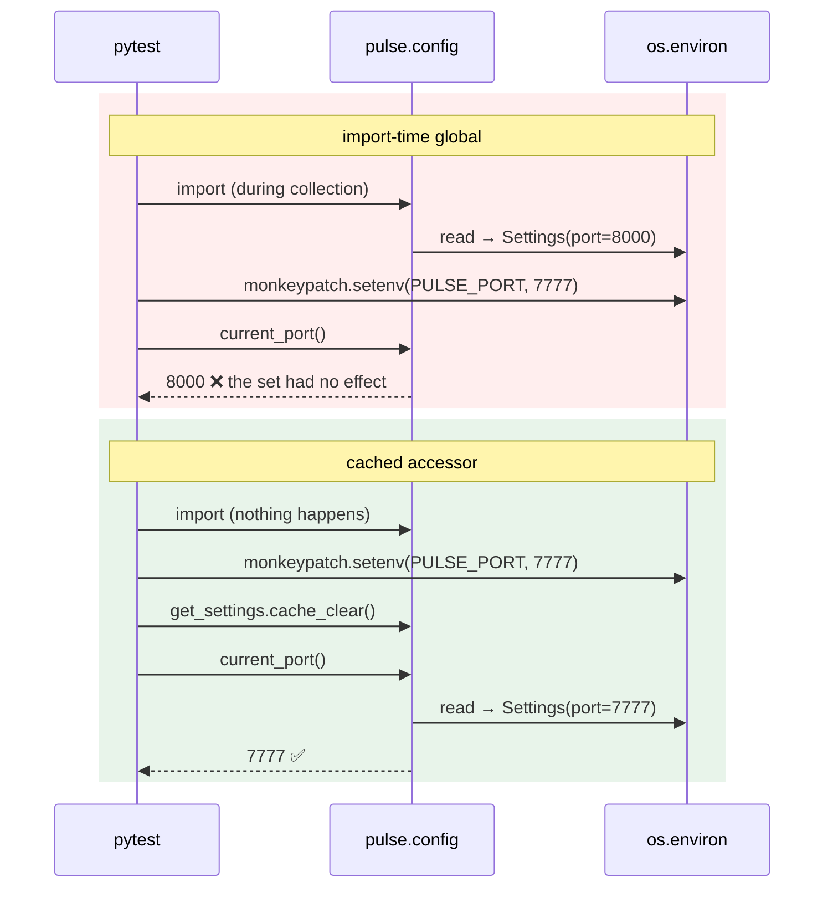

# 2.4 — The settings object read at import time

## One-line answer

`settings = Settings()` at the top of a module reads the environment **the first time anything imports that
module**, which is a moment you do not control — so the configuration of your process depends on import
order, tests cannot override it, and a bad value produces a traceback that names the wrong file.

---

## The story

🎬 **The scene.** A hotel with a single bell on the front desk and a rule: *the bell is rung once, at the
start of the shift, and whatever the receptionist writes on the pad at that moment is the room allocation for
the day.*

😬 **The naive fix.** Nobody decides when the shift starts. The bell is rung by whoever arrives first.

💥 **Why it fails.** On Tuesday the cleaner arrives at six and rings it, so the allocation is written from the
overnight list. On Wednesday the manager arrives at eight and rings it, so the allocation includes the two
late bookings. Nothing is wrong with either allocation. **The problem is that the pad's contents depend on
who walked through the door first**, which changes for reasons nobody is tracking — a delayed bus, a dentist
appointment.

And when a guest complains, the manager looks at the pad and the pad looks perfect. **There is no record of
when it was written**, so there is no way to explain why Tuesday and Wednesday behaved differently.

💡 **The insight.** **A one-time action whose moment is decided by accident produces a system that is
correct, deterministic in principle, and unreproducible in practice.** The fix is not a better pad — it is
deciding, explicitly, who rings the bell and when.

---

## The idea in plain language

In Python, the top level of a module runs **once**, the first time that module is imported, and the result is
cached in `sys.modules` for the rest of the process's life. That is not a quirk; it is how the import system
works, and everything in this part follows from it.

So this line — which is in an enormous amount of real code, including plenty that works fine:

```text
# pulse/config.py
settings = Settings()
```

means: *"read the environment at the exact moment some other file first says `from pulse.config import
settings`."*

Three questions immediately have uncomfortable answers.

**When is that?** It depends on the import graph, which depends on which module was the entry point, which
depends on whether you started uvicorn, ran a test, imported the package in a REPL, or had a linter walk the
tree. All of those produce different first-import moments.

**What if it raises?** A `ValidationError` at import time surfaces as an `ImportError`-shaped disaster
somewhere far from the cause. The traceback names whichever file happened to be doing the importing, and the
actual problem — a bad environment variable — is four frames down.

**How does a test change it?** It cannot. By the time a test's `monkeypatch.setenv` runs, the module was
imported during collection and `settings` is already built. The test sets a variable, changes nothing, and
passes or fails for reasons unrelated to what it is testing.

### The two shapes that work

There are exactly two respectable answers, and the choice between them is not really a choice — a real
service uses both.

**One — build it once, at the composition root.** The single function that wires the application together
builds the settings object and passes it in. Nothing else constructs one, and nothing imports a global.
This is the cleanest structure and it is what a library should always do.

**Two — a cached accessor.** A function `get_settings()` decorated with `functools.lru_cache`, so the object
is built on the *first call* rather than on the first import, and cached thereafter. The moment is still
determined by the program rather than by the import graph, and — crucially — **the cache can be cleared**,
which is what makes tests possible.

FastAPI has a first-class mechanism for this: `Depends(get_settings)`, with `app.dependency_overrides` for
tests. `pulse` will use exactly that in [5.1](../05-pulse-configured/5.1-pulse-config-the-settings-object.md).

### And the shape that is always wrong

Reading configuration **inside a request handler**. It works, it is cheap, and it destroys two things at once:
the guarantee that configuration is fixed for the life of the process
([1.2](../01-configuration/1.2-the-environment-is-the-interface.md)), and the guarantee that the request path
has no dependencies that were not on Day 2's diagram
([Day 2, 1.1](../../../day-002-shape-of-production-system/parts/01-the-request-path/1.1-a-request-is-a-path-not-a-function-call.md)).

---

## Why Kriya needs it

**[5.1](../05-pulse-configured/5.1-pulse-config-the-settings-object.md)** writes `pulse/config.py` today, and
the difference between `settings = Settings()` and `get_settings()` in that file is the difference between a
service that is testable for the next two hundred days and one that is not.

**Day 13** runs the test suite in CI. A test that passes alone and fails in a suite — or worse, the reverse —
is the most expensive kind of flake there is, and import-time configuration is one of its two or three most
common causes.

**Day 41** does a rolling update, replacing processes to change configuration. That model only holds if
configuration is genuinely fixed per process. A service that re-reads the environment mid-life has a third
state — *"restarted but not really"* — that no rollout strategy accounts for.

**Day 110** measures `pulse`'s startup, and import-time work **is** startup work, attributed to whichever
import triggered it. Anything at import time is invisible to a profiler that starts measuring at `main()`.

**Day 147** runs an evaluation harness that constructs the application several times in one process with
different settings. That is impossible with an import-time global and trivial with a clearable cache.

---

## The mechanism

Show the problem first. Build a module with import-time settings and one with a cached accessor, then watch
them behave differently:

```python
# lab/import_time.py - the shape that is hard to test.
from __future__ import annotations

import os

from settings_pydantic import Settings

print(f"[import_time] module body running; PULSE_PORT={os.environ.get('PULSE_PORT', '<unset>')}")
settings = Settings()


def current_port() -> int:
    return settings.port
```

**Line by line:**

- The `print` is not production code — it is here so the *moment* of the import becomes visible in the
  output. **The whole part is about a moment you cannot normally see**, so this part of the lab makes it
  audible.
- `settings = Settings()` at module level: the environment is read now, whenever "now" turns out to be.
- `current_port()` closes over the module-level `settings`, so every caller for the rest of the process gets
  the value captured at import.

```python
# lab/lazy_time.py - the shape that is testable.
from __future__ import annotations

import os
from functools import lru_cache

from settings_pydantic import Settings


@lru_cache(maxsize=1)
def get_settings() -> Settings:
    print(f"[lazy_time] building settings; PULSE_PORT={os.environ.get('PULSE_PORT', '<unset>')}")
    return Settings()


def current_port() -> int:
    return get_settings().port
```

**Line by line:**

- `@lru_cache(maxsize=1)` — the function runs at most once and its result is cached. `maxsize=1` because
  there is only ever one settings object; a larger cache would silently allow several, which is the bug this
  is meant to prevent.
- The `print` is **inside the function**, so it fires on first *call*, not on import. Watching where that
  line appears is the demonstration.
- `lru_cache` gives you `get_settings.cache_clear()` for free, and that method is the entire reason this
  shape is testable. Verified against `https://docs.python.org/3/library/functools.html` on **2026-08-25**:
  the wrapper exposes `cache_clear()` and `cache_info()`.
- `get_settings()` has **no arguments**, which is what makes `lru_cache` safe here. A cached function with
  arguments would let two callers get two different settings objects, which is the same bug as
  `maxsize` being large.
- `current_port()` calls `get_settings()` every time and pays a dictionary lookup for it. **That is the
  correct cost**: the object is built once, but the *decision to use the built one* is made at call time,
  which is what lets a test replace it.

Now run them side by side:

```bash
cd days/day-009-configuration-and-secrets/lab
rm -f sample.env
PULSE_PORT=8001 uv run python -c "
import os
print('--- before any import ---')
import import_time, lazy_time
print('--- both imported ---')
print('import_time.current_port() =', import_time.current_port())
print('lazy_time.current_port()   =', lazy_time.current_port())
print('--- now change the environment mid-process ---')
os.environ['PULSE_PORT'] = '9999'
print('import_time.current_port() =', import_time.current_port())
print('lazy_time.current_port()   =', lazy_time.current_port())
print('--- and clear the cache ---')
lazy_time.get_settings.cache_clear()
print('lazy_time.current_port()   =', lazy_time.current_port())
"
```

**Line by line:**

- `rm -f sample.env` so the dotenv rung cannot muddy which source supplied the value
  ([1.4](../01-configuration/1.4-the-precedence-ladder.md)).
- `os.environ['PULSE_PORT'] = '9999'` — modifying `os.environ` inside a process **does** change what a later
  read sees. That is different from [1.2](../01-configuration/1.2-the-environment-is-the-interface.md)'s rule,
  and the distinction matters: a process cannot receive a change from *outside*, but it can absolutely change
  its own copy. This is exactly what `monkeypatch.setenv` does in a test.
- The two `current_port()` calls after the change are the whole experiment.
- `cache_clear()` — the escape hatch, called explicitly.

```text
--- before any import ---
[import_time] module body running; PULSE_PORT=8001
--- both imported ---
import_time.current_port() = 8001
lazy_time.current_port()   = ...
[lazy_time] building settings; PULSE_PORT=8001
lazy_time.current_port()   = 8001
--- now change the environment mid-process ---
import_time.current_port() = 8001
lazy_time.current_port()   = 8001
--- and clear the cache ---
[lazy_time] building settings; PULSE_PORT=9999
lazy_time.current_port()   = 9999
```

**Read the two `[...]` lines.** `import_time` built its object during the `import` statement, before any of
our code ran. `lazy_time` built its object on the first call — and after `cache_clear()`, built it again with
the new value.

**Both behave identically during normal operation**, which is why this bug is invisible until you write a
test.

### The test that cannot be written

```python
# lab/test_import_time.py - two tests, one of which is a lie.
from __future__ import annotations

import import_time
import lazy_time


def test_lazy_can_be_overridden(monkeypatch) -> None:
    monkeypatch.setenv("PULSE_PORT", "7777")
    lazy_time.get_settings.cache_clear()
    assert lazy_time.current_port() == 7777
    lazy_time.get_settings.cache_clear()


def test_import_time_cannot_be_overridden(monkeypatch) -> None:
    monkeypatch.setenv("PULSE_PORT", "7777")
    assert import_time.current_port() == 7777
```

**Line by line:**

- `monkeypatch` is pytest's built-in fixture for temporary environment changes; `setenv` sets a variable and
  **undoes it after the test**, which is the property that stops one test configuring the next.
- `cache_clear()` **before** the assertion, so the new environment is read, and **again after**, so this test
  does not leave a 7777-shaped settings object behind for whatever runs next. **Both calls are load-bearing**
  and forgetting the second one is how a passing suite starts failing when tests are reordered.
- The second test has no `cache_clear()` because there is nothing to clear — the object was built at import
  and there is no mechanism to rebuild it. **This test asserts something true and is expected to fail**, which
  is the point of writing it.
- No `-> None` omitted and no untyped fixture: `CLAUDE.md` requires return types on public functions, and a
  test function is one.

```bash
cd days/day-009-configuration-and-secrets/lab
uv run python -m pytest test_import_time.py -q 2>&1 | tail -14
```

**Line by line:**

- `-q` for quiet output, matching the project's `addopts` in `pyproject.toml` from Day 0.
- `tail -14` because the failing assertion's context is at the end, and the top of a pytest run is a header
  nobody reads.
- Run from `lab/` so the two modules are importable without touching `sys.path`.

```text
=================================== FAILURES ===================================
___________________ test_import_time_cannot_be_overridden ____________________

monkeypatch = <_pytest.monkeypatch.MonkeyPatch object at 0x000001C3A9F2E4B0>

    def test_import_time_cannot_be_overridden(monkeypatch) -> None:
        monkeypatch.setenv("PULSE_PORT", "7777")
>       assert import_time.current_port() == 7777
E       assert 8000 == 7777
E        +  where 8000 = current_port()

test_import_time.py:17: AssertionError
=========================== short test summary info ============================
FAILED test_import_time.py::test_import_time_cannot_be_overridden - assert 8000 == 7777
1 passed, 1 failed
```

**`assert 8000 == 7777`.** The environment variable was set correctly and the module never looked again.



---

## When it breaks

**The traceback that names the wrong file.** The one that wastes the most time:

```text
Traceback (most recent call last):
  File "/app/.venv/bin/uvicorn", line 8, in <module>
    sys.exit(main())
  ...
  File "/app/pulse/api.py", line 6, in <module>
    from pulse.config import settings
  File "/app/pulse/config.py", line 34, in <module>
    settings = Settings()
pydantic_core._pydantic_core.ValidationError: 1 validation error for Settings
port
  Input should be a valid integer, unable to parse string as an integer [type=int_parsing, input_value='80O0', input_type=str]
```

**What it says:** a validation error, twelve frames deep, starting inside uvicorn's entry point.
**What it actually means:** exactly what it says at the bottom — a bad port. **But the first eight frames are
the import machinery**, and the natural reading of a traceback that starts in `uvicorn/bin` is *"uvicorn is
broken"* or *"the install is broken"*.
**The smallest fix:** the value. The *structural* fix is [3.1](../03-fail-fast/3.1-fail-fast-the-crash-that-saves-the-night.md)'s:
validate at a moment you chose, and print a clean message instead of a traceback.
**The lesson to keep:** an exception raised at import time is an exception with a stack that describes your
import graph rather than your problem.

**The test that passes alone.** The flake:

```text
$ uv run python -m pytest tests/test_config.py -q
1 passed

$ uv run python -m pytest -q
.......F...
FAILED tests/test_config.py::test_docs_disabled_in_prod - assert True is False
```

**What it says:** the same test, two results.
**What it actually means:** running the whole suite imported another module first, which imported
`pulse.config` first, which built the settings object under whatever environment existed at that instant.
**Test outcome now depends on collection order.**
**The smallest fix:** the cached accessor, plus `cache_clear()` in a fixture.
**Why this specific flake is so expensive:** it is intermittent, it looks like a test problem rather than an
application problem, and the usual first response — adding a `sleep`, or reordering the file — makes it go
away for a week.

**The variable set after import, in production.** The one with no test to catch it:

```text
$ kubectl exec deploy/pulse -- printenv PULSE_LOG_LEVEL
debug
$ kubectl logs deploy/pulse --tail=3
INFO  request completed path=/healthz status=200
INFO  request completed path=/healthz status=200
INFO  request completed path=/healthz status=200
```

**What it says:** the variable is `debug` and the logs are at INFO.
**What it actually means:** something set the variable **inside the container after the process started** — an
`exec`, an init script, a sidecar. The process's settings were built at import and never looked again.
**The smallest fix:** stop trying to change a running process's configuration; replace the process.
**Why the evidence is so misleading:** `printenv` run via `exec` starts a **new process** with the *current*
environment, which is not the environment your service was started with. **You are reading a different
process's table** — [1.2](../01-configuration/1.2-the-environment-is-the-interface.md)'s point, in its most
confusing form.

**The cache that was never cleared.** The failure of the fix:

```text
$ uv run python -m pytest -q
..F.
FAILED tests/test_api.py::test_predict_shape - assert 7777 == 8000
```

**What it says:** a test unrelated to configuration is asserting a port.
**What it actually means:** an *earlier* test called `cache_clear()`, set `PULSE_PORT=7777`, built a settings
object, and did not clear the cache afterwards. **The cached object outlived the `monkeypatch` that created
it** — `monkeypatch` undoes the environment variable, and nothing undoes the cache.
**The smallest fix:** an `autouse` fixture that clears the cache before *and* after every test, so no test
can leak one.
**The general rule:** a cache is shared mutable state, and shared mutable state in a test suite needs a
teardown even when the thing that populated it had one.

---

## In production

**What a professional writes instead of the teaching version.** They avoid the global entirely for anything
that is not the application's own entry point. The service has one composition root; the settings object is
built there and injected. Where injection is inconvenient — a logging setup that runs very early, a
metrics registry — they use the cached accessor and accept that it is a controlled global rather than an
accidental one. The distinction they insist on in review is **"is the moment chosen?"**, not "is it a
global?". A global built at a moment somebody decided is a design; a global built at a moment the import
graph decided is a bug waiting for a reordering.

**What degrades at scale.** Import-time work in general, not just settings. Once a codebase has a hundred
modules, import-time side effects compound: settings objects, registry registrations, connection pools built
eagerly, clients constructed at module level. The symptom is a startup that grows by seconds nobody can
attribute, because a profiler attached at `main()` sees none of it — it all happened during import. The
professional habit is a rule rather than a case-by-case judgement: **module bodies define things; they do not
do things.**

**The failure that only shows with real traffic.** Configuration read *per request* rather than per process.
It is correct, cheap and invisible on a laptop. Under load it becomes measurable, and — much worse — it means
the value can change mid-flight. Two requests in the same second can take different code paths, and the
resulting bug report is *"it works about half the time"*, which is the least debuggable sentence in
operations. This is also why `lru_cache` and not "just read it again": the cache makes the per-call path a
dictionary lookup rather than a fresh validation of every field.

**The review comment a senior engineer leaves.** *"`settings = Settings()` at module scope means our test
suite's behaviour depends on import order, and it already does — `test_api.py` passes alone and fails after
`test_health.py`. Wrap it in an `lru_cache`d `get_settings()`, use `Depends(get_settings)` in the routes, and
add an autouse fixture that clears the cache. That is about fifteen lines and it removes a category of flake
we will otherwise be chasing for a year."*

**The signal you would alert on.** None for this directly — but it produces one indirectly, and it is a good
one: **because settings are fixed per process, `config_hash` is a legitimate constant label on a process's
metrics.** That is what makes [1.4](../01-configuration/1.4-the-precedence-ladder.md)'s divergence alert
possible at all. If configuration could change mid-process, that label would be a lie, and a metric label
whose value changes over the life of a process is the cardinality mistake the plan names as trap #2. **The
discipline in this part is what makes a later signal trustworthy** — which is a pattern you will see
repeatedly: today's design decision is tomorrow's observability.

**Blast radius.** This part writes four lab files and runs a pytest that is *expected* to fail one test.
Worst case: the deliberately-failing test is copied into `tests/` and turns `./o check` red for reasons
nobody remembers — which is why it lives in `lab/`, which `.gitignore` excludes, and why the checklist
requires `./o check` to be green at the end of the day. Who can trigger it: you. What bounds it: no network,
no server, no writes outside `lab/`.

**Cost.** `0` model calls, `0` tokens, `0` CI minutes, `0` new packages, `0` network. Disk: four small files.
RAM: negligible.

**The interview question.** *"Where do you build your settings object, and why does it matter?"* The answer
that shows you have been bitten: *"Not at module scope. A module-level `settings = Settings()` reads the
environment at whatever moment the import graph first pulls that module in, and that moment changes between
running the app, running one test file and running the whole suite. The visible symptom is a test that passes
alone and fails in the suite, and people usually misdiagnose it as a test-isolation problem when it is
actually configuration timing. I use a cached accessor — `lru_cache` on a zero-argument `get_settings()` —
so the moment is the first call rather than the first import, and so a test can clear the cache. In FastAPI
that plugs straight into `Depends`, which also gives you dependency overrides. The underlying rule is that a
module body should define things, not do things."*

---

## Check yourself

```bash
cd days/day-009-configuration-and-secrets/lab
uv run python -m pytest test_import_time.py -q 2>&1 | tail -4
```

One test passes and one fails, and the failure prints `assert 8000 == 7777`.

**Say out loud, without scrolling up:** *Explain why a test that sets an environment variable can have no
effect at all — and then say what `lru_cache` changes about that, and what new thing you now have to remember
to clean up.*
