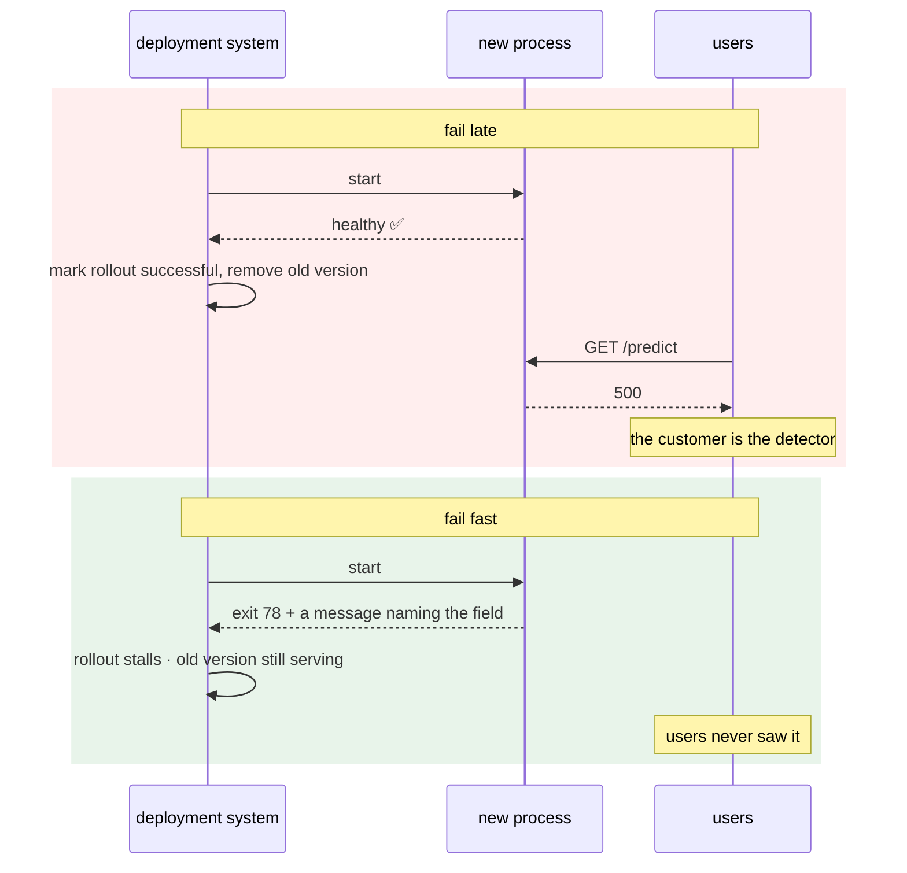

# 3.1 — Fail fast: the crash that saves the night

## One-line answer

A service with bad configuration should **refuse to start**, loudly and immediately, because a process that
exits non-zero at second one is caught by the deployment system and rolled back, while a process that starts
successfully and fails on the first real request is caught by a customer.

---

## The story

🎬 **The scene.** A ferry. Cars drive on at one end, and there is a crew member at the top of the ramp whose
entire job is to look at each vehicle and say *yes* or *no* before it rolls on.

A van arrives towing a trailer. The crew member measures it against a painted line, decides it is too long
for the deck, and waves it out of the queue. The driver is furious. It takes four minutes and a three-point
turn, and forty people behind him watch it happen.

😬 **The naive fix.** A new manager decides the checking is bad for the passenger experience. It slows
boarding and it upsets people. Everybody drives on; anything that turns out not to fit is dealt with on the
deck, where there is more room to manoeuvre.

💥 **Why it fails.** The van fits through the door and does not fit on the deck. Discovering this on the deck
means it must reverse off, up the ramp, against the flow, past forty cars that are now boxed in behind it.
The four-minute problem has become a fifty-minute problem, and it happens in the middle of the operation
rather than at the edge of it.

And the crossing that is *nearly* full sails with a vehicle wedged badly, and nobody knows until the weather
turns.

💡 **The insight.** **The cost of rejecting something rises steeply with how far in it has already got.** The
right place to check is the earliest place where the answer is knowable — and the discomfort of a refusal at
the gate is the entire reason it is cheap.

---

## The idea in plain language

There is a moment in every service's life when configuration is fully known and no work has been done yet:
**startup**. Everything after that moment is more expensive to undo.

Compare the two shapes.

**Fail late.** The service starts, binds a port, reports healthy, is added to the load balancer, and begins
accepting requests. Then the first request touches the misconfigured thing, and something raises. Now:

- users have received errors;
- the deployment already went green, so nobody is watching;
- the failure is at request time, so it looks like an *application* fault rather than a *deployment* fault;
- and the health check may well still return `200`, because Day 3's `/healthz` deliberately checks nothing
  but the process ([Day 3, 2.2](../../../day-003-pulse-v0/parts/02-the-service/2.2-healthz-the-endpoint-that-must-not-lie.md)).

**Fail fast.** The service reads its configuration, finds a value it cannot accept, prints a message naming
the setting and the value, and exits non-zero. Now:

- no user was affected;
- the deployment system sees a process that will not start — which every deployment system on earth already
  knows how to react to;
- the message names the setting, so the fix is a one-line change;
- and the previous version is still running, because it was never replaced.

**That last point is the one people miss.** Fail-fast is not primarily about error messages. It is about
**making a bad configuration indistinguishable, to the deployment system, from a bad build** — so the
machinery you already have for rolling back a bad build handles it too, automatically, at three in the
morning, without a human.

### Why "loudly" means "non-zero exit"

Day 4 established that a process's exit code is its whole return value to the outside world
([Day 4, 3.1](../../../day-004-linux-for-operators-i/parts/03-exit-codes/3.1-the-exit-code-is-the-whole-return-value.md)),
and that every supervisor there is — a shell, `systemd`, Docker, Kubernetes, a CI runner — makes its
decisions from it.

So the ladder of loudness is not a matter of taste:

| What the service does | What the supervisor sees | What actually happens |
| --- | --- | --- |
| logs a warning, continues | a healthy process | the bad value is in production and nobody knows |
| logs an error, continues | a healthy process | identical to the above; the log line is not a mechanism |
| returns `500`s on the affected path | a healthy process | Day 8's lying status code, one layer down |
| **exits non-zero** | **a failed start** | restart backoff, rollback, an alert that already exists |

**A log line is not a mechanism.** It is a message to a human who is not looking. Only the exit code is read
by a machine.

### The one legitimate objection, and its answer

*"But then a typo takes the whole service down."*

It does not — and understanding why is the difference between believing this rule and applying it.

A configuration change reaches production the same way any change does: by replacing processes, one group at
a time (Day 41). If the new processes refuse to start, **the old ones are still running.** The rollout stalls,
the deployment is marked failed, and the service keeps serving on the previous configuration. That is the
system working exactly as designed.

The version where a typo *does* take everything down is the one where all processes are replaced at once —
which is a deployment strategy problem (Day 18), not a validation problem. **Fail-fast makes bad
configuration safe precisely because your rollout is safe**, and Days 18, 19 and 41 exist to make that true.

---

## Why Kriya needs it

**Day 12** gives `pulse` a readiness probe. The relationship between "refuses to start" and "starts but is
not ready" is exactly [3.3](3.3-where-the-check-belongs-startup-versus-readiness.md)'s subject, and getting
it wrong produces a service that restarts forever or one that serves while broken.

**Day 19** rehearses rollback. This part is the argument for why rollback is the *automatic* response to a
configuration error rather than a human decision.

**Day 41** does a rolling update, where the fail-fast property becomes a safety mechanism rather than a
convenience: the rollout stops on the first pod that will not start.

**Day 44** adds an autoscaler — a capability with a bound, and the bound is configuration. **A maximum replica
count that silently defaults is the plan's trap #4, an autonomy with no brake**, and the only thing standing
between you and it is a service that refuses to start rather than accepting a missing limit.

**Day 126** needs a provider key. A `pulse` that starts without one and fails on the first prediction is a
service whose outage begins with a user, not with a deployment.

---

## The mechanism

Build the two shapes and watch a supervisor react differently to them. First, the late-failing version:

```python
# lab/fail_late.py - starts happily, breaks on the first request that needs the value.
from __future__ import annotations

import os

from fastapi import FastAPI

app = FastAPI(title="fail-late")


@app.get("/healthz")
def healthz() -> dict[str, str]:
    return {"status": "ok"}


@app.get("/predict")
def predict() -> dict[str, object]:
    timeout = float(os.environ["PULSE_REQUEST_TIMEOUT"])
    return {"priority": "unknown", "timeout_used": timeout}
```

**Line by line:**

- `os.environ["PULSE_REQUEST_TIMEOUT"]` — a subscript, inside the handler. It raises `KeyError` when the
  variable is missing, and **it raises at request time**, which is the failure this file exists to
  demonstrate.
- `float(...)` in the same expression — a second way to fail at request time, on a value that is present and
  unparseable ([1.3](../01-configuration/1.3-everything-from-the-environment-is-a-string.md)).
- `/healthz` returns `ok` unconditionally, exactly as Day 3 designed it. **That is correct** and it is why the
  service will look healthy throughout this demonstration
  ([Day 3, 2.2](../../../day-003-pulse-v0/parts/02-the-service/2.2-healthz-the-endpoint-that-must-not-lie.md)).
- `-> dict[str, object]` rather than a pydantic model, because this is a lab file demonstrating a failure and
  a response model would add validation noise to the thing being shown.

Run it with the variable missing:

```bash
cd days/day-009-configuration-and-secrets/lab
uv run uvicorn fail_late:app --host 127.0.0.1 --port 8010 > /tmp/fail_late.log 2>&1 &
sleep 3
echo "healthz : $(curl -sS -o /dev/null -w '%{http_code}' http://127.0.0.1:8010/healthz)"
echo "predict : $(curl -sS -o /dev/null -w '%{http_code}' http://127.0.0.1:8010/predict)"
echo "--- what the log says ---"
grep -E 'KeyError|Traceback|ERROR' /tmp/fail_late.log | head -3
pkill -f 'fail_late:app'
```

**Line by line:**

- `> /tmp/fail_late.log 2>&1 &` — both streams to a file, in the background, so the traceback can be read
  afterwards rather than scrolling past.
- `sleep 3` — uvicorn needs a moment to bind. **Not a clock in the teaching sense** — it is a command's
  argument, and the alternative (polling until the port answers) is what a real script does and what Day 13's
  CI will use.
- `-o /dev/null -w '%{http_code}'` — throw the body away, print only the status. Day 8's habit
  ([Day 8, 1.3](../../../day-008-http-and-tls/parts/01-the-message/1.3-the-status-codes-an-operator-reads.md)).
- `pkill -f 'fail_late:app'` — match on the full command line, because the process is `python`, not
  `fail_late` ([Day 4, 1.3](../../../day-004-linux-for-operators-i/parts/01-the-process/1.3-reading-ps-and-finding-your-service.md)).

```text
healthz : 200
predict : 500
--- what the log says ---
    timeout = float(os.environ["PULSE_REQUEST_TIMEOUT"])
KeyError: 'PULSE_REQUEST_TIMEOUT'
INFO:     127.0.0.1:52318 - "GET /predict HTTP/1.1" 500 Internal Server Error
```

**`healthz : 200` and `predict : 500`.** The process started, the deployment went green, the health check is
happy, and every real request fails. **Nobody was told.** This is Day 8's lying-status-code failure
([Day 8, 1.5](../../../day-008-http-and-tls/parts/01-the-message/1.5-the-status-code-that-lied.md)) reached
through configuration instead of through a status code.

Now the early-failing version:

```python
# lab/fail_fast.py - reads and validates everything before the server exists.
from __future__ import annotations

import sys

from fastapi import FastAPI
from pydantic import ValidationError

from settings_pydantic import Settings


def load_settings() -> Settings:
    """Build the settings, or print a readable refusal and exit non-zero."""
    try:
        return Settings()
    except ValidationError as exc:
        print("pulse: refusing to start - invalid configuration", file=sys.stderr)
        for error in exc.errors():
            location = ".".join(str(part) for part in error["loc"])
            print(f"  {location}: {error['msg']} (got {error.get('input')!r})", file=sys.stderr)
        raise SystemExit(78) from exc


settings = load_settings()
app = FastAPI(title="fail-fast", docs_url="/docs" if settings.docs_enabled else None)


@app.get("/healthz")
def healthz() -> dict[str, str]:
    return {"status": "ok"}


@app.get("/predict")
def predict() -> dict[str, object]:
    return {"priority": "unknown", "timeout_used": settings.request_timeout}
```

**Line by line:**

- `load_settings()` is a **function with a name that says what it does**, called once at module scope. Yes,
  that is the import-time construction [2.4](../02-typed-settings/2.4-the-settings-object-read-at-import-time.md)
  argued against — and it is here deliberately, because **this file is about the exit code, not the
  testability**, and mixing both lessons into one file would teach neither.
  [5.1](../05-pulse-configured/5.1-pulse-config-the-settings-object.md) combines them properly.
- `except ValidationError` — a **specific** exception. Not `except Exception`, which would also swallow a
  typo in this file and report it as a configuration problem.
- `print(..., file=sys.stderr)` — diagnostics go to standard error, so that a caller redirecting standard
  output to a file still sees the refusal, and so a supervisor's log capture tags it correctly.
- `exc.errors()` — pydantic's structured error list: each entry has `loc` (which field), `msg` (what rule),
  `type` and `input` (the offending value). **Printing these four fields is what turns a traceback into a
  bug report**, and it is why this handler exists at all rather than letting the exception propagate.
- `".".join(str(part) for part in error["loc"])` — `loc` is a tuple, because a nested model's error is
  located at a path like `("model", "api_key")`. Joining with dots produces `model.api_key`, which is exactly
  how a person would refer to it.
- `error.get("input")` with `.get` rather than `[...]` — some error types do not carry an input, and a
  `KeyError` while reporting an error is a spectacularly unhelpful way to fail (Day 0's `depth_check.py`
  carries a note about the same trap with Unicode).
- `raise SystemExit(78) from exc` — exits with a chosen code. **78 is not arbitrary**: `sysexits.h` defines
  `EX_CONFIG = 78` as *"configuration error"*, a convention old enough that plenty of tooling recognises it.
  Any non-zero code would work; a *meaningful* one lets a supervisor or a script distinguish "bad config"
  from "crashed". Verified against the `sysexits(3)` conventions on **2026-08-25**; if your platform disagrees,
  `1` is always safe.
- `from exc` — keeps the `ValidationError` in the chain for anyone reading a full traceback, without printing
  it by default.
- `docs_url="/docs" if settings.docs_enabled else None` — the setting doing something real. Passing `None`
  removes the route entirely, which is stronger than returning `404` from it: **the route does not exist**,
  so it cannot be re-enabled by a header or a query parameter
  ([Day 3, 3.3](../../../day-003-pulse-v0/parts/03-running-it/3.3-the-interactive-docs-and-why-you-turn-them-off.md)).
- `predict` reads `settings.request_timeout` — a plain attribute access on a frozen object, with no
  environment read on the request path
  ([2.4](../02-typed-settings/2.4-the-settings-object-read-at-import-time.md)).

Now run it with a bad value and watch what the supervisor gets:

```bash
cd days/day-009-configuration-and-secrets/lab
rm -f sample.env
echo '--- good config ---'
uv run uvicorn fail_fast:app --host 127.0.0.1 --port 8011 > /tmp/ff_good.log 2>&1 &
sleep 3
echo "healthz : $(curl -sS -o /dev/null -w '%{http_code}' http://127.0.0.1:8011/healthz)"
echo "predict : $(curl -sS -o /dev/null -w '%{http_code}' http://127.0.0.1:8011/predict)"
pkill -f 'fail_fast:app'

echo '--- bad config ---'
PULSE_REQUEST_TIMEOUT=-1 PULSE_ENVIRONMENT=production \
  uv run uvicorn fail_fast:app --host 127.0.0.1 --port 8011
echo "exit=$?"
```

**Line by line:**

- The good run first, so you have seen it work before you break it. **A red gate you have never seen green
  proves nothing.**
- The bad run is **not** backgrounded and **not** redirected, because the whole point is to see the message
  and the exit code in your terminal, the way a supervisor sees them.
- Two bad values at once, so the "every error together" behaviour from
  [2.2](../02-typed-settings/2.2-adopting-pydantic-settings.md) is visible.
- `echo "exit=$?"` immediately after — **the exit code is the interface**, and reading it is the exercise.

```text
--- good config ---
healthz : 200
predict : 200
--- bad config ---
pulse: refusing to start - invalid configuration
  environment: Input should be 'dev', 'staging' or 'prod' (got 'production')
  request_timeout: Input should be greater than 0 (got '-1')
exit=78
```

**Four lines and an exit code.** No traceback, no import machinery, no guessing. Compare that with the twelve
frames in [2.4](../02-typed-settings/2.4-the-settings-object-read-at-import-time.md)'s *When it breaks*.



---

## When it breaks

**The crash loop.** What fail-fast looks like from the outside, and it is not a bug:

```text
$ kubectl get pods
NAME                     READY   STATUS             RESTARTS   AGE
pulse-7c9f4d8b6-hq2ln    0/1     CrashLoopBackOff   4          2m
pulse-64d9c7f5a-x8k2p    1/1     Running            0          6d
```

**What it says:** a new pod is failing repeatedly; an old one is serving.
**What it actually means:** **this is the mechanism working.** The new configuration is bad, the new process
refuses, the rollout is stuck, and the six-day-old pod is still taking traffic. Nobody was affected.
**The smallest fix:** read the logs of the failing pod — the refusal message names the field — fix the value,
apply again.
**Why `CrashLoopBackOff` is a *good* status here:** the backoff is deliberate. Kubernetes waits longer between
each restart so a permanently-broken container cannot spin a node's processor. Day 36 covers reading it; the
point today is that **a container that exits non-zero is a first-class, well-handled state**, and a container
that starts wrongly is not.

**The `exit 0` that hid it.** The most damaging variant of this bug:

```text
$ PULSE_ENVIRONMENT=production uv run python -c "
import sys
try:
    from settings_pydantic import Settings; Settings()
except Exception as exc:
    print('config problem:', exc); sys.exit(0)
"
config problem: 1 validation error for Settings ...
$ echo $?
0
```

**What it says:** a config problem, reported clearly.
**What it actually means:** and then `exit(0)`, which tells every supervisor on earth *"I finished
successfully"*. **The message is perfect and the mechanism is inverted.** A Kubernetes Job would be marked
complete; a `systemd` unit with `Restart=on-failure` would not restart; a CI step would go green.
**The smallest fix:** `sys.exit(1)`, or better, do not catch at all.
**Why it happens:** somebody wanted a clean message instead of a traceback, and got one, and did not think
about the second half of what an exception does.

**The message nobody can act on.** The failure of the *message*, not the mechanism:

```text
pulse: refusing to start - invalid configuration
exit=78
```

**What it says:** something is wrong.
**What it actually means:** the error loop was skipped, or the errors were logged at DEBUG, or the message was
written to standard output and the supervisor only captures standard error. **You have all the cost of
fail-fast and none of the benefit**, because the operator at 3am now has to reproduce the failure locally to
find out which field it was.
**The smallest fix:** print every error, with the field and the offending value, to standard error.
**The test for this:** could somebody who has never seen your code fix the problem from the message alone?
That is the bar, and it is the same bar Day 1 set for the incident ledger's first-symptom column
([Day 1, 2.3](../../../day-001-what-operations-actually-is/parts/02-the-repo-remembers/2.3-the-first-symptom-column.md)).

**The secret in the refusal.** The one that turns a good practice into an incident:

```text
pulse: refusing to start - invalid configuration
  model_api_key: String should have at least 20 characters (got 'sk-live-9f2a8c1b7e4d6a0f3b5c')
```

**What it says:** a key that is too short.
**What it actually means:** you have just printed a credential into the deployment log, where it will be
collected, indexed and retained. **The `got {input!r}` that makes every other error message useful is a leak
for exactly one field type.**
**The smallest fix:** never print the input for a secret-typed field — which is what `SecretStr` does
automatically, and is [4.3](../04-secrets/4.3-redaction-that-actually-holds.md)'s subject.
**Why it is in this part:** because the fix belongs in the error handler you just wrote, and you will write
that handler before you write section 4. **Note the shape**: a defensive practice created a new leak path,
which is the most common way security bugs are introduced.

---

## In production

**What a professional writes instead of the teaching version.** The refusal is a single structured log event,
not a series of prints — `event="config.invalid"` with the field names as a list — so it can be matched by an
alert rule rather than by a human reading text. They also **validate more than the settings object**: the
things that are knowable at startup and expensive at request time. Can the model file be opened? Does the
data directory exist and is it writable? Is the provider's base URL syntactically a URL? None of those are
network calls, and all of them convert a request-time failure into a start-time one.

**What degrades at scale.** The temptation to check *too much* at startup. A service that verifies its
database is reachable before starting will refuse to start during a database blip — turning a partial outage
into a total one, and, worse, preventing the fleet from restarting during exactly the incident where it most
needs to. **The rule that survives contact with production: validate what you control at startup; discover
what you depend on at runtime, with a timeout and a retry.** That is the line
[3.3](3.3-where-the-check-belongs-startup-versus-readiness.md) draws, and Day 2's hard-versus-soft dependency
distinction is the vocabulary for it
([Day 2, 2.1](../../../day-002-shape-of-production-system/parts/02-dependencies/2.1-hard-and-soft-dependencies.md)).

**The failure that only shows with real traffic.** A configuration error that is only invalid for *some*
inputs. A regular expression that compiles but does not match what it should; a locale that exists but formats
numbers differently; a timeout that is legal and too small for the p99 of one particular endpoint. Startup
validation cannot catch these, and pretending it can is how teams end up with an elaborate validation layer
and the same incidents. **Fail-fast is a floor, not a ceiling** — Day 14's quality gates and Day 148's
evaluations are where the rest lives.

**The review comment a senior engineer leaves.** *"This catches `ValidationError`, prints a message and calls
`sys.exit(0)`. That makes every deployment system treat a broken config as a successful run — the Job
completes, the rollout goes green, and the pod is gone before anyone reads the log. Exit non-zero. And drop
the `except Exception` around the whole `main()` while you are there; it is turning crashes into clean exits
too."*

**The signal you would alert on.** Not this directly — and that is the point. A service that refuses to start
is detected by signals you already have: the deployment does not complete, the replica count does not reach
its target, the process is not running. **The best thing about fail-fast is that it needs no new alert**, and
if you find yourself writing one called *"configuration is invalid"*, that is a sign the service is starting
when it should not be. The one signal worth adding is a **counter of startup refusals by field name**, which
is a dashboard rather than a page and tells you which setting your operators keep getting wrong — which is
usually a documentation bug rather than a human one.

**Blast radius.** This part starts two servers on ports 8010 and 8011 bound to loopback, and deliberately
crashes one process. The new capability is *a service that can refuse to start*, and its worst case is
exactly what the "one legitimate objection" paragraph described: an over-strict rule stops a deploy. What
bounds it: the rollout strategy keeps the previous version running (Days 18, 41), the refusal message names
the field so the fix is fast, and the validation only covers values the service itself owns — never a network
dependency. Who can trigger it: whoever supplies the environment. **The containment for "it refuses to start"
is "the old one is still running", and that containment is a Day 41 property, not a Day 9 one — so today's
`pulse` is a single process and this is genuinely a foot-gun until then. Say so, and note it.**

**Cost.** `0` model calls, `0` tokens, `0` CI minutes, `0` new packages, `0` network. RAM: two uvicorn
processes at roughly 60 MB each, not simultaneously. Disk: two log files in `/tmp`, a few kilobytes.

**The interview question.** *"A configuration value is wrong. Should the service start?"* The answer that
lands names the mechanism, not the principle: *"No — it should print which field and which value, to standard
error, and exit non-zero. The reason is not tidiness: exiting non-zero makes a bad config look exactly like a
bad build to the deployment system, so the rollout stalls and the previous version keeps serving, with no
human involved. If it starts and fails later, the deployment has already gone green, the old version is gone,
and the detector is a customer. The two mistakes I look for are catching the error and exiting zero, which
inverts the whole thing, and printing the offending value for a secret field, which turns a good practice
into a credential in the deployment log."*

---

## Check yourself

```bash
cd days/day-009-configuration-and-secrets/lab
PULSE_ENVIRONMENT=production PULSE_REQUEST_TIMEOUT=-1 uv run uvicorn fail_fast:app --port 8011
echo "exit=$?"
```

Two errors, each naming its field and its value, and a non-zero exit. **Say what a Kubernetes Deployment
would do with that exit code, and what the users of the previous version would notice.**

**Say out loud, without scrolling up:** *Explain why exiting non-zero is safer than logging an error and
continuing — and then give the one situation where refusing to start makes an outage worse, and what stops it
from doing so.*
