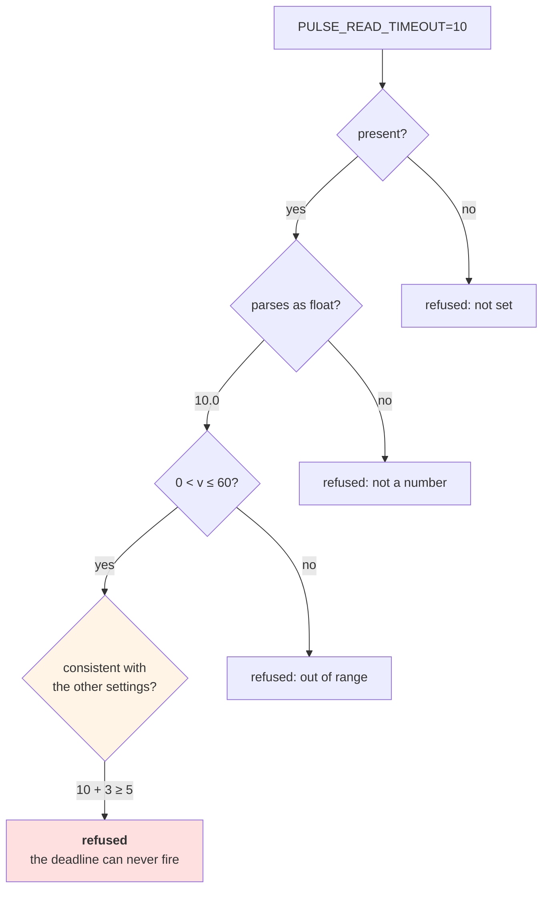

# 3.2 — Validating the value, not just its presence

## One-line answer

*"The variable is set"* is the weakest thing you can check about a setting — the useful ladder is **present →
parses → within bounds → consistent with the other settings**, and each rung catches a class of failure the
one below it cannot see.

---

## The story

🎬 **The scene.** A pharmacy dispensing counter. A prescription arrives with a box ticked, a name, a number
and a frequency.

The first check is that all four are filled in. That takes a second and catches the form somebody handed over
half-completed.

The second check is that the number is a number and the frequency is one of the ones that exist. That catches
`3O` — a letter O where a zero should be.

The third check is that the number is in range for the drug. That catches a dose that is ten times the
maximum.

The fourth check is the one that takes real attention: **does this prescription make sense next to the other
things this person is already taking?** Each is individually correct, in range, and legible. Together they
are dangerous.

😬 **The naive fix.** A busy afternoon, and a new assistant decides the first check is the important one:
everything is filled in, so it goes out.

💥 **Why it fails.** Nothing on the form is blank. Every field is present. **Presence was never the property
that mattered** — it was just the cheapest one to check, so it became the one that got checked.

💡 **The insight.** **Checks form a ladder, and the cheap rungs are the ones that catch the mistakes nobody
makes.** The expensive rung — do these values make sense *together* — is where the incidents live, and it is
the one that gets skipped because it requires knowing what the values mean.

---

## The idea in plain language

Here is the ladder, with what each rung catches and what it cannot see.

**Rung 1 — present.** Is the variable set at all? Catches: nothing configured. Misses: everything else. This
is where most services stop, and it is why `if not os.environ.get("X"): raise` is such a common and such a
weak line.

There is a subtlety already: [1.3](../01-configuration/1.3-everything-from-the-environment-is-a-string.md)
established that *unset*, *empty* and *whitespace* are three states. A presence check that uses truthiness
(`if not value`) treats empty as absent — often right. A presence check that uses `is None` treats empty as
present — often wrong. **Neither is universally correct, and choosing per field is the actual work.**

**Rung 2 — parses.** Is it the type it claims to be? Catches: `80O0`, `3,5`, `flase`. Misses: `0`, `999999`,
`-1`. This is `int`, `float`, `bool` on the field.

**Rung 3 — within bounds.** Is it a value this system can use? Catches: a port of `0`, a timeout of `-1`, a
retry count of `10000`, an empty API key. Misses: everything about how it relates to other settings. This is
`Field(ge=..., le=...)`, `Literal[...]`, `min_length`.

**Rung 4 — consistent.** Do the settings make sense *together*? Catches: a per-attempt timeout larger than
the total deadline; a token budget smaller than one call; `docs_enabled` true while `environment` is `prod`.
This rung needs a validator that sees the whole object, and it is where the interesting failures are, because
**every individual value passes every other rung.**

### Why rung 4 is the one that matters

Days 7 and 8 built an argument that a distributed system's failures live in the *relationships* between
values, not in the values. Day 7's timeout budget is the clearest case: a per-hop timeout of 3 and a total
deadline of 2 means the deadline can never be the thing that fires, so the bound you thought you had does not
exist ([Day 7, 5.1](../../../day-007-networking-for-operators/parts/05-the-two-together/5.1-the-timeout-budget-down-the-request-path.md)).

Both numbers are positive. Both are within any sane bound. Both parse. **And together they describe a system
with no working deadline.**

The plan names this shape as trap #4 — *the autonomy with no brake*. A brake that is configured but
ineffective is worse than a missing one, because it is on the diagram.

### The rung above 4, and why it is not on the list

*"Rung 5 — is it correct in reality?"* Does the URL resolve? Is the key valid? Does the file exist?

Some of these belong at startup and some do not, and the distinction is the subject of
[3.3](3.3-where-the-check-belongs-startup-versus-readiness.md). The short version, stated now so this part
does not overreach: **anything requiring a network call is not a startup check.** A local file's existence
usually is.

---

## Why Kriya needs it

**Day 7's timeouts arrive as configuration on Day 126**, when `pulse` gains a model provider with a connect
timeout, a read timeout and a total deadline. Three numbers whose relationship is the entire safety property.

**Day 44's autoscaler** takes `min_replicas` and `max_replicas`. `min > max` is two individually valid
integers describing an impossible system, and the plan names an unbounded autoscaler as trap #4.

**Day 76** defines an error budget from a target and a window. A target of `99.99` with a window of one day
is arithmetically fine and operationally meaningless — barely four seconds of budget — and only a check that
sees both numbers can say so.

**Day 147's evaluation loop** has a token budget, a per-call cost and a concurrency limit. Addendum 01's
zero-cost rule survives or dies on the relationship between those three, and **a budget smaller than a single
call is a loop that never runs or a loop that ignores its budget**, depending on which way the code rounds.

**Day 188's agent** gets a step limit, a wall-clock bound and a tool allowlist. Same shape, higher stakes.

---

## The mechanism

Start with the weakest check, so the improvement is measurable:

```python
# lab/rungs.py - four checks over the same value, from weakest to strongest.
from __future__ import annotations

import os


def rung1_present(name: str) -> str:
    value = os.environ.get(name)
    if value is None:
        raise ValueError(f"{name} is not set")
    return value


def rung2_parses(name: str) -> float:
    return float(rung1_present(name))


def rung3_bounded(name: str, low: float, high: float) -> float:
    value = rung2_parses(name)
    if not low < value <= high:
        raise ValueError(f"{name}={value} is outside ({low}, {high}]")
    return value


if __name__ == "__main__":
    for check, label in (
        (lambda: rung1_present("PULSE_REQUEST_TIMEOUT"), "present"),
        (lambda: rung2_parses("PULSE_REQUEST_TIMEOUT"), "parses "),
        (lambda: rung3_bounded("PULSE_REQUEST_TIMEOUT", 0, 60), "bounded"),
    ):
        try:
            print(f"{label}: OK -> {check()!r}")
        except ValueError as exc:
            print(f"{label}: REFUSED -> {exc}")
```

**Line by line:**

- `rung1_present` uses `is None`, so **an empty string passes**. That is deliberate and it is the hole
  [2.1](../02-typed-settings/2.1-hand-rolling-the-settings-object.md) also had — kept here so you can watch
  rung 2 catch what rung 1 let through.
- Each rung **calls the one below it**, so the ladder is structural rather than a naming convention. You
  cannot be bounded without having parsed.
- `not low < value <= high` — a chained comparison, and the asymmetry is the point: `low <` is strict (a
  timeout of exactly `0` is refused) and `<= high` is inclusive (exactly 60 is allowed). **Writing the
  boundary conditions deliberately is most of what rung 3 is.** A `0 <= value` here would let
  [1.3](../01-configuration/1.3-everything-from-the-environment-is-a-string.md)'s zero-timeout ambiguity in.
- `float(...)` raises `ValueError` on unparseable text and — importantly — **accepts `"inf"`**, which rung 3
  then refuses because `inf > 60`. Two rungs cooperating on one value.
- The `lambda`s in the loop delay evaluation, so each check runs inside its own `try`. Calling them eagerly
  would make the first failure end the demonstration.
- `except ValueError` only. A `TypeError` here would be a bug in this file and should surface (Principle 10).

```bash
cd days/day-009-configuration-and-secrets/lab
for v in "" "3" "abc" "0" "1e9" "inf"; do
  echo "PULSE_REQUEST_TIMEOUT=${v:-<empty>}"
  PULSE_REQUEST_TIMEOUT="$v" uv run python rungs.py | sed 's/^/    /'
done
echo "PULSE_REQUEST_TIMEOUT=<unset>"
uv run python rungs.py | sed 's/^/    /'
```

**Line by line:**

- A `for` loop over six values including the empty string, so all four states from
  [1.3](../01-configuration/1.3-everything-from-the-environment-is-a-string.md) are covered in one command.
- `${v:-<empty>}` — print a visible marker for the empty case, because an empty string prints as nothing and
  the row would look broken.
- `PULSE_REQUEST_TIMEOUT="$v"` **quoted**, so the empty value is passed as an empty value rather than
  disappearing from the command line entirely.
- `sed 's/^/    /'` indents the output under its heading. Cosmetic, and it makes a six-case table readable in
  a terminal.
- The final unset case is outside the loop, because there is no way to express "unset" as a loop value.

```text
PULSE_REQUEST_TIMEOUT=<empty>
    present: OK -> ''
    parses : REFUSED -> could not convert string to float: ''
    bounded: REFUSED -> could not convert string to float: ''
PULSE_REQUEST_TIMEOUT=3
    present: OK -> '3'
    parses : OK -> 3.0
    bounded: OK -> 3.0
PULSE_REQUEST_TIMEOUT=abc
    present: OK -> 'abc'
    parses : REFUSED -> could not convert string to float: 'abc'
    bounded: REFUSED -> could not convert string to float: 'abc'
PULSE_REQUEST_TIMEOUT=0
    present: OK -> '0'
    parses : OK -> 0.0
    bounded: REFUSED -> PULSE_REQUEST_TIMEOUT=0.0 is outside (0, 60]
PULSE_REQUEST_TIMEOUT=1e9
    present: OK -> '1e9'
    parses : OK -> 1000000000.0
    bounded: REFUSED -> PULSE_REQUEST_TIMEOUT=1000000000.0 is outside (0, 60]
PULSE_REQUEST_TIMEOUT=inf
    present: OK -> 'inf'
    parses : OK -> inf
    bounded: REFUSED -> PULSE_REQUEST_TIMEOUT=inf is outside (0, 60]
PULSE_REQUEST_TIMEOUT=<unset>
    present: REFUSED -> ''
```

**Read the `present` column.** It says OK for the empty string, for `abc`, for `0`, for a billion and for
infinity. **A presence check accepts every value in this table except one.**

### Rung 4 — the settings that are wrong together

Now the rung that needs the whole object. Add a deadline and a per-attempt timeout to the model:

```python
# lab/consistent.py - every field valid; the object is not.
from __future__ import annotations

from typing import Self

from pydantic import Field, model_validator
from pydantic_settings import BaseSettings, SettingsConfigDict


class Settings(BaseSettings):
    """Timeout settings whose *relationship* is the safety property (Day 7, 5.1)."""

    model_config = SettingsConfigDict(
        env_prefix="PULSE_", env_file=None, extra="forbid", frozen=True
    )

    environment: str = "dev"
    docs_enabled: bool = True
    connect_timeout: float = Field(default=1.0, gt=0, le=30)
    read_timeout: float = Field(default=3.0, gt=0, le=60)
    total_deadline: float = Field(default=5.0, gt=0, le=120)

    @model_validator(mode="after")
    def deadline_must_bound_the_attempt(self) -> Self:
        attempt = self.connect_timeout + self.read_timeout
        if attempt >= self.total_deadline:
            raise ValueError(
                f"total_deadline ({self.total_deadline}s) must exceed "
                f"connect_timeout + read_timeout ({attempt}s), or it can never fire"
            )
        return self

    @model_validator(mode="after")
    def docs_must_be_off_in_prod(self) -> Self:
        if self.environment == "prod" and self.docs_enabled:
            raise ValueError("docs_enabled must be false when environment is 'prod'")
        return self


if __name__ == "__main__":
    print(Settings().model_dump())
```

**Line by line:**

- `@model_validator(mode="after")` — runs **after** every field has been parsed and bounded, so `self` is a
  fully-typed object and the validator can do arithmetic rather than string handling. Verified against
  `https://docs.pydantic.dev/latest/concepts/validators/` on **2026-08-25**: *"After validators: run after the
  whole model has been validated. As such, they are defined as instance methods … Important note: the
  validated instance should be returned."*
- `def ... (self) -> Self` and `return self` — both required. A validator that forgets the `return` produces
  a `Settings` that is `None`, and the error is confusing enough to be worth stating: **the returned object
  is the model.**
- `from typing import Self` — available since Python 3.11 and this project is on 3.12
  (`docs/PACKAGES.md`, Day 0). The pydantic documentation imports it from `typing_extensions` for older
  versions; on 3.12 the standard library has it.
- **Two separate validators, not one with an `and`.** Each has a name that says which rule it enforces, and
  a failure names the rule. One combined validator would produce a message that could mean either thing.
- `deadline_must_bound_the_attempt` — this is Day 7's timeout-budget argument, expressed as a startup check
  ([Day 7, 4.3](../../../day-007-networking-for-operators/parts/04-timeouts/4.3-the-deadline-that-bounds-the-whole-call.md)).
  `>=` rather than `>` because a deadline exactly equal to the attempt leaves zero room for anything else in
  the path — connection setup, TLS, retries — so it is not a bound either.
- The message explains **why** it is wrong: *"or it can never fire"*. A message that states the rule teaches
  the operator; a message that says *"invalid configuration"* teaches nothing.
- `docs_must_be_off_in_prod` — a **policy** rather than an arithmetic fact, and it belongs here for the same
  reason: it is a statement about two settings together. Day 3 argued that documentation is a real capability
  ([Day 3, 3.3](../../../day-003-pulse-v0/parts/03-running-it/3.3-the-interactive-docs-and-why-you-turn-them-off.md));
  this line makes forgetting to turn it off a refusal instead of an exposure.
- `env_file=None` so the demonstration is purely about the environment.

```bash
cd days/day-009-configuration-and-secrets/lab
echo '--- individually valid, jointly wrong ---'
PULSE_CONNECT_TIMEOUT=3 PULSE_READ_TIMEOUT=10 PULSE_TOTAL_DEADLINE=5 uv run python consistent.py
echo "exit=$?"
echo '--- the policy rule ---'
PULSE_ENVIRONMENT=prod PULSE_DOCS_ENABLED=true uv run python consistent.py
echo "exit=$?"
```

**Line by line:**

- `3 + 10 = 13`, deadline `5`. **Every one of those three numbers is inside its bounds**; `connect_timeout=3`
  is under 30, `read_timeout=10` is under 60, `total_deadline=5` is under 120. Rungs 1–3 pass completely.
- The second command supplies two individually reasonable values that describe an exposure.
- Both exit codes should be non-zero, for the reason [3.1](3.1-fail-fast-the-crash-that-saves-the-night.md)
  gave.

```text
--- individually valid, jointly wrong ---
pydantic_core._pydantic_core.ValidationError: 1 validation error for Settings
  Value error, total_deadline (5.0s) must exceed connect_timeout + read_timeout (13.0s), or it can never fire [type=value_error, input_value={'connect_timeout': '3', ...}, input_type=dict]
exit=1
--- the policy rule ---
pydantic_core._pydantic_core.ValidationError: 1 validation error for Settings
  Value error, docs_enabled must be false when environment is 'prod' [type=value_error, input_value={'environment': 'prod', '...}, input_type=dict]
exit=1
```



**Only the last box needed to know about a *different* setting.** That is the whole difference between rung 3
and rung 4, and it is why rung 4 cannot live on a field.

---

## When it breaks

**The check that only checked presence.** The one this part exists to prevent:

```text
$ PULSE_MODEL_API_KEY= uv run python -c "
import os
key = os.environ.get('PULSE_MODEL_API_KEY')
if key is None: raise SystemExit('key not set')
print('startup OK, key length:', len(key))
"
startup OK, key length: 0
```

**What it says:** startup succeeded.
**What it actually means:** the deployment template substituted an unset variable and produced an empty
string, which is *present*. The service will send an empty credential to a provider and get a `401` at first
use ([1.3](../01-configuration/1.3-everything-from-the-environment-is-a-string.md)).
**The smallest fix:** `min_length` on the field, so the bound is part of the type.
**The general form:** **truthiness and `is None` are different presence checks**, and for a credential the
right one is *neither* — it is a length bound.

**The validator that returned nothing.** The pydantic-specific trap:

```text
Traceback (most recent call last):
  File "consistent.py", line 40, in <module>
    print(Settings().model_dump())
AttributeError: 'NoneType' object has no attribute 'model_dump'
```

**What it says:** something is `None`.
**What it actually means:** a `mode="after"` validator ran its checks and fell off the end without
`return self`, so the model *became* `None`. The documentation calls this out explicitly — *"Important note:
the validated instance should be returned"* — and it is the single most common mistake with after-validators.
**The smallest fix:** `return self`.
**Why the error is so far from the cause:** the failure surfaces wherever the settings object is first used,
which may be several imports away, so the traceback names an innocent line.

**The bound that was right and useless.** The subtle rung-3 failure:

```text
$ PULSE_TOTAL_DEADLINE=120 PULSE_READ_TIMEOUT=60 uv run python consistent.py
{'environment': 'dev', 'docs_enabled': True, 'connect_timeout': 1.0, 'read_timeout': 60.0, 'total_deadline': 120.0}
```

**What it says:** accepted.
**What it actually means:** a two-minute deadline and a one-minute read timeout on a service whose upstream
callers give up long before either. **Every rung passed** — the values are in range and internally consistent
— and the configuration is still operationally wrong, because the bound that matters is *the caller's
patience*, which is not in this object.
**The smallest fix:** there is not a validation fix. This is what Day 76's service level objective is for:
the number that says how long a user will wait, from which every timeout in the path is derived.
**Why it is worth saying out loud:** validation proves internal consistency, not external correctness. It is a
floor.

**The cross-field rule that fired during an incident.** The one that makes people hate rung 4:

```text
pulse: refusing to start - invalid configuration
  Value error, total_deadline (5.0s) must exceed connect_timeout + read_timeout (13.0s)
```

...at 3am, when an operator was deliberately raising `read_timeout` because a dependency had gone slow and a
longer wait was the correct mitigation.

**What it says:** the same refusal as before.
**What it actually means:** your validator was written for a healthy system and is now blocking the fix.
**The smallest fix:** raise `total_deadline` too — which is correct and is also two changes at 3am instead of
one.
**The design lesson, and it is a real trade:** a cross-field rule is a *constraint on operators*, not only on
mistakes. Write the ones that encode a genuine impossibility (a deadline that cannot fire) and be much more
careful with ones that encode a preference. **The rule of thumb: if a competent operator might deliberately
want the state you are refusing, it is not a validation rule — it is an opinion, and it belongs in a
dashboard or a review, not in a startup check.**

---

## In production

**What a professional writes instead of the teaching version.** The same ladder, with two additions. First,
**every bound has a comment saying where the number came from** — a service level objective, a platform
limit, a provider's documented maximum — because an unexplained bound is one nobody dares change and everyone
eventually works around. Second, they distinguish **impossibility rules from policy rules** and put them in
different places: impossibility rules are validators (the deadline that cannot fire); policy rules are
usually a separate check in CI or an admission policy in the cluster (Day 56's Kyverno), because policy
changes on a different schedule than code and should not require a release.

**What degrades at scale.** Cross-field rules become a web. Six settings with four relationships between them
is fine; twenty settings with fifteen relationships is a system where nobody can predict whether a change
will be accepted, and operators start setting values by trial and error against a validator. The tell is a
runbook that says *"if it refuses, also change X"*. **The professional response is to reduce the number of
independently-settable values** — derive the deadline from the timeouts rather than validating them against
each other, so there is one number to set and the relationship is arithmetic rather than a rule.

**The failure that only shows with real traffic.** A bound that is correct for the average case and wrong for
the tail. A `read_timeout` validated against a p50 latency, with a p99 four times higher
([Day 2, 1.3](../../../day-002-shape-of-production-system/parts/01-the-request-path/1.3-latency-adds-up-along-the-path.md)),
produces a service that is fine in testing and drops a percentage of real requests. **No amount of
configuration validation can catch this**, because the value is not wrong — the model of the world behind it
is. Day 63's histograms are what replaces the guess with a measurement.

**The review comment a senior engineer leaves.** *"The validator rejects `min_replicas > max_replicas`, which
is good, and it also rejects `max_replicas > 20`, which is not. Twenty is today's cluster, not a property of
the system, and the first time we need to scale past it during an incident this will refuse to start and
somebody will delete the rule under pressure. Keep the impossibility rule; move the ceiling to a policy the
platform enforces, where it can be changed by the people who own the capacity."*

**The signal you would alert on.** Nothing new — but this part changes what an *existing* signal means. Once
cross-field rules exist, a startup refusal can be caused by an operator's deliberate change during an
incident, so the **counter of startup refusals broken down by rule name** stops being a curiosity and becomes
worth putting on the incident dashboard. It is still not a page (the deploy failing is the page, Day 74). And
you would **not** emit a metric per setting value; that is the plan's trap #2, a label with unbounded
cardinality.

**Blast radius.** This part adds validation rules that **can prevent a service from starting**, including one
policy rule that could refuse a legitimate operator action during an incident — the failure demonstrated
above. Worst case: an operator loses time at 3am to a rule written casually in daylight. What bounds it: the
error message names the rule and states the arithmetic, so the operator knows what else to change; the rules
are few and each has a name; and the distinction between impossibility and preference is stated in the code
review. Who can trigger it: anyone who supplies configuration. **This is a real cost and it is worth paying
only for rules that encode impossibility.**

**Cost.** `0` model calls, `0` tokens, `0` CI minutes, `0` new packages, `0` network. Disk: two small lab
files. RAM: negligible. No server is started in this part.

**The interview question.** *"What do you validate about your configuration?"* The answer that shows depth
climbs the ladder and then names the trade: *"Presence, then type, then bounds, then the relationships
between settings — and the last one is where the real bugs are, because every individual value is valid. The
example I use is a per-attempt timeout larger than the total deadline: both numbers are positive and in
range, and together they describe a system whose deadline can never fire, so the bound on the diagram does
not exist. I put those in a model validator so it fails at startup. The thing I have learned to be careful
about is the difference between a rule that encodes an impossibility and one that encodes a preference — a
preference in a startup validator will eventually block an operator doing the right thing during an incident,
and then somebody deletes it under pressure and you lose the impossibility rules with it."*

---

## Check yourself

```bash
cd days/day-009-configuration-and-secrets/lab
PULSE_CONNECT_TIMEOUT=3 PULSE_READ_TIMEOUT=10 PULSE_TOTAL_DEADLINE=5 uv run python consistent.py ; echo "exit=$?"
PULSE_REQUEST_TIMEOUT=0 uv run python rungs.py
```

The first refuses three values that are each individually within bounds. The second shows `present: OK` and
`bounded: REFUSED` for the same value.

**Say out loud, without scrolling up:** *Name the four rungs of the validation ladder, give a value that
passes rungs one to three and fails rung four, and then say when a cross-field rule is a bad idea.*
