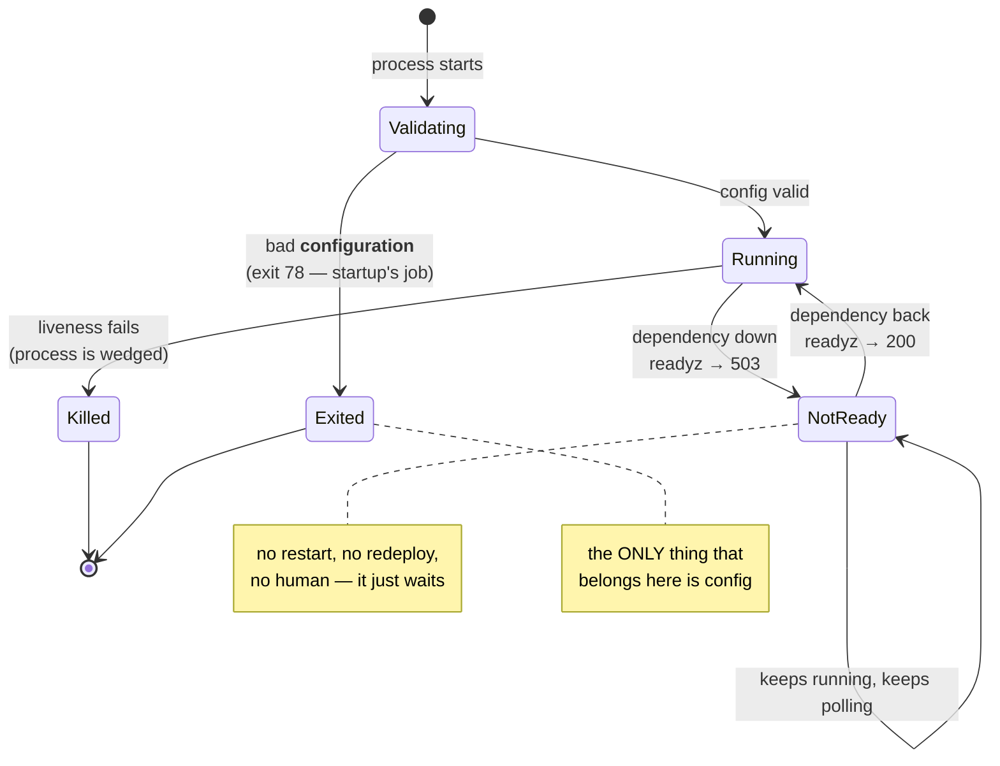

# 3.3 — Where the check belongs: startup versus readiness

## One-line answer

Validate at startup **only what you control and what cannot change while the process runs** — configuration —
and check everything you *depend on* at readiness instead, because a service that refuses to start when its
database is briefly unreachable cannot restart during the incident where restarting is the fix.

---

## The story

🎬 **The scene.** A minicab office. Two checks happen before a driver goes out.

The first is at the desk, once, at the start of the shift: licence, insurance, is the car the one on the
paperwork. If any of that is wrong, the driver does not go out. **These facts do not change during the
shift**, so checking them once is enough, and checking them at the desk is cheap.

The second happens continuously, over the radio: *are you free, is there fuel in the car, are you stuck in
the tunnel?* The controller asks, the driver answers, and the answer changes every few minutes. A driver who
is out of fuel is not a driver with a licence problem — they are a driver who cannot take the next job right
now and will be able to in ten minutes.

😬 **The naive fix.** A new controller merges the two checks. Fuel level goes on the desk checklist. A driver
below a quarter tank does not go out at all.

💥 **Why it fails.** On the day the pumps at the depot are down, **not one driver can start a shift**. The
cars are fine, the licences are fine, and there are jobs waiting. A temporary condition has been promoted to
a permanent disqualification, and the office is now entirely off the road because of a thing that would have
resolved itself in an hour.

Worse: the drivers already out are still working. **The only people the rule stops are the ones trying to
come back on.**

💡 **The insight.** **A check's home is decided by how long its answer stays true.** A fact that is fixed for
the life of the process belongs at the start. A fact that changes belongs on a loop — and putting a changing
fact in the one-time check converts a transient problem into a total, self-inflicted outage at exactly the
worst moment.

---

## The idea in plain language

A running service has three distinct questions asked about it, at three different moments, by three different
things. They get confused constantly, and the confusion is expensive.

| Question | When | Asked by | If the answer is no |
| --- | --- | --- | --- |
| **Can this process start at all?** | once, before serving | the process itself | exit non-zero — do not start |
| **Can it serve a request right now?** | repeatedly, forever | the load balancer / orchestrator | stop sending it traffic; keep it running |
| **Is it still alive at all?** | repeatedly, forever | the orchestrator | kill and restart it |

Those are, in Kubernetes' vocabulary that Day 12 and Day 36 will use in full: **startup validation**,
**readiness**, and **liveness**. Today only the first is being built; the other two are named so that the
boundary is clear, because **the boundary is the whole lesson**.

### The sorting rule

Ask one question of any check you are tempted to put at startup:

**"Can the answer change while this process is running?"**

If **no** — it is a property of the configuration or of the code — it belongs at startup. Configuration
cannot change while the process runs; that is
[1.2](../01-configuration/1.2-the-environment-is-the-interface.md)'s snapshot rule. So *every* rung of
[3.2](3.2-validating-the-value-not-just-its-presence.md)'s ladder belongs at startup, and checking it again
later is wasted work.

If **yes** — a network dependency, a disk that could fill, a certificate that could expire, a token that
could be revoked — it belongs on a loop. Checking it at startup is not merely useless; it is actively
harmful, and the next section says why.

| Check | Answer can change? | Where it belongs |
| --- | --- | --- |
| `PULSE_PORT` parses as an integer in range | no | startup |
| `PULSE_ENVIRONMENT` is one of three literals | no | startup |
| the deadline exceeds the sum of the timeouts | no | startup |
| the model file at `PULSE_MODEL_PATH` exists | **at startup, no** | startup (with care — see below) |
| the database accepts a connection | yes | readiness |
| the provider returns `200` for a token check | yes | readiness, and rarely even there |
| free disk is above 10% | yes | readiness or an alert (Day 5) |
| the certificate has not expired | yes | an external probe (Day 8) |

The `model_path` row is the interesting one and deserves its exception stated: **a file's existence is a
local, fast, non-networked fact**, so checking it at startup costs nothing and turns a request-time
`FileNotFoundError` into a start-time refusal. But the file could in principle be deleted while the process
runs, so the check does not *guarantee* anything later. **It is a startup check because it is cheap and
catches a real mistake, not because the answer is permanent** — and being honest about that distinction is
what stops it becoming an argument for checking the database too.

### Why a startup dependency check is dangerous

This is the part worth remembering, because it is counter-intuitive and it has caused genuinely large
outages.

Suppose `pulse` verified its database connection at startup and refused to start without it. On a normal day,
that is a nice property: a misconfigured connection string is caught immediately.

Now the database has a blip. Thirty seconds of unavailability.

- Every **running** replica is fine — they hold connections, or they fail a few requests and recover.
- But any replica that restarts during those thirty seconds **cannot come back**. It exits, the orchestrator
  restarts it, it exits again, and backoff begins.
- If the blip coincides with a rollout, or a node drain, or an autoscaler scale-up, or — the classic — an
  operator restarting the fleet *because of the blip*, then the number of healthy replicas goes down while
  the dependency is recovering.
- **The dependency comes back and the service does not**, because every replica is now in a restart backoff
  measured in tens of seconds, staggered, and each restart attempt is another connection to a database that
  is still catching up.

This has a name — a **metastable failure** — and its defining property is that removing the original cause
does not restore the system. Day 84's incident work returns to it. The mechanism today is simply:
**a startup check on a dependency converts that dependency's availability into your ability to exist.**

Day 2's vocabulary is the right one for the decision: a *hard* dependency is one you cannot serve without; a
*soft* one you can degrade around
([Day 2, 2.1](../../../day-002-shape-of-production-system/parts/02-dependencies/2.1-hard-and-soft-dependencies.md)).
**Even a hard dependency does not belong in a startup check** — it belongs in readiness, so the process
exists, holds its place, retries, and starts serving the moment the dependency returns.

---

## Why Kriya needs it

**Day 12** adds readiness and liveness probes to `pulse` and asks precisely this question about every check
you might put in them. Getting the boundary wrong there produces either a pod that restarts forever or one
that serves while broken.

**Day 36** reads the events of a failing pod, where `CrashLoopBackOff` and `Readiness probe failed` are two
completely different diagnoses with two completely different fixes. Being able to predict which one a given
check produces is the skill.

**Day 41's rolling update** stalls on a pod that will not start and *waits* on a pod that is not ready. Those
are different behaviours and you choose between them here.

**Day 109** loads a model into memory at startup — the first thing `pulse` does that takes real time. A slow
start is not a failed start, and the mechanism that distinguishes them (a startup probe) exists because
somebody once put a slow load behind a liveness check and watched it get killed mid-load, forever.

**Day 126** calls a provider, and the temptation to "verify the key works" at startup will be strong. That is
a network call to somebody else's rate-limited service, executed by every replica on every restart — which is
Addendum 01's quota problem and this part's metastable failure at the same time.

---

## The mechanism

Build both versions and watch them fail differently. First the one that checks a dependency at startup:

```python
# lab/startup_dep.py - checks a dependency at startup. This is the anti-pattern.
from __future__ import annotations

import socket
import sys

from fastapi import FastAPI

DEP_HOST, DEP_PORT = "127.0.0.1", 8099


def require_dependency() -> None:
    """Refuse to start unless the dependency answers. Deliberately wrong - see below."""
    try:
        with socket.create_connection((DEP_HOST, DEP_PORT), timeout=2):
            print(f"dependency at {DEP_HOST}:{DEP_PORT} is up", file=sys.stderr)
    except OSError as exc:
        print(f"pulse: refusing to start - dependency unreachable: {exc}", file=sys.stderr)
        raise SystemExit(69) from exc


require_dependency()
app = FastAPI(title="startup-dep")


@app.get("/healthz")
def healthz() -> dict[str, str]:
    return {"status": "ok"}
```

**Line by line:**

- The docstring says *"Deliberately wrong"*, in the file, for the same reason as
  [2.3](../02-typed-settings/2.3-naming-prefixes-and-the-variable-nobody-read.md)'s `collide.py`.
- `socket.create_connection((host, port), timeout=2)` — the smallest possible dependency check: open a TCP
  connection and close it. Day 7's four-tuple, with a timeout because **an unbounded connect is how a
  startup check becomes a hang rather than a failure**
  ([Day 7, 4.1](../../../day-007-networking-for-operators/parts/04-timeouts/4.1-a-timeout-is-a-decision-not-a-safety-net.md)).
- `with` so the socket is closed even on an exception — an unclosed socket here would leave a `CLOSE_WAIT`
  on the other side ([Day 7, 3.1](../../../day-007-networking-for-operators/parts/03-tcp/3.1-the-handshake-and-the-connection-states.md)).
- `except OSError` — the parent class of `ConnectionRefusedError`, `TimeoutError` and `socket.gaierror`, so
  all three failure shapes are covered. **Not `except Exception`.**
- `SystemExit(69)` — `EX_UNAVAILABLE` in the `sysexits` conventions, meaning *"a service is unavailable"*.
  Distinguishing it from the `78` of [3.1](3.1-fail-fast-the-crash-that-saves-the-night.md) is the point:
  these are different failures and a supervisor could treat them differently.
- `require_dependency()` at module scope, before `app` exists — so the process never reaches the point of
  binding a port.

Now the version that does it correctly:

```python
# lab/ready_dep.py - starts regardless; reports readiness on a loop.
from __future__ import annotations

import socket

from fastapi import FastAPI, Response

DEP_HOST, DEP_PORT = "127.0.0.1", 8099

app = FastAPI(title="ready-dep")


def dependency_is_up() -> bool:
    """Cheap, bounded, and asked fresh every time readiness is polled."""
    try:
        with socket.create_connection((DEP_HOST, DEP_PORT), timeout=1):
            return True
    except OSError:
        return False


@app.get("/healthz")
def healthz() -> dict[str, str]:
    """Liveness: can this process answer? Nothing else (Day 3, 2.2)."""
    return {"status": "ok"}


@app.get("/readyz")
def readyz(response: Response) -> dict[str, object]:
    """Readiness: should this process receive traffic right now?"""
    up = dependency_is_up()
    response.status_code = 200 if up else 503
    return {"ready": up, "dependency": f"{DEP_HOST}:{DEP_PORT}"}
```

**Line by line:**

- `app = FastAPI(...)` comes **before** any dependency logic. The process starts unconditionally; that is the
  whole design.
- `/healthz` is unchanged from Day 3 and checks **nothing but the process**
  ([Day 3, 2.2](../../../day-003-pulse-v0/parts/02-the-service/2.2-healthz-the-endpoint-that-must-not-lie.md)).
  **This is the line somebody will helpfully "improve" by adding the dependency check**, and doing so turns a
  dependency blip into a restart loop, because liveness failing means *kill the process*.
- `/readyz` is a **new endpoint**, separate from `/healthz`. Two endpoints because two questions; merging
  them is the single most common probe mistake there is.
- `timeout=1` on the readiness check, shorter than the startup version's 2. Readiness is polled repeatedly,
  so its cost is paid over and over, and **a readiness check that takes longer than the probe interval
  produces overlapping probes** — Day 12's arithmetic.
- `response.status_code = 200 if up else 503` — `503 Service Unavailable` is the correct code and Day 8
  explains why it is not `500`: it says *"try again, this is temporary"* rather than *"I am broken"*
  ([Day 8, 1.3](../../../day-008-http-and-tls/parts/01-the-message/1.3-the-status-codes-an-operator-reads.md)).
- The body names **which** dependency, so an operator reading the probe output does not have to guess. A bare
  `{"ready": false}` is a fact with no address.
- `response: Response` as a parameter — FastAPI injects the response object so the handler can set a status
  code while still returning a body that gets validated and serialised.

Run both against a dependency that is not there:

```bash
cd days/day-009-configuration-and-secrets/lab
echo '--- startup check, dependency down ---'
uv run uvicorn startup_dep:app --host 127.0.0.1 --port 8012
echo "exit=$?"

echo '--- readiness check, dependency down ---'
uv run uvicorn ready_dep:app --host 127.0.0.1 --port 8013 > /tmp/ready_dep.log 2>&1 &
sleep 3
echo "healthz : $(curl -sS -o /dev/null -w '%{http_code}' http://127.0.0.1:8013/healthz)"
echo "readyz  : $(curl -sS -o /dev/null -w '%{http_code}' http://127.0.0.1:8013/readyz)"
```

**Line by line:**

- The startup version is run in the **foreground**, because it is going to exit and the exit code is the
  thing being demonstrated.
- The readiness version is backgrounded, because it is going to keep running — which is itself the result.
- Two `curl`s against two endpoints, printing only status codes.

```text
--- startup check, dependency down ---
pulse: refusing to start - dependency unreachable: [WinError 10061] No connection could be made because the target machine actively refused it
exit=69
--- readiness check, dependency down ---
healthz : 200
readyz  : 503
```

**The second process is alive and honestly not ready.** Now bring the dependency up and watch it recover
without a restart:

```bash
uv run python -c "
import socket
s = socket.socket(); s.setsockopt(socket.SOL_SOCKET, socket.SO_REUSEADDR, 1)
s.bind(('127.0.0.1', 8099)); s.listen(8)
print('stand-in dependency listening on 127.0.0.1:8099')
import time; time.sleep(30)
" &
sleep 2
echo "readyz  : $(curl -sS -o /dev/null -w '%{http_code}' http://127.0.0.1:8013/readyz)"
curl -sS http://127.0.0.1:8013/readyz; echo
pkill -f 'ready_dep:app'; pkill -f '8099'
```

**Line by line:**

- A four-line stand-in dependency: bind a port, listen, do nothing. **It never accepts a connection**, and it
  does not need to — a TCP connect succeeds as soon as the kernel's accept queue takes it
  ([Day 7, 3.2](../../../day-007-networking-for-operators/parts/03-tcp/3.2-the-accept-queue-and-the-backlog.md)).
  That is worth knowing: **a connect-only health check proves a listener exists, not that anything is
  answering**, which is a real limitation of cheap probes.
- `SO_REUSEADDR` — so a previous run's socket in `TIME_WAIT` does not refuse the bind
  ([Day 7, 1.4](../../../day-007-networking-for-operators/parts/01-addresses-and-ports/1.4-the-port-that-was-already-in-use.md)).
- `listen(8)` — a backlog, because `listen()` is what turns a bound socket into one that accepts.
- The service is **not restarted**. It has been running the whole time.
- `pkill` on both, verified by the checklist's `netstat` sweep later.

```text
stand-in dependency listening on 127.0.0.1:8099
readyz  : 200
{"ready":true,"dependency":"127.0.0.1:8099"}
```

**Same process, no restart, ready again.** That is the property the startup check cannot have: it had already
exited.



---

## When it breaks

**The fleet that could not come back.** The metastable failure, in its natural form:

```text
$ kubectl get pods
NAME                    READY   STATUS             RESTARTS   AGE
pulse-6d4f8c9b5-2xkqz   0/1     CrashLoopBackOff   7          4m
pulse-6d4f8c9b5-8mv4r   0/1     CrashLoopBackOff   7          4m
pulse-6d4f8c9b5-p9wns   0/1     CrashLoopBackOff   6          4m
$ kubectl logs pulse-6d4f8c9b5-2xkqz --previous | tail -1
pulse: refusing to start - dependency unreachable: [Errno 111] Connection refused
```

**What it says:** every pod is crash-looping on a dependency.
**What it actually means:** the dependency had a blip, something restarted the pods — a rollout, a node
drain, or an operator responding to the blip — and now **the dependency is back and the service is not**,
because seven restarts have pushed the backoff out to tens of seconds and each attempt is staggered.
**The smallest fix, right now:** delete the startup check and redeploy — which requires a build, during an
incident.
**The fix that should have been there:** the check belongs in readiness. The pods would have been `0/1
Running`, taking no traffic, and would have gone `1/1` on their own the moment the dependency returned.
**The property to name out loud:** removing the original cause did not fix the system. That is what makes it
metastable rather than merely broken.

**The liveness probe that killed a healthy service.** The other half of the same mistake:

```text
$ kubectl describe pod pulse-6d4f8c9b5-2xkqz | tail -5
Events:
  Type     Reason     Age                From     Message
  ----     ------     ----               ----     -------
  Warning  Unhealthy  2m (x9 over 5m)    kubelet  Liveness probe failed: HTTP probe failed with statuscode: 503
  Normal   Killing    2m (x3 over 5m)    kubelet  Container pulse failed liveness probe, will be restarted
```

**What it says:** liveness failed, so the container is being restarted.
**What it actually means:** somebody put the dependency check behind `/healthz`, and `/healthz` is wired to
**liveness**, which means *"kill it"*. A slow dependency is now producing a restart storm against a process
that was working perfectly. **Restarting has not helped and cannot help**, because the problem is not in this
process.
**The smallest fix:** liveness checks the process and nothing else — exactly Day 3's design
([Day 3, 2.2](../../../day-003-pulse-v0/parts/02-the-service/2.2-healthz-the-endpoint-that-must-not-lie.md)).
Dependencies go behind readiness.
**Why this is so common:** `/healthz` already existed, adding a check to it is one line, and nobody thinks
about which probe consumes it.

**The readiness check that was expensive.** The subtle one:

```text
$ curl -sS -o /dev/null -w 'readyz: %{http_code} in %{time_total}s\n' http://127.0.0.1:8013/readyz
readyz: 200 in 1.902s
```

**What it says:** ready, slowly.
**What it actually means:** the readiness handler is doing real work — a query, a full round trip, maybe
several. If the probe interval is shorter than the handler takes, probes overlap, and under load the
readiness path becomes a meaningful fraction of the service's own traffic. **In the worst version, a
struggling dependency makes readiness slow, which makes the probe time out, which removes a healthy pod from
service, which increases load on the remaining pods.**
**The smallest fix:** cache the readiness answer for a short interval and bound the check with a timeout well
under the probe's.
**The general rule:** **a readiness check is on the hot path of your availability**. It should be cheaper
than the requests it gates.

**The startup check that was right.** The counter-example, because the rule is not "never check anything":

```text
pulse: refusing to start - invalid configuration
  model_path: Path does not point to a file (got '/models/classifier-v3.joblib')
```

**What it says:** the model file is not there.
**What it actually means:** a local, instant, non-networked fact that is almost certainly a deployment
mistake — the wrong image tag, a volume that did not mount. **Refusing is right**: the alternative is a
service that starts, reports ready, and returns `500` on every prediction.
**Why it does not contradict this part:** the check does not depend on another system being *available*. If
the volume is missing, no amount of waiting fixes it, so there is nothing for readiness to wait for. **The
test is not "is it local" — it is "could waiting help?"** If waiting could help, it is readiness. If waiting
cannot help, it is startup.

---

## In production

**What a professional writes instead of the teaching version.** Three endpoints and a clear contract for
each, written down where the probe configuration lives: `/healthz` touches nothing (liveness), `/readyz`
checks dependencies with a short timeout and a short cache (readiness), and — from Day 109 — a startup path
that may be slow but is bounded. They also make readiness **directional**: a service that is shutting down
flips readiness to `false` *before* it stops accepting connections, so the load balancer stops sending work a
few seconds before the process goes away. That is Day 4's graceful shutdown and this part's readiness meeting
each other ([Day 4, 4.1](../../../day-004-linux-for-operators-i/parts/04-the-service-died/4.1-graceful-shutdown-for-pulse.md)),
and it is the difference between a clean deploy and a handful of `502`s per rollout.

**What degrades at scale.** Probe traffic and probe correlation. At three replicas, readiness checks are
noise. At three hundred, every replica polling a shared dependency once per second is three hundred requests
per second of pure health-checking, and — worse — they **correlate**: when the dependency slows, every
replica's check slows at the same moment and the whole fleet goes unready together, which is a total outage
produced by a partial degradation. Mature systems cache the readiness verdict, jitter the interval, and make
readiness reflect *"can I serve"* rather than *"is everything perfect"* — a service that can serve 80% of its
endpoints should be ready.

**The failure that only shows with real traffic.** Readiness that is true and useless. The dependency
accepts a TCP connection — as the stand-in above demonstrated, `listen()` alone is enough — while the
application behind it is deadlocked and answering nothing. The probe is green, traffic arrives, and every
request times out. **A connect-only check proves a listener exists**; a check that exercises the actual code
path proves something worth knowing and costs more. Choosing is a real trade, and the honest answer is
usually "a cheap check, plus an alert on the real symptom" rather than an expensive probe.

**The review comment a senior engineer leaves.** *"This adds a database ping to the startup path. That makes
our ability to start depend on the database being up, so a thirty-second blip during a rollout means the new
pods crash-loop into backoff and we are down long after the database recovers. Move it to `/readyz`. And
please do not add it to `/healthz` instead — that is the liveness probe, and it will make Kubernetes kill
healthy pods because something else is slow."*

**The signal you would alert on.** **Readiness, aggregated — the fraction of replicas ready, over time.** Not
a single pod being unready (that is normal during a rollout and during a restart), but *"fewer than N ready
for longer than M"*, which is the signal that actually means "we are losing capacity". Day 74 builds it. You
would **not** page on a readiness check failing once, and you would **not** alert on startup validation at
all — [3.1](3.1-fail-fast-the-crash-that-saves-the-night.md) already established that a process which will
not start is detected by the deployment failing.

**Blast radius.** This part starts two servers (ports 8012 and 8013) and one stand-in listener (8099), all on
loopback, and one of the three exits deliberately. The capability introduced is **an endpoint whose answer
controls whether traffic reaches this service** — which is a genuine power: a readiness check that is wrong
in the "always false" direction takes the service out of rotation entirely, and one that is wrong in the
"always true" direction sends traffic into a broken process. What bounds it today: the endpoint is on
loopback, nothing consumes it yet (Day 12 wires the probe), and the check has an explicit timeout so it
cannot hang. Who can trigger it: anything that can reach the port. **Note that this is the first endpoint in
`pulse`'s life whose *output* is a control signal rather than a response, and Day 12 is where its blast
radius becomes real.**

**Cost.** `0` model calls, `0` tokens, `0` CI minutes, `0` new packages. Network: loopback only. RAM: up to
two uvicorn processes at roughly 60 MB each plus a trivial listener. Disk: one log file in `/tmp`.

**The interview question.** *"Should your service check that the database is up before it starts?"* The
answer that shows you have seen it go wrong: *"No. Configuration goes in the startup check because it cannot
change while the process runs; dependencies go in readiness because they can. If I verify the database at
startup, then a short database blip means any pod that restarts during it cannot come back — and if the blip
happened during a rollout, or if somebody restarted the fleet in response to it, I now have a fleet in
crash-loop backoff that stays down after the database recovers. That is a metastable failure: removing the
cause does not fix the system. In readiness the same pods sit there, take no traffic, and recover on their
own. The related mistake is putting the dependency check behind the liveness endpoint, which makes the
orchestrator kill perfectly healthy processes because something else is slow."*

---

## Check yourself

```bash
cd days/day-009-configuration-and-secrets/lab
uv run uvicorn startup_dep:app --port 8012 ; echo "startup version exit=$?"
uv run uvicorn ready_dep:app --port 8013 > /tmp/ready_dep.log 2>&1 &
sleep 3; echo "readiness version: healthz=$(curl -sS -o /dev/null -w '%{http_code}' http://127.0.0.1:8013/healthz) readyz=$(curl -sS -o /dev/null -w '%{http_code}' http://127.0.0.1:8013/readyz)"
pkill -f 'ready_dep:app'
```

One process that never existed, and one that is alive, honest and waiting. **Say which of the two an
orchestrator can recover without a human.**

**Say out loud, without scrolling up:** *Give the one-sentence rule for deciding whether a check belongs at
startup or at readiness, then describe the failure that happens when a dependency check is put at startup —
and say why the system stays broken after the dependency recovers.*
