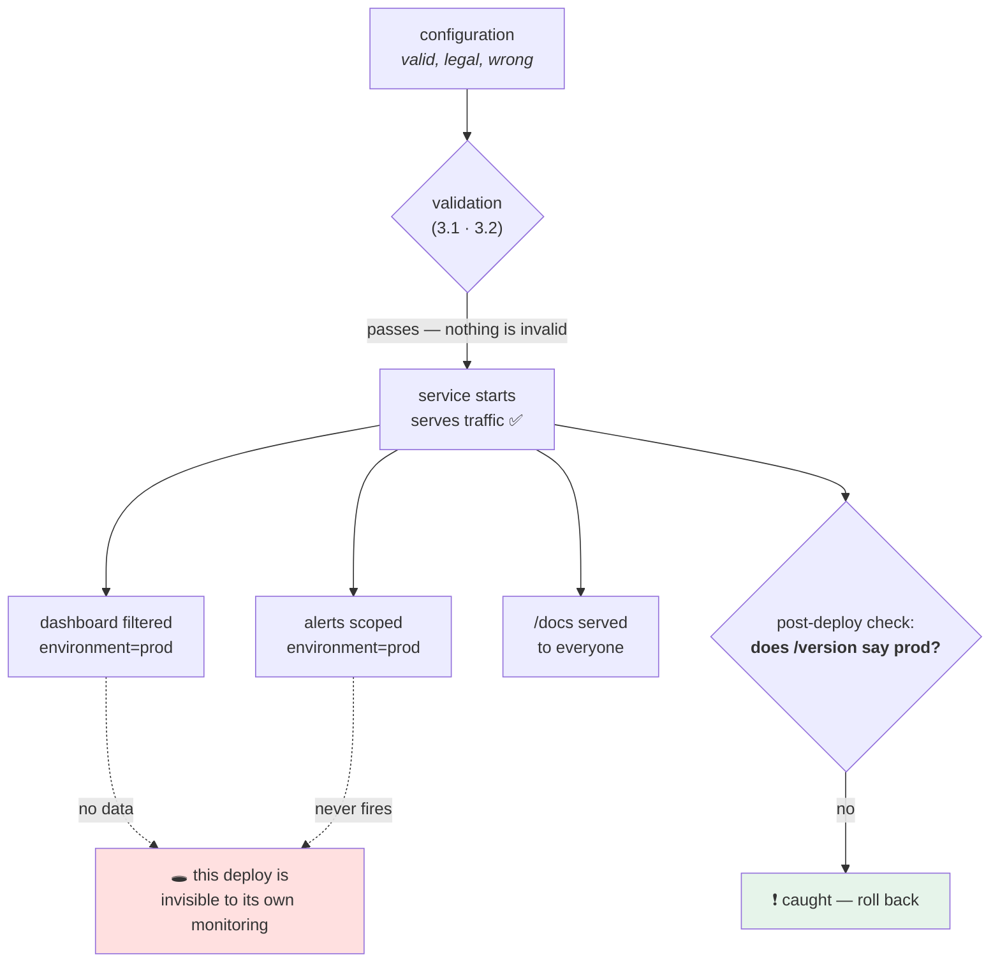

# 3.4 — The service that started with the wrong config

## One-line answer

Validation proves a configuration is **legal**, never that it is **the intended one** — so a deploy that
receives a completely valid configuration meant for a different environment starts cleanly, passes every
check you have, serves traffic, and is only detectable by something that compares what the service *says it
is* against what it was *supposed to be*.

---

## The story

🎬 **The scene.** A hospital pharmacy again, and this time everything on the form is right.

The drug is real. The dose is within range. The frequency exists. Every check the system has passes, because
every value is a legitimate value.

It is for the patient in bed 4. It has been delivered to bed 14.

😬 **The naive fix.** Add more checks to the form. Is the dose in range? Is the drug on the formulary? Is the
frequency valid?

💥 **Why it fails.** All of those already pass. **There is nothing wrong with the form.** The mistake is in
the relationship between the form and the world, and no amount of checking the form can see it. The only
thing that catches this is the one procedure that steps outside the form entirely: at the bedside, out loud,
*"tell me your name and date of birth"* — comparing what you are about to do against an independent statement
of who this is.

💡 **The insight.** **A validator can only ever check a thing against itself.** Catching "right value, wrong
place" needs a second, independent source of truth and a comparison — and that comparison is a completely
different kind of check from everything in section 3 so far.

---

## The idea in plain language

Section 3 has built a good defence against **invalid** configuration. `PULSE_PORT=80O0` is refused,
`flase` is refused, a deadline that cannot fire is refused. All of it exits non-zero and rolls back.

None of it helps with this:

```text
PULSE_ENVIRONMENT=dev
PULSE_HOST=0.0.0.0
PULSE_PORT=8000
PULSE_DOCS_ENABLED=true
PULSE_REQUEST_TIMEOUT=30.0
```

Every value is legal. Every value parses. Every bound is satisfied. Every cross-field rule passes.

And it is the **development** configuration, deployed to the machine serving real users, because a promotion
step copied the wrong file, or a template rendered a default, or somebody edited the staging manifest and
applied it to the wrong context.

What actually happens:

- **The service works.** Requests are served, `/healthz` is `200`, readiness is green, the deployment goes
  through cleanly.
- **Interactive documentation is being served to strangers**, because `docs_enabled` defaults to true in dev
  ([Day 3, 3.3](../../../day-003-pulse-v0/parts/03-running-it/3.3-the-interactive-docs-and-why-you-turn-them-off.md)).
- **Every log line is tagged `environment=dev`**, so the production dashboard — which filters on
  `environment=prod` — shows this deploy contributing *nothing*. Traffic is being served and no chart moves.
- **Every alert scoped to production ignores it.** The service could be returning errors and the alert would
  not fire, because the alert's selector does not match.
- **A thirty-second request timeout** is in place where three was intended, so Day 7's argument applies at
  full strength: the service will hold connections for ten times as long as designed under a slow dependency
  ([Day 7, 5.3](../../../day-007-networking-for-operators/parts/05-the-two-together/5.3-hanging-pulse-on-purpose.md)).

**This is the fifth consecutive day where the service is wrong and the dashboard is green** — Day 5's disk
that did not free, Day 6's silent kill, Day 7's exhausted connections, Day 8's expired certificate, and now a
deploy that is invisible to its own monitoring *because of its configuration*.

And it is worse than the previous four in one specific way: **the previous four were failures. This one is
not.** Nothing is broken. There is no error to find, no traceback, no exit code. The only evidence is a
mismatch between two facts that nothing is comparing.

### What actually detects it

Three things, in increasing order of value:

**One — the service says what it is, at startup.** One INFO line containing the resolved configuration. It
does not detect anything by itself; it makes detection *possible*, because now the fact exists in a place
somebody can look.

**Two — the service exposes what it is, on demand.** An endpoint. `pulse` already has `/version`
([Day 3, 2.3](../../../day-003-pulse-v0/parts/02-the-service/2.3-version-what-is-actually-running.md)), and
adding the environment to it costs one field.

**Three — something compares that against an independent statement of what it should be.** This is the
bedside check, and it is the only one that actually catches anything. A smoke test that runs after every
deploy and asserts *"the thing at this address says it is `prod`"*.

That third one is a **post-deployment verification**, and it is the beginning of Day 10's promotion argument:
a promotion is not complete when the deploy succeeds — it is complete when something has verified that what
arrived is what was intended.

---

## Why Kriya needs it

**Day 10 is the direct sequel.** Promotion moves one artifact between environments, and the configuration is
the *only* thing that is supposed to differ. This part is the failure that motivates Day 10's parity check.

**Day 20** computes the four delivery metrics, one of which is change failure rate. A deploy like this one is
a failure that nothing recorded, so the metric is wrong in the flattering direction.

**Day 62** builds metrics with labels, and `environment` will be one of them. This part is why: a label that
is wrong makes a service invisible rather than mislabelled, and invisible is worse.

**Day 67** puts `environment` in every structured log line, for the same reason.

**Day 74** writes the alerts whose selectors this failure evades, and **Day 79's runbook** for "no data" —
which is what a production dashboard shows during exactly this incident — is a direct consequence.

**Day 229's production readiness review** asks *"how would you know this deploy is running the configuration
you intended?"* If the answer is *"we would notice"*, the review fails.

---

## The mechanism

This is the day's second red gate. Build a service that reports its own configuration, then deploy it twice
with two valid configurations and compare six observations.

```python
# lab/announcing.py - a service that says what it is, loudly and on demand.
from __future__ import annotations

import logging
import sys

from fastapi import FastAPI

from settings_pydantic import Settings

logging.basicConfig(level=logging.INFO, format="%(levelname)s %(message)s", stream=sys.stdout)
log = logging.getLogger("pulse")

settings = Settings()
log.info(
    "startup config environment=%s host=%s port=%s docs_enabled=%s request_timeout=%s",
    settings.environment,
    settings.host,
    settings.port,
    settings.docs_enabled,
    settings.request_timeout,
)

app = FastAPI(title="pulse", docs_url="/docs" if settings.docs_enabled else None)


@app.get("/healthz")
def healthz() -> dict[str, str]:
    return {"status": "ok"}


@app.get("/version")
def version() -> dict[str, str]:
    """What is actually running here - now including which deploy this is."""
    return {"service": "pulse", "version": "0.1.0", "environment": settings.environment}
```

**Line by line:**

- `logging.basicConfig(...)` with `stream=sys.stdout` — a placeholder for Day 67's structured logging. Going
  to standard output rather than standard error is deliberate: this is an *event*, not a diagnostic, and Day
  67 will argue the point properly.
- `log.info("startup config environment=%s ...", ...)` — **`%s` placeholders with arguments, not an
  f-string.** The logging module only formats the message if the level is enabled, and — more importantly for
  later — a structured logging handler can capture the fields separately. An f-string collapses everything
  into one opaque string at the call site.
- The field names in the message are `key=value` pairs, which is the format Day 67 will formalise and which
  `grep` and log aggregators can both parse today.
- `settings = Settings()` at module scope again, for the same reason as
  [3.1](3.1-fail-fast-the-crash-that-saves-the-night.md): this file demonstrates one thing and mixing in
  [2.4](../02-typed-settings/2.4-the-settings-object-read-at-import-time.md)'s accessor would obscure it.
- `/version` gains an `environment` field. **This one field is the whole detection mechanism**, and it costs
  nothing. Day 3 built the endpoint; today it earns its keep.
- `"version": "0.1.0"` is a literal here only because this lab file does not import `pulse`.
  [5.1](../05-pulse-configured/5.1-pulse-config-the-settings-object.md)'s real version reads `__version__`
  from the single definition, as Day 3 insisted
  ([Day 3, 2.3](../../../day-003-pulse-v0/parts/02-the-service/2.3-version-what-is-actually-running.md)).

Now the drill. Six observations, two configurations, both entirely valid:

```bash
# lab/config_drill.sh - the same service, two legal configurations, six observations.
set -u
PORT=8014
BASE="http://127.0.0.1:$PORT"

run_with() {
  local label="$1"; shift
  pkill -f "announcing:app" 2>/dev/null; sleep 1
  env "$@" uv run uvicorn announcing:app --host 127.0.0.1 --port "$PORT" > /tmp/drill.log 2>&1 &
  sleep 4
  printf '%-26s' "$label"
  printf '%-9s' "$(curl -sS -o /dev/null -w '%{http_code}' "$BASE/healthz")"
  printf '%-9s' "$(curl -sS -o /dev/null -w '%{http_code}' "$BASE/version")"
  printf '%-9s' "$(curl -sS -o /dev/null -w '%{http_code}' "$BASE/docs")"
  printf '%-13s' "$(curl -sS "$BASE/version" | grep -o '"environment":"[^"]*"' | cut -d: -f2 | tr -d '"')"
  printf '%-9s' "$(grep -c 'ERROR\|Traceback' /tmp/drill.log)"
  printf '%s\n'  "$(grep -o 'environment=[a-z]*' /tmp/drill.log | head -1)"
}

printf '%-26s%-9s%-9s%-9s%-13s%-9s%s\n' "configuration" "healthz" "version" "/docs" "reports as" "errors" "startup line"
run_with "intended (prod)"  PULSE_ENVIRONMENT=prod PULSE_DOCS_ENABLED=false PULSE_REQUEST_TIMEOUT=3
run_with "wrong (dev, valid)" PULSE_ENVIRONMENT=dev PULSE_DOCS_ENABLED=true  PULSE_REQUEST_TIMEOUT=30
pkill -f "announcing:app"
```

**Line by line:**

- `set -u` but **not** `set -e`: several commands here are expected to return non-zero (`curl` against a
  route that does not exist, `grep -c` finding nothing), and `set -e` would abort the drill mid-table. `-u`
  still catches an unset variable, which is the mistake worth catching in a script like this.
- `run_with` takes a label and then `NAME=value` pairs, passed to `env`. **`env "$@"` is the inline form from
  [1.2](../01-configuration/1.2-the-environment-is-the-interface.md)** generalised to a function, so no
  variable survives into the next run — which in a drill comparing two configurations is the difference
  between a result and a lie.
- `pkill` then `sleep 1` at the top of each run: the previous process must be gone before the next binds the
  same port, or the "new" behaviour you measure is the old process
  ([Day 7, 1.4](../../../day-007-networking-for-operators/parts/01-addresses-and-ports/1.4-the-port-that-was-already-in-use.md),
  and Day 8's trap 7).
- `sleep 4` — uvicorn must be listening before the first `curl`. A production script would poll the port; a
  drill can afford to wait.
- `printf '%-26s'` and friends — fixed-width columns, so the two rows line up and the eye can compare them.
  **The comparison is the artifact**; an unaligned table hides the result it is meant to show.
- `curl ... "$BASE/docs"` — this is the exposure check. It returns `200` when documentation is served and
  `404` when the route does not exist.
- `grep -o '"environment":"[^"]*"'` — pull the field out of the JSON without a parser, because the drill
  should have no dependencies. In real tooling this would be `jq` or Python; in a five-line drill, `grep -o`
  and `cut` are honest.
- `grep -c 'ERROR\|Traceback'` — count error lines in the service's own log. **The expected answer is `0` in
  both rows**, and that is the point of including it.
- The last column extracts the startup line's `environment=` value — the one piece of evidence that
  differs and that a human would have to go and look at.

```text
configuration             healthz  version  /docs    reports as   errors   startup line
intended (prod)           200      200      404      prod         0        environment=prod
wrong (dev, valid)        200      200      200      dev          0        environment=dev
```

**Read the table across.** Of six observations, **four are identical**: the health check, the version
endpoint's status, the error count and — implicitly — the fact that both processes are running and serving.

Two differ, and both of them are only visible if somebody looks:

- `/docs` returns `200` instead of `404`. **That is an exposure, and nothing on the machine considers it an
  error.**
- The service reports `environment=dev`. Every dashboard, alert and log query scoped to production is now
  looking straight past this deploy.



**Every path except the last one ends in silence.**

### Making it go red on purpose

The gate is the smoke check — the bedside question. It has to be able to fail, and you have to watch it fail:

```bash
# lab/smoke.sh - assert that the thing at this address is the deploy you intended.
set -u
EXPECTED="${1:?usage: smoke.sh <expected-environment> <base-url>}"
BASE="${2:?usage: smoke.sh <expected-environment> <base-url>}"

ACTUAL="$(curl -sS --max-time 5 "$BASE/version" | grep -o '"environment":"[^"]*"' | cut -d: -f2 | tr -d '"')"

if [ -z "$ACTUAL" ]; then
  echo "SMOKE FAIL: $BASE/version did not report an environment at all"; exit 2
fi
if [ "$ACTUAL" != "$EXPECTED" ]; then
  echo "SMOKE FAIL: expected environment=$EXPECTED, the deploy says environment=$ACTUAL"; exit 1
fi
echo "SMOKE OK: $BASE reports environment=$ACTUAL"
```

**Line by line:**

- `"${1:?usage: ...}"` — shell syntax for *"this parameter is required; print this message and exit if it is
  missing"*. **A smoke test with a defaulted expectation is a smoke test that always passes**, which is the
  single most common way this kind of gate is silently disabled.
- `--max-time 5` on the `curl` — the check itself must be bounded, or a hung service turns a failed
  deployment into a hung pipeline ([Day 7, 4.1](../../../day-007-networking-for-operators/parts/04-timeouts/4.1-a-timeout-is-a-decision-not-a-safety-net.md)).
- The **empty check comes first**, with its own exit code `2`. An empty `ACTUAL` means the endpoint did not
  answer, or answered without the field — an *older build* that predates this field. Treating that as "not
  equal" would be right by accident; treating it as its own failure says what actually happened.
- `[ "$ACTUAL" != "$EXPECTED" ]` with both sides quoted, so an empty or space-containing value cannot turn
  the test into a syntax error that the shell reports as *true*.
- The failure message contains **both** values. *"Smoke test failed"* tells an operator to go and
  investigate; *"expected prod, got dev"* tells them what happened and usually what to do.
- Exit codes: `0` pass, `1` mismatch, `2` no answer. Three distinguishable states, because
  [Day 4, 3.1](../../../day-004-linux-for-operators-i/parts/03-exit-codes/3.1-the-exit-code-is-the-whole-return-value.md)
  established that the exit code is what a pipeline reads.

```bash
cd days/day-009-configuration-and-secrets/lab
PULSE_ENVIRONMENT=dev PULSE_DOCS_ENABLED=true uv run uvicorn announcing:app --port 8014 > /tmp/drill.log 2>&1 &
sleep 4
echo '--- the gate, red ---'
bash smoke.sh prod http://127.0.0.1:8014 ; echo "exit=$?"
pkill -f 'announcing:app'; sleep 1

PULSE_ENVIRONMENT=prod PULSE_DOCS_ENABLED=false uv run uvicorn announcing:app --port 8014 > /tmp/drill.log 2>&1 &
sleep 4
echo '--- the gate, green ---'
bash smoke.sh prod http://127.0.0.1:8014 ; echo "exit=$?"
pkill -f 'announcing:app'
```

**Line by line:**

- Red **first**, then green. A gate you have only ever seen pass is a gate you have not tested (Principle 11).
- The same command, `bash smoke.sh prod ...`, in both halves — **only the deploy changes**. If the command
  differed, the comparison would prove nothing.
- `pkill` and `sleep 1` between, for the same port-reuse reason as the drill.

```text
--- the gate, red ---
SMOKE FAIL: expected environment=prod, the deploy says environment=dev
exit=1
--- the gate, green ---
SMOKE OK: http://127.0.0.1:8014 reports environment=prod
exit=0
```

---

## When it breaks

**No data.** What this failure looks like on a dashboard, and the reason Day 79 needs a runbook for it:

```text
$ curl -sS 'http://localhost:9090/api/v1/query?query=sum(rate(http_requests_total{environment="prod"}[5m]))'
{"status":"success","data":{"resultType":"vector","result":[]}}
```

**What it says:** an empty result.
**What it actually means:** either nothing is serving production traffic, or something is serving it under a
different label. **Those are opposite situations and the query cannot tell them apart.**
**The smallest fix:** query without the label and look at what values actually exist.
**Why an empty result is so dangerous:** most alerting rules are written as *"fire when the value crosses a
threshold"*, and **an empty result never crosses a threshold**. An alert on `error_rate > 0.05` scoped to
`environment="prod"` will not fire when there is no `prod` data at all — the alert is silently satisfied.
This is the single most important thing to know about label-scoped alerting, and Day 74 builds the
counter-measure (an alert on the *absence* of data).

**The `/docs` that a stranger found.** The exposure:

```text
GET /openapi.json HTTP/1.1
Host: pulse.example.com
User-Agent: python-requests/2.32.5
```

**What it says:** something fetched the OpenAPI document.
**What it actually means:** it was reachable, so somebody's scanner found it, and it lists every route, every
field, every constraint and every example. **There is no error, no `403`, and no log line that reads as a
problem** — it is a successful request for a document your service is configured to publish.
**The smallest fix:** the configuration that was intended.
**Why the request log does not help:** it looks exactly like legitimate traffic, because it is legitimate
traffic to an endpoint that should not exist.

**The smoke test that could not fail.** The gate that was not a gate:

```text
$ bash smoke.sh
SMOKE OK:  reports environment=
$ echo $?
0
```

**What it says:** pass.
**What it actually means:** it was called with no arguments, `EXPECTED` and `ACTUAL` were both empty, and
empty equals empty. **A gate that passes when it is misused is worse than no gate**, because it produces the
green tick that stops anybody looking.
**The smallest fix:** the `${1:?message}` form in the script above — which is why it is there rather than a
default.
**The general rule, repeated from [2.3](../02-typed-settings/2.3-naming-prefixes-and-the-variable-nobody-read.md):**
every check needs a check that the check ran. Day 0's `docs/INCIDENTS.md` row 9 is the same lesson from the
`./o check` gate.

**The wrong config that was actually right.** The false positive, which is what makes this hard:

```text
SMOKE FAIL: expected environment=prod, the deploy says environment=prod-eu-2
```

**What it says:** a mismatch.
**What it actually means:** a new deploy exists, legitimately, with a more specific name, and the smoke test's
expectation is stale. **The gate is now blocking a correct deployment.**
**The smallest fix:** the expectation comes from the same source as the configuration — the promotion
manifest — rather than being typed into the pipeline. Day 10's release object is exactly that source, and
this is one of the reasons it needs to exist.
**Why it is worth showing:** a verification whose expected value is maintained separately from the thing it
verifies will drift, and a drifting gate gets disabled. **The expectation and the configuration must have one
origin.**

---

## In production

**What a professional writes instead of the teaching version.** The smoke test is not a shell script somebody
remembers to run — it is a **step in the deployment**, between "the new version is running" and "the new
version receives traffic", and its failure rolls back automatically. The expectation comes from the release
definition rather than from a hardcoded string. And the check is broader than one field: a real
post-deployment verification asserts the version, the environment, the configuration hash and that a
representative request returns the right *shape*. Everything else in this part exists to make that step
possible; the step itself is the deliverable.

**What degrades at scale.** The number of things that could be wrong-but-valid. With three settings, a smoke
test can assert all of them. With sixty, it asserts the four that matter and the rest are checked by
comparison instead: **the configuration hash of this deploy against the hash the release says it should
have**. That is a single comparison covering everything, and it is why
[1.4](../01-configuration/1.4-the-precedence-ladder.md) suggested exposing `config_hash` in the first place.
The scaling trick is to stop enumerating and start comparing.

**The failure that only shows with real traffic.** A configuration that is wrong in a way that only matters
under load. This part's `request_timeout=30` instead of `3` is exactly that: at ten requests per second
nothing is different, and when the dependency slows, Day 7's connection exhaustion arrives ten times faster
than the design allowed for
([Day 7, 5.3](../../../day-007-networking-for-operators/parts/05-the-two-together/5.3-hanging-pulse-on-purpose.md)).
**The deploy was fine for six hours and then was not**, and the incident timeline will begin at the slowdown
rather than at the deploy, which is where six hours of investigation goes.

**The review comment a senior engineer leaves.** *"The deploy job ends when the rollout reports success. That
means the only thing we have verified is that the process starts — which we already knew, because it starts
in CI. Add a post-deploy step that asks the service what it is and compares it with the release, and make the
job fail if it disagrees. Otherwise the first detector for a mis-promoted config is a person noticing
something odd on a dashboard, and this month that took two days."*

**The signal you would alert on.** Two, and they are unusual because both are about *absence*:
**(1) a production selector returning no data for longer than a rollout should take** — the empty-vector
problem above, and the reason Day 74 writes an explicit `absent()` alert; **(2) more than one distinct
`environment` label reported by instances of the same deploy**, which means something is mislabelled right
now. Neither is a page on its own; the first becomes one once you have decided a production service must
always be reporting. You would **not** alert on `docs_enabled` being true — that is a policy question, and it
belongs in Day 56's admission control where it can be *prevented* rather than noticed.

**Blast radius.** This part starts a service on port 8014, bound to loopback, which in one of its two
configurations **serves interactive API documentation**. That is a real capability: the OpenAPI document
lists every route and field. Worst case here: it is readable from this machine only, because the bind is
`127.0.0.1` ([Day 7, 1.3](../../../day-007-networking-for-operators/parts/01-addresses-and-ports/1.3-binding-127-0-0-1-versus-0-0-0-0.md))
— **and the entire point of the part is that the same configuration on a machine bound to `0.0.0.0` is an
exposure**. Who can trigger it: whoever supplies the environment. What bounds it: the loopback bind, the
`pkill` at the end of every block, and the day's checklist verifying with `netstat` that nothing survives on
8010–8014.

**Cost.** `0` model calls, `0` tokens, `0` CI minutes, `0` new packages. Network: loopback only. RAM: one
uvicorn process at a time, roughly 60 MB. Disk: `/tmp/drill.log`, a few kilobytes.

**The interview question.** *"You have validation that refuses bad configuration. What is left?"* The answer
that shows real operational experience: *"Configuration that is completely valid and completely wrong —
usually the wrong environment's values landing on the right machine. Validation cannot catch it, because a
validator only compares a thing against itself. What makes it dangerous is not that the service breaks; it
does not. It is that the deploy becomes invisible to its own monitoring: every log line and every metric
carries the wrong environment label, so the production dashboard shows no data and every alert scoped to
production is silently satisfied, because an empty query result never crosses a threshold. The fix is a
post-deployment check that asks the running service what it is and compares that against what the release
said it should be — and the expectation has to come from the release, not be typed into the pipeline, or it
drifts and somebody disables it."*

---

## Check yourself

```bash
cd days/day-009-configuration-and-secrets/lab
bash config_drill.sh
```

Two rows, six columns, and **four columns identical**. Name the two that differ, say which of them a machine
noticed and which needed a human, and then run `smoke.sh` against both deploys and watch the exit code
change.

**Say out loud, without scrolling up:** *Explain why a production dashboard shows "no data" during this
failure rather than showing something wrong — and say why an alert on an error rate would not fire.*
