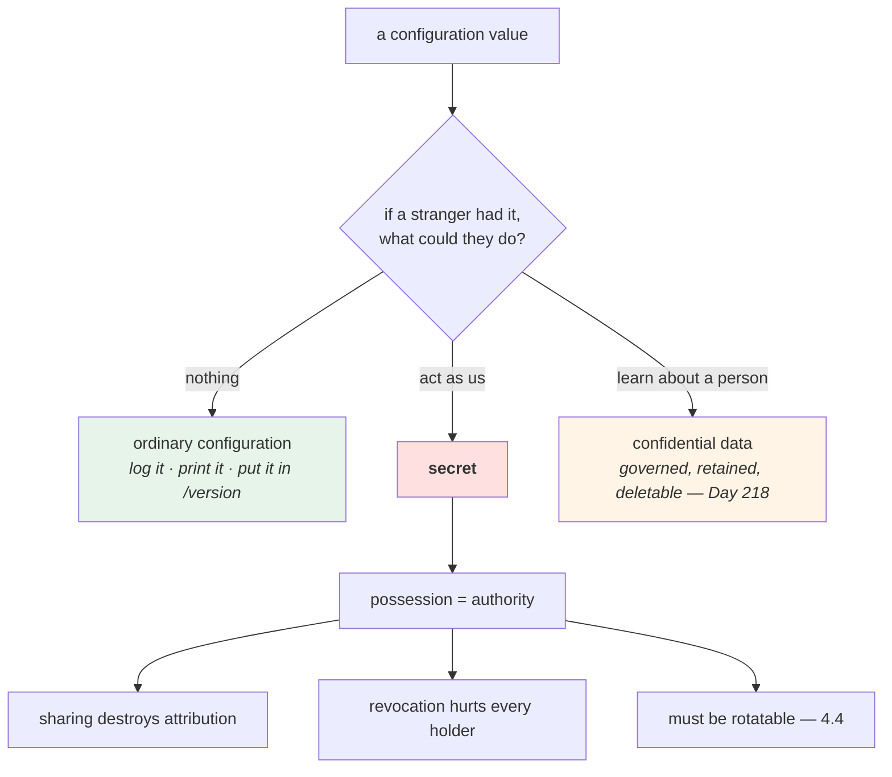

# 4.1 — What makes a secret a secret

## One-line answer

A secret is a piece of configuration where **possession is authority** — anyone holding the value can do what
it permits — which means sharing it destroys your ability to say *who* did something, and taking it back
costs everyone who legitimately held it.

---

## The story

🎬 **The scene.** A small charity with four staff and one bank card for the office account. Stamps, printer
paper, the occasional taxi.

The card lives in the top drawer. The PIN is on a sticky note underneath it, because the alternative is
phoning the manager every time somebody needs envelopes.

It works. For six years, it works.

😬 **The naive fix.** When they hire two part-timers, the obvious move is to tell them the PIN too. Six
people, one card, no friction.

💥 **Why it fails.** In March, four hundred pounds goes out in three transactions nobody recognises.

The trustees ask the only question that matters: **who?** And there is no answer. Not "we suspect someone" —
there is *no mechanism* by which the answer could exist. Six people knew it; two of them told a partner; one
wrote it in a notebook that was in a bag on a train. **Every one of those people is now, technically, a
suspect, and none of them can prove anything.**

Then the second cost lands. The card is cancelled. It takes eleven days to get a new one, during which
nobody can buy anything — **including the five people who did nothing wrong.**

💡 **The insight.** **A secret is not valuable because it is hidden. It is valuable because holding it *is*
permission.** Two consequences follow immediately and they are the whole subject: once several people hold
it, you cannot attribute an action to any of them; and taking it away hurts everyone who had it, not just
whoever leaked it.

---

## The idea in plain language

Section 1 established that configuration is anything that varies between deploys. **Some of that
configuration has a property the rest does not**, and the property is not "it is private" — plenty of
non-secret configuration is private, like an internal hostname.

The property is: **the value confers a capability on whoever holds it.**

A database password is not a fact about the database. It is a *key* to it. An API token is not information;
it is the right to spend somebody's quota. This is what people mean by a **bearer credential**: the bearer —
whoever is carrying it — is treated as authorised, with no further questions.

From that one property, everything else follows.

| Property | Why it follows | What it means for you |
| --- | --- | --- |
| **Possession is authority** | the system authenticates the value, not the person | a leaked value is a working credential until it is revoked |
| **Copying is undetectable** | reading a value leaves no trace | you can never know a secret is *still* secret |
| **Attribution is destroyed by sharing** | every action looks the same whoever took it | a shared credential means "who did this" is unanswerable |
| **Revocation has a blast radius** | invalidating it invalidates it for everyone | the fix for a leak hurts the innocent holders too |
| **It has a lifetime** | it can be replaced by a new one | so you had better be able to replace it — [4.4](4.4-a-secret-has-a-lifetime.md) |

The third and fourth rows are the ones that separate someone who has handled a real incident from someone who
has read about secrets. **The technical problem — the value got out — is usually the small half.** The
expensive half is that you cannot tell what was done with it, and that fixing it takes capability away from
people who need it.

### What is and is not a secret

The test is a question, and it is answerable in a few seconds: **"if a stranger had this value, what could
they do that they cannot do now?"**

If the answer is "nothing" — it is not a secret, however private it feels. If the answer is "read our
customer data" or "spend our quota" or "deploy code" — it is a secret, however boring it looks.

| Value | Secret? | Because |
| --- | --- | --- |
| a database password | **yes** | it is the key to the data |
| a model provider API key | **yes** | it spends somebody's quota and Addendum 01's budget |
| a webhook signing key | **yes** | it lets anyone forge a message you will trust |
| an internal hostname | no | knowing it grants nothing; reaching it is a network question (Day 39) |
| a port number | no | as above |
| a private key file | **yes** | Day 8 generated one and `.gitignore` covered it before it existed |
| a session cookie | **yes** | it *is* somebody's logged-in session |
| a customer's email address | **not a secret — but confidential** | it grants no capability; it is personal data, which has its own rules (Day 219) |
| the environment name | no | it is a label, and [3.4](../03-fail-fast/3.4-the-service-that-started-with-the-wrong-config.md) argues it should be very visible |

**The email row is the important distinction.** A secret and a confidential value are different things with
different handling. A secret must never appear in a log; personal data may appear in a log if that log is
governed, retained for a stated period and deletable on request. Confusing the two produces either a system
that logs credentials or one that cannot debug anything. Day 218's PII work is where the second category gets
its own rules; today is entirely about the first.

### The one that catches people out: a secret is not a name

`PULSE_MODEL_API_KEY` is not a secret. The **name** of a variable, the fact that a service uses a provider,
the length of the value, the fact that it exists — none of those are secret, and treating them as secret is
how you end up with a `.env.example` that documents nothing and an onboarding process that takes a week.

**The value is the secret. Everything about the shape of it is documentation**, and
[5.2](../05-pulse-configured/5.2-env-example-the-contract-with-a-stranger.md) is built on exactly that split.

---

## Why Kriya needs it

**Today** `pulse` gains its first field that must never be printed, and every mechanism in section 4 depends
on being able to say *which* fields those are.

**Day 8 already produced one** — the certificate authority private key generated in that day's lab
([Day 8, 4.3](../../../day-008-http-and-tls/parts/04-certificates-in-time/4.3-the-three-ways-a-certificate-is-rejected.md)).
It was covered by a `.gitignore` rule written on Day 0, before either the rule's target or the day existed.

**Day 17** stops a credential from being printed by a build, which requires knowing what one is.

**Day 35** splits configuration into a `ConfigMap` and a `Secret` — **two Kubernetes objects that exist
because this distinction exists**. If the split is arbitrary to you, that day is memorisation.

**Day 57** introduces a real secret store, and **Day 220** covers workload identity — the endgame, where a
service proves who it is instead of holding a bearer value at all.

**Day 126** brings the first credential with a live cost attached: an OpenRouter or Groq key on a free tier,
where a leaked key is somebody else's quota and Addendum 01's *"no card on file, ever"* rule meets reality.

**Day 199's MCP servers** are the sharpest version: a tool boundary where an agent holds credentials it can be
persuaded to use, which the plan names as part of the *lethal trifecta* (Day 215).

---

## The mechanism

There is no code to run that makes a value secret — that is the point, and it is worth demonstrating rather
than asserting. What there *is*, is a classification you perform and write down.

Start by looking at what a bearer credential actually is. Here is one, and watch how little it takes:

```python
# lab/bearer.py - what "possession is authority" means, in twenty lines.
from __future__ import annotations

import hmac
import secrets

# The server's side of the arrangement: a value it will accept, and nothing about who holds it.
ISSUED_TOKEN = secrets.token_urlsafe(32)


def authorise(presented: str) -> bool:
    """Accept anyone who presents the right value. That is the whole of bearer authentication."""
    return hmac.compare_digest(presented, ISSUED_TOKEN)


if __name__ == "__main__":
    print("token issued to the service :", ISSUED_TOKEN[:8] + "…")
    print("service presents it         :", authorise(ISSUED_TOKEN))
    print("a stranger presents a copy  :", authorise(ISSUED_TOKEN))
    print("a stranger guesses          :", authorise("not-the-token"))
```

**Line by line:**

- `secrets.token_urlsafe(32)` — the standard library's cryptographically secure random generator, **not**
  `random`, which is seeded predictably and is not designed to resist an attacker. Verified against
  `https://docs.python.org/3/library/secrets.html` on **2026-08-25**: the `secrets` module is *"used for
  generating cryptographically strong random numbers suitable for managing data such as passwords, account
  authentication, security tokens"*. `32` is the number of random **bytes**, which produces a longer
  URL-safe string.
- `hmac.compare_digest(a, b)` rather than `a == b` — a **constant-time** comparison. A plain `==` returns as
  soon as two characters differ, so the time it takes leaks how much of the value was correct, which is
  enough to recover a token one character at a time. Verified against
  `https://docs.python.org/3/library/hmac.html` on **2026-08-25**: it is documented as returning
  *"`a == b`… using an approach designed to prevent timing analysis"*. **This is the one line in this file
  that is genuinely security-critical.**
- `authorise(presented)` takes **only the value.** There is no second parameter, because there is nothing
  else to check. That absence is the entire lesson of this part.
- The two middle print lines call the identical function with the identical argument, and are labelled
  differently. **They are indistinguishable to the code, which is the demonstration**: the server cannot tell
  the service from a stranger holding a copy.
- `ISSUED_TOKEN[:8] + "…"` — even in a lab file that generated its own throwaway value, print a prefix rather
  than the whole thing. **The habit is the point**, and [4.3](4.3-redaction-that-actually-holds.md) makes it
  structural rather than a habit.

```text
token issued to the service : Kj3nX1qA…
service presents it         : True
a stranger presents a copy  : True
a stranger guesses          : False
```

**Two identical `True`s.** There is no third state where the system says *"that is the right value but you
are the wrong holder"*, because the system has no idea who is calling. Day 220's workload identity is the
answer to that, and it is 211 days away for a reason: it requires a platform.

### The classification, written down

The actual deliverable of this part is a table in the repository. Produce it for `pulse`:

```bash
cd "$(git rev-parse --show-toplevel)"
cat > days/day-009-configuration-and-secrets/lab/classification.md <<'EOF'
| Setting | Secret? | If a stranger had it, they could... | Blast radius | Rotation |
| --- | --- | --- | --- | --- |
| PULSE_ENVIRONMENT | no | nothing | — | — |
| PULSE_HOST | no | nothing | — | — |
| PULSE_PORT | no | nothing | — | — |
| PULSE_DOCS_ENABLED | no | nothing | — | — |
| PULSE_REQUEST_TIMEOUT | no | nothing | — | — |
| PULSE_MODEL_API_KEY | YES | spend our provider quota under our identity | the whole free-tier allowance; RPD exhausted for everyone | issue new, revoke old, restart deploys |
EOF
cat days/day-009-configuration-and-secrets/lab/classification.md
```

**Line by line:**

- `git rev-parse --show-toplevel` so the path is correct from any directory
  ([1.5](../01-configuration/1.5-dotenv-is-a-developer-convenience.md)).
- The heredoc is `<<'EOF'` — **quoted**, so the shell does not expand anything inside. A table containing
  `$` or backticks would otherwise be mangled before it reached the file.
- **The third column is the test**, phrased as the question from earlier. Filling it in is the work; the
  yes/no column is just the result.
- **Blast radius is a column, not a footnote** (Principle 13). For the one secret in the table it is
  concrete: Addendum 01's free tier is bounded by requests per day, so a stolen key does not cost money — it
  costs *availability*, and it costs it for you.
- **Rotation is a column** because a secret you cannot replace is a secret you cannot respond to
  ([4.4](4.4-a-secret-has-a-lifetime.md)). *"Unknown"* is a legitimate entry and an excellent thing to
  discover before an incident rather than during one.
- Five rows of `no` and one of `YES`. **That ratio is normal and it is the reason this classification is
  worth doing**: almost all configuration is not secret, so the handful that is can be given expensive
  treatment.

```text
| Setting | Secret? | If a stranger had it, they could... | Blast radius | Rotation |
| --- | --- | --- | --- | --- |
| PULSE_ENVIRONMENT | no | nothing | — | — |
...
| PULSE_MODEL_API_KEY | YES | spend our provider quota under our identity | the whole free-tier allowance; RPD exhausted for everyone | issue new, revoke old, restart deploys |
```



---

## When it breaks

**The question nobody can answer.** The incident that has no technical symptom:

```text
$ curl -sS -H "Authorization: Bearer $KEY" https://openrouter.ai/api/v1/auth/key
{"data":{"label":"kriya-dev","usage":184.2,"limit":null,"is_free_tier":true,
 "rate_limit":{"requests":10,"interval":"10s"}}}
```

**What it says:** the key is valid and has been used.
**What it actually means:** it has been used **184 times more than you expected**, and there is no field
anywhere in that response saying *by whom* or *from where*. A bearer credential's usage record is a single
number attributed to the credential, not to a holder.
**The smallest fix:** revoke and reissue — which is the only fix, and it is
[4.4](4.4-a-secret-has-a-lifetime.md)'s subject.
**Why the shape of this matters more than the numbers:** you cannot investigate your way to an answer here.
The information does not exist. **The only defence is to have issued a separate credential per holder in the
first place**, so that "which key" and "which holder" are the same question.

**The revocation that broke everyone.** The second cost:

```text
$ curl -sS -H "Authorization: Bearer $OLD_KEY" https://openrouter.ai/api/v1/chat/completions -d '{...}'
{"error":{"message":"No auth credentials found","code":401}}
```

**What it says:** the credential is gone.
**What it actually means:** it was revoked because of a leak, and **every legitimate user of it is now
broken**: your local development, the CI job, the two evaluation scripts, and a colleague's notebook. Each
one has to be updated separately, and each one is a place somebody might paste the *new* key insecurely
because they are in a hurry.
**The smallest fix:** distribute the new value through whatever mechanism you already have — which on Day 9 is
`.env` files and a lot of typing, and by Day 57 is a secret store.
**The lesson to take now:** **the cost of a rotation is proportional to how many places hold the value**,
which means the design decision that determines how bad your worst day will be is *how widely a credential is
shared*, and you make that decision long before the incident.

**The secret that was never a secret.** The classification failing in the other direction:

```text
$ cat .env.example
PULSE_DATABASE_URL=<ask the team>
PULSE_LOG_LEVEL=<ask the team>
PULSE_ENVIRONMENT=<ask the team>
```

**What it says:** three values you have to ask somebody for.
**What it actually means:** somebody decided that all configuration is sensitive. **Now a new person cannot
run the service without interrupting a colleague**, the example file documents nothing, and — the real cost —
**genuine secrets no longer stand out**, because everything is marked. A warning on everything is a warning
on nothing.
**The smallest fix:** apply the stranger test per value and write the honest answer.
**Why over-classification is a security failure and not merely an inconvenience:** the entire value of marking
something secret is that the mark is *rare*, so it is noticed.

**The personal data treated as a credential.** The confusion between the two categories:

```text
INFO  request completed path=/predict status=200 subject=<redacted> body=<redacted> user=<redacted>
```

**What it says:** everything redacted.
**What it actually means:** somebody applied secret-handling to personal data, and now the log cannot be used
to debug anything at all. **Personal data has different rules** — it may be logged if the log is governed,
retained for a stated period, access-controlled and deletable on request (Day 218, Day 219). A credential may
never be logged under any circumstances.
**The smallest fix:** redact the credential; retain the personal data under a policy, and write the policy
down.
**The distinction in one line:** *a secret is never logged; confidential data is logged carefully.*

---

## In production

**What a professional writes instead of the teaching version.** They do not classify secrets in a document
that ages — they classify them **in the type system**, so the compiler and the reviewer both see it
([4.3](4.3-redaction-that-actually-holds.md)'s `SecretStr`). The document survives as the *why*: which
credential exists, what it grants, what its blast radius is, and how it is rotated. That document has a name
in most organisations and it is usually the first artifact requested during any security review, including
Day 229's production readiness review.

**What degrades at scale.** Sharing. One credential shared by three deploys is a mild smell; the same
credential shared by thirty services is a system where no action can be attributed and no rotation can be
performed without a coordinated outage. The mature answer is **one credential per consumer** — per service,
per environment, per job — so that revocation is surgical and the audit log names something meaningful. That
multiplies the number of secrets, which is precisely why a secret store (Day 57) stops being optional at a
certain size: the thing that does not scale is not the secrecy, it is the *distribution*.

**The failure that only shows with real traffic.** A credential shared between a low-traffic and a
high-traffic consumer, hitting a rate limit. The provider's limit is per credential, so the busy consumer
exhausts it and the quiet one starts failing — **and the quiet one's owner has no way to see why**, because
the usage is attributed to the key, not to the caller. Addendum 01's free tiers make this concrete: a shared
key across a development laptop and an evaluation loop means the laptop stops working during evaluations, and
the symptom is a `429` in a place that did nothing wrong (Day 132).

**The review comment a senior engineer leaves.** *"This adds `PULSE_MODEL_API_KEY` to the settings as a plain
`str`. Make it `SecretStr` so it cannot be printed by accident, and add a row to the secrets table with what
it grants and how we rotate it. If the answer to 'how do we rotate it' is 'we have not thought about it',
that is the thing to fix before merging — not because it is likely to leak this week, but because the day it
does, we will be finding out what our rotation process is at three in the morning."*

**The signal you would alert on.** Not on the secret — you cannot observe a value being copied, and that is
the defining problem. What you *can* observe is **use**: requests per credential, per source, over time.
A credential being used from an unexpected source, or at an unexpected rate, or at an unexpected hour is the
only detection there is, and it exists only if credentials are per-consumer. Day 221's audit trail work is
where this is built. **A rate anomaly on a shared credential is unattributable and therefore not actionable**
— which is one more argument for not sharing them. You would page on *"a credential we believe is retired is
still being used"*, because that means a holder you do not know about.

**Blast radius.** This part generates a throwaway token in memory and writes a Markdown table. Nothing is
transmitted, nothing is stored, and the token in `bearer.py` is regenerated on every run and never persisted.
Worst case: the classification is wrong and something genuinely secret is marked `no` — which is exactly the
failure the third *When it breaks* case describes, and it is bounded by the review of the table rather than
by anything technical. Who can trigger it: you. What bounds it: `0` network calls, and the file lives under
`lab/`, which `.gitignore` excludes.

**Cost.** `0` model calls, `0` tokens, `0` CI minutes, `0` new packages, `0` network, negligible disk and RAM.
**Note the honest accounting**: the `curl` outputs in *When it breaks* are illustrative of a provider's
response shape and are not run today — Day 125 is where a provider is first contacted, and Addendum 01 has
rules about it.

**The interview question.** *"What makes something a secret?"* The answer that lands avoids the word "private"
entirely: *"That possession of the value is authority — the system authenticates the value, not the holder, so
anyone with a copy is indistinguishable from the legitimate user. Two things follow, and they are the ones
that actually hurt in an incident. First, once several people or systems hold the same credential, 'who did
this' becomes unanswerable, because the usage record attributes to the credential rather than the holder.
Second, revoking it takes capability away from everyone who had it, so the cost of responding is proportional
to how widely it was shared — which means the decision that determines how bad the incident is gets made
months earlier, when you decide whether to issue one credential or one per consumer. The test I apply is:
if a stranger had this value, what could they do that they cannot do now? If the answer is 'nothing', it is
not a secret however private it feels."*

---

## Check yourself

```bash
cd days/day-009-configuration-and-secrets/lab
uv run python bearer.py
cat classification.md
```

Two identical `True`s from two differently-labelled callers, and a table where five rows say `no`.

**Say out loud, without scrolling up:** *Give the one-sentence test for whether a value is a secret, then name
the two consequences of sharing one that have nothing to do with the value being read — and say why a
customer's email address is not a secret.*
