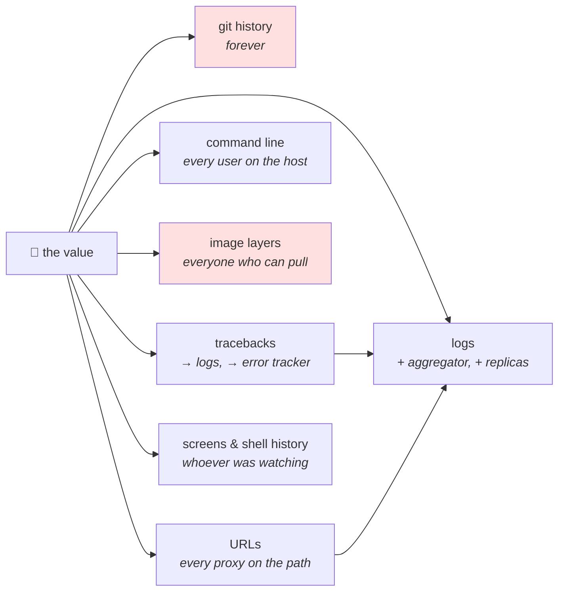

# 4.2 — The seven places a secret leaks

## One-line answer

A credential almost never escapes by being stolen — it escapes because it was **written down somewhere
ordinary**: a commit, a log line, a traceback, a command line, an image layer, a URL, or a terminal that was
being shared.

---

## The story

🎬 **The scene.** A locksmith's shop, and a customer who wants to know how burglars actually get in.

The locksmith says: not through the lock. In eleven years he has replaced four locks that were picked and
several hundred that were not — because the key was under the mat, or on the ledge above the door, or with
the neighbour, or on a fob with the address written on the back, or because a window was left open.

😬 **The naive fix.** The customer buys a better lock. Then a better one. Then an alarm.

💥 **Why it fails.** All of it protects the one path nobody used. **The key still lives under the mat**,
because it has to live somewhere and nobody ever made a decision about where — it just accumulated there, one
convenient afternoon at a time.

And the honest, uncomfortable part: none of the places the key ended up were *mistakes* at the moment they
happened. Giving a spare to the neighbour was sensible. Writing the address on the fob was sensible after the
first time it was lost. **Each step was a small local improvement that widened the exposure by one.**

💡 **The insight.** **Enumerate the places, not the attacks.** You cannot predict how somebody will come at
you, and you do not need to — you can list every place the value currently exists and make that list shorter.
The list is finite, boring, and almost always longer than you expect.

---

## The idea in plain language

Here is the list. It is not exhaustive in the universe, but it is nearly exhaustive in practice, and
everything in section 4 and section 5 is a countermeasure to one of these.

| # | Leak path | Why it happens | Who can read it |
| --- | --- | --- | --- |
| 1 | **Version control** | `.env` committed, a value pasted into a config file, a fixture in a test | everyone with a clone, forever |
| 2 | **Logs** | a settings object printed, a request body logged, an error logged with context | everyone with log access, for the retention period |
| 3 | **Tracebacks and error reports** | the value is inside an exception message or a local variable | whoever reads the error, plus the error-tracking service |
| 4 | **The process and its command line** | passed as `--api-key=…`, or readable in the environment | anyone who can run `ps` or `kubectl describe` on that host |
| 5 | **Images and build artifacts** | `COPY . .`, a build argument, a cached layer | anyone who can pull the image |
| 6 | **Outbound requests** | a key in a URL query string; a `Referer`; a copied `curl` | every proxy, gateway and access log on the path |
| 7 | **Terminals and shared screens** | shell history, a screenshot, a screen share, a CI job log | whoever was in the meeting; whoever can read the pipeline |

Two things are worth noticing about the shape of that list before any of the detail.

**None of them is an attack.** Every row is a normal, useful mechanism doing exactly its job. Git remembers.
Logs record. Tracebacks report context. `ps` shows what is running. Images package what you gave them. **This
is why secrets leak so reliably: the leak paths are the features.**

**They differ enormously in how long the exposure lasts.** A traceback in a terminal is gone when the window
closes. A commit is in every clone that has ever existed. Ranking the rows by *duration* rather than by
*likelihood* is what tells you where to spend effort:

```text
seconds      a terminal that nobody screenshotted
hours        an ephemeral CI job log
days-weeks   an application log, until retention expires
months       an error-tracking service's stored events
forever      git history · a pushed image layer · a backup
```

**The bottom three rows are the ones that cannot be undone**, which is why paths 1 and 5 get the most
attention in this curriculum, and why the response to any of them is *rotate*, never *delete*.

---

## Why Kriya needs it

**[5.3](../05-pulse-configured/5.3-the-secret-that-reached-the-log.md) is today's deliberate failure**, and
it is path 2 — the one people are most confident they would never do.

**Day 11** proves path 1 is irreversible: git history is append-only, and deleting a file does not remove it
from the commits that contain it
([Day 11, 5.2](../../../day-011-version-control-for-operators/parts/05-repo-as-memory/5.2-the-secret-that-reached-history.md)).

**Day 17** builds the gate for path 1 in CI, and **Day 23** builds the `.dockerignore` for path 5.

**Day 30** scans images, which is path 5's detection rather than its prevention.

**Day 67** designs structured logging, where the choice of what goes into a field is path 2's prevention —
and **Day 68's log pipeline** is where a leaked value stops being a local problem and becomes an indexed,
searchable, replicated one.

**Day 126** is when `pulse` first holds a credential worth any of this, and **Day 132** covers the provider
error responses that quote your request back at you — path 3 in its most surprising form.

**Day 215's lethal trifecta** is this list with an agent in the middle: a system that can read secrets, act on
untrusted input, and communicate externally has *combined* several of these paths into one.

---

## The mechanism

Four of the seven can be produced right now, on this machine, in a few commands each. Do them, because the
gap between "I know that" and "I have watched my own key appear in a log line" is the entire difference in
how carefully you will handle the next one.

**Use a marker value, not a real credential.** Everything below uses a string that is obviously fake and
easily searched for:

```bash
cd days/day-009-configuration-and-secrets/lab
FAKE='LEAKDEMO-not-a-real-credential-0001'
echo "marker: $FAKE"
```

**Line by line:**

- The value contains the words `not-a-real-credential`, so anyone who finds it later — in a log, in a
  history, in a screenshot of this exercise — can tell instantly that it is harmless. **Never use a
  realistic-looking fake**, for the reason [1.5](../01-configuration/1.5-dotenv-is-a-developer-convenience.md)
  gave: realistic fakes get copied into real places.
- The `LEAKDEMO-` prefix makes it greppable, which matters because the last step of this part is finding every
  copy and deleting it.
- It is a **shell variable, not exported**, so it is not inherited by anything you did not explicitly pass it
  to ([1.2](../01-configuration/1.2-the-environment-is-the-interface.md)).

### Path 6 and path 2 together — the URL, and the access log

The most instructive one, because a single mistake produces two leaks in two systems:

```python
# lab/leaky.py - a service that logs what it receives, like every service on earth.
from __future__ import annotations

import logging
import sys

from fastapi import FastAPI, Request

logging.basicConfig(level=logging.INFO, format="%(levelname)s %(message)s", stream=sys.stdout)
log = logging.getLogger("pulse")

app = FastAPI(title="leaky")


@app.get("/predict")
def predict(request: Request) -> dict[str, str]:
    log.info("request received url=%s", request.url)
    return {"priority": "unknown"}
```

**Line by line:**

- `request: Request` — FastAPI injects the raw request object when you annotate a parameter with it. This is
  the standard way to reach headers, the client address and the full URL.
- `log.info("request received url=%s", request.url)` — **this line is the bug**, and it is written the way
  a careful person writes it: `%s` placeholders, a named field, a sensible level. There is nothing sloppy
  about it. It logs the URL because logging the URL is useful, and the URL is where somebody put a key.
- The handler returns immediately; nothing else in the file matters.

```bash
cd days/day-009-configuration-and-secrets/lab
FAKE='LEAKDEMO-not-a-real-credential-0001'
uv run uvicorn leaky:app --host 127.0.0.1 --port 8015 > /tmp/leaky.log 2>&1 &
sleep 4
curl -sS -o /dev/null "http://127.0.0.1:8015/predict?api_key=$FAKE"
sleep 1
grep -n 'LEAKDEMO' /tmp/leaky.log
pkill -f 'leaky:app'
```

**Line by line:**

- `curl ... "?api_key=$FAKE"` — a credential in a query string. **This is not a strawman**: plenty of real
  APIs accept keys this way, and plenty of quick scripts pass them this way because it is one fewer flag than
  a header.
- `-o /dev/null` because the response body is irrelevant; the leak is elsewhere.
- `grep -n 'LEAKDEMO'` on the **server's** log — the client did nothing wrong that the client can see.

```text
2:INFO:     Started server process [31882]
6:INFO request received url=http://127.0.0.1:8015/predict?api_key=LEAKDEMO-not-a-real-credential-0001
7:INFO:     127.0.0.1:56612 - "GET /predict?api_key=LEAKDEMO-not-a-real-credential-0001 HTTP/1.1" 200 OK
```

**Two lines, not one.** Line 6 is the application log — your code, your decision. **Line 7 is uvicorn's
access log, which you did not write and did not opt into**, and it would have recorded the key even if
`leaky.py` logged nothing at all.

That second line is the point. In a real deployment that same URL is also recorded by the load balancer, the
ingress controller (Day 37), the service mesh if there is one, and any proxy in between — **each with its own
retention and its own access controls**. One key in one query string becomes five copies in five systems, and
you own the deletion policy for none of them.

**The rule that follows:** a credential goes in a **header**, never in a URL. Headers are not logged by
default; URLs always are.

### Path 4 — the command line

```bash
cd days/day-009-configuration-and-secrets/lab
FAKE='LEAKDEMO-not-a-real-credential-0001'
uv run python -c "import time; time.sleep(20)" --api-key="$FAKE" &
sleep 2
ps -ef | grep -i 'LEAKDEMO' | grep -v grep \
  || powershell -NoProfile -Command "Get-CimInstance Win32_Process | Where-Object CommandLine -like '*LEAKDEMO*' | Select-Object -ExpandProperty CommandLine" \
  || echo "(neither ps nor PowerShell showed it here - see the note)"
pkill -f 'LEAKDEMO' 2>/dev/null
```

**Line by line:**

- `--api-key="$FAKE"` passed as an **argument**, which is how a great many command-line tools accept
  credentials.
- `ps -ef` — every process on the machine, with its full command line. **`ps` output is readable by any user
  on most systems**, which is the entire problem: a credential in `argv` is visible to every other user and
  every other process on that host, not only to the owner.
- The PowerShell fallback exists because Git Bash's `ps` is a thin shim and does not show full command lines
  ([1.2](../01-configuration/1.2-the-environment-is-the-interface.md) hit the same limitation with `/proc`).
  **Say the limitation rather than letting the reader believe the leak did not happen.**
- `pkill -f 'LEAKDEMO'` — `-f` matches the full command line, which is only possible *because* the command
  line is world-visible. **The command that cleans up is itself a demonstration of the leak.**

```text
you  31904  31877  0 14:22 pts/0  00:00:00 python -c import time; time.sleep(20) --api-key=LEAKDEMO-not-a-real-credential-0001
```

**The environment variable version of the same thing is strictly better**, and this is the reason
[1.2](../01-configuration/1.2-the-environment-is-the-interface.md) called the environment *the* interface: a
process's environment is readable only by its owner and root, whereas its command line is readable by
everyone. Neither is a vault — [4.5](4.5-the-environment-variable-is-not-a-vault.md) is honest about that —
but one is much worse than the other.

### Path 1 — version control

```bash
cd "$(git rev-parse --show-toplevel)"
git log --all -S 'LEAKDEMO' --oneline || echo "(no commit has ever introduced this string)"
git grep -n 'LEAKDEMO' $(git rev-list --all) 2>/dev/null | head -3 || echo "(not present in any tree)"
git status --short | head
```

**Line by line:**

- `git log -S '<string>'` — the **pickaxe**. It finds commits where the *number of occurrences* of a string
  changed, which means it finds the commit that introduced a value even if the file was later deleted. Day 11
  covers it properly ([Day 11, 3.2](../../../day-011-version-control-for-operators/parts/03-reading-history/3.2-finding-the-change-that-introduced-a-line.md));
  today it is the audit tool.
- `--all` — every branch and every tag, not just the current one. **A credential on an abandoned branch is
  still in the repository**, which is one of the most commonly missed facts about this leak path.
- `git grep -n <pattern> $(git rev-list --all)` — search the *contents* of every commit rather than commit
  diffs. Slower, and it catches a value that was present from the very first commit, which the pickaxe's
  "number of occurrences changed" heuristic can miss.
- `git status --short` last — the check that the marker has not become an uncommitted file you are about to
  add.

```text
(no commit has ever introduced this string)
(not present in any tree)
```

**Two clean results, and they are the result you want** — because everything this part wrote lives under
`days/*/lab/`, which `.gitignore` excluded on Day 0. **Run these commands now, while the answer is empty, so
you know what clean looks like.**

### Path 3 — the traceback

```python
# lab/traceback_leak.py - the value is in the exception, not in your log statement.
from __future__ import annotations

import os


def call_provider(url: str) -> None:
    raise ConnectionError(f"failed to reach provider at {url}")


if __name__ == "__main__":
    key = os.environ.get("PULSE_MODEL_API_KEY", "unset")
    call_provider(f"https://api.example.test/v1/chat?key={key}")
```

**Line by line:**

- The exception message contains the URL, which contains the key. **Nobody logged the key.** The author of
  `call_provider` put the URL in the message because an error that does not say *what it was trying to reach*
  is useless — which is correct, and is how this happens.
- `os.environ.get(..., "unset")` so the file runs even without the variable, and the output is honest about
  it.
- This is a two-line reproduction of a real and common shape: a client library raising with the request URL,
  a database driver raising with the connection string, a validation error quoting its input
  ([3.1](../03-fail-fast/3.1-fail-fast-the-crash-that-saves-the-night.md)'s last failure).

```bash
cd days/day-009-configuration-and-secrets/lab
PULSE_MODEL_API_KEY='LEAKDEMO-not-a-real-credential-0001' uv run python traceback_leak.py
```

**Line by line:**

- The variable is supplied inline, so it does not survive the command
  ([1.2](../01-configuration/1.2-the-environment-is-the-interface.md)).
- No redirection: the traceback goes to standard error, where a supervisor captures it into exactly the log
  system this part is warning about.

```text
Traceback (most recent call last):
  File "traceback_leak.py", line 13, in <module>
    call_provider(f"https://api.example.test/v1/chat?key={key}")
  File "traceback_leak.py", line 8, in call_provider
    raise ConnectionError(f"failed to reach provider at {url}")
ConnectionError: failed to reach provider at https://api.example.test/v1/chat?key=LEAKDEMO-not-a-real-credential-0001
```

**And in a real deployment that traceback is now in the application log, in the log aggregator, and — if
there is an error-tracking service — in a third party's database with its own retention.** Path 3 feeds path
2 feeds somebody else's storage.



**Note the two arrows that converge on `logs`.** Paths 3 and 6 do not need you to log the secret; they arrange
for something else to.

### Clean up, and prove it

```bash
cd "$(git rev-parse --show-toplevel)"
rm -f /tmp/leaky.log
grep -rl 'LEAKDEMO' days/day-009-configuration-and-secrets/lab /tmp 2>/dev/null || echo "no file holds the marker"
history 2>/dev/null | grep -c 'LEAKDEMO' || echo "shell history not available in this shell"
git log --all -S 'LEAKDEMO' --oneline || echo "history clean"
```

**Line by line:**

- `grep -rl` — list **files** containing the marker, not the matching lines. You want the addresses, not the
  content.
- The `history | grep -c` line is path 7, and it is the one people forget. Your shell wrote every command in
  this part to a history file, including the one that set the marker. **On a real incident this is a place to
  check and usually a place to clean.**
- The final `git log -S` is the check that matters most, because it is the only one on the list that cannot
  be undone.

---

## When it breaks

**The scan that found it after the push.** Path 1, detected too late:

```text
remote: error: GH013: Repository rule violations found for refs/heads/main.
remote:
remote: - GITHUB PUSH PROTECTION
remote:   —————————————————————————————————————————
remote:     Push cannot contain secrets
remote:      —— OpenAI API Key ————————————————————
remote:      locations:
remote:        - commit: 7f21ba4c9e2d1a3b5c8f0e4d6a2b9c1f3e5d7a8b
remote:          path: pulse/client.py:14
```

**What it says:** the push was refused because a commit contains a key.
**What it actually means:** you got lucky. **The commit already exists locally**, and if the same value is on
any other machine, or was ever pushed to any other remote, the exposure is already real. Push protection is a
last line, not a defence.
**The smallest fix:** rotate the credential. Then, separately and less urgently, decide what to do about the
history.
**The order matters and people get it backwards:** the instinct is to fix the history first because it feels
like the problem. It is not — **the credential is the problem, and it is live until it is revoked.**

**The log line everyone can read.** Path 2, at scale:

```text
$ kubectl logs deploy/pulse --tail=1
INFO settings loaded environment=prod port=8000 model_api_key=sk-or-v1-3f9a2c8e1b7d4a6f0c5e2b8d9a1f3c7e
```

**What it says:** the service logged what it was configured with — the practice
[2.1](../02-typed-settings/2.1-hand-rolling-the-settings-object.md) recommended.
**What it actually means:** the recommendation had one exception and this line is it. That log has already
been shipped to an aggregator, indexed, replicated and retained. **You cannot delete it from all of them, and
the ones you can delete from will have a copy in a backup.**
**The smallest fix:** rotate. Then make it structurally impossible with `SecretStr`
([4.3](4.3-redaction-that-actually-holds.md)).
**Why this is today's deliberate failure:** because *"log your configuration at startup"* is genuinely good
advice, and the single most likely way a competent engineer leaks a credential is by following it.

**The image that carried it.** Path 5, with no fix after the fact:

```text
$ docker history pulse:0.1.0 --no-trunc | grep -i 'ARG\|ENV'
<missing>  4 days ago  ENV PULSE_MODEL_API_KEY=sk-or-v1-3f9a2c8e1b7d4a6f0c5e2b8d9a1f3c7e
```

**What it says:** the key is baked into the image metadata.
**What it actually means:** **anyone who can pull the image can read it without even running it** — `docker
history` and `docker inspect` show it. A later `ENV PULSE_MODEL_API_KEY=` does not remove it, because layers
are immutable and the earlier one is still in the image.
**The smallest fix:** rotate, rebuild without it, and delete the tag — knowing that anybody who pulled it
already has it.
**Why it is so common:** it looks like configuration-as-code, which is a good pattern. Day 23 and Day 24 are
where the right shape is built: values at run time, never at build time.

**The screen share.** Path 7, the one with no technology in it:

```text
$ printenv | grep API
PULSE_MODEL_API_KEY=sk-or-v1-3f9a2c8e1b7d4a6f0c5e2b8d9a1f3c7e
```

...typed during a debugging session with four people watching and a recording running.

**What it says:** the variable is set.
**What it actually means:** the value is now in a video file, in whatever meeting platform stores it, for
whatever retention that platform has, viewable by anyone with the link.
**The smallest fix:** never print a whole credential. `printenv | grep -c API` answers *"is it set"* without
showing it, and `${VAR:0:6}` shows a prefix if you need to check *which* key.
**Why this belongs on the list with the technical paths:** it is one of the two or three most frequent real
causes, and no scanner, gate or type system prevents it.

---

## In production

**What a professional writes instead of the teaching version.** They shrink the list rather than defending
each entry. A credential that is never in the environment cannot leak from the environment; one that is
fetched from a store at startup and held only in memory removes paths 1, 4, 5 and most of 7 at once (Day 57).
And they instrument the two paths that cannot be closed: a **secret scanner on every push** (path 1, Day 17)
and a **redaction filter in the logging pipeline** (path 2, Day 68) — belt and braces, because the type-level
protection in [4.3](4.3-redaction-that-actually-holds.md) protects the values you remembered to type
correctly, and the pipeline filter catches the ones you did not.

**What degrades at scale.** Copies. Every one of these paths is a *copy*, and copies multiply with the number
of systems that touch a request. One log line becomes one line in the pod's stdout, one in the node's log
file, one in the aggregator, one in its replica, one in the search index, one in the daily backup — **six
copies with six different deletion procedures, of which you control perhaps two**. This is why the response to
a leak is always rotation and never deletion: at scale, deletion is not a thing you can actually do.

**The failure that only shows with real traffic.** A leak that is rate-dependent. Under normal load an error
path never runs; under load a timeout fires, the retry logic logs the failing request for diagnosis, and the
request contains an `Authorization` header that the log formatter was never taught to redact. **The leak
happens for the first time during the incident**, when logging is most verbose, most people are reading it,
and the log is being pasted into a chat channel. Day 68's redaction belongs in the pipeline for exactly this
reason: the code path that leaks is the one nobody tested.

**The review comment a senior engineer leaves.** *"The client puts the key in the query string. Move it to an
`Authorization` header — the URL is logged by uvicorn, by the ingress, and by every proxy between us and them,
and none of those retention policies are ours. Also, `log.info('calling %s', url)` needs to log the path only,
not the full URL, for the same reason."*

**The signal you would alert on.** Two, and both are detection rather than prevention: **a secret scanner
finding a match in a push** (a gate, not a page — the push is refused), and **a credential being used from an
unexpected source or at an unexpected rate** ([4.1](4.1-what-makes-a-secret-a-secret.md)'s only real
detection, Day 221). There is a third that is worth building and rarely is: **a canary credential** — a
credential that is valid, deliberately placed where a real one would be, and used by nothing. Any use of it is
an unambiguous signal that somebody has been reading places they should not. It has no false positives, which
makes it one of the very few security signals worth paging on.

**Blast radius.** This part deliberately writes a marker string into a log file, a process command line, a
traceback and a shell history, and starts a server on port 8015 bound to loopback. **Worst case if the marker
were a real credential: it is now in four places you would have to clean and one (`history`) you might
forget.** That is precisely the exercise. What bounds it: the value is a string containing the words
*not-a-real-credential*, it grants nothing anywhere, every file it touches is under `lab/` or `/tmp`, and the
part ends with a `grep -rl` sweep proving where it went. Who can trigger it: you. **Do not substitute a real
key into any command in this part**, and note that the instruction is necessary — the part is more convincing
with a real one, and that is exactly the reasoning that causes the incident.

**Cost.** `0` model calls, `0` tokens, `0` CI minutes, `0` new packages. Network: loopback only. RAM: one
uvicorn process, roughly 60 MB, briefly. Disk: two small files in `/tmp`, deleted at the end.

**The interview question.** *"How do secrets actually leak?"* The answer that shows you have looked rather
than theorised: *"Almost never through an attack on the secret itself — through ordinary mechanisms doing their
job. The list I work through is: version control, logs, tracebacks, the process command line, image layers,
URLs, and screens or shell history. What I find useful is ranking them by how long the exposure lasts rather
than by how likely they are, because that tells you where to spend effort: a traceback in a terminal is gone
in a minute, a commit and a pushed image layer are permanent. And the one that catches good engineers is
logging the resolved configuration at startup, which is a genuinely good practice with exactly one exception
in it. That is why I want secrets to be a distinct type rather than a naming convention — so the redaction is
structural instead of something somebody has to remember at the moment they are writing a helpful log line."*

---

## Check yourself

```bash
cd days/day-009-configuration-and-secrets/lab
FAKE='LEAKDEMO-not-a-real-credential-0001'
PULSE_MODEL_API_KEY="$FAKE" uv run python traceback_leak.py 2>&1 | tail -1
cd "$(git rev-parse --show-toplevel)" && git log --all -S 'LEAKDEMO' --oneline || echo "history clean"
```

A traceback containing a value nobody logged, and a git history that is clean **because of a rule written on
Day 0**.

**Say out loud, without scrolling up:** *Name five of the seven leak paths, say which two produce an exposure
that cannot be undone, and explain why putting a key in a URL query string leaks it into systems you do not
own.*
