# 4.4 — A secret has a lifetime

## One-line answer

Every credential will one day have to be replaced — because it leaked, because someone left, or because
policy says so — and the only thing that decides whether that is a routine change or an outage is whether the
issuer and the holders can both accept **two valid values at once** for a while.

---

## The story

🎬 **The scene.** A block of flats changing the front-door code.

The management company sends a letter: *from Monday the code is 4471.* Simple, correct, and posted on
Thursday.

😬 **The naive fix.** On Monday morning the locksmith changes it. One code out, one code in, at nine o'clock.

💥 **Why it fails.** The letters went to the *registered* residents. Not to the two flats that sublet, not to
the carer who visits number 14 on Mondays, not to the delivery firm, not to the window cleaner, and not to
the resident who was away and whose post is in a pile.

At nine o'clock a working system becomes a broken one **for everyone who was not on a list nobody had checked
in three years.** The phone lines jam. Somebody props the door open with a fire extinguisher, which is far
worse than the old code being slightly over-shared. And the caretaker, under pressure, tells the code to the
next four people who ask without checking who they are.

💡 **The insight.** **The hard part of changing a credential is never generating the new one. It is knowing
who holds the old one, and giving them a window in which both work.** A changeover with no overlap converts an
unknown list of holders into an unknown number of simultaneous failures — and the improvised workarounds are
usually worse than the thing you were fixing.

---

## The idea in plain language

A credential is not a constant. It has a life:

```text
issued  →  distributed  →  in use  →  superseded  →  revoked  →  dead
                                   └── the overlap window ──┘
```

**Rotation** is moving a credential through that whole cycle deliberately, on your schedule.
**Revocation** is killing it, immediately, because something went wrong. They use the same machinery and they
have opposite constraints:

| | Rotation | Revocation |
| --- | --- | --- |
| Why | policy, staff change, hygiene | a leak — [4.2](4.2-the-seven-places-a-secret-leaks.md) |
| When | when you choose | now |
| Overlap | yes, deliberately | **no — the whole point is that the old one stops working** |
| Cost of getting it wrong | a scheduled change becomes an outage | you keep an exposed credential alive |

**The relationship between them is the reason rotation matters even when nothing has leaked**: revocation is
rotation with the overlap removed and the clock running. If you have never done the easy version, you will be
doing the hard version for the first time during an incident.

### The overlap window is what makes it safe

For a changeover to be safe, there has to be a period when **both** the old and the new credential are valid.
That requires two things, and both of them are decisions you make long before you need them:

**The issuer must support two live credentials.** Most do — most providers let you create a second API key
before deleting the first. Some do not, and finding out during an incident is unpleasant. **This is a
question to answer on the day you first create the credential**, which is why
[4.1](4.1-what-makes-a-secret-a-secret.md)'s classification table has a `Rotation` column.

**The holders must be updatable independently.** If six deploys hold the value and you can only update them
all at once, you do not have an overlap — you have a synchronised cutover with a different name.

Given both, the procedure is boring, which is the goal:

1. create the new credential; **both are now valid**;
2. update holders one at a time, verifying each;
3. confirm the old one has no remaining traffic;
4. revoke the old one;
5. confirm nothing broke.

**Step 3 is the one people skip and the one that makes the procedure safe.** It is the difference between
"I think everything is updated" and "nothing has used the old key for a day".

### Why you rotate on a schedule even with no leak

Three reasons, and only the first is the one people give:

- **Limiting exposure duration.** A credential that has been live for four years has been in four years of
  logs, backups, laptops and leavers' machines.
- **Proving the procedure works.** A rotation you have never performed is a *plan*, not a procedure.
  Everything in this curriculum's SRE half rests on the same idea — Day 19's rehearsed rollback, Day 84's
  incident drills, Day 8's certificate renewal
  ([Day 8, 4.2](../../../day-008-http-and-tls/parts/04-certificates-in-time/4.2-renewal-and-the-automation-that-must-not-fail.md)).
- **Discovering the holders.** Every rotation finds a consumer nobody knew about — the script on somebody's
  laptop, the old CI job, the notebook. **You find it because it breaks**, which is exactly why you want the
  overlap window: it breaks in a way you can see and fix rather than at three in the morning.

---

## Why Kriya needs it

**Day 8 already taught the shape** for a different credential: a certificate has an expiry date, renewal is
automated, and the renewal that "succeeded" while the server kept serving the old file is the classic failure
([Day 8, 4.2](../../../day-008-http-and-tls/parts/04-certificates-in-time/4.2-renewal-and-the-automation-that-must-not-fail.md)).
**A certificate is a credential with the lifetime made explicit**, and everything here is that lesson without
the convenience of a printed date.

**[5.3](../05-pulse-configured/5.3-the-secret-that-reached-the-log.md)** leaks a credential on purpose today,
and the correct response to it is a rotation. Without this part the drill has no ending.

**Day 17** puts credentials in CI, which multiplies the number of holders.

**Day 41's rolling update** is the mechanism that makes step 2 — updating holders one at a time — possible at
all, and it is why a rotation and a deployment are the same operation in a modern system.

**Day 57** automates it with a secret store; **Day 220's workload identity** removes the problem by removing
the long-lived credential entirely — short-lived tokens issued per workload, rotated by construction.

**Day 126** creates the credential this part is about, and **Addendum 01** constrains it: the free tiers this
curriculum uses issue keys through a console, which means **rotation is a manual step and you should know
that before you need it.**

---

## The mechanism

Build the smallest honest model of a credentialled dependency and perform a rotation both ways — without an
overlap, and with one — counting the failures.

```python
# lab/provider.py - a stand-in for a provider: accepts a SET of valid keys.
from __future__ import annotations

import os

from fastapi import FastAPI, Header, HTTPException

app = FastAPI(title="stand-in-provider")


def valid_keys() -> set[str]:
    """The issuer's view: which credentials are live right now."""
    raw = os.environ.get("PROVIDER_VALID_KEYS", "")
    return {key.strip() for key in raw.split(",") if key.strip()}


@app.get("/v1/answer")
def answer(authorization: str = Header(default="")) -> dict[str, str]:
    presented = authorization.removeprefix("Bearer ").strip()
    if presented not in valid_keys():
        raise HTTPException(status_code=401, detail="invalid credential")
    return {"answer": "ok", "key_suffix": presented[-4:]}
```

**Line by line:**

- `valid_keys()` returns a **set**, read fresh on every request. That is the issuer's side of the overlap
  window: *"these are the credentials that work right now"*, and it can hold two. A provider that could hold
  only one would make everything below impossible, which is the point of modelling it explicitly.
- `os.environ.get(...)` **inside** the function — normally an anti-pattern
  ([2.4](../02-typed-settings/2.4-the-settings-object-read-at-import-time.md)), and correct here, because
  this process is standing in for a *remote* system whose state changes independently of your process. **The
  exception proves the rule: it is right because this value genuinely is not this process's configuration.**
- `authorization: str = Header(default="")` — FastAPI maps the parameter to the `Authorization` header. Note
  the credential is in a **header, not a query string** — [4.2](4.2-the-seven-places-a-secret-leaks.md)'s path
  6, avoided by construction.
- `.removeprefix("Bearer ")` — available since Python 3.9 and clearer than slicing by a magic number; if the
  prefix is absent it returns the string unchanged, so a malformed header fails the membership test rather
  than raising.
- `HTTPException(status_code=401, ...)` — `401 Unauthorized` means *"I do not accept this credential"*, which
  is the correct code and not `403` (*"I know who you are and you may not"*)
  ([Day 8, 1.3](../../../day-008-http-and-tls/parts/01-the-message/1.3-the-status-codes-an-operator-reads.md)).
- `presented[-4:]` in the response — the last four characters, so the drill can see *which* key was accepted
  without ever printing one. **A suffix is the standard way to identify a credential in a user interface**, and
  it is what you will read in a provider's console.

```python
# lab/caller.py - a client that reads its credential once, at startup (1.2, 2.4).
from __future__ import annotations

import os
import sys
import time

import httpx2

KEY = os.environ.get("PULSE_MODEL_API_KEY", "")
URL = "http://127.0.0.1:8016/v1/answer"


def main(seconds: int) -> None:
    ok = bad = 0
    deadline = time.monotonic() + seconds
    with httpx2.Client(timeout=2.0) as client:
        while time.monotonic() < deadline:
            try:
                response = client.get(URL, headers={"Authorization": f"Bearer {KEY}"})
                if response.status_code == 200:
                    ok += 1
                else:
                    bad += 1
            except httpx2.HTTPError:
                bad += 1
            time.sleep(0.2)
    print(f"ok={ok} failed={bad} key_suffix={KEY[-4:]}")


if __name__ == "__main__":
    main(int(sys.argv[1]))
```

**Line by line:**

- `KEY = os.environ.get(...)` at module scope — **read once**, which is the correct behaviour for a client's
  own configuration and is exactly what makes rotation require a restart
  ([1.2](../01-configuration/1.2-the-environment-is-the-interface.md)). The whole drill depends on this being
  true, because it is true of every real service.
- `httpx2.Client` in a `with` block — one client, one connection pool, reused across requests
  ([Day 8, 2.1](../../../day-008-http-and-tls/parts/02-the-connection/2.1-keep-alive-and-the-connection-you-reuse.md)).
  Creating a client per request would make the drill measure connection setup instead of authorisation.
- `timeout=2.0` — bounded, per Day 7. A drill that can hang is a drill that will.
- `time.monotonic()` rather than `time.time()` — monotonic is immune to the system clock being adjusted, which
  is the correct choice for measuring an interval. Verified against
  `https://docs.python.org/3/library/time.html` on **2026-08-25**: *"the reference point of the returned value
  is undefined, so that only the difference between the results of two calls is valid."*
- `except httpx2.HTTPError` — the base class for connection and timeout errors in that library, so a refused
  connection counts as a failure rather than crashing the drill. **Specific, not `except Exception`.**
- `time.sleep(0.2)` — five requests a second, enough to make a gap visible and light enough not to matter.
- `KEY[-4:]` in the summary, never the key.

Now the drill:

```bash
# lab/rotate_drill.sh - rotation without an overlap, then with one.
set -u
PORT=8016
OLD='LEAKDEMO-old-key-not-real-aaaa'
NEW='LEAKDEMO-new-key-not-real-bbbb'

start_provider() {
  pkill -f 'provider:app' 2>/dev/null; sleep 1
  PROVIDER_VALID_KEYS="$1" uv run uvicorn provider:app --host 127.0.0.1 --port "$PORT" > /tmp/provider.log 2>&1 &
  sleep 4
}

echo '=== A. no overlap: revoke the old key, then update the holder ==='
start_provider "$OLD"
PULSE_MODEL_API_KEY="$OLD" uv run python caller.py 4 &
CALLER=$!
sleep 2
start_provider "$NEW"           # old key revoked at the same instant the new one appears
wait $CALLER

echo '=== B. with an overlap: add the new key, update the holder, then revoke ==='
start_provider "$OLD"
PULSE_MODEL_API_KEY="$OLD" uv run python caller.py 4 &
CALLER=$!
sleep 2
start_provider "$OLD,$NEW"      # both valid - the overlap window
wait $CALLER
PULSE_MODEL_API_KEY="$NEW" uv run python caller.py 2
start_provider "$NEW"           # old key revoked only after the holder moved
PULSE_MODEL_API_KEY="$NEW" uv run python caller.py 2
pkill -f 'provider:app'
```

**Line by line:**

- `OLD` and `NEW` both contain `LEAKDEMO` and `not-real`, per
  [4.2](4.2-the-seven-places-a-secret-leaks.md)'s marker rule, and they differ in their last four characters
  so the `key_suffix` column identifies which one was used.
- `start_provider "$1"` takes a **comma-separated list**, which is how the issuer's two-valid-keys state is
  expressed. Restarting the provider stands in for *"an operator changed something in the provider's
  console"*.
- **Scenario A** revokes and issues in the same instant. That is what "just change the key" means, and it is
  the flats' front-door code.
- `wait $CALLER` — block until the client finishes its run and prints its counts. Without it the shell races
  ahead and the two scenarios interleave.
- **Scenario B** has three steps in the right order: add the new key while the old still works, move the
  holder, and only then revoke. **The order is the entire lesson**, and the middle `caller.py 2` run is step
  2 of the procedure — verifying the new credential works *before* removing the old one.
- The final `caller.py 2` after revocation is **step 5**: confirm nothing broke. A rotation that ends at
  "revoked" has not been verified.
- `set -u` and no `set -e`, for the same reason as
  [3.4](../03-fail-fast/3.4-the-service-that-started-with-the-wrong-config.md)'s drill: failures are the
  measurement.

```text
=== A. no overlap: revoke the old key, then update the holder ===
ok=9 failed=10 key_suffix=aaaa
=== B. with an overlap: add the new key, update the holder, then revoke ===
ok=19 failed=0 key_suffix=aaaa
ok=9 failed=0 key_suffix=bbbb
ok=9 failed=0 key_suffix=bbbb
```

**Ten failed requests versus zero**, from the same rotation, differing only in whether both credentials were
briefly valid. In scenario A the client kept presenting a key that had stopped working and had no way to know;
in scenario B nothing ever failed, because at no instant was the credential it held invalid.

```mermaid
gantt
    title The overlap window is the whole procedure
    dateFormat X
    axisFormat %s
    section no overlap
    old key valid           :done, 0, 2
    new key valid           :active, 2, 6
    holder still uses old   :crit, 2, 4
    section with overlap
    old key valid           :done, 0, 4
    new key valid           :active, 2, 6
    holder moves to new     :active, 3, 4
    both valid (the window) :milestone, 2, 0
```



### The rotation checklist

The procedure, as something you can actually follow at three in the morning:

```text
□ 1. create the new credential          (both now valid)
□ 2. record its identity                (last 4 chars, created date, who created it)
□ 3. update holder 1 · verify           (a request succeeds with the new suffix)
□ 4. update holder 2 · verify           ... for every holder on the list
□ 5. confirm zero use of the old one    (provider console, or your own metrics)
□ 6. revoke the old credential
□ 7. verify again after revocation      (nothing broke)
□ 8. write down which holders you found that were not on the list
```

**Line 8 is the one that makes the next rotation cheaper**, and it is the reason the classification table from
[4.1](4.1-what-makes-a-secret-a-secret.md) has to be a living document rather than a one-off.

---

## When it breaks

**The holder nobody knew about.** The classic, and the reason step 5 exists:

```text
$ # provider console, 20 minutes after "completing" the rotation
Key: kriya-old (…aaaa)    Last used: 3 minutes ago    Requests today: 412
```

**What it says:** the credential you just retired is still in active use.
**What it actually means:** something you did not update is still holding it — a cron job, a colleague's
laptop, an old deployment in a namespace nobody looks at. **If you had gone straight to revoke, that thing
would now be broken and you would not know what it was.**
**The smallest fix:** find it before revoking. The suffix and the request pattern usually identify it; if not,
revoke and wait for the complaint — **deliberately**, with the overlap in place so you can un-revoke.
**Why this is the value of the whole procedure:** the rotation did not merely change a credential; it produced
an accurate list of holders, which nobody had.

**The rotation that could not overlap.** The constraint you find at the worst moment:

```text
$ # provider console
"You can have one API key per project. Regenerating will immediately invalidate the existing key."
```

**What it says:** one key at a time.
**What it actually means:** **there is no overlap window available**, so every rotation is scenario A and
every rotation is a small outage. Your options are a maintenance window, or a proxy in front that holds the
credential so only one holder exists, or a different provider.
**The smallest fix:** none, at rotation time. This is a decision you make when you *choose* the provider.
**Why it belongs in this part:** *"can this be rotated without downtime"* is a question with an answer that
exists on day one and is only ever asked on the worst day. Ask it on day one — the classification table's
`Rotation` column is where the answer goes.

**The revocation that was not.** The failure of the last step:

```text
$ curl -sS -H "Authorization: Bearer $OLD_KEY" https://provider.example/v1/answer
{"answer":"ok"}
```

**What it says:** the old credential still works.
**What it actually means:** somebody created the new key and never removed the old one — the rotation stopped
after step 3 because everything was working. **You now have two live credentials, one of which is the one that
leaked**, and the entire exercise achieved nothing except making you feel safer.
**The smallest fix:** revoke, and verify by using it.
**Why it is so common:** the incentive gradient runs the wrong way. Steps 1–4 make things work; steps 5–7 only
create risk from the perspective of somebody who wants to stop thinking about it. **This is why rotation has
to be a checklist with an artifact at the end, not a task somebody remembers to finish.**

**The rotation that ran during an incident.** The compounding case:

```text
2026-08-25T02:14:07Z ERROR provider request failed status=401 attempt=3
2026-08-25T02:14:07Z ERROR provider request failed status=401 attempt=3
2026-08-25T02:14:11Z INFO  rollout 3/9 replicas updated
```

**What it says:** authentication failures during a partial rollout.
**What it actually means:** the credential was changed by updating the deployment, and **during the rollout
some replicas hold the old value and some hold the new** — which is fine if both are valid and a partial
outage if they are not. Scenario A, distributed across a fleet, with a percentage of traffic failing rather
than all of it.
**The smallest fix:** the overlap. It is not optional in a system with more than one replica, because a
rolling update *guarantees* a period where both values are in use
(Day 41 builds the rollout; the property is inherent
to it).
**The generalisation worth keeping:** **any change that must be simultaneous across replicas is a change you
cannot make with a rolling update**, and configuration changes are exactly the class where people forget that.

---

## In production

**What a professional writes instead of the teaching version.** They do not perform the checklist by hand —
they automate steps 1, 3 and 6 and keep humans on steps 5 and 8. But the interesting difference is upstream:
**they arrange for there to be fewer holders.** A credential held by one component that other components call
through is a credential with one rotation step, and that is worth real architectural effort. The endgame is to
have no long-lived credential at all: short-lived tokens, issued to a workload that proves its identity by
where it is running rather than by what it knows (Day 220). Every intermediate step — a secret store (Day 57),
per-environment credentials, per-service credentials — is a move towards *fewer holders and shorter lives*.

**What degrades at scale.** The holder list, and its accuracy. Six holders can be tracked in a document; six
hundred cannot, and the document is wrong within a month. At that point the only workable model is **the
credential is fetched, not distributed**: holders ask a secret store at startup, so rotating means updating one
place and restarting consumers, and the store's access log *is* the holder list — accurate by construction
rather than by discipline. That single property is the real argument for a secret store, more than the
encryption.

**The failure that only shows with real traffic.** A rotation that is fine at low request rates and fails at
high ones because of caching. A client that caches a token for its lifetime, or a connection pool holding
authenticated connections
([Day 8, 2.2](../../../day-008-http-and-tls/parts/02-the-connection/2.2-the-connection-pool-and-its-limits.md)),
will keep using the old credential for as long as its pooled connections live — **so the failures start
minutes after the rotation looks complete**, as connections recycle, and they look unrelated to the change.
The overlap window has to be longer than the longest cache or connection lifetime in the system, and nobody
knows what that is until they measure it.

**The review comment a senior engineer leaves.** *"The runbook says 'regenerate the key and update the
secret'. That is a simultaneous cutover, and we run nine replicas with a rolling update, so there will be a
window where some pods have the old value and some have the new — which is an outage for a fraction of traffic
unless both keys are valid at once. Add the new key first, roll, verify no traffic on the old, then revoke.
And add a step that records the last four characters, so the next person can tell which key is in use."*

**The signal you would alert on.** Three, in order of value: **(1) a credential you believe is retired being
used** — unambiguous, low volume, worth paging, and it is the same idea as
[4.2](4.2-the-seven-places-a-secret-leaks.md)'s canary; **(2) authentication failures from your own service**,
which is the symptom of a botched rotation and should page immediately, because it is both urgent and
actionable; **(3) credential age**, as a dashboard rather than an alert — *"the oldest live credential is N
days old"* — which is the number that makes the argument for doing this at all. You would **not** alert on a
rotation happening; rotations should be so routine that alerting on them is noise.

**Blast radius.** This part starts a stand-in provider on port 8016 and a client that makes roughly a hundred
loopback requests. The capability introduced is **a procedure that can revoke a credential**, whose worst case
is exactly scenario A: every holder of that credential stops working at once. What bounds it today: the
"credentials" are fake strings, the "provider" is a local process, and nothing outside this machine is
contacted. What bounds it in reality: the overlap window, and step 5's verification that nothing is still
using the old value. Who can trigger it: whoever holds the provider console. **Note that revocation is the one
operation in this part with no undo at some providers — a regenerated key cannot be un-regenerated — which is
why the drill exists here rather than being learned on the real thing.**

**Cost.** `0` model calls, `0` tokens, `0` CI minutes, `0` new packages (`httpx2` was pinned on Day 3),
`0` external network. RAM: one uvicorn process at roughly 60 MB plus a small client. Disk: `/tmp/provider.log`,
a few kilobytes. **Requests: about 100, all to loopback.**

**The interview question.** *"How would you rotate a credential with no downtime?"* The answer that shows you
have done it: *"The generation is the trivial part. What makes it safe is an overlap window — a period where
both the old and the new credential are valid — because otherwise, at the instant you revoke, every holder that
has not been updated fails at once, and with a rolling update you are *guaranteed* to have a mix of old and new
in the fleet. So: create the new one, update holders one at a time and verify each, confirm the provider shows
zero traffic on the old one, then revoke, then verify again. The step people skip is confirming zero traffic,
and it is the step that finds the holder nobody knew about — which is really what a rotation produces: an
accurate list of who holds the credential. And the question to ask on day one, not on the bad day, is whether
the provider even *allows* two live keys, because plenty do not and then every rotation is a maintenance
window."*

---

## Check yourself

```bash
cd days/day-009-configuration-and-secrets/lab
bash rotate_drill.sh
```

Two scenarios, one with failures and one without. **Name the single step that made the difference, and say why
a service with nine replicas cannot rotate without it even if every operator is perfect.**

**Say out loud, without scrolling up:** *Give the five steps of a safe rotation in order, say which one people
skip, and explain what that step actually produces besides safety.*
