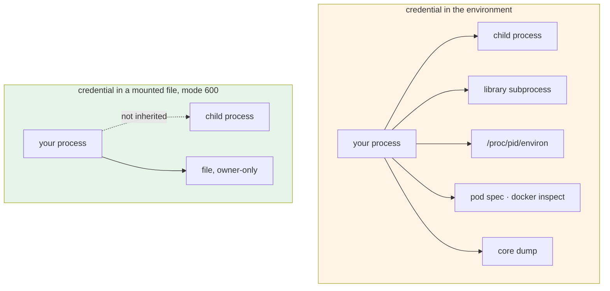

# 4.5 — The environment variable is not a vault

## One-line answer

Putting a credential in the environment stops it being **committed**, which is the leak that matters most
today — but the environment is inherited by every child process, readable by anything running as you, printed
by `kubectl get pod -o yaml`, and captured in crash dumps, so it is a **transport**, not a safe.

---

## The story

🎬 **The scene.** A cloakroom at a large venue. You hand over your coat and get a numbered ticket.

The coat is not in your hands any more, which solves the problem you had — you cannot leave it on a chair and
lose it. Genuinely better.

😬 **The naive fix.** People start leaving valuables in the coat pockets, because the coat is *in the
cloakroom now*, which sounds like a secure place.

💥 **Why it fails.** The cloakroom was never a safe. It is a rail behind a counter, staffed by four temporary
workers, with no lock on the back door, and its entire security model is *"most people do not go behind the
counter"*. It solved one problem — coats getting lost in the venue — and people quietly promoted it to solving
a different one it never claimed to solve.

And the sign that says `CLOAKROOM` does not say what it does not do. **Nobody lied. Everybody inferred.**

💡 **The insight.** **A mechanism that fixes one problem gets promoted, silently, to fixing the adjacent
ones.** The only defence is to be explicit about what it does *not* do — because the gap between what a
mechanism promises and what people assume it promises is where incidents live.

---

## The idea in plain language

[1.2](../01-configuration/1.2-the-environment-is-the-interface.md) argued that the environment is *the*
interface for configuration, and that argument is correct. This part is the footnote it needs, because the
same reasoning does not extend to secrecy.

**What the environment genuinely gives you for a secret:**

- **It is not in the repository.** That closes [4.2](4.2-the-seven-places-a-secret-leaks.md)'s path 1 — the
  only leak path on the list that is truly permanent. This is a large win and it is why environment variables
  are the right *first* answer.
- **It is not in the image**, provided nothing bakes it in at build time (path 5).
- **It is not on the command line**, so it is not in `ps` output readable by every user on the host (path 4's
  worse half).
- **Everything supports it**, so there is no adoption cost.

**What it does not give you, and this is the whole part:**

| Exposure | Who gets it | Why |
| --- | --- | --- |
| **Every child process** | anything your service spawns | the environment is *inherited* — that is its defining property |
| **Anything running as your user** | a compromised library, a debug shell, a sidecar | `/proc/<pid>/environ` is readable by the process owner |
| **Root, and the host** | node-level access, another container on a shared kernel | root reads any process's environment |
| **The orchestrator's API** | anyone who can `kubectl get pod -o yaml` | a container's `env:` is stored and returned in plain text |
| **Crash dumps and core files** | whoever collects them | a core dump contains the process's memory, environment included |
| **Diagnostic output** | anyone who runs `printenv` while screen-sharing | path 7 |

**The first row is the one that surprises people**, and it is the one worth internalising, because it is a
property of the mechanism rather than a misconfiguration: **every process your service starts receives a copy
of every credential your service holds.** If your service shells out to `git`, to a converter, to a helper
script, to a subprocess in a library you did not write — all of them get the provider key, the database
password and everything else, whether they need it or not. That is [1.2](../01-configuration/1.2-the-environment-is-the-interface.md)'s
inheritance property, which is a feature for configuration and an unbounded delegation for secrets.

### Kubernetes `Secret` is not encryption

This one deserves stating plainly now, because it is the single most common misunderstanding in this area and
Day 35 will meet it:

**A Kubernetes `Secret` is base64-encoded, not encrypted.** Base64 is an encoding, not a cipher — it exists so
binary data can travel in text, and reversing it is a single command. Encryption of secrets *at rest* in the
cluster's datastore is a separate feature that has to be turned on. Day 35 covers the object, Day 56 covers
policy, and Day 57 covers real secret management; the thing to carry from today is that **the word "Secret" in
that object's name describes intent, not mechanism.**

### The ladder

There is no single right answer — there is a ladder, and where you should be depends on what the credential
grants and what your platform supports:

```text
worst   hard-coded in the source                  → in git forever, path 1
        on the command line                       → readable by every user on the host
        in an environment variable                ← where Day 9 lands, and correctly
        in a file, mode 600, mounted at runtime   → not inherited by children; Day 35
        from a secret store, short-lived, cached  → rotated centrally; Day 57
best    workload identity, no stored credential   → nothing to leak; Day 220
```

**Day 9 lands on rung three and that is the right place to be**, because rungs four and five need a platform
this project does not have until Day 31, and rung six needs one it does not have until Day 220. The mistake
would be to *believe* rung three is rung six.

### The file alternative, available today

`pydantic-settings` supports reading each secret from its own file in a directory — the `secrets_dir` source
from [1.4](../01-configuration/1.4-the-precedence-ladder.md)'s ladder. That is rung four's mechanism, and it
is worth knowing now because it is exactly what Day 35 will mount into a container. A file has two properties
the environment does not: **it has permissions**, and **it is not inherited by child processes**.

---

## Why Kriya needs it

**Day 24** runs `pulse` in a container and passes it environment variables. **Day 25** shows `docker inspect`
returning them in plain text to anyone who can talk to the daemon.

**Day 35** introduces the `Secret` object and the choice between `env:` and a mounted volume — a choice that
is meaningless unless you know the difference in this part.

**Day 39's network policy** and **Day 38's RBAC** are the controls that decide *who can read a pod's
specification*, which is the exposure in row four of the table.

**Day 57** is the secret store, and **Day 220** is workload identity — rungs five and six.

**Day 179 onwards** is where this becomes sharpest: an agent process that can spawn subprocesses and call
tools inherits everything in its environment, so **the inheritance property becomes an agent-safety property**
(Day 194's brakes, Day 215's lethal trifecta). The habit of not putting more in the environment than a process
needs is formed here and matters most there.

---

## The mechanism

Demonstrate inheritance, because it is the property people do not expect:

```python
# lab/spawner.py - a service holding one credential, shelling out to something ordinary.
from __future__ import annotations

import os
import subprocess
import sys

KEY = os.environ.get("PULSE_MODEL_API_KEY", "<unset>")
print(f"parent holds a credential ending {KEY[-4:]}", file=sys.stderr)

print("--- child 1: a plain subprocess, no environment passed ---")
subprocess.run(
    [
        sys.executable,
        "-c",
        "import os; print('  child sees:', os.environ.get('PULSE_MODEL_API_KEY', '<unset>'))",
    ],
    check=True,
)

print("--- child 2: the same, with an explicit minimal environment ---")
subprocess.run(
    [
        sys.executable,
        "-c",
        "import os; print('  child sees:', os.environ.get('PULSE_MODEL_API_KEY', '<unset>'))",
    ],
    check=True,
    env={"PATH": os.environ.get("PATH", ""), "SYSTEMROOT": os.environ.get("SYSTEMROOT", "")},
)
```

**Line by line:**

- `KEY[-4:]` printed, never the value — the habit from [4.3](4.3-redaction-that-actually-holds.md).
- `subprocess.run([...])` with **no `env=` argument** — the default. Verified against
  `https://docs.python.org/3/library/subprocess.html` on **2026-08-25**: *"If `env` is not `None`, it must be
  a mapping that defines the environment variables for the new process; these are used instead of the default
  behavior of inheriting the current process's environment."* **The default is inheritance**, and that is the
  demonstration.
- A **list** of arguments rather than a string, so the shell is not involved and nothing can be word-split or
  glob-expanded. This is the correct form always, and doubly so when credentials are anywhere near.
- `sys.executable` rather than `"python"` — the exact interpreter running this process, so the child is the
  same environment `uv` set up rather than whatever `python` resolves to on `PATH`.
- `check=True` so a failing child raises instead of being ignored (Principle 10).
- Child 2 passes an explicit `env=` containing **only** what it needs. `PATH` because the child needs to find
  things; `SYSTEMROOT` because on Windows a Python process without it fails to initialise its socket layer —
  **a real, non-obvious requirement, and exactly the kind of thing that makes people give up and inherit
  everything.**

```bash
cd days/day-009-configuration-and-secrets/lab
PULSE_MODEL_API_KEY='LEAKDEMO-not-a-real-credential-abcd' uv run python spawner.py
```

**Line by line:**

- The marker value again, ending in `abcd` so the prefix printed by the parent can be matched against what the
  children see.
- Inline, so it does not survive into the next command.

```text
parent holds a credential ending abcd
--- child 1: a plain subprocess, no environment passed ---
  child sees: LEAKDEMO-not-a-real-credential-abcd
--- child 2: the same, with an explicit minimal environment ---
  child sees: <unset>
```

**Child 1 received a credential it never asked for and has no use for.** Nobody passed it; nobody could have
prevented it except by doing what child 2 does. In a real service, child 1 is a subprocess inside a library —
an image converter, a `git` call, a document renderer — and it now holds your provider key for its whole life,
where it will appear in *its* crash dumps and *its* `/proc` entry.

### The file alternative

```bash
cd days/day-009-configuration-and-secrets/lab
mkdir -p run_secrets
printf 'LEAKDEMO-not-a-real-credential-abcd' > run_secrets/pulse_model_api_key
chmod 600 run_secrets/pulse_model_api_key
ls -l run_secrets/
```

**Line by line:**

- `printf` rather than `echo` — **`echo` appends a newline**, and a credential read from a file with a
  trailing newline is a credential that fails authentication with a message that mentions nothing about
  whitespace. This is a genuinely common and genuinely maddening bug.
- The filename is the **lower-cased field name**, which is what `pydantic-settings` looks for in a secrets
  directory; the prefix applies as it does for environment variables.
- `chmod 600` — owner read and write, nobody else. Day 5's permission bits, doing the job the environment
  cannot ([Day 5, 2.2](../../../day-005-linux-for-operators-ii/parts/02-permissions/2.2-reading-and-changing-a-mode.md)).
  **Day 5 also left you a `TODO(me)`: find out whether `chmod` is actually honoured on this filesystem.** On a
  OneDrive-backed Windows path it may not be, and that answer decides whether this rung is real on this
  machine — which is precisely why that exercise existed.
- `ls -l` to see the mode you actually got rather than the one you asked for.

```python
# lab/from_file.py - the same setting, read from a file instead of the environment.
from __future__ import annotations

from pydantic import SecretStr
from pydantic_settings import BaseSettings, SettingsConfigDict


class Settings(BaseSettings):
    """A secret that never enters this process's environment."""

    model_config = SettingsConfigDict(
        env_prefix="PULSE_",
        env_file=None,
        secrets_dir="run_secrets",
        extra="forbid",
        frozen=True,
    )

    environment: str = "dev"
    model_api_key: SecretStr = SecretStr("")


if __name__ == "__main__":
    import os

    s = Settings()
    print("settings           :", repr(s))
    print("value ends         :", s.model_api_key.get_secret_value()[-4:])
    print("in the environment :", os.environ.get("PULSE_MODEL_API_KEY", "<not present>"))
```

**Line by line:**

- `secrets_dir="run_secrets"` — the secrets-directory source, one rung above the environment on the ladder and
  the mechanism Day 35 will mount into a container.
- `env_file=None` and the absence of the variable mean this value comes from **exactly one place**, which
  makes the last line of output meaningful.
- `model_api_key: SecretStr = SecretStr("")` — still the redacting type
  ([4.3](4.3-redaction-that-actually-holds.md)); changing where a secret comes from does not change how it
  must be handled.
- `import os` inside `__main__` rather than at the top — deliberate, and worth flagging: it is here **only**
  to prove the negative in the last line, and keeping it out of the module's imports signals that the module
  itself does not read the environment. `ruff` will not object to a local import; a reviewer will ask why, and
  the answer is this sentence.
- `get_secret_value()[-4:]` — the escape hatch, used to print four characters. **This is one of the very few
  legitimate uses of it outside a client constructor**, and even here it is a demonstration.

```bash
cd days/day-009-configuration-and-secrets/lab
uv run python from_file.py
```

**Line by line:**

- **No environment variable is set.** That absence is the result being demonstrated, so setting one would
  destroy the experiment.

```text
settings           : Settings(environment='dev', model_api_key=SecretStr('**********'))
value ends         : abcd
in the environment : <not present>
```

**The credential is in the process and not in its environment**, so any child it spawns gets nothing, `/proc`
shows nothing, and `kubectl get pod -o yaml` would show a volume mount rather than a value.



---

## When it breaks

**The pod specification that printed it.** Row four of the table, in practice:

```text
$ kubectl get pod pulse-7c9f4d8b6-hq2ln -o yaml | grep -A2 'name: PULSE_MODEL_API_KEY'
    - name: PULSE_MODEL_API_KEY
      value: sk-or-v1-3f9a2c8e1b7d4a6f0c5e2b8d9a1f3c7e
```

**What it says:** the value, in plain text, from a read-only API call.
**What it actually means:** the credential was set directly in the Deployment's `env:` rather than referenced
from a `Secret`. **Anyone with read access to pods in that namespace can read it**, and the Deployment is
almost certainly in git as well — which converts this into path 1
([4.2](4.2-the-seven-places-a-secret-leaks.md)) and makes it permanent.
**The smallest fix:** `valueFrom: secretKeyRef`, so the manifest names the secret rather than containing it.
Day 35.
**The part people get wrong even after fixing it:** `kubectl get secret -o yaml` then shows the base64 value,
which is a decode away. Fixing the manifest limits *who* can read it (Day 38's RBAC); it does not encrypt
anything.

**The subprocess that carried it.** Row one, in a real library:

```text
$ ps -ef | grep -c 'PULSE_MODEL_API_KEY'
0
$ cat /proc/48213/environ | tr '\0' '\n' | grep PULSE_MODEL
PULSE_MODEL_API_KEY=sk-or-v1-3f9a2c8e1b7d4a6f0c5e2b8d9a1f3c7e
```

...where PID 48213 is `gs` — a PostScript interpreter spawned by a PDF library.

**What it says:** an unrelated process holds your provider credential.
**What it actually means:** it inherited it, because that is what inheritance means. **A vulnerability in that
tool is now a credential disclosure**, and no part of your threat model included a document converter.
**The smallest fix:** pass an explicit `env=` to every `subprocess` call, or keep the credential out of the
environment entirely.
**Why this is the strongest argument in the part:** you cannot audit it by reading your own code, because the
subprocess is inside a dependency.

**The core dump.** The one nobody thinks about:

```text
$ strings /var/lib/systemd/coredump/core.pulse.1000.4f2a.zst | grep -m1 'sk-or-v1'
PULSE_MODEL_API_KEY=sk-or-v1-3f9a2c8e1b7d4a6f0c5e2b8d9a1f3c7e
```

**What it says:** the credential is in a crash dump file on disk.
**What it actually means:** a core dump is a copy of the process's memory, and the environment lives in that
memory. **Crash dumps are frequently collected centrally, retained, and shared with vendors for debugging.**
**The smallest fix:** disable core dumps for services holding credentials, or ensure the collection pipeline
treats dumps as sensitive.
**Why it generalises:** any mechanism that copies your process's memory — a debugger, a heap profiler, a crash
reporter, a memory snapshot for a live migration — copies your credentials too. **A secret in memory is a
secret in every copy of that memory**, and `SecretStr` does not help, because it stores the real value in
memory too; it only controls how the value is *printed*.

**The trailing newline.** The file rung's own trap:

```text
{"error":{"message":"Incorrect API key provided: sk-or-v1-***********************\n","code":"invalid_api_key"}}
```

**What it says:** the key is incorrect.
**What it actually means:** look at the end of the quoted value — `\n`. The file was written with `echo`
instead of `printf`, or edited in an editor that adds a final newline, and the credential now has an invisible
extra character.
**The smallest fix:** `.strip()` when reading a secret from a file — and note that
[2.1](../02-typed-settings/2.1-hand-rolling-the-settings-object.md) already flagged the opposite risk, that a
password may legitimately end in whitespace. **For file-based secrets, stripping the final newline is right;
stripping all whitespace is a judgement.**
**Why the error message is the hero here:** the provider echoed enough of the value's *shape* to show the
newline without revealing the value — which is what a well-designed error message for a credential looks like,
and worth copying.

---

## In production

**What a professional writes instead of the teaching version.** They match the rung to the credential. A
low-value, easily-rotated key stays in the environment, because the cost of anything else is not worth paying.
A database password or a signing key gets a file or a secret store. And regardless of rung, they apply two
habits that cost nothing: **pass an explicit `env=` to every subprocess**, and **hold the credential for as
short a time as possible** — read it, hand it to the client, do not keep a module-level copy that every part
of the process can reach.

**What degrades at scale.** Blast radius per host. On one machine with one service, "anything running as this
user can read it" is a small statement. On a node running forty containers, it becomes a question about
isolation boundaries — and a container is a process-isolation boundary, not a security boundary in the way
people assume (Day 28). The scaling answer is that credentials become **per-workload and short-lived**, so
that reading one gets you a small capability for a short time, and the whole industry's direction of travel —
workload identity, Day 220 — is exactly this.

**The failure that only shows with real traffic.** A subprocess spawned only on an error path or a rare
content type. The PDF library only shells out for one document format; the retry logic only invokes the
fallback binary when the primary fails. **The credential is only in that subprocess's environment
occasionally**, so an audit of running processes finds nothing, and the exposure exists exactly when the
system is under stress.

**The review comment a senior engineer leaves.** *"This calls `subprocess.run` without `env=`, which hands
our provider key and database password to `ffmpeg`. Pass an explicit environment with just `PATH`. Also, the
Deployment sets `PULSE_MODEL_API_KEY` as a literal `env:` value, so it is in git and readable by anyone with
pod read access — use `secretKeyRef`. Neither of these is theoretical; both show up verbatim in a
`kubectl get pod -o yaml`."*

**The signal you would alert on.** Nothing observes a credential sitting in an environment — that is the
defining difficulty. What is worth building is one **audit**, not an alert: a periodic check that no
container specification in the repository contains a literal credential-shaped value (Day 56's policy engine
can *refuse* this rather than report it, which is better). And one genuine alert, from
[4.2](4.2-the-seven-places-a-secret-leaks.md): **a canary credential being used**. Beyond that, this part is
about reducing exposure rather than detecting it, and being honest that the detection does not exist is more
useful than inventing a metric that looks like it does.

**Blast radius.** This part writes a fake credential into a file under `lab/run_secrets/` with mode `600`, and
demonstrates that a child process inherits the parent's environment. The capability introduced is a
**second place a secret can live**, which means a second place to remember to clean up. Worst case: the
`run_secrets/` directory survives the day with a real credential in it. What bounds it: `days/*/lab/` is in
`.gitignore` (Day 0), the value is the `LEAKDEMO` marker, the mode is `600` — **and, honestly, on a
OneDrive-backed Windows filesystem that mode may not be enforced at all**, which is exactly the
`TODO(me)` Day 5 left and the reason the checklist requires the directory to be deleted rather than trusted.
Who can trigger it: you.

**Cost.** `0` model calls, `0` tokens, `0` CI minutes, `0` new packages, `0` network. Disk: one directory and
one file, well under a kilobyte. RAM: negligible. **Processes spawned: four short-lived Python children.**

**The interview question.** *"Is it safe to put a secret in an environment variable?"* The answer that shows
judgement rather than dogma: *"It is the right default, and it is not a vault. It closes the leak path that
matters most — the credential is not in the repository, which is the only exposure that is genuinely
permanent — and it works everywhere. What it does not do is limit who can read it once the process is running:
it is inherited by every child process, so any subprocess a library spawns gets your credentials; it is in
`/proc/pid/environ` for anything running as the same user; it is in `kubectl get pod -o yaml` in plain text if
somebody set it as a literal; and it is in any core dump. The next rung is a file with restrictive
permissions, mounted at runtime, which is not inherited and has an owner — and above that a secret store with
short-lived credentials, and above that workload identity where there is no stored credential at all. The
mistake is not using environment variables; it is believing they are the top of the ladder."*

---

## Check yourself

```bash
cd days/day-009-configuration-and-secrets/lab
PULSE_MODEL_API_KEY='LEAKDEMO-not-a-real-credential-abcd' uv run python spawner.py
uv run python from_file.py
```

A child process that received a credential nobody passed it, and a settings object holding a credential that
is nowhere in the environment.

**Say out loud, without scrolling up:** *Name the one leak path an environment variable genuinely closes, then
name three exposures it does not — and say why a Kubernetes `Secret` being base64 does not make it less
useful, only less than its name suggests.*
