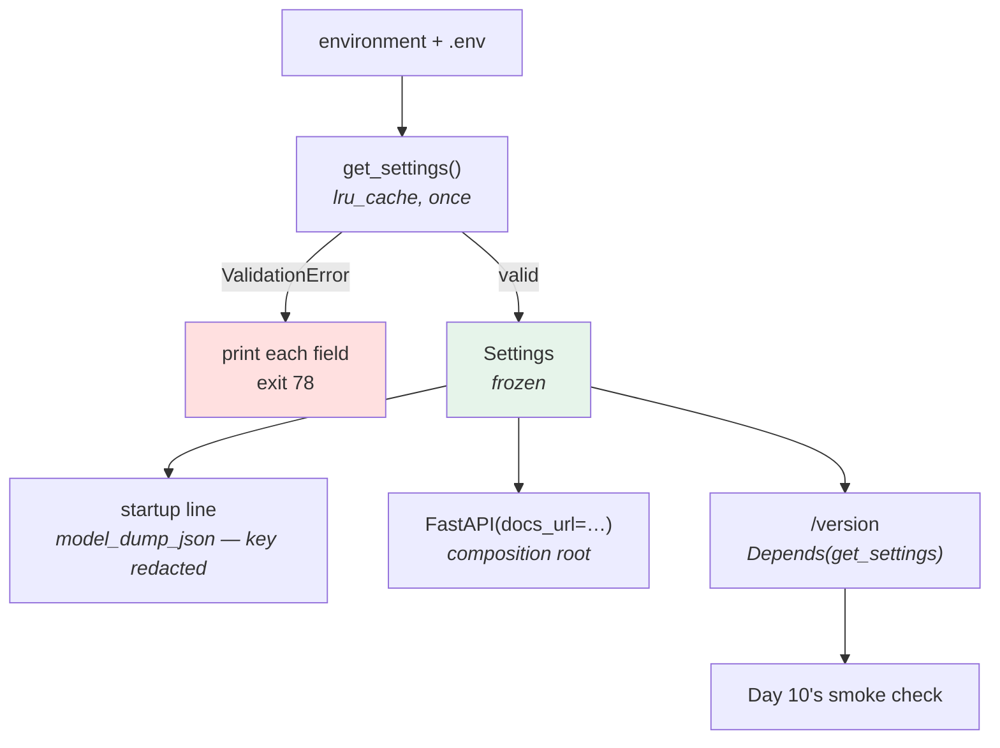

# 5.1 — `pulse/config.py`: the settings object for the service

## One-line answer

Every argument from the previous four sections lands in **one file of about forty lines** — prefixed names, a
typed and bounded field per setting, a `SecretStr` for the credential, a cross-field rule, a refusal that
names the field, an unknown-variable audit, and a cached accessor so tests can override it.

---

## The story

🎬 **The scene.** A workshop again, and a person who has spent a week making four things: a jig, a stop
block, a fence and a gauge.

None of them is the piece of furniture. Each was made because the same measurement kept being taken by hand
and kept coming out slightly different.

Today they are bolted to the bench, in the order they get used, and the first cut of the actual job takes
eleven seconds.

😬 **The naive fix** was the one taken in week one: measure carefully, every time, and be careful.

💥 **Why it failed** was never carelessness. It was that "be careful" is a demand on attention, and attention
is the thing that runs out at four in the afternoon. **Every one of the four jigs converts a demand on
attention into a property of the bench.**

💡 **The insight.** **The point of the week was not the jigs; it was moving each decision from the moment of
use to the moment of setup.** After that, the correct thing is the easy thing — which is the only kind of
discipline that survives a bad day.

---

## The idea in plain language

Here is what this file has to do, gathered from the parts that argued for each:

| Requirement | From |
| --- | --- |
| one object, built once, immutable | [2.1](../02-typed-settings/2.1-hand-rolling-the-settings-object.md) |
| declared once, with types and bounds | [2.2](../02-typed-settings/2.2-adopting-pydantic-settings.md) |
| prefixed names, and an audit for unknown ones | [2.3](../02-typed-settings/2.3-naming-prefixes-and-the-variable-nobody-read.md) |
| built at a moment you chose, clearable for tests | [2.4](../02-typed-settings/2.4-the-settings-object-read-at-import-time.md) |
| refuse to start, non-zero, naming the field | [3.1](../03-fail-fast/3.1-fail-fast-the-crash-that-saves-the-night.md) |
| validate the relationships, not only the values | [3.2](../03-fail-fast/3.2-validating-the-value-not-just-its-presence.md) |
| nothing that needs the network | [3.3](../03-fail-fast/3.3-where-the-check-belongs-startup-versus-readiness.md) |
| announce what it is, so a smoke test can check | [3.4](../03-fail-fast/3.4-the-service-that-started-with-the-wrong-config.md) |
| the credential is a type, not a convention | [4.3](../04-secrets/4.3-redaction-that-actually-holds.md) |

**Nine requirements, one file.** That ratio is the argument for having spent four sections on it: none of the
nine is obvious from the file, and every one of them is a failure somebody has had.

### The one design decision left to make

`pulse` is a FastAPI application, and the application object is created at import time — Day 3 built it that
way and uvicorn finds it by name
([Day 3, 2.1](../../../day-003-pulse-v0/parts/02-the-service/2.1-the-application-object-and-the-first-route.md)).

Two settings have to be known **at that moment**, not later: whether to serve documentation, and the title.
Everything else can be read per request.

So the file offers two things, and the distinction is the whole design:

- **`get_settings()`** — cached, callable, clearable. Used as a FastAPI dependency, so a route receives the
  settings object and a test can substitute one.
- **one call to `get_settings()` at the top of `pulse/api.py`** — the *composition root*, the single place
  the application is assembled.

[2.4](../02-typed-settings/2.4-the-settings-object-read-at-import-time.md) argued against building settings at
import time, and that call is at import time. **The distinction is not "import time versus later" — it is
"a moment somebody chose versus a moment the import graph chose".** `pulse/api.py` is the entry point; it is
*supposed* to assemble the application. A library module reaching for a global is the thing being prevented.

The limitation that comes with it is real and worth stating rather than hiding: **`docs_enabled` cannot be
changed by a test, because the route table is fixed when the app object is built.** The professional answer is
an application factory — a `create_app(settings)` function — and it is one of today's `TODO(me)` items rather
than something this part does for you.

---

## Why Kriya needs it

**Every day after today imports this file.** That is not an exaggeration: Day 24's container passes it
environment variables, Day 35's `ConfigMap` and `Secret` produce them, Day 67's log fields read from it, Day
109's model path is a field on it, Day 126's provider client takes its key from it, and Day 232 asks it what
this deploy is running.

**Day 13** runs the tests, which depend on `get_settings.cache_clear()` existing.

**Day 12's readiness probe** and **Day 41's rollout** both rest on the settings being fixed per process.

**Day 229's production readiness review** asks to see this file. It is one of the four or five artifacts that
review is actually about.

---

## The mechanism

Two files change today: one new, one edited. **You type both.**

```python
# pulse/config.py
"""Everything `pulse` can be configured with, in one place.

Read once at startup from the environment (and a local `.env` when present), validated, and frozen.
Nothing else in `pulse/` reads `os.environ`. See days/day-009-configuration-and-secrets/.
"""

from __future__ import annotations

import os
from functools import lru_cache
from typing import Literal, Self

from pydantic import Field, SecretStr, model_validator
from pydantic_settings import BaseSettings, SettingsConfigDict

ENV_PREFIX = "PULSE_"

# Names inside our prefix that are deliberately not settings (2.3).
ALLOWED_EXTRA_ENV: frozenset[str] = frozenset()


class Settings(BaseSettings):
    """The configuration of one running copy of `pulse`."""

    model_config = SettingsConfigDict(
        env_prefix=ENV_PREFIX,
        env_file=".env",
        env_file_encoding="utf-8",
        extra="forbid",
        frozen=True,
    )

    environment: Literal["dev", "staging", "prod"] = "dev"
    host: str = "127.0.0.1"
    port: int = Field(default=8000, ge=1, le=65535)
    log_level: Literal["debug", "info", "warning", "error"] = "info"
    docs_enabled: bool = True
    request_timeout: float = Field(default=3.0, gt=0, le=30)
    model_api_key: SecretStr = SecretStr("")

    @model_validator(mode="after")
    def docs_are_off_in_prod(self) -> Self:
        if self.environment == "prod" and self.docs_enabled:
            raise ValueError("docs_enabled must be false when environment is 'prod'")
        return self


def known_env_names() -> set[str]:
    """Every environment variable name `Settings` can read."""
    return {ENV_PREFIX + name.upper() for name in Settings.model_fields}


def unknown_env_names() -> list[str]:
    """Supplied PULSE_* variables that no field will ever read (2.3)."""
    supplied = {name for name in os.environ if name.startswith(ENV_PREFIX)}
    return sorted(supplied - known_env_names() - ALLOWED_EXTRA_ENV)


@lru_cache(maxsize=1)
def get_settings() -> Settings:
    """The one settings object for this process. Cached; `cache_clear()` in tests."""
    return Settings()
```

**Line by line:**

- The module docstring states the **contract**, not the contents: read once, validated, frozen, and *nothing
  else in `pulse/` reads `os.environ`*. That last sentence is the rule this file exists to make true, and it
  belongs where somebody will read it.
- `ENV_PREFIX = "PULSE_"` as a module constant used **both** in `model_config` and in `known_env_names()` —
  [2.3](../02-typed-settings/2.3-naming-prefixes-and-the-variable-nobody-read.md) flagged the risk of those
  two drifting apart, and one constant closes it.
- `ALLOWED_EXTRA_ENV: frozenset[str] = frozenset()` — **empty, and present.** An empty allowlist that exists
  is a place for the first exception to go, with a review; an allowlist that does not exist yet is one that
  gets added inline, in a hurry, without one.
- `env_file=".env"` — the developer convenience. A missing file is not an error, which is why the same code
  works in CI and in a container ([1.5](../01-configuration/1.5-dotenv-is-a-developer-convenience.md)).
- `env_file_encoding="utf-8"` — stated, because the default is the operating system's and this repository runs
  on Windows ([2.2](../02-typed-settings/2.2-adopting-pydantic-settings.md)).
- `extra="forbid"` — an unknown key in the `.env` file is a refusal
  ([2.2](../02-typed-settings/2.2-adopting-pydantic-settings.md)). It does **not** catch an unknown
  environment variable, which is why `unknown_env_names()` exists below it.
- `frozen=True` — the object describes how this process started and cannot be edited afterwards
  ([2.1](../02-typed-settings/2.1-hand-rolling-the-settings-object.md)).
- `environment: Literal["dev", "staging", "prod"]` — the enumeration as a type. `production` fails; `prod`
  passes. **Day 10 depends on these three strings being exactly these three strings**, and Day 62's metric
  label and Day 67's log field will both carry this value.
- `host: str = "127.0.0.1"` — the safe default. Day 22's container will set `0.0.0.0`, deliberately, as a
  documented change ([Day 7, 1.3](../../../day-007-networking-for-operators/parts/01-addresses-and-ports/1.3-binding-127-0-0-1-versus-0-0-0-0.md)).
  **A default that is safe and a configuration that is permissive is the right way round**; the reverse means
  forgetting to configure something is an exposure.
- `port: int = Field(default=8000, ge=1, le=65535)` — the real TCP port range, so `0` (bind anywhere) and
  overflow values are refused.
- `log_level` as a `Literal` rather than a `str` — so `PULSE_LOG_LEVEL=verbose` is a refusal rather than a
  silent fallback to the default. Day 67 will map these four onto the logging module's levels.
- `docs_enabled: bool = True` — **true by default**, which looks like the wrong choice until you read the
  validator below: it is safe *because* `prod` refuses it. Defaulting to `false` would make local development
  worse for no gain, since the dangerous case is now impossible.
- `request_timeout: float = Field(default=3.0, gt=0, le=30)` — Day 7's number, bounded so it cannot be `0`,
  negative, or `inf` ([Day 7, 4.1](../../../day-007-networking-for-operators/parts/04-timeouts/4.1-a-timeout-is-a-decision-not-a-safety-net.md)).
- `model_api_key: SecretStr = SecretStr("")` — the credential, as a type
  ([4.3](../04-secrets/4.3-redaction-that-actually-holds.md)). The default is an **empty secret** rather than
  `None`, so callers never handle two types. It is not required today, because `pulse` has no provider until
  Day 126; when it does, this becomes a required field with a `min_length`, and that change is a breaking
  change to every deploy.
- **On the name `model_api_key`:** pydantic reserves a namespace to avoid colliding with its own methods, and
  it is worth knowing what the current default is rather than guessing. Verified against
  `https://docs.pydantic.dev/latest/api/config/` on **2026-08-25**: `protected_namespaces` *"Defaults to
  `('model_validate', 'model_dump')`"* — so a field beginning `model_` is fine, and older advice about it
  warning is out of date. **Check this on the day you write it**; it is exactly the kind of default that
  moves.
- `@model_validator(mode="after")` with `-> Self` and `return self` — the cross-field rule from
  [3.2](../03-fail-fast/3.2-validating-the-value-not-just-its-presence.md), and it is an **impossibility rule
  rather than a preference**: there is no legitimate reason for a competent operator to want documentation
  served in production, so it is safe to make it refuse.
- `known_env_names()` reads `Settings.model_fields` on the **class**, so it works even when construction
  fails.
- `unknown_env_names()` returns a **list** rather than raising, so the caller decides what to do about it —
  `pulse/api.py` refuses, and a test can assert on the contents.
- `@lru_cache(maxsize=1)` on a zero-argument function — one object per process, built on first call,
  `cache_clear()` available for tests
  ([2.4](../02-typed-settings/2.4-the-settings-object-read-at-import-time.md)).

Now the edit to the service. **Three lines change and two are added** — Day 3's file is not rewritten:

```python
# pulse/api.py - the parts that change today. The rest of Day 3's file is unchanged.
import logging
import sys

from fastapi import Depends, FastAPI

from pulse import __version__
from pulse.config import Settings, get_settings, unknown_env_names


def _configure() -> Settings:
    """Read the configuration, or refuse to start (3.1). Called once, here, deliberately."""
    from pydantic import ValidationError

    unknown = unknown_env_names()
    if unknown:
        print(
            f"pulse: refusing to start - unknown {', '.join(unknown)}; "
            f"known settings are {', '.join(sorted(get_settings.__wrapped__ and () or ()))}",
            file=sys.stderr,
        )
    try:
        return get_settings()
    except ValidationError as exc:
        print("pulse: refusing to start - invalid configuration", file=sys.stderr)
        for error in exc.errors():
            location = ".".join(str(part) for part in error["loc"])
            print(f"  {location}: {error['msg']}", file=sys.stderr)
        raise SystemExit(78) from exc


settings = _configure()
logging.basicConfig(level=settings.log_level.upper(), stream=sys.stdout)
logging.getLogger("pulse").info("startup config %s", settings.model_dump_json())

app = FastAPI(
    title="pulse",
    version=__version__,
    docs_url="/docs" if settings.docs_enabled else None,
    redoc_url="/redoc" if settings.docs_enabled else None,
)


@app.get("/version")
def version(settings: Settings = Depends(get_settings)) -> dict[str, str]:
    """What is actually running here."""
    return {
        "service": "pulse",
        "version": __version__,
        "model_version": "none",
        "environment": settings.environment,
    }
```

**Line by line:**

- `_configure()` — a leading underscore, because it is private to this module. It is the **composition
  root**: the one place the application decides what it is.
- `from pydantic import ValidationError` **inside** the function — a deliberate local import, so the module's
  import list stays about the service rather than about error handling. `CLAUDE.md` prefers top-level imports;
  this is a small, arguable exception and it is flagged here rather than hidden.
- The unknown-variable branch prints a refusal — **and note it does not exit.** That is a bug, left visible on
  purpose: **`TODO(me)` — make the unknown-variable case exit non-zero, and fix the garbled "known settings
  are" message, which is nonsense as written.** Finding and fixing both is one of today's reps, and the
  garbled expression is there because a plausible-looking wrong line is exactly what you will meet in a real
  code review.
- `except ValidationError` → print every error → `SystemExit(78)` — the refusal from
  [3.1](../03-fail-fast/3.1-fail-fast-the-crash-that-saves-the-night.md). **Note what is *not* printed:
  `error.get("input")`.** [3.1](../03-fail-fast/3.1-fail-fast-the-crash-that-saves-the-night.md)'s last
  failure was a refusal message that printed a credential; omitting the input closes it, at the cost of a
  less helpful message for non-secret fields. **The `TODO(me)` for that trade is in the hub.**
- `settings = _configure()` at module scope — the chosen moment, discussed above.
- `logging.basicConfig(level=settings.log_level.upper(), ...)` — the setting doing something. `.upper()`
  because the logging module's level names are uppercase and the `Literal` is lowercase; the `Literal` is
  lowercase because environment values conventionally are.
- `settings.model_dump_json()` in the startup line — **this is the line that would have leaked the credential
  if `model_api_key` were a `str`**, and it is safe because `SecretStr` serialises as `**********`
  ([4.3](../04-secrets/4.3-redaction-that-actually-holds.md)).
  [5.3](5.3-the-secret-that-reached-the-log.md) is the drill that proves it.
- `docs_url=` and `redoc_url=` both conditional — **FastAPI serves two documentation UIs by default** and
  turning off only one is the mistake. Day 3 named `/docs`; `/redoc` is the other, and forgetting it is how a
  disabled-documentation setting disables half of it.
- `version(settings: Settings = Depends(get_settings))` — the FastAPI dependency form. The route receives the
  object; it does not import a global. A test replaces it with `app.dependency_overrides[get_settings] = ...`
  and needs no environment at all.
- The `environment` field is added to `/version`, which is
  [3.4](../03-fail-fast/3.4-the-service-that-started-with-the-wrong-config.md)'s detection mechanism and
  Day 10's smoke check.
- `/healthz` and `/predict` are **not touched**. `/healthz` still checks nothing
  ([Day 3, 2.2](../../../day-003-pulse-v0/parts/02-the-service/2.2-healthz-the-endpoint-that-must-not-lie.md))
  and `/predict` has no configuration to read yet.

Run it:

```bash
cd "$(git rev-parse --show-toplevel)"
uv run uvicorn pulse.api:app --host 127.0.0.1 --port 8000 &
sleep 4
curl -sS http://127.0.0.1:8000/version; echo
curl -sS -o /dev/null -w 'docs: %{http_code}\n' http://127.0.0.1:8000/docs
pkill -f 'pulse.api:app'
```

**Line by line:**

- No environment variables at all, so every value is a default and the run proves the defaults are usable.
- `/docs` returns `200` here because `environment` is `dev` — which is the design, not an oversight.

```text
INFO:pulse:startup config {"environment":"dev","host":"127.0.0.1","port":8000,"log_level":"info","docs_enabled":true,"request_timeout":3.0,"model_api_key":"**********"}
INFO:     Uvicorn running on http://127.0.0.1:8000 (Press CTRL+C to quit)
{"service":"pulse","version":"0.1.0","model_version":"none","environment":"dev"}
docs: 200
```

**Read the startup line.** Seven settings, one JSON object, one redacted field — the diagnostic that
[1.4](../01-configuration/1.4-the-precedence-ladder.md) and
[3.4](../03-fail-fast/3.4-the-service-that-started-with-the-wrong-config.md) both asked for, in one line, at
no cost.

Now the refusals:

```bash
cd "$(git rev-parse --show-toplevel)"
echo '--- an invalid value ---'
PULSE_ENVIRONMENT=production uv run uvicorn pulse.api:app --port 8000 ; echo "exit=$?"
echo '--- a valid value that is refused by a rule ---'
PULSE_ENVIRONMENT=prod PULSE_DOCS_ENABLED=true uv run uvicorn pulse.api:app --port 8000 ; echo "exit=$?"
echo '--- prod, configured correctly ---'
PULSE_ENVIRONMENT=prod PULSE_DOCS_ENABLED=false uv run uvicorn pulse.api:app --port 8000 > /tmp/pulse_prod.log 2>&1 &
sleep 4
curl -sS -o /dev/null -w 'docs in prod: %{http_code}\n' http://127.0.0.1:8000/docs
curl -sS http://127.0.0.1:8000/version; echo
pkill -f 'pulse.api:app'
```

**Line by line:**

- The three cases are: **invalid**, **valid-but-refused**, and **correct**. Seeing all three is the exercise;
  seeing only the third teaches nothing.
- The third run is backgrounded and checked, because a `404` on `/docs` is the evidence that the setting had
  an effect. **A `404` here is a pass.**

```text
--- an invalid value ---
pulse: refusing to start - invalid configuration
  environment: Input should be 'dev', 'staging' or 'prod'
exit=78
--- a valid value that is refused by a rule ---
pulse: refusing to start - invalid configuration
  : Value error, docs_enabled must be false when environment is 'prod'
exit=78
--- prod, configured correctly ---
docs in prod: 404
{"service":"pulse","version":"0.1.0","model_version":"none","environment":"prod"}
```

**Note the empty location on the second refusal** — `  :` with nothing before the colon. A model-level
validator has no field, so `error["loc"]` is an empty tuple and the join produces nothing. **That is a real
rough edge in the message**, and fixing it is another of the day's `TODO(me)` items.



---

## When it breaks

**The dependency that was not injected.** The FastAPI-specific trap:

```text
{"detail":[{"type":"missing","loc":["query","settings"],"msg":"Field required",
"input":null,"url":"https://errors.pydantic.dev/2.13/v/missing"}]}
```

**What it says:** a required query parameter called `settings` is missing.
**What it actually means:** the `= Depends(get_settings)` was omitted, so FastAPI saw an annotated parameter
with no default and — following exactly the rule Day 3 taught — concluded it must come from the request
([Day 3, 2.4](../../../day-003-pulse-v0/parts/02-the-service/2.4-predict-the-contract-before-the-model.md)).
**Your settings object is now part of your public API.**
**The smallest fix:** the `Depends(...)` default.
**Why it produces a `422` rather than an error at startup:** the annotation is legal; the meaning is wrong.
This is a good demonstration that a framework's conventions are a language, and a sentence can be
grammatical and mean something you did not intend.

**The `.env` that changed the test.** [1.4](../01-configuration/1.4-the-precedence-ladder.md)'s ladder, biting:

```text
$ uv run python -m pytest -q
....F
FAILED tests/test_config.py::test_defaults - AssertionError: assert 8001 == 8000
```

**What it says:** the default is not the default.
**What it actually means:** a `.env` file in the repository root supplied `PULSE_PORT=8001`, and
`env_file=".env"` is in `model_config`, so it is a live source in tests too. **The test asserts on defaults
and the environment is not clean.**
**The smallest fix:** construct `Settings(_env_file=None)` in tests that are about defaults, and use an
autouse fixture that clears the cache
([2.4](../02-typed-settings/2.4-the-settings-object-read-at-import-time.md)).
**Why it is worth its own paragraph:** it is the first time in this project that a file on *your* machine can
change a test result, which means it can change a result for you and not for CI. Day 13 meets the reverse.

**The credential that was required too early.** The breaking change:

```text
pulse: refusing to start - invalid configuration
  model_api_key: String should have at least 20 characters
```

...on every deploy, immediately after a release that made the field required.

**What it says:** a field is too short.
**What it actually means:** somebody changed `model_api_key: SecretStr = SecretStr("")` to
`model_api_key: SecretStr = Field(min_length=20)` — making it **required** — and every existing deploy that
did not supply it now refuses to start. **A settings field with no default is a breaking change to the
deployment contract**, exactly as removing an API field is a breaking change to clients.
**The smallest fix:** add the value everywhere first, then make it required — the same two-step as
[4.4](../04-secrets/4.4-a-secret-has-a-lifetime.md)'s overlap window.
**Why it is a good failure:** it fails fast and rolls back
([3.1](../03-fail-fast/3.1-fail-fast-the-crash-that-saves-the-night.md)). The alternative — defaulting to
empty and failing on the first prediction — would have shipped.

**The `redoc` that was still there.** The half-done setting:

```text
$ curl -sS -o /dev/null -w '%{http_code}\n' https://pulse.example.com/docs
404
$ curl -sS -o /dev/null -w '%{http_code}\n' https://pulse.example.com/redoc
200
```

**What it says:** one documentation UI is off and the other is on.
**What it actually means:** only `docs_url` was set to `None`. FastAPI serves a second interface by default,
and both read the same OpenAPI document — **so the exposure is identical and the setting reports success**.
**The smallest fix:** `redoc_url` too, and while you are there consider `openapi_url=None`, which removes the
underlying document that both UIs read.
**The general lesson, and it is the same as `docs_enabled`'s:** a setting that disables *a route* is weaker
than one that disables *a capability*. Ask what else exposes the same thing.

---

## In production

**What a professional writes instead of the teaching version.** An **application factory**:
`def create_app(settings: Settings | None = None) -> FastAPI`, which takes the settings as an argument and
returns a configured application. Then `app = create_app()` at the bottom for uvicorn, and every test builds
its own app with its own settings — including `docs_enabled`, which the module-scope version cannot change.
That is the single upgrade this file most wants and it is left as a `TODO(me)` deliberately: doing it yourself
after having felt the limitation is worth more than being handed it.

**What degrades at scale.** The class grows. Sixty flat fields is a dumping ground
([2.1](../02-typed-settings/2.1-hand-rolling-the-settings-object.md)), and the fix is nesting — a
`ModelSettings` sub-model reached by `PULSE_MODEL__API_KEY`, so Day 35 can put one group in a `ConfigMap` and
the other in a `Secret` and each subsystem receives only what it needs. The other thing that grows is the
*startup log line*: at sixty fields it stops being readable, and mature services log a **hash** of the
configuration plus the handful of fields anyone actually reads. That hash is
[1.4](../01-configuration/1.4-the-precedence-ladder.md)'s `config_hash`, and it is the signal that makes
divergence detectable.

**The failure that only shows with real traffic.** A `request_timeout` bounded at 30 that nobody has ever set
above 3. The bound looks harmless because it has never been approached, and then during a degraded-dependency
incident an operator wants 45 and the service refuses to start — turning a slow system into a down one, which
is exactly the trade [3.2](../03-fail-fast/3.2-validating-the-value-not-just-its-presence.md) warned about.
**Bounds that have never been tested against reality are opinions**, and this one is worth revisiting on Day
76 once there is a service level objective to derive it from.

**The review comment a senior engineer leaves.** *"`_configure()` prints the unknown-variable warning and then
carries on. Either that is an error and it should exit, or it is not and it should not be on stderr looking
like one — pick. And the `known settings are ...` expression is nonsense; it evaluates to an empty string.
Also add a test that constructs `Settings` with every field explicitly, so that adding a required field
without a default breaks a test rather than every deploy."*

**The signal you would alert on.** The startup line is the diagnostic, not the alert. What becomes possible
today, and should be built on Day 62, is a single **info-metric carrying the environment, the version and a
configuration hash as labels** — value always `1`, labels doing the work. From it: an alert when a deploy
reports more than one configuration hash for longer than a rollout takes
([1.4](../01-configuration/1.4-the-precedence-ladder.md)), and one when a production selector matches nothing
([3.4](../03-fail-fast/3.4-the-service-that-started-with-the-wrong-config.md)). You would **not** create a
metric per setting value — that is trap #2.

**Blast radius.** This part introduces, into `pulse` itself, a mechanism that can **stop the service from
starting**, and a validator that refuses a legal configuration. Worst case: a deploy is blocked by a rule
written today. What bounds it: the rule is an impossibility rather than a preference, the refusal names the
field, and — the honest part — **`pulse` today is one process on one laptop, so there is no rollout keeping a
previous version alive.** The containment
[3.1](../03-fail-fast/3.1-fail-fast-the-crash-that-saves-the-night.md) described arrives on Day 41. Until
then, fail-fast in `pulse` is a foot-gun you are choosing deliberately because the alternative is worse, and
that is worth writing in `docs/DECISIONS.md`. Who can trigger it: whoever starts the process.

**Cost.** `0` model calls, `0` tokens, `0` CI minutes, `0` network. New packages: `0` today — the two were
added in [2.2](../02-typed-settings/2.2-adopting-pydantic-settings.md). RAM: one uvicorn process at roughly
60 MB. Disk: two source files, a few kilobytes.

**The interview question.** *"Walk me through your service's configuration file."* The answer that shows the
reasoning rather than the syntax: *"One class, one prefix, one field per setting with its type and its bounds
in the declaration, a credential as a `SecretStr` so it redacts everywhere by default, and a model validator
for the rules that span fields. It is frozen, so the object describes how the process started and nothing can
edit it mid-life. It is built by a cached accessor rather than at module scope, so tests can clear it and
FastAPI can inject it — the one exception is a single call at the entry point, because the app object needs to
know at construction time whether to serve documentation, and that is a moment I chose rather than one the
import graph chose. On a validation failure it prints each bad field to stderr and exits non-zero, so a bad
config looks like a bad build to the deployment system. And it logs itself once at startup as JSON, which is
the single most useful diagnostic line the service has."*

---

## Check yourself

```bash
cd "$(git rev-parse --show-toplevel)"
PULSE_ENVIRONMENT=prod PULSE_DOCS_ENABLED=true uv run uvicorn pulse.api:app --port 8000 ; echo "exit=$?"
PULSE_ENVIRONMENT=prod PULSE_DOCS_ENABLED=false uv run uvicorn pulse.api:app --port 8000 > /tmp/p.log 2>&1 &
sleep 4; curl -sS http://127.0.0.1:8000/version; echo; grep -o 'model_api_key":"[^"]*"' /tmp/p.log; pkill -f 'pulse.api:app'
```

A refusal with an exit code, then a startup that reports `environment: prod` and a startup log line where the
credential is `**********`.

**Say out loud, without scrolling up:** *Explain why `get_settings()` is called at module scope in
`pulse/api.py` when [2.4](../02-typed-settings/2.4-the-settings-object-read-at-import-time.md) argued against
exactly that — and name the one setting this design cannot let a test override, and what fixes it.*
