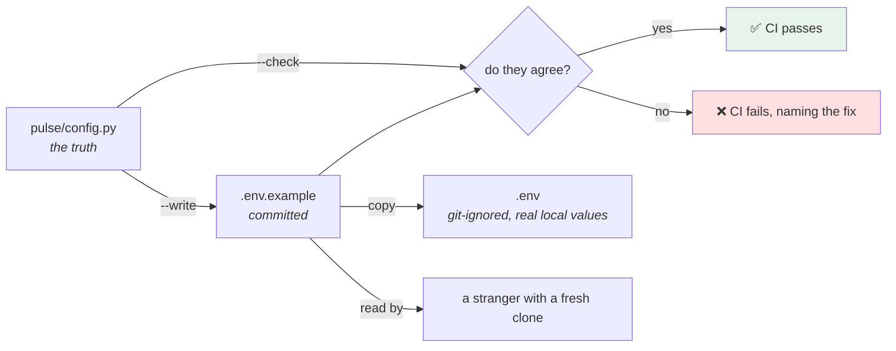

# 5.2 — `.env.example`: the contract with a stranger

## One-line answer

The committed example file is the **only** document that tells somebody who has never seen this repository
which variables the service needs — and because it will drift the moment somebody adds a field and forgets it,
it should be **generated from the settings class** and **checked in CI**, not maintained by hand.

---

## The story

🎬 **The scene.** A holiday cottage, and the folder on the kitchen table.

*The heating comes on with the dial in the hall, not the switch. The hot water takes a while. The bins go out
Tuesday. The wifi password is on the back of the router. If the shower alarms, press the red button under the
sink.*

Somebody wrote that folder once, and it is the reason four hundred strangers have had a working week without
phoning anybody.

😬 **The naive fix.** The owner replaces the boiler. The dial in the hall is gone; there is an app now. The
folder is not updated, because the owner knows how the new boiler works.

💥 **Why it fails.** The next guest reads the folder, goes to the hall, finds no dial, and concludes the
heating is broken. **They do not conclude the folder is out of date** — a document that has been right about
five other things is assumed right about the sixth. They spend an evening cold and leave a bad review about
the heating.

**The folder did not become useless when it went out of date. It became worse than useless**, because it is
still believed.

💡 **The insight.** **A document that describes a system will drift from it, and a drifting document is more
dangerous than a missing one, because it is trusted.** The only durable fixes are to generate it from the
system or to have something fail when they disagree.

---

## The idea in plain language

`pulse` now has a settings class ([5.1](5.1-pulse-config-the-settings-object.md)) with seven fields. Somebody
cloning this repository has to discover:

- which environment variables exist;
- which are required and which have workable defaults;
- what a valid value looks like;
- which ones are secrets they must obtain rather than invent.

There are three places that could tell them, and only one of them works.

**The code.** It is the truth, and it is not documentation: it requires reading Python, knowing that the
prefix is applied, and knowing that field names are upper-cased. **A newcomer cannot even find the file.**

**A README section.** Readable, and it drifts. Nothing fails when it is wrong.

**`.env.example`.** A committed file, in the format the values are actually supplied in, that can be copied to
`.env` and edited. It is the format the tooling already understands, and it sits next to the thing it
describes.

The pattern is standard and Day 0 already prepared for it: `.gitignore` contains `.env` and `!.env.example`,
written before either file existed ([1.5](../01-configuration/1.5-dotenv-is-a-developer-convenience.md)).

### What goes in it, and what must not

The rules matter more than they look, because this file is committed and public
([1.1](../01-configuration/1.1-what-configuration-actually-is.md)'s litmus test):

| Rule | Why |
| --- | --- |
| every field appears, even the defaulted ones | the file is the *list*; an omitted field is an undiscoverable setting |
| a comment per field, saying what it does | the file is read by somebody who cannot read the code |
| defaults shown as the actual default | so a reader can see what happens if they change nothing |
| **secrets get a placeholder that is obviously not a value** | a realistic fake gets copied into a real deploy |
| **no real value, ever, for anything** | the file is committed; see the litmus test |
| required-ness stated explicitly | *"the service will not start without this"* is the sentence a newcomer needs |

**The placeholder rule is the one with teeth.** `PULSE_MODEL_API_KEY=sk-or-v1-xxxxxxxxxxxx` is a bad
placeholder: it has the shape of a real key, so it looks like a value rather than a gap, and a hurried person
will paste the file into a deploy and wonder why authentication fails. `PULSE_MODEL_API_KEY=` with a comment
saying *"required for Day 126; obtain from the provider console; the service starts without it today"* cannot
be mistaken for anything.

### Generate it, do not maintain it

The cottage folder drifts because a human has to remember. The settings class already contains every fact the
example file needs — the names, the types, the defaults, which fields are required, and (with a `Field`
description) what each one means.

So: **generate the file from the class, and make CI fail when the committed file and the generated one
disagree.** That is one script and one check, and it converts "somebody must remember" into "the build says
no" — the same move as every gate in this curriculum.

---

## Why Kriya needs it

**Day 13's CI** is where the check runs, and it is one of the first genuinely useful non-test gates.

**Day 17** puts secrets in CI, and this file is the list of which ones the job must supply.

**Day 26 and Day 35** each need the same list, expressed as a Compose `environment:` block and a `ConfigMap`
plus `Secret`. **A generated example makes both of those derivable rather than transcribed.**

**Day 126** adds the provider key, and this file is where a reader learns they need one and where to get it.

**Day 230's documentation day** and **Day 231's handover** are both graded on whether a stranger can run this
system from the repository alone. This file is a large part of that answer, and Day 1's handover test set the
bar ([Day 1, 3.1](../../../day-001-what-operations-actually-is/parts/03-the-handover-test/3.1-the-handover-test.md)).

---

## The mechanism

First, add descriptions to the fields, because the generator can only emit what the class knows:

```python
# pulse/config.py - the field declarations, now carrying their own documentation.
    environment: Literal["dev", "staging", "prod"] = Field(
        default="dev", description="Which deploy this is. Labels every log line and metric."
    )
    host: str = Field(default="127.0.0.1", description="Listen address. 0.0.0.0 inside a container.")
    port: int = Field(default=8000, ge=1, le=65535, description="Listen port.")
    log_level: Literal["debug", "info", "warning", "error"] = Field(
        default="info", description="Minimum level written to stdout."
    )
    docs_enabled: bool = Field(
        default=True, description="Serve /docs and /redoc. Must be false when environment is prod."
    )
    request_timeout: float = Field(
        default=3.0, gt=0, le=30, description="Seconds to wait for one outbound call."
    )
    model_api_key: SecretStr = Field(
        default=SecretStr(""), description="SECRET. Model provider credential. Not used until Day 126."
    )
```

**Line by line:**

- Every field becomes a `Field(default=..., description=...)`. The default moves inside `Field` for the ones
  that did not have it there, which changes nothing at runtime and makes the declarations uniform.
- `description` is not a comment — it is **data on the model**, reachable as
  `Settings.model_fields[name].description`. That is what makes generation possible, and it is also what
  FastAPI would use if this model were ever exposed in a schema.
- The `docs_enabled` description states the **rule**, not just the meaning. A reader of the example file
  should learn about the validator from the file rather than from a startup refusal.
- `model_api_key`'s description **begins with the word `SECRET`.** That is a convention this project is
  adopting right now, and it is deliberately crude: the generator will key off it. A more elegant approach is
  to detect the `SecretStr` type, which the generator below also does — **belt and braces, because the cost of
  getting this one wrong is a credential in a committed file.**

Now the generator:

```python
# scripts/gen_env_example.py - write .env.example from the settings class, or check it.
"""Generate `.env.example` from `pulse.config.Settings`, or verify the committed file matches.

uv run python scripts/gen_env_example.py --write    # regenerate
uv run python scripts/gen_env_example.py --check    # exit 1 if the file is stale
"""

from __future__ import annotations

import sys
from pathlib import Path

from pydantic import SecretStr
from pydantic_core import PydanticUndefined

from pulse.config import ENV_PREFIX, Settings

TARGET = Path(__file__).resolve().parents[1] / ".env.example"

HEADER = """\
# .env.example - every setting `pulse` reads, with safe placeholder values.
#
# GENERATED by scripts/gen_env_example.py. Do not edit by hand; edit pulse/config.py
# and run `uv run python scripts/gen_env_example.py --write`.
#
# Copy to `.env` for local development. `.env` is git-ignored; this file is not.
"""


def render() -> str:
    lines = [HEADER]
    for name, field in Settings.model_fields.items():
        variable = ENV_PREFIX + name.upper()
        is_secret = field.annotation is SecretStr
        required = field.default is PydanticUndefined and field.default_factory is None

        lines.append(f"# {field.description or '(no description)'}")
        if required:
            lines.append("# REQUIRED - the service refuses to start without it.")
        if is_secret:
            lines.append("# SECRET - obtain this; never commit a real value.")
            lines.append(f"{variable}=")
        else:
            shown = "" if field.default is PydanticUndefined else field.default
            lines.append(f"{variable}={shown}")
        lines.append("")
    return "\n".join(lines)


def main(argv: list[str]) -> int:
    rendered = render()
    if "--write" in argv:
        TARGET.write_text(rendered, encoding="utf-8", newline="\n")
        print(f"wrote {TARGET.name} ({len(Settings.model_fields)} settings)")
        return 0
    if "--check" in argv:
        current = TARGET.read_text(encoding="utf-8") if TARGET.is_file() else ""
        if current != rendered:
            print(
                f"{TARGET.name} is stale - run: uv run python scripts/gen_env_example.py --write",
                file=sys.stderr,
            )
            return 1
        print(f"{TARGET.name} is up to date")
        return 0
    print(__doc__)
    return 2


if __name__ == "__main__":
    raise SystemExit(main(sys.argv[1:]))
```

**Line by line:**

- The module docstring shows both invocations, and `main` prints it when neither flag is given. **A script
  whose no-argument behaviour is its own help is a script somebody can use without reading it.**
- `Path(__file__).resolve().parents[1]` — the repository root, derived from the script's own location rather
  than from the working directory. [1.4](../01-configuration/1.4-the-precedence-ladder.md)'s *"the answer
  depends on which directory you ran it from"* problem, closed.
- `HEADER` opens with **"GENERATED … Do not edit by hand"**, naming the command that regenerates it. Every
  generated file in this repository says this (`docs/TRACKER.md`, `docs/TRACEABILITY.md` — Day 1 covered why
  ([Day 1, 2.5](../../../day-001-what-operations-actually-is/parts/02-the-repo-remembers/2.5-generated-files-you-never-edit.md))).
- `Settings.model_fields.items()` — the class attribute again, giving name → `FieldInfo`. The iteration order
  is **declaration order**, so the generated file reads in the same order as the class.
- `field.annotation is SecretStr` — detect the secret by **type**, which is the structural check
  ([4.3](../04-secrets/4.3-redaction-that-actually-holds.md)). It is deliberately an identity comparison and
  not `issubclass`, because `Optional[SecretStr]` would not match and **failing to detect a secret must be a
  visible gap rather than a silent pass** — the `TODO(me)` for handling that case is in the hub.
- `field.default is PydanticUndefined` — pydantic's sentinel for *"no default was given"*, which is how you
  detect a **required** field. `None` cannot be used for this, because `None` is a legitimate default.
  `PydanticUndefined` is importable from `pydantic_core`; verified against
  `https://docs.pydantic.dev/latest/api/fields/` on **2026-08-25**, where `FieldInfo.default` is documented as
  holding `PydanticUndefined` when the field is required.
- `field.default_factory is None` in the same condition — a field with a factory is not required either, and
  omitting this check would mislabel one.
- For a secret the emitted line is `VARIABLE=` — **empty, with a comment.** No shape, no example, nothing that
  could be mistaken for a value.
- For everything else the **actual default** is emitted, so the file doubles as documentation of what happens
  if you change nothing.
- `write_text(..., newline="\n")` — force Unix line endings. **On Windows, Python translates `\n` to `\r\n` by
  default when writing text**, which would make the committed file differ between machines and make `--check`
  fail on a colleague's laptop for no reason. This one keyword is the difference between a useful gate and an
  infuriating one.
- `--check` compares the whole rendered text against the file. **A full-text comparison rather than a
  field-by-field one**, because it also catches somebody editing the file by hand — which is the failure the
  header warns against.
- The failure message names **the exact command to fix it**. A gate that tells you what to run is a gate people
  keep; one that says "stale" is one people delete.
- `raise SystemExit(main(...))` — the exit code is the interface
  ([Day 4, 3.1](../../../day-004-linux-for-operators-i/parts/03-exit-codes/3.1-the-exit-code-is-the-whole-return-value.md)),
  and `2` for "no arguments" distinguishes misuse from failure.

Generate it:

```bash
cd "$(git rev-parse --show-toplevel)"
uv run python scripts/gen_env_example.py --write
cat .env.example
```

**Line by line:**

- Run from the repository root so the relative paths in the output are readable; the script itself does not
  care ([1.4](../01-configuration/1.4-the-precedence-ladder.md)).

```text
wrote .env.example (7 settings)
# .env.example - every setting `pulse` reads, with safe placeholder values.
#
# GENERATED by scripts/gen_env_example.py. Do not edit by hand; edit pulse/config.py
# and run `uv run python scripts/gen_env_example.py --write`.
#
# Copy to `.env` for local development. `.env` is git-ignored; this file is not.

# Which deploy this is. Labels every log line and metric.
PULSE_ENVIRONMENT=dev

# Listen address. 0.0.0.0 inside a container.
PULSE_HOST=127.0.0.1

# Listen port.
PULSE_PORT=8000

# Minimum level written to stdout.
PULSE_LOG_LEVEL=info

# Serve /docs and /redoc. Must be false when environment is prod.
PULSE_DOCS_ENABLED=True

# Seconds to wait for one outbound call.
PULSE_REQUEST_TIMEOUT=3.0

# SECRET - obtain this; never commit a real value.
# Model provider credential. Not used until Day 126.
PULSE_MODEL_API_KEY=
```

**Look at `PULSE_DOCS_ENABLED=True`.** Capital `T` — because Python's `str(True)` is `"True"` and the
generator interpolated a Python boolean. It happens to work, because
`pydantic` accepts `True` as a truthy string, but **it is wrong**: environment files conventionally use
lowercase, a shell comparing against `true` would not match, and it teaches a reader the wrong convention.
**`TODO(me)` — fix the boolean rendering.** It is in the hub, and it is a two-line change; finding it by
reading your own generated output is the exercise.

### The gate

```bash
cd "$(git rev-parse --show-toplevel)"
echo '--- green: the committed file matches the class ---'
uv run python scripts/gen_env_example.py --check ; echo "exit=$?"

echo '--- red: add a field and do NOT regenerate ---'
cp pulse/config.py /tmp/config.py.bak
printf '    metrics_enabled: bool = Field(default=False, description="Expose /metrics. Day 62.")\n' \
  >> pulse/config.py
uv run python scripts/gen_env_example.py --check ; echo "exit=$?"

echo '--- restore ---'
cp /tmp/config.py.bak pulse/config.py
uv run python scripts/gen_env_example.py --check ; echo "exit=$?"
```

**Line by line:**

- **Green first, then red, then green again.** A gate must be seen in both states, and the third run proves
  the restore actually restored (Principle 11).
- `cp pulse/config.py /tmp/config.py.bak` before modifying it — **never edit project code in a drill without
  a copy.** `git checkout pulse/config.py` would also work and is the better habit once Day 11 has covered it.
- `printf ... >> pulse/config.py` appends a field at the end of the file. It is inside the class only because
  of the four-space indent; **that fragility is why the restore is mandatory**, and it is why this trick lives
  in a document rather than in a script.
- The appended field is a real one that Day 62 will genuinely add, so the drill is not gratuitous.

```text
--- green: the committed file matches the class ---
.env.example is up to date
exit=0
--- red: add a field and do NOT regenerate ---
.env.example is stale - run: uv run python scripts/gen_env_example.py --write
exit=1
--- restore ---
.env.example is up to date
exit=0
```



### The onboarding path this creates

```bash
cd "$(git rev-parse --show-toplevel)"
cp .env.example .env
git status --short
git check-ignore -v .env
uv run uvicorn pulse.api:app --port 8000 &
sleep 4; curl -sS http://127.0.0.1:8000/version; echo; pkill -f 'pulse.api:app'
rm .env
```

**Line by line:**

- `cp .env.example .env` — the entire onboarding instruction, and it works because every non-secret field has
  a usable default in the example.
- `git status --short` immediately after — it must print **nothing about `.env`**. This is the check that the
  Day 0 rule is doing its job, run at the exact moment the risk is created
  ([1.5](../01-configuration/1.5-dotenv-is-a-developer-convenience.md)).
- The service starts with no secret, because `model_api_key` is not required today. **A repository where the
  default path works without a credential is a repository a stranger can actually run**, and that is worth
  preserving as long as it is honest — from Day 126 it will not be, and the example file will say so.
- `rm .env` — do not leave it behind; [1.4](../01-configuration/1.4-the-precedence-ladder.md)'s file-nobody-
  knew-about is a real cost.

---

## When it breaks

**The file that was edited by hand.** The most common way a generated file rots:

```text
$ uv run python scripts/gen_env_example.py --check
.env.example is stale - run: uv run python scripts/gen_env_example.py --write
$ git diff .env.example
-PULSE_PORT=8000
+PULSE_PORT=8080  # Bob's local port, do not change
```

**What it says:** the file differs from what the class produces.
**What it actually means:** somebody put a *local* value into the *committed example*. **The example is now
lying to everybody else**, and it is exactly the cottage folder.
**The smallest fix:** revert the file, regenerate, and put the local value in `.env`, which is what `.env` is
for.
**Why the gate is worth its weight here:** it caught a wrong change that no test would have caught, and it
caught it in the diff rather than in somebody's week.

**The secret with a shape.** The placeholder rule, violated:

```text
# SECRET - obtain this; never commit a real value.
PULSE_MODEL_API_KEY=sk-or-v1-0000000000000000000000000000000000000000
```

**What it says:** a placeholder.
**What it actually means:** it *looks* like a key. A secret scanner will flag it (a false positive that
trains people to ignore the scanner); a hurried person will copy the file to a deploy and get a `401` whose
cause is not obvious; and — the one that actually happens — somebody will later "fix" the zeros by pasting a
real key into the committed file.
**The smallest fix:** emit nothing after the `=`.
**Why the empty value is better than a word like `changeme`:** an empty value makes the service refuse to
start once the field is required, which is a loud, immediate, correct failure
([3.1](../03-fail-fast/3.1-fail-fast-the-crash-that-saves-the-night.md)). A placeholder word starts the
service and fails at first use.

**The check that never ran.** The gate that was not wired:

```text
$ git log --oneline -1 -- .env.example
c19a8f2  (6 months ago) add example env file
$ uv run python scripts/gen_env_example.py --check
.env.example is stale - run: uv run python scripts/gen_env_example.py --write
```

**What it says:** six months stale.
**What it actually means:** the script exists and nothing runs it. **A gate that is not in CI is a
convention**, and conventions decay at exactly the rate this one did.
**The smallest fix:** add it to `./o check` today and to the CI job on Day 13.
**Why this is the most likely failure in this part:** the script is the interesting bit and wiring it up is
the boring bit, and the boring bit is the one that makes it work.

**The line endings.** The gate that fails for everybody else:

```text
$ uv run python scripts/gen_env_example.py --check
.env.example is stale - run: uv run python scripts/gen_env_example.py --write
$ uv run python scripts/gen_env_example.py --write
$ git diff --stat
 .env.example | 34 +++++++++++++++++++-------------
```

...a diff where every line changed and nothing looks different.

**What it says:** the whole file changed.
**What it actually means:** line endings. One machine wrote `\r\n`, another `\n`, and the full-text comparison
sees a completely different file. **The gate now fails on every machine that is not the one that last ran
it**, and the fix people reach for is to delete the gate.
**The smallest fix:** the `newline="\n"` argument in the generator, which is why it is there — plus a
`.gitattributes` entry if the repository does not already normalise. Day 11 covers that properly.
**The general lesson:** **any check that compares generated text against a committed file has to control every
byte it emits**, and line endings are the byte everyone forgets.

---

## In production

**What a professional writes instead of the teaching version.** The same generator, plus two things. First,
the same source generates **more than one output**: the example file, the Compose `environment:` block, and
the Kubernetes `ConfigMap` and `Secret` key lists. Once the settings class is the single source of truth,
every place that has to enumerate the settings can be derived from it, and the class of bug where a manifest
and the code disagree disappears. Second, they generate **documentation** from it — a table in the README or
the operations guide — because a Markdown table is what people actually read, and it drifts for exactly the
same reason.

**What degrades at scale.** Not the file — the *secrets* in it. At seven settings with one secret, the
example file is a complete onboarding document. At forty settings with nine secrets, "obtain this from the
provider console" nine times is not onboarding, it is a scavenger hunt, and the real answer becomes a
development-environment secret store that issues low-privilege credentials automatically. The example file
then stops being a list of things to obtain and becomes a list of things the tooling will provide — which is
Day 57's argument arriving from an unexpected direction.

**The failure that only shows with real traffic.** None — this file is not on any request path. **Say so
rather than inventing one.** Its failure mode is entirely a human one: a newcomer blocked for a day, or a
deploy configured from a stale list. The closest thing to a traffic-related failure is the one in
[3.4](../03-fail-fast/3.4-the-service-that-started-with-the-wrong-config.md): a deploy configured from an
out-of-date list gets defaults for the settings that were added since, and one of those defaults is wrong for
production.

**The review comment a senior engineer leaves.** *"`.env.example` is generated but nothing runs `--check`, so
it will be stale within two sprints — add it to `./o check`. And the boolean renders as `True`, which is not
what anything else in our stack writes; make it lowercase before the first person copies the convention into
a Compose file."*

**The signal you would alert on.** None, and it is worth being explicit about why: this is a **build-time
gate**, not a runtime signal. Alerting on documentation drift would be noise, and the correct containment is
that the build refuses. The one runtime-adjacent thing worth having is downstream: because the settings class
is now the single source of truth, Day 62's info-metric can expose the **set of setting names** a running
service knows about, which makes it possible to answer "is this deploy running a version that has the new
setting" without reading the image. That is a dashboard question, not an alert.

**Blast radius.** This part adds a script that **writes a file in the repository root** and a gate that can
fail a build. Worst case: `--write` is run against a modified class and commits an example file that documents
a setting that does not exist — which the gate itself then catches on the next run, since it compares in both
directions. The genuinely dangerous case is the one the placeholder rule prevents: **a generator that emitted
a real default for a secret field would commit a credential**, which is why the secret branch emits an empty
value unconditionally and never touches `field.default`. Who can trigger it: anyone running the script. What
bounds it: the file is text, the script writes exactly one path derived from its own location, and `--check`
is read-only.

**Cost.** `0` model calls, `0` tokens, `0` new packages, `0` network. CI minutes: **this adds a step to Day
13's job** — a fraction of a second, and worth naming because the honest answer to "what does this cost" is
never zero once it is in a pipeline. Disk: one generated file under a kilobyte.

**The interview question.** *"How does a new engineer find out what your service needs to be configured
with?"* The answer that shows the difference between having a file and having a mechanism: *"A committed
`.env.example` with every variable, a comment per variable, real defaults shown, and empty placeholders for
secrets — and it is generated from the settings class rather than maintained, with a CI check that fails if
the two disagree. The reason for generating it is that a hand-maintained example does not merely go stale, it
goes stale while still being trusted, which is worse than not having one. The detail I insist on is that a
secret's placeholder is empty rather than a realistic-looking string: a fake key with the right shape gets
copied into a real deploy, gets flagged by scanners as a false positive, and eventually gets 'fixed' by
somebody pasting a real one into the committed file."*

---

## Check yourself

```bash
cd "$(git rev-parse --show-toplevel)"
uv run python scripts/gen_env_example.py --check ; echo "exit=$?"
grep -n 'PULSE_MODEL_API_KEY' .env.example
git check-ignore -v .env.example || echo "correct: .env.example is NOT ignored"
```

A gate that passes, a secret line with nothing after the `=`, and an un-ignore rule from Day 0 doing its job.

**Say out loud, without scrolling up:** *Explain why a hand-maintained example file is more dangerous than no
example file at all — and say why the placeholder for a secret should be empty rather than a realistic-looking
string.*
