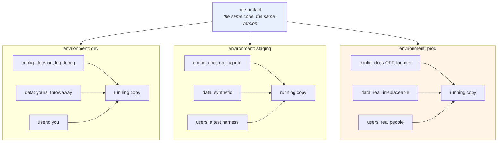

# 1.1 — An environment is a deploy, not a folder

## One-line answer

An environment is **one running copy of your system, with its own configuration, its own data and its own
users** — not a branch, not a directory, not a config file, and the word only means something because those
copies are supposed to be *identical except* in ways you can enumerate.

---

## The story

🎬 **The scene.** A bakery that opens a second shop across town.

Same recipes. Same oven temperature. Same weights, to the gram. The owner is emphatic about it, because the
whole point of a second shop is that people get the same loaf.

What is *not* the same: the address, the till float, the delivery slot, the staff, and the fact that the new
shop's oven is a different model that runs a little hot.

😬 **The naive fix.** The new manager, sensibly, writes his own recipe card for the bread, adjusting the times
for his oven. He photographs it and pins it up. Everything works.

💥 **Why it fails.** Six months later the original shop changes the flour supplier, and the recipe changes by
twenty grams of water. The first shop updates its card. The second shop's card is a *different document now*
— it diverged the day it was written — so nobody thinks to update it, because it is not the same card.

The two shops now make different bread, slowly, in a way neither of them chose. **And nobody can say when it
started**, because there was never a moment where somebody decided the loaves should differ.

💡 **The insight.** **Two copies of a system stay the same only if there is exactly one thing they share and
a short, written list of what they do not.** The moment somebody forks the shared thing to accommodate a local
difference, the copies begin drifting and no single person is doing anything wrong.

---

## The idea in plain language

The word "environment" is used for at least four different things, and only one of them is what an operator
means.

**Not** a folder called `environments/`. **Not** a git branch called `staging`. **Not** a file called
`prod.yaml`. **Not** a Python virtual environment.

An environment is **a deploy**: a running instance of your whole system, with everything it needs to actually
serve somebody. Day 9 used exactly this word — from `https://12factor.net/config`, fetched **2026-08-25**:

> *"An app's config is everything that is likely to vary between deploys (staging, production, developer
> environments, etc)."*

So an environment consists of:

| Part of it | For `pulse` today | For `pulse` by Day 122 |
| --- | --- | --- |
| a running copy of the code | one uvicorn process | a Deployment with several replicas |
| its own configuration | the values from Day 9 | a `ConfigMap` and a `Secret` |
| its own **data** | none yet | a database, a feature store, a model registry |
| its own **users** | you | real people, or a test harness |
| its own **address** | `127.0.0.1:8000` | a hostname, a certificate, an ingress rule |

**The row that makes it an environment rather than a copy is the data.** Two deploys sharing one database are
not two environments; they are one environment with two front doors, and a mistake in the "test" one destroys
the "real" one. [3.2](../03-what-production-promises/3.2-data-is-the-thing-that-cannot-be-promoted.md) is
where that becomes the sharpest rule in the day.

### Why the word needs to exist at all

Because it names the unit that a change *travels through*. A change is written once, and then it appears in
one deploy, then another, then the one with real users. That journey is **promotion**
([section 2](../02-promotion/2.1-build-once-promote-the-artifact.md)), and it only has meaning if the deploys
it travels through are the same in every respect except a named few.

If they are not, then "it worked in staging" is not evidence about production — it is evidence about staging,
which is a different system that happens to have a similar name.

### The tension with Day 9, stated honestly

Day 9 quoted the same page saying something that sounds like the opposite of today's title:

> *"In a twelve-factor app, env vars are granular controls, each fully orthogonal to other env vars. They are
> never grouped together as 'environments', but instead are independently managed for each deploy."*

Both are true and they are about different things.

**"Environment" as a *deploy*** — a running copy with its own data and users — is a real and necessary
concept. That is today.

**"Environment" as a *bundle of settings*** — a file called `production.yaml` that a service selects by name
— is the anti-pattern. It means the settings cannot be varied independently, that a new deploy called
`staging-eu` needs a whole new bundle, and that the values are chosen by a name rather than set per deploy.

**The distinction in one line: an environment is a place, not a preset.**
[1.4](1.4-the-environment-name-is-not-a-switch.md) is entirely about what happens when a codebase forgets
that.

---

## Why Kriya needs it

**[2.1](../02-promotion/2.1-build-once-promote-the-artifact.md)** depends on this being precise: promotion
moves an artifact *between environments*, and if an environment is a branch then promotion is a merge, which
is a completely different and much worse thing.

**Day 15's build artifact** and **Day 16's release** are the objects that travel. What they travel *between*
is defined here.

**Day 31 onwards** gives `pulse` a Kubernetes namespace per environment, which is the first time an
environment is a thing you can point at.

**Day 55's GitOps repository** holds one directory per environment, and the reason that is *not* a
contradiction of this part is worth having straight: the directory holds the *configuration* of a deploy; the
deploy is the running thing.

**Day 96 and Day 122** add data environments — a training set, a feature store, a model registry — and the
question *"does staging share production's data?"* becomes the most consequential architectural question in
this curriculum.

**Day 229's readiness review** asks how many environments there are and what differs between them. A team
that cannot answer in one sentence does not have environments; it has machines.

---

## The mechanism

`pulse` has one environment today. Make a second one, on this machine, and look at what is actually different.

```bash
cd "$(git rev-parse --show-toplevel)"
mkdir -p days/day-010-environments-and-promotion/lab/envs
cd days/day-010-environments-and-promotion/lab

cat > envs/dev.env <<'EOF'
PULSE_ENVIRONMENT=dev
PULSE_HOST=127.0.0.1
PULSE_PORT=8000
PULSE_LOG_LEVEL=debug
PULSE_DOCS_ENABLED=true
PULSE_REQUEST_TIMEOUT=3.0
EOF

cat > envs/staging.env <<'EOF'
PULSE_ENVIRONMENT=staging
PULSE_HOST=127.0.0.1
PULSE_PORT=8001
PULSE_LOG_LEVEL=info
PULSE_DOCS_ENABLED=true
PULSE_REQUEST_TIMEOUT=3.0
EOF

cat > envs/prod.env <<'EOF'
PULSE_ENVIRONMENT=prod
PULSE_HOST=127.0.0.1
PULSE_PORT=8002
PULSE_LOG_LEVEL=info
PULSE_DOCS_ENABLED=false
PULSE_REQUEST_TIMEOUT=3.0
EOF

ls -l envs/
```

**Line by line:**

- Three files, **one per deploy**, each holding the complete set of values for that deploy. Note what they are
  *not*: they are not `base.env` plus three overlay files. Overlays come later (Day 55's Kustomize); starting
  with the complete list makes the differences visible by inspection, which is the entire exercise.
- `cat > file <<'EOF'` with a **quoted** delimiter, so nothing inside is expanded by the shell
  ([Day 9, 1.5](../../../day-009-configuration-and-secrets/parts/01-configuration/1.5-dotenv-is-a-developer-convenience.md)).
- **Every file lists every variable**, including the ones that are identical. That looks redundant and it is
  the point: [4.1](../04-pulse-across-environments/4.1-one-artifact-three-releases.md)'s parity check compares
  *key sets*, and a key that is present in one file and absent from another is exactly the failure it exists
  to catch.
- The ports differ because these three deploys share one machine. **On real infrastructure they would be
  identical**, and the address would differ instead — which is itself a difference between this model and
  reality, worth naming rather than papering over.
- `PULSE_DOCS_ENABLED=false` **only** in prod. Day 9's validator makes that mandatory rather than a
  preference ([Day 9, 5.1](../../../day-009-configuration-and-secrets/parts/05-pulse-configured/5.1-pulse-config-the-settings-object.md)).
- `envs/` rather than three files loose in `lab/`, because these are a set and one directory makes
  "compare them all" a single command.
- **No secrets in any of them.** `PULSE_MODEL_API_KEY` is absent from all three, which is a deliberate
  omission and [3.3](../03-what-production-promises/3.3-the-staging-environment-that-lied.md) comes back to
  what that hides.

Now run two of them at once and look at what a "deploy" actually is:

```bash
cd "$(git rev-parse --show-toplevel)"
LAB=days/day-010-environments-and-promotion/lab
for env in dev prod; do
  ( set -a; . "$LAB/envs/$env.env"; set +a; \
    uv run uvicorn pulse.api:app --host "$PULSE_HOST" --port "$PULSE_PORT" > "/tmp/pulse-$env.log" 2>&1 & )
done
sleep 5
for port in 8000 8002; do
  printf 'port %s -> ' "$port"
  curl -sS "http://127.0.0.1:$port/version"
  printf '   /docs: %s\n' "$(curl -sS -o /dev/null -w '%{http_code}' "http://127.0.0.1:$port/docs")"
done
```

**Line by line:**

- `set -a` — mark every subsequently-assigned variable for export, so `. file` (source) turns `KEY=value`
  lines into exported environment variables. `set +a` turns it off again. **This is the shell's own way to
  read an env file**, and it is worth knowing because it is what a `systemd` unit's `EnvironmentFile=` does.
- `. "$LAB/envs/$env.env"` — the POSIX `source`. Note that this **executes** the file as shell, which is why
  it is safe here (files you wrote, no secrets) and is *not* a general-purpose parser: a line containing a
  backtick would run a command. Day 9's `python-dotenv` does not have that property, which is one reason the
  application reads its own file rather than relying on the shell.
- The whole thing is wrapped in `( … )` — a **subshell**, so the exported variables die with it and the second
  iteration does not inherit the first's values. Without the parentheses, `dev`'s `PULSE_DOCS_ENABLED=true`
  would leak into `prod`'s run and the demonstration would silently be wrong
  ([Day 9, 1.2](../../../day-009-configuration-and-secrets/parts/01-configuration/1.2-the-environment-is-the-interface.md)).
- `--host "$PULSE_HOST" --port "$PULSE_PORT"` — uvicorn takes these as arguments; `pulse` also reads them into
  its settings object. **They are supplied twice and that is a real wart**, honest to leave visible:
  [4.2](../04-pulse-across-environments/4.2-the-environment-banner.md) discusses whether a service should bind
  what it was configured with.
- `sleep 5` for two processes rather than 3 for one — starting two on a four-core machine is slower
  (Addendum 02 §3).

```text
port 8000 -> {"service":"pulse","version":"0.1.0","model_version":"none","environment":"dev"}
   /docs: 200
port 8002 -> {"service":"pulse","version":"0.1.0","model_version":"none","environment":"prod"}
   /docs: 404
```

**Same `version`. Different `environment`. Different behaviour.** That is an environment: one artifact, two
running copies, differing only in configuration — and the difference is *visible from outside*, which is what
makes [4.1](../04-pulse-across-environments/4.1-one-artifact-three-releases.md)'s checks possible.

Now the part people skip — **enumerate the differences**:

```bash
cd "$(git rev-parse --show-toplevel)/days/day-010-environments-and-promotion/lab"
diff <(sort envs/dev.env) <(sort envs/prod.env) || true
echo '--- keys only ---'
diff <(cut -d= -f1 envs/dev.env | sort) <(cut -d= -f1 envs/prod.env | sort) && echo "key sets are identical"
```

**Line by line:**

- `diff <(cmd1) <(cmd2)` — **process substitution**: each `<(…)` becomes a filename that `diff` can read, so
  two command outputs are compared without temporary files.
- `sort` before comparing, so a re-ordered file is not reported as a difference. **The order of environment
  variables is not meaningful**, and a diff that reports it teaches people to ignore diffs.
- The first `diff` shows **value** differences — the ones you chose.
- The second compares **key sets only**, using `cut -d= -f1`. This is the one that matters, and it is the
  seed of [4.1](../04-pulse-across-environments/4.1-one-artifact-three-releases.md)'s parity check: a *value*
  differing is a decision; a *key* existing in one deploy and not another is a setting that has never been
  exercised where it matters.
- `|| true` on the first, because `diff` exits `1` when files differ, which is the expected outcome here
  ([Day 4, 3.1](../../../day-004-linux-for-operators-i/parts/03-exit-codes/3.1-the-exit-code-is-the-whole-return-value.md)).

```text
2c2
< PULSE_DOCS_ENABLED=true
---
> PULSE_DOCS_ENABLED=false
4c4
< PULSE_ENVIRONMENT=dev
---
> PULSE_ENVIRONMENT=prod
5c5
< PULSE_LOG_LEVEL=debug
---
> PULSE_LOG_LEVEL=info
6c6
< PULSE_PORT=8000
---
> PULSE_PORT=8002
--- keys only ---
key sets are identical
```

**Four differences, all deliberate, all namable.** That short list *is* the relationship between the two
environments, and a team that can produce it in one command has environments rather than machines.



Clean up before moving on:

```bash
pkill -f 'pulse.api:app'
netstat -ano | grep -E ':(8000|8001|8002).*LISTENING' || echo "all clear"
```

**Line by line:**

- `pkill -f` matches the full command line, because the process is `python`
  ([Day 4, 1.3](../../../day-004-linux-for-operators-i/parts/01-the-process/1.3-reading-ps-and-finding-your-service.md)).
- **Verify with `netstat` rather than trusting `pkill`.** Two servers were started; one surviving would make
  the next part's measurement meaningless (Day 8's trap 7).

---

## When it breaks

**The branch that became an environment.** The most common structural mistake:

```text
$ git branch -a
* main
  staging
  production
$ git log --oneline main..production
a91f0c2 hotfix: bump timeout for the big customer
7d2e8b1 hotfix: disable the new validator
```

**What it says:** production has two commits that main does not.
**What it actually means:** **production is running different code**, so nothing tested on `main` is evidence
about it. The branches were meant to represent environments; instead they became three diverging codebases,
and every fix now has to be applied — and conflict-resolved — three times.
**The smallest fix:** one branch, one artifact, and configuration outside the code
([Day 9, 1.1](../../../day-009-configuration-and-secrets/parts/01-configuration/1.1-what-configuration-actually-is.md)).
Day 12 covers the branching model that supports it.
**Why it happens to good teams:** the first hotfix was genuinely urgent, and applying it only to production
was genuinely faster. The second one was easier because the first had already happened.

**The shared database.** The one that is not a mistake until it is:

```text
$ psql -h db.internal -U pulse_staging -c "select count(*) from tickets;"
 count
-------
 148213
```

...on the staging deploy.

**What it says:** staging has a hundred and forty-eight thousand tickets.
**What it actually means:** it is pointing at production's database. **Staging and production are one
environment**, and the next migration run in "staging" alters production's schema. This is
[3.2](../03-what-production-promises/3.2-data-is-the-thing-that-cannot-be-promoted.md)'s subject and it is the
single most damaging version of getting this word wrong.
**The smallest fix:** separate data, immediately, even if the staging data is empty and useless. **An empty
staging database is a real environment; a shared one is a loaded weapon.**
**How to detect it in thirty seconds:** compare the row counts, or the connection host, or write a row in
staging and look for it in production. Do it now rather than discovering it during a migration.

**The environment nobody can name.** The drift, in its natural habitat:

```text
$ kubectl get namespaces
NAME              STATUS   AGE
default           Active   412d
pulse-dev         Active   380d
pulse-staging     Active   380d
pulse-prod        Active   380d
pulse-staging-2   Active   211d
pulse-demo        Active   194d
tmp-migration     Active    97d
```

**What it says:** seven namespaces.
**What it actually means:** three are environments and four are archaeology. **Nobody knows what
`pulse-staging-2` is for**, whether it holds real data, or whether deleting it breaks something. It is
consuming resources, it may be running a very old version with known vulnerabilities, and it is almost
certainly configured by hand.
**The smallest fix:** a written list of the environments that exist and what each is for, and delete
everything not on it — after finding out, which is the expensive part.
**Why the list has to exist before the sprawl:** producing it retroactively means auditing seven things
nobody remembers creating.

**The "environment" that was a directory.** The vocabulary failure:

```text
$ ls deploy/
environments/
$ ls deploy/environments/
dev/  staging/  prod/
$ kubectl get deploy -n pulse-prod
No resources found in pulse-prod namespace.
```

**What it says:** three directories of configuration and nothing running.
**What it actually means:** somebody built the *description* of three environments and only ever applied one.
**A directory is not a deploy**, and the gap between what is described and what is running is where every
GitOps incident lives (Day 55's drift detection exists for exactly this).
**The smallest fix:** apply it, or delete the directory. A described-but-nonexistent environment is worse than
neither, because people plan against it.

---

## In production

**What a professional writes instead of the teaching version.** They keep the number of environments **small
and named**, and they write down, in one table, what differs between them — the same table this part produced
with `diff`, maintained deliberately rather than discovered. Three is the usual answer: one for development,
one that is production-shaped for verification, and production. Every additional one has to justify itself,
because each is a copy of the data problem, the credential problem and the cost.

**What degrades at scale.** Not the count — the **variance**. At three environments a person can hold the
differences in their head. At thirty (a per-developer environment, a per-pull-request environment, a
per-region production) nobody can, and the only workable model is that environments are *generated* from one
template plus a small parameter set, so the differences are structurally bounded rather than
discovered. That is what Day 53's Helm chart and Day 55's Kustomize overlays are actually for — not to reduce
typing, but to make the difference between two environments a small, reviewable object.

**The failure that only shows with real traffic.** An environment that is identical in configuration and
different in *scale*. Staging runs one replica with a hundred rows; production runs nine replicas with
fourteen million. Every setting matches, the parity check is green, and a query that is instant in one is a
table scan in the other. **Configuration parity is necessary and nowhere near sufficient** — which is
[3.3](../03-what-production-promises/3.3-the-staging-environment-that-lied.md)'s whole argument, and the
reason "it worked in staging" is a statement about staging.

**The review comment a senior engineer leaves.** *"This PR adds `if ENVIRONMENT == 'staging'` in the retry
logic. That means staging is now running a different algorithm from production, so anything we verify there is
no longer evidence. If the retry behaviour needs to differ, make it a setting with a value per deploy; if it
does not, delete the branch."*

**The signal you would alert on.** Not on environments existing — but two things are worth exposing and both
come free once `environment` is a settings field
([Day 9, 5.1](../../../day-009-configuration-and-secrets/parts/05-pulse-configured/5.1-pulse-config-the-settings-object.md)):
**every log line and every metric carries the environment as a label**, and **an alert fires when a production
selector matches no data** (Day 74), which is the detector for
[Day 9, 3.4](../../../day-009-configuration-and-secrets/parts/03-fail-fast/3.4-the-service-that-started-with-the-wrong-config.md)'s
mislabelled deploy. You would **not** alert on a deploy appearing with an unrecognised environment name —
Day 9's `Literal` makes that impossible at startup, which is better than detecting it afterwards.

**Blast radius.** This part starts two uvicorn processes on loopback ports 8000 and 8002 and writes three
files under `lab/envs/`. The new idea — *running more than one copy of `pulse` at once* — is a real change:
two processes can now compete for the same port, the same log path, and (from Day 96) the same data. Worst
case today: a stale process on 8000 or 8002 makes a later measurement wrong, which is Day 8's trap 7. What
bounds it: loopback binds only, distinct ports per environment, a `pkill` and a **verifying `netstat`** at the
end of every block, and no data of any kind. Who can trigger it: you.

**Cost.** `0` model calls, `0` tokens, `0` CI minutes, `0` new packages, `0` network. RAM: two uvicorn
processes at roughly 60 MB each, briefly — 120 MB against Addendum 02's ~5 GB budget. Disk: three files under
a kilobyte, plus two small logs in `/tmp`.

**The interview question.** *"What is an environment?"* The answer that separates vocabulary from
understanding: *"A deploy — one running copy of the system with its own configuration, its own data, its own
users and its own address. Not a branch and not a directory. The data is the part that makes it a real
boundary: two deploys sharing a database are one environment with two front doors, and a migration run in the
'test' one alters the real one. The reason the word matters is that promotion only means something if the
environments are identical except in ways I can list — so the test I apply is whether somebody can produce
that list in one command. If they cannot, 'it worked in staging' is a statement about staging."*

---

## Check yourself

```bash
cd "$(git rev-parse --show-toplevel)/days/day-010-environments-and-promotion/lab"
diff <(cut -d= -f1 envs/dev.env | sort) <(cut -d= -f1 envs/prod.env | sort) && echo "key sets identical"
diff <(sort envs/dev.env) <(sort envs/prod.env) || true
```

Identical key sets, and a short list of value differences. **Say which of those differences is enforced by a
validator rather than by discipline, and which one exists only because these three deploys share a machine.**

**Say out loud, without scrolling up:** *Give the four things an environment consists of, say which one makes
it a real boundary rather than a copy, and explain the difference between "environment as a place" and
"environment as a preset".*
