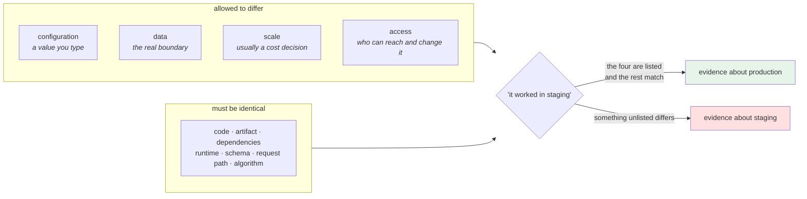

# 1.2 — The four things that differ, and the ones that must not

## One-line answer

Between two environments, exactly four kinds of thing are *allowed* to differ — **configuration, data,
scale and access** — and everything else differing is drift, because the value of having a second environment
comes entirely from the list being short and written down.

---

## The story

🎬 **The scene.** A flight simulator.

It is worth an enormous amount of money and it exists for one reason: what a pilot learns in it has to
transfer. So the list of differences between the simulator and the aircraft is short, deliberate and known to
everybody: it does not actually leave the ground, the weather is chosen rather than encountered, and the
instructor can freeze time.

Everything else — every switch, every warning tone, the exact position of the fuel cut-off, the way the yoke
loads up — is identical, on purpose, at great expense.

😬 **The naive fix.** A cheaper simulator. The switches are in the same order but the panel layout is a bit
different, because that was the display they could get. It teaches the procedures perfectly well.

💥 **Why it fails.** Not in the simulator, where everything goes fine. It fails in the aircraft, at night,
when a pilot reaches for a switch without looking — because reaching without looking is the entire skill the
training was for, and **the one place the copies differed was the place the skill lives.**

Nobody was careless. The panel difference was small, documented, and known. **It was just not on the list of
things anybody was tracking**, because the list was never written.

💡 **The insight.** **A copy is only useful for what it copies.** The differences are not the problem — some
are unavoidable, and some are the point. The problem is a difference that nobody enumerated, because the value
of the copy is exactly the confidence you place in it, and unlisted differences are unpriced risk.

---

## The idea in plain language

[1.1](1.1-an-environment-is-a-deploy-not-a-folder.md) said an environment is a deploy. This part says which
parts of a deploy are allowed to vary.

**Four things may differ.**

**1 — Configuration.** The values from Day 9: addresses, ports, log level, timeouts, feature switches,
credentials. This is the category the whole of Day 9 built for, and it is the only one of the four that you
change by *typing a value*.

**2 — Data.** Different databases, different contents, different sizes. Production has real records; staging
has synthetic or old ones; development has a handful. **This is the difference that makes environments real**
and it is the one that cannot be made to match without becoming a data-governance problem
([3.2](../03-what-production-promises/3.2-data-is-the-thing-that-cannot-be-promoted.md)).

**3 — Scale.** How many replicas, how much memory, how much traffic. Production runs nine copies with four
gigabytes each; staging runs one with five hundred megabytes. **This one is almost always a cost decision and
almost never a considered one**, and it is where "it worked in staging" quietly stops being true
([3.3](../03-what-production-promises/3.3-the-staging-environment-that-lied.md)).

**4 — Access.** Who can reach it, who can change it, who is paged when it breaks. Development is reachable by
you; production is reachable by the world and changeable by almost nobody. This is the category that grows
teeth on Day 38 (RBAC) and Day 39 (network policy).

**Everything else must not differ**, and here is the list that matters most, because each entry is a
"we'll get away with it" that eventually does not:

| Must be identical | What goes wrong when it is not |
| --- | --- |
| **the code** | "it worked in staging" is evidence about a different program |
| **the artifact** | a rebuild is a different object even from identical source — [2.1](../02-promotion/2.1-build-once-promote-the-artifact.md) |
| **dependency versions** | a bug fixed in one library version and present in another, in the two deploys you are comparing |
| **the operating system and runtime** | Day 21's whole argument; a Python patch release changes `ssl` defaults |
| **the schema** | a migration that ran in one place and not the other is the classic Friday incident |
| **the request path shape** | a proxy in front of production and none in front of staging means TLS, headers and timeouts all differ (Day 8) |
| **the algorithm** | `if environment == "prod"` — [1.4](1.4-the-environment-name-is-not-a-switch.md) |

### Why the list is short on purpose

You could argue that scale *should* be identical too, and in a world with no budget it would be. The list of
four is not a statement about what is ideal — it is a statement about **what you have chosen to accept, and
therefore what you must remember when reading a green test result.**

That is the real function of the list: it is not a policy, it is **a set of caveats attached to every claim
you make about production based on evidence from somewhere else.** When staging passes and production fails,
the cause is on this list, and if the list is written down the investigation is a lookup rather than a search.

### The fifth thing, which is not allowed and always happens

**Time.** Environments drift apart *because they were changed at different moments*. Production was deployed
on Tuesday; staging on Thursday; the developer's copy has an uncommitted change from an hour ago.

This is not a category of difference so much as a *mechanism* by which the other categories appear, and it is
the thing promotion exists to control ([section 2](../02-promotion/2.1-build-once-promote-the-artifact.md)).
An environment is not a place in space; **it is a place in the sequence a change travels through**, and the
whole of tomorrow's phase — version control, CI, releases — is about making that sequence visible.

---

## Why Kriya needs it

**[4.1](../04-pulse-across-environments/4.1-one-artifact-three-releases.md)** builds a check that compares two
environments, and the check is only meaningful because this part says which differences are *expected*. A
comparison with no allowlist reports everything and gets ignored.

**Day 15's lockfile** makes "dependency versions are identical" a mechanical fact rather than a hope, and
**Day 22's image** does the same for the operating system and runtime.

**Day 29's migrations** make "the schema is identical" an ordering problem with a real failure mode.

**Day 42's resource limits** are where the *scale* difference becomes explicit and priced rather than
accidental.

**Day 90's training/serving skew** is this part's list applied to a model: the features computed in training
and the features computed in serving must be identical, and every one of the four allowed differences is a
way they stop being. **The plan names it as trap #3 — the model that is fine offline.**

**Day 229's readiness review** asks for this table for `pulse`, filled in.

---

## The mechanism

Produce the table for `pulse`, mechanically, from what the deploys actually report — because a table you wrote
from memory is a table that agrees with your beliefs.

Start the three environments from [1.1](1.1-an-environment-is-a-deploy-not-a-folder.md):

```bash
cd "$(git rev-parse --show-toplevel)"
LAB=days/day-010-environments-and-promotion/lab
for env in dev staging prod; do
  ( set -a; . "$LAB/envs/$env.env"; set +a; \
    uv run uvicorn pulse.api:app --host "$PULSE_HOST" --port "$PULSE_PORT" > "/tmp/pulse-$env.log" 2>&1 & )
done
sleep 6
```

**Line by line:**

- The same subshell-and-source pattern as [1.1](1.1-an-environment-is-a-deploy-not-a-folder.md), so no
  variable leaks between iterations.
- **Three** processes now, on a four-core machine (Addendum 02 §3). `sleep 6` rather than 5, and this is the
  most this day will run at once — the checklist stops them before anything is measured for timing.

Now interrogate each one and build the row:

```bash
cd "$(git rev-parse --show-toplevel)"
printf '%-10s %-9s %-8s %-7s %-9s %-10s\n' env version environment docs loglevel pid
for port in 8000 8001 8002; do
  body=$(curl -sS "http://127.0.0.1:$port/version")
  envname=$(echo "$body" | grep -o '"environment":"[^"]*"' | cut -d: -f2 | tr -d '"')
  version=$(echo "$body" | grep -o '"version":"[^"]*"' | cut -d: -f2 | tr -d '"')
  docs=$(curl -sS -o /dev/null -w '%{http_code}' "http://127.0.0.1:$port/docs")
  level=$(grep -o '"log_level":"[^"]*"' "/tmp/pulse-$envname.log" | head -1 | cut -d: -f2 | tr -d '"')
  pid=$(pgrep -f "port $port" | head -1)
  printf '%-10s %-9s %-8s %-7s %-9s %-10s\n' ":$port" "$version" "$envname" "$docs" "$level" "$pid"
done
```

**Line by line:**

- Each column is read from **the running service**, not from the file that configured it. That distinction is
  the entire method: the file says what you *intended*; the service says what *is*, and
  [Day 9, 3.4](../../../day-009-configuration-and-secrets/parts/03-fail-fast/3.4-the-service-that-started-with-the-wrong-config.md)
  is the failure where those two disagree.
- `grep -o '"key":"[^"]*"' | cut -d: -f2 | tr -d '"'` — extract a JSON string field with no dependencies. It
  is crude; a real tool would use `jq` or Python. **In a five-line diagnostic, crude and dependency-free is
  the right trade**, and saying so is better than pretending it is elegant.
- `log_level` comes from the **startup config line** that Day 9 added, which is the first time that line pays
  for itself in a tool rather than in an investigation.
- `printf` with fixed widths, so the three rows align and the eye does the comparison. **The alignment is the
  product.**
- `pgrep -f "port $port"` — find the process by its command line, since three identical `python` processes are
  otherwise indistinguishable
  ([Day 4, 1.3](../../../day-004-linux-for-operators-i/parts/01-the-process/1.3-reading-ps-and-finding-your-service.md)).

```text
env        version   environment docs    loglevel  pid
:8000      0.1.0     dev         200     debug     41208
:8001      0.1.0     staging     200     info      41219
:8002      0.1.0     prod        404     info      41231
```

**Read the `version` column.** All three say `0.1.0`. That single fact is what makes the rest of the table
meaningful: **the same artifact is running in three places**, so every other difference is configuration, and
configuration is the category you are allowed to vary.

Now write the caveat table — the actual deliverable:

```bash
cd "$(git rev-parse --show-toplevel)/days/day-010-environments-and-promotion/lab"
cat > differences.md <<'EOF'
# What differs between pulse's environments, and what must not

| Category | dev | staging | prod | Deliberate? |
| --- | --- | --- | --- | --- |
| **configuration** — docs | on | on | off | yes — enforced by a validator (Day 9, 5.1) |
| **configuration** — log level | debug | info | info | yes |
| **configuration** — port | 8000 | 8001 | 8002 | **no** — an artifact of sharing one machine |
| **data** | none | none | none | **not yet real** — pulse is stateless until Day 96 |
| **scale** | 1 process | 1 process | 1 process | **not yet real** — Day 41 |
| **access** | loopback | loopback | loopback | **not yet real** — Day 37 |
| code | identical | identical | identical | must not differ |
| artifact | identical | identical | identical | must not differ — Day 15 |
| dependency versions | identical | identical | identical | must not differ — uv.lock, Day 15 |
| runtime / OS | identical | identical | identical | must not differ — Day 21 |
| schema | n/a | n/a | n/a | must not differ — Day 29 |
| request path | direct | direct | direct | must not differ — Day 37 adds a proxy to one |

**Three of the four allowed differences are not real yet.** That is worth knowing: today's environments are
much more similar than any real set will be, so every check built today is being built under easy conditions.
EOF
cat differences.md
```

**Line by line:**

- `differences.md` lives in `lab/` today and **belongs in `docs/` by Day 229**. Writing it here first is the
  draft.
- The `Deliberate?` column is the one that earns its keep: it separates *"we chose this"* from *"this is an
  accident of the setup"*. The port row is the honest example — it differs for a reason that will not exist
  once these are three machines.
- **Three rows say "not yet real".** Naming what is *not* yet different is as valuable as naming what is:
  it tells you which of today's conclusions will need revisiting, and it is the honest answer to "why does this
  seem so easy".
- The bottom note states the limitation of the whole day. **A model that flatters itself teaches nothing.**

```text
| **configuration** — port | 8000 | 8001 | 8002 | **no** — an artifact of sharing one machine |
| **data** | none | none | none | **not yet real** — pulse is stateless until Day 96 |
...
**Three of the four allowed differences are not real yet.**
```



Stop everything:

```bash
pkill -f 'pulse.api:app'
netstat -ano | grep -E ':(8000|8001|8002).*LISTENING' || echo "all clear"
```

**Line by line:**

- Three processes were started; **verify with `netstat` rather than trusting `pkill`**, because a survivor
  makes the next part's first measurement wrong.

---

## When it breaks

**The dependency that was not identical.** The one the lockfile exists to prevent:

```text
$ # staging
$ uv run python -c "import httpx2; print(httpx2.__version__)"
2.12.0
$ # production, deployed three weeks earlier
$ uv run python -c "import httpx2; print(httpx2.__version__)"
2.11.4
```

**What it says:** two different library versions.
**What it actually means:** the deploys were built at different moments from a dependency specification that
was not exact, so each resolved to whatever was newest that day. **Every test result from staging is about a
program production is not running.**
**The smallest fix:** an exact `==` pin and a committed lockfile — which this project has had since Day 0, and
Day 15 makes it a build-time guarantee rather than a convention.
**Why it is subtle:** both deploys are "up to date" with `main`. The code is identical. The *program* is not,
because a program is code plus everything it imports.

**The schema that ran in one place.** The Friday classic:

```text
$ # production
psycopg.errors.UndefinedColumn: column "priority_v2" of relation "tickets" does not exist
LINE 1: INSERT INTO tickets (subject, body, priority_v2) VALUES ...
```

**What it says:** a column is missing.
**What it actually means:** the migration ran in staging — where the feature was tested and worked — and the
production deploy shipped the code without it. **The code and the schema are two artifacts that must move
together**, and nothing in a normal deployment pipeline enforces that unless you build it.
**The smallest fix:** run the migration. **The real fix:** make the migration part of the release, with an
ordering rule, which is Day 29.
**Why "must be identical" includes the schema:** because the schema is part of the program's contract with
its data, and a program plus a different schema is a different program.

**The proxy in front of one and not the other.** The difference that changes the request:

```text
$ # staging — direct to the service
$ curl -sS -o /dev/null -w '%{http_code} %{http_version}\n' http://127.0.0.1:8001/predict
200 1.1
$ # production — behind an ingress
$ curl -sS -o /dev/null -w '%{http_code} %{http_version}\n' https://pulse.example.com/predict
502 2
```

**What it says:** a `502` in production and a `200` in staging.
**What it actually means:** production's request path has a component staging's does not, and that component
has its own timeouts, its own header handling, its own idle behaviour and its own opinion about HTTP/2 — every
one of which Day 8 covered
([Day 8, 2.4](../../../day-008-http-and-tls/parts/02-the-connection/2.4-the-idle-timeout-race-and-the-phantom-502.md)).
**Nothing about the application differs.**
**The smallest fix:** put the same proxy in front of staging, even if it is one replica and a self-signed
certificate.
**The rule of thumb worth keeping:** **the request path is part of the system.** An environment that omits a
hop is not a smaller copy of production; it is a different topology.

**The difference nobody wrote down.** The one this part exists to prevent:

```text
$ diff <(cut -d= -f1 envs/staging.env | sort) <(cut -d= -f1 envs/prod.env | sort)
> PULSE_MODEL_API_KEY
```

**What it says:** production has a setting staging does not.
**What it actually means:** the code path that uses that credential **has never run in staging**. It is not
that staging has the wrong value — staging has never exercised the branch at all, so every test that touched
it took the "not configured" path.
**The smallest fix:** give staging its own credential, even a low-privilege or throwaway one
([Day 9, 4.4](../../../day-009-configuration-and-secrets/parts/04-secrets/4.4-a-secret-has-a-lifetime.md)'s
per-consumer argument).
**Why key-set parity is the check that matters:** a *value* differing is a decision you made; a *key* missing
is a code path with no evidence behind it, and
[4.1](../04-pulse-across-environments/4.1-one-artifact-three-releases.md) is built on exactly this diff.

---

## In production

**What a professional writes instead of the teaching version.** The table exists as a document, is reviewed
when it changes, and — the part that makes it survive — **something checks it.** Configuration parity is
mechanical ([4.1](../04-pulse-across-environments/4.1-one-artifact-three-releases.md)); artifact identity is
mechanical (Day 15's digest); dependency identity is mechanical (the lockfile). Scale and data are not, and
those are the two rows that carry a written caveat instead: *"staging runs one replica with synthetic data, so
performance and data-shape conclusions do not transfer."* **The value of writing that sentence down is that it
gets quoted during incident reviews instead of rediscovered.**

**What degrades at scale.** The number of *unlisted* differences, and it grows with the number of people
rather than the number of environments. Each engineer makes a small local accommodation — a feature switch
left on in staging, a replica count raised for a load test and never lowered, a library pinned differently to
work around something — and none is wrong. **The professional counter-measure is not discipline; it is
generation**: environments produced from one template plus a small parameter set, so an unlisted difference
is not expressible. Day 53 and Day 55 build it.

**The failure that only shows with real traffic.** The scale row, every time. A query with no index is
instant on ten thousand rows and a table scan on fourteen million; a connection pool of ten is ample at five
requests per second and a queue at five hundred
([Day 8, 2.2](../../../day-008-http-and-tls/parts/02-the-connection/2.2-the-connection-pool-and-its-limits.md));
a memory leak is invisible in an environment that restarts daily. **Every one of these passes staging.** The
honest response is not to make staging bigger — it is to accept that the caveat exists and to build the
detection in production instead, which is what Phases 7 and 8 are for.

**The review comment a senior engineer leaves.** *"This adds `PULSE_FEATURE_NEW_ROUTER` to the production
config only. That means the router we are about to ship has never run under any test, in any environment, in
any pipeline — the staging runs all took the other branch. Add it to staging first, let it soak, then
production. And add the key-set parity check to the pipeline, because this should not have needed a human to
notice."*

**The signal you would alert on.** One, and it is genuinely valuable: **the count of configuration keys that
differ between environments, excluding an explicit allowlist.** Not a page — a number on a dashboard that
should be zero and a report when it is not. The related one, from Day 15 onwards, is **artifact identity**:
the digest running in staging and the digest running in production, side by side, with the promotion history
between them. You would **not** alert on a value differing; values are supposed to differ, and an alert that
fires on the normal case is one people mute.

**Blast radius.** This part starts **three** uvicorn processes at once, which is the most this day asks for
and is deliberately close to what a four-core machine handles comfortably (Addendum 02 §4 — `core` profile
only, nothing else running). Worst case: the machine is slow while all three are up, and a survivor holds a
port. What bounds it: loopback binds, three distinct ports, a `pkill` and a **verifying `netstat`** at the end
of the block, and no data or credentials anywhere. Who can trigger it: you.

**Cost.** `0` model calls, `0` tokens, `0` CI minutes, `0` new packages, `0` network. RAM: **three** uvicorn
processes at roughly 60 MB — about 180 MB peak. Disk: one small Markdown file and three logs in `/tmp`.

**The interview question.** *"What is allowed to differ between staging and production?"* The answer that
shows you have been burned: *"Four things — configuration, data, scale and access — and everything else is
drift. The reason to keep the list short and written is that it is not really a policy, it is the set of
caveats on every claim I make about production based on evidence from staging. When staging passes and
production fails, the cause is on that list, so having it written turns an investigation into a lookup. The
two rows I watch hardest are dependency versions, because 'same code' is not 'same program' and an inexact pin
means two deploys resolved on different days, and the request path, because a proxy in front of one and not
the other means different timeouts, different header handling and different HTTP versions — none of which is
in the application at all."*

---

## Check yourself

```bash
cd "$(git rev-parse --show-toplevel)/days/day-010-environments-and-promotion/lab"
cat differences.md
diff <(cut -d= -f1 envs/staging.env | sort) <(cut -d= -f1 envs/prod.env | sort) && echo "key sets identical"
```

A table with a `Deliberate?` column and three rows that say "not yet real", and a key-set comparison that
passes.

**Say out loud, without scrolling up:** *Name the four things allowed to differ, say which one makes an
environment a real boundary, and give one thing that must be identical which people routinely let drift —
with the failure it causes.*
