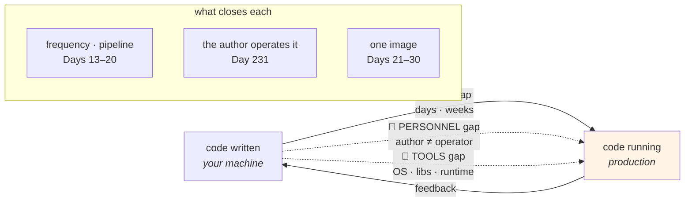

# 1.3 — Dev/prod parity and the three gaps

## One-line answer

The distance between where code is written and where it runs has three measurable components — **the time
gap**, **the personnel gap** and **the tools gap** — and every one of them is a way for a difference to enter
without anybody deciding to introduce one.

---

## The story

🎬 **The scene.** A bicycle shop that also does repairs.

The mechanic who builds a wheel is the one who takes the call when it comes back untrue three weeks later. He
hears about every wheel he has ever built, from the person riding it, in his own workshop, with the wheel in
his hands.

😬 **The naive fix.** The shop grows. Building moves to a unit out of town, where there is room and a better
press. Repairs stay at the front. It is more efficient, and it is obviously the right call.

💥 **Why it fails.** The wheel-builder stops hearing anything. A batch of spokes that come slightly short
produces wheels that are fine on the stand and go untrue in a month — and the feedback goes to the repair
counter, five miles away, where it is logged as "wheel repair" and looks like ordinary wear.

**Nobody has the information.** The repairer sees twelve similar failures and does not know they came from one
batch. The builder sees no failures at all and concludes the wheels are good. The signal exists, distributed
across two rooms, and there is nobody standing where it adds up.

💡 **The insight.** **Distance between building and running is not measured in miles — it is measured in how
long the feedback takes, how many people it passes through, and how different the two settings are.** Each of
those is a place information gets lost, and losing information is how a system develops problems nobody chose.

---

## The idea in plain language

The twelve-factor formulation of this is precise and it is worth quoting rather than paraphrasing. From
`https://12factor.net/dev-prod-parity`, fetched **2026-08-25**:

> *"Historically, there have been substantial gaps between development (a developer making live edits to a
> local deploy of the app) and production (a running deploy of the app accessed by end users). These gaps
> manifest in three areas:*
>
> *The **time gap**: A developer may work on code that takes days, weeks, or even months to go into
> production.*
> *The **personnel gap**: Developers write code, ops engineers deploy it.*
> *The **tools gap**: Developers may be using a stack like Nginx, SQLite, and OS X, while the production deploy
> uses Apache, MySQL, and Linux."*

And the summary table on the same page:

| | Traditional app | Twelve-factor app |
| --- | --- | --- |
| Time between deploys | Weeks | Hours |
| Code authors vs code deployers | Different people | Same people |
| Dev vs production environments | Divergent | As similar as possible |

**Each gap is a different failure and each has a different fix**, which is why they are three rather than one.

### The time gap

A change written today and deployed in six weeks carries six weeks of other people's changes with it. When
something breaks, the set of candidate causes is everything that happened in six weeks, and the person who
wrote the failing line has forgotten the context.

**The failure it causes is diagnostic**, not functional: the code is no worse, the *investigation* is
enormously worse. And it compounds — a long feedback loop makes people batch changes, which makes each deploy
riskier, which makes people deploy less often. Day 20 measures this directly as **lead time for change**, one
of the four delivery metrics.

**The fix is frequency**, and the fix is uncomfortable: deploy smaller changes more often, which requires
everything in Phase 2 — a pipeline that can genuinely fail (Day 13), gates that refuse rather than warn (Day
14), and a rollback you have rehearsed (Day 19).

### The personnel gap

When the person who wrote the code is not the person who runs it, the information that would improve the code
arrives at somebody who cannot act on it, and the information that would improve the running arrives at
somebody who is not there.

**This is the wheel shop.** It is not about blame or ownership models — it is about where the signal lands.
Day 1 made the same argument as the difference between *"does it work"* and *"is it working"*
([Day 1, 1.2](../../../day-001-what-operations-actually-is/parts/01-what-ops-is/1.2-does-it-work-versus-is-it-working.md)).

**The fix is not organisational in this curriculum** — you are one person, so the gap is zero by construction.
What matters is noticing that **this project's structure removes the gap artificially**, and that a real team
has to work for it. Day 231's handover day is where that becomes concrete.

### The tools gap

Different operating system, different database, different web server, different Python patch version,
different TLS library. This is the one this curriculum can actually close, and Phase 3 exists to close it: a
container image is a way of making the tools identical by construction rather than by agreement (Day 21).

**Before containers**, the honest position is that the tools gap is real and you are managing it with
discipline — an exact `==` pin on every dependency, a committed lockfile, a stated Python version. **That
discipline is what `pyproject.toml` and `uv.lock` have been doing since Day 0**, and it is worth knowing
that they are a partial answer rather than a complete one: they pin your Python packages and nothing about the
operating system, the C libraries underneath them, or the TLS stack
([Day 8, 3.1](../../../day-008-http-and-tls/parts/03-tls/3.1-what-tls-actually-promises.md)).

### Why parity is not "make them identical"

It is worth saying plainly: **you cannot close the gaps completely, and trying is a bad use of effort.**
Production has real users and real data; your laptop does not and must not
([3.2](../03-what-production-promises/3.2-data-is-the-thing-that-cannot-be-promoted.md)). Production runs nine
replicas; your laptop has four cores.

The goal is not identity. The goal is that **the remaining differences are the four from
[1.2](1.2-the-four-things-that-differ.md), they are written down, and everything else has been made identical
by a mechanism rather than by intention.**

---

## Why Kriya needs it

**Day 13 through Day 20** are the time gap, made small: a pipeline, gates, releases, rollback, and then a
measurement of whether it worked.

**Day 21 through Day 30** are the tools gap, closed: an image that carries the runtime and the libraries, so
"works on my machine" becomes "works in this image".

**Day 90's training/serving skew** is the tools gap for a model — features computed one way in training and
another way in serving — and the plan names it as trap #3.

**Day 118's shadow deployment** and **Day 120's drift monitoring** are what you build once you accept that the
gap can never be fully closed: you stop trying to make the copy perfect and start measuring the real thing.

**Day 20** computes lead time and deployment frequency from this repository's own git history, which turns the
time gap from an adjective into a number.

---

## The mechanism

Measure the three gaps for this project, right now. Two of them are computable from the repository; one is a
statement you write down.

**The time gap**, from git:

```bash
cd "$(git rev-parse --show-toplevel)"
echo "commits so far      : $(git rev-list --count HEAD)"
echo "first commit        : $(git log --reverse --format='%ad' --date=short | head -1)"
echo "most recent commit  : $(git log -1 --format='%ad' --date=short)"
echo "days with a commit  : $(git log --format='%ad' --date=short | sort -u | wc -l)"
echo "--- gap between consecutive commits, in days ---"
git log --reverse --format='%at' | uv run python -c "
import sys
stamps = [int(line) for line in sys.stdin if line.strip()]
gaps = [(b - a) / 86400 for a, b in zip(stamps, stamps[1:])]
if gaps:
    print(f'  n={len(gaps)}  min={min(gaps):.2f}  max={max(gaps):.2f}  mean={sum(gaps)/len(gaps):.2f}')
else:
    print('  not enough commits yet')
"
```

**Line by line:**

- `git rev-list --count HEAD` — the number of commits reachable from the current branch. The simplest possible
  measure of how much has happened.
- `git log --reverse --format='%ad' --date=short | head -1` — the **oldest** commit's date. `--reverse` flips
  the order, and `head -1` then gives the first rather than the last, which is one fewer moving part than
  `tail`.
- `%at` — the author date as a **Unix timestamp**, which is a number you can subtract. `%ad` is formatted for
  humans and is not arithmetic-friendly; picking the right format specifier is the difference between a
  one-liner and a parsing exercise.
- `zip(stamps, stamps[1:])` — pairs each commit with the next one, the standard idiom for consecutive
  differences.
- `/ 86400` converts seconds to days. **Days, not hours**, because Principle 17 forbids clocks in the teaching
  and this is a measurement of *the project's own history* rather than a pace being prescribed — a distinction
  worth being deliberate about.
- `f'{x:.2f}'` — two decimal places, so a gap of a fraction of a day is visible rather than rounding to zero.
- **This is Day 20's metric, computed nine days early**, on purpose: having the number before the day that
  formalises it means Day 20 is about interpretation rather than arithmetic.

```text
commits so far      : 5
first commit        : 2026-08-24
most recent commit  : 2026-08-25
days with a commit  : 2
--- gap between consecutive commits, in days ---
  n=4  min=0.01  max=0.62  mean=0.24
```

**The time gap for this project is currently a fraction of a day**, which is as small as it gets and is
entirely a property of one person working alone with no review and no pipeline. **Write the number down**: it
will get *worse* on Day 13 when CI is introduced, and that is the correct trade — a slower loop that can
refuse bad changes beats a fast one that cannot.

**The tools gap**, from the machine:

```bash
cd "$(git rev-parse --show-toplevel)"
uv run python - <<'PY'
import platform, ssl, sys
print(f"python        : {sys.version.split()[0]}")
print(f"implementation: {platform.python_implementation()}")
print(f"os            : {platform.system()} {platform.release()}")
print(f"machine       : {platform.machine()}")
print(f"openssl       : {ssl.OPENSSL_VERSION}")
PY
echo "--- what is pinned, and what is not ---"
grep -c '==' uv.lock 2>/dev/null || echo "(uv.lock not readable)"
echo "python requirement in pyproject.toml: $(grep 'requires-python' pyproject.toml)"
```

**Line by line:**

- `uv run python - <<'PY'` — feed a script to Python on standard input. The `-` means *"read the program from
  stdin"*, and the quoted `'PY'` stops the shell touching the contents.
- `sys.version.split()[0]` — just the version number, without the build string.
- `platform.python_implementation()` — `CPython` here, and it is worth printing because it is a thing that
  *could* differ between environments and almost never does, which is exactly the kind of assumption worth
  making visible.
- `ssl.OPENSSL_VERSION` — **the C library underneath Python**, which `uv.lock` does not pin and which
  determines TLS behaviour ([Day 8, 3.5](../../../day-008-http-and-tls/parts/03-tls/3.5-verification-and-the-flag-that-turns-it-off.md)).
  **This line is the whole point of the block**: it is the most consequential thing in the tools gap that your
  Python pinning does not cover.
- `grep -c '=='` on the lock file — a rough count of pinned things. Rough is fine; the number is there to
  contrast with the *unpinned* facts printed above it.
- `requires-python` from `pyproject.toml` — `==3.12.*`, which pins the minor version and **not** the patch
  version. That is a deliberate Day 0 choice and it is a gap: `3.12.3` and `3.12.10` are different programs in
  small ways.

```text
python        : 3.12.10
implementation: CPython
os            : Windows 11
machine       : AMD64
openssl       : OpenSSL 3.5.6 7 Apr 2026
--- what is pinned, and what is not ---
412
python requirement in pyproject.toml: requires-python = "==3.12.*"
```

**Four hundred and twelve pinned Python packages, and five unpinned facts above them.** The operating system,
the architecture, the OpenSSL build and the Python patch version are all part of the program and none of them
is in the lock file. **That gap is exactly the size of Phase 3**, and Day 21's first argument is this output.

**The personnel gap**, written down rather than measured:

```bash
cd "$(git rev-parse --show-toplevel)/days/day-010-environments-and-promotion/lab"
cat > parity.md <<'EOF'
# Dev/prod parity for pulse — the three gaps, measured 2026-08-25

| Gap | Size today | Why | What shrinks it | What will make it worse |
| --- | --- | --- | --- | --- |
| **the time gap** | fraction of a day | one person, no review, no pipeline | Days 13–20 | Day 13's CI — deliberately, and correctly |
| **the personnel gap** | zero | the author is the operator is the on-call | nothing needed | a second person, which this project never has |
| **the tools gap** | **the whole operating system** | uv.lock pins 412 Python packages and nothing below them | Day 21's container | a second machine with a different OpenSSL |

**The honest reading:** two of the three gaps are zero because this is a curriculum, not a company. The one
that is real — tools — is real *now*, on one machine, because "the environment" includes an OS, a C library
and a Python patch version that nothing here pins.
EOF
cat parity.md
```

**Line by line:**

- The **"What will make it worse"** column is the one that stops this being a scorecard. Day 13's pipeline
  genuinely lengthens the time gap, and that is the right trade; a table that only records improvement would
  make that look like a regression.
- The personnel row says **zero, and says why** — because it is an artefact of the setup rather than an
  achievement. **Claiming a gap is closed when it never existed is how a readiness review gets a wrong
  answer.**
- The tools row's size is *"the whole operating system"*, which is not a number and is more honest than one.



---

## When it breaks

**The six-week batch.** The time gap, at its worst:

```text
$ git log --oneline v1.4.0..v1.5.0 | wc -l
217
$ # and the deploy fails
```

**What it says:** two hundred and seventeen commits in one release.
**What it actually means:** something in that release broke production, and the candidate set is two hundred
and seventeen changes by eleven people over six weeks. **Bisection is possible and expensive** (Day 11's
`git bisect`); reasoning is not.
**The smallest fix:** deploy more often, which means the pipeline has to be trustworthy, which is Phase 2.
**The counter-intuitive part:** the instinct after a bad release is to release *less* often and test more,
which makes the next batch bigger and the next failure harder to diagnose. **The industry's measured answer is
the opposite**, and Day 20's four delivery metrics are where that argument is made with numbers.

**The library that is not in the lockfile.** The tools gap, precisely:

```text
$ # laptop
$ uv run python -c "import ssl; print(ssl.OPENSSL_VERSION)"
OpenSSL 3.5.6 7 Apr 2026
$ # the server
$ python3 -c "import ssl; print(ssl.OPENSSL_VERSION)"
OpenSSL 1.1.1n  15 Mar 2022
```

**What it says:** two very different TLS libraries.
**What it actually means:** different default cipher suites, different protocol versions, different
certificate verification behaviour — **all of Day 8, behaving differently, with identical Python code and an
identical lockfile.** A handshake that succeeds on one fails on the other, and the error mentions
certificates rather than versions.
**The smallest fix:** none at this level. This is what containers are for, and it is the single most
persuasive argument for Day 21.
**Why the lockfile does not help:** it pins what Python imports. `ssl` is a thin wrapper over whatever the
system provides.

**The developer who could not reproduce it.** The personnel gap, in a form this project cannot produce and
you will meet:

```text
"Can't reproduce. Works fine locally."
— closed, wontfix
```

**What it says:** the author cannot see the failure.
**What it actually means:** the failure lives in one of the four allowed differences from
[1.2](1.2-the-four-things-that-differ.md) — data shape, scale, access, or a configuration value the author has
never had. **"Works locally" is true and is not evidence.**
**The smallest fix:** the author needs access to the failing environment's signals — the logs, the traces, the
actual request. Phase 7 is that access, and it is why observability is a *delivery* concern rather than an
operations one.
**The tell that it is a parity problem rather than a flake:** it reproduces reliably in one environment and
never in another. **Reliable-in-one-place is a parity finding, not an intermittent bug.**

**The parity that was closed the expensive way.** The over-correction:

```text
$ # a staging environment cloned from production nightly, including data
$ psql -h staging-db -c "select email from users limit 1;"
      email
-----------------
 real.person@example.com
```

**What it says:** staging contains real personal data.
**What it actually means:** somebody closed the data gap by copying production down. **Every access control,
every retention policy and every deletion request that applies to production now applies to staging** — and
staging has weaker access controls, which is the whole reason it is convenient.
**The smallest fix:** synthetic data, or a masked copy with a documented process.
**Why it is in this part:** because it is what "make them as similar as possible" leads to if you stop reading
the sentence early. [3.2](../03-what-production-promises/3.2-data-is-the-thing-that-cannot-be-promoted.md) is
the rule that stops it, and Day 219's deletion work is the bill.

---

## In production

**What a professional writes instead of the teaching version.** They measure the time gap continuously — it is
one of the four delivery metrics and it appears on a dashboard, not in a document — and they treat the tools
gap as an engineering problem with a mechanical solution rather than a discipline problem. The parity table
exists, and its most valuable column is the one this part's version has: **what makes it worse**, because
every improvement to a pipeline lengthens it and a team that only tracks improvement will resist the gates
that make deploying safe.

**What degrades at scale.** The personnel gap, faster than the others. One team owning one service has a gap
of zero; the same service two reorganisations later is operated by people who have never read it, and the
information that would fix it arrives at a rota rather than an author. **The counter-measures are documentary
and cultural** — the runbook per alert (Phase 8), the architecture document that survives you
([Day 2, 4.4](../../../day-002-shape-of-production-system/parts/04-blast-radius/4.4-the-architecture-document-that-survives-you.md)),
the handover test (Day 231) — and they are the parts of this curriculum that look least like engineering and
age the best.

**The failure that only shows with real traffic.** The tools gap's quietest version: a difference that changes
*performance* rather than *behaviour*. A different memory allocator, a different C library version, a
different filesystem, a different kernel scheduler. Everything is functionally identical and the p99 is
double, and because nothing is wrong, nobody looks at the environment — they look at the code, for weeks.
**Day 63's histograms and Day 111's serving-latency baseline exist so that this is a measurement rather than
an argument.**

**The review comment a senior engineer leaves.** *"We are pinning Python to `==3.12.*`, which means the patch
version differs between my laptop and the build box, and `ssl` behaviour has changed within a patch series
before. Pin the patch version in the image and record it; the lockfile is not covering what people think it
covers."*

**The signal you would alert on.** Nothing here pages. Two things belong on a dashboard: **lead time for
change** (the time gap, Day 20) and **the runtime fingerprint of each deploy** — Python version, OpenSSL
version, image digest — exposed as labels on an info-metric so that "are these two environments running the
same thing" is a query rather than an investigation (Day 62). That second one is unglamorous and it is the
single fastest way to close out a whole class of "why does it only happen there" incident. You would **not**
alert on a version differing, because during a rollout they are supposed to.

**Blast radius.** This part runs read-only commands: `git log`, `platform`, `ssl`, and a `grep` over the lock
file. It starts nothing, writes one Markdown file under `lab/`, and contacts no network. Worst case: the
Python one-liner mis-parses a timestamp and prints a wrong number, which is a wrong *measurement* rather than
a change to anything. Who can trigger it: you. What bounds it: nothing here writes outside `lab/` and no
process is started.

**Cost.** `0` model calls, `0` tokens, `0` CI minutes, `0` new packages, `0` network, `0` servers started.
Disk: one small file. RAM: negligible.

**The interview question.** *"What is dev/prod parity and how close are you to it?"* The answer that shows
measurement rather than aspiration: *"Three gaps — time, people and tools. Time is how long a change takes to
reach production, and it is a metric rather than an opinion: I compute it from git history. People is whether
the author operates what they wrote, which decides where the feedback lands. Tools is the one that surprises
people, because a lockfile pins your language's packages and nothing underneath them — same code, same
lockfile, different OpenSSL, and TLS behaves differently. That is what containers actually buy you, and I
would rather say 'the tools gap is the whole operating system and Phase 3 closes it' than claim parity I do
not have. The important thing is that closing them completely is not the goal: production has real users and
real data, and copying that down to close the data gap creates a much bigger problem than the one it solves."*

---

## Check yourself

```bash
cd "$(git rev-parse --show-toplevel)"
uv run python -c "import ssl, sys, platform; print(sys.version.split()[0], '|', platform.system(), '|', ssl.OPENSSL_VERSION)"
git log --reverse --format='%ad' --date=short | head -1
cat days/day-010-environments-and-promotion/lab/parity.md
```

Three facts about this machine that no lockfile pins, the date this project started, and a table with a
"what will make it worse" column.

**Say out loud, without scrolling up:** *Name the three gaps, say which one this project has genuinely closed
and which one it has closed only by accident of being one person — and name one thing in the tools gap that
`uv.lock` does not cover.*
