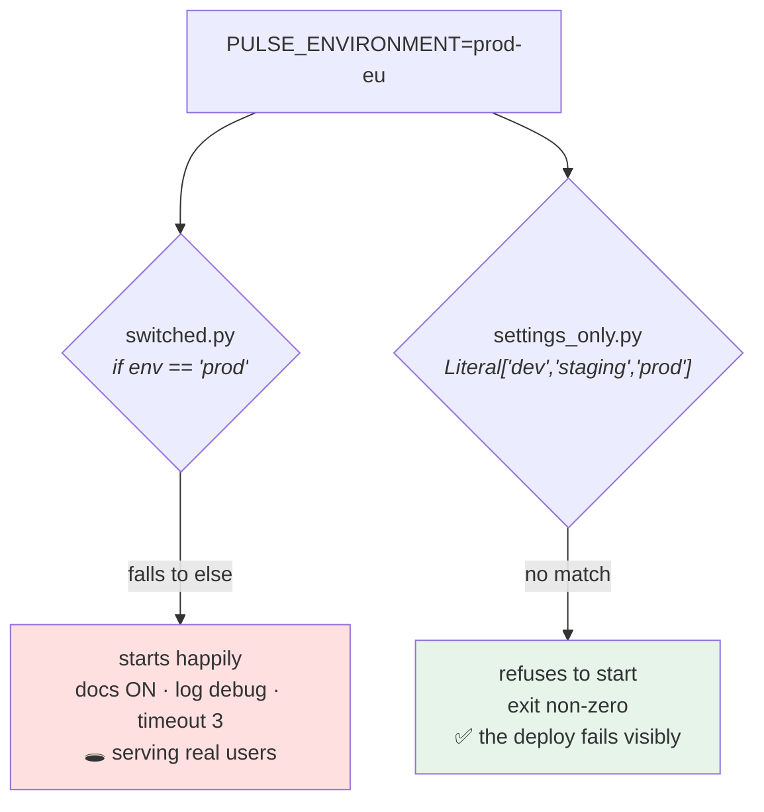

# 1.4 — The environment name is not a switch

## One-line answer

`PULSE_ENVIRONMENT` is a **label**, and the moment it becomes a condition — `if environment == "prod"` — the
behaviour of your system stops being configurable, stops being visible from outside, and starts having a
branch that only ever runs in the one place you cannot test.

---

## The story

🎬 **The scene.** A hotel with a rule: guests in the executive rooms get the good breakfast.

At first, the kitchen has a list of executive room numbers. It works.

😬 **The naive fix.** Somebody notices the executive rooms are all on floors seven and eight, and simplifies:
*if the room number starts with 7 or 8, good breakfast.* One rule instead of a list, and it is right every
single time.

💥 **Why it fails.** Three things, over two years, none of them anybody's fault.

They refurbish floor 7 into standard rooms. The kitchen keeps serving good breakfasts to standard guests for
four months, because nobody connected "refurbishment" with "breakfast".

They add executive rooms on floor 3. Those guests complain, and the front desk cannot fix it — the rule is in
the kitchen's head, and the front desk's system has no field for it.

And a corporate client negotiates the good breakfast for a block of standard rooms. **There is no way to
express that at all.** The rule has no room for an exception because it was never a *setting*; it was an
inference from a number that happened to correlate.

💡 **The insight.** **A label tells you where you are; it does not tell you what to do.** The moment a system
derives behaviour from an identifier, that behaviour cannot be varied, cannot be seen from outside, and cannot
accommodate the case nobody thought of — and there is always a case nobody thought of.

---

## The idea in plain language

Day 9 gave `pulse` a setting called `environment`, constrained to three values
([Day 9, 5.1](../../../day-009-configuration-and-secrets/parts/05-pulse-configured/5.1-pulse-config-the-settings-object.md)).
It has exactly one legitimate job: **saying which deploy this is**, so that log lines, metrics, traces and
`/version` responses can be attributed.

The illegitimate job — the one this part exists to prevent — is deciding behaviour:

```text
if settings.environment == "prod":
    timeout = 30
    retries = 5
    cache_ttl = 3600
else:
    timeout = 3
    retries = 1
    cache_ttl = 0
```

Every line of that is a value that *should have been a setting*, and Day 9 already gave you the machinery to
make it one. What has been lost by not doing so:

| Lost | Why it matters |
| --- | --- |
| **it cannot be varied per deploy** | a second production region wanting 45 seconds must change *code* |
| **it is invisible from outside** | `/version` says `prod`; nothing says the timeout is 30 — the startup config line lies by omission |
| **the branch is untestable** | the `prod` branch runs *only* in production, so it has never been exercised anywhere with a test |
| **a new environment silently gets `else`** | `staging-eu` falls into the development branch, in a deploy that serves real traffic |
| **two settings are coupled forever** | you cannot have production's timeout with development's cache |

**The fourth row is the one that causes incidents.** The twelve-factor page names it directly — from
`https://12factor.net/config`, fetched **2026-08-25**:

> *"as more deploys of the app are created, new environment names are necessary, such as staging or qa. As the
> project grows further, developers may add their own special environments like joes-staging, resulting in a
> combinatorial explosion of config which makes managing deploys of the app very brittle."*

> *"In a twelve-factor app, env vars are granular controls, each fully orthogonal to other env vars. They are
> never grouped together as 'environments', but instead are independently managed for each deploy."*

**"Granular" and "orthogonal" are the two words to keep.** Granular: one variable, one decision. Orthogonal:
setting one does not imply another.

### The distinction, stated so you can apply it

There is one place `environment` legitimately appears in code, and it is not a condition:

```text
✅ log.info("started", environment=settings.environment)
✅ metrics.info(environment=settings.environment, version=__version__)
✅ return {"environment": settings.environment}
❌ if settings.environment == "prod": ...
❌ config = load(f"config/{settings.environment}.yaml")
❌ DEBUG = settings.environment != "prod"
```

The three that are fine all **carry** the value. The three that are not all **consume** it.

**The rule: `environment` may be reported, never branched on.**

And there is exactly one exception, which is worth naming because it is the one Day 9 already made:
**a validator that refuses an impossible combination** — `docs_enabled` must be false when `environment` is
`prod`. That is a branch on the environment name, and it is legitimate for a specific reason: **it does not
choose behaviour; it refuses a configuration.** The behaviour is still entirely determined by
`docs_enabled`, which remains an ordinary, settable, visible value
([Day 9, 3.2](../../../day-009-configuration-and-secrets/parts/03-fail-fast/3.2-validating-the-value-not-just-its-presence.md)).

**Choosing a value is forbidden; refusing a combination is allowed.** The difference is that the second one
still leaves the value in the settings object where everything can see it.

---

## Why Kriya needs it

**[2.3](../02-promotion/2.3-the-promotion-gate.md)** promotes an artifact between deploys. If behaviour is
derived from the environment name, then the artifact behaves differently in each place and promotion proves
nothing — the thing you tested is not the thing running.

**[4.2](../04-pulse-across-environments/4.2-the-environment-banner.md)** makes the environment visible
everywhere, which only works if the value is *carried* rather than consumed.

**Day 62's metric labels** and **Day 67's log fields** are the legitimate use, at scale.

**Day 74's alerts** select on `environment`, which requires the value to be a faithful label rather than a
control.

**Day 118's shadow deployment** runs two versions side by side in the *same* environment, which is impossible
if behaviour is keyed to the environment name.

**Day 152's cost controls** and **Day 194's agent brakes** are the highest-stakes version: a spend limit or a
step ceiling that is `if environment == "prod"` is a limit that has never been tested anywhere it matters, and
that is trap #4 — the autonomy with no brake — arriving through a conditional rather than through an omission.

---

## The mechanism

Build both versions and find the third environment.

```python
# lab/switched.py - behaviour derived from the environment name. The anti-pattern.
from __future__ import annotations

import os

ENVIRONMENT = os.environ.get("PULSE_ENVIRONMENT", "dev")

if ENVIRONMENT == "prod":
    REQUEST_TIMEOUT = 30.0
    DOCS_ENABLED = False
    LOG_LEVEL = "info"
else:
    REQUEST_TIMEOUT = 3.0
    DOCS_ENABLED = True
    LOG_LEVEL = "debug"

if __name__ == "__main__":
    print(
        f"environment={ENVIRONMENT!r} timeout={REQUEST_TIMEOUT} docs={DOCS_ENABLED} log={LOG_LEVEL}"
    )
```

**Line by line:**

- `ENVIRONMENT` is read once at module level — the shape
  [Day 9, 2.4](../../../day-009-configuration-and-secrets/parts/02-typed-settings/2.4-the-settings-object-read-at-import-time.md)
  argued against, and it is *also* the shape this pattern forces: the values are module constants, so they
  cannot be overridden by a test or by a deploy.
- `os.environ.get(..., "dev")` — **the default is a fall-through**, and that is where the third environment
  will land.
- **The three values are coupled.** There is no way to ask for production's timeout with development's
  logging. That coupling is not a bug in this file; it is the pattern's defining property.
- `DOCS_ENABLED = True` in the `else` branch. **Hold on to that**, because it is about to be the exposure.

```python
# lab/settings_only.py - the same three values, as settings. The alternative.
from __future__ import annotations

from typing import Literal

from pydantic import Field
from pydantic_settings import BaseSettings, SettingsConfigDict


class Settings(BaseSettings):
    """environment is a label. Every behaviour is its own setting."""

    model_config = SettingsConfigDict(
        env_prefix="PULSE_", env_file=None, extra="forbid", frozen=True
    )

    environment: Literal["dev", "staging", "prod"] = "dev"
    request_timeout: float = Field(default=3.0, gt=0, le=30)
    docs_enabled: bool = True
    log_level: Literal["debug", "info", "warning", "error"] = "info"


if __name__ == "__main__":
    s = Settings()
    print(s.model_dump_json())
```

**Line by line:**

- `environment` is still here, as a `Literal` — **it is not being removed, it is being demoted to a label.**
  That is the whole distinction and it is easy to over-correct in the other direction and delete it, which
  loses the attribution that [4.2](../04-pulse-across-environments/4.2-the-environment-banner.md) needs.
- Each of the other three is an **independent** field with its own default and its own bound. Any combination
  is expressible, including combinations nobody has thought of yet.
- The defaults are the *safe* ones, not the *development* ones: `log_level` defaults to `info` rather than
  `debug`. **In the switched version the default branch was the permissive one**; here the default is
  conservative and the permissive settings must be asked for explicitly.
- `docs_enabled: bool = True` is the exception to that, and Day 9 explained why it is safe: the validator
  makes it impossible in `prod`, so a permissive default cannot become an exposure.

Now the third environment arrives, exactly as the twelve-factor page predicted:

```bash
cd "$(git rev-parse --show-toplevel)/days/day-010-environments-and-promotion/lab"
for env in dev staging prod prod-eu; do
  printf '%-9s ' "$env"
  PULSE_ENVIRONMENT="$env" uv run python switched.py
done
```

**Line by line:**

- Four values, three of which the code knows about and one of which it does not.
- `prod-eu` is not invented for effect — a second production region is the most ordinary growth event a system
  has.
- The inline `VAR=value command` form, so nothing leaks between iterations
  ([Day 9, 1.2](../../../day-009-configuration-and-secrets/parts/01-configuration/1.2-the-environment-is-the-interface.md)).

```text
dev       environment='dev' timeout=3.0 docs=True log=debug
staging   environment='staging' timeout=3.0 docs=True log=debug
prod      environment='prod' timeout=30.0 docs=False log=info
prod-eu   environment='prod-eu' timeout=3.0 docs=True log=debug
```

**Read the last row.** A deploy called `prod-eu`, serving real users in a second region, is running with
**documentation enabled and debug logging**, because it fell into the `else`.

**Nothing failed.** No error, no warning, no validation. The service started, reported healthy, and is serving
its OpenAPI document to the internet — Day 9's
[3.4](../../../day-009-configuration-and-secrets/parts/03-fail-fast/3.4-the-service-that-started-with-the-wrong-config.md)
failure, arriving by a different route and with no configuration mistake at all: **somebody chose a name.**

Now the same four names, against the settings version:

```bash
cd "$(git rev-parse --show-toplevel)/days/day-010-environments-and-promotion/lab"
for env in dev staging prod prod-eu; do
  printf '%-9s ' "$env"
  PULSE_ENVIRONMENT="$env" uv run python settings_only.py 2>&1 | tail -1
done
```

**Line by line:**

- `2>&1 | tail -1` because the failing case produces a multi-line `ValidationError` and the last line carries
  the diagnosis. **The failure is expected here**, and squashing it to one line keeps the table readable.

```text
dev       {"environment":"dev","request_timeout":3.0,"docs_enabled":true,"log_level":"info"}
staging   {"environment":"staging","request_timeout":3.0,"docs_enabled":true,"log_level":"info"}
prod      {"environment":"prod","request_timeout":3.0,"docs_enabled":true,"log_level":"info"}
prod-eu     Input should be 'dev', 'staging' or 'prod' [type=literal_error, input_value='prod-eu', input_type=str]
```

**Two things changed.**

`prod-eu` **refuses to start** rather than silently taking a branch — the `Literal` from Day 9, doing exactly
what a bounded type is for. That is a loud failure at deploy time instead of a quiet exposure in production.

And look at the `prod` row: `docs_enabled` is `true`, which Day 9's validator would refuse in the real
`pulse` — **this lab class deliberately omits that validator**, so that the two mechanisms can be seen
separately. The `Literal` bounds the *label*; the validator refuses an *impossible combination*. Both are
needed and they do different jobs.



### Finding the pattern in a codebase

The grep that finds it, and the one to run on any project you inherit:

```bash
cd "$(git rev-parse --show-toplevel)"
grep -rnE "(environment|ENV|STAGE)\s*(==|!=|in\s*[\(\[])" --include='*.py' pulse/ platform_ops/ scripts/ 2>/dev/null \
  || echo "no environment-name branching in project code"
grep -rn "environment" --include='*.py' pulse/ | grep -vE "^\S+:\s*#" | head
```

**Line by line:**

- The first pattern looks for **comparisons**: `== "prod"`, `!= 'dev'`, `in ("staging", "prod")`. Those three
  forms cover almost every instance of this anti-pattern in Python.
- `(environment|ENV|STAGE)` — the three names it hides under. `STAGE` in particular is common and easy to miss
  when grepping for `environment`.
- `--include='*.py'` and an explicit directory list, so the search is over **your** code rather than the
  virtual environment, which contains thousands of legitimate matches.
- The second `grep` lists every mention of `environment` in `pulse/` so you can look at each one and confirm
  it is *carrying* the value rather than consuming it. **Two commands: one finds the pattern, one lets you
  audit the rest.**

```text
no environment-name branching in project code
pulse/config.py:38:    environment: Literal["dev", "staging", "prod"] = "dev"
pulse/config.py:52:        if self.environment == "prod" and self.docs_enabled:
pulse/api.py:71:        "environment": settings.environment,
```

**Three mentions, and the middle one is a comparison.** That is the validator, and it is the documented
exception: it refuses a combination rather than choosing a value. **Recognising your own legitimate exception
in a grep result is the exercise** — if you cannot justify it in one sentence, it is not an exception.

---

## When it breaks

**The region that got the development branch.** The failure produced above, in the wild:

```text
$ curl -sS -o /dev/null -w '%{http_code}\n' https://eu.pulse.example.com/openapi.json
200
$ curl -sS -o /dev/null -w '%{http_code}\n' https://pulse.example.com/openapi.json
404
```

**What it says:** one region publishes its API schema and the other does not.
**What it actually means:** the new region's environment name did not match the string in the conditional.
**Every setting that branch controlled is now at its development value in a deploy serving real users** —
including, in the version above, a timeout that is ten times shorter and logging that is ten times louder.
**The smallest fix:** the name, which fixes it for this region and leaves the mechanism intact for the next
one.
**Why it is worse than a misconfiguration:** a wrong *value* affects one setting; a wrong *name* affects every
setting the conditional touched, simultaneously, and there is no configuration to inspect that would reveal
it.

**The test that could not exist.** The untestable branch:

```text
$ uv run python -m pytest -q --cov=pulse --cov-report=term-missing
Name              Stmts   Miss  Cover   Missing
-----------------------------------------------
pulse/timeouts.py    24      6    75%   14-19
```

**What it says:** six statements never executed by the test suite.
**What it actually means:** lines 14–19 are the `if environment == "prod":` branch. **The only place that code
runs is production**, so it has no test, no review evidence and no staging exercise. The first time it
executes is in front of users.
**The smallest fix:** make the values settings, and then the "production" configuration is just a set of
values a test can supply.
**Why coverage tools are good at finding this:** an environment-keyed branch is structurally uncoverable, so
it shows up as a persistent, unfixable gap — and teams usually respond by adding a coverage exclusion, which
buries it.

**The config file selected by name.** The other shape of the same mistake:

```text
FileNotFoundError: [Errno 2] No such file or directory: 'config/prod-eu.yaml'
```

**What it says:** a missing file.
**What it actually means:** `load(f"config/{environment}.yaml")` — configuration selected by a name rather
than supplied per deploy. **This one at least fails loudly**, which makes it better than the conditional, and
it still has every other problem: a new deploy needs a new file, the files drift, and a value cannot be
overridden without editing one.
**The smallest fix:** supply the values, do not select a bundle. Day 55's overlays are a *generation*
mechanism that produces per-deploy values — which is a different thing from a service choosing a file at
runtime.
**The distinction worth holding:** **generating configuration per deploy is fine; deriving configuration from
a name at runtime is not.**

**The spend limit that only existed in production.** The highest-stakes version:

```text
if settings.environment == "prod":
    MAX_TOKENS_PER_DAY = 50_000
else:
    MAX_TOKENS_PER_DAY = None
```

**What it says:** a budget in production and none elsewhere.
**What it actually means:** **the brake has never been tested.** Every development and staging run bypasses it
entirely, so the code path that enforces it — the counting, the refusal, the error message — has never
executed anywhere anybody was watching. The first time it runs is the first time it matters.
**The smallest fix:** a setting with a low value in development and a high one in production, so the mechanism
runs everywhere and only the number differs.
**Why this is the plan's trap #4 in disguise:** the plan describes an autonomy with no bound. This one *has* a
bound, on the diagram, in the code — and it is unexercised, which is functionally the same thing and much
harder to notice. Day 152 and Day 194 build the real versions.

---

## In production

**What a professional writes instead of the teaching version.** They keep `environment` as a label and are
strict about it in review, because it is one of a small number of patterns that is cheap to prevent and
expensive to remove — by the time there are forty conditionals, untangling them means auditing forty
behaviours with no way to test the result. Where a genuine per-deploy default is needed, it lives in the
*deployment* — the overlay, the values file, the Pod spec — which is generated per deploy and visible in a
diff, rather than in the application, which is one artifact for all deploys.

**What degrades at scale.** The number of environments, which grows faster than anybody plans for: a region,
a per-pull-request preview, a customer-specific deploy, a canary. Every one of those is a name the conditional
has never seen, and every conditional is a place where a new name silently takes the wrong branch.
**The scaling property that matters: with settings, adding a deploy is adding a set of values; with
conditionals, adding a deploy is editing code and re-releasing.**

**The failure that only shows with real traffic.** The untested branch, executing for the first time under
load. A retry policy or a cache configuration that only applies in production has never run at any scale
anywhere, so its first execution is also its first execution under concurrency — and the failure modes of
retry logic under concurrency are exactly Day 7's
([Day 7, 5.2](../../../day-007-networking-for-operators/parts/05-the-two-together/5.2-retries-that-turn-a-blip-into-an-outage.md)).
**A branch that only runs in production is a branch whose first load test is an incident.**

**The review comment a senior engineer leaves.** *"`if env == 'prod'` sets the cache TTL. That means the
caching code path has never run in any test or in staging, and when we add the EU region next quarter it will
default to no caching in a deploy serving real users. Make it a setting with a per-deploy value. Keep
`environment` for the log field."*

**The signal you would alert on.** The label makes signals possible rather than being one. What is worth
having, once `environment` is only ever carried: **every metric and log line labelled with it**, and an alert
on **a selector matching no data** (Day 74), which is the detector for a deploy reporting an unexpected name.
And one gate rather than an alert: **a lint rule or a review checklist item that forbids comparing the
environment name in application code**, with the validator as a named exception. You would **not** alert on
the value being unexpected — Day 9's `Literal` makes an unexpected value a startup refusal, which is strictly
better than a notification.

**Blast radius.** This part starts no server and writes two small lab files. The pattern it demonstrates,
however, is a genuine capability change when it appears in real code: **a conditional on the environment name
silently determines several behaviours at once, in a deploy nobody has tested.** Worst case in the lab: none —
`switched.py` prints a line. Worst case in reality is the four failures above, and the bound is a review rule
plus Day 9's `Literal`, which turns an unknown environment name from a silent `else` into a refusal to start.
Who can trigger it: whoever names a deploy.

**Cost.** `0` model calls, `0` tokens, `0` CI minutes, `0` new packages, `0` network, `0` servers. Disk: two
small files. RAM: negligible.

**The interview question.** *"Do you branch on the environment name?"* The answer that shows the reasoning:
*"No — it is a label, so it gets carried into log lines and metric labels and the version endpoint, and never
compared. The reason is not purity: an `if environment == 'prod'` branch means the production behaviour has
never executed anywhere it could be tested, and the first time somebody adds a region or a preview
environment, the new name falls into the `else` and every setting that conditional controlled silently reverts
to the development value in a deploy serving real users. There is one exception I allow, which is a startup
validator refusing an impossible combination — like documentation being enabled in production. That is a
branch on the name, but it refuses a configuration rather than choosing one, so the behaviour is still
determined by a value everything can see."*

---

## Check yourself

```bash
cd "$(git rev-parse --show-toplevel)/days/day-010-environments-and-promotion/lab"
PULSE_ENVIRONMENT=prod-eu uv run python switched.py
PULSE_ENVIRONMENT=prod-eu uv run python settings_only.py 2>&1 | tail -1 ; echo "exit=$?"
cd "$(git rev-parse --show-toplevel)" && grep -rnE "(environment|ENV|STAGE)\s*(==|!=)" --include='*.py' pulse/
```

One version starts happily with development settings in a production region; the other refuses. And a grep
over `pulse/` that finds **exactly one** comparison — the validator.

**Say out loud, without scrolling up:** *State the rule for what `environment` may be used for, name the one
legitimate exception and say precisely why it is different — then describe what happens to a deploy called
`prod-eu` under the anti-pattern.*
