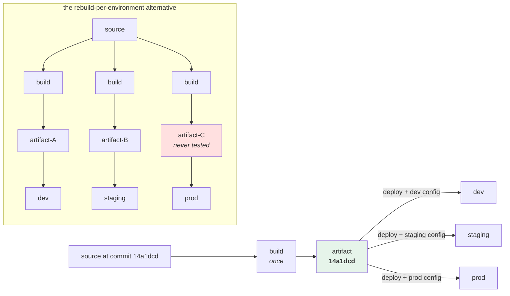

# 2.1 — Build once, promote the artifact

## One-line answer

Promotion means moving **the identical object** from one environment to the next — not rebuilding it from the
same source — because a rebuild is a different object, and the whole value of testing in one place is the
claim that the thing you tested is the thing that runs.

---

## The story

🎬 **The scene.** A bakery competition. Three judges, three rooms, one loaf.

The loaf is carried from room to room. Each judge scores the same loaf, and at the end the scores mean
something because there was one loaf.

😬 **The naive fix.** It is awkward to carry a loaf around, and the baker has the recipe, so each judge gets a
freshly baked one made to the same recipe in the same oven. More convenient, obviously equivalent.

💥 **Why it fails.** The third loaf is denser. Not much — but the flour bag was nearly empty and the last of
it had settled, the kitchen was warmer by mid-afternoon, and the proving time was four minutes shorter
because the judge was waiting.

The first two judges scored a loaf that no longer exists. **The third judge's score is the only one about a
loaf anybody could eat**, and it is the one that disagrees.

Nothing in the recipe changed. Nothing was done carelessly. **The recipe was never the thing being judged —
the loaf was.**

💡 **The insight.** **A recipe is a description; a loaf is an object.** Testing a description tells you about
descriptions. If you want the test to be evidence about the thing that ships, the thing that ships has to be
the thing you tested — carried, not re-made.

---

## The idea in plain language

There are two ways a change reaches production, and they look almost identical on a diagram.

**Rebuild per environment.** Each environment's deployment starts from source and builds its own copy.

```text
source ─build→ artifact-A ─deploy→ dev
source ─build→ artifact-B ─deploy→ staging
source ─build→ artifact-C ─deploy→ prod
```

**Build once, promote.** One build; the resulting object moves.

```text
source ─build→ artifact ─deploy→ dev
                       ─deploy→ staging
                       ─deploy→ prod
```

The second is what everybody means by promotion, and the reason is the one from the story: **in the first
diagram, `artifact-C` is a thing nobody has ever tested.** Every test result you have is about `artifact-A`
and `artifact-B`.

### "But the source is identical"

It is, and that is not enough. Here is what can differ between two builds of identical source, in rough order
of how often it actually happens:

| What differs | Why | Caught by |
| --- | --- | --- |
| **a dependency resolved differently** | a range instead of an exact pin; a new release between builds | an exact `==` pin and a lockfile — Day 15 |
| **a transitive dependency** | your pins are exact, theirs are not | the lockfile, which pins the whole graph |
| **the base image** | `python:3.12` is a moving tag; today's is not last week's | pinning by digest — Day 23 |
| **a build tool version** | a compiler, a bundler, a `uv` release | the build environment being itself an artifact — Day 22 |
| **the machine** | a different architecture, a different C library | the container — Day 21 |
| **a network fetch during build** | anything downloaded at build time | a hermetic build — Day 15 |
| **the build clock** | a timestamp embedded, a certificate that expired between builds | reproducible builds — Day 15 |

**This project has already closed the first two**, with `==` pins and `uv.lock` committed since Day 0, which
is why the point can be made honestly today rather than waved at. The rest are Phase 3's problem, and the
reason Phase 3 exists.

### What an artifact actually is

An **artifact** is the concrete thing a build produces, identified by something you can compare:

| Kind of system | The artifact | Its identity |
| --- | --- | --- |
| a Python service today | the source tree at a commit, plus `uv.lock` | the git commit SHA |
| a Python package (Day 15) | a wheel file | its SHA-256 digest |
| a container (Day 22) | an image | its `sha256:` digest |
| a Kubernetes deploy (Day 34) | a manifest referencing an image digest | the digest, again |

**`pulse` has no build step yet.** Day 15 gives it one. So today the artifact is *the commit*, and its
identity is the commit SHA — which is genuinely a content-addressed identifier for a source tree, and is
therefore a real artifact identity rather than a placeholder. **A promotion today is: deploy this exact
commit, everywhere, and prove it is the same commit.**

### The corollary nobody likes

If the artifact is fixed, then **everything that differs between environments must be configuration** — which
is Day 9's entire subject and [1.2](../01-what-an-environment-is/1.2-the-four-things-that-differ.md)'s list.

That is why these two days are adjacent in the plan. Build-once-promote is not implementable in a codebase
that has values baked into it, and Day 9 is what makes today possible.

---

## Why Kriya needs it

**[2.2](2.2-build-release-run.md)** names the three stages formally, and **[2.3](2.3-the-promotion-gate.md)**
builds the gate that refuses a promotion whose artifact does not match.

**[2.4](2.4-the-rebuild-that-promoted-something-different.md)** is the deliberate failure: a rebuild that
produces a different object from identical source.

**Day 15** gives `pulse` a real build artifact — a wheel with a digest — and an SBOM describing what is in it.

**Day 16** gives it a version and a tag, so the artifact has a name a human can say.

**Day 19's rollback** is promotion in reverse, and it only works if previous artifacts still exist and are
addressable.

**Day 23** pins a base image by digest, which is this argument applied one layer down.

**Day 107** asks you to reproduce a six-month-old prediction — which requires the *model* artifact, the *code*
artifact and the *data* artifact all to be addressable and unchanged. **Everything in MLOps is this idea with
more kinds of artifact.**

---

## The mechanism

`pulse` has no build step, so today's artifact is the commit. Make that concrete: a promotion is recording
which commit went where, and proving it is the same one.

```bash
cd "$(git rev-parse --show-toplevel)"
mkdir -p days/day-010-environments-and-promotion/lab/releases
git rev-parse HEAD
git rev-parse --short HEAD
git status --porcelain | head
```

**Line by line:**

- `git rev-parse HEAD` — the full forty-character SHA-1 of the current commit. **This is a content-addressed
  identifier**: it is derived from the tree, the parents, the author and the message, so two commits with the
  same SHA are the same commit everywhere in the world. Day 11 explains how
  ([Day 11, 1.1](../../../day-011-version-control-for-operators/parts/01-the-object-model/1.1-a-commit-is-a-snapshot-with-a-parent.md)).
- `--short` gives the abbreviated form for human use. **The short form is for reading; the full form is for
  comparing** — abbreviations can collide, and a promotion record that stores an abbreviation is a promotion
  record that will one day be ambiguous.
- `git status --porcelain` — a stable, script-friendly listing of anything modified or untracked. **It must be
  empty**: if the working tree is dirty, the commit SHA does not describe what you are about to run, and the
  artifact identity is a lie. This is the single most important check in this part.

```text
14a1dcd2f0b4c9e8a7d6f5c3b2a1908e7d6c5b4a
14a1dcd
```

Now build the promotion record — the thing that says *what went where*:

```bash
# lab/promote.sh - record an artifact reaching an environment, refusing if it cannot be identified.
set -u
ENV="${1:?usage: promote.sh <environment>}"
ROOT="$(git rev-parse --show-toplevel)"
LEDGER="$ROOT/days/day-010-environments-and-promotion/lab/releases/$ENV.json"

if [ -n "$(git status --porcelain)" ]; then
  echo "REFUSED: the working tree is dirty; the commit does not describe what would run" >&2
  git status --short >&2
  exit 1
fi

COMMIT="$(git rev-parse HEAD)"
LOCK="$(git hash-object uv.lock)"
STAMP="$(git log -1 --format=%cI)"

cat > "$LEDGER" <<EOF
{
  "environment": "$ENV",
  "commit": "$COMMIT",
  "uv_lock_object": "$LOCK",
  "committed_at": "$STAMP"
}
EOF
echo "recorded: $ENV <- ${COMMIT:0:7} (lock ${LOCK:0:7})"
```

**Line by line:**

- `"${1:?usage: …}"` — the environment name is required, and the script exits with the message if it is
  missing. Day 9's smoke test used the same form for the same reason: **a promotion script with a defaulted
  target is one that promotes to the wrong place**
  ([Day 9, 3.4](../../../day-009-configuration-and-secrets/parts/03-fail-fast/3.4-the-service-that-started-with-the-wrong-config.md)).
- **The dirty-tree check comes first and refuses.** Everything after it assumes the commit describes the
  working tree, and that assumption is the whole basis of artifact identity. Refusing rather than warning is
  [Day 9, 3.1](../../../day-009-configuration-and-secrets/parts/03-fail-fast/3.1-fail-fast-the-crash-that-saves-the-night.md)'s
  argument applied to a script.
- `git status --short >&2` before exiting — **show what is dirty**, so the operator does not have to run a
  second command to find out. Diagnostics go to standard error so a caller capturing standard output gets only
  the result.
- `git hash-object uv.lock` — the SHA of the lock file's *contents*. It is redundant with the commit SHA (the
  commit contains the file), and it is here because **it is the field a human will actually look at** when
  asking "did the dependencies change between these two deploys". Recording a derived fact that answers a
  frequent question is worth the duplication.
- `git log -1 --format=%cI` — the **committer** date in strict ISO 8601. `%cI` rather than `%aI` because the
  author date is when the change was written and the committer date is when it entered this history; for a
  promotion record, the second is the relevant one. **Do not generate this timestamp with `date`** — that
  would record when the script ran, which is a different fact and would make the record non-reproducible.
- `cat > "$LEDGER" <<EOF` — **unquoted** `EOF` this time, deliberately, because the variables *must* expand.
  Day 9's heredocs used `<<'EOF'` to prevent expansion; the difference between the two forms is exactly this,
  and using the wrong one here would write the literal text `$COMMIT` into the file.
- One file per environment, named after it, so "what is in staging?" is `cat staging.json` rather than a
  query.
- `${COMMIT:0:7}` in the confirmation line — the short form for a human, while the file keeps the full one.

Now promote, and check:

```bash
cd "$(git rev-parse --show-toplevel)"
LAB=days/day-010-environments-and-promotion/lab
bash "$LAB/promote.sh" dev
bash "$LAB/promote.sh" staging
cat "$LAB/releases/staging.json"
```

**Line by line:**

- Two promotions of the same commit, which is what "build once, promote" looks like when nothing has changed:
  **the two records are identical except for the environment name.**

```text
recorded: dev <- 14a1dcd (lock 8f3b2c1)
recorded: staging <- 14a1dcd (lock 8f3b2c1)
{
  "environment": "staging",
  "commit": "14a1dcd2f0b4c9e8a7d6f5c3b2a1908e7d6c5b4a",
  "uv_lock_object": "8f3b2c1e9d4a7605f2b8c3d1a9e7f4b620c5d8a3",
  "committed_at": "2026-08-25T09:14:02+05:30"
}
```

And the comparison — the question a promotion exists to answer:

```bash
cd "$(git rev-parse --show-toplevel)/days/day-010-environments-and-promotion/lab"
for env in dev staging prod; do
  if [ -f "releases/$env.json" ]; then
    printf '%-9s %s\n' "$env" "$(grep -o '"commit": "[^"]*"' "releases/$env.json" | cut -d'"' -f4 | cut -c1-7)"
  else
    printf '%-9s %s\n' "$env" "(never promoted)"
  fi
done
```

**Line by line:**

- The loop covers all three environments including ones with no record, and prints `(never promoted)` rather
  than failing. **An environment that has never received a promotion is a fact, not an error**, and it is the
  fact you most want to see.
- `cut -c1-7` for display only; the file holds the full SHA.

```text
dev       14a1dcd
staging   14a1dcd
prod      (never promoted)
```

**Two environments running the same artifact, and one that has never received one.** That three-line output is
the whole state of the deployment, and it is the input to [2.3](2.3-the-promotion-gate.md)'s gate.



### Proving the artifact is the same

The record says the commit is the same. **Prove that the thing running agrees**, because a record is a claim:

```bash
cd "$(git rev-parse --show-toplevel)"
LAB=days/day-010-environments-and-promotion/lab
( set -a; . "$LAB/envs/staging.env"; set +a; \
  uv run uvicorn pulse.api:app --host "$PULSE_HOST" --port "$PULSE_PORT" > /tmp/pulse-staging.log 2>&1 & )
sleep 4
echo "recorded : $(grep -o '"commit": "[^"]*"' "$LAB/releases/staging.json" | cut -d'"' -f4 | cut -c1-7)"
echo "running  : $(git rev-parse --short HEAD)   <- from the working tree, NOT from the service"
curl -sS http://127.0.0.1:8001/version; echo
pkill -f 'pulse.api:app'
```

**Line by line:**

- The service is started from the working tree, so "what is running" is the working tree's commit — **and
  that is exactly the weakness this block exposes.** The comment says so explicitly.
- **`/version` does not report a commit.** Look at the output: it reports `0.1.0`, a hand-maintained version
  string from `pulse/__init__.py`, which does not change when the code does
  ([Day 3, 2.3](../../../day-003-pulse-v0/parts/02-the-service/2.3-version-what-is-actually-running.md)).
- So the promotion record and the running service **cannot currently be compared by asking the service.**
  That is a real gap, it is the reason
  [4.1](../04-pulse-across-environments/4.1-one-artifact-three-releases.md) adds a build identifier to
  `/version`, and pretending otherwise would teach a check that does not check anything.

```text
recorded : 14a1dcd
running  : 14a1dcd   <- from the working tree, NOT from the service
{"service":"pulse","version":"0.1.0","model_version":"none","environment":"staging"}
```

**Two of the three lines agree because they read the same source.** The third — the only one that comes from
the running process — cannot participate, and closing that gap is what makes a promotion verifiable rather
than merely recorded.

---

## When it breaks

**The dirty tree.** The refusal that saves you:

```text
$ bash lab/promote.sh prod
REFUSED: the working tree is dirty; the commit does not describe what would run
 M pulse/config.py
?? lab/scratch.py
```

**What it says:** two files differ from the commit.
**What it actually means:** the commit SHA you were about to record describes a tree that is **not** the tree
you would deploy. The record would be a precise, verifiable, false statement — which is worse than no record,
because everything downstream trusts it.
**The smallest fix:** commit or stash the changes.
**Why this refusal matters more than it looks:** every promotion mechanism in the industry has this check, and
every incident report that says *"we thought we deployed X"* is a story about it being missing or bypassed.

**The moving tag.** The rebuild problem, in its most common clothing:

```text
$ docker pull python:3.12
3.12: Pulling from library/python
Digest: sha256:9c2e1a...  (last week)

$ docker pull python:3.12
3.12: Pulling from library/python
Digest: sha256:4f7b3d...  (today)
```

**What it says:** the same tag, two different digests.
**What it actually means:** `python:3.12` is a **moving pointer**, updated whenever the maintainers publish a
new patch or rebuild against new system packages. Two builds a week apart from identical source produce
images with different operating-system packages, different OpenSSL, different everything below Python.
**The smallest fix:** reference the base image by digest, not by tag. Day 23.
**Why this is the canonical example:** it is the cleanest possible demonstration that *"same source, same
build command"* does not mean *"same artifact"* — and it is why "build once" has to be a rule rather than an
optimisation.

**The promotion that was a merge.** The branch-as-environment failure, from
[1.1](../01-what-an-environment-is/1.1-an-environment-is-a-deploy-not-a-folder.md), seen from the promotion
side:

```text
$ git checkout production && git merge staging
Auto-merging pulse/config.py
CONFLICT (content): Merge conflict in pulse/config.py
Automatic merge failed; fix conflicts and then commit the result.
```

**What it says:** a conflict during a promotion.
**What it actually means:** promotion is being done by merging branches, so **the thing arriving in production
is a new commit that has never existed anywhere** — created by a conflict resolution, at the moment of
deployment, by whoever was promoting. The artifact is not being moved; a new one is being manufactured under
time pressure.
**The smallest fix:** one branch, one artifact, configuration outside the code. Day 12 covers the branching
model.
**The tell:** if promoting can produce a conflict, you are not promoting.

**The lockfile that was not committed.** The subtle one:

```text
$ git status --porcelain
 M uv.lock
$ bash lab/promote.sh staging
REFUSED: the working tree is dirty; the commit does not describe what would run
 M uv.lock
```

**What it says:** the lock file differs.
**What it actually means:** somebody ran `uv add` or `uv sync --upgrade` and did not commit the result. **The
dependency graph on this machine is not the one in the commit**, so a deploy from the commit resolves
differently from what was just tested locally.
**The smallest fix:** commit the lock file — which is why `CLAUDE.md` requires it and why Day 0 committed it
before there were any dependencies to lock.
**Why the refusal catches it and a version number would not:** the version in `pyproject.toml` did not change;
only the resolved graph did. **Artifact identity has to cover everything that goes in, not just the parts with
version numbers.**

---

## In production

**What a professional writes instead of the teaching version.** The promotion record is not a file somebody
runs a script to write — it is produced by the pipeline, automatically, as a side effect of deploying, and it
is queryable: *"which artifact is in production, when did it arrive, what was there before, and who approved
it."* The artifact identity is a **digest** rather than a commit, because by then there is a build step and
the digest covers the dependency graph, the base image and the build environment. And the deployed manifest
references that digest rather than a tag, so the running system's identity cannot drift underneath the record.

**What degrades at scale.** The number of artifacts, and the storage they need. Build-once-promote implies
keeping every artifact that has ever been promoted, because
Day 19's rollback needs the previous one to still exist — and retention becomes a
real cost decision, with a real failure mode: the artifact you need to roll back to has been garbage-collected.
Mature setups keep every production artifact for a stated period and are explicit that rolling back beyond it
means rebuilding, with all the caveats this part started with.

**The failure that only shows with real traffic.** A promoted artifact whose *dependencies* were fetched at
runtime rather than at build time. The build is identical, the artifact is identical, and on first start in
production it downloads something — a model file, a plugin, a certificate bundle — which is a different version
from the one staging downloaded a week ago. **The artifact was promoted; its behaviour was not.** This is
exactly what Day 109's model loading has to get right, and it is why an artifact that fetches at startup is a
much weaker guarantee than one that carries what it needs.

**The review comment a senior engineer leaves.** *"The deploy job runs `uv sync` on the target rather than
shipping a built artifact, so production resolves its own dependency graph at deploy time. Our lockfile makes
that *probably* identical, which is not the same as identical — and it means the deploy can fail because of
somebody else's package registry. Build once, ship the artifact, and make the deploy a copy rather than a
build."*

**The signal you would alert on.** One, and it is high-value: **the artifact identity currently running in
each environment, exposed as a label** — a metric with `version` and `commit` (later `digest`) as labels, value
always `1`. From it come two genuinely useful alerts: **more than one artifact identity in a single environment
for longer than a rollout should take** (a stuck rollout — Day 41), and **an artifact identity in production
that does not appear in the promotion record** (something was deployed outside the pipeline, which is the
signal that matters most in a regulated setting — Day 217). You would **not** alert on a promotion happening;
that is the normal case.

**Blast radius.** This part writes JSON files under `lab/releases/` and starts one uvicorn process on
loopback. The new capability is `promote.sh`, which **writes a record that downstream checks will trust** —
so its worst case is a record that is precisely wrong, which is why the dirty-tree refusal is the first thing
in the script rather than the last. Today it records; it deploys nothing and can break nothing.
[2.3](2.3-the-promotion-gate.md) gives it teeth, and that is where the blast radius becomes real. Who can
trigger it: you. What bounds it: it refuses on a dirty tree, it takes the environment as a required argument,
and it writes only inside `lab/`.

**Cost.** `0` model calls, `0` tokens, `0` CI minutes, `0` new packages, `0` network. RAM: one uvicorn process
at roughly 60 MB, briefly. Disk: three small JSON files.

**The interview question.** *"What does 'promote' mean in your pipeline?"* The answer that shows the
distinction: *"Moving the identical artifact to the next environment — not rebuilding from the same commit.
The difference matters because a rebuild is a different object: a dependency can resolve differently, a base
image tag moves, a build tool changes. So if you rebuild per environment, the thing in production is the one
object nobody ever tested. Concretely, the deployment references a digest rather than a tag, and there is a
record of which digest is in which environment and when it arrived. The check I insist on is that the
promotion refuses when the working tree is dirty or when the artifact cannot be identified — because a
promotion record that is precisely wrong is worse than none, since everything downstream trusts it."*

---

## Check yourself

```bash
cd "$(git rev-parse --show-toplevel)"
LAB=days/day-010-environments-and-promotion/lab
bash "$LAB/promote.sh" dev
echo "# scratch" >> pulse/config.py && bash "$LAB/promote.sh" staging ; echo "exit=$?"
git checkout pulse/config.py && bash "$LAB/promote.sh" staging ; echo "exit=$?"
```

One promotion recorded, one **refused** because the tree was dirty, and one recorded again after the tree was
restored. **`git checkout <file>` discards uncommitted changes to it** — the safe undo here, and Day 11
covers the family it belongs to.

**Say out loud, without scrolling up:** *Explain why rebuilding from the same commit does not produce the same
artifact, give two concrete things that can differ, and say what `pulse`'s artifact identity is today and what
it will be after Day 15.*
