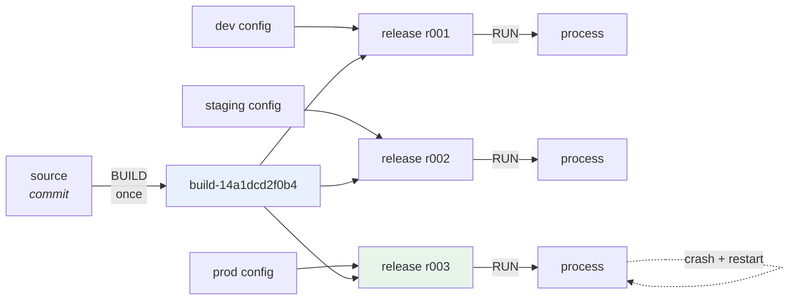

# 2.2 — Build, release, run, and the release ID

## One-line answer

There are **three** stages, not two: a *build* turns source into an artifact, a *release* combines that
artifact with one deploy's configuration, and a *run* executes a release — and the release is the object you
actually roll back to, which is why it needs an identity of its own.

---

## The story

🎬 **The scene.** A print shop that produces exam papers.

Three things happen, in order, and they are done by different people in different rooms.

**Typesetting** produces the plates. One set of plates per paper, checked once, locked in a cabinet.

**Making up** takes a set of plates and a job sheet — this school, this many copies, this paper stock, this
delivery date — and produces a numbered job. The job number is written on everything.

**Printing** takes a numbered job and runs it.

😬 **The naive fix.** A new manager merges the middle step into printing: the press operator reads the job
sheet directly off the order. Fewer handovers, less paperwork.

💥 **Why it fails.** A school phones: the papers arrived on the wrong stock. The question is *"what exactly did
we run?"* — and there is no longer an object to point at. The plates exist and the order exists, but the
*combination that was actually printed* was assembled in the operator's head and does not exist anywhere.

Worse, the fix — reprint it correctly — cannot be described as "run job 4417 again", because there was no job
4417. Somebody has to reconstruct the combination from memory and hope it matches.

💡 **The insight.** **The combination of a thing and its settings is itself a thing, and it needs a name.**
Without one you can identify what you built and what you intended, and you cannot identify what you ran — which
is the only one you ever need during an incident.

---

## The idea in plain language

The twelve-factor formulation is precise. From `https://12factor.net/build-release-run`, fetched
**2026-08-25**:

> *"The **build stage** is a transform which converts a code repo into an executable bundle known as a build.
> Using a version of the code at a commit specified by the deployment process, the build stage fetches vendors
> dependencies and compiles binaries and assets.*
>
> *The **release stage** takes the build produced by the build stage and combines it with the deploy's current
> config. The resulting release contains both the build and the config and is ready for immediate execution in
> the execution environment.*
>
> *The **run stage** (also known as "runtime") runs the app in the execution environment, by launching some set
> of the app's processes against a selected release."*

And the property that makes it useful:

> *"Every release should always have a unique release ID, such as a timestamp of the release (such as
> 2011-04-06-20:32:17) or an incrementing number (such as v100). Releases are an append-only ledger and a
> release cannot be mutated once it is created. Any change must create a new release."*

Read that last sentence twice. **A release is immutable and the ledger is append-only** — which is the same
shape as `docs/PROGRESS.md`, `docs/INCIDENTS.md` and git itself
([Day 1, 2.2](../../../day-001-what-operations-actually-is/parts/02-the-repo-remembers/2.2-the-four-ledgers.md)).
Changing a value does not modify a release; it creates a new one.

### Why three and not two

The obvious model is *build* then *deploy*. It is wrong in one specific and expensive way:

**A configuration change with no code change is a release.** If your model has only two stages, a config
change is either "a deploy with no build" — which has no identity, so you cannot say what changed or roll it
back — or it forces a rebuild, which is
[2.1](2.1-build-once-promote-the-artifact.md)'s problem.

Three stages make both operations symmetric:

| What changed | New build? | New release? | Rollback target |
| --- | --- | --- | --- |
| the code | yes | yes | the previous release |
| the configuration | **no** | **yes** | the previous release |
| nothing (a restart) | no | no | — the same release runs again |

**The third row is why the run stage is separate.** A process that dies and is restarted by a supervisor
([Day 4, 4.1](../../../day-004-linux-for-operators-i/parts/04-the-service-died/4.1-graceful-shutdown-for-pulse.md))
is a *new run of an existing release*, not a new release. That distinction is what lets a restart be
automatic and unremarkable while a release is deliberate and recorded.

### The run stage must be boring

There is one more paragraph on that page and it is the most operationally important thing on it:

> *"Builds are initiated by the app's developers whenever new code is deployed. Runtime execution, by contrast,
> can happen automatically in cases such as a server reboot, or a crashed process being restarted by the
> process manager. Therefore, the run stage should be kept to as few moving parts as possible, since problems
> that prevent an app from running can cause it to break in the middle of the night when no developers are on
> hand. The build stage can be more complex, since errors are always in the foreground for a developer who is
> driving the deploy."*

**This is the same argument Day 9 made about startup checks.** Anything the run stage does can fail at 3am
with nobody watching; anything the build stage does fails in front of the person who caused it. So work moves
*earlier*: compile at build, validate configuration at startup rather than at request time
([Day 9, 3.1](../../../day-009-configuration-and-secrets/parts/03-fail-fast/3.1-fail-fast-the-crash-that-saves-the-night.md)),
and fetch nothing at run time that could have been fetched at build time.

### What a release ID is for

Three questions, all of which need one:

- **What is running?** — a release ID, not a version, because two deploys of the same version with different
  configuration are different releases.
- **What was running before?** — the previous entry in the append-only ledger, which is what rollback targets.
- **What changed between them?** — a diff of two releases, which is either an artifact change or a
  configuration change and says which.

**A version number cannot answer any of the three**, because it identifies the build and not the combination.
That is why `/version` returning `0.1.0` in all three environments
([2.1](2.1-build-once-promote-the-artifact.md)) is not enough.

---

## Why Kriya needs it

**[2.3](2.3-the-promotion-gate.md)** builds the gate that a promotion must pass, and what it promotes is a
release.

**[4.1](../04-pulse-across-environments/4.1-one-artifact-three-releases.md)** builds `pulse`'s release object
properly — one artifact, three releases — which is the day's synthesis.

**Day 16** gives the build a semantic version and a tag; this part is why the version alone is not the answer.

**Day 19's rollback** targets a release. *"Roll back to the previous version"* is ambiguous when the last
change was configuration; *"roll back to release 7"* is not.

**Day 41's rolling update** is the run stage, executing a release across replicas, and its whole safety
property depends on releases being immutable.

**Day 55's GitOps** makes the release ledger a git repository: a commit in the deployment repository *is* a
release, which is one of the most elegant ideas in this curriculum and only makes sense once you can name the
three stages.

**Day 105's model registry** is the same three stages for a model: train produces an artifact, registration
combines it with metadata and a stage, and serving runs it.

---

## The mechanism

Build the three stages for `pulse` and make the release an object you can point at.

**The build stage** — today, there is no compilation, so a build is *"identify the artifact"*:

```bash
# lab/build.sh - produce a build identity for the current source.
set -u
ROOT="$(git rev-parse --show-toplevel)"
OUT="$ROOT/days/day-010-environments-and-promotion/lab/builds"
mkdir -p "$OUT"

if [ -n "$(git status --porcelain)" ]; then
  echo "REFUSED: dirty working tree; a build must describe a committed state" >&2
  exit 1
fi

COMMIT="$(git rev-parse HEAD)"
BUILD_ID="build-${COMMIT:0:12}"
cat > "$OUT/$BUILD_ID.json" <<EOF
{
  "build_id": "$BUILD_ID",
  "commit": "$COMMIT",
  "lock_object": "$(git hash-object uv.lock)",
  "python_requires": "$(grep -o '"==3\.[0-9.*]*"' "$ROOT/pyproject.toml" | head -1 | tr -d '"')",
  "committed_at": "$(git log -1 --format=%cI)"
}
EOF
echo "$BUILD_ID"
```

**Line by line:**

- The dirty-tree refusal again, first, for the same reason as
  [2.1](2.1-build-once-promote-the-artifact.md): **an artifact identity that does not describe the tree is a
  precise lie.**
- `BUILD_ID="build-${COMMIT:0:12}"` — **twelve** hex characters, not seven. Seven is git's display default and
  is fine for a human reading a log; twelve is the conventional floor for an identifier that will be compared
  by machines across a repository that may grow, because abbreviations can collide. **The full SHA is still
  in the file**; the ID is a handle.
- `python_requires` is captured **into the build**, because it is part of what makes the artifact what it is
  and it is not in the lockfile
  ([1.3](../01-what-an-environment-is/1.3-dev-prod-parity-and-the-three-gaps.md)'s tools gap). Capturing it
  does not *enforce* anything today; it makes a later disagreement diagnosable.
- The file is named after the build ID and lives in `builds/`, so builds accumulate. **Builds are not
  overwritten** — that is the append-only property, applied one stage early.
- `echo "$BUILD_ID"` as the only thing on standard output, so the script composes: `RELEASE=$(bash build.sh)`.
  Everything diagnostic goes to standard error.

**The release stage** — combine one build with one deploy's configuration:

```bash
# lab/release.sh - combine a build with an environment's config. Immutable, numbered.
set -u
BUILD_ID="${1:?usage: release.sh <build-id> <environment>}"
ENV="${2:?usage: release.sh <build-id> <environment>}"
ROOT="$(git rev-parse --show-toplevel)"
LAB="$ROOT/days/day-010-environments-and-promotion/lab"
mkdir -p "$LAB/releases"

BUILD_FILE="$LAB/builds/$BUILD_ID.json"
CONFIG_FILE="$LAB/envs/$ENV.env"
[ -f "$BUILD_FILE" ]  || { echo "REFUSED: no such build: $BUILD_ID" >&2; exit 1; }
[ -f "$CONFIG_FILE" ] || { echo "REFUSED: no config for environment: $ENV" >&2; exit 1; }

N=$(( $(ls "$LAB/releases"/*.json 2>/dev/null | wc -l) + 1 ))
RELEASE_ID="r$(printf '%03d' "$N")"
CONFIG_HASH="$(git hash-object "$CONFIG_FILE")"

cat > "$LAB/releases/$RELEASE_ID.json" <<EOF
{
  "release_id": "$RELEASE_ID",
  "environment": "$ENV",
  "build_id": "$BUILD_ID",
  "config_hash": "$CONFIG_HASH",
  "config_keys": $(cut -d= -f1 "$CONFIG_FILE" | sort | sed 's/^/"/;s/$/"/' | paste -sd, - | sed 's/^/[/;s/$/]/')
}
EOF
echo "$RELEASE_ID"
```

**Line by line:**

- **Two required arguments**, both with `:?` messages. A release is a *pair*; defaulting either half is how you
  release the wrong combination.
- Both inputs are checked to **exist** before anything is written. `[ -f … ] || { …; exit 1; }` is the compact
  refusal form, and the messages name which half was missing.
- `N=$(( $(ls …| wc -l) + 1 ))` — the next number, counted from what is on disk. **This is a deliberately
  naive counter and it is worth knowing why it is wrong at scale**: two releases created concurrently would
  both compute the same `N`. The real answer is a database, or a git commit, or an atomic append. Day 55's
  GitOps model uses git commits as release IDs precisely because git already solves this.
- `printf '%03d'` — zero-padded, so `r002` sorts before `r010`. The same reason day folders are three digits
  (plan §17.2).
- `config_hash` is `git hash-object` over the config file: a content address for the configuration half.
  **Two releases with the same build and the same config hash are the same release**, which is what makes the
  gate in [2.3](2.3-the-promotion-gate.md) possible.
- `config_keys` is the **key set** — the thing [1.2](../01-what-an-environment-is/1.2-the-four-things-that-differ.md)
  said matters more than the values. The shell pipeline is: take the names, sort them, wrap each in quotes,
  join with commas, wrap in brackets. **It is doing JSON by hand and that is a real weakness** — a value
  containing a quote would break it — which is fine for a lab and is exactly the kind of thing that goes wrong
  in a real script written the same way.
- **The values are not recorded**, only their hash and their key names. That is deliberate: a release record
  containing configuration values is a release record containing credentials
  ([Day 9, 4.2](../../../day-009-configuration-and-secrets/parts/04-secrets/4.2-the-seven-places-a-secret-leaks.md)).

Run all three stages:

```bash
cd "$(git rev-parse --show-toplevel)"
LAB=days/day-010-environments-and-promotion/lab
BUILD=$(bash "$LAB/build.sh") && echo "built:    $BUILD"
R1=$(bash "$LAB/release.sh" "$BUILD" dev)     && echo "released: $R1 (dev)"
R2=$(bash "$LAB/release.sh" "$BUILD" staging) && echo "released: $R2 (staging)"
R3=$(bash "$LAB/release.sh" "$BUILD" prod)    && echo "released: $R3 (prod)"
cat "$LAB/releases/$R3.json"
```

**Line by line:**

- `BUILD=$(bash …)` captures the ID from standard output — which works only because `build.sh` prints nothing
  else there. **That discipline is what makes small scripts composable.**
- `&&` between each stage, so a refusal stops the chain rather than releasing a build that does not exist.
- **One build, three releases.** That line is the whole of
  [2.1](2.1-build-once-promote-the-artifact.md) and this part in one command.

```text
built:    build-14a1dcd2f0b4
released: r001 (dev)
released: r002 (staging)
released: r003 (prod)
{
  "release_id": "r003",
  "environment": "prod",
  "build_id": "build-14a1dcd2f0b4",
  "config_hash": "c4d8e1f7a2b9034e5c6d7f8a9b0c1d2e3f4a5b6c",
  "config_keys": ["PULSE_DOCS_ENABLED","PULSE_ENVIRONMENT","PULSE_HOST","PULSE_LOG_LEVEL","PULSE_PORT","PULSE_REQUEST_TIMEOUT"]
}
```

**The run stage** — execute a release:

```bash
# lab/run.sh - launch a release. The run stage: as few moving parts as possible.
set -u
RELEASE_ID="${1:?usage: run.sh <release-id>}"
ROOT="$(git rev-parse --show-toplevel)"
LAB="$ROOT/days/day-010-environments-and-promotion/lab"
FILE="$LAB/releases/$RELEASE_ID.json"
[ -f "$FILE" ] || { echo "REFUSED: no such release: $RELEASE_ID" >&2; exit 1; }

ENV=$(grep -o '"environment": "[^"]*"' "$FILE" | cut -d'"' -f4)
cd "$ROOT"
( set -a; . "$LAB/envs/$ENV.env"; set +a
  export PULSE_RELEASE_ID="$RELEASE_ID"
  exec uv run uvicorn pulse.api:app --host "$PULSE_HOST" --port "$PULSE_PORT" )
```

**Line by line:**

- The release ID is the **only** argument. The run stage does not choose a configuration, does not build, and
  does not decide anything — it looks up a release and executes it. That is *"as few moving parts as
  possible"*, made literal.
- `ENV=$(grep -o … | cut …)` reads the environment **out of the release**, not from an argument. **A run
  cannot be pointed at a different configuration than its release names**, which is the property that makes
  the release meaningful.
- `export PULSE_RELEASE_ID="$RELEASE_ID"` — the release ID goes **into the process's environment**, so the
  running service can report it. It is not yet a settings field; adding it is
  [4.1](../04-pulse-across-environments/4.1-one-artifact-three-releases.md)'s job, and until then Day 9's
  unknown-variable audit would flag it — **which is a real conflict worth noticing rather than hiding.**
- `exec` replaces the shell with uvicorn rather than forking it, so there is **one process, not two**, and
  signals reach the server directly. Day 4 built exactly this argument
  ([Day 4, 4.3](../../../day-004-linux-for-operators-i/parts/04-the-service-died/4.3-zombies-orphans-and-pid-1.md)),
  and it is the same `exec` that will go in Day 23's container entrypoint.
- The subshell `( … )` keeps the sourced variables local; `exec` inside it replaces *that* subshell, which is
  the intended behaviour when the script's only job is to launch.

```bash
cd "$(git rev-parse --show-toplevel)"
LAB=days/day-010-environments-and-promotion/lab
bash "$LAB/run.sh" r002 > /tmp/run-r002.log 2>&1 &
sleep 4
curl -sS http://127.0.0.1:8001/version; echo
grep -o 'startup config .*' /tmp/run-r002.log | head -1
pkill -f 'pulse.api:app'
```

**Line by line:**

- `r002` is staging's release, so the service comes up on port 8001 — **chosen by the release, not by the
  command**.
- The startup config line from Day 9 is the evidence that the configuration half arrived.

```text
{"service":"pulse","version":"0.1.0","model_version":"none","environment":"staging"}
startup config {"environment":"staging","host":"127.0.0.1","port":8001,"log_level":"info","docs_enabled":true,"request_timeout":3.0,"model_api_key":"**********"}
```



**Note the self-loop on the last process.** A restart is a new *run* of the same release — no new build, no
new release, no record. That is the third row of the table from earlier, drawn.

---

## When it breaks

**The config change with no release.** The two-stage model's cost:

```text
$ kubectl set env deployment/pulse PULSE_REQUEST_TIMEOUT=30
deployment.apps/pulse env updated
$ # two hours later, an incident
$ # "when did this change?"
$ kubectl rollout history deployment/pulse
REVISION  CHANGE-CAUSE
7         <none>
8         <none>
```

**What it says:** two revisions with no recorded cause.
**What it actually means:** the configuration changed and **nothing recorded what it changed from or why**.
Kubernetes did create a revision — it has its own release ledger, which is a point in its favour — but the
change-cause is empty, so the ledger says *something* happened and not *what*.
**The smallest fix:** make the config change go through the same path as a code change, so it produces a
recorded release. Day 55's GitOps does this by construction: the change is a commit.
**Why this is the most common version of the failure:** an imperative command that changes a running system is
faster than a recorded one, and it is faster precisely because it skips the recording.

**The release that was mutated.** The append-only rule, broken:

```text
$ cat releases/r003.json
{ "release_id": "r003", "environment": "prod", "build_id": "build-14a1dcd2f0b4", ... }
$ # somebody edits the config file and re-runs r003
$ bash lab/run.sh r003
```

**What it says:** running release `r003`.
**What it actually means:** `r003` names a config **file**, and the file changed. The release ID now refers to
something different from what it referred to yesterday. **The ledger is no longer append-only**, and "roll
back to r003" no longer means anything specific.
**The smallest fix:** the `config_hash` field — which is *in* the record — must be **verified** at run time,
not merely stored. `run.sh` above does not do that, deliberately, and closing it is
[2.3](2.3-the-promotion-gate.md)'s subject.
**Why storing a hash without checking it is a common trap:** the field makes the record *look* verified, so
nobody notices that nothing verifies it. **A recorded fact is not a checked fact.**

**The run stage that did work.** The 3am failure:

```text
$ kubectl logs pulse-7c9f4d8b6-hq2ln
Downloading model artifact from https://artifacts.internal/models/classifier-v3.joblib
ERROR: connection timed out after 30s
CrashLoopBackOff
```

**What it says:** a download failed at startup.
**What it actually means:** work that belonged in the build stage is happening in the run stage, so **the
service cannot start unless an unrelated system is available** — which is
[Day 9, 3.3](../../../day-009-configuration-and-secrets/parts/03-fail-fast/3.3-where-the-check-belongs-startup-versus-readiness.md)'s
metastable failure, arriving through the build/run split instead of through a health check.
**The smallest fix:** put the artifact *in* the build.
**Why the twelve-factor page's sentence is the whole argument:** *"problems that prevent an app from running
can cause it to break in the middle of the night when no developers are on hand."* Every megabyte the run
stage fetches is a way for the night to go badly.

**The release ID that was a timestamp.** The identity that is not one:

```text
$ ls releases/
2026-08-25-09-14-02.json
2026-08-25-09-14-02.json.1
```

**What it says:** two releases created in the same second.
**What it actually means:** the ID was derived from a clock, and two releases collided. The twelve-factor page
offers a timestamp as an option, and it is the weaker one: **a timestamp is unique only if nothing happens
twice quickly**, which stops being true the moment releases are automated.
**The smallest fix:** an incrementing number from something that can serialise (the counter above, badly; a
database or a git commit, properly).
**The general point:** **an identifier derived from a clock is an identifier that assumes a rate.** The same
mistake appears in log correlation IDs, in filenames and in metric labels.

---

## In production

**What a professional writes instead of the teaching version.** They do not write it — the platform provides
it. A Kubernetes Deployment has revisions; a GitOps repository has commits; a deployment tool has releases with
IDs, approvers and timestamps. **The value of building the three stages by hand once is that you recognise the
platform's version and know what each field is for** — and, more importantly, you notice when a *field is
missing*: a rollout history with an empty change-cause is a ledger with the interesting column blank.

**What degrades at scale.** The release ledger's size and the artifact retention behind it. Nine environments
times several releases a day is thousands of releases a year, each referring to a build that must still exist
for rollback to work
([2.1](2.1-build-once-promote-the-artifact.md)). Retention becomes a real decision with a real failure mode:
*the release you want to roll back to references a build that was garbage-collected.* Mature setups state a
retention period, test a rollback to the oldest retained release, and are explicit that beyond it a rollback
means a rebuild.

**The failure that only shows with real traffic.** A release whose configuration half is correct and whose
*secret* half was resolved at run time from a store that was slow. The release record shows the right config
hash; the process took a long time to start; and during a rolling update with a startup deadline, replicas
were killed mid-start
([Day 9, 3.3](../../../day-009-configuration-and-secrets/parts/03-fail-fast/3.3-where-the-check-belongs-startup-versus-readiness.md)).
**The release was right and the run stage was not boring enough**, and that distinction only exists because
the stages are named separately.

**The review comment a senior engineer leaves.** *"The deploy job builds the image and applies the manifest in
one step, so there is no release object — if somebody changes a ConfigMap afterwards we have a running system
that no record describes. Split it: build produces a digest, release records digest plus config revision, and
the rollout references the release. Then 'what is running and what was running before' is a query rather than
an archaeology exercise."*

**The signal you would alert on.** Expose the **release ID** as a label on an info-metric alongside the
version and the environment, and two alerts follow, both about *disagreement* rather than about values:
**more than one release ID live in one environment for longer than a rollout should take** (a stuck rollout,
Day 41), and **a release ID running that does not appear in the ledger** (something bypassed the pipeline —
the signal that matters most in an audited setting, Day 217). You would **not** alert on a new release; that
is the system working, and Day 20 counts them as a delivery metric instead.

**Blast radius.** This part adds three scripts, one of which — `run.sh` — **starts a service using
configuration chosen by a record rather than by the operator.** That is a real delegation: a wrong or edited
release file now decides what runs and on which port. Worst case today: a release record pointing at a config
file that has changed since the record was written, which is the mutation failure above and is exactly why
[2.3](2.3-the-promotion-gate.md) exists. What bounds it: every script refuses on a missing input, the build
refuses on a dirty tree, all binds are loopback, and the records live under `lab/`. Who can trigger it:
whoever can write a file in `lab/releases/` — which today is you, and in a real system is the *only* thing the
pipeline's credentials should be able to do.

**Cost.** `0` model calls, `0` tokens, `0` CI minutes, `0` new packages, `0` network. RAM: one uvicorn process
at roughly 60 MB, briefly. Disk: a handful of small JSON files.

**The interview question.** *"Walk me through what happens between a merge and a running service."* The answer
that shows the three stages: *"Build, release, run. The build turns a commit into an artifact with a digest,
once. The release combines that artifact with one deploy's configuration and gets its own immutable ID — and
that is the part people skip, which is why 'when did this change' is unanswerable after a config edit. The run
stage executes a release and should be as boring as possible, because it is the stage that happens
automatically at 3am when a node reboots, so anything it fetches or computes is a way for the night to go
badly. The practical test I apply: if somebody changes a configuration value and nothing new appears in a
ledger, there are only two stages and rollback is guesswork."*

---

## Check yourself

```bash
cd "$(git rev-parse --show-toplevel)"
LAB=days/day-010-environments-and-promotion/lab
BUILD=$(bash "$LAB/build.sh")
bash "$LAB/release.sh" "$BUILD" prod
bash "$LAB/release.sh" nonexistent-build prod ; echo "exit=$?"
ls "$LAB/releases/"
```

A release created, a release **refused** because its build does not exist, and a directory that only ever
grows.

**Say out loud, without scrolling up:** *Name the three stages and what each one produces, say why a
configuration change creates a new release but not a new build, and explain why the run stage must be the
boring one.*
