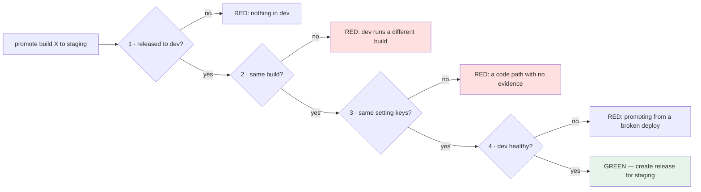

# 2.3 — The promotion gate: what must be true to move up

## One-line answer

A promotion gate is a **short, written list of conditions that must hold before an artifact moves to the next
environment**, checked by a machine and able to refuse — and its value comes entirely from being able to say
*no*, which means every condition on it has to be one you would actually stop for.

---

## The story

🎬 **The scene.** A goods lift in a warehouse, with a weight limit and a light.

The light is amber until the load is under the limit and the doors are shut, then green. Nobody argues with
it. It is not advice.

😬 **The naive fix.** The limit is conservative and the light is slow, so somebody wires a bypass switch "for
when we're in a hurry". It is used twice in the first month, then daily, then it is just how the lift is
operated.

💥 **Why it fails.** Not with a dramatic failure — with a **slow one**. The cable wears at a rate nobody is
measuring because the loads are no longer recorded. The light still works. It is still green most of the time.
And the one piece of information the system was producing — *"this load is over the limit"* — stopped being
produced the day the bypass was added, so there is no data showing anything got worse.

Then the lift is inspected and fails, and nobody can say for how long it had been unsafe.

💡 **The insight.** **A gate that can be bypassed is not a gate; it is a light.** And its most valuable output
is not the stopping — it is the *record of what it stopped*, which is the only evidence that the limit is
doing anything at all.

---

## The idea in plain language

[2.2](2.2-build-release-run.md) produced releases. A **promotion** is creating a release for the next
environment from a build that is already running in the previous one, and a **promotion gate** is what has to
be true first.

The list is short on purpose. Every condition costs something — it can block a legitimate deploy, and each one
is a thing somebody will eventually want to skip — so a condition only earns its place if you would genuinely
refuse to promote without it.

For `pulse` today, four conditions:

| # | Condition | Why it earns its place | What it costs |
| --- | --- | --- | --- |
| 1 | **the same build is already released to the previous environment** | otherwise this is not a promotion, it is a first deploy that skipped a stage | nothing — it is a lookup |
| 2 | **the artifact is identical** — same build ID | otherwise nothing you learned upstream is evidence — [2.1](2.1-build-once-promote-the-artifact.md) | nothing |
| 3 | **configuration key sets match** | a key present in one and absent in the other is a code path with no evidence — [1.2](../01-what-an-environment-is/1.2-the-four-things-that-differ.md) | a real refusal you will meet |
| 4 | **the previous environment is actually healthy on it** | promoting from a deploy that is failing is promoting a known-bad artifact | requires the deploy to be up |

**Notice what is *not* on the list.** Not "the tests pass" — that belongs at build time (Day 13, Day 14), and a
gate that re-runs upstream checks is a gate that is slow and duplicated. Not "an approval" — approvals belong
on the last hop, if at all, and Day 18 discusses when. Not "it has been running for a while" — a soak period is
a real technique and it is a *policy* on top of the gate rather than part of it.

**A promotion gate checks that the promotion is coherent, not that the software is good.**

### Ordered environments

A gate implies an order: `dev → staging → prod`. That order has to be written down somewhere the gate can read,
because condition 1 is *"already released to the previous environment"* and "previous" is meaningless
otherwise.

**Do not derive the order from the environment names.** That would be
[1.4](../01-what-an-environment-is/1.4-the-environment-name-is-not-a-switch.md)'s mistake in a new place: the
day `prod-eu` exists, a name-based ordering has no answer. **Write the chain down as data.**

### The bypass question, answered honestly

Every gate needs an answer to *"what happens in an emergency?"*, and the two wrong answers are common:

- **No bypass at all.** Sounds rigorous; means that during an incident somebody deploys around the entire
  pipeline, by hand, with no record. The gate has not been bypassed — it has been *abandoned*, along with
  everything else it was providing.
- **A quiet bypass.** A flag, a checkbox, an environment variable. It becomes routine within a month, and the
  warehouse lift's slow failure follows.

The workable answer is a **recorded bypass**: it exists, it requires a stated reason, and using it writes a
row somewhere permanent. **The point is not to make it hard; it is to make it visible.** A bypass that is used
four times in a quarter is information; a bypass that is used forty times is a gate whose conditions are
wrong.

---

## Why Kriya needs it

**[2.4](2.4-the-rebuild-that-promoted-something-different.md)** is the failure this gate catches: a rebuild
that produced a different artifact.

**[4.1](../04-pulse-across-environments/4.1-one-artifact-three-releases.md)** is the day's red gate, and it is
condition 3 — configuration parity — made into the check that must be able to fail.

**Day 13** puts the first version of this in CI, where "the tests pass" becomes a build-stage gate.

**Day 14** builds quality gates that *refuse rather than warn*, which is the same argument in the same words,
one stage earlier.

**Day 18 and Day 19** are what happens on the last hop: how the change reaches production, and how it comes
back.

**Day 56's policy engine** is a promotion gate that runs inside the cluster and refuses to admit a workload —
the same idea, enforced by the platform rather than by a script, and impossible to bypass by deploying around
it.

**Day 216's supply chain** work asks a harder version of condition 2: not merely *"is it the same artifact"*
but *"can you prove where it came from"*.

---

## The mechanism

Write the chain down, then check the four conditions.

```bash
cd "$(git rev-parse --show-toplevel)/days/day-010-environments-and-promotion/lab"
printf 'dev staging prod\n' > chain.txt
cat chain.txt
```

**Line by line:**

- One line, three names, in order. **The simplest possible representation of the fact that has to be data
  rather than logic.**
- A file rather than a variable in the script, so adding `prod-eu` is an edit to data rather than to code
  ([1.4](../01-what-an-environment-is/1.4-the-environment-name-is-not-a-switch.md)).

```bash
# lab/gate.sh - the four conditions, checked before a promotion is allowed.
set -u
TARGET="${1:?usage: gate.sh <target-environment> [--reason 'why you are bypassing']}"
ROOT="$(git rev-parse --show-toplevel)"
LAB="$ROOT/days/day-010-environments-and-promotion/lab"
CHAIN=$(cat "$LAB/chain.txt")

# --- which environment comes before the target? -------------------------------
PREV=""
for env in $CHAIN; do
  if [ "$env" = "$TARGET" ]; then break; fi
  PREV="$env"
done
if [ -z "$PREV" ]; then
  echo "GATE: $TARGET is the first environment in the chain; nothing to promote from" >&2
  exit 0
fi

latest_release_for() {
  grep -l "\"environment\": \"$1\"" "$LAB"/releases/*.json 2>/dev/null | sort | tail -1
}
field() { grep -o "\"$2\": \"[^\"]*\"" "$1" | cut -d'"' -f4; }

PREV_FILE=$(latest_release_for "$PREV")
[ -n "$PREV_FILE" ] || { echo "GATE RED [1]: nothing has been released to $PREV" >&2; exit 1; }

PREV_BUILD=$(field "$PREV_FILE" build_id)
BUILD_NOW=$(bash "$LAB/build.sh")

FAIL=0
# --- 1 + 2: the artifact already ran upstream, and it is the same one ---------
if [ "$PREV_BUILD" != "$BUILD_NOW" ]; then
  echo "GATE RED [2]: $PREV runs $PREV_BUILD but the current build is $BUILD_NOW" >&2
  FAIL=1
else
  echo "gate ok  [1,2]: $PREV runs $PREV_BUILD, which is the current build"
fi

# --- 3: configuration key sets match ------------------------------------------
if diff <(cut -d= -f1 "$LAB/envs/$PREV.env" | sort) \
        <(cut -d= -f1 "$LAB/envs/$TARGET.env" | sort) > /tmp/keydiff.txt; then
  echo "gate ok  [3]: $PREV and $TARGET declare the same settings"
else
  echo "GATE RED [3]: settings differ between $PREV and $TARGET:" >&2
  sed 's/^/           /' /tmp/keydiff.txt >&2
  FAIL=1
fi

# --- 4: the previous environment is answering on that release -----------------
PREV_PORT=$(grep '^PULSE_PORT=' "$LAB/envs/$PREV.env" | cut -d= -f2)
CODE=$(curl -sS -o /dev/null -m 3 -w '%{http_code}' "http://127.0.0.1:$PREV_PORT/healthz" || echo 000)
if [ "$CODE" = "200" ]; then
  echo "gate ok  [4]: $PREV is healthy on :$PREV_PORT"
else
  echo "GATE RED [4]: $PREV returned $CODE on :$PREV_PORT/healthz" >&2
  FAIL=1
fi

[ "$FAIL" -eq 0 ] || { echo "GATE RED: promotion to $TARGET refused" >&2; exit 1; }
echo "GATE GREEN: $BUILD_NOW may be promoted to $TARGET"
```

**Line by line:**

- `TARGET` is required. **A gate with a defaulted target is a gate that approves the wrong promotion** — the
  same `:?` discipline as
  [Day 9, 3.4](../../../day-009-configuration-and-secrets/parts/03-fail-fast/3.4-the-service-that-started-with-the-wrong-config.md).
- The `for` loop over `$CHAIN` finds the environment **before** the target by walking the ordered list. It
  breaks *at* the target, so `PREV` holds the one before it. **Unquoted `$CHAIN` on purpose**, so the shell
  word-splits the line into names — one of the rare cases where word splitting is the intended behaviour, and
  worth flagging because it is normally a bug.
- The first environment in the chain **exits `0`, not `1`**. Promoting *to* `dev` is not a promotion, and a
  gate that fails on a legitimate first deploy is a gate people disable.
- `latest_release_for()` uses `grep -l` (list *files*, not lines) and `sort | tail -1` to pick the
  highest-numbered release file for that environment. **This relies on the zero-padded IDs from
  [2.2](2.2-build-release-run.md)**, which is why they were padded.
- `field()` is a two-line JSON reader. Crude, dependency-free, and it will break on a value containing a
  quote — stated here rather than discovered later.
- `BUILD_NOW=$(bash "$LAB/build.sh")` — **the gate computes the current build itself** rather than being told
  what it is. A gate that accepts the artifact identity as an argument is a gate that can be lied to.
- `FAIL=0` and each condition setting it rather than exiting immediately: **all four conditions are evaluated
  and reported**, so one run tells you everything that is wrong. Exiting on the first is the mistake
  [Day 9, 2.1](../../../day-009-configuration-and-secrets/parts/02-typed-settings/2.1-hand-rolling-the-settings-object.md)
  identified — one failure per run means one investigation per run.
- Condition 3 uses `diff` on **key sets** via `cut -d= -f1`, exactly as
  [1.1](../01-what-an-environment-is/1.1-an-environment-is-a-deploy-not-a-folder.md) built it. `diff` exits `0`
  when the files match, which is why the `if` reads naturally.
- The diff output is indented into the error message, so a refusal **shows the offending keys** rather than
  saying "settings differ".
- Condition 4 uses `-m 3` (a three-second maximum) so the gate cannot hang on an unresponsive service
  ([Day 7, 4.1](../../../day-007-networking-for-operators/parts/04-timeouts/4.1-a-timeout-is-a-decision-not-a-safety-net.md)),
  and `|| echo 000` so a refused connection becomes a value rather than an empty string.
- `/healthz` and not `/version`, because condition 4 is asking *"is the previous deploy up"*, which is exactly
  what Day 3 built `/healthz` to answer and nothing more
  ([Day 3, 2.2](../../../day-003-pulse-v0/parts/02-the-service/2.2-healthz-the-endpoint-that-must-not-lie.md)).
- **Every refusal goes to standard error and exits non-zero.** The exit code is the interface; the messages
  are for the human who has to fix it.

Run it green:

```bash
cd "$(git rev-parse --show-toplevel)"
LAB=days/day-010-environments-and-promotion/lab
BUILD=$(bash "$LAB/build.sh")
bash "$LAB/release.sh" "$BUILD" dev >/dev/null
bash "$LAB/run.sh" "$(ls "$LAB"/releases/*.json | xargs -n1 basename | sed 's/.json//' | tail -1)" > /tmp/dev.log 2>&1 &
sleep 4
bash "$LAB/gate.sh" staging ; echo "exit=$?"
```

**Line by line:**

- A release to `dev` and then a *run* of it, because condition 4 needs the previous environment to be
  answering.
- The `ls | xargs | sed | tail` pipeline picks the newest release ID. **Ugly, and honest** — it is what a
  five-line lab does instead of keeping an index, and the ugliness is a signal that the real version needs a
  proper ledger.
- `sleep 4` so uvicorn is listening before the gate probes it.

```text
gate ok  [1,2]: dev runs build-14a1dcd2f0b4, which is the current build
gate ok  [3]: dev and staging declare the same settings
gate ok  [4]: dev is healthy on :8000
GATE GREEN: build-14a1dcd2f0b4 may be promoted to staging
exit=0
```

Now make each condition fail, one at a time. **This is the part that matters** — a gate you have only seen
green is a light.

```bash
cd "$(git rev-parse --show-toplevel)"
LAB=days/day-010-environments-and-promotion/lab

echo '=== [2] the build moved on ==='
git commit --allow-empty -q -m "empty commit to change the build id"
bash "$LAB/gate.sh" staging ; echo "exit=$?"
git reset --hard -q HEAD~1

echo '=== [3] a setting exists in one and not the other ==='
printf 'PULSE_MODEL_API_KEY=\n' >> "$LAB/envs/staging.env"
bash "$LAB/gate.sh" staging ; echo "exit=$?"
sed -i '/^PULSE_MODEL_API_KEY=$/d' "$LAB/envs/staging.env"

echo '=== [4] the previous environment is down ==='
pkill -f 'pulse.api:app'; sleep 1
bash "$LAB/gate.sh" staging ; echo "exit=$?"
```

**Line by line:**

- `git commit --allow-empty` — a commit with no changes. **The cleanest possible way to change the build ID
  without changing anything**, which makes the point that the ID tracks the commit rather than the content.
- `git reset --hard -q HEAD~1` undoes it. `--hard` discards the commit and the working tree state; here there
  is nothing to lose because the commit was empty, and **that qualification matters** — `reset --hard` is the
  most destructive command in this day and Day 11 covers when it is safe
  ([Day 11, 4.1](../../../day-011-version-control-for-operators/parts/04-undo/4.1-the-four-undos.md)).
- Appending `PULSE_MODEL_API_KEY=` to staging only — **the exact failure
  [1.2](../01-what-an-environment-is/1.2-the-four-things-that-differ.md) named**: a key in one deploy and not
  the other, meaning a code path with no evidence behind it.
- `sed -i '/^…$/d'` removes exactly that line, anchored, so it cannot delete anything else.
- Condition 4 is failed by stopping the service, which is also the cleanup.

```text
=== [2] the build moved on ===
GATE RED [2]: dev runs build-14a1dcd2f0b4 but the current build is build-7f3e9c1a8b04
gate ok  [3]: dev and staging declare the same settings
gate ok  [4]: dev is healthy on :8000
GATE RED: promotion to staging refused
exit=1
=== [3] a setting exists in one and not the other ===
gate ok  [1,2]: dev runs build-14a1dcd2f0b4, which is the current build
GATE RED [3]: settings differ between dev and staging:
           1a2
           > PULSE_MODEL_API_KEY
gate ok  [4]: dev is healthy on :8000
GATE RED: promotion to staging refused
exit=1
=== [4] the previous environment is down ===
gate ok  [1,2]: dev runs build-14a1dcd2f0b4, which is the current build
gate ok  [3]: dev and staging declare the same settings
GATE RED [4]: dev returned 000 on :8000/healthz
GATE RED: promotion to staging refused
exit=1
```

**Three refusals, each naming its condition, and in every case the other conditions still reported.**



---

## When it breaks

**The gate that was bypassed into irrelevance.** The warehouse lift:

```text
$ grep -c 'BYPASS' promotions.log
41
$ grep -c 'GATE GREEN' promotions.log
12
```

**What it says:** forty-one bypasses and twelve clean passes.
**What it actually means:** the gate refuses more often than it approves, so it is **not a safety mechanism,
it is an obstacle** — and the conditions are almost certainly wrong rather than the promotions being wrong.
**The smallest fix:** read the bypass reasons. If thirty of them say the same thing, that condition is
mis-specified and should be changed or removed.
**Why counting bypasses is the whole point of recording them:** a bypass rate is the only feedback a gate
gets. Without it, a bad condition survives indefinitely because everybody has quietly learned to route around
it.

**The condition that could not fail.** The vacuous gate, for the third time in three days:

```text
gate ok  [3]: dev and staging declare the same settings
```

...with `envs/staging.env` missing entirely.

**What it says:** the settings match.
**What it actually means:** `cut -d= -f1` on a nonexistent file produced empty output, and `diff` of two empty
streams is a match. **A check built on comparison passes when both sides are absent.**
**The smallest fix:** assert both files exist, and that the key sets are non-empty, before comparing.
**Why this keeps recurring:** Day 0's incident row 9, Day 9's empty allowlist, Day 9's leak gate with nothing
set, and now this. **Every check built on difference or absence has this failure**, and the fix is always the
same: check that the check had something to check.

**The healthy check that was not.** Condition 4, believed too much:

```text
gate ok  [4]: dev is healthy on :8000
```

...while `dev` is serving `500` on every real endpoint.

**What it says:** healthy.
**What it actually means:** `/healthz` reports only that the process can answer — which is exactly what Day 3
designed it to do and is the correct design
([Day 3, 2.2](../../../day-003-pulse-v0/parts/02-the-service/2.2-healthz-the-endpoint-that-must-not-lie.md)).
**Condition 4 is much weaker than its name suggests**, and calling it "healthy" oversells it.
**The smallest fix:** probe something that exercises the change — a smoke test against a real endpoint, which
is Day 9's
[3.4](../../../day-009-configuration-and-secrets/parts/03-fail-fast/3.4-the-service-that-started-with-the-wrong-config.md)
and belongs in the gate.
**The honest framing:** a liveness probe as a promotion condition tells you the previous deploy *started*. If
you want "it works", you have to say what "works" means and check that.

**The promotion that skipped a hop.** Condition 1, doing its job:

```text
GATE RED [1]: nothing has been released to staging
```

...on an attempted promotion to `prod`.

**What it says:** staging has no release.
**What it actually means:** somebody is deploying straight to production. It may be entirely legitimate — a
hotfix, a first deploy, an environment that was rebuilt — **and it should still be refused by default and
allowed only with a recorded reason**, because the difference between "we chose to skip staging" and "we
forgot staging exists" is invisible afterwards unless somebody wrote it down.
**The smallest fix:** the recorded bypass.
**Why the default matters more than the exception:** the exception will be used; the question is only whether
it leaves a trace.

---

## In production

**What a professional writes instead of the teaching version.** The gate lives in the pipeline, not on a
laptop, and it is **the same code for every environment** with the conditions parameterised — because a gate
that is stricter for production is a gate whose production path is the least-tested one. The bypass exists,
requires a reason, and posts it where people see it. And the conditions are reviewed periodically against the
bypass log, which is the feedback loop that keeps the list short and real.

**What degrades at scale.** The number of hops and the coupling between them. With three environments the
chain is a line; with regions, tenants and canaries it is a graph, and *"the previous environment"* stops
being a single answer. At that point the gate's conditions have to be expressed against a **set** — *"this
build is healthy in at least two regions and has been for a period"* — and the ordering moves into the
deployment tool. **The condition that survives all the way up is condition 2**, artifact identity, which is
why it is the one Day 216's supply-chain work makes cryptographic rather than merely equal.

**The failure that only shows with real traffic.** A gate whose health condition is satisfied by a deploy
that has never taken traffic. Staging is up, `/healthz` is `200`, and nothing has sent it a request in three
days — so *"healthy in staging"* means the process starts, and nothing more. The change being promoted could
break every request. **A promotion condition based on a deploy nobody uses is a condition based on nothing**,
and it is why teams eventually add synthetic traffic to pre-production environments rather than more probes.

**The review comment a senior engineer leaves.** *"The gate checks that staging is healthy, but staging gets
no traffic, so all we are asserting is that the process starts — which CI already proved. Either send synthetic
traffic at staging and check the error rate, or drop the condition and be honest that we promote on artifact
identity and config parity alone. A condition that sounds strong and is weak is worse than not having it,
because people believe it."*

**The signal you would alert on.** Two, and both are about the gate rather than the software: **the bypass
rate** (a dashboard, reviewed — the gate's only feedback), and **a release existing in an environment that no
gate approved**, which means something deployed outside the pipeline and is the highest-value integrity signal
there is (Day 217). Neither is a page. The gate itself does not alert — **it refuses, which is strictly better
than notifying**, and Day 9's
[3.1](../../../day-009-configuration-and-secrets/parts/03-fail-fast/3.1-fail-fast-the-crash-that-saves-the-night.md)
made the same argument about startup validation: a mechanism that stops the thing beats a message about the
thing.

**Blast radius.** This part introduces a script that **decides whether a deployment may proceed** — the first
thing in this curriculum with authority over a release. Its failure modes are symmetric and both are real: a
false refusal blocks a legitimate deploy, possibly during an incident; a false pass approves a promotion that
should have stopped, and the vacuous-condition failure above is exactly how that happens silently. What bounds
it: every condition reports separately so a refusal names its cause; the gate computes the artifact identity
itself rather than trusting an argument; and it has no power to deploy anything — it only exits `0` or `1`.
Who can trigger it: you today; a pipeline later, which is when the bypass question stops being theoretical.
**The failing-open direction is the dangerous one**, and the checklist requires all four conditions to have
been seen red.

**Cost.** `0` model calls, `0` tokens, `0` CI minutes, `0` new packages, `0` network beyond loopback. RAM: one
uvicorn process at roughly 60 MB. Disk: a few small files. **Note: the gate creates a build record every time
it runs**, which is a small and deliberate accumulation — and a `TODO(me)` in the hub asks whether that is
right.

**The interview question.** *"What has to be true before you promote to production?"* The answer that shows a
short list rather than a long one: *"Four things: the same artifact is already released to the previous
environment, it is byte-identical rather than rebuilt, the configuration key sets match so there is no code
path that has never been exercised upstream, and the previous environment is actually healthy on it. Not the
tests — those are a build-stage gate and re-running them here is duplication. The thing I care about more than
the list is that the gate can refuse and that the bypass is recorded, because the bypass rate is the only
feedback a gate ever gets — if it is being bypassed more often than it passes, the conditions are wrong, not
the deploys. And I watch for conditions that pass vacuously: a config-parity check where one side is missing
compares two empty sets and goes green."*

---

## Check yourself

```bash
cd "$(git rev-parse --show-toplevel)"
LAB=days/day-010-environments-and-promotion/lab
bash "$LAB/gate.sh" dev ; echo "first-hop exit=$?"
bash "$LAB/gate.sh" prod ; echo "unreleased-previous exit=$?"
```

The first exits `0` and explains that `dev` has nothing before it; the second exits `1` because nothing has
been released to `staging`. **Two different non-failures and one failure — say which is which.**

**Say out loud, without scrolling up:** *Name the four conditions and say which one you would drop first and
why — then explain what a bypass counter tells you that the gate's pass rate does not.*
