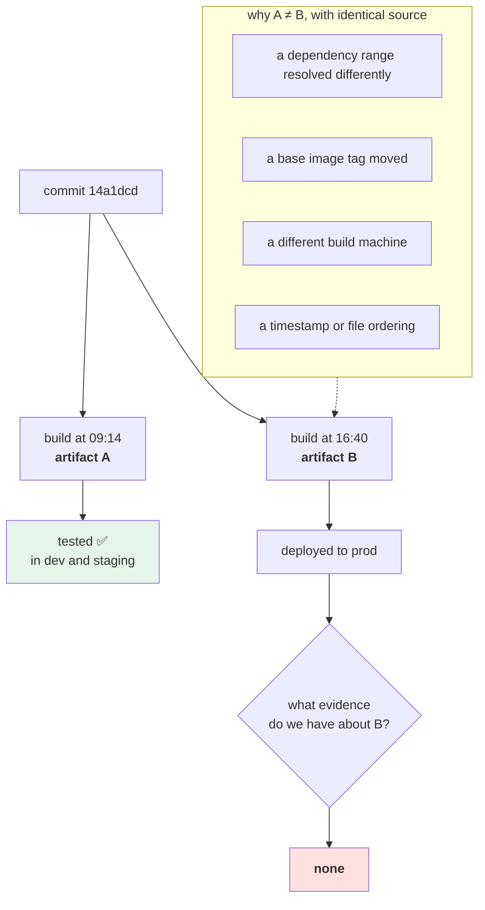

# 2.4 — The rebuild that promoted something different

## One-line answer

Two builds of the same commit, minutes apart, can produce different programs — and the way you find out is not
a diff of the source, which is identical, but a **comparison of the artifacts**, which is why artifact identity
has to be something you compute rather than something you assume.

---

## The story

🎬 **The scene.** A key-cutting kiosk in a shopping centre.

You hand over a key; the machine traces it and cuts a copy. The copy works. You have three cut over the years,
all from the same original, and all three work.

😬 **The naive fix.** You lose the original. No problem: cut the next one from copy number three.

💥 **Why it fails.** Each copy is traced from a physical object, and each trace has a tolerance — a hair either
way. Copy three was cut from copy two, which was cut from copy one. The errors did not cancel; they
accumulated, in the same direction, because the machine's follower sits a fraction wide.

The new key does not turn. And **you cannot see why by looking at it** — it is visibly a copy of your key,
the ridges are in the right places, the blank is right. The difference is a fraction of a millimetre in three
places, and the only way to find it is to measure, not to look.

💡 **The insight.** **"Made from the same thing" is not "the same thing".** Every reproduction runs through a
process with a tolerance, and the differences are invisible to inspection precisely because inspection compares
the *description* rather than measuring the *object*.

---

## The idea in plain language

[2.1](2.1-build-once-promote-the-artifact.md) claimed that rebuilding from the same source can produce a
different artifact. This part demonstrates it, on this machine, in a way you can watch — and then shows what
catches it.

The claim is easy to disbelieve, because the obvious mental model is: *same input, same program, same output.*
That model is right for a pure function and a build is not one. A build reads:

- your source (identical, by assumption);
- your dependency specification (identical);
- **whatever the package index returns today** (not identical);
- **whatever the base image tag points at today** (not identical);
- **the build machine's own libraries and tools** (not identical between machines);
- **the clock** (not identical, and it ends up in timestamps and cache keys).

Only the first two are under your control by default. Every mechanism in Phase 2 and Phase 3 — the lockfile,
the digest pin, the container, the hermetic build — exists to bring one more of the others under control.

### What "reproducible" actually means

A build is **reproducible** when the same inputs produce a bit-for-bit identical output, every time, on every
machine. It is a strong property, it is achievable, and it is achieved deliberately rather than by accident:
timestamps normalised, file ordering fixed, environment scrubbed, network access removed.

**This project is not there and Day 15 is where it starts.** Today's honest position is:

| Input | Controlled today? | By what |
| --- | --- | --- |
| source | ✅ | the commit SHA |
| direct dependencies | ✅ | exact `==` pins in `pyproject.toml` |
| transitive dependencies | ✅ | `uv.lock`, committed since Day 0 |
| Python patch version | ⚠️ partly | `requires-python = "==3.12.*"` — the minor, not the patch |
| the operating system and C libraries | ❌ | nothing — Day 21 |
| the clock and file ordering | ❌ | nothing — Day 15 |

**Three ticks, one warning and two crosses**, and the two crosses are why "it works on my machine" is still a
sentence people say.

### Why the gate catches it and a diff does not

`git diff` compares source. When the source is identical it reports nothing, correctly, and tells you nothing
about the artifacts.

[2.3](2.3-the-promotion-gate.md)'s condition 2 compares **build identity**. That is a different question, and
it is the one that matters — which is why the gate computes the build itself rather than accepting it as an
argument.

**The general principle: compare the objects you ship, not the descriptions you shipped them from.**

---

## Why Kriya needs it

**[2.3](2.3-the-promotion-gate.md)'s condition 2** is the check this failure motivates.

**Day 15** makes the artifact a real object — a wheel with a digest — and asks whether two builds of the same
commit produce the same digest. **Today's answer is "no", and knowing why is what makes that day meaningful.**

**Day 23** pins the base image by digest, which closes the largest of the two crosses in the table above.

**Day 30** scans images and compares them, which requires digests to be stable.

**Day 107** asks you to reproduce a prediction from six months ago. Every uncontrolled input in the table
becomes an unanswerable question at that distance, and this is the day you first meet the list.

**Day 216's supply chain** work is the endgame: not merely *"is this the same artifact"* but *"can you prove
this artifact came from that source, built by that pipeline"*.

---

## The mechanism

Produce the failure. Three ways, in increasing order of how much they should worry you.

**One — the empty commit.** The cheapest demonstration that identity is not content:

```bash
cd "$(git rev-parse --show-toplevel)"
LAB=days/day-010-environments-and-promotion/lab
echo "build A: $(bash "$LAB/build.sh")"
git commit --allow-empty -q -m "no source change at all"
echo "build B: $(bash "$LAB/build.sh")"
echo "source diff between the two commits:"
git diff HEAD~1 HEAD --stat || echo "  (no changes)"
git reset --hard -q HEAD~1
```

**Line by line:**

- `git commit --allow-empty` creates a commit whose tree is **identical** to its parent's. Git normally
  refuses this, because a commit with no changes is usually a mistake; the flag says you mean it.
- `git diff HEAD~1 HEAD --stat` prints nothing, because there is nothing. **The source is provably identical
  and the build ID is different.**
- `git reset --hard -q HEAD~1` discards the empty commit. **`--hard` also discards working-tree changes**, and
  it is safe here only because the commit was empty and the tree is clean — Day 11 covers the family properly
  ([Day 11, 4.1](../../../day-011-version-control-for-operators/parts/04-undo/4.1-the-four-undos.md)). Running
  it with uncommitted work in the tree loses that work.

```text
build A: build-14a1dcd2f0b4
build B: build-7f3e9c1a8b04
source diff between the two commits:
  (no changes)
```

**Two different build IDs, zero source differences.** This one is not a *problem* — it is a demonstration that
the build ID tracks the commit rather than the content, which is a deliberate design choice with a real
consequence: **an empty commit invalidates a promotion.** Whether that is right is a genuine question, and it
is one of the day's `TODO(me)` items.

**Two — the dependency that moved.** The real failure, simulated safely:

```bash
cd "$(git rev-parse --show-toplevel)/days/day-010-environments-and-promotion/lab"
mkdir -p rebuild
cat > rebuild/requirements-loose.txt <<'EOF'
pydantic-settings>=2.0
EOF
cat > rebuild/requirements-pinned.txt <<'EOF'
pydantic-settings==2.15.0
EOF
echo "--- what a loose specification resolves to, right now ---"
uv pip compile rebuild/requirements-loose.txt 2>/dev/null | grep -E '^(pydantic|python-dotenv)' | head -4
echo "--- what an exact pin resolves to ---"
uv pip compile rebuild/requirements-pinned.txt 2>/dev/null | grep -E '^(pydantic|python-dotenv)' | head -4
```

**Line by line:**

- `pydantic-settings>=2.0` — a **range**. It says "anything from 2.0 upwards", so it resolves to whatever is
  newest at the moment the build runs. **Two builds a week apart get different versions and neither is
  wrong.**
- `uv pip compile` — resolve a specification into a fully-pinned list, without installing anything. **This is
  the command Principle 7 refers to when it says "or `uv pip compile` for a resolved answer"**, and it is the
  cheapest way to see what a loose specification actually means today.
- `2>/dev/null` because the tool writes progress to standard error, which would interleave with the two
  headings and make the comparison unreadable.
- `grep -E '^(pydantic|python-dotenv)'` — the direct dependency and its transitive one, which is the pair that
  matters ([Day 9, 2.2](../../../day-009-configuration-and-secrets/parts/02-typed-settings/2.2-adopting-pydantic-settings.md)).
- **Neither file is installed and neither touches the project's own environment.** `uv pip compile` reads and
  resolves; nothing is written into `.venv`.

```text
--- what a loose specification resolves to, right now ---
pydantic==2.13.4
pydantic-settings==2.15.0
python-dotenv==1.2.3
--- what an exact pin resolves to ---
pydantic==2.13.4
pydantic-settings==2.15.0
python-dotenv==1.2.3
```

**Today they agree, and that is the trap.** The loose specification is *currently* correct and will silently
stop being so the day a new release lands — and the build that picks it up will be the one nobody tested.
**A range is a bug with a delayed fuse**, and the fact that the two columns match today is exactly why people
leave ranges in.

**Look at the third line in both columns.** `python-dotenv==1.2.3` was never written down anywhere in this
project — it arrived transitively
([Day 9, 2.2](../../../day-009-configuration-and-secrets/parts/02-typed-settings/2.2-adopting-pydantic-settings.md)),
and **it is pinned only because `uv.lock` pins the whole graph.** An exact pin on your direct dependency does
not constrain its dependencies; only a lockfile does.

**Three — the thing no lockfile covers.** The uncontrolled inputs:

```bash
cd "$(git rev-parse --show-toplevel)"
uv run python - <<'PY'
import hashlib, platform, ssl, sys, sysconfig
facts = {
    "python": sys.version.split()[0],
    "openssl": ssl.OPENSSL_VERSION,
    "platform": platform.platform(),
    "abiflags": sysconfig.get_config_var("SOABI") or "",
}
for key, value in facts.items():
    print(f"{key:10} {value}")
digest = hashlib.sha256("|".join(facts.values()).encode()).hexdigest()[:16]
print(f"{'fingerprint':10} {digest}")
PY
grep -c '' uv.lock
```

**Line by line:**

- Four facts, none of which is in `uv.lock` and all of which are part of what the program *is*.
- `sysconfig.get_config_var("SOABI")` — the ABI tag for compiled extension modules, e.g.
  `cpython-312-x86_64-linux-gnu`. **It is the single most compact statement of "which compiled wheels are
  compatible with this interpreter"**, and a wheel built for one is not usable on another.
- `hashlib.sha256(...)` over the joined values — a **fingerprint of the build environment**. It is not a
  security measure; it is an identifier, so two machines can compare one string instead of four.
- `[:16]` — sixteen hex characters, enough to compare by eye and far more than enough to distinguish two
  laptops.
- `grep -c ''` counts the lines in `uv.lock` — a rough measure of how much *is* pinned, printed next to the
  list of what is not, so the contrast is on one screen.

```text
python     3.12.10
openssl    OpenSSL 3.5.6 7 Apr 2026
platform   Windows-11-10.0.26200-SP0
abiflags   cp312-win_amd64
fingerprint 4b19e0c7a3f5d268
2041
```

**Two thousand and forty-one lines of pinned dependency graph, and four facts underneath it that nothing
pins.** Move this project to a Linux machine and every one of the four changes — same commit, same lockfile,
different program. **That gap is precisely the size of Phase 3.**

### The gate catching it

Put the failure and the gate together — the point of the whole section:

```bash
cd "$(git rev-parse --show-toplevel)"
LAB=days/day-010-environments-and-promotion/lab

echo '--- promote build A to dev, and run it ---'
BUILD_A=$(bash "$LAB/build.sh")
R=$(bash "$LAB/release.sh" "$BUILD_A" dev)
bash "$LAB/run.sh" "$R" > /tmp/dev.log 2>&1 &
sleep 4

echo '--- somebody commits, then tries to promote "the same thing" to staging ---'
git commit --allow-empty -q -m "a change that changes nothing"
bash "$LAB/gate.sh" staging ; echo "exit=$?"

echo '--- restore ---'
git reset --hard -q HEAD~1
bash "$LAB/gate.sh" staging ; echo "exit=$?"
pkill -f 'pulse.api:app'
```

**Line by line:**

- The sequence is the realistic one: **a build is released and running, then the source moves on, then
  somebody promotes.** In a real pipeline the second step is an unrelated merge by somebody else.
- The gate is run twice with only the git state differing, so the refusal is attributable to exactly one thing.
- `git reset --hard -q HEAD~1` restores, and the second gate run **proves the restore worked** — the same
  green-red-green discipline as every gate in this curriculum.

```text
--- promote build A to dev, and run it ---
--- somebody commits, then tries to promote "the same thing" to staging ---
GATE RED [2]: dev runs build-14a1dcd2f0b4 but the current build is build-7f3e9c1a8b04
gate ok  [3]: dev and staging declare the same settings
gate ok  [4]: dev is healthy on :8000
GATE RED: promotion to staging refused
exit=1
--- restore ---
gate ok  [1,2]: dev runs build-14a1dcd2f0b4, which is the current build
gate ok  [3]: dev and staging declare the same settings
gate ok  [4]: dev is healthy on :8000
GATE GREEN: build-14a1dcd2f0b4 may be promoted to staging
exit=0
```

**The gate refused a promotion whose source diff was empty.** No test would have caught it, because there was
nothing to test; no review would have caught it, because there was nothing to review. **Only a comparison of
artifact identities sees it.**



---

## When it breaks

**The base image that moved overnight.** The most common real instance:

```text
$ docker build -t pulse:0.1.0 .          # Monday
 => [1/6] FROM docker.io/library/python:3.12@sha256:9c2e1a4f...
$ docker build -t pulse:0.1.0 .          # Friday
 => [1/6] FROM docker.io/library/python:3.12@sha256:4f7b3d81...
$ docker images --digests | grep pulse
pulse   0.1.0   sha256:e91c...   (Friday's)
```

**What it says:** the same tag, built twice, from different bases.
**What it actually means:** Friday's image contains different system packages, a different OpenSSL, possibly a
different Python patch release. **And the tag `pulse:0.1.0` now points at the second one**, so anything that
pulls "0.1.0" gets a different program than the thing that was tested on Monday.
**The smallest fix:** `FROM python:3.12@sha256:9c2e1a4f…` — pin by digest. Day 23.
**Why it is the canonical example:** it requires no mistake by anybody. The tag moving is the registry working
as designed.

**The tag that was reused.** The identity that stopped being one:

```text
$ git tag -f v1.4.0 HEAD
Updated tag 'v1.4.0' (was a91f0c2)
$ git push --force origin v1.4.0
```

**What it says:** a tag was moved.
**What it actually means:** `v1.4.0` used to name one commit and now names another. **Every record that says
"we deployed v1.4.0" is now ambiguous**, including the incident report from last month. This is the
append-only rule from
[2.2](2.2-build-release-run.md) broken at the version level, and Day 16 will state the rule plainly: **a
released version is never re-pointed.**
**The smallest fix:** a new version. There is never a good reason to move a released tag.
**Why people do it:** the release was wrong and re-releasing feels like admitting it. The cost is that
history stops being evidence.

**The two machines that disagreed.** The uncontrolled inputs, in person:

```text
$ # laptop
$ uv run python -c "import cryptography; print(cryptography.__version__)"
46.0.4
$ # CI runner
$ uv run python -c "import cryptography; print(cryptography.__version__)"
46.0.4
$ # ...and yet
$ uv run python -c "import cryptography; print(cryptography.hazmat.backends.default_backend())"
# different OpenSSL underneath, same Python package version
```

**What it says:** the same package version on both.
**What it actually means:** a package with compiled components links against system libraries, so **the same
version number can wrap different native code.** The lockfile pinned the wheel; it did not pin what the wheel
was built against or what it dynamically links to.
**The smallest fix:** the container, which fixes the whole userland. Day 21.
**Why this one changes how people think:** it is the moment "pin your dependencies" stops feeling sufficient.

**The gate that refused an empty commit.** The false positive worth arguing about:

```text
GATE RED [2]: dev runs build-14a1dcd2f0b4 but the current build is build-7f3e9c1a8b04
```

...where the only difference is a commit with an empty tree — a merge commit, a rebase, a signed-off amend.

**What it says:** different builds.
**What it actually means:** the build ID is derived from the *commit*, and commits change for reasons that do
not change content. **The gate is technically correct and operationally annoying**, and annoying gates get
bypassed ([2.3](2.3-the-promotion-gate.md)).
**The smallest fix:** derive the build ID from the **tree**, not the commit — `git rev-parse HEAD^{tree}` is a
content address for the source, and two commits with identical content share it.
**Why this is left as a `TODO(me)` rather than fixed here:** the trade is real in both directions. A tree hash
ignores the commit message and the parentage, so two releases could share an ID while differing in history —
which matters for audit. **Deciding is the exercise**, and writing down which you chose and why is the
deliverable.

---

## In production

**What a professional writes instead of the teaching version.** They make the artifact identity a **digest of
the shipped object**, not of the source — an image digest, a wheel hash, a signed attestation — because that is
the only identity that covers everything that went in. Then they attach provenance: which commit, which
pipeline run, which builder, which inputs. Day 216's supply-chain work is that, and its practical payoff is
that *"is this the artifact we tested"* becomes a cryptographic question rather than a bookkeeping one.

**What degrades at scale.** The number of uncontrolled inputs, multiplied by the number of build machines. One
laptop building for one target has a small surface; a fleet of build agents with different base images, caches
and network paths has a large one, and the symptom is a flaky build — *"re-run it and it passes"* — which is
almost always non-determinism in the build rather than in the tests. **The fix is not more retries; it is
removing an input**, and the usual order is: pin the base by digest, remove network access from the build,
normalise timestamps, fix file ordering.

**The failure that only shows with real traffic.** An artifact difference that is invisible until load. A
transitive dependency that resolved to a version with a different default connection-pool size, a different
retry policy, or a changed timeout — none of which appears in your code, all of which appears at a thousand
requests per second
([Day 8, 2.2](../../../day-008-http-and-tls/parts/02-the-connection/2.2-the-connection-pool-and-its-limits.md)).
**Two artifacts that pass identical test suites can behave differently under concurrency**, and the difference
is a library nobody in your team has ever named.

**The review comment a senior engineer leaves.** *"The deploy pipeline rebuilds the image on the production
job rather than reusing the one staging validated. That means production runs an image nobody has tested, and
because the base is a tag rather than a digest, on any given day it may not even be the same operating system.
Build once, push by digest, and have the production job reference that digest."*

**The signal you would alert on.** **The artifact identity running in each environment, as a metric label** —
and the alert that matters is *"an identity is running in production that no promotion record mentions"*,
which means something was built or deployed outside the pipeline. That is worth paging in a regulated setting
and worth a daily report everywhere else (Day 217). A second, cheaper one: **a build ID appearing more than
once with different content digests** — that is a build-determinism failure and it is the thing Day 15's
reproducibility work is measured against. You would **not** alert on artifacts differing between environments
during a rollout; that is the normal case.

**Blast radius.** This part **modifies git history** — it creates and then removes an empty commit with
`git reset --hard` — and that is the most consequential operation in this day. Worst case: `reset --hard` is
run with real uncommitted work in the tree and that work is destroyed, with no undo except the reflog
([Day 11, 4.3](../../../day-011-version-control-for-operators/parts/04-undo/4.3-the-force-push-and-the-reflog.md)).
What bounds it: the commit created is empty by construction, the reset targets exactly `HEAD~1`, and **the
checklist requires `git status --short` to be clean before this part is run.** It also runs `uv pip compile`,
which contacts the package index read-only and installs nothing. Who can trigger it: you. **Do not run this
part with uncommitted work.**

**Cost.** `0` model calls, `0` tokens, `0` CI minutes, `0` new packages installed. **Network: two `uv pip
compile` resolutions against the package index** — metadata only, a few hundred kilobytes. RAM: one uvicorn
process at roughly 60 MB. Disk: two small requirement files.

**The interview question.** *"You built the same commit twice and got different artifacts. How?"* The answer
that shows the input list: *"Because a build is not a pure function of the source. It also reads the package
index, the base image tag, the build machine's own libraries and the clock. A dependency range resolves to
whatever is newest that day; a tag like `python:3.12` moves whenever the maintainers rebuild; a compiled wheel
links against system libraries that differ between machines. A lockfile closes the first two and nothing about
the last two — which is what containers are actually for. The practical consequence is that promotion has to
compare artifact identities rather than source, because a source diff of the two builds is empty, so no test
and no review can see the difference. And the identity has to be a digest of the shipped object, not of the
commit, because that is the only thing that covers all the inputs."*

---

## Check yourself

```bash
cd "$(git rev-parse --show-toplevel)"
git status --short   # MUST be empty before continuing
LAB=days/day-010-environments-and-promotion/lab
A=$(bash "$LAB/build.sh"); git commit --allow-empty -q -m tmp; B=$(bash "$LAB/build.sh")
echo "A=$A"; echo "B=$B"; git diff HEAD~1 HEAD --stat; git reset --hard -q HEAD~1
echo "after restore: $(bash "$LAB/build.sh")"
```

Two different build IDs, an empty source diff, and a third ID that matches the first. **If the last line does
not equal `A`, the restore did not work — stop and find out why before doing anything else.**

**Say out loud, without scrolling up:** *Name four inputs to a build that are not your source code, say which
two `uv.lock` controls, and explain why comparing the source tells you nothing about whether two artifacts are
the same.*
