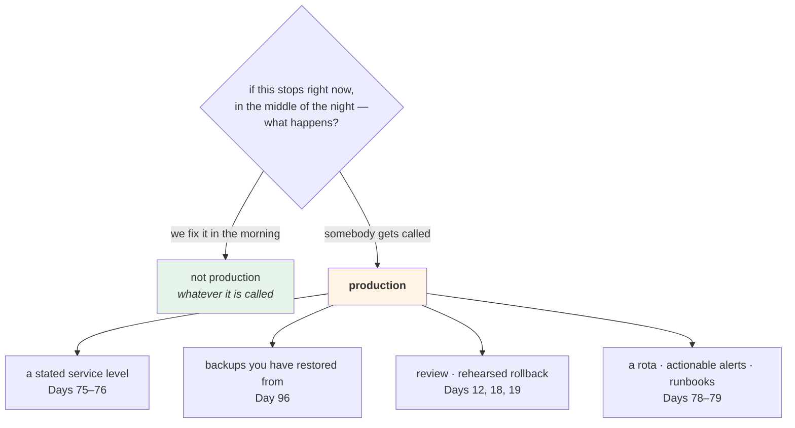

# 3.1 — What the word "production" actually promises

## One-line answer

"Production" is not a place, a size or a level of polish — it is a **set of promises**: that somebody is
relying on it, that its data is irreplaceable, that its mistakes are irreversible, and that somebody has agreed
to be woken up for it.

---

## The story

🎬 **The scene.** A community hall with a defibrillator on the wall, in a green cabinet.

Nothing about the cabinet is impressive. It cost less than the projector. It sits there for years doing
nothing.

😬 **The naive fix.** During a refurbishment, the cabinet is moved to the store cupboard, because it is in the
way and nobody has ever used it. The store cupboard is locked at weekends. Everything else about it is
unchanged: the same device, the same battery, the same pads.

💥 **Why it fails.** It fails on the one afternoon it matters, and it fails **not because the device stopped
working** but because a promise stopped being true. The promise was never a property of the device. It was
*"somebody can reach this within a couple of minutes, at any hour, without a key"* — and that promise was
never written down, so the person doing the refurbishment could not have broken it deliberately.

They moved a box. The box was fine.

💡 **The insight.** **The thing that makes something critical is a set of promises about it, not a property of
it.** Promises that are not written down are invisible to the next person, and the next person is always
making a reasonable decision with the information they have.

---

## The idea in plain language

People use "production" to mean several things, and only one of them is useful.

**Not** "the big one". A production system can serve four people.
**Not** "the polished one". Plenty of production systems are held together with tape.
**Not** "the one on the expensive infrastructure". That is a budget decision.
**Not** "the one in the `prod` namespace". That is a label
([1.4](../01-what-an-environment-is/1.4-the-environment-name-is-not-a-switch.md)).

**Production is the deploy about which four promises have been made:**

| Promise | What it means concretely | What breaks it |
| --- | --- | --- |
| **Somebody depends on it** | a person or another system will notice, and be harmed, if it stops | nothing — this is a fact about the world, not a choice |
| **Its data is irreplaceable** | you cannot regenerate what is in it; losing it is a permanent loss | a backup you have never restored from |
| **Its mistakes are irreversible** | an email sent, a payment made, a record deleted, a model's decision acted on | an "undo" that only undoes your side |
| **Somebody will be woken up** | there is a person, a rota and an expectation | an alert that goes to a channel nobody reads at 3am |

**The four are independent and each one alone is enough.** A system with no users and irreplaceable data is
production. A system with users and no data — but which sends emails — is production, because of promise
three.

### The test that settles arguments

Ask: **"if this stops right now, in the middle of the night, what happens?"**

If the answer is *"we fix it in the morning"* — it is not production, whatever it is called.
If the answer is *"somebody gets called"* — it is, whatever it is called.

That question also settles the awkward cases:

- An internal dashboard nobody looks at overnight: **not** production, even though it is on the production
  cluster.
- A nightly batch job that produces the numbers a regulator sees: **production**, even though it runs once a
  day and has no users.
- A "staging" environment that a partner integrates against: **production**, and calling it staging is the
  most dangerous thing about it.

**That last case is the one that bites**, and it bites because the name is doing the promising instead of a
person. [3.3](3.3-the-staging-environment-that-lied.md) is where it plays out.

### What the promises cost

Each promise implies work, and this is why the word matters rather than being philosophy. Naming something
production commits you to:

| Promise | What you now owe |
| --- | --- |
| somebody depends on it | a service level you have stated, and measured — Day 75, Day 76 |
| the data is irreplaceable | backups that have been **restored from**, not merely taken — Day 96 |
| mistakes are irreversible | change control, review, a rehearsed rollback — Days 12, 18, 19 |
| somebody gets woken | an on-call rota, alerts that are actionable, and a runbook per alert — Days 78, 79 |

**Everything in Phases 7 and 8 is the bill for these four promises.** A team that calls something production
without paying it has made a promise on somebody's behalf.

### `pulse` today

Be honest about where the service actually is:

| Promise | `pulse` today | When it becomes true |
| --- | --- | --- |
| somebody depends on it | ❌ only you | Day 229 declares readiness |
| data is irreplaceable | ❌ it is stateless | Day 96 gives it data |
| mistakes are irreversible | ❌ it computes nothing real | Day 109 serves a real model |
| somebody gets woken | ❌ no alerts exist | Day 74 writes the first one |

**Four crosses.** `pulse` has an environment *named* `prod` and it is not a production system, and saying so
plainly is worth more than pretending. **The name is a rehearsal**, and the value of rehearsing is that the
habits are formed before the promises are made.

---

## Why Kriya needs it

**[3.2](3.2-data-is-the-thing-that-cannot-be-promoted.md)** is promise two, taken seriously, and it produces
the strictest rule in this day.

**[3.3](3.3-the-staging-environment-that-lied.md)** is what happens when a deploy acquires the promises
without acquiring the name.

**Day 18 and Day 19** are promise three: irreversible mistakes need a change process and a rehearsed undo.

**Day 75 and Day 76** turn promise one into a number — a service level indicator and an objective — so that
"somebody depends on it" stops being a feeling.

**Day 78, Day 79 and Day 82** are promise four: the rota, the runbook, and the postmortem that follows.

**Day 229's production readiness review** is literally a check that all four promises have been paid for. This
part is that review's first question.

**Day 194's agent brakes** are promise three at its sharpest: an agent that can act has irreversible mistakes
by construction, which is why the plan requires the containment story in the same day as the capability
(Principle 13).

---

## The mechanism

Answer the four questions for `pulse` and write the answers where they will be read.

```bash
cd "$(git rev-parse --show-toplevel)/days/day-010-environments-and-promotion/lab"
cat > production_promises.md <<'EOF'
# What "production" would promise for pulse — answered 2026-08-25

## 1. Who depends on it?
Nobody. One reader, on one laptop, for learning. There is no user, no partner and no
downstream system. **When this changes:** Day 229.

## 2. What data is irreplaceable?
None. pulse is stateless (Day 2, 3.1) and holds nothing that cannot be recreated by
restarting it. **When this changes:** Day 96 introduces a dataset; Day 105 a model
registry; Day 116 stored predictions.

## 3. What is irreversible?
Nothing. /predict returns a constant; no email is sent, no record is written, no
decision is acted on. **When this changes:** Day 109, when a real model's output is
returned to something that will act on it.

## 4. Who gets woken up?
Nobody, and no alert exists to wake them. **When this changes:** Day 74 writes the
first alert; Day 78 defines the rota.

## Therefore
pulse has an environment named `prod` and is not a production system. The name is a
rehearsal for habits that must exist before the promises are made. Nothing in this
repository may be described as production until this document has four different
answers.
EOF
cat production_promises.md
```

**Line by line:**

- Four questions, each with **an answer and a date**. The date is what makes the document survive: a promise
  that is not yet true and has a named day is a plan, while one with no date is a hope.
- The heredoc is `<<'EOF'` — quoted, so nothing is expanded
  ([Day 9, 1.5](../../../day-009-configuration-and-secrets/parts/01-configuration/1.5-dotenv-is-a-developer-convenience.md)).
- **"Therefore" is a section, not a footnote.** A document that lists facts without stating the conclusion
  lets everybody draw their own, and the conclusion here — *this is not production* — is the useful part.
- The last sentence is a **rule with a trigger**: nothing may be called production until the answers change.
  That is what turns a document into a control.
- This file belongs in `docs/` by Day 229 and is drafted in `lab/` today, exactly like
  [1.2](../01-what-an-environment-is/1.2-the-four-things-that-differ.md)'s differences table.

```text
# What "production" would promise for pulse — answered 2026-08-25
...
## Therefore
pulse has an environment named `prod` and is not a production system.
```

Now make the distinction operational rather than documentary. The four promises imply different *treatment*,
and the cheapest place to start is: **what may a deploy do to itself?**

```bash
# lab/promises.sh - what each environment is permitted to do, as data.
set -u
cat > "$(git rev-parse --show-toplevel)/days/day-010-environments-and-promotion/lab/promises.tsv" <<'EOF'
environment	depended_on	irreplaceable_data	irreversible_actions	on_call	may_be_deleted	may_be_reset
dev	no	no	no	no	yes	yes
staging	no	no	no	no	yes	yes
prod	no	no	no	no	no	no
EOF
column -t -s$'\t' "$(git rev-parse --show-toplevel)/days/day-010-environments-and-promotion/lab/promises.tsv"
```

**Line by line:**

- **Tab-separated**, not comma-separated, because several fields could contain commas later and the file is
  read by `cut -f` rather than by a parser.
- The first four columns are the four promises; the last two are the **consequences** — what an operator is
  permitted to do to that deploy.
- `prod` says `no` to all four promises **and** `no` to deletion and reset. That combination looks
  inconsistent and it is deliberate: **the permissions are set by the name today, in rehearsal, so that the
  habit exists before the promises do.** Being explicit that this is a rehearsal is the honest version;
  quietly treating `prod` as special without saying why is how cargo-cult process starts.
- `column -t -s$'\t'` — align columns on tabs for reading. `$'\t'` is the shell's way of writing a literal
  tab, which a plain `'\t'` would not produce.

```text
environment  depended_on  irreplaceable_data  irreversible_actions  on_call  may_be_deleted  may_be_reset
dev          no           no                  no                    no       yes             yes
staging      no           no                  no                    no       yes             yes
prod         no           no                  no                    no       no              no
```

And a guard that reads it — the first thing in this curriculum that refuses an *operator action* rather than a
deployment:

```bash
# lab/reset_env.sh - destroy and recreate an environment, refusing where the table says no.
set -u
ENV="${1:?usage: reset_env.sh <environment>}"
ROOT="$(git rev-parse --show-toplevel)"
LAB="$ROOT/days/day-010-environments-and-promotion/lab"
TABLE="$LAB/promises.tsv"

ROW=$(awk -F'\t' -v e="$ENV" 'NR>1 && $1==e' "$TABLE")
[ -n "$ROW" ] || { echo "REFUSED: $ENV is not in promises.tsv" >&2; exit 1; }

MAY_RESET=$(printf '%s' "$ROW" | cut -f7)
if [ "$MAY_RESET" != "yes" ]; then
  echo "REFUSED: $ENV may_be_reset=$MAY_RESET" >&2
  echo "         promises: depended_on=$(printf '%s' "$ROW" | cut -f2) data=$(printf '%s' "$ROW" | cut -f3) irreversible=$(printf '%s' "$ROW" | cut -f4) on_call=$(printf '%s' "$ROW" | cut -f5)" >&2
  exit 1
fi

PORT=$(grep '^PULSE_PORT=' "$LAB/envs/$ENV.env" | cut -d= -f2)
pkill -f "port $PORT" 2>/dev/null
rm -f "$LAB"/releases/*.json 2>/dev/null
echo "reset: $ENV stopped and its release records removed"
```

**Line by line:**

- `awk -F'\t' -v e="$ENV" 'NR>1 && $1==e'` — select the row whose first field equals the environment,
  skipping the header. `-v` passes a shell variable into awk safely; **interpolating it into the program text
  would let an environment name containing a quote change the program.**
- **An environment not in the table is refused**, not defaulted. A missing row is exactly the case where a
  default would be wrong: a new environment nobody has classified is the one you least want to reset.
- `cut -f7` for `may_be_reset` — a **positional** read, which is fragile: inserting a column shifts it
  silently. A real tool reads the header. **The fragility is stated rather than hidden**, and fixing it is one
  of the day's `TODO(me)` items.
- The refusal **prints the four promises**, so the operator sees *why* rather than being told no. A refusal
  that explains itself is one people accept; one that does not is one people work around
  ([2.3](../02-promotion/2.3-the-promotion-gate.md)).
- The destructive part — `pkill` and `rm -f` — is **after** the check and nowhere else. There is exactly one
  place in this script that destroys anything, and everything above it is the guard.
- `rm -f "$LAB"/releases/*.json` deletes **records**, not data, and only inside `lab/`. That is the strongest
  destructive action this day takes and it is deliberately weak.

```bash
cd "$(git rev-parse --show-toplevel)"
LAB=days/day-010-environments-and-promotion/lab
bash "$LAB/reset_env.sh" dev  ; echo "exit=$?"
bash "$LAB/reset_env.sh" prod ; echo "exit=$?"
bash "$LAB/reset_env.sh" prod-eu ; echo "exit=$?"
```

**Line by line:**

- Three cases: **allowed**, **refused by policy**, and **refused because unclassified**. Three different
  outcomes from one script, and the third is the one people forget to test.

```text
reset: dev stopped and its release records removed
exit=0
REFUSED: prod may_be_reset=no
         promises: depended_on=no data=no irreversible=no on_call=no
exit=1
REFUSED: prod-eu is not in promises.tsv
exit=1
```

**Read the second refusal carefully.** It refuses, and the four promises it prints are all `no` — so the
refusal is **not currently justified by the promises**. It is justified by the *name*, in rehearsal. **Seeing
that inconsistency in the output is the point**: the day `pulse` has real data, those four `no`s become `yes`
and the refusal becomes load-bearing rather than ceremonial.



---

## When it breaks

**The system that became production without anybody deciding.** The most common way it happens:

```text
From: partner-integrations@example.com
Subject: Re: staging endpoint returning 502

Hi — our nightly reconciliation has been pointing at
https://staging.pulse.example.com/predict since March. It's been down since 21:00.
Can you let us know an ETA?
```

**What it says:** a partner is depending on staging.
**What it actually means:** promise one became true in March and nobody was told. **Staging has no rota, no
service level, no alerting and no change control** — and it is now, by every meaningful test, production.
**The smallest fix, immediately:** decide. Either it *is* production and gets the four promises paid for, or
the partner moves and is told a date.
**Why "just tell them to move" is not the whole fix:** they pointed at it because somebody gave them the URL,
and the process that allowed that is the actual defect.

**The backup nobody restored.** Promise two, unpaid:

```text
$ ls -la /backups/pulse/
-rw-r--r-- 1 backup backup 4096 Aug 25 03:00 pulse-2026-08-25.dump
-rw-r--r-- 1 backup backup 4096 Aug 24 03:00 pulse-2026-08-24.dump
-rw-r--r-- 1 backup backup 4096 Aug 23 03:00 pulse-2026-08-23.dump
```

**What it says:** daily backups, running reliably.
**What it actually means:** look at the size — **4096 bytes**, every day, for months. The dump has been
failing and writing only a header, and nothing checked, because the backup job exits `0`.
**The smallest fix:** restore from one. Today. **A backup that has never been restored from is not a backup;
it is a file.**
**Why this is promise two rather than a backup topic:** the promise is *"the data is irreplaceable"*, and the
only evidence you have honoured it is a restore you have performed.

**The alert that went nowhere.** Promise four, unpaid:

```text
alertmanager: firing PulseDown severity=critical
  → receiver: #pulse-alerts (Slack)
  → last human message in #pulse-alerts: 4 months ago
```

**What it says:** the alert fired and was routed.
**What it actually means:** it was routed **to a channel nobody reads**, so the promise *"somebody will be
woken up"* is false while every component reports success. The alerting system worked perfectly.
**The smallest fix:** route critical alerts to a pager with an acknowledgement, and **test it** — Day 78's
rota includes a test page for exactly this reason.
**The general shape, which you have now seen five times:** every mechanism in this curriculum needs a check
that the mechanism ran. A gate that cannot fail, a redaction filter with nothing set, a config check with an
empty allowlist, a promotion condition comparing two absences, and now an alert route with no human.

**The environment that could be deleted.** Promise two and three, in one command:

```text
$ kubectl delete namespace pulse-prod
namespace "pulse-prod" deleted
$ # ... 40 seconds later
```

**What it says:** it worked.
**What it actually means:** nothing refused it. Everything about production being special was in people's
heads and in a naming convention. **A promise enforced only by care is a promise that survives exactly as long
as everybody is careful.**
**The smallest fix:** make the permission real — RBAC (Day 38), a policy engine that refuses the deletion
(Day 56), a `preventDeletion` annotation, a resource lock.
**Why `reset_env.sh` above is a rehearsal of this:** it refuses based on a table rather than on a feeling, and
the day the promises become true, the table is already the place the answer lives.

---

## In production

**What a professional writes instead of the teaching version.** The four promises are recorded per system, in
a service catalogue, with the *owner* named — because promise four requires a person and "the team" is not a
person at 3am. The document is short and it is reviewed when the system changes, and the specific question it
must answer is *"what happens if this stops"*, in words, with a consequence. That sentence is what a service
level objective is derived from (Day 76), and a team that cannot write it cannot set a meaningful objective.

**What degrades at scale.** The number of systems that have quietly acquired promises. Every internal tool
starts as somebody's utility and some of them become load-bearing without a decision — the script that
generates the monthly figures, the dashboard the support team quotes to customers, the "temporary" proxy. The
counter-measure is a periodic sweep asking the one question of everything running, and it always finds two or
three. **The systems that hurt most are the ones nobody thinks of as systems.**

**The failure that only shows with real traffic.** Promise three, discovered late: an action you believed was
reversible and is not. Deleting a record that other systems have already read; sending a notification; making
an API call to a partner that they act on; a model's prediction that becomes an input to somebody's decision.
**Under low traffic the window between mistake and consequence is long enough to intervene**; under real
traffic it is not, and "we caught it in five minutes" means several thousand irreversible actions. Day 194's
agent brakes are the extreme case and the reasoning is identical.

**The review comment a senior engineer leaves.** *"This PR points the partner integration at the staging URL
because production is not ready. That makes staging production — a partner depends on it, and it has no rota,
no alerting and no change control. Either we give staging those things or we hold the integration. What we
cannot do is have a system with production's promises and staging's operations, because the first time it
breaks at midnight nobody will even know."*

**The signal you would alert on.** This part is about promises rather than signals, and its output is what
makes signals *meaningful*: promise one is what Day 75's service level indicator measures; promise four is
what Day 74's alerts route. The one thing worth alerting on directly is **promise four's own health** — a
periodic synthetic page that must be acknowledged, so that "somebody will be woken up" is a tested claim and
not an assumption. Everything else in Phase 8 depends on that test existing. You would **not** alert on an
environment being labelled production; that is a documentation fact, and Day 56's policy engine can *enforce*
it, which is better.

**Blast radius.** This part introduces `reset_env.sh`, which **stops processes and deletes files** — the first
script in this curriculum whose purpose is destruction. Worst case: it is run against an environment whose
table row is wrong, and it stops a service and removes release records. What bounds it: it refuses on any
environment not in the table, it refuses on `may_be_reset != yes`, its destruction is confined to `lab/` and to
processes on a loopback port, and the refusal prints its reasoning so a wrong answer is visible rather than
silent. Who can trigger it: you. **Note the shape — the guard is data, not code**, which is what makes it
reviewable and what makes the same script safe to point at real environments later.

**Cost.** `0` model calls, `0` tokens, `0` CI minutes, `0` new packages, `0` network. RAM: negligible; this
part starts nothing. Disk: two small files.

**The interview question.** *"What makes something a production system?"* The answer that avoids the
size-and-polish trap: *"Four promises, and any one of them is enough. Somebody depends on it, so stopping
harms them. Its data is irreplaceable. Its mistakes are irreversible — an email sent, a payment made, a
decision acted on. And somebody has agreed to be woken up for it. It is not about scale or polish or which
cluster it is on: a nightly batch with no users that produces the numbers a regulator sees is production, and
an internal dashboard on the production cluster is not. The test I use is 'if this stops right now, in the
middle of the night, what happens' — if the answer is 'we fix it in the morning', it is not production
whatever it is called. The case that actually causes incidents is the reverse: a staging environment a partner
started depending on, which has production's promises and staging's operations."*

---

## Check yourself

```bash
cd "$(git rev-parse --show-toplevel)"
LAB=days/day-010-environments-and-promotion/lab
cat "$LAB/production_promises.md" | tail -6
bash "$LAB/reset_env.sh" prod ; echo "exit=$?"
```

A document that concludes `pulse` is not a production system, and a script that refuses to reset `prod`
anyway. **Say which of those two is a fact and which is a rehearsal.**

**Say out loud, without scrolling up:** *Name the four promises, give the one-question test, and name a system
you have used that is production despite having no users.*
