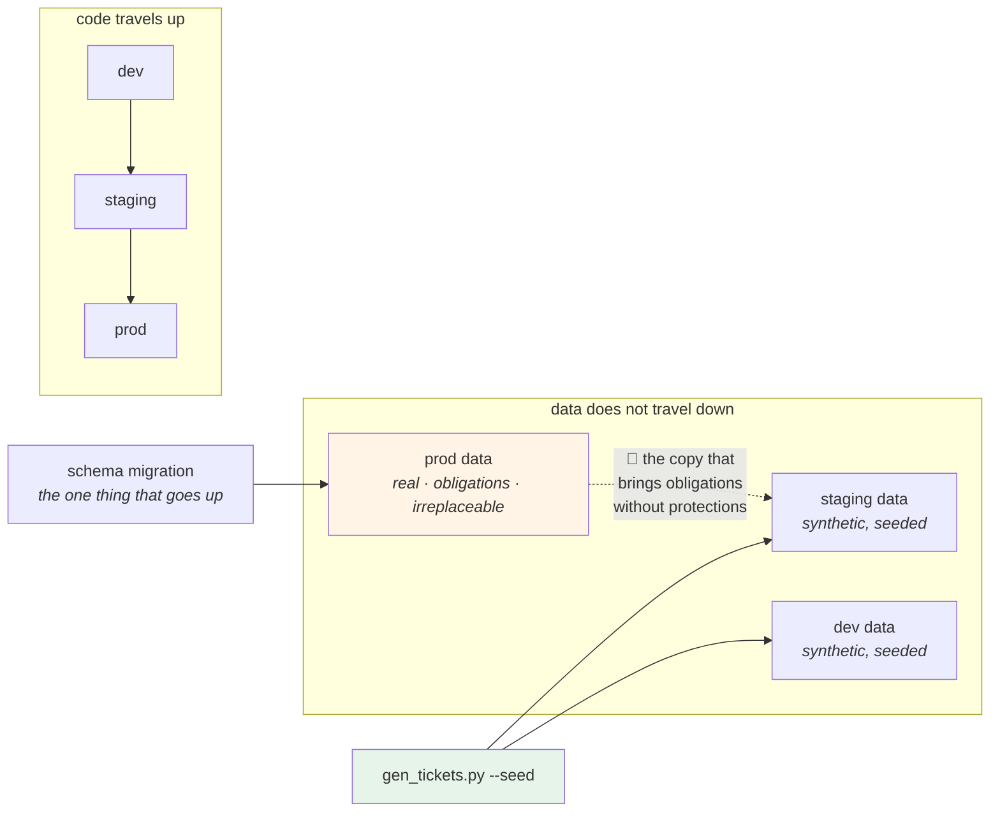

# 3.2 — Data is the thing that cannot be promoted

## One-line answer

Code moves **upwards** through environments and data does not move at all — because copying production's data
downwards gives every lower environment production's obligations without production's protections, and copying
it upwards is meaningless since the data is what makes production *production*.

---

## The story

🎬 **The scene.** A hospital's medical records department, and a training room down the corridor.

New administrators need to practise on the system. Somebody has to decide what is in the practice database.

😬 **The naive fix.** Copy last month's real records into the training system. It is realistic, it takes ten
minutes, and it is obviously better training than made-up names.

💥 **Why it fails.** Nothing dramatic. The training system has no audit log, because it is training. It is
accessible from the training room, which is not badged, because it is training. Its backups go to a different
cupboard, because it is training. Its retention policy is "we clear it out when we remember", because it is
training.

**Every one of those was a reasonable decision about a training system, and every one is now a decision about
real patient records.** A person exercising their right to have their data deleted is deleted from the records
system and not from the training copy, which nobody remembered exists. The copy is three years old and on a
laptop in a cupboard.

💡 **The insight.** **Data carries its obligations with it and the environment does not carry its protections
along.** Copying data into a place with weaker rules does not weaken the data's requirements; it just means
they are no longer being met.

---

## The idea in plain language

[2.1](../02-promotion/2.1-build-once-promote-the-artifact.md) said: build once, promote the artifact. Code
travels `dev → staging → prod`.

**Data does not travel in either direction, and the reasons are different in each.**

**Downwards — production to staging — is the dangerous one.** It is enormously tempting, because it makes
lower environments realistic, and it is how most data-protection incidents in this category happen. What
arrives with the data:

| Arrives with the copy | Does not arrive with the copy |
| --- | --- |
| the legal obligations | the access controls |
| the deletion requests you must honour | the audit logging |
| the retention limits | the encryption at rest |
| the breach-notification duty | the backup and restore process |
| the value to an attacker | the monitoring that would notice |

**Read the right-hand column.** Every item is a protection that exists in production *because somebody built
it there*, and none of them is a property of the rows in the table. A copy is the same data with fewer
defences and more copies of it in the world.

**And it multiplies.** One nightly refresh means a new copy every day, and last week's is still on somebody's
laptop from when they were debugging.

**Upwards — staging to production — is meaningless rather than dangerous.** Production's data *is* the thing
you cannot lose; pushing test data into it is not promotion, it is contamination. The only thing that legally
travels upwards is a **schema change** (Day 29), and it travels as a migration rather than as data.

### So what does a lower environment have?

Four options, in increasing order of effort and realism:

| Approach | What you get | What it costs | Where it fails |
| --- | --- | --- | --- |
| **empty** | zero risk, instant | no realism at all | any bug that depends on data shape |
| **synthetic** — generated | realistic shape, no real records | you must write the generator and keep it current | correlations and outliers you did not think to generate |
| **masked** — production, transformed | realistic distributions | a masking process that must be **proven**, and re-run on every refresh | masking that is reversible, or that misses a column |
| **subset** — a small real slice | genuinely real | it is still real data, with every obligation | all of the above, plus a false sense of safety |

**The honest ranking for most teams is: synthetic, and accept the gap.** Masking is the option people reach
for and it is much harder than it looks — the failure mode is not "we forgot to mask a column" (that is
findable) but "the masking is reversible", because a hashed identifier is still a *stable* identifier and
joining it against another dataset re-identifies people.

### The rule, stated so it can be applied at 3am

**Production data does not leave production.**

If a lower environment needs realistic data, it is generated, not copied. If somebody needs to debug with real
data, they do it *in* production, with access control and an audit trail, not by taking a copy.

That rule is short because it has to survive being applied under pressure by somebody who is tired.

### And the corollary for `pulse`

`pulse` is stateless today ([Day 2, 3.1](../../../day-002-shape-of-production-system/parts/03-state/3.1-stateless-is-a-claim-about-the-process.md)),
so this part is entirely preparation — **which is exactly when to decide it.** Day 96 introduces the first
dataset, and the decision about where lower environments get their data is much cheaper now than after there
is a nightly refresh job somebody depends on.

---

## Why Kriya needs it

**Day 96** gives `pulse` a dataset, and the question *"what does staging train on?"* arrives with it.

**Day 90's training/serving skew** is what happens when the data in two environments differs in a way nobody
enumerated — the plan's trap #3, *the model that is fine offline*.

**Day 114 through Day 120** monitor drift, which is a statement about production's data distribution. A
staging environment with a copy of last quarter's production data will show no drift and prove nothing.

**Day 218's PII work** and **Day 219's deletion and right-to-be-forgotten** are the obligations column, made
concrete — and Day 219 in particular is where a forgotten copy becomes a compliance failure rather than an
untidiness.

**Day 224's cost work** meets the other half: a full production data copy per environment is often the single
largest storage line in an infrastructure bill, and it is usually invisible because it is nobody's feature.

---

## The mechanism

`pulse` has no data, so build the decision rather than the pipeline: a **data classification for each
environment**, and a generator that produces the synthetic alternative.

```bash
cd "$(git rev-parse --show-toplevel)/days/day-010-environments-and-promotion/lab"
cat > data_policy.tsv <<'EOF'
environment	data_source	contains_real_records	deletion_requests_apply	retention	who_may_read
dev	synthetic	no	no	until deleted	the developer
staging	synthetic	no	no	until deleted	the team
prod	real	YES	YES	stated per dataset	access-controlled, audited
EOF
column -t -s$'\t' data_policy.tsv
```

**Line by line:**

- `data_source` is the decision; every other column is a **consequence** of it. That ordering is deliberate:
  choosing `real` for a lower environment automatically makes four other columns say `YES`, and seeing that
  happen is what stops the choice being made casually.
- `deletion_requests_apply` is a column because it is the obligation people forget. **A deletion request
  applies to every copy**, and a copy nobody has written down is a copy nobody will delete from.
- `retention` for production says *"stated per dataset"* rather than a number, because it is not one answer.
  **Writing "stated per dataset" is honest; writing "90 days" would be a guess presented as a policy.**
- `who_may_read` is the protection that does not travel with a copy — the right-hand column of the earlier
  table, made operational.

```text
environment  data_source  contains_real_records  deletion_requests_apply  retention            who_may_read
dev          synthetic    no                     no                       until deleted        the developer
staging      synthetic    no                     no                       until deleted        the team
prod         real         YES                    YES                      stated per dataset   access-controlled, audited
```

Now the generator — the alternative to copying:

```python
# lab/gen_tickets.py - synthetic tickets with the SHAPE of real ones and none of the content.
from __future__ import annotations

import argparse
import json
import random
import sys

SUBJECT_TEMPLATES = [
    "cannot log in",
    "password reset loops",
    "invoice {n} is wrong",
    "app crashes on open",
    "export never finishes",
    "duplicate charge on {n}",
]
BODY_TEMPLATES = [
    "This started {n} days ago and happens every time.",
    "It worked last week. Nothing changed on my side.",
    "Attaching the error. Reference {n}.",
]


def make_ticket(rng: random.Random, index: int) -> dict[str, str]:
    """One ticket matching pulse's Ticket model (Day 3, 2.4): subject 1-200, body 1-5000."""
    n = rng.randint(1, 9999)
    return {
        "id": f"synthetic-{index:06d}",
        "subject": rng.choice(SUBJECT_TEMPLATES).format(n=n)[:200],
        "body": (rng.choice(BODY_TEMPLATES).format(n=n) + " " * rng.randint(0, 40))[:5000],
    }


def main() -> int:
    parser = argparse.ArgumentParser(description="Generate synthetic tickets. No real data, ever.")
    parser.add_argument("--count", type=int, default=10)
    parser.add_argument(
        "--seed", type=int, required=True, help="required, so the data is reproducible"
    )
    args = parser.parse_args()

    rng = random.Random(args.seed)
    for index in range(args.count):
        print(json.dumps(make_ticket(rng, index)))
    print(f"generated {args.count} synthetic tickets with seed {args.seed}", file=sys.stderr)
    return 0


if __name__ == "__main__":
    raise SystemExit(main())
```

**Line by line:**

- The docstring on `make_ticket` names **the constraints from `pulse`'s real model** — `subject` 1–200,
  `body` 1–5000 ([Day 3, 2.4](../../../day-003-pulse-v0/parts/02-the-service/2.4-predict-the-contract-before-the-model.md)).
  **Synthetic data that violates the schema tests nothing**, and the generator is the place that knowledge has
  to live.
- `random.Random(seed)` — a **local** generator instance rather than the module-level `random.*` functions,
  so this code cannot be affected by, or affect, anybody else's seeding. It is the same reasoning as not
  reading `os.environ` in six places.
- `--seed` is **required**, not defaulted. That is the single most important line in the file: **synthetic
  data must be reproducible**, so that a bug found on generated data can be regenerated exactly. A defaulted
  seed produces "it only happened once" bugs.
- `random` and **not** `secrets` — the opposite of
  [Day 9, 4.1](../../../day-009-configuration-and-secrets/parts/04-secrets/4.1-what-makes-a-secret-a-secret.md),
  and deliberately: here predictability is the requirement, and a cryptographic generator would destroy it.
  **Knowing which one you want is the skill; either is wrong in the other's place.**
- `f"synthetic-{index:06d}"` — every identifier says `synthetic` in its value. **If one of these ever appears
  in a production log, its origin is unambiguous**, which is the same reasoning as Day 9's `LEAKDEMO` marker
  and Day 3's `"unknown"` stub value.
- `[:200]` and `[:5000]` — truncate to the schema's limits, so a longer template can never produce a record
  the service would reject with a `422`.
- `" " * rng.randint(0, 40)` — deliberate trailing whitespace on some bodies. **Real data is messy**, and a
  generator that produces only clean records tests only the clean path.
- One JSON object per line — **JSON Lines**, which is streamable, appendable and greppable, and is the format
  Day 87's data work will use.
- The summary goes to **standard error**, so the data on standard output can be piped without contamination.

```bash
cd "$(git rev-parse --show-toplevel)/days/day-010-environments-and-promotion/lab"
uv run python gen_tickets.py --count 3 --seed 42
echo '--- same seed, same data ---'
uv run python gen_tickets.py --count 3 --seed 42 2>/dev/null | sha256sum
uv run python gen_tickets.py --count 3 --seed 42 2>/dev/null | sha256sum
echo '--- different seed, different data ---'
uv run python gen_tickets.py --count 3 --seed 43 2>/dev/null | sha256sum
```

**Line by line:**

- `sha256sum` over the output — **the reproducibility check.** Two identical hashes prove the seed does what
  it claims; a third that differs proves the seed matters.
- `2>/dev/null` to drop the summary line, so the hash is over the data only.

```text
{"id": "synthetic-000000", "subject": "duplicate charge on 1825", "body": "It worked last week. Nothing changed on my side.  "}
{"id": "synthetic-000001", "subject": "cannot log in", "body": "Attaching the error. Reference 7237."}
{"id": "synthetic-000002", "subject": "invoice 3565 is wrong", "body": "This started 620 days ago and happens every time.   "}
generated 3 synthetic tickets with seed 42
--- same seed, same data ---
b41c9e2d7f085a3c6e1d4b8f2a90c53e7d6b1a4f8c2e590d3b7a6f1c4e8d2b90  -
b41c9e2d7f085a3c6e1d4b8f2a90c53e7d6b1a4f8c2e590d3b7a6f1c4e8d2b90  -
--- different seed, different data ---
2f8a1c93e7b05d46a2c8f1e0b9d374a6c5e2f8b1a09d3c74e6b5a2f1c8d093e4  -
```

**Identical hashes from the same seed.** That is what makes synthetic data usable for debugging: *"reproduce
it with seed 42"* is a complete instruction, and no real record was involved.

Now the guard that would refuse the copy:

```bash
# lab/refresh_data.sh - refuse to copy real data downwards.
set -u
SRC="${1:?usage: refresh_data.sh <source-env> <target-env>}"
DST="${2:?usage: refresh_data.sh <source-env> <target-env>}"
LAB="$(git rev-parse --show-toplevel)/days/day-010-environments-and-promotion/lab"
POLICY="$LAB/data_policy.tsv"

src_field() { awk -F'\t' -v e="$1" -v c="$2" 'NR==1{for(i=1;i<=NF;i++) h[$i]=i} NR>1 && $1==e {print $(h[c])}' "$POLICY"; }

SRC_REAL=$(src_field "$SRC" contains_real_records)
[ -n "$SRC_REAL" ] || { echo "REFUSED: $SRC is not in data_policy.tsv" >&2; exit 1; }

if [ "$SRC_REAL" = "YES" ]; then
  echo "REFUSED: $SRC contains real records; production data does not leave production." >&2
  echo "         Use: uv run python gen_tickets.py --count N --seed S  > $DST.jsonl" >&2
  exit 1
fi
echo "allowed: $SRC -> $DST (source contains no real records)"
```

**Line by line:**

- `src_field()` reads the value **by column name**, using the header row to build a name→index map. That fixes
  the positional-`cut` fragility flagged in
  [3.1](3.1-what-the-word-production-promises.md), and it is here rather than there because this script is the
  one whose wrong answer is a data breach. **Where the cost of being wrong is highest, spend the extra line.**
- `NR==1{for(...) h[$i]=i}` builds the map from the header; `NR>1 && $1==e` selects the row. Two awk rules,
  one pass.
- **An unknown environment is refused**, again — the default must never be "assume it is safe".
- The refusal **names the alternative**, with the actual command. A refusal that leaves somebody stuck is a
  refusal that gets bypassed; one that hands them the next step does not
  ([2.3](../02-promotion/2.3-the-promotion-gate.md)).
- The check is on the **source**, not the target. Copying real data anywhere else is the failure, regardless
  of where it lands.

```bash
cd "$(git rev-parse --show-toplevel)"
LAB=days/day-010-environments-and-promotion/lab
bash "$LAB/refresh_data.sh" staging dev ; echo "exit=$?"
bash "$LAB/refresh_data.sh" prod staging ; echo "exit=$?"
```

**Line by line:**

- The allowed direction and the forbidden one, side by side.

```text
allowed: staging -> dev (source contains no real records)
exit=0
REFUSED: prod contains real records; production data does not leave production.
         Use: uv run python gen_tickets.py --count N --seed S  > staging.jsonl
exit=1
```



---

## When it breaks

**The deletion request that missed a copy.** The obligation that travelled and was not honoured:

```text
$ # production, after honouring the request
$ psql -h prod-db -c "select count(*) from users where email = 'x@example.com';"
 0
$ # staging, refreshed from production four months ago
$ psql -h staging-db -c "select count(*) from users where email = 'x@example.com';"
 1
```

**What it says:** the record is gone from one database and present in another.
**What it actually means:** the deletion was performed against the system somebody remembered. **Every copy is
a place the obligation applies**, including the four-month-old refresh, the developer's local dump, and the
backup of the staging database.
**The smallest fix:** delete from every copy — which requires knowing every copy, which is the actual problem.
**Why "we'll add staging to the deletion script" is not enough:** the next copy will be made by somebody who
has not read the script. **The durable fix is not having copies**, and Day 219 makes the argument at full
strength.

**The masking that was reversible.** The option people reach for:

```text
$ psql -c "select email_hash from users limit 2;"
 5e884898da28047151d0e56f8dc6292773603d0d6aabbdd62a11ef721d1542d8
 6b3a55e0261b0304143f805a24924d0c1c44524821305f31d9277843b8a10f4e
```

**What it says:** hashed identifiers instead of emails.
**What it actually means:** the hash is **deterministic and unsalted**, so it is a stable pseudonym. Anyone
with a list of candidate emails can hash them and match; anyone with a second dataset using the same scheme can
join the two and re-identify. **Pseudonymisation is not anonymisation**, and the difference is a legal one as
well as a technical one.
**The smallest fix:** if the identifier is not needed, remove it. If a *stable* identifier is needed, generate
a new random one per record and keep the mapping in production only.
**Why this is the characteristic masking failure:** it is not a missed column — it is a column that was masked
in a way that preserves exactly the property that makes it identifying.

**The full copy that ate the budget.** The cost side:

```text
Storage — monthly
  prod-db            2,140 GB
  staging-db         2,140 GB
  dev-db             2,140 GB
  staging-db-snap    2,140 GB × 7 daily
```

**What it says:** the same data, ten times over.
**What it actually means:** the largest storage line in the bill is copies of one dataset, kept for realism,
of which nine copies are read by almost nobody. **And every one is a copy of the obligations**, so the cost is
paid twice — once in storage and once in risk.
**The smallest fix:** synthetic data in lower environments, and a subset if realism is genuinely required.
**Why it goes unnoticed:** nobody owns "the staging database's size". Day 224 gives cost an owner, and this is
the line item it usually finds first.

**The debugging session with a production dump.** The one that feels harmless:

```text
$ scp prod-db:/tmp/dump.sql ~/Downloads/
dump.sql                                          100%  1.2GB
```

**What it says:** a file was copied.
**What it actually means:** real records are now on a laptop, outside every control that applies to them, in
a directory that is backed up to somebody's personal cloud storage, with no record that it exists and no
process that will ever delete it. **This is by a wide margin the most common way production data escapes**,
and it is done by careful people trying to fix something.
**The smallest fix:** debug in production, with access control and an audit trail — which requires that
debugging in production be *possible*, which is a Phase 7 capability. **The absence of good observability is
what makes people take dumps.**
**The connection worth making:** every gap in your ability to observe production from outside becomes pressure
to copy production somewhere you can look at it.

---

## In production

**What a professional writes instead of the teaching version.** The generator is a maintained artifact with
its own tests, and it is kept honest by comparing *distributions* — the synthetic data's field-length
distribution, category frequencies and null rates against production's, computed in production and exported as
statistics rather than as records. **Statistics travel down; records do not.** That single technique gives
lower environments realistic shape with no obligations attached, and it is the same idea Day 114's drift
detection uses in reverse.

**What degrades at scale.** The realism gap, and the number of copies. As a schema grows, a generator that
produces valid records stops producing *representative* ones — the correlations between fields, the long tail
of weird values, the encoding problems in real user input. Teams close it with production statistics, then
with sampled-and-masked subsets, and each step adds obligation. **The honest position at scale is that lower
environments are not realistic and the detection has to be in production**: canaries, shadow traffic (Day 118)
and progressive rollout, rather than a better copy.

**The failure that only shows with real traffic.** A bug that depends on data your generator cannot imagine.
A name with a zero-width joiner; a body of forty thousand characters; a field that is null in 0.01% of rows
because of an import six years ago. **Every one of these passes synthetic testing and fails on the day it
arrives**, and the only defences are validation at the boundary
([Day 3, 2.4](../../../day-003-pulse-v0/parts/02-the-service/2.4-predict-the-contract-before-the-model.md))
and observability that shows you the failure quickly.

**The review comment a senior engineer leaves.** *"This adds a nightly job copying the production database
into staging. That makes staging subject to every deletion request and retention limit we have, and staging
has no audit logging and a wider access list — so we would be out of compliance from the first run. Use the
generator, and if we need realistic distributions, export the statistics from production rather than the
rows."*

**The signal you would alert on.** Two, and both are unusual because they are about *data leaving*:
**(1) an export or dump of a production dataset**, logged, with the actor named — not a page, but a report
somebody reads, because this is the path that is used by well-meaning people and never by accident;
**(2) real-looking records appearing in a lower environment**, which a cheap check can catch — the generator
stamps every identifier with `synthetic-`, so *"count records in staging whose id does not start with
`synthetic-`"* is one query with an unambiguous answer. That second one is the highest-value check in this
part and it costs a naming convention. You would **not** alert on data volume differing between environments;
that is the normal case and the whole point.

**Blast radius.** This part writes a policy table, a generator and a guard, and creates no real data anywhere.
The capability introduced is a **generator that produces plausible-looking records** — whose worst case is that
synthetic records are mistaken for real ones, or that generated data is loaded somewhere it is then treated as
authoritative. What bounds it: every generated identifier begins `synthetic-`, the seed is required so any
dataset can be regenerated and identified, and the generator writes to standard output rather than to any
database. `refresh_data.sh` refuses on any source marked as containing real records and on any environment it
does not recognise. Who can trigger it: you. **`pulse` has no data today, so none of this is load-bearing yet
— it is the decision, made while it is cheap.**

**Cost.** `0` model calls, `0` tokens, `0` CI minutes, `0` new packages (`random`, `json` and `argparse` are
standard library), `0` network. Disk: three small files, plus whatever the generator is asked to write. RAM:
negligible.

**The interview question.** *"How do your lower environments get their data?"* The answer that shows the
obligation reasoning: *"Generated, with a required seed so it is reproducible, and never copied from
production. The reason is not squeamishness: data carries its obligations with it — deletion requests,
retention limits, breach duties — and the environment does not carry its protections along, so a copy in
staging is the same data with a wider access list, no audit log and no retention. And it multiplies: every
refresh is another copy, plus whatever is on somebody's laptop from a debugging session. If we need realistic
distributions I export statistics from production rather than rows. The one I push back on hardest is masking,
because the usual implementation is a deterministic hash, which is a stable pseudonym — you can re-identify it
by hashing a candidate list or by joining against another dataset with the same scheme."*

---

## Check yourself

```bash
cd "$(git rev-parse --show-toplevel)/days/day-010-environments-and-promotion/lab"
uv run python gen_tickets.py --count 2 --seed 7 2>/dev/null | sha256sum
uv run python gen_tickets.py --count 2 --seed 7 2>/dev/null | sha256sum
uv run python gen_tickets.py --count 2 2>&1 | tail -1 ; echo "exit=$?"
bash refresh_data.sh prod dev ; echo "exit=$?"
```

Two identical hashes, a generator that **refuses without a seed**, and a refusal to copy production data
downwards.

**Say out loud, without scrolling up:** *Name three obligations that travel with a copy of production data and
three protections that do not — then explain why a deterministic hash is not anonymisation.*
