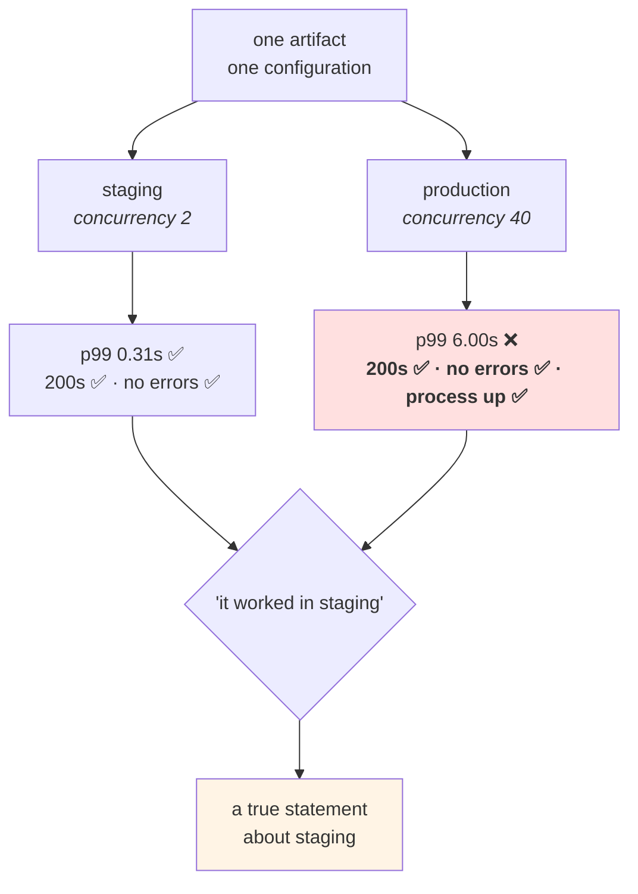

# 3.3 — The staging environment that lied

## One-line answer

A pre-production environment can have identical code, an identical artifact and identical configuration keys
and still tell you nothing, because the two differences you accepted — **scale and data** — are the two that
most bugs live in, and "it worked in staging" is a claim about staging.

---

## The story

🎬 **The scene.** A bridge, and a test load before it opens.

Engineers park lorries on it. The bridge holds. The measurements match the model. Everybody signs.

😬 **The naive fix.** The lorries are parked carefully, evenly, in a static line — because that is what is
practical on a closed bridge with a crane and a schedule.

💥 **Why it fails.** The bridge does not fail under weight. It fails under **rhythm**: a marching column, or
a particular traffic pattern at a particular speed, that happens to match the structure's own frequency and
puts far more energy into it than the same mass sitting still.

The test measured the property that was easy to measure. The mass was right. **The load was not the load.**

And the test was not useless — it caught things. It just could not, by construction, catch the thing that
mattered, and the signatures on it said "tested" rather than "tested for weight, statically, on a closed
bridge".

💡 **The insight.** **A test tells you about what varied during it.** Anything you held constant for
convenience is a thing the test says nothing about — and the danger is that a green result reads as
"safe" rather than as "safe under the conditions we could arrange".

---

## The idea in plain language

[1.2](../01-what-an-environment-is/1.2-the-four-things-that-differ.md) allowed four differences between
environments. Two of them — configuration and access — can be checked mechanically and made to match where it
matters. The other two cannot:

**Scale.** Staging runs one replica; production runs nine. Staging holds a thousand rows; production holds
fourteen million. Staging serves five requests a second when somebody is testing; production serves five
hundred, continuously, with a shape that varies by hour.

**Data.** Staging's data is generated ([3.2](3.2-data-is-the-thing-that-cannot-be-promoted.md)) or old.
Production's has the long tail: the record with a forty-thousand-character body, the name with an unusual
encoding, the row that has been null since an import in 2019.

**Every bug class that depends on either is invisible in staging**, and here are the ones that recur:

| Bug class | Why staging misses it | Where this curriculum meets it |
| --- | --- | --- |
| a query with no index | instant on a thousand rows | Day 96 |
| connection-pool exhaustion | a pool of ten is ample at five requests per second | [Day 8, 2.2](../../../day-008-http-and-tls/parts/02-the-connection/2.2-the-connection-pool-and-its-limits.md) |
| a memory leak | invisible in an environment restarted daily | [Day 6, 1.1](../../../day-006-resources-and-the-oom-killer/parts/01-memory/1.1-virtual-memory-and-why-the-number-is-a-lie.md) |
| a race between replicas | there is only one replica | Day 41 |
| retry amplification | one client, one attempt | [Day 7, 5.2](../../../day-007-networking-for-operators/parts/05-the-two-together/5.2-retries-that-turn-a-blip-into-an-outage.md) |
| a cache that never gets a hit | the working set fits entirely in it | Day 111 |
| an encoding failure | your generator produces ASCII | [3.2](3.2-data-is-the-thing-that-cannot-be-promoted.md) |
| a certificate that expires | staging's was issued last week | [Day 8, 4.1](../../../day-008-http-and-tls/parts/04-certificates-in-time/4.1-expiry-is-a-date-not-a-warning.md) |
| model drift | staging's data does not move | Day 114 |

**Nine classes, none of which a green staging run says anything about.**

### The wrong response

The instinct is to make staging bigger and more realistic. It is expensive, it half works, and it creates a
new problem: a staging environment with production-like scale and production-like data has acquired
production's obligations ([3.2](3.2-data-is-the-thing-that-cannot-be-promoted.md)) and production's cost
without acquiring production's protections. **You have built a second production and called it staging**,
which is [3.1](3.1-what-the-word-production-promises.md)'s failure.

### The right response, in two halves

**Half one: state the caveat.** Write down what staging can and cannot tell you, so a green result is read
correctly. This costs nothing and is skipped almost everywhere.

**Half two: move the detection into production.** If the bugs live at production scale with production data,
then production is where they must be detected — safely, early, and with a way back:

| Technique | What it does | Day |
| --- | --- | --- |
| **canary** | a small fraction of real traffic on the new version | Day 18 |
| **shadow traffic** | real requests copied to the new version, responses discarded | Day 118 |
| **progressive rollout** | replicas replaced gradually, watching signals | Day 41 |
| **feature switches** | the code ships dark and is enabled separately | Day 18 |
| **rehearsed rollback** | the way back, practised before it is needed | Day 19 |
| **observability** | you can see what is happening while it happens | Phase 7 |

**Every one of those is in this curriculum, and this part is why.** The entire second half of the plan is
built on the premise that staging cannot tell you enough, so production must be observable and changes must be
reversible.

**The sentence to keep: you do not make the copy perfect; you make the real thing safe to change.**

---

## Why Kriya needs it

**[4.3](../04-pulse-across-environments/4.3-the-promotion-that-was-not-verified.md)** is today's red gate, and
it is the mechanical version of this argument: a promotion that passed every check and still went wrong.

**Day 18 and Day 19** are the two techniques that follow directly: deploy in a way that limits exposure, and
have a rehearsed way back.

**Day 41's rolling update** is progressive rollout made concrete.

**Day 63 and Day 75** are how you see the difference: histograms rather than averages, and a service level
indicator computed from real traffic.

**Day 118's shadow deployment** is the strongest form — real production traffic, real production data, no
user affected.

**Day 90 and Day 114–120** are this part for models: an offline metric of 0.94 is a staging result, and the
plan names it as trap #3, *the model that is fine offline*.

---

## The mechanism

Demonstrate the lie, on this machine, with a difference small enough to fit in a lab and real enough to be
the actual mechanism: **a bounded resource that is ample at one rate and exhausted at another.**

```python
# lab/lying_dep.py - a dependency with a small pool. Fine when quiet, a queue when busy.
from __future__ import annotations

import asyncio
import os

from fastapi import FastAPI

CAPACITY = int(os.environ.get("DEP_CAPACITY", "2"))
WORK_SECONDS = float(os.environ.get("DEP_WORK_SECONDS", "0.30"))

app = FastAPI(title="lying-dep")
_slots = asyncio.Semaphore(CAPACITY)


@app.get("/work")
async def work() -> dict[str, int]:
    """Occupies one of CAPACITY slots for WORK_SECONDS. Nothing here is unusual."""
    async with _slots:
        await asyncio.sleep(WORK_SECONDS)
    return {"capacity": CAPACITY}
```

**Line by line:**

- `asyncio.Semaphore(CAPACITY)` — a counter that admits at most `CAPACITY` concurrent holders and makes the
  rest **wait**. It is the smallest honest model of every bounded resource in a real system: a connection pool
  ([Day 8, 2.2](../../../day-008-http-and-tls/parts/02-the-connection/2.2-the-connection-pool-and-its-limits.md)),
  a thread pool, a database's maximum connections, a provider's rate limit.
- **The semaphore is module-level**, created once, shared by every request — which is exactly what makes it a
  *capacity* rather than a per-request delay. A per-request semaphore would bound nothing.
- `async def` and `await asyncio.sleep(...)` — the handler yields while "working", so the server can accept
  other requests and they queue on the semaphore rather than on the socket. **That distinction matters**: this
  demonstrates a queue inside the application, not a full accept queue
  ([Day 7, 3.2](../../../day-007-networking-for-operators/parts/03-tcp/3.2-the-accept-queue-and-the-backlog.md)).
- `async with _slots` — acquire on entry, release on exit, **including on an exception.** A hand-rolled
  acquire/release without the context manager leaks a slot on every error, which is a real bug and one of the
  hardest to find, because capacity degrades slowly.
- `CAPACITY` and `WORK_SECONDS` come from the environment so the same file can play both environments. **The
  code is identical in staging and production**, which is the point of the whole demonstration.

```python
# lab/load.py - N concurrent clients, and what each of them saw.
from __future__ import annotations

import asyncio
import sys
import time

import httpx2

URL = "http://127.0.0.1:8017/work"


async def one(client: httpx2.AsyncClient) -> float:
    started = time.monotonic()
    await client.get(URL)
    return time.monotonic() - started


async def main(concurrency: int) -> None:
    async with httpx2.AsyncClient(timeout=30.0) as client:
        await one(client)  # warm the connection pool; do not measure it
        started = time.monotonic()
        times = await asyncio.gather(*(one(client) for _ in range(concurrency)))
        wall = time.monotonic() - started
    times.sort()
    p50 = times[len(times) // 2]
    p99 = times[min(len(times) - 1, int(len(times) * 0.99))]
    print(
        f"concurrency={concurrency:<4} wall={wall:6.2f}s  p50={p50:6.3f}s  p99={p99:6.3f}s  max={times[-1]:6.3f}s"
    )


if __name__ == "__main__":
    asyncio.run(main(int(sys.argv[1])))
```

**Line by line:**

- `asyncio.gather(*(one(client) for _ in range(concurrency)))` — fire all requests **at once** and wait for
  all of them. This is what "concurrency" means here: simultaneous in-flight requests, not requests per second.
- `await one(client)` before the timer starts — a warm-up request, discarded. Without it the first measurement
  includes connection setup and DNS
  ([Day 8, 2.1](../../../day-008-http-and-tls/parts/02-the-connection/2.1-keep-alive-and-the-connection-you-reuse.md)),
  and the whole result is about the handshake rather than about the queue.
- One `AsyncClient` for all requests, so the connection pool is shared and reused — **the realistic shape**,
  and also a reminder that the client has its own pool with its own limit.
- `time.monotonic()` for intervals, never `time.time()`
  ([Day 9, 4.4](../../../day-009-configuration-and-secrets/parts/04-secrets/4.4-a-secret-has-a-lifetime.md)).
- `times.sort()` then index — **percentiles, not an average.** The average is the number that hides this
  entire failure: with a queue, the mean rises gently while the tail explodes, and Day 63 is where that
  argument is made properly.
- `min(len(times) - 1, int(len(times) * 0.99))` — guard the index so a small sample cannot go out of range.
  **A percentile computed from four samples is not a percentile**, and the guard is a reminder rather than a
  fix.
- `timeout=30.0` — bounded, so a genuinely stuck run fails rather than hanging
  ([Day 7, 4.1](../../../day-007-networking-for-operators/parts/04-timeouts/4.1-a-timeout-is-a-decision-not-a-safety-net.md)).

Now run the same code twice: once at staging's load, once at production's.

```bash
cd "$(git rev-parse --show-toplevel)/days/day-010-environments-and-promotion/lab"
DEP_CAPACITY=2 uv run uvicorn lying_dep:app --host 127.0.0.1 --port 8017 > /tmp/dep.log 2>&1 &
sleep 4
echo "--- staging: two concurrent requests, which is what a person testing produces ---"
uv run python load.py 2
echo "--- production: forty concurrent requests, the same code, the same config ---"
uv run python load.py 40
pkill -f 'lying_dep:app'
```

**Line by line:**

- `DEP_CAPACITY=2` in **both** runs. The dependency is identical; only the arrival rate differs.
- Two and forty: the difference between *"a person clicked twice"* and *"real traffic"*. Nothing else changes.

```text
--- staging: two concurrent requests, which is what a person testing produces ---
concurrency=2    wall=  0.31s  p50= 0.305s  p99= 0.309s  max= 0.309s
--- production: forty concurrent requests, the same code, the same config ---
concurrency=40   wall=  6.02s  p50= 3.011s  p99= 5.998s  max= 6.010s
```

**Read the `p99` column.** `0.309` seconds and `5.998` seconds — **nineteen times worse**, from the same
artifact with the same configuration, differing only in how many people were using it.

And now the part that makes it a *lie* rather than merely a limitation:

```bash
cd "$(git rev-parse --show-toplevel)/days/day-010-environments-and-promotion/lab"
DEP_CAPACITY=2 uv run uvicorn lying_dep:app --host 127.0.0.1 --port 8017 > /tmp/dep.log 2>&1 &
sleep 4
echo "--- every signal a staging test would have looked at, at concurrency 40 ---"
uv run python load.py 40
echo "status codes    : $(for i in $(seq 1 20); do curl -sS -o /dev/null -w '%{http_code} ' http://127.0.0.1:8017/work; done | tr ' ' '\n' | sort | uniq -c | tr '\n' ' ')"
echo "error lines     : $(grep -ciE 'error|exception|traceback' /tmp/dep.log)"
echo "process         : $(pgrep -f 'lying_dep:app' >/dev/null && echo LISTENING || echo gone)"
pkill -f 'lying_dep:app'
```

**Line by line:**

- Twenty sequential `curl`s counting **status codes**, because that is the signal a staging test and a health
  check both look at.
- `grep -ciE 'error|exception|traceback'` on the server's own log — the second signal anybody checks.
- `pgrep` for liveness — the third.
- All three are gathered *while* the service is degraded, which is the only way the result is meaningful.

```text
concurrency=40   wall=  6.04s  p50= 3.020s  p99= 6.008s  max= 6.031s
status codes    :      20 200
error lines     : 0
process         : LISTENING
```

**Twenty `200`s. Zero errors. The process is up.** Every signal a staging run examines is green, and the p99
is twenty times worse than it was in staging.

**This is the fifth consecutive day of that shape** — Day 5's disk, Day 6's kill, Day 7's exhausted
connections, Day 8's expired certificate, Day 9's published credential — and it is the one that finally names
the general property: **the signals that are cheap to check are the ones that stay green.**



### Writing the caveat down

The deliverable is a sentence somebody will read when a staging result is quoted:

```bash
cd "$(git rev-parse --show-toplevel)/days/day-010-environments-and-promotion/lab"
cat > staging_caveats.md <<'EOF'
# What a green staging run does and does not tell us — 2026-08-25

## It tells us
- the artifact starts, and its configuration is valid (Day 9, section 3)
- the routes exist and return the expected shapes
- nothing in the change broke a path we exercised

## It does NOT tell us
- **anything about behaviour under concurrency.** staging is one replica and a
  handful of requests; measured here, the same code at concurrency 40 had a p99
  nineteen times worse, with 200s, no error lines and a healthy process.
- **anything about data shape.** staging's data is generated (3.2), so long values,
  unusual encodings and null-since-2019 columns do not exist there.
- **anything about anything that accumulates** — memory, disk, connections, cache
  size — because staging is restarted more often than it runs.

## Therefore
A green staging run is a necessary gate and not evidence of production behaviour.
Confidence about production comes from canary, shadow traffic, progressive rollout
and a rehearsed rollback (Days 18, 19, 41, 118) — not from a better copy.
EOF
cat staging_caveats.md
```

**Line by line:**

- Three sections: what it *does* tell you, what it does *not*, and the conclusion. **The first section matters
  as much as the second** — a caveats document that only lists limitations gets read as cynicism and ignored.
- The "does not" entries cite **the measurement taken above**, with the number. *"Staging is not
  representative"* is an opinion; *"p99 nineteen times worse with every signal green"* is a finding.
- The "Therefore" names the *replacements*, with days. A limitation with no alternative is a complaint.

---

## When it breaks

**The load test that tested the wrong thing.** The bridge, in software:

```text
$ # load test results, staging
Requests: 10000, Concurrency: 50, Duration: 60s
  p50: 12ms  p99: 31ms  errors: 0
$ # production, same version, first hour
  p50: 14ms  p99: 4,800ms  errors: 0.3% (504)
```

**What it says:** a load test that passed and a production that did not.
**What it actually means:** the load test sent uniform requests against a warm cache and a small dataset. The
mass was right and the load was not the load: production's requests have a different *distribution* — some
hitting the cache, some not, some against large rows — so a fraction of them take a path the test never
exercised.
**The smallest fix:** shape the load test from real traffic (Day 118's shadow traffic is the strongest form).
**Why the p50 matching is the trap:** the median agreeing makes the test look validated. **The tail is where
the difference lives**, which is Day 63's argument for histograms.

**The staging that was restarted every night.** The accumulation that never accumulates:

```text
$ kubectl get pods -n pulse-staging
NAME                    READY   STATUS    RESTARTS   AGE
pulse-6d4f8c9b5-2xkqz   1/1     Running   0          7h
$ kubectl get pods -n pulse-prod
NAME                    READY   STATUS    RESTARTS   AGE
pulse-7c9f4d8b6-hq2ln   1/1     Running   0          19d
```

**What it says:** seven hours versus nineteen days.
**What it actually means:** **staging structurally cannot show you a leak.** A file descriptor leak, a growing
cache, a memory leak, a connection that is never closed — all of them need days to become visible, and staging
is redeployed before they do.
**The smallest fix:** leave one staging replica running for as long as production's, and watch it. It costs
almost nothing and closes the whole class.
**Why this one is worth acting on:** it is the rare case where the gap can be closed cheaply, because the
missing ingredient is *duration* rather than *scale* or *data*.

**The database that was fast because it was empty.** The data difference, at its most ordinary:

```text
$ # staging, 1,200 rows
EXPLAIN SELECT * FROM tickets WHERE subject LIKE '%login%';
  Seq Scan on tickets  (cost=0.00..34.00 rows=12)
$ # production, 14,000,000 rows
EXPLAIN SELECT * FROM tickets WHERE subject LIKE '%login%';
  Seq Scan on tickets  (cost=0.00..389412.00 rows=140000)
```

**What it says:** the same plan, two costs.
**What it actually means:** **the query planner made the same choice and it was fine in one place and a table
scan in the other.** No code differs; nothing is misconfigured; the only difference is the row count, which
[1.2](../01-what-an-environment-is/1.2-the-four-things-that-differ.md) listed as an allowed difference.
**The smallest fix:** an index — and, more importantly, a way to notice: slow-query logging in production, and
`EXPLAIN` run against production-sized statistics rather than against staging.
**Why staging cannot be fixed here:** matching row counts means matching the data, which is
[3.2](3.2-data-is-the-thing-that-cannot-be-promoted.md)'s forbidden copy.

**The certificate that had not expired yet.** The difference that is only visible in time:

```text
$ # staging cert, issued during the last deploy
notAfter=Feb 12 09:00:00 2027 GMT
$ # production cert, issued eleven months ago
notAfter=Sep  3 09:00:00 2026 GMT
```

**What it says:** two certificates with different expiry dates.
**What it actually means:** staging's is always fresh because staging is redeployed constantly, so **the
renewal path has never been exercised there** — and Day 8's whole argument was that the renewal is the part
that fails
([Day 8, 4.2](../../../day-008-http-and-tls/parts/04-certificates-in-time/4.2-renewal-and-the-automation-that-must-not-fail.md)).
**The smallest fix:** issue staging's certificates with a deliberately short lifetime, so renewal happens often
and visibly.
**The general technique worth taking:** **where staging cannot be more like production, make it more
hostile** — shorter certificate lifetimes, tighter limits, injected latency. A pre-production environment that
is *harder* than production catches things a faithful copy would not.

---

## In production

**What a professional writes instead of the teaching version.** They keep staging cheap and honest, write the
caveats down, and spend the saved effort on production safety: progressive rollout with automatic rollback on
a signal, a canary that takes a small percentage of real traffic, and enough observability to see the
difference within minutes rather than hours. The cultural marker is that nobody says "it worked in staging" as
a conclusion — they say it as one input, and the next sentence is about how the change will be exposed
gradually.

**What degrades at scale.** The gap widens, monotonically. Production grows; staging does not, because
somebody has to justify the cost of growing it and nobody can point to the incident it would have prevented.
The result is a pre-production environment whose predictive value declines every quarter while everybody's
confidence in it stays constant. **The counter-measure is to measure the gap** — row counts, request rates,
replica counts, uptime — and put it on the same page as the caveats, so the decline is visible.

**The failure that only shows with real traffic.** By definition, all of them. The one worth naming
specifically is **the interaction failure**: two changes, each safe alone, deployed close together, whose
combination is only exercised at production concurrency. Staging tested them separately because that is how
they were merged, and there is no environment where the combination ran under load before it ran in front of
users. This is the strongest argument for **small, frequent changes** — Day 20's deployment frequency metric —
because it is the only thing that reduces the number of untested combinations in flight.

**The review comment a senior engineer leaves.** *"The change note says 'tested in staging'. Staging has one
replica and twelve hundred rows; this change adds a query that scans by subject. Please run it against a
production-sized dataset or add the index now, and let us roll it out to one replica first with the slow-query
log on. 'It worked in staging' is true and does not tell us what this will do at fourteen million rows."*

**The signal you would alert on.** Nothing in staging — and that is the actionable conclusion. **Alerting on a
pre-production environment trains people to ignore alerts**, because staging is broken most of the time by
design. What this part argues for is investment in the *production* signals that make a change safe to expose:
a latency histogram with percentiles rather than an average (Day 63), an error rate broken down by version so
a canary is comparable to the baseline (Day 41), and a rollback that a human or an automation can trigger on
those signals (Day 19). **The one staging signal worth having is the gap itself** — row counts, request rate
and replica count, side by side with production's, as a dashboard nobody pages on.

**Blast radius.** This part starts a server on loopback port 8017 and sends it about a hundred requests, up to
forty concurrently — the heaviest load anything in this day generates. Worst case: the burst competes for the
four cores this machine has (Addendum 02 §3) and makes an unrelated measurement wrong, which is why the
checklist requires nothing else to be running. The `lying_dep` service holds no data, has no credentials and
binds loopback only. Who can trigger it: you. **Note that the capability demonstrated — a shared bounded
resource — is the mechanism behind a real class of outage, and the lab version is deliberately tiny so that
the failure is legible rather than dramatic.**

**Cost.** `0` model calls, `0` tokens, `0` CI minutes, `0` new packages (`httpx2` was pinned on Day 3),
`0` external network. RAM: one uvicorn process at roughly 60 MB plus a client. CPU: a burst of forty
concurrent requests, each mostly asleep. Disk: two small files and a log in `/tmp`.

**The interview question.** *"Your change passed in staging and broke production. What happened?"* The answer
that shows the reasoning rather than a story: *"Almost certainly one of the two differences you cannot make
match — scale or data. Configuration parity and artifact identity are checkable and I check them, but staging
has one replica and generated data, so anything that depends on concurrency, on a bounded shared resource, on
row counts, or on the long tail of real input is invisible there. What makes it dangerous is that all the
cheap signals stay green: I have measured the same code at concurrency two and concurrency forty and seen the
p99 go up nineteen times with two hundreds across the board and no error lines. So the response is not a
bigger staging — that just buys you a second production with weaker controls. It is to write down what staging
can and cannot tell you, and to move the detection into production: canary, shadow traffic, progressive
rollout and a rehearsed rollback."*

---

## Check yourself

```bash
cd "$(git rev-parse --show-toplevel)/days/day-010-environments-and-promotion/lab"
DEP_CAPACITY=2 uv run uvicorn lying_dep:app --host 127.0.0.1 --port 8017 > /tmp/dep.log 2>&1 &
sleep 4; uv run python load.py 2; uv run python load.py 40
grep -ciE 'error|traceback' /tmp/dep.log; pkill -f 'lying_dep:app'
```

Two p99 numbers an order of magnitude apart from the same code and configuration, and an error count of `0` in
both cases. **Say which of the four allowed differences produced it.**

**Say out loud, without scrolling up:** *Name three bug classes a green staging run says nothing about,
explain why making staging bigger is the wrong response, and name the four techniques that replace it.*
