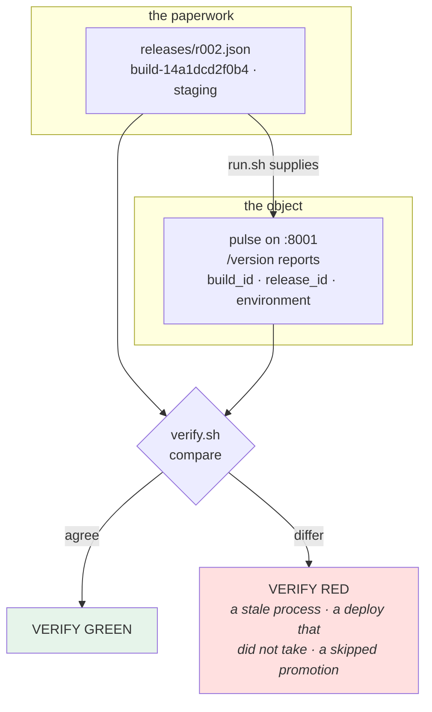

# 4.1 — One artifact, three releases

## One-line answer

Everything in this day lands on `pulse` as a **single change to the service**: it reports which build and
which release it is running, so that the promotion record and the running process can finally be compared —
which is the difference between a promotion that is *recorded* and one that is *verified*.

---

## The story

🎬 **The scene.** A hire-car depot. Every car has a windscreen sticker with a fleet number.

The number is not for the driver. It is so that the person doing the walk-round, the person reading the
service history, and the person reading the accident report are all talking about the same car — and can prove
it, standing in front of it, without trusting a form.

😬 **The naive fix.** A new system tracks everything by registration plate, which the depot's records already
have. The stickers are dropped; they were redundant.

💥 **Why it fails.** Plates get swapped between vehicles during repairs — legitimately, briefly, and it is
recorded somewhere. Now the service history belongs to a car nobody can point at, and the only way to check
which physical car has had its brakes done is to trust the records that are themselves the thing in question.

The sticker was never redundant. **It was the only identifier attached to the object rather than to the
paperwork about the object.**

💡 **The insight.** **A record about a thing and an identifier on the thing are different artifacts, and you
need both.** The record can be wrong; the object cannot lie about itself. Reconciling the two is the only way
to catch a record that has drifted.

---

## The idea in plain language

[2.2](../02-promotion/2.2-build-release-run.md) built a release ledger: files saying which build went to which
environment. [2.3](../02-promotion/2.3-the-promotion-gate.md) built a gate that reads it.

**Everything so far is paperwork.** The ledger says `r002` is in staging. Nothing has asked the running
service.

Day 9 already found this gap from the other direction: a deploy with valid-but-wrong configuration is
undetectable unless the service *announces* what it is
([Day 9, 3.4](../../../day-009-configuration-and-secrets/parts/03-fail-fast/3.4-the-service-that-started-with-the-wrong-config.md)).
The answer there was `environment` on `/version`. Today it needs two more fields:

| Field | Answers | Where it comes from |
| --- | --- | --- |
| `environment` | which deploy is this? | Day 9's settings — already done |
| `build_id` | which artifact is running? | supplied at run time by the release |
| `release_id` | which artifact-plus-config combination? | supplied at run time by the release |

With those three, the two questions that matter become one `curl` each:

- **"Is the thing running the thing we promoted?"** — compare `build_id` against the release record.
- **"Are two environments running the same artifact?"** — compare `build_id` across them.

### The awkward part, stated honestly

`build_id` and `release_id` are supplied by whatever runs the service — they are configuration
([Day 9, 1.1](../../../day-009-configuration-and-secrets/parts/01-configuration/1.1-what-configuration-actually-is.md)),
because they vary between deploys of the same code.

**Which means the service can be lied to.** Somebody can start `pulse` with `PULSE_BUILD_ID=anything` and it
will report that. So this is a **reconciliation** mechanism, not a proof: it catches accidents — a stale
process, a deploy that did not take, a promotion that skipped — and it does not catch a determined
misstatement.

That is worth being precise about rather than overselling, and it points at what a real answer looks like: the
artifact should carry its own identity *inside* it, stamped at build time, so the running code reports
something it could not have been told. Day 15 does exactly that — a version and a commit written into the
package at build — and Day 216 makes it cryptographic. **Today's version is the cheap one that catches the
ordinary failures, and knowing which failures it does not catch is the point.**

---

## Why Kriya needs it

**[4.3](4.3-the-promotion-that-was-not-verified.md)** is today's red gate and it is built entirely on these
three fields.

**Day 15** stamps the build identity into the artifact so it cannot be supplied from outside.

**Day 16's release tag** and **Day 19's rollback** both need "what is running" to be answerable from the
running thing.

**Day 41's rolling update** needs it per replica: during a rollout two build IDs are live simultaneously, and
seeing that is how you know the rollout is progressing rather than stuck.

**Day 62's info-metric** is this endpoint turned into a label set, which is what makes it queryable across a
fleet instead of one `curl` at a time.

**Day 111** compares two model versions serving simultaneously, which is the same idea one layer up: a
prediction is only comparable if it says which model made it — and Day 3 already put `model_version` on the
response for that reason
([Day 3, 2.4](../../../day-003-pulse-v0/parts/02-the-service/2.4-predict-the-contract-before-the-model.md)).

---

## The mechanism

Two small changes to project code, and a check that finally compares the record against the thing.

**First, the settings.** Add two fields to `pulse/config.py`
([Day 9, 5.1](../../../day-009-configuration-and-secrets/parts/05-pulse-configured/5.1-pulse-config-the-settings-object.md)):

```python
# pulse/config.py - two new fields. The rest of the class is unchanged.
    build_id: str = Field(
        default="unknown",
        description="Which artifact is running. Supplied by the release; see days/day-010.",
    )
    release_id: str = Field(
        default="unknown",
        description="Which artifact-plus-config combination. Supplied by the release.",
    )
```

**Line by line:**

- `default="unknown"` and **not** required. A required field here would mean `pulse` cannot be started by
  hand for development, which is a real cost for no safety gain — and `"unknown"` is a value that is
  obviously not an identifier, in the same spirit as Day 3's `"unrouted"` stub
  ([Day 3, 2.4](../../../day-003-pulse-v0/parts/02-the-service/2.4-predict-the-contract-before-the-model.md)).
  **A stub must not look like an answer.**
- `str` rather than a `Literal` or a pattern, because the set of valid build IDs is unbounded and grows with
  every commit. **Bounding what cannot be enumerated is how you get a validator that blocks a legitimate
  deploy** ([Day 9, 3.2](../../../day-009-configuration-and-secrets/parts/03-fail-fast/3.2-validating-the-value-not-just-its-presence.md)).
- The `description` names **where the value comes from**, which is what `.env.example` will show a stranger
  ([Day 9, 5.2](../../../day-009-configuration-and-secrets/parts/05-pulse-configured/5.2-env-example-the-contract-with-a-stranger.md)).
- Adding these two fields **resolves the conflict flagged in
  [2.2](../02-promotion/2.2-build-release-run.md)**: `run.sh` exports `PULSE_RELEASE_ID`, and until now Day 9's
  unknown-variable audit would have refused to start on it. **The audit was right and the fix is to declare
  the field**, not to widen the allowlist.
- `.env.example` must be regenerated after this change, and Day 9's `--check` gate will refuse until it is —
  which is that gate earning its keep on the very next day.

**Second, the endpoint.** Extend `/version`:

```python
# pulse/api.py - /version, now answering "which artifact and which release".
@app.get("/version")
def version(settings: Settings = Depends(get_settings)) -> dict[str, str]:
    """What is actually running here."""
    return {
        "service": "pulse",
        "version": __version__,
        "model_version": "none",
        "environment": settings.environment,
        "build_id": settings.build_id,
        "release_id": settings.release_id,
    }
```

**Line by line:**

- Two fields added; **nothing removed.** `/version` is consumed by things you do not control, so removing a
  field is a breaking change — the same rule as any other response contract
  ([Day 8, 1.2](../../../day-008-http-and-tls/parts/01-the-message/1.2-methods-safety-and-idempotency.md)).
- The fields are added to `/version` rather than `/healthz`, deliberately. `/healthz` answers one question and
  must keep answering only that
  ([Day 3, 2.2](../../../day-003-pulse-v0/parts/02-the-service/2.2-healthz-the-endpoint-that-must-not-lie.md));
  every time somebody adds a field to a health check it becomes slower and less honest.
- `Depends(get_settings)` unchanged, so a test can override the whole object
  ([Day 9, 2.4](../../../day-009-configuration-and-secrets/parts/02-typed-settings/2.4-the-settings-object-read-at-import-time.md)).
- **`/version` is unauthenticated and cheap**, which Day 3 argued for and which matters more now: this is the
  endpoint an operator hits at 3am, and anything that has to be *asked for* will not be there when it is
  needed.

**Third, the runner supplies them.** Update `run.sh` from
[2.2](../02-promotion/2.2-build-release-run.md):

```bash
# lab/run.sh - the run stage, now passing both identities into the process.
set -u
RELEASE_ID="${1:?usage: run.sh <release-id>}"
ROOT="$(git rev-parse --show-toplevel)"
LAB="$ROOT/days/day-010-environments-and-promotion/lab"
FILE="$LAB/releases/$RELEASE_ID.json"
[ -f "$FILE" ] || { echo "REFUSED: no such release: $RELEASE_ID" >&2; exit 1; }

field() { grep -o "\"$1\": \"[^\"]*\"" "$FILE" | cut -d'"' -f4; }
ENV=$(field environment)
BUILD=$(field build_id)

cd "$ROOT"
( set -a; . "$LAB/envs/$ENV.env"; set +a
  export PULSE_RELEASE_ID="$RELEASE_ID"
  export PULSE_BUILD_ID="$BUILD"
  exec uv run uvicorn pulse.api:app --host "$PULSE_HOST" --port "$PULSE_PORT" )
```

**Line by line:**

- Both identities are read **out of the release record**, not passed as arguments. The run stage decides
  nothing ([2.2](../02-promotion/2.2-build-release-run.md)) — it looks up and executes.
- `export` rather than the inline form, because `exec` replaces the shell and the variables must be in the
  environment it inherits.
- `exec` again, so there is one process and signals reach uvicorn directly
  ([Day 4, 4.3](../../../day-004-linux-for-operators-i/parts/04-the-service-died/4.3-zombies-orphans-and-pid-1.md)).

**Fourth, the reconciliation.** The check that compares the record against the thing:

```bash
# lab/verify.sh - does the running service agree with the release ledger?
set -u
ENV="${1:?usage: verify.sh <environment>}"
ROOT="$(git rev-parse --show-toplevel)"
LAB="$ROOT/days/day-010-environments-and-promotion/lab"

REC=$(grep -l "\"environment\": \"$ENV\"" "$LAB"/releases/*.json 2>/dev/null | sort | tail -1)
[ -n "$REC" ] || { echo "VERIFY RED: no release recorded for $ENV" >&2; exit 1; }
rec_field() { grep -o "\"$1\": \"[^\"]*\"" "$REC" | cut -d'"' -f4; }

PORT=$(grep '^PULSE_PORT=' "$LAB/envs/$ENV.env" | cut -d= -f2)
BODY=$(curl -sS -m 5 "http://127.0.0.1:$PORT/version") \
  || { echo "VERIFY RED: $ENV is not answering on :$PORT" >&2; exit 1; }
live_field() { printf '%s' "$BODY" | grep -o "\"$1\":\"[^\"]*\"" | cut -d'"' -f4; }

FAIL=0
for f in environment build_id release_id; do
  want=$(rec_field "$f"); got=$(live_field "$f")
  [ "$f" = "environment" ] || want=$(rec_field "$f")
  if [ "$want" = "$got" ]; then
    printf 'ok    %-11s %s\n' "$f" "$got"
  else
    printf 'RED   %-11s recorded=%s running=%s\n' "$f" "${want:-<absent>}" "${got:-<absent>}" >&2
    FAIL=1
  fi
done
[ "$FAIL" -eq 0 ] || { echo "VERIFY RED: $ENV does not match its release record" >&2; exit 1; }
echo "VERIFY GREEN: $ENV is running exactly what the ledger says"
```

**Line by line:**

- Two field readers with **different patterns**, and the difference is worth noticing: the release file is
  pretty-printed JSON with `": "` (a space), while FastAPI's response is compact with `":"` (no space).
  **Two grep-based parsers, two formats, one of them silently returning nothing if you get it wrong** — which
  is exactly the fragility that makes `jq` or Python the right answer in real tooling, and is stated here
  rather than glossed over.
- `curl -sS -m 5 … || { … }` — a bounded request, and a **distinct failure message** for "not answering"
  versus "answering with the wrong thing". Those are different diagnoses and they deserve different lines.
- The loop checks **all three fields and reports all three**, rather than exiting on the first mismatch —
  the same reasoning as [2.3](../02-promotion/2.3-the-promotion-gate.md)'s gate.
- `${want:-<absent>}` — print a visible marker when a field is missing entirely, because an empty string in a
  comparison message looks like a formatting bug rather than a finding.
- **The `[ "$f" = "environment" ] || want=$(rec_field "$f")` line is redundant** — it re-reads what the line
  above already read. It is left in deliberately: it is the kind of line that survives a refactor and does
  nothing, and spotting it is one of the day's `TODO(me)` items.

Run the whole chain:

```bash
cd "$(git rev-parse --show-toplevel)"
LAB=days/day-010-environments-and-promotion/lab
uv run python scripts/gen_env_example.py --write     # the two new fields must appear
BUILD=$(bash "$LAB/build.sh")
R=$(bash "$LAB/release.sh" "$BUILD" staging)
bash "$LAB/run.sh" "$R" > /tmp/pulse-staging.log 2>&1 &
sleep 4
curl -sS http://127.0.0.1:8001/version; echo
bash "$LAB/verify.sh" staging ; echo "exit=$?"
pkill -f 'pulse.api:app'
```

**Line by line:**

- `gen_env_example.py --write` **first**, because Day 9's gate refuses a stale example file and two fields
  were just added. **The previous day's gate is now part of this day's workflow**, which is what a gate being
  real looks like.
- Build → release → run → verify, in order, which is the whole of section 2 executed as one sequence.

```text
wrote .env.example (9 settings)
{"service":"pulse","version":"0.1.0","model_version":"none","environment":"staging","build_id":"build-14a1dcd2f0b4","release_id":"r002"}
ok    environment staging
ok    build_id    build-14a1dcd2f0b4
ok    release_id  r002
VERIFY GREEN: staging is running exactly what the ledger says
exit=0
```

**Three fields, agreed by two independent sources.** The record says `r002`; the process says `r002`; and
neither was asked to trust the other.



### Three environments, one artifact

The section's title, demonstrated:

```bash
cd "$(git rev-parse --show-toplevel)"
LAB=days/day-010-environments-and-promotion/lab
BUILD=$(bash "$LAB/build.sh")
for env in dev staging prod; do
  R=$(bash "$LAB/release.sh" "$BUILD" "$env")
  bash "$LAB/run.sh" "$R" > "/tmp/pulse-$env.log" 2>&1 &
done
sleep 6
for port in 8000 8001 8002; do curl -sS "http://127.0.0.1:$port/version"; echo; done
for env in dev staging prod; do bash "$LAB/verify.sh" "$env"; done
pkill -f 'pulse.api:app'
```

**Line by line:**

- One `build.sh`, three `release.sh`, three `run.sh` — **build once, three releases**, which is
  [2.1](../02-promotion/2.1-build-once-promote-the-artifact.md) and
  [2.2](../02-promotion/2.2-build-release-run.md) in six lines.
- `sleep 6` for three processes on four cores (Addendum 02 §3), and this is the most this day runs at once.

```text
{"service":"pulse","version":"0.1.0","model_version":"none","environment":"dev","build_id":"build-14a1dcd2f0b4","release_id":"r004"}
{"service":"pulse","version":"0.1.0","model_version":"none","environment":"staging","build_id":"build-14a1dcd2f0b4","release_id":"r005"}
{"service":"pulse","version":"0.1.0","model_version":"none","environment":"prod","build_id":"build-14a1dcd2f0b4","release_id":"r006"}
VERIFY GREEN: dev is running exactly what the ledger says
VERIFY GREEN: staging is running exactly what the ledger says
VERIFY GREEN: prod is running exactly what the ledger says
```

**One `build_id`, three `release_id`s, three `environment`s.** That is the day, in three lines of JSON.

---

## When it breaks

**The process that survived a deploy.** The most common thing this check catches:

```text
RED   release_id  recorded=r007 running=r005
VERIFY RED: staging does not match its release record
```

**What it says:** the ledger and the process disagree about which release is live.
**What it actually means:** a new release was recorded and **the old process is still serving** — the deploy
did not take, or the restart failed, or somebody's `pkill` matched nothing and the new one never bound the
port ([Day 7, 1.4](../../../day-007-networking-for-operators/parts/01-addresses-and-ports/1.4-the-port-that-was-already-in-use.md)).
**The smallest fix:** stop the old process and start the new one.
**Why this is the highest-value case:** without the check, the *ledger* says the deploy succeeded and every
other signal agrees, so the change appears to have shipped and has not. **It is Day 9's wrong-config failure
with a different cause and the same silence.**

**The identity that was supplied by hand.** The limitation, exercised:

```text
$ PULSE_BUILD_ID=build-anything-i-like uv run uvicorn pulse.api:app --port 8001 &
$ curl -sS http://127.0.0.1:8001/version
{"service":"pulse",...,"build_id":"build-anything-i-like","release_id":"unknown"}
```

**What it says:** whatever it was told.
**What it actually means:** **the mechanism reconciles; it does not prove.** A field supplied by the
environment reports the environment's claim, so this catches accidents and not assertions.
**The smallest fix:** none at this level — the artifact has to carry its own identity, which requires a build
step. Day 15.
**Why saying so matters:** a check whose limits are undocumented gets trusted beyond them, and the first time
somebody uses `/version` as evidence in an audit, the limit becomes the finding.

**The absent field.** The version skew:

```text
RED   build_id    recorded=build-14a1dcd2f0b4 running=<absent>
```

**What it says:** the running service has no `build_id` at all.
**What it actually means:** it is an **older version of the code** — one from before this part added the
field. Which is genuinely useful information: the reconciliation caught a version mismatch through the
*absence* of a field rather than through its value.
**The smallest fix:** deploy the current version.
**The design note:** this is why `${want:-<absent>}` prints a marker. An empty-versus-empty comparison would
have passed — the vacuous-check failure, for the sixth time in two days.

**The stale example file.** The previous day's gate, firing:

```text
$ uv run python scripts/gen_env_example.py --check
.env.example is stale - run: uv run python scripts/gen_env_example.py --write
```

**What it says:** the committed example does not match the settings class.
**What it actually means:** two fields were added and the example was not regenerated, so a stranger cloning
the repository would not learn that `PULSE_BUILD_ID` exists.
**The smallest fix:** run it with `--write` and commit the result.
**Why it is worth showing here:** it is the first time a gate built on one day refuses work done on the next,
which is what makes it a gate rather than a script. **A gate that never inconveniences you is not doing
anything.**

---

## In production

**What a professional writes instead of the teaching version.** The identity is **stamped into the artifact at
build time** — a generated `_build.py`, a label on the image, a value baked into the binary — so the running
process reports something it was not told. Then `/version` is not the only consumer: the same values are
attached to every log line and exported as an info-metric, so the question "what is running" is answerable for
a fleet from a query rather than for one process from a `curl`. **The `curl` remains valuable at 3am**,
because it works when the metrics pipeline does not.

**What degrades at scale.** Asking one process at a time. With nine replicas, `/version` answers about
whichever replica the load balancer chose, so a rollout that is half-done looks like whichever half you
happened to hit — and reconciliation has to become *"the set of build IDs live in this environment"* rather
than a single value. That set is exactly what Day 41 watches during a rollout, and it is also the divergence
signal from
[Day 9, 1.4](../../../day-009-configuration-and-secrets/parts/01-configuration/1.4-the-precedence-ladder.md).
**One identity is a value; several are a state.**

**The failure that only shows with real traffic.** A rollout that never finishes. Eight replicas take the new
build and one does not — insufficient memory, a node with a stale image, a pod stuck terminating — and because
requests are spread across all nine, the symptom is *"about eleven percent of requests behave oddly"*. Nothing
is down, no signal is red, and the cause is visible only if something is comparing build IDs across replicas.
**A percentage-shaped anomaly is almost always a fleet that is not uniform**, and this field is what makes
that hypothesis checkable in one query.

**The review comment a senior engineer leaves.** *"`/version` reports the build ID from an environment
variable, which is fine for catching a stale process and is not evidence of anything, so please do not put it
in the compliance doc as proof of what shipped. When we add the build step, generate a module with the commit
and the build time and read it from there — then the value comes from inside the artifact and cannot be
supplied by whoever started it."*

**The signal you would alert on.** Expose `build_id`, `release_id`, `environment` and `version` as **labels on
an info-metric** with a constant value of `1` (Day 62) — never as metric *values*, which would be the plan's
trap #2. Two alerts follow, and both are about disagreement rather than about any particular value:
**(1) more than one `build_id` live in one environment for longer than a rollout should take** — a stuck
rollout; **(2) a `build_id` running that appears in no release record** — something was deployed outside the
pipeline, which is the integrity signal Day 217 cares about. You would **not** alert on a build ID changing;
that is a deployment.

**Blast radius.** This part changes **project code** — two fields on the settings class and two on a public
response body. The response change is additive and therefore safe for existing consumers; the settings change
adds two optional fields with obviously-non-identifier defaults. The real new capability is `verify.sh`, which
**makes a judgement about whether a deploy is correct**, and its dangerous direction is failing *open*: the
absent-field case above shows how a comparison of two empty strings would have passed. What bounds it: every
field is reported individually, missing values print `<absent>`, "not answering" is a distinct failure from
"wrong value", and the checklist requires the gate to have been seen red. Who can trigger it: you. **Nothing
here can stop or change a running service** — it only reads.

**Cost.** `0` model calls, `0` tokens, `0` CI minutes, `0` new packages, `0` external network. RAM: **three**
uvicorn processes at roughly 60 MB — about 180 MB peak, the same as
[1.2](../01-what-an-environment-is/1.2-the-four-things-that-differ.md). Disk: a few small JSON files.

**The interview question.** *"How do you know what is running in production?"* The answer that separates a
record from a fact: *"Two independent sources that have to agree. The deployment record says which artifact
went where, and the running service reports its own build and release on an unauthenticated endpoint — and
something reconciles them. The record alone is not enough, because the most common failure I have seen is a
deploy that was recorded and did not take: the old process is still serving, every signal is green, and the
change appears to have shipped. I am also clear about the limit: if the identity is supplied as an environment
variable, it reflects what the process was told, so it catches accidents rather than assertions. To make it
evidence, the build has to stamp it into the artifact so the code reports something it could not have been
handed."*

---

## Check yourself

```bash
cd "$(git rev-parse --show-toplevel)"
LAB=days/day-010-environments-and-promotion/lab
BUILD=$(bash "$LAB/build.sh"); R=$(bash "$LAB/release.sh" "$BUILD" staging)
bash "$LAB/run.sh" "$R" > /tmp/s.log 2>&1 & sleep 4
bash "$LAB/verify.sh" staging ; echo "exit=$?"
R2=$(bash "$LAB/release.sh" "$BUILD" staging)   # a new release, but the old process is still running
bash "$LAB/verify.sh" staging ; echo "exit=$?"
pkill -f 'pulse.api:app'
```

Green, then **red** — because a new release was recorded and the process serving traffic is still the old one.
That is the single most valuable thing this check does.

**Say out loud, without scrolling up:** *Name the two independent sources this reconciliation compares, say
which failure it catches that a release ledger alone cannot — and state precisely what it cannot prove and
what would fix that.*
