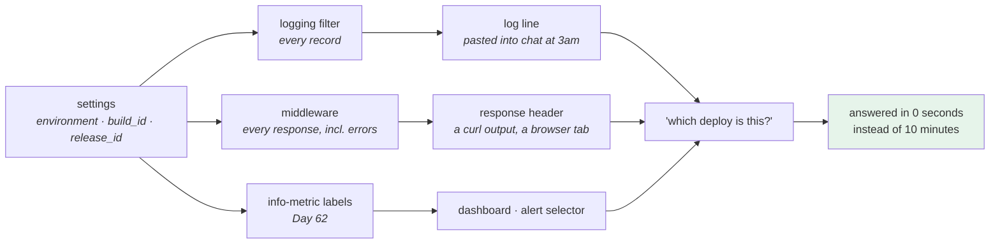

# 4.2 — The environment banner: making the deploy visible everywhere

## One-line answer

Every log line, every response header and every metric should carry which deploy produced it — because the
most expensive minutes of an incident are the ones spent finding out **which system you are looking at**, and
that cost is paid by adding one field in three places, once.

---

## The story

🎬 **The scene.** A hospital ward at three in the morning. Every bag of fluid hanging from a stand has a
label: the patient's name, the contents, the rate, who hung it and when.

The labels are redundant almost all the time. The nurse who hung it knows what it is. There is a chart at the
end of the bed. There is a system.

😬 **The naive fix.** During a busy night the labels are skipped — the information is on the chart, the bags
are obviously different colours, and writing a label takes a minute that is needed elsewhere.

💥 **Why it fails.** It works for six hours. Then a patient is moved to a different bay, a stand goes with
them, an agency nurse comes on at four, and there are two clear bags on one stand.

**The chart is at the end of a bed that has moved.** The colour tells you the category, not the patient. And
the one piece of information that would resolve it in two seconds — *which patient is this for* — was
deliberately not written down because at the time it was obvious.

💡 **The insight.** **Labels are written for the person who arrives later, without the context.** Their value
is exactly zero in the moment they are created and enormous in the moment they are read — which is why they
are the first thing dropped and the thing most missed.

---

## The idea in plain language

[4.1](4.1-one-artifact-three-releases.md) put `environment`, `build_id` and `release_id` on one endpoint. This
part puts them on **everything the service emits**, and the argument for doing so is a specific, measurable
cost.

During an incident you have: a log line somebody pasted into a chat, a screenshot of a graph, an error from a
customer, a response body. **For each one, the first question is "which deploy did this come from?"** — and
if the answer requires correlating a timestamp against a deployment history, the answer takes minutes and is
sometimes wrong.

Three places, one field each:

| Where | What it carries | Who reads it |
| --- | --- | --- |
| **every log line** | `environment`, `build_id`, `release_id` | whoever is grepping at 3am; the log aggregator (Day 68) |
| **a response header** | `environment`, `build_id` | whoever has a `curl` output or a browser tab open |
| **an info-metric's labels** | all of them | every dashboard and every alert selector (Day 62) |

### Why a response header rather than the body

The body is the API contract. Adding operational metadata to it means every client sees it, every schema
change is a breaking change, and a caching layer may store it.

**A header is out-of-band.** It travels with every response including errors, it does not touch the contract,
and Day 8 established that headers are exactly the place for metadata about the exchange rather than the
content ([Day 8, 1.4](../../../day-008-http-and-tls/parts/01-the-message/1.4-headers-are-the-contract.md)).

The convention is a name with an `x-` prefix or a service-specific prefix; this project uses `x-pulse-*`.
**And it must be a fact you observed, not a claim you were handed** — the distinction Day 8 drew between
`client` and `x-forwarded-for` — which here is straightforward, because the service is reporting about
itself.

### What must not go in it

**Nothing secret**, obviously ([Day 9, section 4](../../../day-009-configuration-and-secrets/parts/04-secrets/4.2-the-seven-places-a-secret-leaks.md)) — a
response header is logged by every proxy on the path.

**Nothing high-cardinality**, in the metric. `environment`, `build_id` and `release_id` each take a small
number of values at any moment; a request ID or a user ID as a metric label is the plan's trap #2 and will
take down your metrics store. **The same value can be safe in a log line and catastrophic as a metric label**,
and knowing which is which is the skill.

### The one thing it must not become

The banner is **carried**, never **consumed**. Nothing branches on it
([1.4](../01-what-an-environment-is/1.4-the-environment-name-is-not-a-switch.md)). A header that a client
reads and behaves differently on is a switch wearing a label's clothes.

---

## Why Kriya needs it

**[4.3](4.3-the-promotion-that-was-not-verified.md)** is today's red gate and it reads the header.

**Day 62** turns the label set into an info-metric, which is what makes "which build is in production"
queryable across a fleet.

**Day 67** adds structured logging, and these three fields are the first ones every line will carry.

**Day 68's log pipeline** indexes them, at which point *"show me every error from build X"* is a filter rather
than an investigation.

**Day 74's alerts** select on `environment`, and
[Day 9, 3.4](../../../day-009-configuration-and-secrets/parts/03-fail-fast/3.4-the-service-that-started-with-the-wrong-config.md)
showed what happens when the label is wrong: the alert is silently satisfied because the selector matches
nothing.

**Day 41's rolling update** and **Day 111's two model versions** both need per-response attribution: with two
versions live, a response is only comparable if it says which one produced it.

**Day 82's postmortem** is where the cost is paid or saved. A timeline built from log lines that say which
deploy they came from is minutes of work; one built by correlating timestamps against a deployment history is
an afternoon.

---

## The mechanism

Three additions, each small.

**One — a logging filter that adds the fields to every record:**

```python
# pulse/observability.py - the deploy identity, attached to everything this process emits.
"""Attach environment, build and release identity to every log record.

Nothing here decides behaviour: the values are carried, never branched on (Day 10, 1.4).
"""

from __future__ import annotations

import logging

from pulse.config import Settings


class DeployIdentityFilter(logging.Filter):
    """Add environment / build_id / release_id to every record passing through a handler."""

    def __init__(self, settings: Settings) -> None:
        super().__init__()
        self._fields = {
            "environment": settings.environment,
            "build_id": settings.build_id,
            "release_id": settings.release_id,
        }

    def filter(self, record: logging.LogRecord) -> bool:
        for key, value in self._fields.items():
            setattr(record, key, value)
        return True


def install(settings: Settings) -> None:
    """Attach the filter to every handler on the root logger."""
    identity = DeployIdentityFilter(settings)
    for handler in logging.getLogger().handlers:
        handler.addFilter(identity)
```

**Line by line:**

- `logging.Filter` with `filter()` returning `True` — the documented extension point, and the same mechanism
  Day 9's redaction filter used
  ([Day 9, 4.3](../../../day-009-configuration-and-secrets/parts/04-secrets/4.3-redaction-that-actually-holds.md)).
  Verified against `https://docs.python.org/3/library/logging.html` on **2026-08-25**: a filter may modify the
  record, and returning a true value means the record is processed.
- **The fields are computed once, in `__init__`**, not per record. A filter runs on every log line in the
  process; anything it does per call is multiplied by the log volume.
- `setattr(record, key, value)` — attaches attributes to the record, which a formatter can then reference as
  `%(environment)s` and which a structured handler (Day 67) will serialise as fields. **It does not modify the
  message**, so nothing is duplicated when both a text format and a JSON format are in use.
- `return True` — the record continues. **A filter that returns `False` drops the record**, which is a
  genuinely dangerous thing to do by accident in a filter whose job is annotation.
- `install()` attaches to **handlers**, not to the logger — so it applies to records propagated from libraries
  you did not write, which is the same reasoning as Day 9's redaction filter and matters for the same reason.
- The module docstring states the rule from
  [1.4](../01-what-an-environment-is/1.4-the-environment-name-is-not-a-switch.md): *carried, never branched
  on.* **The place to write a rule is the file somebody would break it in.**

**Two — a middleware that adds the response headers:**

```python
# pulse/api.py - the header, on every response including errors.
from fastapi import Request, Response

from pulse import observability

observability.install(settings)


@app.middleware("http")
async def add_deploy_headers(request: Request, call_next) -> Response:
    """Stamp every response with which deploy produced it. Never read; only written."""
    response = await call_next(request)
    response.headers["x-pulse-environment"] = settings.environment
    response.headers["x-pulse-build"] = settings.build_id
    response.headers["x-pulse-release"] = settings.release_id
    return response
```

**Line by line:**

- `@app.middleware("http")` — runs for **every** request, including ones that end in a `404` or a `500`, which
  is the point: **the responses you most want to attribute are the failing ones.**
- `response = await call_next(request)` then set headers — the headers are added **after** the handler runs,
  so they apply regardless of what the handler did or whether it raised.
- `settings` is the module-level object from the composition root
  ([Day 9, 5.1](../../../day-009-configuration-and-secrets/parts/05-pulse-configured/5.1-pulse-config-the-settings-object.md)),
  not a `Depends` — middleware runs outside the dependency system, and reaching for `get_settings()` here
  would work but would pay a cache lookup per request for no benefit.
- Three separate headers rather than one combined value, so each is independently greppable and no parsing is
  required at 3am.
- `x-pulse-` prefix: the service's own namespace, for the same reason settings are prefixed
  ([Day 9, 2.3](../../../day-009-configuration-and-secrets/parts/02-typed-settings/2.3-naming-prefixes-and-the-variable-nobody-read.md)).
- The docstring says **"never read; only written"** — the rule from
  [1.4](../01-what-an-environment-is/1.4-the-environment-name-is-not-a-switch.md), in the place somebody would
  break it.
- `call_next` is deliberately left unannotated: annotating it correctly requires importing a type from
  Starlette's internals, and an inaccurate annotation is worse than none. **Say why, rather than guessing at
  an import.**

**Three — the format string that shows them:**

```python
# pulse/api.py - the logging setup, now including the identity fields.
logging.basicConfig(
    level=settings.log_level.upper(),
    stream=sys.stdout,
    format="%(levelname)s %(environment)s %(build_id)s %(message)s",
)
observability.install(get_settings())
```

**Line by line:**

- `%(environment)s` and `%(build_id)s` reference the attributes the filter attached. **If the filter is not
  installed, every log call raises a formatting error** — which sounds fragile and is actually the desired
  property: it fails loudly at the first log line rather than silently omitting the fields.
- `release_id` is deliberately **not** in the text format — three identifiers in a prefix makes every line
  unreadable. It is still attached to the record, so Day 67's structured output will carry it. **A text log is
  for a human; the structured one is for a machine, and they want different amounts.**
- `basicConfig` **before** `install()`, because `install()` iterates the root logger's handlers and
  `basicConfig` is what creates them. Reversing the two lines produces a filter attached to nothing, and no
  error.

Run it and look at all three channels:

```bash
cd "$(git rev-parse --show-toplevel)"
LAB=days/day-010-environments-and-promotion/lab
BUILD=$(bash "$LAB/build.sh"); R=$(bash "$LAB/release.sh" "$BUILD" prod)
bash "$LAB/run.sh" "$R" > /tmp/pulse-prod.log 2>&1 &
sleep 4
echo '--- 1. the response headers ---'
curl -sS -D - -o /dev/null http://127.0.0.1:8002/healthz | grep -i '^x-pulse'
echo '--- 2. a failing request still carries them ---'
curl -sS -D - -o /dev/null http://127.0.0.1:8002/does-not-exist | grep -iE '^(HTTP|x-pulse)'
echo '--- 3. the log lines ---'
grep -E 'INFO|WARNING' /tmp/pulse-prod.log | tail -3
pkill -f 'pulse.api:app'
```

**Line by line:**

- `-D -` writes the **response headers** to standard output; `-o /dev/null` throws the body away. Together
  they are the way to look at headers and nothing else
  ([Day 8, 1.4](../../../day-008-http-and-tls/parts/01-the-message/1.4-headers-are-the-contract.md)).
- The second request is to a route that does not exist, **on purpose**: a `404` is generated by the framework
  rather than by your handler, and the middleware still stamps it. That is the case the middleware exists for.
- `grep -iE '^(HTTP|x-pulse)'` shows the status line alongside the headers, so the `404` and the attribution
  are visible together.

```text
--- 1. the response headers ---
x-pulse-environment: prod
x-pulse-build: build-14a1dcd2f0b4
x-pulse-release: r009
--- 2. a failing request still carries them ---
HTTP/1.1 404 Not Found
x-pulse-environment: prod
x-pulse-build: build-14a1dcd2f0b4
x-pulse-release: r009
--- 3. the log lines ---
INFO prod build-14a1dcd2f0b4 startup config {"environment":"prod",...,"model_api_key":"**********"}
```

**A `404` that says which deploy produced it.** That is the line somebody pastes into a chat during an
incident, and it now answers the first question before anybody asks it.



---

## When it breaks

**The filter that was not installed.** The loud failure, which is the good one:

```text
--- Logging error ---
Traceback (most recent call last):
  File "logging/__init__.py", line 1160, in emit
    msg = self.format(record)
  File "logging/__init__.py", line 999, in format
    return fmt.format(record)
  File "logging/__init__.py", line 703, in format
    s = self.formatStyle.format(record)
ValueError: Formatting field not found in record: 'environment'
```

**What it says:** the formatter wanted a field the record does not have.
**What it actually means:** `observability.install()` was not called, or was called before `basicConfig`
created the handlers. **The service still runs** — logging errors do not stop a process — but every log line
is now a traceback.
**The smallest fix:** call `install()` after `basicConfig`.
**Why the loudness is the right design:** the alternative, a formatter with a default for missing fields,
would silently produce log lines with the field blank — and a blank attribution is worse than none, because it
looks answered.

**The header a client started depending on.** The label that became a switch:

```text
if (response.headers['x-pulse-environment'] === 'dev') {
  showDebugPanel();
}
```

**What it says:** a client branching on the header.
**What it actually means:** **the banner has become a control**, and now the environment name is part of the
API contract — you cannot rename an environment or add `prod-eu` without breaking a client. This is
[1.4](../01-what-an-environment-is/1.4-the-environment-name-is-not-a-switch.md)'s failure, arriving from
outside your codebase where your grep cannot find it.
**The smallest fix:** an explicit capability field the client can branch on, which is a contract you control.
**Why it happens:** the header is there, it is useful, and nobody told the client author it was operational
metadata. **Documenting a header as "operational, may change without notice" is worth the sentence.**

**The high-cardinality label.** The metric that took down the metrics store:

```text
$ curl -sS http://127.0.0.1:9090/api/v1/status/tsdb | head -5
{"status":"success","data":{"headStats":{"numSeries":4812993,...
```

**What it says:** nearly five million time series.
**What it actually means:** somebody added `request_id` — or `release_id` on a system that releases hundreds
of times a day — as a **metric label**, so every distinct value created a new series. Memory grows until the
metrics store falls over, taking your visibility with it during whatever you were trying to see.
**The smallest fix:** remove the label. **You cannot fix it after the fact by dropping the data**; the series
already exist.
**The rule worth memorising:** a value belongs in a log line if it is high-cardinality, and in a metric label
only if its set of possible values is small and slowly-changing. `environment` and `build_id` qualify;
`release_id` usually does, and stops qualifying at high release rates — which is a judgement, and the plan
names getting it wrong as trap #2.

**The banner that lied.** The failure this cannot catch:

```text
x-pulse-environment: prod
x-pulse-build: build-14a1dcd2f0b4
```

...from a process started by hand with those values exported.

**What it says:** a production deploy of a specific build.
**What it actually means:** it says whatever it was told, exactly as
[4.1](4.1-one-artifact-three-releases.md) established. **The banner is a convenience for attribution, not
evidence of provenance.**
**The smallest fix:** stamp the identity into the artifact at build time. Day 15.
**Why the distinction matters here specifically:** a header is *more* likely to be treated as authoritative
than a JSON field, because it looks like infrastructure rather than application output. Being clear about it
in the runbook is cheaper than being surprised in an audit.

---

## In production

**What a professional writes instead of the teaching version.** The identity is added once, in one place, by
whatever creates the logger and the middleware — a factory or a framework hook — rather than in three places
that can drift. The same values feed a **request-scoped context** so that a correlation ID travels alongside
them (Day 69's tracing), and the response header set is documented as operational metadata with an explicit
"may change" note, so no client is surprised. And the fields are **agreed across services**: `environment`
means the same thing and is spelled the same way in every service, because a log aggregator that has
`environment`, `env` and `deployment_env` cannot answer a question across services.

**What degrades at scale.** Consistency, and cardinality. At three services a convention is easy; at three
hundred, a service that spells it `env` is invisible to every query written against `environment` — so the
field names become a platform-level contract enforced by a shared library, not by documentation. Cardinality
degrades in the other direction: `build_id` is a handful of values with weekly releases and thousands with
continuous deployment, at which point it stops being a viable metric label and lives only in logs and traces.
**The set of safe labels shrinks as you deploy more often**, which is counter-intuitive and is worth knowing
before it bites.

**The failure that only shows with real traffic.** The middleware's cost. It runs on every request, and
anything expensive in it is multiplied by the request rate — a lookup, a formatting call, a settings access
through a dependency-injection layer. Three dictionary assignments is nothing; the same middleware after
somebody adds a timestamp format and a lookup is measurable at a thousand requests per second, and it is on
**every** path including the health check. **Middleware is the most-executed code in a service** and deserves
to be read as such.

**The review comment a senior engineer leaves.** *"The middleware adds the headers by calling `get_settings()`
per request. That is a cache lookup on the hot path for a value that cannot change during the process's life —
capture it at startup. And please add `x-pulse-release` to the ingress's log format while you are there,
otherwise we have it on the response and not in the access log, which is the one we actually read."*

**The signal you would alert on.** The banner is what makes other signals answerable rather than being one
itself. Concretely, it enables: **an info-metric** with these labels (Day 62), from which comes an alert on
*more than one `build_id` live in one environment for longer than a rollout should take*; and **log fields**
(Day 67) that make *"errors by build"* a filter, which is how you tell a bad release from a bad day. The one
thing worth alerting on directly is **an `environment` label with an unexpected value**, which should be
impossible because of Day 9's `Literal` — so if it ever fires, something is bypassing the settings object
entirely, and that is worth knowing.

**Blast radius.** This part adds middleware that runs on **every request** and a filter that runs on **every
log record** — the two most-executed pieces of code in the service. A failure in either is a failure on every
request or every log line: middleware that raises breaks all responses; a filter that returns `False` silently
drops all logs. What bounds it: both do only dictionary and attribute assignment, with no I/O, no network and
no allocation of consequence; the filter's values are computed once at construction; and the formatter's
hard failure on a missing field means a mis-installed filter is discovered at the first log line rather than
by an absence nobody notices. Who can trigger it: every request. **This is the first code in `pulse` that runs
unconditionally on the request path, and that is the reason it is three lines.**

**Cost.** `0` model calls, `0` tokens, `0` CI minutes, `0` new packages, `0` external network. Per request:
three dictionary writes. Per log record: three attribute writes. RAM: one uvicorn process at roughly 60 MB.
Disk: one new source file.

**The interview question.** *"What do you put in every log line?"* The answer that shows the 3am perspective:
*"Which deploy produced it — environment, build and release — plus a correlation ID once tracing exists. The
reason is that during an incident everything arrives without context: a log line pasted into a chat, a
screenshot of a graph, a customer's error message, and the first question for every one of them is which
system it came from. If answering that means correlating a timestamp against a deployment history, it costs
minutes and is sometimes wrong. The same values go on a response header, because the failing responses are the
ones you most want to attribute and a header covers errors the framework generated rather than your handler.
The one thing I am careful about is which of them become metric labels: environment and build are small sets,
but if you deploy continuously the release ID is not, and a high-cardinality label takes down the metrics
store during exactly the incident you needed it for."*

---

## Check yourself

```bash
cd "$(git rev-parse --show-toplevel)"
LAB=days/day-010-environments-and-promotion/lab
BUILD=$(bash "$LAB/build.sh"); R=$(bash "$LAB/release.sh" "$BUILD" prod)
bash "$LAB/run.sh" "$R" > /tmp/p.log 2>&1 & sleep 4
curl -sS -D - -o /dev/null http://127.0.0.1:8002/nope | grep -iE '^(HTTP|x-pulse)'
grep -c 'prod build-' /tmp/p.log
pkill -f 'pulse.api:app'
```

A `404` carrying three attribution headers, and a log file whose lines all begin with the deploy identity.

**Say out loud, without scrolling up:** *Give the three places the banner belongs and who reads each one — then
name a value that is safe in a log line and dangerous as a metric label, and say why.*
