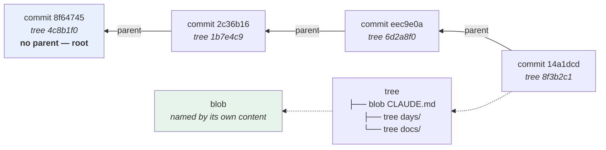

# 1.1 — A commit is a snapshot with a parent

## One-line answer

A commit is not a set of changes — it is a **complete snapshot of every file**, plus a pointer to the commit
before it, plus who and when and why, all reduced to a forty-character hash of exactly that content, which is
why two identical commits anywhere in the world have the same name and why nothing can be altered without
becoming a different commit.

---

## The story

🎬 **The scene.** A shipping company's ledger, kept in a bound book with numbered pages.

Every entry has the date, who wrote it, what happened, and — this is the part that matters — **the page and
line of the entry before it**. Not the change since last time. The complete state: what is in the warehouse
now.

😬 **The naive fix.** A clerk who finds this repetitive starts writing only what changed. *"Add 40 crates of
tea."* Faster, obviously, and the total is easy enough to work out.

💥 **Why it fails.** Somebody wants to know what was in the warehouse on the 14th of March. With snapshots you
open the book at the 14th of March and read. With changes, you have to add up every entry from the beginning
of the book — and if one entry is illegible, or was written out of order, or was quietly amended, **every
total after it is wrong and there is no way to tell.**

And there is a second failure the clerk never anticipated: when two branches of the company merge their books,
snapshots can be compared directly. Change lists cannot — you have to replay them, in an order nobody agreed
on.

💡 **The insight.** **Storing states is not the same as storing changes, even when you can derive one from the
other.** A state can be read directly, compared directly and verified directly; a change can only be
understood in the context of everything before it. And the chain that says which state came before which is
what makes tampering visible.

---

## The idea in plain language

Almost everybody's first mental model of git is that a commit stores a **diff** — the lines you added and
removed. It is a reasonable guess, because that is what `git show` displays and what a code review looks like.

**It is wrong, and getting it right makes several confusing things obvious.**

A commit stores:

| Part | What it is |
| --- | --- |
| a **tree** | the complete contents of every file and directory at that moment |
| one or more **parents** | the commit(s) this one came after — zero for the first, two for a merge |
| the **author** and when they wrote it | who made the change |
| the **committer** and when it entered this history | who applied it — different after a rebase or a patch |
| a **message** | why |

And its **name** is the SHA-1 hash of all of that, taken together.

That last sentence is the whole part. Three consequences fall straight out of it:

**One — the diff is computed, not stored.** When you look at a commit's changes, git is comparing its tree
against its parent's tree, on the spot. That is why `git show` is fast on any commit no matter how old, and
why a commit "knows" what changed even though it stores no changes.

**Two — nothing can be edited.** Change one byte of a file, or the message, or the author, or the parent, and
the hash changes, so it is **a different commit with a different name**. `git commit --amend` does not modify
a commit; it creates a new one and points the branch at it. The old one still exists
([1.4](1.4-nothing-is-lost-the-object-database.md)).

**Three — history is a chain of evidence.** Each commit names its parent by hash, and that hash covers the
parent's content, which covers *its* parent's hash. Altering anything in the history changes every commit
after it. **This is the same construction as a blockchain**, invented for the same reason and about fifteen
years earlier.

### Why an operator cares

This is not trivia. Four things you will do at 2am depend on it:

- **"What was running on the 14th?"** — check out that commit and look. Complete state, immediately, with no
  replay.
- **"Is production running what we think?"** — Day 10's artifact identity is a commit hash precisely because a
  hash names content ([Day 10, 2.1](../../../day-010-environments-and-promotion/parts/02-promotion/2.1-build-once-promote-the-artifact.md)).
- **"When did this line change?"** — git compares trees to find out, which is what makes `git log -S` and
  `git blame` possible ([3.2](../03-reading-history/3.2-finding-the-change-that-introduced-a-line.md)).
- **"Did somebody alter the history?"** — the chain makes it detectable, which is why a force-push is a
  serious event ([4.3](../04-undo/4.3-the-force-push-and-the-reflog.md)).

### The four object types

Everything in git is one of four objects, each stored under the hash of its own content:

| Object | Holds | Named by |
| --- | --- | --- |
| **blob** | the contents of one file — **not its name** | the hash of the contents |
| **tree** | a list of names, modes, and the blob or tree each points to | the hash of that list |
| **commit** | a tree, parents, author, committer, message | the hash of all of it |
| **tag** | a pointer to an object, with a message and a signature | the hash of that |

**A blob does not know its own filename.** That is why moving a file costs nothing — the blob is unchanged and
only the tree entry differs — and why git can detect a rename without being told: it sees the same blob hash
under a new name.

**And identical content is stored once.** Two files with the same bytes anywhere in the repository are one
blob. This is *content-addressable storage*, and the phrase is worth knowing because it is the same idea as a
container image layer (Day 22) and a model artifact digest (Day 105).

---

## Why Kriya needs it

**[1.3](1.3-branches-and-head-are-just-pointers.md)** and **[1.4](1.4-nothing-is-lost-the-object-database.md)**
build directly on this: a branch is a file containing a hash, and "deleted" commits are objects nobody points
at any more.

**[3.3](../03-reading-history/3.3-bisect-binary-search-over-history.md)** works by checking out complete
snapshots, which is only cheap because a commit *is* a snapshot.

**[4.1](../04-undo/4.1-the-four-undos.md)** distinguishes four undos that make no sense unless you know a
commit is immutable and a branch is a pointer.

**[5.2](../05-repo-as-memory/5.2-the-secret-that-reached-history.md)** is the operational consequence: a
credential in a commit cannot be removed, because removing it means rewriting every commit after it — new
hashes, a different history.

**Day 10's artifact identity** is a commit hash, and Day 15's is a content digest of a built artifact. **They
are the same idea**, and recognising that is what makes Day 216's supply-chain work read as a refinement
rather than as a new subject.

**Day 55's GitOps** makes a git commit the release identity for a deployment, which only works because a
commit names a complete, immutable state
([Day 10, 2.2](../../../day-010-environments-and-promotion/parts/02-promotion/2.2-build-release-run.md)).

---

## The mechanism

Open a commit and look at it. Everything below is read-only.

```bash
cd "$(git rev-parse --show-toplevel)"
git cat-file -p HEAD
```

**Line by line:**

- `git cat-file -p <object>` — **print an object's contents in a readable form.** It is the lowest-level way to
  look at git's storage, and `-p` means "pretty-print according to the object's type".
- `HEAD` resolves to the current commit. **The output below is literally what a commit stores** — there is
  nothing else in it.

```text
tree 8f3b2c1e9d4a7605f2b8c3d1a9e7f4b620c5d8a3
parent eec9e0a4d2f1b8c3e5a7906d4b2f1c8e3a5d7b90
author Kriya <kriya@example.invalid> 1756094042 +0530
committer Kriya <kriya@example.invalid> 1756094042 +0530

day 8
```

**Six lines.** A tree hash, a parent hash, two people-and-timestamps, a blank line, and a message. **No
diff anywhere.**

Now follow the tree:

```bash
cd "$(git rev-parse --show-toplevel)"
git cat-file -p HEAD^{tree} | head -8
echo '--- the type of each thing ---'
git cat-file -t HEAD
git cat-file -t HEAD^{tree}
git cat-file -t "$(git rev-parse HEAD:README.md)"
```

**Line by line:**

- `HEAD^{tree}` — **peel the commit to the tree it points at.** The `^{type}` syntax follows pointers until it
  reaches an object of that type, and it is the notation Day 10's `TODO(me)` about tree-hash build identities
  referred to.
- `git cat-file -t` prints an object's **type** rather than its contents — the four types from the table above.
- `git rev-parse HEAD:README.md` — the hash of the **blob** for that path in that commit. The `<commit>:<path>`
  syntax is how you address a file's content at a point in history, and it is the notation
  [3.2](../03-reading-history/3.2-finding-the-change-that-introduced-a-line.md) uses constantly.

```text
100644 blob 4a1c9e0f2b7d8536a1c4e9f0b2d7853a6c1e4f9b	.gitignore
100644 blob 9c3e1a7f0b4d2586e3a1c9f7b0d4258e6a3c1f9d	CLAUDE.md
100644 blob 2f8b1c0e9d3a7546b2e8c1f0a9d3754b6e2a8c1f	README.md
040000 tree 7d1b9e0c4a2f8365d1b7e9c0a4f2836d5b1e7c9a	days
040000 tree 3e9c1a7b0f4d2568c3e9a1b7f0d4256c8e3a9b1f	docs
--- the type of each thing ---
commit
tree
blob
```

**Line by line of that output:**

- `100644` is the file mode: a regular file. `100755` would be executable, `120000` a symbolic link, `040000`
  a directory. **Git tracks the executable bit and nothing else** — no owner, no group, no full permission set
  ([Day 5, 2.1](../../../day-005-linux-for-operators-ii/parts/02-permissions/2.1-user-group-other-and-three-bits.md)),
  which is why a script's executable bit is a real thing that can be lost in a commit.
- `blob` entries are files, `tree` entries are directories. **A tree is a directory listing**, and a directory
  is just another object.
- **The name is in the tree, not in the blob** — which is the fact that makes rename detection possible.

### Proving the hash is of the content

Compute a blob hash by hand and watch git agree:

```bash
cd "$(git rev-parse --show-toplevel)"
printf 'hello\n' > /tmp/h.txt
echo "git says      : $(git hash-object /tmp/h.txt)"
echo "by hand       : $(printf 'blob 6\0hello\n' | sha1sum | cut -d' ' -f1)"
echo "same content elsewhere: $(printf 'hello\n' > /tmp/h2.txt; git hash-object /tmp/h2.txt)"
rm -f /tmp/h.txt /tmp/h2.txt
```

**Line by line:**

- `git hash-object <file>` — the hash git would store this content under, **without storing it**.
- The by-hand version is the actual algorithm: the type name, a space, the **byte length**, a NUL byte, then
  the content — hashed with SHA-1. `printf 'blob 6\0hello\n'` produces exactly that: `hello\n` is six bytes.
- **The header is why a blob's hash is not simply the hash of the file.** It also means an empty file and an
  empty tree have different hashes despite both being empty, which is the point of including the type.
- The third line hashes **different file with identical content** and gets the same hash. **That is
  content-addressing**: the name is derived from the bytes, so the same bytes always have the same name and
  are stored once.

```text
git says      : ce013625030ba8dba906f756967f9e9ca394464a
by hand       : ce013625030ba8dba906f756967f9e9ca394464a
same content elsewhere: ce013625030ba8dba906f756967f9e9ca394464a
```

**Three identical hashes**, one of them computed with `sha1sum` and a `printf`. Git's storage is not magic;
it is a hash of a header plus content, and everything else is built on that.

### The chain

```bash
cd "$(git rev-parse --show-toplevel)"
git log --format='%h  tree=%t  parent=%p  %s' | head -5
```

**Line by line:**

- `%h` abbreviated commit hash, `%t` its tree, `%p` its parent(s), `%s` the subject line. **Four fields that
  together are the whole data model.**
- Read the `parent=` column downwards and compare it with the `%h` of the line below: **each commit names the
  one after it in the listing**, because `git log` shows newest first and parents point backwards.

```text
14a1dcd  tree=8f3b2c1  parent=eec9e0a  day 8
eec9e0a  tree=6d2a8f0  parent=2c36b16  day 7
2c36b16  tree=1b7e4c9  parent=5a8edee  day 000: record the day's commit hash in PROGRESS.md and the hub
5a8edee  tree=9e0c3a1  parent=8f64745  day 000: toolchain, skeleton and the ./o driver — closes no IDs
8f64745  tree=4c8b1f0  parent=         day 000: init
```

**The last row has an empty parent.** That is the **root commit** — the only one with none — and it is why
`git log` terminates.



**Each arrow is a hash inside the object it starts from.** Change `8f64745`'s content and its hash changes, so
`2c36b16`'s recorded parent is wrong, so `2c36b16` must change too — all the way to the tip.

---

## When it breaks

**The amended commit that was already pushed.** The immutability rule, met the hard way:

```text
$ git commit --amend -m "better message"
[main 9d2f8a1] better message
$ git push
 ! [rejected]        main -> main (non-fast-forward)
error: failed to push some refs to 'origin'
hint: Updates were rejected because the tip of your current branch is behind
hint: its remote counterpart.
```

**What it says:** the push was rejected.
**What it actually means:** `--amend` did not edit the commit — **it created a new one** with a new hash, and
your branch now points at it while the remote still points at the old one. The two histories have diverged
after their common ancestor.
**The smallest fix:** if nobody else has the old commit, `git push --force-with-lease`
([4.3](../04-undo/4.3-the-force-push-and-the-reflog.md)). If they do, do not — make a new commit instead.
**Why the error says "behind":** git is describing the relationship between the branches, and from the
remote's point of view your branch does not contain its tip. **The word is confusing and the mechanism is
exactly the hash chain.**

**The identical file that git says is unchanged.** Content-addressing, surprising somebody:

```text
$ touch pulse/api.py
$ git status --short
$ # ...nothing
```

**What it says:** no changes.
**What it actually means:** `touch` updated the modification time and **not the content**, so the blob hash is
identical and git — which stores content, not timestamps — correctly reports nothing.
**The smallest fix:** none needed; this is right.
**Why it matters operationally:** git does not preserve timestamps, so a checked-out file's modification time
is when *you* checked it out. Any build system that keys off modification times will behave differently after
a clone, and that is a real source of "it rebuilds everything in CI" confusion.

**The permission that was not preserved.** The mode field, in practice:

```text
$ ls -l days/day-010-environments-and-promotion/lab/gate.sh
-rw-r--r-- 1 you 197121 3184 Aug 25 14:02 gate.sh
$ bash: ./gate.sh: Permission denied
```

**What it says:** the script is not executable.
**What it actually means:** git tracks exactly one permission bit — the executable one — and it was never set
when the file was committed, or the filesystem does not report it. On Windows this is common
([Day 5, 2.2](../../../day-005-linux-for-operators-ii/parts/02-permissions/2.2-reading-and-changing-a-mode.md)).
**The smallest fix:** `git update-index --chmod=+x <file>`, which sets the mode in the index rather than
relying on the filesystem — and **run scripts with `bash <file>`**, which is what every command in this
curriculum does for exactly this reason.
**Why it is worth knowing now:** a deployment script that is executable on the author's machine and not in the
image is a failure that appears only in the container (Day 23).

**The line endings that changed every file.** The content that is not the content you typed:

```text
$ git status --short
 M CLAUDE.md
 M README.md
 M docs/00_MASTER_PLAN.md
 ... (every file in the repository)
$ git diff --stat | tail -1
 41 files changed, 12043 insertions(+), 12043 deletions(-)
```

**What it says:** every line of every file changed.
**What it actually means:** line endings. A `\r\n` file and a `\n` file are **different content**, so they are
different blobs, so git reports every line as changed. Usually caused by an editor, a `core.autocrlf` setting,
or a script writing text on Windows without specifying the newline
([Day 9, 5.2](../../../day-009-configuration-and-secrets/parts/05-pulse-configured/5.2-env-example-the-contract-with-a-stranger.md)
hit exactly this).
**The smallest fix:** a `.gitattributes` declaring the normalisation, then re-normalise once.
**Why it belongs in this part:** it is the clearest possible demonstration that **git compares bytes, not
meaning.** Two files a human would call identical are two different blobs.

---

## In production

**What a professional writes instead of the teaching version.** Nothing — this is a mental model rather than
code. What changes is the *habits* it produces: they refer to commits by hash rather than by "the one from
Tuesday"; they treat a pushed commit as permanent; and they know that a build identity, an image digest and a
commit hash are the same kind of thing, so a question about one transfers to the others.

**What degrades at scale.** Repository size and the cost of history. Every version of every file is a stored
object, so a repository that has ever contained large binaries carries them forever — cloning gets slower for
everybody, permanently, and removing them means rewriting history
([4.3](../04-undo/4.3-the-force-push-and-the-reflog.md)). This is why large files go somewhere else (an
artifact store, Day 15) and why `data/` and `mlruns/` are in this project's `.gitignore` from Day 0.
**The corollary that catches ML teams: a dataset committed once is in the repository forever.**

**The failure that only shows with real traffic.** Not applicable in the request-path sense, and it is worth
saying rather than inventing one: git is not on any serving path. **The closest analogue is a clone during a
deploy** — a CI job or a deployment that clones a large repository on every run pays its full history cost
every time, which is a slow build nobody attributes to the repository's shape. `--depth 1` fixes it, and Day
13's pipeline will use it.

**The review comment a senior engineer leaves.** *"This PR adds a 40 MB model file. That goes into the object
database permanently, so every clone from now on downloads it even after we delete the file — and 'delete' is
just a tree that no longer references the blob. Put it in the artifact store and commit the digest."*

**The signal you would alert on.** Nothing here emits a signal — but two things are worth *measuring* and
neither is a page: **repository size over time** (a slow-growing clone time is a slow-growing cost for every
engineer and every CI run), and **the size of individual objects being pushed**, which a pre-receive hook can
refuse outright. **Refusing is better than alerting**, for the same reason as every other gate in this
curriculum: by the time an alert fires, the object is in the history and the fix is a rewrite.

**Blast radius.** Everything in this part is read-only: `cat-file`, `rev-parse`, `log`, `hash-object` on a
temporary file. Nothing writes to the object database, nothing moves a branch, nothing is deleted. Worst case:
you create and delete two files in `/tmp`. Who can trigger it: you. **This is the only part of Day 11 with no
destructive capability at all**, and it is deliberate — the object model has to be understood before
[section 4](../04-undo/4.1-the-four-undos.md) starts moving pointers.

**Cost.** `0` model calls, `0` tokens, `0` CI minutes, `0` new packages, `0` network, `0` servers. Disk: two
temporary files of six bytes. RAM: negligible.

**The interview question.** *"What does a git commit actually store?"* The answer that shows the model rather
than the workflow: *"A complete snapshot — a tree of every file — plus the hash of its parent, the author, the
committer and a message. Not a diff; the diff is computed against the parent's tree when you ask for it. And
the commit's name is the hash of all of that, which gives you three things: two identical commits anywhere in
the world have the same name, nothing can be edited without becoming a different commit — `--amend` creates a
new one — and because each commit's hash covers its parent's hash, altering anything invalidates every commit
after it. That is why a force-push is a serious event, why a leaked credential in history cannot be removed
without rewriting everything downstream, and why a commit hash is a legitimate artifact identity."*

---

## Check yourself

```bash
cd "$(git rev-parse --show-toplevel)"
git cat-file -p HEAD
git cat-file -t HEAD^{tree}
printf 'hello\n' > /tmp/h.txt && git hash-object /tmp/h.txt && printf 'blob 6\0hello\n' | sha1sum && rm /tmp/h.txt
```

Six lines with no diff in them, the word `tree`, and two identical hashes — one from git and one from
`sha1sum`.

**Say out loud, without scrolling up:** *State what a commit stores, explain why `git commit --amend` cannot
edit a commit, and say what happens to every later commit if you change one byte in an old one.*
