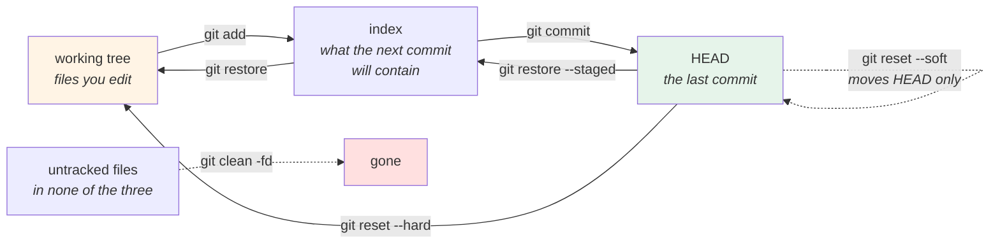

# 1.2 — The three trees: working tree, index, HEAD

## One-line answer

Git holds three versions of your project at once — the files on disk, a **staging area** holding exactly what
the next commit will contain, and the last commit — and almost every confusing git command becomes obvious
once you know which two of the three it moves between.

---

## The story

🎬 **The scene.** A pharmacy counter, and three surfaces.

There is the **shelf** — everything in the shop. There is the **tray** on the counter, where the pharmacist
puts the items for one particular prescription. And there is the **bag**, sealed, handed over, done.

The tray is the interesting one. It exists because the shelf has everything and the bag must have exactly the
right things. Items go onto the tray one at a time, checked; something wrong comes off again; and only when
the tray is right does it get sealed.

😬 **The naive fix.** A busy locum decides the tray is a wasted step and goes shelf-to-bag directly.

💥 **Why it fails.** Not on a simple prescription. It fails on the one with six items where the phone rings
halfway through, because **there is no longer any surface that represents "what I have decided so far"** — the
shelf shows everything and the bag is either sealed or not. When they come back to it, the only way to know
what has been done is to remember.

And the sealed bag with a wrong item in it is a different kind of problem from a tray with a wrong item on it.
One is a mistake; the other is a mistake **that has been handed to somebody**.

💡 **The insight.** **A space between "everything I have" and "what I am committing to" is not bureaucracy —
it is where a decision gets assembled and inspected before it becomes permanent.** Remove it and the decision
still gets made; it just gets made all at once, from memory, under pressure.

---

## The idea in plain language

The three trees, from furthest-from-permanent to most-permanent:

| Tree | What it is | Where it lives |
| --- | --- | --- |
| **the working tree** | the files you can open and edit | your directory |
| **the index** (also called the *staging area* or *cache*) | exactly what the next commit will contain | `.git/index` |
| **`HEAD`** | the last commit on the current branch | an object in `.git/objects` |

Three names for the middle one — *index*, *staging area*, *cache* — because it was renamed twice and every
name survived somewhere in the commands. **`git status` says "staged", the flags say `--cached`, and the file
is called `index`. They are the same thing**, and knowing that removes a whole class of confusion.

**And every core command is a move between two of them:**

| Command | Moves from | To |
| --- | --- | --- |
| *(you editing a file)* | — | working tree |
| `git add <file>` | working tree | index |
| `git commit` | index | a new commit, and `HEAD` moves to it |
| `git restore --staged <file>` | `HEAD` | index (unstage) |
| `git restore <file>` | index | working tree (discard your edit) |
| `git checkout <commit>` | that commit | index **and** working tree |
| `git reset --soft <commit>` | — | moves `HEAD` only |
| `git reset --mixed <commit>` (the default) | that commit | `HEAD` **and** index |
| `git reset --hard <commit>` | that commit | `HEAD`, index **and** working tree |

**Read the last three rows.** `--soft`, `--mixed` and `--hard` are not degrees of severity somebody invented —
they are *how many of the three trees get moved*. That is the entire difference, and it is why `--hard` is the
dangerous one: it is the only one that touches the working tree, which is the only one of the three that holds
work git has never seen.

### Why `git status` reads the way it does

`git status` is comparing the three trees pairwise, and its two sections are exactly those comparisons:

- **"Changes to be committed"** — index differs from `HEAD`.
- **"Changes not staged for commit"** — working tree differs from index.
- **"Untracked files"** — in the working tree, in neither of the other two.

**A file can appear in the first two sections at once**, which looks like a bug and is not: you staged one
edit and then made another. The index holds the first; the working tree holds both. Committing takes the
staged version and leaves the rest.

### The one that is not a tree

**Untracked files are not in any of the three.** They exist on disk and git knows nothing about them. That is
why `git reset --hard` does not delete them (it restores the three trees, and an untracked file is in none) and
why `git clean` is a separate, more dangerous command.

**`.gitignore` acts on untracked files only.** A file that is already in the index is tracked, and adding it to
`.gitignore` changes nothing — which is the fact that makes
[5.2](../05-repo-as-memory/5.2-the-secret-that-reached-history.md)'s failure possible and which Day 9 flagged
without being able to explain
([Day 9, 1.5](../../../day-009-configuration-and-secrets/parts/01-configuration/1.5-dotenv-is-a-developer-convenience.md)).

---

## Why Kriya needs it

**[4.1](../04-undo/4.1-the-four-undos.md)** is entirely this table: four undos, distinguished by which trees
they move.

**[4.3](../04-undo/4.3-the-force-push-and-the-reflog.md)** is what happens when `--hard` moves the working
tree and there was something in it.

**Day 10's `promote.sh`** refuses on a dirty working tree
([Day 10, 2.1](../../../day-010-environments-and-promotion/parts/02-promotion/2.1-build-once-promote-the-artifact.md)),
and *"dirty"* means precisely *"the working tree or the index differs from `HEAD`"* — a definition this part
supplies.

**[2.4](../02-the-message/2.4-one-change-per-commit.md)** argues for commits that contain one change, and the
index is the mechanism that makes it possible when your working tree contains two.

**Day 13's CI** checks out a commit into a clean working tree with an index built from it, which is why "it
works locally" and "it fails in CI" so often comes down to an untracked file that never left your machine.

---

## The mechanism

Watch a change move through all three, one step at a time. **Everything here happens in a scratch repository
so nothing touches this project's history.**

```bash
SCRATCH=$(mktemp -d)/three-trees
mkdir -p "$SCRATCH" && cd "$SCRATCH"
git init -q
git config user.email "you@example.invalid"
git config user.name "You"
printf 'one\n' > file.txt
git add file.txt
git commit -q -m "initial"
git log --oneline
```

**Line by line:**

- `mktemp -d` creates a temporary directory with a unique name and returns its path. **Doing this in a scratch
  repository rather than in the project is not caution for its own sake** — the next part uses
  `git reset --hard`, and running that in a repository with real work is how work is lost.
- `git init -q` creates a new empty repository; `-q` suppresses the hint output.
- `git config user.email` / `user.name` **locally**, without `--global`, so nothing about your real
  configuration changes. A commit needs an author; without these two, `git commit` refuses.
- The email is `.invalid`, a reserved top-level domain guaranteed never to resolve
  ([Day 7, 2.1](../../../day-007-networking-for-operators/parts/02-dns/2.1-what-resolution-actually-does.md)).
  **Use it wherever a document needs an address that must never reach anybody.**

```text
9a3f1c2 initial
```

Now make an edit and look at the three trees at each step:

```bash
cd "$SCRATCH"
show() {
  printf '%-22s working=%-6s index=%-6s HEAD=%s\n' "$1" \
    "$(cat file.txt)" \
    "$(git show :file.txt 2>/dev/null || echo '-')" \
    "$(git show HEAD:file.txt 2>/dev/null || echo '-')"
}
show "after commit"
printf 'two\n' > file.txt
show "after editing"
git add file.txt
show "after git add"
git commit -q -m "second"
show "after git commit"
```

**Line by line:**

- `git show :file.txt` — the `:<path>` syntax means **"this path, in the index"**. It is the only way to read
  the index's contents directly, and knowing it turns the index from an abstraction into something you can
  look at.
- `git show HEAD:file.txt` — the same path **in the last commit**, using the `<commit>:<path>` notation from
  [1.1](1.1-a-commit-is-a-snapshot-with-a-parent.md).
- `cat file.txt` — the working tree. **Three reads, three trees, one line.**
- `2>/dev/null || echo '-'` — before the first commit, `HEAD` does not exist and the command fails; printing
  `-` keeps the table readable rather than filling it with errors.
- The `show` function takes a label so each line says which step produced it. **A table of states with no
  labels is a puzzle.**

```text
after commit           working=one    index=one    HEAD=one
after editing          working=two    index=one    HEAD=one
after git add          working=two    index=two    HEAD=one
after git commit       working=two    index=two    HEAD=two
```

**Read it as a wavefront.** The change appears in the working tree, then in the index, then in `HEAD` — one
column at a time, one command each. **Every git command that confuses you is a command that moves this
wavefront in a way you did not expect.**

Now the reverse, which is [4.1](../04-undo/4.1-the-four-undos.md) in miniature:

```bash
cd "$SCRATCH"
printf 'three\n' > file.txt
git add file.txt
show "staged 'three'"
git restore --staged file.txt
show "after restore --staged"
git restore file.txt
show "after restore (no flag)"
```

**Line by line:**

- `git restore --staged <file>` — copy from `HEAD` into the **index**. The working tree is untouched, so your
  edit survives. This is "unstage".
- `git restore <file>` — copy from the **index** into the **working tree**. **This discards your edit**, and
  it is one of the few git commands that destroys work with no undo, because the working tree's contents were
  never in the object database.
- **The two commands differ by one flag and one of them is destructive.** `git restore` replaced the
  overloaded `git checkout -- <file>` for exactly this reason: one verb, one job.

```text
staged 'three'         working=three  index=three  HEAD=two
after restore --staged working=three  index=two    HEAD=two
after restore (no flag) working=two    index=two    HEAD=two
```

**`three` is gone entirely** — it was only ever in the working tree and the index, and the index copy was
overwritten before the working tree copy was. Nothing in the object database ever held it.



### Staging part of a file

The index's real payoff — assembling one change out of a working tree containing two:

```bash
cd "$SCRATCH"
printf 'alpha\nbeta\ngamma\n' > file.txt
git add file.txt && git commit -q -m "three lines"
printf 'ALPHA\nbeta\nGAMMA\n' > file.txt
git add -p file.txt <<'ANSWERS'
y
n
ANSWERS
git status --short
git diff --cached
```

**Line by line:**

- Two unrelated edits in one file: line 1 and line 3. **This is the normal state of a working tree**, and
  committing both together is how a commit ends up meaning two things
  ([2.4](../02-the-message/2.4-one-change-per-commit.md)).
- `git add -p` — **patch mode**, which offers each hunk and asks whether to stage it. `y` takes the first,
  `n` skips the second.
- The heredoc feeds the answers, because this document cannot be interactive. **In real use you type them**,
  and the prompt shows the hunk before asking.
- `git status --short` will now show the file as **both staged and modified** — the two-section case from
  earlier, which is the whole point.
- `git diff --cached` shows **index versus `HEAD`** — that is, what you are about to commit. `git diff` with
  no flag shows working tree versus index. **Two different questions, one letter apart**, and mixing them up
  is the most common way people commit something they did not mean to.

```text
MM file.txt
diff --git a/file.txt b/file.txt
index 5c4b3a1..8e2f0d9 100644
--- a/file.txt
+++ b/file.txt
@@ -1,3 +1,3 @@
-alpha
+ALPHA
 beta
 gamma
```

**`MM`** — two status letters. The first is the index versus `HEAD` (modified), the second is the working tree
versus the index (also modified). **One file, in two states at once**, which is only expressible because the
index exists.

And the diff shows **only the first line changed**, because that is what the index holds. The `GAMMA` edit is
still on disk and is not going into this commit.

Clean up:

```bash
cd "$(git rev-parse --show-toplevel 2>/dev/null || echo /tmp)"
rm -rf "$SCRATCH"
```

**Line by line:**

- `git rev-parse --show-toplevel 2>/dev/null || echo /tmp` — leave the scratch directory before deleting it,
  falling back to `/tmp` if you are not inside a repository. **Deleting the directory you are standing in
  leaves your shell in a path that no longer exists**, which produces confusing errors from every subsequent
  command.

---

## When it breaks

**The staged edit that was not committed.** The two-section case, misread:

```text
$ git status --short
MM pulse/config.py
$ git commit -m "fix the timeout bound"
$ git show --stat HEAD
 pulse/config.py | 1 +
```

**What it says:** one line changed in the commit.
**What it actually means:** you made two edits, staged one, kept working, and committed. **The second edit is
still in your working tree** and is not in the commit — so the commit is a partial change that may not even
run. `MM` was telling you this and it is two characters most people never read.
**The smallest fix:** `git status` before every commit, and read both sections.
**Why this is the most common git mistake in this whole day:** the workflow that produces it (`add`, then keep
working, then `commit`) is completely natural.

**`git diff` showing nothing after `git add`.** The question you asked, answered correctly:

```text
$ git add pulse/config.py
$ git diff
$ # ...nothing
```

**What it says:** no differences.
**What it actually means:** `git diff` compares **working tree against index**, and you just made them
identical. Your change has not vanished — it is staged.
**The smallest fix:** `git diff --cached` (or `--staged`, the same thing) compares **index against `HEAD`**,
which is what you wanted.
**Why the default is that way round:** the common question while working is *"what have I changed since I last
staged?"* — and the common question before committing is the other one, which is why the flag exists.

**`.gitignore` that changed nothing.** The tracked-file rule:

```text
$ echo '.env' >> .gitignore
$ git status --short
 M .env
```

**What it says:** `.env` is still showing as modified.
**What it actually means:** it is **tracked** — it is in the index — and `.gitignore` only affects untracked
files. Ignoring a tracked file does nothing at all.
**The smallest fix:** `git rm --cached .env` removes it from the index while leaving it on disk, after which
the ignore rule applies. **Note what that produces: a commit that deletes the file from the repository, while
every previous commit still contains it** —
[5.2](../05-repo-as-memory/5.2-the-secret-that-reached-history.md).
**Why Day 9 could only flag this and not explain it:** the explanation is the index, which is this part.

**The `reset --hard` that took an afternoon.** The working tree, which is not in the object database:

```text
$ git reset --hard HEAD~1
HEAD is now at eec9e0a day 7
$ git status
On branch main
nothing to commit, working tree clean
$ # ...and the four hours of uncommitted work are gone
```

**What it says:** a clean working tree.
**What it actually means:** `--hard` moved all three trees, and the working tree's contents — **the only one
of the three that held work git had never stored** — were overwritten.
**The smallest fix:** there is none for uncommitted work. The **committed** part is recoverable via the reflog
([4.3](../04-undo/4.3-the-force-push-and-the-reflog.md)); the uncommitted part is not, because git never saw
it.
**The habit that prevents it:** `git status --short` before any destructive command, and `git stash` if it is
not empty. **Day 10's setup section requires exactly this check for exactly this reason.**

---

## In production

**What a professional writes instead of the teaching version.** They use the index deliberately rather than
reflexively — `git add -p` to assemble one change out of a messy working tree, and `git diff --cached` as the
last thing before committing, which is a self-review that catches a surprising amount. The habit that
distinguishes them is reading `git status` output as **three trees being compared** rather than as a list of
files, so `MM` and `AM` and `??` are diagnoses rather than noise.

**What degrades at scale.** The index's cost on very large repositories: it is a single file listing every
tracked path with its stat information, and on a repository with hundreds of thousands of files, every
`git status` reads it and stats the working tree. Large monorepos need specific mechanisms — a filesystem
monitor, a sparse index — and the symptom before anybody does that is *"git is slow"*, which is really *"the
index is being compared against a very large working tree."*

**The failure that only shows with real traffic.** Not applicable: git is not on a serving path. **The
production-shaped version of this part's failure is a CI job**, where the checkout produces a working tree and
index from a commit and nothing else — so any file that was untracked on your machine simply does not exist.
*"It works locally"* is very often *"my working tree contains a file that is in none of the three trees"*, and
Day 13 will meet it.

**The review comment a senior engineer leaves.** *"This commit is half a change — `config.py` has the new
field and `api.py` still reads the old one, so this commit does not run. Looks like a partial `git add`. Check
`git diff --cached` before committing; a commit that cannot build is a commit `git bisect` cannot use."*

**The signal you would alert on.** None — this is local state, not a running system. The nearest thing worth
having is a **pre-commit check** that refuses a commit which does not pass a fast lint, so the "half a change"
above is caught before it enters history. That is a gate rather than an alert, and Day 14 builds it properly.
**The reason gates beat alerts here is the same as everywhere in this curriculum: a commit that has entered
history cannot be un-entered** ([1.1](1.1-a-commit-is-a-snapshot-with-a-parent.md)).

**Blast radius.** This part runs `git reset`, `git restore` and `git add -p` — **commands that destroy
uncommitted work** — and it runs every one of them inside a temporary repository created by `mktemp -d`, which
is deleted at the end. Worst case: a scratch directory is left in the temporary filesystem. What bounds it:
`git init` in a fresh directory, a local `git config` that does not touch your global settings, and no command
in this part is run against the Kriya repository. Who can trigger it: you. **The one habit this part is
teaching is the one that bounds it: `git status --short` before anything destructive.**

**Cost.** `0` model calls, `0` tokens, `0` CI minutes, `0` new packages, `0` network, `0` servers. Disk: a
scratch repository of a few kilobytes, deleted. RAM: negligible.

**The interview question.** *"What is the git index for?"* The answer that shows it is a tool rather than a
ceremony: *"It is the third tree — between the files on disk and the last commit — and it holds exactly what
the next commit will contain. The reason it earns its place is that a working tree usually contains more than
one change, and the index is where you assemble one of them: `git add -p` to take the hunks that belong
together, then `git diff --cached` to review precisely what you are about to commit. Once you know the three
trees, the commands stop being arbitrary — `reset --soft`, `--mixed` and `--hard` are just how many of the
three get moved, which is why `--hard` is the dangerous one: it is the only one that touches the working tree,
and the working tree is the only one of the three whose contents git has never stored."*

---

## Check yourself

```bash
SCRATCH=$(mktemp -d)/tt && mkdir -p "$SCRATCH" && cd "$SCRATCH" && git init -q
git config user.email you@example.invalid && git config user.name You
printf 'a\nb\n' > f.txt && git add f.txt && git commit -q -m one
printf 'A\nb\n' > f.txt && git add f.txt && printf 'A\nB\n' > f.txt
git status --short
git diff --stat; echo "--- vs ---"; git diff --cached --stat
cd /tmp && rm -rf "$SCRATCH"
```

`MM` on one line, and **two different diffs** — one showing the `B` edit, one showing the `A` edit. Say which
comparison each one is.

**Say out loud, without scrolling up:** *Name the three trees, say which command moves between which two, and
explain why `git reset --hard` can lose work that `git reset --soft` cannot.*
