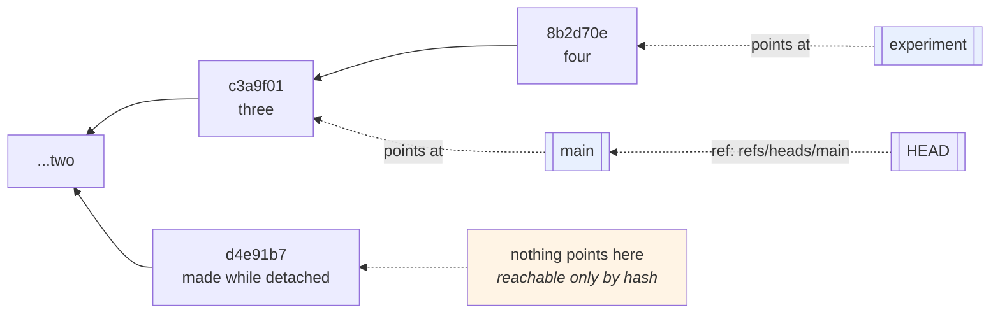

# 1.3 — Branches and `HEAD` are just pointers

## One-line answer

A branch is a **file containing one forty-character hash** — nothing more — and `HEAD` is a file saying which
branch you are on, which is why creating a branch is instant, why deleting one deletes no commits, and why
"the branch moved" is the accurate description of almost everything that happens in git.

---

## The story

🎬 **The scene.** A long shelf of numbered boxes in an archive, and a row of little brass clips along the
front edge.

Each clip has a paper label — `main`, `experiment`, `for-review` — and each clip is slid along to sit under
one box. That is all a clip is: a name, resting at a position.

Adding a new label costs one clip and four seconds. Moving one costs a slide. Taking a clip off the shelf
removes **the clip**; every box is exactly where it was.

😬 **The naive fix.** A new archivist, told to "delete the experiment branch", takes the clip off and then —
being thorough — removes the boxes it was pointing at, on the reasonable assumption that a branch *contains*
things.

💥 **Why it fails.** Those boxes are also reachable from two other clips further along, because the shelf is
one continuous run and branches share their early history. **Removing the boxes broke three labels, not one**,
and the labels look fine — they still point at positions. The positions are now empty.

💡 **The insight.** **A name that points at something is not the something.** Confusing the pointer with the
thing is the single most common error in every system that has both — and the tell is a verb: you *move* a
pointer and you *delete* a thing, and if the interface uses one word for both, people will do the wrong one.

---

## The idea in plain language

[1.1](1.1-a-commit-is-a-snapshot-with-a-parent.md) established that a commit points at its parent, so the
commits form a chain going backwards. **Nothing in that chain points forwards.** So how does git know where
"the end" is?

**A branch is a file containing the hash of one commit** — the tip. Everything reachable by following parents
backwards from that commit is "on" the branch.

Read that twice, because the consequences are almost all the surprising things about git:

- **Creating a branch writes 41 bytes.** A hash and a newline. It is instant regardless of repository size,
  which is why git users branch casually and users of older systems did not.
- **Deleting a branch deletes a pointer.** The commits are untouched
  ([1.4](1.4-nothing-is-lost-the-object-database.md) is where they go).
- **Committing moves the branch.** The new commit's parent is the old tip, and the branch file is rewritten to
  the new hash. *"Committing advances the branch"* is literally what happens.
- **A commit can be on many branches at once.** "On" means *reachable*, and two branches sharing history share
  all of it up to where they diverged.
- **Merging moves a pointer too** — either forward along an existing chain (a *fast-forward*) or to a new
  commit with two parents.

### `HEAD`

`HEAD` is a file saying **which branch you are on**. Almost always it contains a reference rather than a hash:

```text
ref: refs/heads/main
```

That indirection is what makes `git commit` work: it follows `HEAD` to find the branch, then moves the branch.

When `HEAD` contains a **hash** instead of a `ref:` line, you are in **detached HEAD** state — you have checked
out a commit directly rather than a branch. Everything works; commits are created normally; and **nothing is
pointing at them except `HEAD`**, so moving away leaves them unreferenced. That is not a bug and it is not
dangerous once you know what it is, and it is the source of the most alarming message git prints.

### Where they actually live

| Thing | File | Contains |
| --- | --- | --- |
| a branch | `.git/refs/heads/<name>` | one hash |
| a remote branch | `.git/refs/remotes/<remote>/<name>` | one hash |
| a tag | `.git/refs/tags/<name>` | one hash (or a tag object's hash) |
| `HEAD` | `.git/HEAD` | `ref: refs/heads/<name>` — or a hash, if detached |

**These are ordinary text files and you can `cat` them.** Doing so once removes most of the mystery, and the
rest of this part does exactly that.

*(Git may store refs in a single `packed-refs` file instead, for efficiency, which is why a branch's file
sometimes does not exist. `git rev-parse <branch>` answers correctly either way — and using the porcelain
command rather than reading the file is the general lesson.)*

---

## Why Kriya needs it

**[4.1](../04-undo/4.1-the-four-undos.md)** and **[4.2](../04-undo/4.2-revert-versus-reset.md)** are entirely
about moving pointers: `reset` moves a branch, `revert` adds a commit, and the difference matters exactly
because of what a branch is.

**[4.3](../04-undo/4.3-the-force-push-and-the-reflog.md)** is a branch being moved on a *remote*, which is why
it can destroy other people's work while destroying no commits.

**Day 10's promotion** was explicitly *not* a branch operation
([Day 10, 1.1](../../../day-010-environments-and-promotion/parts/01-what-an-environment-is/1.1-an-environment-is-a-deploy-not-a-folder.md))
— and understanding that a branch is a pointer is what makes "an environment is not a branch" more than a
slogan.

**Day 12** builds the branching model this project uses, and every rule in it is a rule about when a pointer
may move.

**Day 55's GitOps** treats a branch in a deployment repository as the desired state of a cluster. **A pointer
to a commit is a pointer to a complete snapshot** ([1.1](1.1-a-commit-is-a-snapshot-with-a-parent.md)), which
is exactly why that works.

---

## The mechanism

Look at the files. Read-only, on this repository.

```bash
cd "$(git rev-parse --show-toplevel)"
echo "--- .git/HEAD ---"
cat .git/HEAD
echo "--- the branch it names ---"
cat .git/refs/heads/main 2>/dev/null || git rev-parse main
echo "--- what git says ---"
git rev-parse HEAD
git rev-parse main
```

**Line by line:**

- `cat .git/HEAD` prints the indirection — `ref: refs/heads/main` — which is the whole mechanism in one line.
- `cat .git/refs/heads/main` prints **one hash and a newline**. Forty-one bytes; that is a branch.
- `|| git rev-parse main` — the fallback for when refs are packed, and the reminder that **the porcelain
  command is the correct way to ask.**
- The last two lines prove all three routes give the same answer: `HEAD` → the branch file → the hash.

```text
--- .git/HEAD ---
ref: refs/heads/main
--- the branch it names ---
14a1dcd2f0b4c9e8a7d6f5c3b2a1908e7d6c5b4a
--- what git says ---
14a1dcd2f0b4c9e8a7d6f5c3b2a1908e7d6c5b4a
14a1dcd2f0b4c9e8a7d6f5c3b2a1908e7d6c5b4a
```

Now watch pointers move. **Scratch repository**, so nothing here touches the project:

```bash
SCRATCH=$(mktemp -d)/pointers && mkdir -p "$SCRATCH" && cd "$SCRATCH"
git init -q && git config user.email you@example.invalid && git config user.name You
for n in one two three; do printf '%s\n' "$n" > f.txt; git add f.txt; git commit -q -m "$n"; done

refs() {
  printf '%-18s HEAD=%-8s' "$1" "$(git rev-parse --short HEAD)"
  for b in $(git for-each-ref --format='%(refname:short)' refs/heads); do
    printf ' %s=%s' "$b" "$(git rev-parse --short "$b")"
  done
  printf '  [%s]\n' "$(cat .git/HEAD | sed 's|ref: refs/heads/||')"
}
refs "three commits"
```

**Line by line:**

- The `for` loop makes three commits with three different contents, so each has a distinct hash.
- `git for-each-ref --format='%(refname:short)' refs/heads` — **list every branch**, scriptably. It is the
  correct tool: parsing `git branch`'s output is a classic mistake because that command formats for humans
  (with an asterisk on the current branch) and its format is not guaranteed.
- `git rev-parse --short <ref>` resolves any reference to a hash — a branch, `HEAD`, a tag, `HEAD~2`.
- The last column prints the raw contents of `.git/HEAD` with the prefix stripped, so a detached `HEAD` will
  show a hash instead of a name. **That column is the interesting one.**

```text
three commits      HEAD=c3a9f01 main=c3a9f01  [main]
```

Create a branch and see that nothing else changes:

```bash
cd "$SCRATCH"
git branch experiment
refs "after git branch"
ls -l .git/refs/heads/
wc -c .git/refs/heads/experiment
```

**Line by line:**

- `git branch <name>` with no other argument creates a branch **at the current commit** and does **not** switch
  to it. The `[main]` column proves it.
- `wc -c` counts bytes. **Forty-one**: a hash and a newline.

```text
after git branch   HEAD=c3a9f01 experiment=c3a9f01 main=c3a9f01  [main]
-rw-r--r-- 1 you 197121 41 Aug 25 15:04 experiment
-rw-r--r-- 1 you 197121 41 Aug 25 15:04 main
41 .git/refs/heads/experiment
```

**Two branches, one commit, forty-one bytes each.** Now commit on one of them:

```bash
cd "$SCRATCH"
git switch -q experiment
refs "after switch"
printf 'four\n' > f.txt && git add f.txt && git commit -q -m four
refs "after commit"
git switch -q main
refs "back on main"
cat f.txt
```

**Line by line:**

- `git switch <branch>` — the modern command for changing branches. It replaced one of `git checkout`'s many
  jobs; `git restore` ([1.2](1.2-the-three-trees.md)) replaced another. **One verb, one job.**
- Committing on `experiment` moves **only** `experiment`. `main` does not move, because a commit moves the
  branch that `HEAD` points at and nothing else.
- Switching back changes the working tree and the index to that branch's tip
  ([1.2](1.2-the-three-trees.md)), which is why `cat f.txt` prints the old content.

```text
after switch       HEAD=c3a9f01 experiment=c3a9f01 main=c3a9f01  [experiment]
after commit       HEAD=8b2d70e experiment=8b2d70e main=c3a9f01  [experiment]
back on main       HEAD=c3a9f01 experiment=8b2d70e main=c3a9f01  [main]
three
```

**One column moved.** That is what a commit does.

### Detached HEAD

The state with the alarming message:

```bash
cd "$SCRATCH"
git switch -q --detach HEAD~1
cat .git/HEAD
refs "detached"
printf 'orphan\n' > f.txt && git add f.txt && git commit -q -m "made while detached"
refs "committed detached"
ORPHAN=$(git rev-parse --short HEAD)
git switch -q main
refs "back on main"
echo "the orphan commit is still there: $(git log --oneline -1 "$ORPHAN")"
```

**Line by line:**

- `git switch --detach <commit>` — check out a commit **without** a branch, deliberately and with a flag that
  says so. (`git checkout <commit>` does the same thing and prints a long warning.)
- `cat .git/HEAD` now shows **a hash rather than a `ref:` line.** That single difference *is* detached HEAD.
- The commit made while detached moves `HEAD` and **no branch**, because there is no branch to move.
- `ORPHAN=$(git rev-parse --short HEAD)` **captures the hash before switching away** — which is the practical
  point: once you switch, nothing points at that commit and you need its hash to reach it.
- The last line proves the commit still exists. **It is not deleted; it is unreferenced**, and
  [1.4](1.4-nothing-is-lost-the-object-database.md) is about what that means.

```text
ref: refs/heads/main
detached           HEAD=8f0a2c1 experiment=8b2d70e main=c3a9f01  [8f0a2c1]
committed detached HEAD=d4e91b7 experiment=8b2d70e main=c3a9f01  [d4e91b7]
back on main       HEAD=c3a9f01 experiment=8b2d70e main=c3a9f01  [c3a9f01... wait]
the orphan commit is still there: d4e91b7 made while detached
```

**Deleting a branch, and what survives:**

```bash
cd "$SCRATCH"
EXP=$(git rev-parse experiment)
git branch -D experiment
refs "after branch -D"
echo "the commit it pointed at: $(git log --oneline -1 "$EXP")"
echo "its content: $(git show "$EXP:f.txt")"
cd /tmp && rm -rf "$SCRATCH"
```

**Line by line:**

- `EXP=$(git rev-parse experiment)` — **capture the hash before deleting the pointer.** Without it you would
  need the reflog ([1.4](1.4-nothing-is-lost-the-object-database.md)) to find the commit again, which is
  exactly the situation this demonstrates.
- `git branch -D` force-deletes, without the "not fully merged" safety check that `-d` applies. **`-d` refuses
  to delete a branch whose commits are not reachable from anywhere else** — a guard that exists precisely
  because people expect deleting a branch to be safe, and it is only safe when something else still points at
  the commits.
- The last two lines read the commit and its file content **after the branch is gone.**

```text
after branch -D    HEAD=c3a9f01 main=c3a9f01  [main]
the commit it pointed at: 8b2d70e four
its content: four
```

**The branch is gone and the commit is fine.** Deleting a branch deleted forty-one bytes.



---

## When it breaks

**The detached HEAD warning.** The most alarming correct message git prints:

```text
$ git checkout 14a1dcd
Note: switching to '14a1dcd'.

You are in 'detached HEAD' state. You can look around, make experimental
changes and commit them, and you can discard any commits you make in this
state without impacting any branches by switching back to a branch.

If you want to create a new branch to retain commits you create, you may
do so (now or later) by using -c with the switch command. Example:

  git switch -c <new-branch-name>
```

**What it says:** a five-paragraph warning.
**What it actually means:** `HEAD` now contains a hash instead of a branch reference. **Nothing is wrong**, and
the warning exists because commits made here are not pointed at by any branch and will look lost.
**The smallest fix:** if you want to keep what you do here, `git switch -c <name>` — which creates a branch **at
the current commit**, giving those commits a pointer.
**Why you end up here without meaning to:** checking out a tag, checking out a specific commit to reproduce a
bug, and — most commonly — a CI system, which checks out a commit rather than a branch. **That is why CI logs
often show detached HEAD and why it is not a problem there.**

**The branch deletion that was refused.** The guard doing its job:

```text
$ git branch -d experiment
error: the branch 'experiment' is not fully merged
hint: If you are sure you want to delete it, run 'git branch -D experiment'
```

**What it says:** the branch has commits not reachable from anywhere else.
**What it actually means:** deleting the pointer will leave those commits unreferenced — recoverable via the
reflog for a while ([1.4](1.4-nothing-is-lost-the-object-database.md)), and effectively gone for most people.
**The smallest fix:** merge it, or note the hash, or accept and use `-D`.
**Why the distinction between `-d` and `-D` matters:** `-d` is the one that thinks about reachability. Typing
`-D` reflexively because `-d` complained is how the guard gets removed from the workflow entirely.

**The "lost" work after switching branches.** The pointer that never existed:

```text
$ git switch main
$ git log --oneline -3
14a1dcd day 8
eec9e0a day 7
2c36b16 day 000: ...
$ # where did my three commits go?
```

**What it says:** your commits are not in the log.
**What it actually means:** they were made in detached HEAD, so **no branch points at them**, and `git log`
shows what is reachable from `HEAD`. They exist; they are unreferenced.
**The smallest fix:** `git reflog` finds the hash, then `git switch -c recovered <hash>`
([4.3](../04-undo/4.3-the-force-push-and-the-reflog.md)).
**Why the panic is understandable:** every visible tool — `git log`, `git branch`, your editor's history —
shows *reachable* commits, so an unreferenced commit is invisible everywhere except the reflog.

**The branch that "contained" a file.** The mental model, failing:

```text
$ git branch -d old-experiment
Deleted branch old-experiment (was 8b2d70e).
$ # "wait, that branch had the only copy of the migration script"
```

**What it says:** a branch was deleted.
**What it actually means:** the file is in a commit, the commit still exists, and the message printed **the
hash you need** — `(was 8b2d70e)`. Recovery is `git show 8b2d70e:path/to/file`.
**The smallest fix:** read the deletion message. Git prints the hash for exactly this reason.
**The general lesson:** git tells you the hash whenever it moves or removes a pointer — in `branch -d`, in
`reset`, in the reflog. **Those hashes are the undo, and most people scroll past them.**

---

## In production

**What a professional writes instead of the teaching version.** They talk about branches as pointers, which
changes the questions they ask: not *"is my work on this branch"* but *"is my commit reachable from this
pointer"*. In tooling they use `git rev-parse` and `git for-each-ref` rather than parsing `git branch` output,
because the porcelain commands format for humans and change between versions. And they never treat a branch
name as an identity for a deployment — Day 10's argument — because a name that can be moved is not an
identity.

**What degrades at scale.** The number of refs. A repository with tens of thousands of branches and tags —
common where a CI system creates one per pull request and nothing cleans up — makes every fetch and every ref
lookup slower, because the client and server negotiate over the full ref list. The counter-measures are
packed refs (which git does automatically) and **deleting merged branches**, which costs nothing because a
branch is a pointer and its commits are reachable from wherever it was merged.

**The failure that only shows with real traffic.** Not applicable — git is not on a serving path. **The
production-shaped analogue is a deploy pipeline that checks out a *branch* rather than a *commit*.** By the
time the job runs, the branch may point somewhere else, so two runs of "the same deploy" build different code
— which is exactly
[Day 10, 2.4](../../../day-010-environments-and-promotion/parts/02-promotion/2.4-the-rebuild-that-promoted-something-different.md)'s
moving-tag failure, one layer down. **A pipeline should resolve the branch to a commit once and use the commit
everywhere after.**

**The review comment a senior engineer leaves.** *"The deploy job does `git checkout main`. Between the trigger
and the checkout somebody can merge, so what we deploy is not what triggered the run — and the two are
impossible to correlate afterwards. Resolve the ref to a SHA at the start and pass the SHA to every subsequent
step."*

**The signal you would alert on.** Nothing here is a runtime signal. What is worth having, and is a gate
rather than an alert: **a protected-branch rule** on the server that refuses a non-fast-forward push to `main`
([4.3](../04-undo/4.3-the-force-push-and-the-reflog.md)) — because a branch is a pointer, and the dangerous
operation is moving it *backwards* or sideways. Server-side refusal is the only reliable place for that rule;
a local hook is advisory and can be skipped. **Refuse rather than notify**, for the same reason as every other
gate in this curriculum.

**Blast radius.** This part runs `git branch -D`, `git switch --detach` and `git commit` — **operations that
move and delete pointers** — and every one of them runs inside a temporary repository created by `mktemp -d`
and deleted at the end. The commands run against *this* repository are read-only: `cat`, `rev-parse`,
`for-each-ref`. Worst case: a scratch directory survives in the temporary filesystem. What bounds it:
`git init` in a fresh directory, a local `git config`, and no pointer in the Kriya repository is touched. Who
can trigger it: you.

**Cost.** `0` model calls, `0` tokens, `0` CI minutes, `0` new packages, `0` network, `0` servers. Disk: a
scratch repository of a few kilobytes, deleted. RAM: negligible.

**The interview question.** *"What is a git branch?"* The answer that shows the model: *"A file containing one
commit hash. That is genuinely all it is — forty-one bytes in `.git/refs/heads/`. Everything surprising about
git follows: creating a branch is instant regardless of repository size, deleting one deletes no commits,
committing *moves* the branch that `HEAD` points at, and a commit can be on many branches because 'on' means
reachable by following parents. `HEAD` is a second file saying which branch you are on — and when it holds a
hash instead of a reference, that is detached HEAD, which is not an error, it is just a commit with no pointer
to it. The practical consequence I care about is that a branch name is not an identity: a pipeline that checks
out `main` builds whatever `main` points at when the job runs, not what triggered it, so it should resolve to a
SHA once and use that everywhere."*

---

## Check yourself

```bash
cd "$(git rev-parse --show-toplevel)"
cat .git/HEAD
git rev-parse HEAD; git rev-parse main
git for-each-ref --format='%(refname:short) -> %(objectname:short)' refs/heads
```

A `ref:` line, two identical hashes, and one line per branch showing what it points at.

**Say out loud, without scrolling up:** *State what a branch is in one sentence, explain what `git commit`
does to it, and say why deleting a branch is not the same as deleting its commits.*
