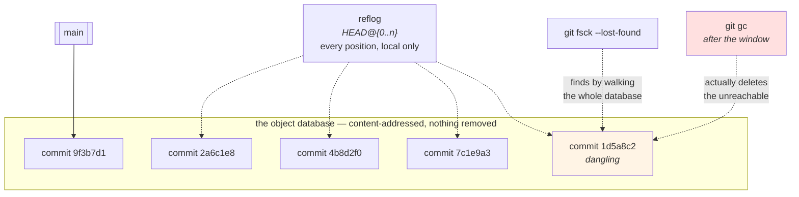

# 1.4 — Nothing is lost: the object database and the reflog

## One-line answer

Committed work is almost never actually gone — it is **unreferenced**, sitting in the object database with
nothing pointing at it, and the **reflog** is a per-repository record of every position every branch and
`HEAD` has held, which makes it the undo for operations that have no undo.

---

## The story

🎬 **The scene.** A large library, and the difference between a book and a catalogue card.

The catalogue is how anybody finds anything. Pull a card and the book becomes unfindable — nobody can look it
up, it appears in no search, and to every reader in the building it does not exist.

**The book is still on the shelf.** It is exactly where it was, and if you know the shelf and the position you
can walk over and pick it up.

😬 **The naive fix.** A reader who has pulled a card in error assumes the book is destroyed and starts trying
to reconstruct it from memory.

💥 **Why it fails.** Not because the reconstruction is bad — because it is unnecessary and takes a week, and
because the reconstructed copy is now a *second* book that disagrees with the first in small ways nobody will
notice for years.

And the genuinely destructive step comes later: the annual clear-out, which removes anything with no card.
**Between the mistake and the clear-out there is a window**, and everything depends on knowing the window
exists.

💡 **The insight.** **Removing the way to find something is not the same as removing it — and the recovery
window is finite.** Systems that separate the index from the storage almost always have both properties, and
knowing the second one is what turns "I have lost it" into "I have a few weeks to get it back".

---

## The idea in plain language

[1.1](1.1-a-commit-is-a-snapshot-with-a-parent.md) established that objects are stored under the hash of their
content. [1.3](1.3-branches-and-head-are-just-pointers.md) established that branches are pointers *into* that
storage.

Put them together: **the object database and the references are two separate things.** Deleting a reference
does not touch an object.

An object is **reachable** if you can get to it by starting from any reference — a branch, a tag, `HEAD`, the
index — and following pointers. An object nothing can reach is **unreferenced**, invisible to `git log`, and
still on disk.

That produces the situation that panics people:

| What you did | What happened to the commits |
| --- | --- |
| `git branch -D feature` | unreferenced |
| `git reset --hard HEAD~3` | the three are unreferenced |
| `git commit --amend` | the original is unreferenced |
| `git rebase` | every original commit is unreferenced |
| switching away from a detached `HEAD` | that commit is unreferenced |

**In every row the commits still exist**, and in every row `git log` shows nothing.

### The reflog

If unreferenced objects were only reachable by remembering a hash, this would be theory. The **reflog** is
what makes it practical.

Every time a reference moves — every commit, checkout, reset, merge, rebase, pull — git appends a line
recording **where it was** and where it went. There is one for `HEAD` and one for each branch.

That is a log of positions, and it means: **whatever a branch used to point at, git wrote it down.**

Two things about it that matter operationally:

**It is local.** The reflog lives in `.git/logs/` and is never pushed, never fetched, and does not exist in a
fresh clone. Somebody else's reflog cannot help you, and yours cannot help them.

**It expires.** Unreachable entries are pruned after a period (90 days by default for reachable ones, 30 for
unreachable), and `git gc` eventually deletes objects that no reference and no reflog entry can reach. **The
window is real and finite** — which is why *"nothing is lost"* is a useful working assumption and not a
guarantee.

### The other recovery tool

`git fsck --lost-found` reports objects that nothing points at — **dangling** objects. It finds things the
reflog does not, most importantly commits whose branch was deleted in a fresh clone, and it is the second
thing to try.

---

## Why Kriya needs it

**[4.1](../04-undo/4.1-the-four-undos.md)** and **[4.3](../04-undo/4.3-the-force-push-and-the-reflog.md)** are
the operational payoff: every destructive git operation has a reflog entry immediately before it.

**[5.2](../05-repo-as-memory/5.2-the-secret-that-reached-history.md)** is the same property with the sign
flipped: a credential in a commit is unreachable-but-present after you "remove" it, which is exactly why
removal does not help and rotation is the only response.

**Day 10's drills** ran `git reset --hard` twice
([Day 10, 2.4](../../../day-010-environments-and-promotion/parts/02-promotion/2.4-the-rebuild-that-promoted-something-different.md)),
and the setup section required a clean tree because of what that command does to the working tree. **This part
is what would have saved the committed half.**

**Day 15's artifact retention** and **Day 105's model registry** are the same shape one layer up: objects
identified by content, references that can be removed, and a retention window after which the object is
actually gone. **Learning it here makes those days shorter.**

---

## The mechanism

Destroy some work and get it back. **Scratch repository throughout.**

```bash
SCRATCH=$(mktemp -d)/lost && mkdir -p "$SCRATCH" && cd "$SCRATCH"
git init -q && git config user.email you@example.invalid && git config user.name You
for n in one two three four; do printf '%s\n' "$n" > f.txt; git add f.txt; git commit -q -m "$n"; done
git log --oneline
```

**Line by line:**

- Four commits, so there is something to lose.
- Everything in this part runs in a temporary repository, deleted at the end — for the same reason as
  [1.2](1.2-the-three-trees.md) and [1.3](1.3-branches-and-head-are-just-pointers.md): **the commands here are
  the destructive ones.**

```text
7c1e9a3 four
4b8d2f0 three
2a6c1e8 two
9f3b7d1 one
```

**Destroy three commits:**

```bash
cd "$SCRATCH"
git reset --hard HEAD~3
git log --oneline
echo "--- and yet ---"
git cat-file -t 7c1e9a3 2>/dev/null && echo "the object still exists"
git show 7c1e9a3:f.txt
```

**Line by line:**

- `git reset --hard HEAD~3` moves the branch back three commits **and** resets the index and working tree
  ([1.2](1.2-the-three-trees.md)). Three commits are now unreferenced.
- `git log --oneline` shows one commit. **From every normal tool's point of view, the other three are gone.**
- `git cat-file -t <hash>` asks the object database directly, bypassing references entirely — and it answers.
- `git show <hash>:f.txt` reads a file's content out of an unreferenced commit. **The data is intact.**

```text
9f3b7d1 one
--- and yet ---
commit
the object still exists
four
```

**Now find it without knowing the hash** — which is the realistic case:

```bash
cd "$SCRATCH"
git reflog
```

**Line by line:**

- `git reflog` with no arguments shows `HEAD`'s reflog: every position `HEAD` has held, newest first, with the
  operation that moved it.
- `HEAD@{n}` is the notation for *"where `HEAD` was n moves ago"*. **It is a position in the reflog, not a
  commit ancestor** — `HEAD~3` and `HEAD@{3}` mean completely different things, and confusing them is the
  classic reflog mistake: `~` walks parents, `@{}` walks history-of-positions.

```text
9f3b7d1 (HEAD -> main) HEAD@{0}: reset: moving to HEAD~3
7c1e9a3 HEAD@{1}: commit: four
4b8d2f0 HEAD@{2}: commit: three
2a6c1e8 HEAD@{3}: commit: two
9f3b7d1 HEAD@{4}: commit (initial): one
```

**`HEAD@{1}` is where you were before the reset**, and the line says exactly what moved it. Recover:

```bash
cd "$SCRATCH"
git reset --hard 'HEAD@{1}'
git log --oneline
cat f.txt
```

**Line by line:**

- `'HEAD@{1}'` **in single quotes**, because `{` and `}` are special in some shells and an unquoted brace
  expression can be mangled before git ever sees it. **Quote every reflog reference.**
- `git reset --hard` again — the same command that destroyed it, pointed the other way. **A branch is a
  pointer** ([1.3](1.3-branches-and-head-are-just-pointers.md)); moving it back is symmetric.

```text
7c1e9a3 four
4b8d2f0 three
2a6c1e8 two
9f3b7d1 one
four
```

**All four commits, and the file content, restored by moving one pointer.**

### The branch-level reflog

`HEAD`'s reflog is not the only one:

```bash
cd "$SCRATCH"
git switch -q -c feature
printf 'five\n' > f.txt && git add f.txt && git commit -q -m five
git switch -q main
git branch -D feature
echo "--- HEAD reflog (does not mention the branch deletion) ---"
git reflog -3
echo "--- the deleted branch's own reflog ---"
git reflog show feature 2>&1 | head -3
echo "--- fsck finds it ---"
git fsck --lost-found 2>/dev/null | head -3
```

**Line by line:**

- `git switch -c <name>` creates a branch **and** switches to it — the two-step from
  [1.3](1.3-branches-and-head-are-just-pointers.md), in one command.
- `git reflog show <branch>` reads **that branch's** reflog, in `.git/logs/refs/heads/<branch>`.
- **Deleting a branch deletes its reflog file too**, which is the important discovery here — so the
  branch-specific reflog is exactly what you cannot use after a branch deletion.
- `git fsck --lost-found` walks the whole object database and reports objects nothing reaches. **This is the
  fallback when the reflog cannot help**, and it is slow on a large repository because it examines everything.

```text
--- HEAD reflog (does not mention the branch deletion) ---
7c1e9a3 (HEAD -> main) HEAD@{0}: checkout: moving from feature to main
1d5a8c2 HEAD@{1}: commit: five
7c1e9a3 HEAD@{2}: checkout: moving from main to feature
--- the deleted branch's own reflog ---
fatal: log for refs/heads/feature is unavailable
--- fsck finds it ---
dangling commit 1d5a8c2f0e9b4a7c3d1058e6b2a9f4c7d3e0b185
```

**Two lessons in one output.** The branch's reflog is gone with the branch — but `HEAD`'s reflog still records
the commit, because `HEAD` was there when it was made. And `fsck` finds it regardless, by ignoring references
entirely.



### Proving the window is finite

`git gc` is the annual clear-out. **Watch it actually remove something:**

```bash
cd "$SCRATCH"
DANGLING=$(git fsck --lost-found 2>/dev/null | grep 'dangling commit' | head -1 | awk '{print $3}')
echo "dangling: $DANGLING"
git reflog expire --expire-unreachable=now --all
git gc --prune=now -q
echo "--- after gc ---"
git cat-file -t "$DANGLING" 2>&1 || echo "the object is now genuinely gone"
cd /tmp && rm -rf "$SCRATCH"
```

**Line by line:**

- `git reflog expire --expire-unreachable=now --all` — **drop every reflog entry for objects nothing reaches,
  immediately.** Without this, `gc` will not remove them: the reflog counts as a reference, which is the whole
  reason the recovery window exists.
- `git gc --prune=now` — garbage-collect, deleting unreachable objects with no grace period. **The default is
  a two-week grace period**, which exists precisely so a `gc` cannot destroy something you deleted five
  minutes ago.
- `2>&1 || echo …` because `cat-file` on a missing object writes an error and exits non-zero
  ([Day 4, 3.1](../../../day-004-linux-for-operators-i/parts/03-exit-codes/3.1-the-exit-code-is-the-whole-return-value.md)).
- **Do not run these two commands casually.** They are here so that "nothing is lost" is understood as *"there
  is a window"* rather than as a guarantee — and running them by hand on a real repository is one of the very
  few ways to genuinely destroy history.

```text
dangling: 1d5a8c2f0e9b4a7c3d1058e6b2a9f4c7d3e0b185
--- after gc ---
fatal: Not a valid object name 1d5a8c2f0e9b4a7c3d1058e6b2a9f4c7d3e0b185
the object is now genuinely gone
```

**That is the only sequence in this whole day that actually destroys a commit**, and it took two deliberate
commands with explicit "now" flags.

---

## When it breaks

**The rebase that "lost" everything.** The most common recovery situation:

```text
$ git rebase -i HEAD~5
# ...conflicts, confusion, git rebase --abort typed too late...
$ git log --oneline -3
9c2e1a4 (HEAD -> main) an unrecognisable mess
4f7b3d8 another
1a2b3c4 another
```

**What it says:** a history you do not recognise.
**What it actually means:** a rebase **rewrites** commits — new hashes, same content, new parents — so the
originals are unreferenced. Every one of them is in the reflog.
**The smallest fix:** `git reflog`, find the entry immediately before `rebase -i (start)`, and
`git reset --hard 'HEAD@{n}'`.
**The detail that makes this fast:** the reflog labels the operation — `rebase -i (start)`, `rebase (finish)`,
`reset: moving to`, `checkout: moving from`. **You are looking for the line just above the first line of the
operation that went wrong**, and the labels are what make that findable in seconds.

**The reflog that was not there.** The local-only property, met at the worst time:

```text
$ git clone https://example.invalid/pulse.git && cd pulse
$ git reflog
$ # ...one line: the clone
```

**What it says:** an almost-empty reflog.
**What it actually means:** **the reflog is not part of the repository.** It records what *this copy* has done,
and a fresh clone has done one thing. If the commits you want were deleted on somebody else's machine, their
reflog has them and yours never will.
**The smallest fix:** ask the person whose machine did the operation, or use `git fsck` on a copy that has the
objects.
**Why this surprises people:** everything else about git is distributed, so the reflog being local is
genuinely an exception — and it is an exception because it is a record of *actions*, not of *content*.

**The `gc` that ran during the window.** The finite part of "nothing is lost":

```text
$ git reset --hard 'HEAD@{5}'
fatal: Not a valid object name HEAD@{5}
$ git reflog | wc -l
2
```

**What it says:** the reflog entry does not exist.
**What it actually means:** it expired, or somebody ran `git gc --prune=now`, or a tool did
`git reflog expire`. The default windows are generous — **90 days for reachable entries and 30 for unreachable
ones** — and they are not infinite.
**The smallest fix:** `git fsck --lost-found`, which does not depend on the reflog. If `gc` has already run,
there is nothing.
**Why the numbers matter:** *"I will get back to it"* is fine for a week and not for a quarter. **An
unreferenced commit you care about should be given a pointer immediately** — `git branch recovered <hash>` —
rather than left in the window.

**The recovered work that was never committed.** The limit of the whole mechanism:

```text
$ git reflog
9f3b7d1 (HEAD -> main) HEAD@{0}: reset: moving to HEAD~3
7c1e9a3 HEAD@{1}: commit: four
$ # ...and the four hours of uncommitted edits are not in either entry
```

**What it says:** two positions, both of them commits.
**What it actually means:** **the reflog records where references pointed, and a reference only ever points at
a commit.** Work that was never committed was never in the object database, so there is nothing to recover —
this is [1.2](1.2-the-three-trees.md)'s point about the working tree being the one tree git has not stored.
**The smallest fix:** none. `git stash` before anything destructive — a stash *is* a commit, so it is
recoverable.
**The rule that follows, and it is the practical takeaway of the whole part:** **"nothing is lost" applies to
committed work only.** Commit early, even badly; you can rewrite a bad commit and you cannot recover a
non-existent one.

---

## In production

**What a professional writes instead of the teaching version.** They reach for `git reflog` **before** panicking
and before reconstructing anything — it is the first command after any "oh no", and it takes two seconds. They
also give a recovered commit a branch immediately rather than leaving it dangling, because the window is real.
And on servers they know the reverse: a hosting platform's *repository* has its own reflog and garbage
collection, which is why a force-pushed branch is often recoverable through the platform's tooling for a while
even though your clone cannot see it.

**What degrades at scale.** Garbage collection cost and repository size. A repository with a long history and
many unreferenced objects — from rebases, deleted branches and CI-created refs — spends real time and disk on
them, and `git gc` on a large repository is a heavy operation. The practical consequence is that hosting
platforms run it on their own schedule, so **the recovery window on a server is not something you control**.
For anything that matters, do not rely on the window: make a reference.

**The failure that only shows with real traffic.** Not applicable — git is not on a serving path. **The
production-shaped analogue is an artifact registry with a retention policy**, and it is the same failure with
much higher stakes: a rollback target that was garbage-collected
([Day 10, 2.2](../../../day-010-environments-and-promotion/parts/02-promotion/2.2-build-release-run.md)). The
lesson transfers exactly: *content-addressed storage plus removable references plus a retention window* means
the thing you want may be gone, and the defence is a reference, not a hope.

**The review comment a senior engineer leaves.** *"The cleanup job runs `git gc --prune=now` on the build
cache. That removes the two-week grace period, which is the only thing standing between a mistake and
permanent loss — and it saves us almost no disk because the grace period only delays reclamation. Drop the
flag."*

**The signal you would alert on.** Nothing here is a runtime signal. Two things are worth having and both are
gates: **a protected-branch rule** that refuses a non-fast-forward push to `main`
([4.3](../04-undo/4.3-the-force-push-and-the-reflog.md)), because that is the operation whose recovery depends
on somebody's local reflog; and, if the repository is the source of truth for deployments (Day 55),
**a backup of the repository itself**, tested by restoring it — because *"nothing is lost"* is a statement
about a single clone and a repository can be deleted. **A backup you have not restored from is a file**, which
is exactly what
[Day 10, 3.1](../../../day-010-environments-and-promotion/parts/03-what-production-promises/3.1-what-the-word-production-promises.md)
said about promise two.

**Blast radius.** This part runs `git reset --hard`, `git branch -D`, `git reflog expire --expire-unreachable=now`
and `git gc --prune=now` — **including the only sequence in this curriculum that genuinely and permanently
destroys a commit.** Every one of them runs inside a temporary repository created by `mktemp -d` and deleted at
the end. Worst case if a command is copied into the wrong directory: unreferenced objects in that repository
are destroyed with no recovery. What bounds it: the scratch repository, and the fact that both destructive
flags require an explicit `now`. Who can trigger it: you. **Do not run the last block anywhere but the scratch
repository**, and note that the instruction is necessary — the block is short and looks harmless.

**Cost.** `0` model calls, `0` tokens, `0` CI minutes, `0` new packages, `0` network, `0` servers. Disk: a
scratch repository of a few kilobytes, deleted. RAM: negligible.

**The interview question.** *"You ran `git reset --hard` and lost three commits. What now?"* The answer that
shows the model rather than a memorised command: *"The commits are not gone — the branch pointer moved and
they are unreferenced, so `git log` cannot see them and the object database still has them. `git reflog` shows
every position `HEAD` has held with the operation that moved it, so the entry just above `reset: moving to` is
where I was, and `git reset --hard 'HEAD@{1}'` puts the pointer back. Two caveats I always state: the reflog is
local and never pushed, so it cannot help with somebody else's machine and a fresh clone has none; and the
window is finite — unreachable entries expire and `git gc` eventually deletes the objects — so the first thing
I do after recovering is give the commit a branch rather than leaving it dangling. And none of it helps with
uncommitted work, because that was never in the object database."*

---

## Check yourself

```bash
S=$(mktemp -d)/r && mkdir -p "$S" && cd "$S" && git init -q
git config user.email you@example.invalid && git config user.name You
for n in a b c; do printf '%s\n' "$n" > f.txt; git add f.txt; git commit -q -m "$n"; done
git reset --hard HEAD~2 && git log --oneline
git reflog
git reset --hard 'HEAD@{1}' && git log --oneline && cat f.txt
cd /tmp && rm -rf "$S"
```

One commit, then a reflog with the lost positions in it, then three commits again — **all by moving one
pointer.**

**Say out loud, without scrolling up:** *Explain the difference between an object being deleted and being
unreferenced, name the two commands that find unreferenced commits, and state the one kind of work the reflog
cannot recover.*
