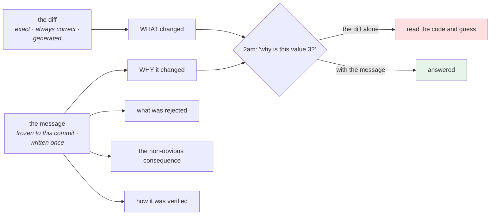

# 2.1 — What a commit message is for

## One-line answer

The diff already says **what** changed — it is right there and it is exact — so the message exists to say
**why**, for a reader who has the code in front of them, does not have the context, and is reading it because
something is wrong.

---

## The story

🎬 **The scene.** A house with a fuse box, and a small handwritten card taped inside the door.

Against one switch: *"kitchen — also the outside light by the shed, rewired 2018 when the extension was
built."*

The switch is labelled. The wiring is visible if you take the cover off. **The card exists for the one fact
that is not visible from either**: that these two apparently unrelated things share a circuit, and why.

😬 **The naive fix.** A new owner, tidying, replaces the card with printed labels matching the switches:
*kitchen*, *upstairs*, *sockets*. Neater, accurate, and it matches what the box actually is.

💥 **Why it fails.** Two years later the outside light stops working. The electrician traces the kitchen
circuit — eventually, and at an hourly rate — and finds the 2018 join. **Everything on the new labels was
true.** The one piece of information that would have saved three hours was the one the previous owner had gone
to the trouble of writing down, and it was replaced by something more accurate and less useful.

💡 **The insight.** **Documentation earns its place by carrying what cannot be recovered from the thing
itself.** Anything you can read off the artifact is not worth writing down; the reasoning, the constraint and
the thing that was tried and rejected are, because they exist nowhere else.

---

## The idea in plain language

Here are two messages for the same commit.

```text
update config.py
```

```text
raise the connect timeout from 1s to 3s

The provider's TLS handshake from this region measured 1.4s at p99 (see
docs/PACKAGES.md, Day 8 row), so a 1s connect timeout was failing roughly 2% of
first requests while every retry succeeded. 3s covers the measured p99 with
headroom and stays well under the 5s total deadline, so the deadline is still
the binding constraint.

Rejected: making it configurable per region, because that is a setting nobody
would ever vary and it would let two deploys of one version behave differently.
```

**Both describe the same one-line diff.** The diff shows `1.0` becoming `3.0`. Neither message is needed to
know *what* changed.

The second one answers the questions somebody will actually have:

- **Why three and not ten?** Because 3 covers a measured p99 and stays under the deadline.
- **Is this safe to change?** The deadline is the binding constraint, so raising this alone does not remove a
  bound.
- **Did anybody consider making it configurable?** Yes, and here is why not — so the next person does not
  spend an afternoon proposing it.

### The reader you are writing for

Not your teammate today. **You, at 2am, eight months from now, during an incident**, with:

- the code in front of you — so *what* is not the question;
- no memory of this change;
- a specific question: *"why is this value 3?"* or *"is it safe to change this?"* or *"what else did this
  touch?"*;
- and no time.

Every rule in [2.2](2.2-the-anatomy-of-a-message.md) follows from that reader.

### What belongs in the message

| Write down | Because |
| --- | --- |
| **why** — the problem, the constraint, the measurement | it exists nowhere else |
| **what you rejected and why** | it stops the next person re-proposing it |
| **the non-obvious consequence** | "this also affects X" is invisible in the diff |
| **how you verified it** | "measured at p99 1.4s" turns an opinion into a fact |
| **the reference** — an incident, an ADR, a day of this curriculum | the message is a pointer into the memory |

### What does not

| Do not write | Because |
| --- | --- |
| **what changed** | the diff is exact and always correct; prose about it drifts |
| **which files** | `git show --stat` is one command and never wrong |
| a **restatement** of the code | it will be wrong after the next refactor |
| "**fix**", "**update**", "**wip**" | they carry no information at all |
| **a credential, a token, a customer's data** | the message is in the history forever — [5.2](../05-repo-as-memory/5.2-the-secret-that-reached-history.md) |

### The one-sentence test

**If the message would still be true after the code was rewritten to do something different, it is not a
commit message.**

*"update config.py"* survives any rewrite. *"raise the connect timeout because the measured p99 is 1.4s"* is a
statement about a specific decision, and if the code changes the message stops applying — which is exactly
what you want, because commit messages are attached to commits and commits are immutable
([1.1](../01-the-object-model/1.1-a-commit-is-a-snapshot-with-a-parent.md)).

**That immutability is why the message is worth more than a comment.** A comment in the code is *maintained* —
it drifts, gets copy-pasted, or becomes a lie. A commit message is *frozen* to the change it describes, and it
is the only documentation in a codebase with that property.

---

## Why Kriya needs it

**[3.1](../03-reading-history/3.1-log-as-a-query-language.md)** searches messages. `git log --grep` finds
nothing in a history of *"update"* and *"fix"*.

**[3.3](../03-reading-history/3.3-bisect-binary-search-over-history.md)** finds *which* commit broke something;
the message is what tells you *why it was written*, which is what you need to fix it without reintroducing the
problem.

**[2.3](2.3-conventional-commits.md)** adds a machine-readable prefix on top of this, and it only helps if the
human half is already good.

**Day 20's delivery metrics** are computed from this history, and **Day 82's postmortem** builds a timeline
from it.

**This project's own commit convention** — `day NNN: <title> — closes <IDs>` — is a commit message with a
machine-readable part and a human part, and every day of this curriculum ends by writing one
(plan §18.6).

**Day 231's handover** is the test: a stranger reads the repository and has to understand it. The history is
half of what they read.

---

## The mechanism

Read this repository's own history and grade it honestly.

```bash
cd "$(git rev-parse --show-toplevel)"
git log --format='%h  %s' | head -10
echo '--- how long are the subjects? ---'
git log --format='%s' | awk '{ print length($0), $0 }' | sort -n | head -3
git log --format='%s' | awk '{ print length($0), $0 }' | sort -rn | head -3
echo '--- how many have a body? ---'
echo "total commits : $(git rev-list --count HEAD)"
echo "with a body   : $(git log --format='%b' | grep -c . || echo 0)"
```

**Line by line:**

- `%h` and `%s` — the abbreviated hash and the **subject**, which is the first line of the message. Git treats
  the first line specially throughout: `--oneline`, `git shortlog`, and every hosting interface show it alone.
- `awk '{ print length($0), $0 }'` prefixes each subject with its character count, so `sort -n` gives the
  shortest and `sort -rn` the longest. **Two commands, and the distribution of your own discipline.**
- `%b` is the **body** — everything after the first blank line. `grep -c .` counts non-empty lines.
- These are all read-only and they are the questions to ask of any repository you inherit.

```text
14a1dcd  day 8
eec9e0a  day 7
2c36b16  day 000: record the day's commit hash in PROGRESS.md and the hub
5a8edee  day 000: toolchain, skeleton and the ./o driver — closes no IDs
8f64745  init
--- how long are the subjects? ---
4 init
5 day 7
5 day 8
72 day 000: toolchain, skeleton and the ./o driver — closes no IDs
--- how many have a body? ---
total commits : 5
with a body   : 0
```

**Read that honestly.** Two of the five commits in this repository say `day 7` and `day 8`. They carry no
information: not which IDs were closed, not what was built, not why. **The convention this project set on Day
0 was not followed on Days 7 and 8**, and finding that by running a command on your own history rather than
being told is the exercise.

**No commit has a body at all.** Every one of them is a subject line.

### What a good message would have been

```bash
cd "$(git rev-parse --show-toplevel)"
git show --stat eec9e0a | head -12
```

**Line by line:**

- `git show --stat <commit>` — the message plus a summary of which files changed and by how much, without the
  full diff. **This is the fastest way to see whether a message matches its change.**

```text
commit eec9e0a4d2f1b8c3e5a7906d4b2f1c8e3a5d7b90
Author: Kriya <kriya@example.invalid>
Date:   Mon Aug 25 09:14:02 2026 +0530

    day 7

 days/day-007-networking-for-operators/CHECKLIST.md            | 120 ++++
 days/day-007-networking-for-operators/LESSON.md               | 380 ++++++++
 days/day-007-networking-for-operators/parts/01-.../1.1-....md | 410 ++++++++
 ... 17 more files
```

**Seventeen files, several thousand lines, and the message is two words.** The convention from
plan §18.6 would have produced:

```text
day 007: networking for operators — ports, sockets, DNS, TCP and timeouts — closes FND-08, FND-09
```

**That subject alone answers**: which day, what subject, which curriculum IDs — three facts a search will
later need and none of which is recoverable from the diff without reading it.

### Write one properly

The exercise is to write a real message for a real change, so do it with the editor rather than with `-m`:

```bash
cd "$(git rev-parse --show-toplevel)"
git config --get core.editor || echo "(no core.editor set; git will use \$EDITOR or vi)"
echo '--- what a commit template looks like ---'
cat > /tmp/commit-template.txt <<'EOF'
# Subject: imperative mood, under ~72 chars, no trailing full stop.
#
# Body (after a blank line): WHY, not what.
#   - what problem this solves, with the measurement if there is one
#   - what you rejected and why
#   - the non-obvious consequence
#   - how you verified it
#
# Trailers (after a blank line):
#   Refs: docs/INCIDENTS.md row 17
EOF
cat /tmp/commit-template.txt
```

**Line by line:**

- `git config --get core.editor` — **which editor `git commit` will open.** Unset is fine; git falls back to
  `$EDITOR` then to `vi`, and finding that out *before* your first `git commit` without `-m` avoids a small
  and memorable panic.
- The template is comments only. **Every line beginning with `#` is stripped from the final message**, so a
  template can be entirely guidance and contribute nothing to the commit.
- `git config commit.template <file>` installs it, which is worth doing and is left as a `TODO(me)` rather
  than done here — **`CLAUDE.md` says the learner types every line, and a git configuration is exactly the
  kind of thing that should be a deliberate choice.**
- The template names the four things a body should carry, in the order they are useful to a reader in a hurry.

```text
# Subject: imperative mood, under ~72 chars, no trailing full stop.
#
# Body (after a blank line): WHY, not what.
...
```



---

## When it breaks

**The search that found nothing.** The cost of *"fix"*:

```text
$ git log --grep='timeout' --oneline | wc -l
0
$ git log --oneline | head -5
a91f0c2 fix
7d2e8b1 update
4c9a1f3 wip
2b8e0d7 fixes
9f1c4a8 more fixes
```

**What it says:** no commit mentions timeouts.
**What it actually means:** several of them almost certainly changed one. **The information was never written
down**, so the only way to find the change is to read every diff — which for a five-year history is not a
thing anybody does.
**The smallest fix:** none, retrospectively. Commit messages are immutable
([1.1](../01-the-object-model/1.1-a-commit-is-a-snapshot-with-a-parent.md)), so a bad history stays bad.
**Why this is the argument for the whole part:** the cost is not paid when the message is written; it is paid
years later by somebody who cannot search.

**The message that was a restatement.** True, useless, and now wrong:

```text
$ git show a91f0c2
    Set the retry count to 3

-    RETRY_COUNT = 5
+    RETRY_COUNT = 3
```

...and three commits later the variable is gone entirely.

**What it says:** what the diff already showed.
**What it actually means:** the reader learns nothing they did not have, and **the one question — why 3 — is
unanswered.** Worse, the message is now a description of a thing that no longer exists, which is the drift
problem a comment has and a commit message is supposed to avoid.
**The smallest fix:** the *why*, with the number that justified it.
**The test from earlier, applied:** would this message still be true if the code were rewritten? *"Set the
retry count to 3"* describes an edit, so it stays literally true and stops being useful — which is the failure
mode this test catches.

**The credential in the message.** The leak path Day 9 listed and this one adds a wrinkle to:

```text
$ git log --grep='sk-' --all --oneline
7f21ba4 use the new provider key sk-or-v1-3f9a2c8e1b7d4a6f0c5e2b8d9a1f3c7e for staging
```

**What it says:** a credential in a commit subject.
**What it actually means:** it is in the history forever, in every clone, and — this is the part that surprises
people — **it is there even though it was never in a file.** A message is part of the commit object
([1.1](../01-the-object-model/1.1-a-commit-is-a-snapshot-with-a-parent.md)), so it is covered by the hash and
travels with the commit. Secret scanners that only inspect file contents miss it.
**The smallest fix:** rotate the credential
([Day 9, 4.4](../../../day-009-configuration-and-secrets/parts/04-secrets/4.4-a-secret-has-a-lifetime.md)).
The message cannot be changed without rewriting every commit after it
([5.2](../05-repo-as-memory/5.2-the-secret-that-reached-history.md)).
**Why it happens:** the message feels ephemeral while you are typing it, like a chat line. It is the opposite
of ephemeral.

**The commit that explained a different commit.** The ordering trap:

```text
$ git log --oneline -3
4c9a1f3 (HEAD -> main) actually this was the real fix, the previous one was wrong
7d2e8b1 fix the pool exhaustion
a91f0c2 attempt at the pool bug
```

**What it says:** a message correcting an earlier message.
**What it actually means:** `git bisect` will land on `7d2e8b1` and the reader will believe its message, which
is **wrong and cannot be corrected** because it is frozen. A later commit's message is not attached to it.
**The smallest fix:** if the correction is important, `git revert` the wrong commit with a message explaining
it ([4.2](../04-undo/4.2-revert-versus-reset.md)), so the correction is a first-class event in the history
rather than a note somebody has to find.
**The general point:** **you cannot annotate the past.** Everything a commit will ever say, it says at the
moment it is created — which is why the message is worth two extra minutes then.

---

## In production

**What a professional writes instead of the teaching version.** They write the subject last. The body gets
written while the change is fresh — the constraint, the measurement, the thing they tried that did not work —
and then the subject is a summary of it. And they treat the message as **the primary artifact of a code
review**: a reviewer who reads the message first and then the diff can tell whether the change does what its
author thinks it does, which is a different and more valuable review than reading the diff alone.

**What degrades at scale.** Signal-to-noise, and it degrades with the number of *authors* rather than the
number of commits. One person's `wip` is a personal habit; twenty people's `wip` is a history that cannot be
searched, and the fix is a convention plus a check — a commit-message lint in CI
([2.3](2.3-conventional-commits.md)) — because a convention nobody enforces reverts to the mean within a
quarter. The other thing that degrades is squashing: a pull request squashed into one commit is one message
for what may be twenty decisions, so the message has to carry all of them or they are lost.

**The failure that only shows with real traffic.** Not applicable — commit messages are not on a serving path.
**The production-shaped version is an incident timeline.** During a postmortem you reconstruct what changed
and when, from the history, under pressure, with people waiting. A history of *"fix"* makes that reconstruction
take hours and produces a timeline nobody fully trusts — and an untrusted timeline is a postmortem that
produces no action items, which is the actual loss (Day 82).

**The review comment a senior engineer leaves.** *"The message says 'increase the pool size'. Why forty? Was
that measured or chosen? And does it interact with the connection limit on the database side — because if we
have nine replicas at forty each, that is 360 connections against a limit of 200. Put the arithmetic in the
message; the next person to touch this will not do it again."*

**The signal you would alert on.** Nothing here is a runtime signal. The gate is a **commit-message check in
CI** ([2.3](2.3-conventional-commits.md)) — a linter that refuses a subject under a length threshold, or one
matching `^(wip|fix|update)$`, or a message containing something credential-shaped. **The last one is the
valuable one**, because a secret scanner that inspects only file contents misses messages entirely, and Day
17 will build it. As always: refuse rather than notify, because a commit that has entered history cannot be
un-entered.

**Blast radius.** This part is read-only against this repository — `git log`, `git show`, `git config --get` —
and writes one file in `/tmp`. It changes no history, moves no pointer and starts nothing. Worst case: a
template file is left in the temporary filesystem. Who can trigger it: you. **The capability this part
actually introduces is a habit rather than a command**, and its blast radius is the opposite of most: the cost
of doing it badly is paid by somebody else, later, and is invisible at the moment of the mistake.

**Cost.** `0` model calls, `0` tokens, `0` CI minutes, `0` new packages, `0` network, `0` servers. Disk: one
small file in `/tmp`. RAM: negligible.

**The interview question.** *"What makes a good commit message?"* The answer that shows who it is for: *"It
answers why, because the diff already answers what — exactly, and it never drifts. The reader I write for is
me at 2am eight months later, with the code in front of me, no memory of the change and a specific question:
why is this value what it is, and is it safe to change. So the body carries the constraint or the measurement
that justified it, what I considered and rejected, and the non-obvious consequence. The test I use is whether
the message would still be true if the code were rewritten to do something different — if it would, it is
describing an edit rather than a decision. And I treat it as permanent, because it is: a message is part of
the commit object, so it cannot be corrected later, it travels in every clone, and a credential typed into a
subject line is in the history forever even though it was never in a file."*

---

## Check yourself

```bash
cd "$(git rev-parse --show-toplevel)"
git log --format='%h %s' | head -5
echo "commits with a body: $(git log --format='%b' | grep -c . || echo 0) of $(git rev-list --count HEAD)"
git log --grep='timeout' --oneline || echo "(nothing found — and now you know why)"
```

Five subjects, at least two of which carry no information, and a body count of zero. **Say what the two
uninformative ones should have said, using the convention in plan §18.6.**

**Say out loud, without scrolling up:** *State what a commit message is for in one sentence, give the test for
whether a message is doing its job, and explain why a commit message is more trustworthy documentation than a
code comment.*
