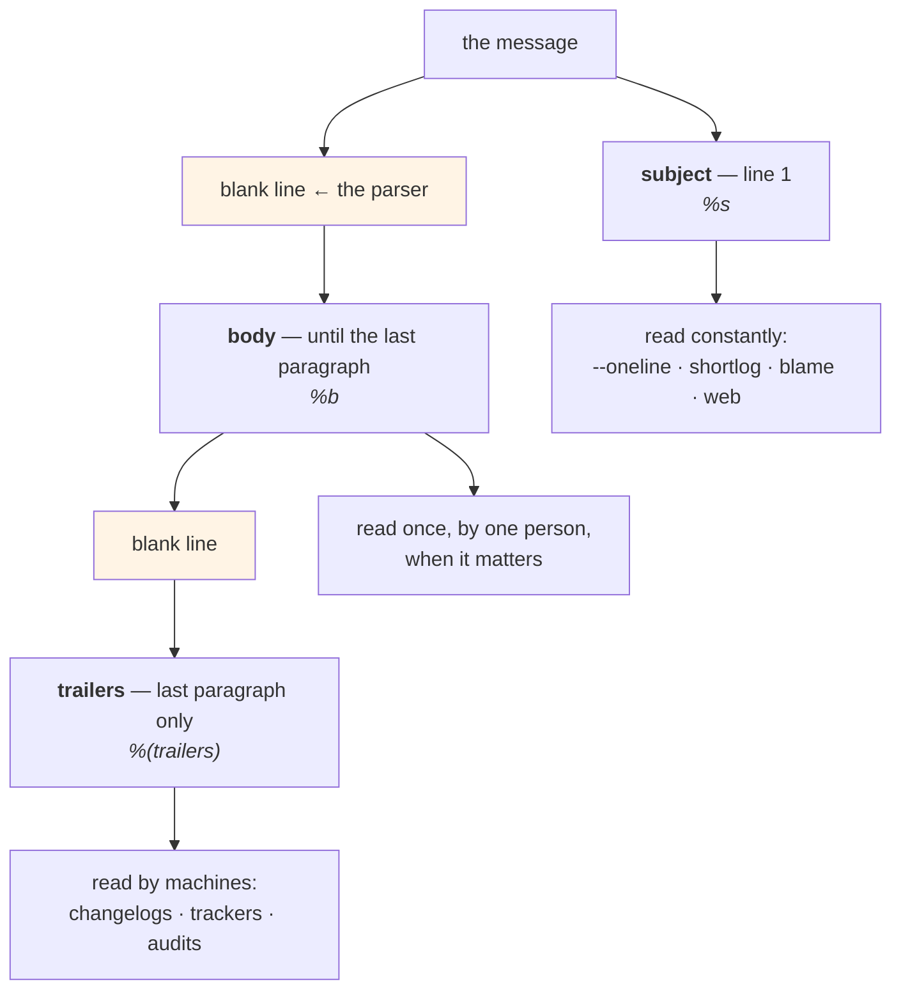

# 2.2 — The anatomy of a message: subject, body, trailers

## One-line answer

A commit message has three parts with three different readers — a **subject** that must stand alone in a list
of five hundred, a **body** separated by a blank line that explains the reasoning, and **trailers** at the end
that are `Key: value` lines machines read — and the blank line is load-bearing rather than stylistic.

---

## The story

🎬 **The scene.** A hospital discharge summary, which has a strict shape because three different people read
it and none of them reads all of it.

The **first line** is the diagnosis. The receptionist filing it reads only that.

The **paragraphs** are what happened, what was tried, what to watch for. The general practitioner reads those,
once, later, when the patient comes in with something else.

The **coded fields at the bottom** — the classification codes, the ward, the consultant — are read by nobody
at all. They are read by the system that counts things.

😬 **The naive fix.** A doctor in a hurry writes one long paragraph containing all of it, in prose. Everything
is there; it is accurate; it took less time.

💥 **Why it fails.** The receptionist has to read a paragraph to file one document, and does it four hundred
times a week. The general practitioner cannot find the "what to watch for" without reading the whole thing.
And the counting system finds nothing, so the ward's activity is under-reported for a year and its staffing is
cut.

**Nothing was omitted.** The information was all present and in the wrong shape for every one of its three
readers.

💡 **The insight.** **A document with several audiences needs a structure that lets each one stop reading.**
The structure is not decoration and it is not politeness — it is what makes the same document cheap for
somebody skimming, complete for somebody investigating, and parseable for something counting.

---

## The idea in plain language

```text
<subject: one line, imperative, ~50 chars, no full stop>
                                           ← a blank line. Not optional.
<body: why. wrapped at ~72 columns. as many paragraphs as it takes.>
                                           ← a blank line
<trailers: Key: value, one per line>
```

Three parts, three readers:

| Part | Read by | When |
| --- | --- | --- |
| **subject** | anybody scanning `git log --oneline`, `git shortlog`, a blame view, a hosting interface | constantly, hundreds at a time |
| **body** | one person, investigating one commit | rarely, and when it matters |
| **trailers** | tooling — changelog generators, issue trackers, `git interpret-trailers` | never by a human, always by a machine |

### The blank line is a real separator

**Git parses the message.** The first line is the **subject**, everything after the first blank line is the
**body**, and `%s` and `%b` in a format string return exactly those.

So a message with no blank line after the first line is a message that is *entirely subject* as far as every
tool is concerned — `git log --oneline` will print all of it, hosting interfaces will truncate it, and
`git shortlog` becomes unreadable. **The blank line is the only thing that tells git where the summary ends.**

### The subject line

Five rules, and each is about a specific reader:

| Rule | Why |
| --- | --- |
| **~50 characters**, hard limit ~72 | `git log --oneline` prefixes a hash; hosting interfaces truncate around 72 |
| **imperative mood** — "add", not "added" or "adds" | git's own generated messages are imperative ("Merge branch…", "Revert…"), so yours read consistently alongside them |
| **no trailing full stop** | it costs a character and adds nothing; the subject is a title, not a sentence |
| **capitalise or do not — but be consistent** | mixed capitalisation makes a log look like several projects |
| **say what the change *does*, not what you did** | "fix the pool exhaustion", not "I fixed the pool exhaustion" |

The imperative rule has a trick that makes it automatic: **the subject should complete the sentence "If
applied, this commit will …"**. *"If applied, this commit will raise the connect timeout to 3s."* ✅ *"If
applied, this commit will raised the timeout."* ❌

### The body

Wrapped at about 72 columns, **because git does not wrap it for you.** `git log` indents the body by four
spaces, so a body with 200-character lines is unreadable in a terminal and stays unreadable forever.

Content is [2.1](2.1-what-a-commit-message-is-for.md)'s list: why, what was rejected, the non-obvious
consequence, how it was verified.

### Trailers

`Key: value` lines at the end, separated from the body by a blank line. Git has first-class support for them —
`git interpret-trailers` parses and adds them, and `git log --format='%(trailers)'` reads them.

Common ones:

| Trailer | Means |
| --- | --- |
| `Refs: <issue or doc>` | related to, without closing |
| `Fixes: <issue>` | closes it (many trackers act on this) |
| `Co-authored-by: Name <email>` | attribution for pairing; hosting platforms render it |
| `Signed-off-by: Name <email>` | added by `git commit -s`; a project-specific assertion |
| `Reviewed-by:`, `Tested-by:` | who checked it |

**The value of a trailer is that it is machine-readable without a parser.** A changelog generator, an issue
tracker or a compliance report can extract them exactly; prose in the body cannot be extracted at all.

**This project's convention** (plan §18.6) puts its machine-readable part in the *subject* rather than in a
trailer — `day NNN: <title> — closes <IDs>` — because `scripts/trace.py` reads day hubs rather than commits.
**A convention is only useful if something reads it**, and choosing where the machine-readable part goes is a
choice about what the reader is.

---

## Why Kriya needs it

**[2.3](2.3-conventional-commits.md)** formalises the subject into a machine-parseable prefix, and it is
built on this shape.

**[3.1](../03-reading-history/3.1-log-as-a-query-language.md)** uses `%s`, `%b` and `%(trailers)` as separate
fields — which only works if the blank line is there.

**Day 16's changelog** is generated from these messages, and a changelog generator reads subjects and
trailers.

**Day 20's delivery metrics** parse the history; **Day 82's postmortem** reads it under pressure.

**Every day of this curriculum ends with a commit in this project's format**, so the shape is practised 237
times.

**Day 216's supply chain** work cares about `Signed-off-by:` and commit signing, which is a trailer and a
signature over the commit object
([1.1](../01-the-object-model/1.1-a-commit-is-a-snapshot-with-a-parent.md)).

---

## The mechanism

Build the three parts and watch git parse them. **Scratch repository.**

```bash
SCRATCH=$(mktemp -d)/anatomy && mkdir -p "$SCRATCH" && cd "$SCRATCH"
git init -q && git config user.email you@example.invalid && git config user.name You
printf 'x\n' > f.txt && git add f.txt

git commit -q -F - <<'MSG'
raise the connect timeout from 1s to 3s

The provider's TLS handshake from this region measured 1.4s at p99, so a 1s
connect timeout was failing roughly 2% of first requests while every retry
succeeded.

3s covers the measured p99 with headroom and stays under the 5s total deadline,
so the deadline remains the binding constraint.

Rejected: a per-region setting. Nobody would vary it, and it would let two
deploys of one version behave differently.

Refs: docs/INCIDENTS.md row 12
Co-authored-by: A Colleague <colleague@example.invalid>
MSG
git log -1
```

**Line by line:**

- `git commit -F -` reads the message **from standard input**, which is how you write a multi-paragraph
  message in a script or a document. `-m` can be repeated to make paragraphs, but it cannot express trailers
  cleanly and it makes the shape invisible.
- The heredoc is `<<'MSG'` — **quoted**, so `%` and `$` and backticks in the message are literal
  ([Day 9, 1.5](../../../day-009-configuration-and-secrets/parts/01-configuration/1.5-dotenv-is-a-developer-convenience.md)).
- **Subject, blank line, body paragraphs, blank line, trailers.** Count the blank lines in the heredoc: the
  one after the subject and the one before `Refs:` are the two that git treats as structural.
- The body is wrapped at about 72 columns by hand. **Nothing wraps it for you**, and `git log` will indent it
  four spaces on top of whatever width it has.
- `Refs:` and `Co-authored-by:` are trailers; the second is rendered by hosting platforms as an additional
  author, which is the clearest example of a machine reading one.

```text
commit 3f8a1c2e9d0b4756a2c8f1e0b9d374a6c5e2f8b1
Author: You <you@example.invalid>
Date:   Mon Aug 25 15:31:07 2026 +0530

    raise the connect timeout from 1s to 3s

    The provider's TLS handshake from this region measured 1.4s at p99, so a 1s
    connect timeout was failing roughly 2% of first requests while every retry
    succeeded.
    ...
    Refs: docs/INCIDENTS.md row 12
    Co-authored-by: A Colleague <colleague@example.invalid>
```

Now prove git is actually parsing it:

```bash
cd "$SCRATCH"
echo "--- subject (%s) ---";       git log -1 --format='%s'
echo "--- body (%b) — first line ---"; git log -1 --format='%b' | head -1
echo "--- trailers (%(trailers)) ---";  git log -1 --format='%(trailers)'
echo "--- just one trailer's value ---"
git log -1 --format='%(trailers:key=Refs,valueonly)'
echo "--- what --oneline shows ---"
git log --oneline
```

**Line by line:**

- `%s` returns **only** the first line, `%b` **only** what follows the first blank line. Those are two
  different fields, and they exist because the blank line does.
- `%(trailers)` extracts the trailer block. **Note that `Refs:` and `Co-authored-by:` are returned and the
  `Rejected:` paragraph is not** — even though it looks like a `Key: value` line — because trailers must be in
  the **last** paragraph. That is a real rule and a real trap.
- `%(trailers:key=Refs,valueonly)` — one trailer's value, with no key. **This is what a changelog generator or
  an audit script actually calls**, and knowing the syntax exists is the difference between parsing messages
  with a regular expression and asking git.
- `--oneline` shows the hash and `%s` only. **That is the subject's whole job**, seen.

```text
--- subject (%s) ---
raise the connect timeout from 1s to 3s
--- body (%b) — first line ---
The provider's TLS handshake from this region measured 1.4s at p99, so a 1s
--- trailers (%(trailers)) ---
Refs: docs/INCIDENTS.md row 12
Co-authored-by: A Colleague <colleague@example.invalid>
--- just one trailer's value ---
docs/INCIDENTS.md row 12
--- what --oneline shows ---
3f8a1c2 raise the connect timeout from 1s to 3s
```

### Break the blank line

The structural claim, tested:

```bash
cd "$SCRATCH"
printf 'y\n' > f.txt && git add f.txt
git commit -q -F - <<'MSG'
this message has no blank line after the subject
and this was meant to be the body but git cannot tell
MSG
echo "--- subject ---";  git log -1 --format='%s'
echo "--- body ---";     git log -1 --format='%b'
echo "(empty body above means git saw a two-line subject)"
echo "--- and in --oneline ---"
git log --oneline -1
```

**Line by line:**

- No blank line after the first line. **Everything else is identical.**
- `%s` will return the whole thing, and `%b` will return nothing.

```text
--- subject ---
this message has no blank line after the subject and this was meant to be the body but git cannot tell
--- body ---

(empty body above means git saw a two-line subject)
--- and in --oneline ---
9c1e4a7 this message has no blank line after the subject and this was meant to be the body but git cannot tell
```

**One hundred and three characters in `--oneline`.** Every tool that shows subjects will now show that, and
`%b` — the field a changelog generator reads — is empty. **The blank line is not a convention; it is the
parser.**

### Trailers in the wrong paragraph

```bash
cd "$SCRATCH"
printf 'z\n' > f.txt && git add f.txt
git commit -q -F - <<'MSG'
demonstrate a trailer that is not one

Refs: this-looks-like-a-trailer

But this paragraph comes after it, so the block above is body text.
MSG
echo "--- trailers ---"; git log -1 --format='%(trailers)'; echo "(nothing above = none found)"
echo "--- body ---";     git log -1 --format='%b' | head -2
```

**Line by line:**

- `Refs:` is formatted correctly and is **not** in the last paragraph, so git does not treat it as a trailer.
- This is the rule that catches people: **trailers are a property of position, not of syntax.**

```text
--- trailers ---
(nothing above = none found)
--- body ---
Refs: this-looks-like-a-trailer
```

Clean up:

```bash
cd /tmp && rm -rf "$SCRATCH"
```

**Line by line:**

- Leave the directory before deleting it — the same reason as
  [1.2](../01-the-object-model/1.2-the-three-trees.md).



---

## When it breaks

**The subject that filled the terminal.** The missing blank line, in a real log:

```text
$ git log --oneline -3
a91f0c2 fix the connection pool exhaustion that happened when the provider slowed down and we had forty concurrent requests against a pool of ten, see the incident
7d2e8b1 update deps
4c9a1f3 add /predict
```

**What it says:** one commit with an enormous subject.
**What it actually means:** somebody wrote a good explanation and put it on the first line. **The information
is present and the structure is not**, so `--oneline` is unusable, `git shortlog` produces a wall of text, and
`%b` — the field every tool reads for detail — is empty.
**The smallest fix:** a blank line after the first line. That is the entire fix.
**Why it cannot be fixed later:** the message is part of the commit
([1.1](../01-the-object-model/1.1-a-commit-is-a-snapshot-with-a-parent.md)); changing it means a new commit
and rewriting everything after it.

**The body nobody could read.** No wrapping:

```text
$ git log -1
commit a91f0c2...

    Raise the pool size to 40 because at forty concurrent requests against a pool of ten the queue depth exceeded the request timeout and clients saw 504s rather than slow responses, which the load balancer then retried, amplifying the load — see Day 8's connection pool part and the measurement in PACKAGES.md.
```

**What it says:** one very long line, indented.
**What it actually means:** `git log` indents the body by four spaces and **does not wrap it**, so in an
80-column terminal this is one line that scrolls off the right. In a 200-column terminal it is fine, which is
why the author did not notice.
**The smallest fix:** wrap at about 72 columns when writing. Most editors do it automatically for commit
messages if `core.editor` is set to one that knows the file type.
**Why 72 and not 80:** the four-space indent, plus room for a terminal that is exactly 80.

**The trailer that did nothing.** Position, not syntax:

```text
$ git log -1 --format='%(trailers:key=Fixes)'
$ # ...nothing, and the issue was not closed
```

**What it says:** no `Fixes:` trailer.
**What it actually means:** it was written, and then another paragraph was added after it — often by somebody
appending a note before committing. **Trailers must be the last paragraph.**
**The smallest fix:** move it to the end.
**Why the tracker's silence is the only symptom:** nothing errors. The issue simply stays open, and the person
who wrote the trailer believes it was handled.

**The template that was committed.** The comment rule, misunderstood:

```text
$ git log -1 --format='%B'
add the settings module

# Subject: imperative mood, under ~72 chars, no trailing full stop.
# Body: WHY, not what.
```

**What it says:** the template's guidance is in the commit.
**What it actually means:** the comment lines survived. Git strips lines beginning with `#` **when the message
comes from the editor** (`commit.cleanup` defaults to `strip` there) — but with `-F` or `-m` the default is
`whitespace`, which does **not** strip comments.
**The smallest fix:** `git commit --cleanup=strip -F <file>` when reading from a file, or use the editor.
**Why it is worth knowing:** it is the sort of default that differs by input method, and the failure is
permanent and cosmetic — the worst combination, because nobody will rewrite history to fix cosmetics.

---

## In production

**What a professional writes instead of the teaching version.** They set `commit.template` once so the shape
is in front of them every time, and they let the editor wrap. Trailers are used deliberately rather than
decoratively — a `Refs:` that points at an incident row or an ADR turns the history into a graph you can walk,
and that is the actual payoff: `git log --grep` plus a trailer convention means *"show me every change related
to incident 12"* is one command.

**What degrades at scale.** Consistency, and it goes first in the subject line. With twenty authors you get
imperative and past tense mixed, capitalised and lowercase mixed, some with prefixes and some without — and a
`git log --oneline` that is hard to scan is one nobody scans, which removes the subject line's entire reason
for existing. The fix is a **check in CI** ([2.3](2.3-conventional-commits.md)) rather than a style guide,
because a style guide nobody enforces reverts within a quarter.

**The failure that only shows with real traffic.** Not applicable — commit messages are not on a serving path.
**The production-shaped analogue is the release changelog.** A generator reads subjects and trailers; a
history with no blank lines and no trailers produces a changelog that is either empty or is the full text of
every message, and the first release where anybody notices is the one where a customer reads it.

**The review comment a senior engineer leaves.** *"Good body, but it is all on the subject line — add the blank
line so `--oneline` is usable and `%b` is populated, because our changelog generator reads `%b`. And the
`Fixes:` needs to move below the 'rejected' paragraph; trailers only count in the last block, so as written
the tracker will not close the issue."*

**The signal you would alert on.** Nothing here is a runtime signal. The gate is a **commit-message check**
([2.3](2.3-conventional-commits.md)) that refuses a subject over ~72 characters, a message whose second line is
not blank, and a message matching `^(wip|fix|update)$`. All three are mechanical, all three are cheap, and all
three catch a defect that **cannot be fixed after the commit enters history** — which is the recurring reason
this curriculum prefers gates to alerts.

**Blast radius.** This part creates commits, and every one of them is in a temporary repository created by
`mktemp -d` and deleted at the end. Nothing touches the Kriya repository's history; the only commands run
against it are none. Worst case: a scratch directory survives in the temporary filesystem. Who can trigger it:
you. **The genuinely irreversible thing in this part is the habit**, because a badly-shaped message is
permanent from the moment it is committed.

**Cost.** `0` model calls, `0` tokens, `0` CI minutes, `0` new packages, `0` network, `0` servers. Disk: a
scratch repository of a few kilobytes, deleted. RAM: negligible.

**The interview question.** *"What shape does a commit message have?"* The answer that shows the parser rather
than the etiquette: *"A subject line, a blank line, a body, a blank line, and trailers. The blank lines are
structural, not stylistic — git's `%s` returns the first line and `%b` returns everything after the first blank
line, so a message without one is entirely subject as far as every tool is concerned: `--oneline` prints a
hundred characters and the changelog generator reads an empty body. The subject is imperative and under about
seventy-two characters because it is the part that gets read hundreds at a time in a log or a blame view. And
trailers are position-sensitive, not just syntax — `Fixes:` only counts in the last paragraph, so appending a
note after it silently stops the tracker from closing the issue, with no error anywhere."*

---

## Check yourself

```bash
S=$(mktemp -d)/a && mkdir -p "$S" && cd "$S" && git init -q
git config user.email you@example.invalid && git config user.name You
printf 'x\n' > f.txt && git add f.txt
git commit -q -F - <<'MSG'
add the first file

Because a repository with no commits has no history to read.

Refs: day-011
MSG
git log -1 --format='SUBJECT=[%s]'
git log -1 --format='BODY=[%b]'
git log -1 --format='TRAILER=[%(trailers:key=Refs,valueonly)]'
cd /tmp && rm -rf "$S"
```

Three fields, each populated, each extracted by git rather than by a regular expression.

**Say out loud, without scrolling up:** *Name the three parts and who reads each, explain what the blank line
after the subject actually does, and give the rule that decides whether a `Key: value` line is a trailer.*
