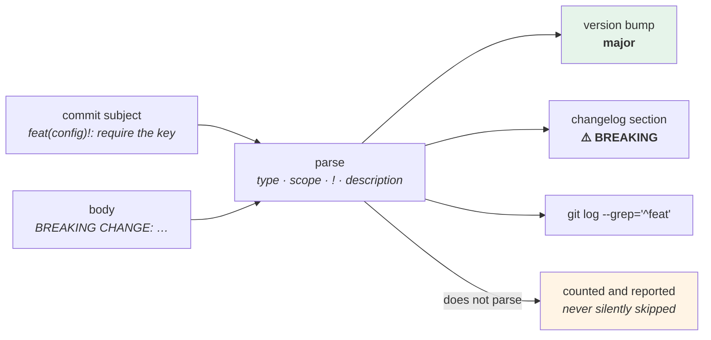

# 2.3 — Conventional Commits: the machine-readable half

## One-line answer

A small, fixed prefix on the subject line — `feat:`, `fix:`, `docs:`, and a `!` for a breaking change — lets a
machine read your history, which is what turns a changelog and a version number from something somebody writes
into something something computes.

---

## The story

🎬 **The scene.** A warehouse where every incoming pallet gets a coloured sticker: green for stock, yellow for
returns, red for damaged.

The stickers say nothing a human could not work out by looking. Their entire value is that a forklift driver
can sort a hundred pallets without opening any of them, and the stock system can count them from a scanner.

😬 **The naive fix.** A conscientious worker writes a full description on each pallet instead — *"twelve boxes
of assorted returns, two water-damaged, from the Leeds run"* — which is far more informative.

💥 **Why it fails.** Nothing can read it. The sorting takes four times as long because every pallet must be
read rather than glanced at, and the stock count now requires a person. **The descriptions are better and the
system is worse**, because the system was never reading for meaning — it was reading for a category.

And the two are not in competition: the sticker takes a second, and the description can go on the label
underneath it.

💡 **The insight.** **A tiny, fixed vocabulary at a fixed position is worth more to a machine than any amount
of accurate prose** — and it costs almost nothing, because it sits *in front of* the prose rather than instead
of it.

---

## The idea in plain language

**Conventional Commits** is a convention for the subject line. Verified against
`https://www.conventionalcommits.org/en/v1.0.0/`, fetched **2026-08-25** — the specification states the shape
as:

> *"The commit message should be structured as follows:*
>
> *`<type>[optional scope]: <description>`*
>
> *`[optional body]`*
>
> *`[optional footer(s)]`"*

and defines the two types that carry meaning:

> *"**fix:** a commit of the type `fix` patches a bug in your codebase (this correlates with PATCH in Semantic
> Versioning).*
> ***feat:** a commit of the type `feat` introduces a new feature to the codebase (this correlates with MINOR
> in Semantic Versioning).*
> ***BREAKING CHANGE:** a commit that has a footer `BREAKING CHANGE:`, or appends a `!` after the type/scope,
> introduces a breaking API change (correlating with MAJOR in Semantic Versioning)."*

And on the rest:

> *"types other than `fix:` and `feat:` are allowed, for example @commitlint/config-conventional (based on the
> Angular convention) recommends `build:`, `chore:`, `ci:`, `docs:`, `style:`, `refactor:`, `perf:`, `test:`,
> and others."*
>
> *"footers other than `BREAKING CHANGE: <description>` may be provided and follow a convention similar to git
> trailer format."*

**That last sentence connects it to [2.2](2.2-the-anatomy-of-a-message.md):** the "footers" are git trailers,
with the same position rule.

### What it buys you

Exactly three things, and it is worth being precise because the convention is often adopted for a fourth
reason that is not real:

| It buys | How |
| --- | --- |
| **a computed version number** | any `feat` → minor bump, any `fix` → patch, any `!` or `BREAKING CHANGE:` → major |
| **a generated changelog** | group by type, list the descriptions, highlight the breaking ones |
| **a filterable history** | `git log --grep='^feat'` is a real query |

What it does **not** buy: better messages. `fix: fix the thing` is conventional and useless. **The prefix is
orthogonal to whether the message is any good** — [2.1](2.1-what-a-commit-message-is-for.md) is still the
whole of the value, and this part is a label on top of it.

### The types worth having

The specification requires only `feat` and `fix`. Everything else is convention, and a **short** list is
better than a long one because a long one produces arguments about which applies:

| Type | For |
| --- | --- |
| `feat` | a new capability for the user of the system |
| `fix` | a defect corrected |
| `docs` | documentation only |
| `refactor` | behaviour unchanged, structure changed |
| `test` | tests only |
| `perf` | faster, behaviour unchanged |
| `build` | the build, dependencies, packaging |
| `ci` | the pipeline |
| `chore` | none of the above and not user-visible |

**`chore` is a trap.** It is the type people reach for when the change does not fit, and a history where a
third of the commits are `chore` has a taxonomy that is not working. **If you are reaching for it often, the
change probably is a `fix` or a `refactor` and you are avoiding the version bump.**

### The scope

`feat(api): …` — an optional parenthesised area. Useful in a repository with clear components; noise in one
without. **The test: could somebody reading the log filter by scope and get a useful subset?** If not, leave
it out.

### The breaking change, which is the one that matters

Two ways to mark it, and the specification allows both: a `!` after the type (`feat!:` or `feat(api)!:`) or a
`BREAKING CHANGE:` footer. **The footer is better** because it has room to say *what* broke and what to do
about it, and the `!` is a marker with no space for an explanation.

**This is the single highest-value part of the convention.** A missed feature is a version number that is
slightly wrong; a missed breaking change is a consumer that breaks on a patch upgrade they believed was safe.

### Where this project stands

Kriya's own convention is `day NNN: <title> — closes <IDs>` (plan §18.6), which is **not** Conventional
Commits. That is a deliberate mismatch worth naming rather than glossing over: this repository's commits are
one per day of curriculum rather than one per change to a product, its "version" is a day number rather than a
semantic version, and the machine-readable part it needs is the curriculum ID — which `scripts/trace.py` reads
from day hubs, not from commits.

**A convention is only worth having if something reads it.** Adopting Conventional Commits here would produce
a `feat:`/`chore:` split that nothing consumes. **Knowing the convention and knowing when it does not apply
are the same skill**, and Day 16 — which introduces semantic versioning for `pulse` — is where the trade
actually has to be made.

---

## Why Kriya needs it

**Day 16** gives `pulse` semantic versions, tags and a changelog. **This is the input to all three**: the
version bump and the changelog entries are computed from commit types, or they are written by hand and drift.

**Day 15's artifact** and **Day 16's release** need to know whether a change is breaking, and a `!` or a
`BREAKING CHANGE:` footer is the only place that fact is recorded in a machine-readable form.

**Day 14's quality gates** are where a commit-message linter belongs — a gate that refuses rather than warns.

**Day 20's delivery metrics** can distinguish a fix from a feature, which is what makes "change failure rate"
computable rather than estimated.

**Day 217's auditability** needs to answer *"which changes in this release were security fixes"*, and a type
plus a footer is how that question stops requiring a human.

---

## The mechanism

Write conventional commits, then compute a version and a changelog from them — because the convention is
pointless until something reads it.

```bash
SCRATCH=$(mktemp -d)/conv && mkdir -p "$SCRATCH" && cd "$SCRATCH"
git init -q && git config user.email you@example.invalid && git config user.name You

commit_as() { printf '%s\n' "$2" > f.txt; git add f.txt; git commit -q -F - <<<"$1"; }

commit_as "feat(api): add /predict returning a stubbed prediction" a
commit_as "fix(api): reject an empty subject with 422 instead of 500" b
commit_as "docs: explain the three trees" c
commit_as "chore: bump the linter" d
git commit -q --allow-empty -F - <<'MSG'
feat(config)!: require PULSE_MODEL_API_KEY

Every deploy must now supply the provider credential; the service refuses to
start without it.

BREAKING CHANGE: PULSE_MODEL_API_KEY has no default. Deploys that do not set it
will exit 78 at startup. Set it before upgrading.
MSG
git log --oneline
```

**Line by line:**

- `commit_as()` takes a message and a file content, so each commit is a real change rather than an empty one.
  `<<<"$1"` is a **here-string** — a one-line heredoc — feeding the message to `git commit -F -`.
- Four single-line messages and one with a body and a footer. **Only the last one is a breaking change**, and
  it is marked twice: `!` after the scope *and* a `BREAKING CHANGE:` footer with an explanation. The
  specification allows either; using both means a tool that reads only one still sees it.
- The `BREAKING CHANGE:` footer says **what to do** — *"Set it before upgrading"* — which is the whole reason
  the footer beats the `!`.
- `--allow-empty` on the last one only because the file content is unchanged; in real use it would carry the
  code change.

```text
6d2a8f0 feat(config)!: require PULSE_MODEL_API_KEY
1b7e4c9 chore: bump the linter
9e0c3a1 docs: explain the three trees
4c8b1f0 fix(api): reject an empty subject with 422 instead of 500
2f8b1c0 feat(api): add /predict returning a stubbed prediction
```

Now read them with a machine:

```python
# lab/semver_from_log.py - compute the next version and a changelog from commit types.
from __future__ import annotations

import re
import subprocess
import sys

# <type>[(scope)][!]: <description>   -- conventionalcommits.org/en/v1.0.0/, checked 2026-08-25
SUBJECT = re.compile(r"^(?P<type>[a-z]+)(?:\((?P<scope>[^)]+)\))?(?P<bang>!)?: (?P<desc>.+)$")


def commits(since: str | None) -> list[tuple[str, str]]:
    """(subject, body) for each commit, newest first."""
    span = [f"{since}..HEAD"] if since else []
    out = subprocess.run(
        ["git", "log", "--format=%s%x00%b%x01", *span],
        capture_output=True,
        text=True,
        check=True,
    ).stdout
    pairs = []
    for record in out.split("\x01"):
        record = record.strip("\n")
        if not record:
            continue
        subject, _, body = record.partition("\x00")
        pairs.append((subject, body))
    return pairs


def bump(current: tuple[int, int, int], entries: list[tuple[str, str]]) -> tuple[int, int, int]:
    major, minor, patch = current
    kinds = set()
    for subject, body in entries:
        match = SUBJECT.match(subject)
        if not match:
            kinds.add("unconventional")
            continue
        if match["bang"] or "BREAKING CHANGE:" in body:
            kinds.add("major")
        elif match["type"] == "feat":
            kinds.add("minor")
        elif match["type"] == "fix":
            kinds.add("patch")
    if "major" in kinds:
        return (major + 1, 0, 0)
    if "minor" in kinds:
        return (major, minor + 1, 0)
    if "patch" in kinds:
        return (major, minor, patch + 1)
    return current


def main() -> int:
    since = sys.argv[1] if len(sys.argv) > 1 else None
    entries = commits(since)
    unconventional = [s for s, _ in entries if not SUBJECT.match(s)]
    print(f"0.1.0 -> {'.'.join(map(str, bump((0, 1, 0), entries)))}")
    print(f"unconventional subjects: {len(unconventional)}")
    for subject in unconventional:
        print(f"  ! {subject}")
    return 0


if __name__ == "__main__":
    raise SystemExit(main())
```

**Line by line:**

- The regular expression is written from **the specification's own shape**, with the URL and the date next to
  it (Principle 8, and rule 1 of plan §17.4.1). `(?P<name>…)` are named groups, so `match["type"]` reads
  rather than `match.group(1)`.
- `--format=%s%x00%b%x01` — subject, a **NUL byte**, body, a **`\x01` byte**. Those two are chosen because
  they cannot appear in a commit message, so splitting on them is unambiguous. **Splitting log output on
  newlines is the classic bug**: bodies contain newlines.
- `check=True` on `subprocess.run` so a git failure raises rather than returning empty output that the rest of
  the function would happily process as "no commits" (Principle 10).
- `capture_output=True, text=True` — capture both streams and decode as text.
- `bump()` collects **kinds into a set** and then applies precedence once, rather than mutating the version as
  it goes. **Order matters**: a major bump zeroes the minor and patch, so applying bumps commit-by-commit
  gives a different and wrong answer.
- `match["bang"] or "BREAKING CHANGE:" in body` — **both** markers from the specification, because either is
  valid and a tool that checks only one will miss half of them.
- `"unconventional"` is collected and **reported**, not ignored. A version computed from a history where a
  third of the subjects do not parse is a version computed from a third of the history, and saying so is the
  difference between a tool and a guess.
- No dependency: `re` and `subprocess` are standard library. **A version calculator that needs a package to be
  installed is one that cannot run in a minimal build container** (Day 22).

```bash
cd "$SCRATCH"
uv run python semver_from_log.py
```

**Line by line:**

- No argument, so it reads the whole history — which is what you want on a first release and not on a later
  one.

```text
0.1.0 -> 1.0.0
unconventional subjects: 0
```

**A major bump**, computed, because one commit carried a `!` and a `BREAKING CHANGE:` footer. Nobody decided
`1.0.0`; the history did.

Now the changelog:

```bash
cd "$SCRATCH"
{
  echo "## Unreleased"
  echo
  for kind in feat fix perf docs; do
    body=$(git log --format='%s' | grep -E "^${kind}(\(|!|:)" | sed -E "s/^${kind}(\([^)]*\))?!?: /  - /")
    [ -n "$body" ] && { echo "### $kind"; echo "$body"; echo; }
  done
  breaking=$(git log --format='%h %s%n%b' | grep -A2 'BREAKING CHANGE:' | head -3)
  [ -n "$breaking" ] && { echo "### ⚠️ BREAKING"; echo "$breaking" | sed 's/^/  /'; }
} | tee CHANGELOG.md
```

**Line by line:**

- The whole block is wrapped in `{ … } | tee CHANGELOG.md` so **one redirection** captures everything and the
  output is also visible. `tee` writes to the file and to standard output.
- `grep -E "^${kind}(\(|!|:)"` matches the type at the start followed by a scope, a bang or a colon —
  the three things that can legally follow a type.
- `sed -E "s/^${kind}(\([^)]*\))?!?: /  - /"` strips the prefix and turns it into a list item. **The optional
  groups mirror the specification's optional parts**, which is why the pattern looks fussy.
- `[ -n "$body" ] && { … }` — only emit a section if it has entries. **An empty `### fix` heading in a
  changelog is worse than no heading**, because a reader takes it as "no fixes" rather than "no section".
- The breaking-change block is separate and marked, because it is the part a reader upgrading actually needs.
- **This is deliberately crude** — a real generator handles multi-line footers and multiple breaking changes.
  It is here to show that the convention is *readable*, and Day 16 adopts a proper tool.

```text
## Unreleased

### feat
  - add /predict returning a stubbed prediction
  - require PULSE_MODEL_API_KEY

### fix
  - reject an empty subject with 422 instead of 500

### docs
  - explain the three trees

### ⚠️ BREAKING
  6d2a8f0 feat(config)!: require PULSE_MODEL_API_KEY
  BREAKING CHANGE: PULSE_MODEL_API_KEY has no default. Deploys that do not set it
  will exit 78 at startup. Set it before upgrading.
```

**A changelog nobody wrote.** Note what is missing: `chore: bump the linter` does not appear, because a
changelog is for people who consume the software and a linter bump is not for them.

### The gate

```bash
cd "$SCRATCH"
cat > check_msg.sh <<'EOF'
set -u
MSG="${1:?usage: check_msg.sh <file-with-message>}"
SUBJECT=$(head -1 "$MSG")
SECOND=$(sed -n '2p' "$MSG")

fail() { echo "COMMIT MESSAGE REJECTED: $1" >&2; exit 1; }

echo "$SUBJECT" | grep -qE '^[a-z]+(\([a-z0-9._-]+\))?!?: .+' \
  || fail "subject must be '<type>[(scope)][!]: <description>' — got: $SUBJECT"
[ "${#SUBJECT}" -le 72 ] || fail "subject is ${#SUBJECT} characters; the limit is 72"
[ -z "$SECOND" ] || fail "line 2 must be blank (it is what separates subject from body)"
echo "$SUBJECT" | grep -qE '^(feat|fix|docs|refactor|test|perf|build|ci|chore)' \
  || fail "unknown type in: $SUBJECT"
echo "OK: $SUBJECT"
EOF

printf 'feat(api): add a health endpoint\n\nBecause the load balancer needs one.\n' > /tmp/good.txt
printf 'fixed the thing\n' > /tmp/bad1.txt
printf 'feat: a subject that is far too long and keeps going well past the seventy-two character limit\n' > /tmp/bad2.txt
printf 'feat: fine subject\nbut no blank line\n' > /tmp/bad3.txt

for f in /tmp/good.txt /tmp/bad1.txt /tmp/bad2.txt /tmp/bad3.txt; do
  printf '%-16s ' "$(basename "$f")"; bash check_msg.sh "$f" || true
done
```

**Line by line:**

- `"${1:?usage: …}"` — the message file is required. **A linter with a defaulted input passes vacuously**,
  which is the failure this curriculum has now met seven times.
- `head -1` and `sed -n '2p'` read the subject and the second line. **Checking that line 2 is blank is the
  cheapest possible enforcement of [2.2](2.2-the-anatomy-of-a-message.md)'s structural rule**, and it is the
  one that most often goes wrong.
- `${#SUBJECT}` is the string's length in the shell — no external command needed.
- The type check is a **separate test from the shape check**, so the error message can say *which* rule failed.
  One combined regular expression would produce one unhelpful message for four different mistakes.
- `fail()` writes to standard error and exits `1`. **The exit code is the interface**
  ([Day 4, 3.1](../../../day-004-linux-for-operators-i/parts/03-exit-codes/3.1-the-exit-code-is-the-whole-return-value.md)),
  and this script becomes a `commit-msg` hook or a CI step unchanged.
- `|| true` in the loop so one rejection does not stop the demonstration.
- **Four cases: one good and three bad, each failing a different rule.** A linter tested only against valid
  input is a linter you have not tested.

```text
good.txt         OK: feat(api): add a health endpoint
bad1.txt         COMMIT MESSAGE REJECTED: subject must be '<type>[(scope)][!]: <description>' — got: fixed the thing
bad2.txt         COMMIT MESSAGE REJECTED: subject is 94 characters; the limit is 72
bad3.txt         COMMIT MESSAGE REJECTED: line 2 must be blank (it is what separates subject from body)
```

```bash
cd /tmp && rm -rf "$SCRATCH" /tmp/good.txt /tmp/bad1.txt /tmp/bad2.txt /tmp/bad3.txt
```

**Line by line:**

- Leave the scratch directory before removing it, and clean up the four message files.



---

## When it breaks

**The breaking change that was a patch.** The failure the convention exists to prevent:

```text
$ npm install pulse-client@^1.2.0
$ # resolves to 1.2.4, which removed a field
TypeError: Cannot read property 'model_version' of undefined
```

**What it says:** a field is missing at runtime.
**What it actually means:** a commit removed a response field and was labelled `fix:`, so the release tooling
computed a **patch** bump — and a caret range accepts patches automatically. **Every consumer upgraded to a
breaking version without asking.**
**The smallest fix:** yank the release and republish as a major. The damage is already done for anybody who
upgraded.
**Why the type mattered more than the code review:** a reviewer looking at the diff sees a field removed and
may well approve it; the *version consequence* is only visible in the commit type, and that is the part nobody
reviews.

**The history where a third of the commits are `chore`.** The taxonomy that stopped working:

```text
$ git log --format='%s' | grep -oE '^[a-z]+' | sort | uniq -c | sort -rn
    412 chore
    189 feat
     97 fix
     41 docs
```

**What it says:** `chore` is the most common type.
**What it actually means:** people are using it to avoid choosing — and, more importantly, **to avoid
triggering a version bump.** Some of those 412 are fixes, so the version numbers understate what changed and
the changelog omits things consumers needed.
**The smallest fix:** a shorter type list, and a review question: *"would a consumer care about this?"* If
yes, it is a `feat` or a `fix`.
**Why a linter cannot catch it:** `chore: correct the retry logic` is perfectly conventional. **The convention
checks the shape and not the honesty**, which is its fundamental limit.

**The `BREAKING CHANGE:` that was not in the footer.** Position, again:

```text
$ git log -1 --format='%b'
BREAKING CHANGE: the API key is now required.

Also updated the docs to match.
```

**What it says:** a breaking-change note.
**What it actually means:** it is not the last paragraph, so a tool reading git trailers does not see it as a
footer — and the version bump is computed as minor. **The exact failure from
[2.2](2.2-the-anatomy-of-a-message.md), with a version number attached.**
**The smallest fix:** move it to the end, and use the `!` marker as well so that a footer-position mistake
does not cost you the bump.
**Why belt and braces is right here:** the two markers are redundant by design, and this is the one place in
this day where redundancy is worth the noise.

**The linter that ran too late.** The gate at the wrong point:

```text
$ git push
Enumerating objects: 47, done.
...
remote: ERROR: commit 7d2e8b1 has an invalid subject: 'wip'
remote: error: hook declined to update refs/heads/main
```

**What it says:** the push was refused because of a message twelve commits ago.
**What it actually means:** the check runs on the server, so the only fix is to **rewrite history** — an
interactive rebase across twelve commits, on a branch that may already be shared
([4.3](../04-undo/4.3-the-force-push-and-the-reflog.md)).
**The smallest fix:** run the same check as a local `commit-msg` hook, so it refuses at the moment the message
is written and the fix is retyping one line.
**The general principle, which recurs throughout this curriculum:** **a gate is cheapest at the earliest point
it can run.** The server-side check should still exist — a local hook can be skipped with `--no-verify` — but
it should almost never be the first thing that catches you.

---

## In production

**What a professional writes instead of the teaching version.** They use an existing linter and an existing
release tool rather than the two scripts above, because the parsing has edge cases — multiple breaking
changes, footers spanning lines, reverts — and a subtly wrong version calculator is worse than none. What they
keep from this part is the **decision about the type list** (short) and the **placement of the gate** (local
hook first, server-side as the backstop). And they treat the breaking-change marker as the one field that gets
real review attention, because it is the only field whose mistake reaches consumers automatically.

**What degrades at scale.** Honesty, not shape. A linter keeps the shape correct forever, and nothing keeps
the *type* correct — so the drift is toward whichever type triggers the least ceremony. In a team where a
major bump means a release meeting, breaking changes become `feat`; where `fix` gets fast-tracked, everything
becomes `fix`. **The convention's accuracy is a function of what each type costs you**, and if you find your
types are dishonest, look at the process attached to them before blaming the authors.

**The failure that only shows with real traffic.** Not applicable — commit messages are not on a serving path.
**The production-shaped version is a bad release**: a version number that understates a change, published,
consumed automatically by a caret range, and breaking somebody's deploy at their next build. The blast radius
is *"everybody who upgrades in the next week"* and there is no rollback — you can publish a new version, and
you cannot un-publish the one people already installed.

**The review comment a senior engineer leaves.** *"This is marked `fix:` and it removes a field from the
`/version` response, which is a breaking change for anything parsing it. That needs `!` and a
`BREAKING CHANGE:` footer saying what consumers must do — otherwise our release job computes a patch bump and
everybody on a caret range gets it without asking."*

**The signal you would alert on.** Nothing runtime. Two gates, in order of value: a **`commit-msg` hook**
locally that refuses a non-conforming subject, and a **server-side check** as the backstop for anybody who
skipped it. One dashboard, which is genuinely useful and rarely built: **the distribution of commit types over
time** — a rising `chore` fraction is the taxonomy going dishonest, and it is visible months before anybody
complains about the changelog. You would **not** alert on an individual bad message; you refuse it.

**Blast radius.** This part creates commits and writes files, all inside a temporary repository created by
`mktemp -d` and deleted at the end, plus four message files in `/tmp` that are removed. Nothing runs against
the Kriya repository. **The capability introduced — a check that can refuse a commit — has one dangerous
direction: refusing valid work.** A regular expression that is slightly too strict will reject a legitimate
message at the moment somebody is trying to commit a fix under pressure, and the escape hatch (`--no-verify`)
is one flag away, which is how a local hook stops being used at all. What bounds it: the four rules are
separately reported so a rejection says which one failed, and the type list is short enough to memorise. Who
can trigger it: every commit.

**Cost.** `0` model calls, `0` tokens, `0` CI minutes today (**it adds a step to Day 13's job**, which is not
zero and should be named), `0` new packages, `0` network. Disk: a scratch repository and four small files, all
deleted. RAM: negligible.

**The interview question.** *"Do you use Conventional Commits?"* The answer that shows judgement rather than
adoption: *"Where something reads them. The convention buys exactly three things — a computed version bump, a
generated changelog, and a filterable history — and if none of those is wired up, it is ceremony. Where I do
use it, the part that earns its place is the breaking-change marker, because that is the only field whose
mistake reaches consumers automatically: mislabel a breaking change as a fix and everybody on a caret range
upgrades into it without asking. Two things I watch for: `chore` growing as a fraction of the history, which
means people are avoiding whichever type costs them ceremony, and the `BREAKING CHANGE:` footer not being in
the last paragraph, which silently downgrades the bump. And I want the check as a local hook, because catching
it server-side means rewriting history to fix a typo."*

---

## Check yourself

```bash
S=$(mktemp -d)/c && mkdir -p "$S" && cd "$S" && git init -q
git config user.email you@example.invalid && git config user.name You
git commit -q --allow-empty -m "feat(api): add /predict"
git commit -q --allow-empty -F - <<'MSG'
feat(config)!: require the provider key

BREAKING CHANGE: set PULSE_MODEL_API_KEY before upgrading.
MSG
git log --format='%s' | grep -cE '^[a-z]+(\([a-z0-9._-]+\))?!?: .+'
git log --format='%s%n%b' | grep -c 'BREAKING CHANGE:'
cd /tmp && rm -rf "$S"
```

Two conforming subjects and one breaking-change footer — the three fields a release tool reads.

**Say out loud, without scrolling up:** *Name the three things Conventional Commits buys you, say which single
field matters most and why, and explain why `fix: fix the thing` is conventional and useless.*
