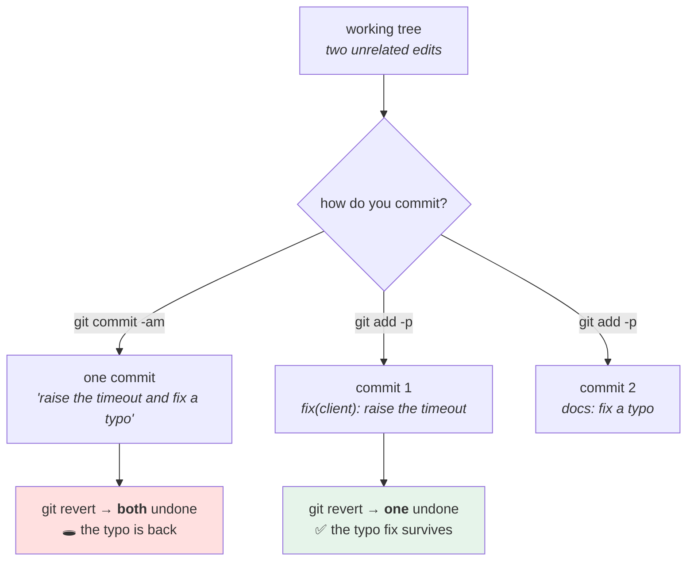

# 2.4 — One change per commit: the commit that cannot be reverted

## One-line answer

A commit containing two unrelated changes is a commit you cannot revert, cannot bisect through and cannot
describe in one sentence — so the size of a commit is not a style preference, it is **the size of the smallest
thing you can undo**.

---

## The story

🎬 **The scene.** A hardware shop that sells nails in small paper bags, weighed out at the counter.

A customer asks for a hundred 40mm nails and fifty brass screws. The shopkeeper weighs the nails into one bag
and the screws into another, and staples the receipt to a paper carrier.

😬 **The naive fix.** A younger assistant, saving time, tips both into one bag. Same items, same total, one
fewer bag.

💥 **Why it fails.** At home the customer finds the screws are the wrong gauge and comes back to exchange
them. The shopkeeper has to **separate a hundred and fifty mixed fasteners by hand**, or refund both, or
refuse.

None of those is what would have happened with two bags. And note where the cost landed: **not on the person
who saved the time.**

💡 **The insight.** **The cost of combining things is paid at the moment you need to undo one of them.** It is
zero when everything is fine, and everything is fine most of the time, which is exactly why the habit erodes.

---

## The idea in plain language

A commit is the **unit of undo**. Everything downstream inherits its granularity:

| Operation | Works on | So a mixed commit means |
| --- | --- | --- |
| `git revert` | one commit | you cannot undo the bad half without undoing the good half |
| `git bisect` | one commit | the culprit is "these two things together" and you must still read the diff |
| `git blame` | one commit | the line's history says "and also we upgraded the linter" |
| a code review | one commit | the reviewer holds two unrelated things in their head at once |
| a changelog entry | one commit | one line describing two things, or one of them omitted |

**Read the first row again.** [4.2](../04-undo/4.2-revert-versus-reset.md) will show that `git revert` is the
only safe undo on shared history — and it operates on a whole commit. So the granularity of your commits is
*literally* the granularity of your recovery options during an incident.

### The test

**Can you describe the commit in one sentence, without the word "and"?**

- *"raise the connect timeout to 3s"* ✅
- *"raise the connect timeout to 3s **and** fix the typo in the README"* ❌ — two commits
- *"add the settings module"* ✅
- *"add the settings module **and** update every caller"* — **this one is the interesting case**, and the
  answer is that it is *one* change, because the callers do not compile without it. **Anything that must move
  together belongs together.**

That third case gives the real rule, which is not "small":

**A commit should be the smallest change that leaves the repository working.**

Smaller than that is worse, not better: a commit that does not build is a commit `git bisect` cannot test
([3.3](../03-reading-history/3.3-bisect-binary-search-over-history.md)) and cannot be reverted to.

### Two failure directions

| Too big | Too small |
| --- | --- |
| cannot revert one half | does not build, so bisect skips it |
| review is two reviews | a change spread across six commits nobody can see whole |
| the message says "and" | the message says "part 3 of 5" |
| blame points at a mixed change | blame points at a commit that is meaningless alone |

**The common one is too big**, because it is what happens when you do nothing: a working tree accumulates
whatever you touched.

### The tool that fixes it

The index ([1.2](../01-the-object-model/1.2-the-three-trees.md)). A working tree with two changes in it is
normal and fine; **the index is where you take one of them.**

`git add -p` offers each hunk and asks. That is the whole technique, and it converts "I will remember to
commit separately next time" into a thing you do at the moment of committing, from whatever state your working
tree is actually in.

### The one that is genuinely hard

A refactor mixed with a behaviour change. *"Rename the function and, while I was there, fix the off-by-one."*

**This is the mixed commit that causes real incidents**, because the diff is large and mechanical and the
one substantive line is invisible in it. A reviewer scrolls past four hundred renamed lines and does not see
the changed comparison operator.

**The rule that survives contact with reality: a refactor commit changes no behaviour, and a behaviour commit
changes no names.** Then the review of each is possible: one is verified by the tests still passing, the other
is verified by reading four lines.

---

## Why Kriya needs it

**[4.2](../04-undo/4.2-revert-versus-reset.md)** is `git revert`, whose unit is the commit.

**[3.3](../03-reading-history/3.3-bisect-binary-search-over-history.md)** is `git bisect`, which requires every
commit to build and gives you a culprit whose usefulness is exactly its focus.

**[3.2](../03-reading-history/3.2-finding-the-change-that-introduced-a-line.md)** is `git blame`, which points
at a commit and expects it to explain a line.

**Day 12's review** is where a reviewer meets your commits, and **Day 19's rollback** is where an operator
does, at a much worse hour.

**Day 16's changelog** turns commits into entries, one per commit.

**Day 20's delivery metrics** count deployments and changes; a repository of enormous mixed commits reports a
low deployment frequency and a high change failure rate, and both numbers are artefacts of commit size rather
than of engineering quality.

---

## The mechanism

Make the mixed commit, feel the problem, then split it. **Scratch repository.**

```bash
SCRATCH=$(mktemp -d)/onechange && mkdir -p "$SCRATCH" && cd "$SCRATCH"
git init -q && git config user.email you@example.invalid && git config user.name You

cat > service.py <<'EOF'
TIMEOUT = 1.0
RETRIES = 3


def fetch(url: str) -> str:
    """Fetch a URL. See the README."""
    return f"{url} t={TIMEOUT} r={RETRIES}"
EOF
printf '# service\n\nA thing that fetchs data.\n' > README.md
git add . && git commit -q -m "feat: add the service"
git log --oneline
```

**Line by line:**

- Two files, so a later change can plausibly touch both. **The typo in the README (`fetchs`) is deliberate** —
  it is the unrelated fix that will get mixed in, which is exactly how it happens in real life.

```text
8c1f9a2 feat: add the service
```

Now make two unrelated changes, as you would while working:

```bash
cd "$SCRATCH"
sed -i 's/^TIMEOUT = 1.0$/TIMEOUT = 3.0/' service.py
sed -i 's/fetchs/fetches/' README.md
git status --short
git diff --stat
```

**Line by line:**

- One substantive change (the timeout) and one incidental one (the typo). **This is the normal state of a
  working tree** and neither edit is wrong.
- `git status --short` shows two modified files; `git diff --stat` shows the size of each.

```text
 M README.md
 M service.py
 README.md  | 2 +-
 service.py | 2 +-
 2 files changed, 2 insertions(+), 2 deletions(-)
```

**The mixed commit**, so the cost is felt rather than described:

```bash
cd "$SCRATCH"
git add . && git commit -q -m "fix: raise the timeout and fix a typo"
git log --oneline
echo '--- now revert just the timeout ---'
git revert --no-edit HEAD
git log --oneline
echo '--- what did the revert do to the README? ---'
cat README.md
```

**Line by line:**

- The message contains **"and"**, which is the test from earlier, failing.
- `git revert --no-edit HEAD` creates a **new commit that undoes** the named one
  ([4.2](../04-undo/4.2-revert-versus-reset.md)). `--no-edit` accepts the generated message rather than opening
  an editor.
- The last line is the point: **the revert undid both halves**, because a revert's unit is a commit.

```text
2d9e4b1 fix: raise the timeout and fix a typo
8c1f9a2 feat: add the service
--- now revert just the timeout ---
7a3c0f8 Revert "fix: raise the timeout and fix a typo"
2d9e4b1 fix: raise the timeout and fix a typo
8c1f9a2 feat: add the service
--- what did the revert do to the README? ---
# service

A thing that fetchs data.
```

**The typo is back.** You wanted to undo a timeout change and you have re-introduced a spelling mistake,
because there was no way to ask for half a commit. On a real change the "other half" is a bug fix somebody
needed.

### Splitting with the index

Reset and do it properly:

```bash
cd "$SCRATCH"
git reset --hard -q 8c1f9a2
sed -i 's/^TIMEOUT = 1.0$/TIMEOUT = 3.0/' service.py
sed -i 's/fetchs/fetches/' README.md

git add service.py
git commit -q -F - <<'MSG'
fix(client): raise the connect timeout from 1s to 3s

The measured p99 handshake from this region is 1.4s, so 1s was failing roughly
2% of first attempts while every retry succeeded. 3s covers the measurement and
stays under the 5s total deadline, which remains the binding constraint.
MSG

git add README.md
git commit -q -m "docs: fix a typo in the README"
git log --oneline
```

**Line by line:**

- `git reset --hard -q 8c1f9a2` returns to the state before the mixed commit. **Safe here because the scratch
  repository has nothing else in it**, and it is the command
  [1.2](../01-the-object-model/1.2-the-three-trees.md) warned about.
- `git add service.py` — **stage one file**, not `.`. The README edit stays in the working tree, in neither the
  index nor `HEAD`.
- Two commits, two messages, and **neither message contains "and"**.
- The order is deliberate: the substantive change first, the incidental one second. **A reviewer reading the
  log top-down meets the trivial one first and can skip it**, which is the small courtesy that makes people
  actually read reviews.

```text
4f8e2a0 docs: fix a typo in the README
1c7b9d3 fix(client): raise the connect timeout from 1s to 3s
8c1f9a2 feat: add the service
```

Now the revert works:

```bash
cd "$SCRATCH"
git revert --no-edit 1c7b9d3
grep '^TIMEOUT' service.py
cat README.md | tail -1
git log --oneline -2
```

**Line by line:**

- Reverting **one** commit by hash rather than `HEAD`, which is what an operator does during an incident: they
  know which change is suspected, not that it was the most recent.
- The two checks show the two halves independently: the timeout is back to `1.0` and the typo fix **survives**.

```text
TIMEOUT = 1.0
A thing that fetches data.
9b2d5c1 Revert "fix(client): raise the connect timeout from 1s to 3s"
4f8e2a0 docs: fix a typo in the README
```

**One undone, one kept.** That is the entire payoff, and it is only available because the commits were
separate.

### Splitting a single file with `git add -p`

The harder case, where both changes are in one file:

```bash
cd "$SCRATCH"
sed -i 's/^TIMEOUT = 1.0$/TIMEOUT = 3.0/; s/^RETRIES = 3$/RETRIES = 5/' service.py
git diff
echo '--- stage only the first hunk ---'
git add -p service.py <<'ANSWERS'
s
y
n
ANSWERS
git diff --cached
echo '--- and what is left unstaged ---'
git diff
```

**Line by line:**

- Two edits in **one file**, close together — so git presents them as a single hunk, which is the situation
  that defeats file-level staging.
- `git add -p` answers: **`s` splits** the hunk into smaller ones, then `y` takes the first and `n` skips the
  second. The `s` is the one people do not know exists, and it is what makes patch mode work on adjacent
  lines.
- `git diff --cached` shows what is staged (index versus `HEAD`); plain `git diff` shows what is not (working
  tree versus index). **The two questions from [1.2](../01-the-object-model/1.2-the-three-trees.md)**, used in
  anger.

```text
--- stage only the first hunk ---
--- and what is left unstaged ---
diff --git a/service.py b/service.py
@@ -1,2 +1,2 @@
-RETRIES = 3
+RETRIES = 5
```

**One edit staged, one still on disk.** Commit the first, then the second, and you have two commits from one
file.

```bash
cd "$SCRATCH"
git commit -q -m "fix(client): raise the connect timeout to 3s"
git commit -q -am "feat(client): raise the retry count to 5"
git log --oneline -2
cd /tmp && rm -rf "$SCRATCH"
```

**Line by line:**

- `git commit -am` stages **all tracked modifications** and commits — safe here because only one edit remains,
  and **dangerous as a habit** for exactly the reason this part is about: it is the command that produces
  mixed commits.



---

## When it breaks

**The revert that broke something else.** The failure demonstrated above, at 3am:

```text
$ git revert --no-edit a91f0c2
$ # ...and the deploy fails
ImportError: cannot import name 'get_settings' from 'pulse.config'
```

**What it says:** an import error after a revert.
**What it actually means:** the reverted commit contained the timeout change **and** a rename that later
commits depend on. Undoing it undid the rename, and everything written since is now broken.
**The smallest fix:** revert the revert, then fix forward with a targeted change — which is slower and is what
you actually do at 3am.
**Why this is the expensive version:** you discover it *after* deploying the revert, during the incident you
were trying to fix, and now there are two problems.

**The bisect that landed on a mixed commit.** The culprit that is not a culprit:

```text
$ git bisect run ./test.sh
a91f0c2 is the first bad commit
 47 files changed, 1204 insertions(+), 1189 deletions(-)
    refactor: rename the client module and fix the retry backoff
```

**What it says:** the culprit is found.
**What it actually means:** **you have narrowed a thousand-line change down to a thousand-line change.**
`bisect` did its job perfectly; the commit's size is what makes the answer useless, and the four-hundred
renamed lines hide the one real edit.
**The smallest fix:** read the diff and find the behaviour change among the renames — which is the work
`bisect` was supposed to save you.
**The rule this justifies:** **a refactor commit changes no behaviour and a behaviour commit changes no
names.** It is the single highest-value commit-hygiene rule there is, and it exists for this moment.

**The commit that did not build.** Too small, in the other direction:

```text
$ git bisect run ./test.sh
running ./test.sh
ImportError: cannot import name 'Settings'
$ # ... and bisect marks it bad, incorrectly
a91f0c2 is the first bad commit   # ...which is a commit that never built
```

**What it says:** a bad commit.
**What it actually means:** somebody split a change into "add the module" and "use it", and the first of those
does not import. **`bisect` cannot distinguish "broken by the bug being hunted" from "broken for an unrelated
reason"** and will report the wrong culprit.
**The smallest fix:** `git bisect skip` for commits that cannot be tested — and, properly, do not create them.
**Why "smallest change that leaves the repository working" is the actual rule:** smaller than that is not
tidier, it is a hole in the history that every historical tool falls into.

**The review that approved a hidden change.** The refactor trap, from the reviewer's side:

```text
 47 files changed, 1204 insertions(+), 1189 deletions(-)

-        if attempt < self.max_retries:
+        if attempt <= self.max_retries:
```

**What it says:** two characters, in a diff of two thousand four hundred lines.
**What it actually means:** an off-by-one that sends one extra request on every failure — which at scale is
Day 7's retry amplification
([Day 7, 5.2](../../../day-007-networking-for-operators/parts/05-the-two-together/5.2-retries-that-turn-a-blip-into-an-outage.md)).
**Nobody saw it**, and nobody was careless: a human reviewing twelve hundred mechanical lines does not find
two characters.
**The smallest fix:** two commits — the rename with a test suite that still passes, and the operator change on
its own where it is four lines and unmissable.
**Why this is the strongest argument in the part:** it is not about tidiness or reverting. **A mixed refactor
is a review-defeating construction**, and the defence is structural rather than a request for more care.

---

## In production

**What a professional writes instead of the teaching version.** They commit continuously while working and
then **reshape the history before sharing it** — an interactive rebase to split, squash and reorder into
commits that each do one thing and each build. That is `git rebase -i`, and it is safe precisely while the
branch is unshared ([4.3](../04-undo/4.3-the-force-push-and-the-reflog.md) is where it stops being). The habit
is: *messy while working, clean before review*, and the reason is not aesthetics — it is that the reviewer and
the future operator both get commits they can act on individually.

**What degrades at scale.** Review capacity, and it degrades faster than commit count. A reviewer's ability to
find a defect falls off sharply with diff size, so a repository whose average commit is large has reviews that
are approvals rather than reviews — and the tell is a comment culture that discusses naming rather than
behaviour, because naming is the only thing a human *can* review in twelve hundred lines. The counter-measure
is a limit somebody actually enforces on pull request size, and the objection to it ("this change is
genuinely big") is almost always a change that could have been three.

**The failure that only shows with real traffic.** The hidden two-character change above. A mixed refactor
passes review, passes tests — because the tests were written for the old behaviour and both `<` and `<=`
satisfy most of them — and produces one extra request per failure. At ten requests per second nobody notices.
During a dependency slowdown it is a retry storm, and the investigation looks at the dependency rather than at
a rename from three weeks earlier.

**The review comment a senior engineer leaves.** *"This is a rename plus a logic change. Please split it — put
the rename in one commit with no behaviour change so the test suite proves it, and the comparison-operator
change in its own commit where I can actually see it. Right now the substantive edit is two characters in
twelve hundred lines and I nearly approved it."*

**The signal you would alert on.** Nothing runtime. What is worth **measuring** and is rarely measured:
**commit and pull-request size distribution** — a dashboard, not an alert. A rising median diff size predicts
falling review quality months before anybody complains, and it is computable from the history you already
have. As a gate, a **pull-request size limit** with an explicit override is more effective than a guideline,
for the same reason every gate in this curriculum beats every convention: **the guideline reverts to the mean
and the gate does not.** You would not gate on individual commit size, because a legitimate large commit
exists (a generated file, a vendored dependency) and a hard limit there produces the `--no-verify` habit.

**Blast radius.** This part runs `git reset --hard`, `git revert` and `git add -p` — commands that move
pointers, create commits and discard working-tree state — entirely inside a temporary repository created by
`mktemp -d` and deleted at the end. Nothing runs against the Kriya repository. Worst case: a scratch directory
survives. Who can trigger it: you. **The habit this part teaches has the opposite blast-radius shape from most
of this curriculum: doing it badly costs nothing today and costs somebody else a bad hour months later**,
which is precisely why it erodes without a gate.

**Cost.** `0` model calls, `0` tokens, `0` CI minutes, `0` new packages, `0` network, `0` servers. Disk: a
scratch repository of a few kilobytes, deleted. RAM: negligible.

**The interview question.** *"How big should a commit be?"* The answer that gives a rule rather than a
preference: *"The smallest change that leaves the repository working. Not simply small — a commit that does
not build is one `bisect` cannot test and one you cannot revert to, so anything that must move together belongs
together. The reason it is not a style question is that the commit is the unit of undo: `git revert` operates
on a whole commit, so a commit containing a timeout change and a typo fix means undoing the timeout
reintroduces the typo — and on a real change the other half is something somebody needs. The specific rule I
push hardest is that a refactor commit changes no behaviour and a behaviour commit changes no names, because a
mixed refactor is review-defeating: nobody finds a two-character logic change in twelve hundred renamed lines,
and that is not carelessness, it is what a large diff does to a human."*

---

## Check yourself

```bash
S=$(mktemp -d)/o && mkdir -p "$S" && cd "$S" && git init -q
git config user.email you@example.invalid && git config user.name You
printf 'A = 1\n' > a.py && printf 'hello\n' > b.md && git add . && git commit -q -m "feat: add both"
sed -i 's/A = 1/A = 2/' a.py && sed -i 's/hello/hello world/' b.md
git add a.py && git commit -q -m "fix: change A to 2"
git add b.md && git commit -q -m "docs: expand b"
git revert --no-edit HEAD~1
grep '^A' a.py; cat b.md
cd /tmp && rm -rf "$S"
```

`A = 1` restored and `hello world` kept — **one change undone, one preserved**, which the mixed version cannot
do.

**Say out loud, without scrolling up:** *Give the rule for commit size in one sentence, explain why "as small
as possible" is wrong, and state the refactor rule and the specific review failure it prevents.*
