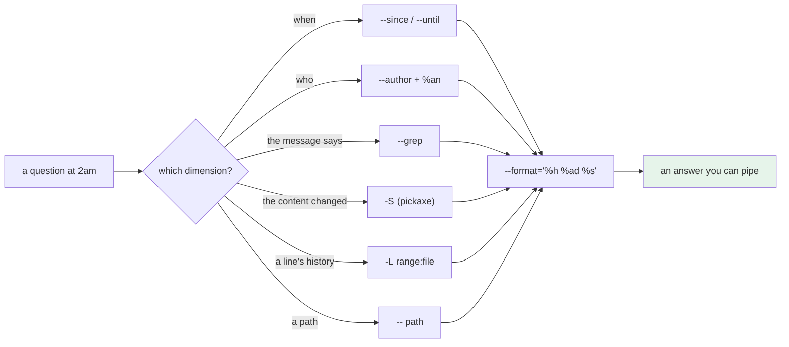

# 3.1 — `git log` as a query language

## One-line answer

`git log` is not a listing — it is a **query over the commit graph** with filters for time, author, message,
path and content, and a format string that makes the answer scriptable, which is the difference between
scrolling and asking.

---

## The story

🎬 **The scene.** A newspaper archive: a hundred and forty years of editions in a basement, and a woman at a
desk with a card index.

A researcher wants every article mentioning a particular bridge. Without the index, that is a hundred and
forty years of newsprint and a lifetime.

The index has cards by subject, by date, by author and by place. The answer takes eleven minutes.

😬 **The naive fix.** A new researcher, told the archive is complete and searchable, starts at 1884 and reads
forward. They are being thorough.

💥 **Why it fails.** They find things — that is the cruel part. Three weeks in they have twenty articles and
genuine progress, and no idea that the answer was forty-one articles and that seven of them are in years they
will not reach until March.

**Nobody told them the index existed**, and the reading approach produces enough results to feel like it is
working.

💡 **The insight.** **The difference between an archive and a searchable archive is not the contents — it is
knowing which questions it can be asked.** And the failure mode of not knowing is not "no answer"; it is a
partial answer that looks complete.

---

## The idea in plain language

Almost everybody uses `git log` in one of two ways: bare, and scrolling; or `--oneline`, and scrolling
faster. **Both are reading the archive front to back.**

It takes filters, and they compose:

| Filter | Asks |
| --- | --- |
| `--since=` / `--until=` | when |
| `--author=` | who |
| `--grep=` | what the **message** says |
| `-S<string>` | which commit changed the **number of occurrences** of a string in the content |
| `-G<regex>` | which commit's **diff** matches a pattern |
| `-- <path>` | which commits touched a path |
| `-L <range>:<file>` | the history of a **specific range of lines** |
| `--merges` / `--no-merges` | merge commits, or only real work |
| `--all` | every branch and tag, not just the current one |

And a format string that turns the answer into data:

| Placeholder | Is |
| --- | --- |
| `%H` / `%h` | the full / abbreviated hash |
| `%s` / `%b` | subject / body ([2.2](../02-the-message/2.2-the-anatomy-of-a-message.md)) |
| `%an` / `%ae` | author name / email |
| `%ad` / `%cd` | author date / committer date |
| `%at` / `%ct` | those as Unix timestamps — the ones you can do arithmetic on |
| `%d` | ref names pointing here |
| `%(trailers:key=X,valueonly)` | one trailer's value |

### The two that matter most, and are least known

**`-S<string>` — the "pickaxe".** It finds commits where the *number of occurrences* of a string changed. Not
commits that mention it in the message; not commits whose diff happens to contain a line with it — commits
that **introduced or removed** it.

That is the query for *"when did this value appear?"* and *"when did this function get deleted?"*, and it
searches content rather than messages, so **it works on a history of terrible commit messages**
([2.1](../02-the-message/2.1-what-a-commit-message-is-for.md)).

**`-L <start>,<end>:<file>` — the history of some lines.** It follows a specific range of lines backwards
through the history, showing every commit that changed them, **through renames and moves.** It is `git blame`
for a region rather than a line, and it answers *"how did this function get like this?"* in one command.

### The one that is a trap

**`--` before a path.** `git log -- pulse/config.py` restricts to commits touching that path — and the `--` is
what tells git the argument is a path rather than a revision. Without it, a path that happens to also be a
valid ref name is ambiguous, and git will either guess or refuse.

**Always use `--`.** It costs three characters and removes a class of confusing error.

### Why an operator cares

The questions you ask during an incident are all queries:

- *"What changed in the last day?"* — `--since`
- *"Who last touched this file?"* — `-- <path>` with `%an`
- *"When did this configuration value change from 3 to 30?"* — `-S`
- *"How did this function get like this?"* — `-L`
- *"Was this fix ever merged into the release branch?"* — `--all` plus `--grep`

**Every one of those, done by scrolling, takes minutes and gives an answer you are not sure of.**

---

## Why Kriya needs it

**[3.2](3.2-finding-the-change-that-introduced-a-line.md)** goes deep on `-S`, `-G`, `-L` and `blame`.

**[3.3](3.3-bisect-binary-search-over-history.md)** is what you use when no query finds it and you have to
search by testing.

**[5.2](../05-repo-as-memory/5.2-the-secret-that-reached-history.md)** uses `-S` to find a credential — the
same query, in an incident.

**Day 9 and Day 10 already used it**: `git log --all -S 'sk-'` to check for credentials
([Day 9, 1.1](../../../day-009-configuration-and-secrets/parts/01-configuration/1.1-what-configuration-actually-is.md)),
and `git log --format='%at'` to compute the time gap
([Day 10, 1.3](../../../day-010-environments-and-promotion/parts/01-what-an-environment-is/1.3-dev-prod-parity-and-the-three-gaps.md)).
**Both were used before being explained**, and this is where the explanation lands.

**Day 20** computes the four delivery metrics from this repository's history, entirely with format strings.

**Day 82's postmortem** builds an incident timeline, and **Day 217's audit** answers *"what changed between
these two releases and who approved it"* — which is a query, or it is a week.

---

## The mechanism

Every command here is read-only, against this repository.

**Start with the format string**, because it is what turns output into data:

```bash
cd "$(git rev-parse --show-toplevel)"
git log --format='%h | %ad | %an | %s' --date=short
```

**Line by line:**

- `--format='...'` accepts arbitrary text with `%` placeholders. **Anything not a placeholder is printed
  literally**, which is how you produce a delimiter.
- `--date=short` gives `YYYY-MM-DD` instead of the default long form. Other useful values: `iso` (full ISO
  8601), `relative` ("3 days ago"), `unix` (a timestamp).
- The `|` separator is chosen because commit subjects rarely contain it. **For anything scripted, use `%x00`
  instead** — a NUL byte, which cannot appear in a message
  ([2.3](../02-the-message/2.3-conventional-commits.md)).

```text
14a1dcd | 2026-08-25 | aignishant | day 8
eec9e0a | 2026-08-25 | aignishant | day 7
2c36b16 | 2026-08-24 | aignishant | day 000: record the day's commit hash in PROGRESS.md and the hub
5a8edee | 2026-08-24 | aignishant | day 000: toolchain, skeleton and the ./o driver — closes no IDs
8f64745 | 2026-08-24 | aignishant | init
```

**Filter by time and by path:**

```bash
cd "$(git rev-parse --show-toplevel)"
echo '--- what changed in the last 2 days ---'
git log --since='2 days ago' --format='%h %s'
echo '--- which commits touched the master plan ---'
git log --format='%h %s' -- docs/00_MASTER_PLAN.md
echo '--- which commits touched anything under days/day-008 ---'
git log --format='%h %s' -- 'days/day-008*'
echo '--- how many files did each commit touch ---'
git log --format='%h %s' --shortstat | grep -E '^[0-9a-f]{7} |files? changed'
```

**Line by line:**

- `--since='2 days ago'` accepts human phrases as well as dates. It filters on the **committer** date by
  default, which is the right one for *"what arrived recently"*
  ([Day 10, 2.1](../../../day-010-environments-and-promotion/parts/02-promotion/2.1-build-once-promote-the-artifact.md)
  made the same author-versus-committer distinction).
- `-- docs/00_MASTER_PLAN.md` — the path filter, with `--`. **Note that it does not have to be at the end**,
  but putting it there is the convention and reads clearly.
- `'days/day-008*'` in **single quotes** so the shell does not expand the glob before git sees it. Git does
  its own path matching against the history, which includes files that no longer exist — a shell glob only
  matches what is on disk *now*, which is the wrong set.
- `--shortstat` appends a summary line per commit. The `grep -E` interleaves the commit line and its stat line
  and drops the blank ones.

```text
--- what changed in the last 2 days ---
14a1dcd day 8
eec9e0a day 7
2c36b16 day 000: record the day's commit hash in PROGRESS.md and the hub
--- which commits touched the master plan ---
8f64745 init
--- which commits touched anything under days/day-008 ---
14a1dcd day 8
--- how many files did each commit touch ---
14a1dcd day 8
 21 files changed, 5842 insertions(+)
eec9e0a day 7
 18 files changed, 4901 insertions(+)
```

**Search the content, not the message** — the pickaxe:

```bash
cd "$(git rev-parse --show-toplevel)"
echo '--- which commit introduced the string "link-mode" ---'
git log --all -S 'link-mode' --format='%h %ad %s' --date=short
echo '--- and show what it did ---'
git log --all -S 'link-mode' -p --format='%h %s' -- pyproject.toml | head -20
echo '--- which commits diff contains something matching a regex ---'
git log --all -G 'PULSE_[A-Z_]+' --format='%h %s'
```

**Line by line:**

- `-S 'link-mode'` finds commits where the **count** of that string changed. A commit that moved the line
  without changing the count does **not** match — which is the difference from a naive search and is usually
  what you want.
- `--all` searches every branch and tag. **Without it you search only the current branch**, and a value
  introduced on a branch that was merged is still findable, while one on an abandoned branch is not.
- `-p` shows the patch. Combined with `-S` and a path, it is the answer to *"show me the change that
  introduced this"* in one command.
- `-G 'PULSE_[A-Z_]+'` matches the **diff text** against a regular expression — so it finds commits whose diff
  mentions the pattern even when the count did not change. **`-S` is "when did this appear or disappear";
  `-G` is "when did a line about this change".** They answer different questions and people reach for the
  wrong one.

```text
--- which commit introduced the string "link-mode" ---
5a8edee 2026-08-24 day 000: toolchain, skeleton and the ./o driver — closes no IDs
--- and show what it did ---
5a8edee day 000: toolchain, skeleton and the ./o driver — closes no IDs
+# uv installs by hardlinking from its cache into .venv, which is fast and costs no extra disk.
+link-mode = "copy"
--- which commits diff contains something matching a regex ---
14a1dcd day 8
```

**One commit, one line, and the comment that explains it** — which is the payoff of `CLAUDE.md`'s rule that
`link-mode = "copy"` stays: the reason is one query away.

**The history of specific lines:**

```bash
cd "$(git rev-parse --show-toplevel)"
git log -L '/^link-mode/,+1:pyproject.toml' --format='%h %ad %s' --date=short | head -20
```

**Line by line:**

- `-L <start>,<end>:<file>` takes a line range. `/^link-mode/` is a **regular expression form** of the start
  — "the first line matching this" — which is far more robust than a line number, because line numbers move.
- `,+1` means "and one line after". `,+0` would be that line alone.
- **`-L` implies `-p`**: it always shows the diff of those lines, because showing which commits touched a line
  without showing what they did would be useless.
- `-L` **follows the lines through renames and moves**, which is the thing that makes it better than
  `git blame` for a question about a region.

```text
5a8edee 2026-08-24 day 000: toolchain, skeleton and the ./o driver — closes no IDs
diff --git a/pyproject.toml b/pyproject.toml
--- /dev/null
+++ b/pyproject.toml
@@ -0,0 +1,1 @@
+link-mode = "copy"
```

**Turn a query into an answer:**

```bash
cd "$(git rev-parse --show-toplevel)"
echo '--- commits per author ---'
git shortlog -sn --all
echo '--- commits per day ---'
git log --format='%ad' --date=short | sort | uniq -c
echo '--- which files change most often ---'
git log --format='' --name-only | grep -v '^$' | sort | uniq -c | sort -rn | head -5
```

**Line by line:**

- `git shortlog -sn` — **`-s` summary (counts only), `-n` sorted numerically.** It is the standard "who has
  contributed what" command and it reads the same history as `git log`.
- `git log --format='%ad' --date=short | sort | uniq -c` — commits per day, from two commands. **This is Day
  20's deployment-frequency metric**, computed nine days early.
- `--format=''` with `--name-only` prints **only** the file names, with a blank line per commit; the `grep -v
  '^$'` removes those, and `sort | uniq -c | sort -rn` ranks them. **The files that change most often are the
  files to look at first during an incident**, and this is the cheapest possible way to find them.

```text
--- commits per author ---
     5  aignishant
--- commits per day ---
      3 2026-08-24
      2 2026-08-25
--- which files change most often ---
      2 docs/PROGRESS.md
      1 pyproject.toml
      1 uv.lock
```



---

## When it breaks

**The path that was taken as a revision.** The missing `--`:

```text
$ git log main
$ # ...the whole history of the branch, not the file called 'main'
$ git log config.py
fatal: ambiguous argument 'config.py': unknown revision or path not in the working tree.
Use '--' to separate paths from revisions, like this:
'git <command> [<revision>...] -- [<path>...]'
```

**What it says:** two different behaviours from the same shape of command.
**What it actually means:** git resolves the argument as a revision first. `main` is a valid ref so it wins;
`config.py` is not, so git checks whether it is a path in the working tree — and if the file has been deleted,
**it is neither**, and you get the error even though the history contains it.
**The smallest fix:** `git log -- config.py`.
**Why the deleted-file case is the one that catches you:** you are usually asking about a file's history
*because* it is gone, which is exactly when the shortcut stops working.

**The search that missed the branch.** No `--all`:

```text
$ git log -S 'sk-or-v1' --oneline
$ # ...nothing
$ git log --all -S 'sk-or-v1' --oneline
7f21ba4 wip: try the provider
```

**What it says:** nothing, then something.
**What it actually means:** the commit is on a branch that was never merged into the current one. **`git log`
walks back from `HEAD`**, so anything on a divergent or abandoned branch is invisible.
**The smallest fix:** `--all`, always, for any question of the form *"has this ever…"*.
**Why it matters most for credentials:** an abandoned experiment branch is precisely where a hard-coded key
lives, and it is still in every clone
([5.2](../05-repo-as-memory/5.2-the-secret-that-reached-history.md)).

**The pickaxe that found nothing because the count did not change.** The `-S` versus `-G` distinction:

```text
$ git log -S 'TIMEOUT' --oneline -- service.py
$ # ...nothing, even though the value changed from 1.0 to 3.0
$ git log -G 'TIMEOUT' --oneline -- service.py
a91f0c2 raise the timeout
```

**What it says:** `-S` found nothing and `-G` found the commit.
**What it actually means:** the commit changed `TIMEOUT = 1.0` to `TIMEOUT = 3.0`. The string `TIMEOUT`
appears once before and once after, so **the count is unchanged** and `-S` correctly does not match.
**The smallest fix:** search for the thing that actually changed — `-S '1.0'` — or use `-G`.
**The rule to remember:** **`-S` is for existence and `-G` is for modification.** *"When was this added or
removed"* is `-S`; *"when was a line about this touched"* is `-G`.

**The date filter that used the wrong date.** Author versus committer:

```text
$ git log --since='1 day ago' --oneline | wc -l
0
$ git log --since='1 day ago' --format='%h %ad %cd' --date=short
$ # ...and yet a rebase yesterday brought in 40 commits
```

**What it says:** nothing in the last day.
**What it actually means:** `--since` filters on the **committer** date by default in most configurations, but
`%ad` shows the **author** date, and a rebase rewrites committer dates while preserving author dates. A commit
written in March and rebased yesterday has an author date of March.
**The smallest fix:** be explicit about which date you mean, and show both when it matters — `%ad` and `%cd`
side by side.
**Why this bites in an incident:** *"what changed recently"* is an author-date question in people's heads and
a committer-date question in the history, and after any rebase the two disagree by months.

---

## In production

**What a professional writes instead of the teaching version.** They keep four or five of these as shell
aliases and reach for them without thinking — a formatted log, a path query, a pickaxe, and `-L`. The thing
that distinguishes them in an incident is not knowing more flags; it is **asking a question rather than
scrolling**, which changes an open-ended read into a bounded one. And they write scripts against `--format`
with NUL separators rather than parsing human output, because the human formats change between git versions
and the placeholders do not.

**What degrades at scale.** Query cost on a large history. `-S` and `-G` walk every commit and diff every
matching path, so on a repository with a hundred thousand commits an unscoped pickaxe takes minutes.
**Scoping by path is what makes it usable** — `git log -S 'x' -- src/module/` may be a thousand times faster
than the same query unscoped, because git skips commits that did not touch the path. The other thing that
degrades is `--all` on a repository with thousands of refs
([1.3](../01-the-object-model/1.3-branches-and-head-are-just-pointers.md)), which is one more reason to delete
merged branches.

**The failure that only shows with real traffic.** Not applicable — this is a local read. **The
production-shaped analogue is the incident timeline**: under pressure, people scroll rather than query,
because scrolling requires no recall and querying requires knowing the flag. The counter-measure is the same
as for every 3am skill — **the commands live in the runbook** (Day 79), so the operator copies rather than
remembers.

**The review comment a senior engineer leaves.** *"The metrics script parses `git log --oneline` with a regular
expression, which breaks the first time a subject contains something that looks like a hash. Use
`--format='%H%x00%s%x01'` and split on the control bytes — messages can contain anything except those."*

**The signal you would alert on.** Nothing here is a runtime signal, and it is worth saying that git queries
are an **investigation** tool rather than a monitoring one. What they *feed* is measurement: Day 20's four
delivery metrics are computed from exactly these commands, and the one worth a dashboard is
**deployment frequency** — commits or releases per day, from `%ad` — because it is the leading indicator for
everything else in Phase 2. You would not alert on it; you would look at its trend once a month.

**Blast radius.** Every command in this part is read-only: `git log`, `git shortlog`, `git rev-parse`. Nothing
writes an object, moves a pointer or deletes anything, and nothing runs a server. Worst case: a query is slow
on a large repository, or an unscoped `-S` reads more of the history than intended. Who can trigger it: you.
**This is the second and last part of Day 11 with no destructive capability** — section 4 is where pointers
start moving again.

**Cost.** `0` model calls, `0` tokens, `0` CI minutes, `0` new packages, `0` network, `0` servers. Disk: `0`.
RAM: negligible. **CPU: a full-history walk for the `-S` queries**, which on this five-commit repository is
instant and on a real one is the thing to scope.

**The interview question.** *"How do you find when a line changed?"* The answer that shows the toolkit: *"It
depends which question it is. If I want to know when a string appeared or disappeared, that is the pickaxe —
`git log -S 'the string'` — which searches content rather than messages, so it works on a history of bad commit
messages. If I want to know when a line *about* something changed, that is `-G` with a regex, because `-S` only
matches when the number of occurrences changes, so a value edited from 1 to 3 does not match a pickaxe on the
variable name. And if I want the history of a region of a file, `-L '/^def fetch/,+20:client.py'` follows those
lines backwards through renames. The two things I always add are `--all`, because `git log` only walks back
from `HEAD` and the commit I want may be on an unmerged branch, and `--` before a path, because otherwise git
resolves the argument as a revision first and a deleted file is neither a ref nor a path."*

---

## Check yourself

```bash
cd "$(git rev-parse --show-toplevel)"
git log --all -S 'link-mode' --format='%h %ad %s' --date=short
git log --format='%h %s' -- docs/PROGRESS.md
git log --format='%ad' --date=short | sort | uniq -c
```

One commit found by content, the history of one path, and a commits-per-day count — **three questions, three
commands, no scrolling.**

**Say out loud, without scrolling up:** *State the difference between `-S` and `-G`, explain what `--` before a
path is for and when its absence bites, and say why `--all` matters when searching for a credential.*
