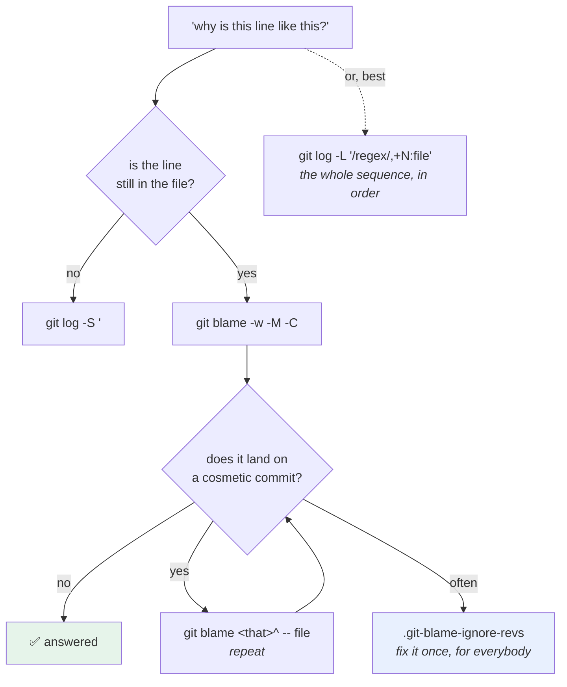

# 3.2 — Finding the change that introduced a line

## One-line answer

`git blame` tells you which commit **last touched** each line, which is a different and much weaker question
than *"which commit introduced this behaviour"* — and the gap between the two is where a reformatting commit
hides the answer you actually want.

---

## The story

🎬 **The scene.** A rented flat with a damp patch on the bedroom ceiling.

The letting agent produces the maintenance record. The most recent entry: *"June — ceiling repainted."*

😬 **The naive fix.** The tenant concludes the painter caused it and asks for the painter to come back.

💥 **Why it fails.** The painter painted a ceiling. The damp came from a valley gutter that has been blocked
since a roof repair in 2019, and the paint is simply the most recent thing to have happened to that surface.

**The record is accurate.** *"Last touched by"* is exactly what it recorded, and it was read as *"caused by"*
because they are the same sentence in English and completely different facts.

And the useful entry — the 2019 roof repair — is in the record too, three pages back, under a different room.

💡 **The insight.** **"Who touched it last" and "who caused it" are different questions, and the record you
have answers the first one.** Getting to the second means deliberately looking past the most recent change,
and the tools do not do it for you because they cannot know which changes were cosmetic.

---

## The idea in plain language

You are looking at a line of code and you want to know why it is like that. There are four tools, and they
answer four different questions:

| Tool | Answers |
| --- | --- |
| `git blame <file>` | which commit **last modified** each line |
| `git log -S '<string>'` | which commits **changed the number of occurrences** of a string |
| `git log -G '<regex>'` | which commits' **diffs match** a pattern |
| `git log -L <range>:<file>` | every commit that touched **these lines**, through renames |

**`blame` is the one everybody reaches for and the weakest of the four.** It gives you one commit per line —
the most recent — and the most recent change to a line is very often a rename, a reformat, a lint fix or a
move. In all of those cases blame points at a commit that changed nothing about the behaviour, and the
message says something like *"apply the formatter"*.

### Getting past the noise

Three mechanisms, in increasing order of effort:

**One — blame's own flags.** `-w` ignores whitespace changes, `-M` detects lines moved within a file, and `-C`
detects lines copied from other files. Together they skip most cosmetic commits.

**Two — blame the parent.** `git blame <commit>^ -- <file>` blames the state *before* that commit. So when
blame lands on a reformat, you blame that commit's parent and get the change underneath it. Repeat until you
reach something substantive. This is the manual version and it always works.

**Three — `.git-blame-ignore-revs`.** A file listing commits that blame should skip — the bulk reformat, the
rename, the licence-header addition. Configure it once with
`git config blame.ignoreRevsFile .git-blame-ignore-revs` and blame permanently looks past them.
**This is the professional answer** and almost nobody sets it up until after the first mass-reformat commit
has ruined blame for a year.

### When blame is the wrong tool entirely

If the line is **gone**, blame cannot help — it works on the current file. *"When was this deleted?"* is
`git log -S` with the deleted text.

If the behaviour moved between files, blame on the new file shows the move commit. `-L` with a regex start
follows it; `-C` helps blame.

**And if the question is really "which change broke it" rather than "which change wrote this line", none of
these is the tool** — that is [3.3](3.3-bisect-binary-search-over-history.md).

### The order to try them

1. `git log -S '<the exact text>' --all -- <path>` — cheapest, most precise, works on deleted code.
2. `git log -L '/<regex>/,+N:<file>'` — the region's whole history in one command.
3. `git blame -w -M -C <file>` — when you need per-line attribution.
4. `git blame <commit>^ -- <file>` — repeatedly, when blame lands on noise.

**Most people start at 3 and stop there.**

---

## Why Kriya needs it

**[3.3](3.3-bisect-binary-search-over-history.md)** is the fallback when none of these finds it.

**[5.2](../05-repo-as-memory/5.2-the-secret-that-reached-history.md)** uses `-S` to find a credential in
history — including in files that were deleted, which is the case blame cannot touch.

**Day 82's postmortem** asks *"when did this change and why"* about a specific line, under pressure.

**Day 90's training/serving skew** and **Day 115's drift investigation** ask the same question about a feature
transformation: *"when did this computation change?"* — and the answer is a pickaxe over the transformation
code.

**Day 232's day-2 operations** is a whole day of *"why is this like this"* about a system you set up months
earlier, which is this part applied to your own past self.

---

## The mechanism

Build a history with the noise in it — a real change, then a reformat on top — and watch blame point at the
wrong one. **Scratch repository.**

```bash
SCRATCH=$(mktemp -d)/blame && mkdir -p "$SCRATCH" && cd "$SCRATCH"
git init -q && git config user.email you@example.invalid && git config user.name You

cat > client.py <<'EOF'
TIMEOUT = 1.0

def fetch(url):
    return get(url, timeout=TIMEOUT)
EOF
git add client.py && git commit -q -m "feat: add the client"

sed -i 's/^TIMEOUT = 1.0$/TIMEOUT = 30.0/' client.py
git commit -q -am "fix(client): raise the timeout to 30s for the demo"

cat > client.py <<'EOF'
TIMEOUT = 30.0


def fetch(url: str) -> str:
    return get(url, timeout=TIMEOUT)
EOF
git commit -q -am "style: apply the formatter and add type hints"

git log --oneline
```

**Line by line:**

- Three commits: the original, **the substantive change** (1.0 → 30.0), and a **reformat** that touches every
  line without changing behaviour.
- The middle commit's message names the reason — *"for the demo"* — which is exactly the shape Day 9 warned
  about: a commit message naming a *situation* rather than a behaviour is configuration wearing a commit's
  clothes
  ([Day 9, 1.1](../../../day-009-configuration-and-secrets/parts/01-configuration/1.1-what-configuration-actually-is.md)).
- The reformat adds a blank line and type hints — **a completely ordinary, correct, desirable commit.** It is
  not a villain; it is noise.

```text
7a1c9e0 style: apply the formatter and add type hints
3d8f2b1 fix(client): raise the timeout to 30s for the demo
9b0e4a7 feat: add the client
```

**Blame it:**

```bash
cd "$SCRATCH"
git blame client.py
```

**Line by line:**

- No flags. **This is what everybody runs**, and what it returns is the question this part is about.

```text
7a1c9e0 (You 2026-08-25 16:02:11 +0530 1) TIMEOUT = 30.0
7a1c9e0 (You 2026-08-25 16:02:11 +0530 2)
7a1c9e0 (You 2026-08-25 16:02:11 +0530 3)
7a1c9e0 (You 2026-08-25 16:02:11 +0530 4) def fetch(url: str) -> str:
7a1c9e0 (You 2026-08-25 16:02:11 +0530 5)     return get(url, timeout=TIMEOUT)
```

**Every line attributed to the formatter.** The commit that made the timeout 30 seconds is invisible, and a
reader following blame lands on *"style: apply the formatter"* and learns nothing.

**Now get past it, three ways:**

```bash
cd "$SCRATCH"
echo '--- 1. blame the parent of the noisy commit ---'
git blame 7a1c9e0^ -- client.py | head -1

echo '--- 2. the pickaxe: which commit changed the number of occurrences of "30.0" ---'
git log --all -S '30.0' --format='%h %s' -- client.py

echo '--- 3. the line history ---'
git log -L '/^TIMEOUT/,+1:client.py' --format='%h %s' | grep -E '^[0-9a-f]{7} '
```

**Line by line:**

- `git blame <commit>^ -- <file>` — **blame the state before that commit.** The `^` means "first parent"
  ([1.1](../01-the-object-model/1.1-a-commit-is-a-snapshot-with-a-parent.md)), so this is *"what did this file
  look like before the formatter touched it, and who wrote those lines"*.
- `-S '30.0'` searches for the **value**, not the variable name — because
  [3.1](3.1-log-as-a-query-language.md) established that the count of `TIMEOUT` did not change and the count of
  `30.0` went from zero to one. **Choosing what to pickaxe for is the skill.**
- `-L '/^TIMEOUT/,+1:client.py'` gives every commit that touched that line, in order, **which is the most
  direct answer of the three** and the one fewest people know.
- `grep -E '^[0-9a-f]{7} '` filters `-L`'s output to the commit lines, because `-L` always includes the diffs.

```text
--- 1. blame the parent of the noisy commit ---
3d8f2b1 (You 2026-08-25 16:01:44 +0530 1) TIMEOUT = 30.0
--- 2. the pickaxe: which commit changed the number of occurrences of "30.0" ---
3d8f2b1 fix(client): raise the timeout to 30s for the demo
--- 3. the line history ---
7a1c9e0 style: apply the formatter and add type hints
3d8f2b1 fix(client): raise the timeout to 30s for the demo
9b0e4a7 feat: add the client
```

**All three find `3d8f2b1`.** The third one is the most useful, because it shows the whole sequence — including
the reformat — so you can see at a glance which commits were cosmetic.

### The flags that skip noise automatically

```bash
cd "$SCRATCH"
echo '--- blame with -w (ignore whitespace) ---'
git blame -w client.py | head -1
echo '--- and with the ignore-revs file ---'
echo '7a1c9e0' > .git-blame-ignore-revs
git blame --ignore-revs-file=.git-blame-ignore-revs client.py | head -1
```

**Line by line:**

- `-w` ignores **whitespace-only** differences, so a line that was only re-indented is attributed to the commit
  before. It does not help here, because the reformat also added type hints — **which is the honest limit of
  `-w`**: it handles indentation and not restructuring.
- `.git-blame-ignore-revs` is a plain list of commit hashes, one per line. `--ignore-revs-file` uses it for one
  invocation; `git config blame.ignoreRevsFile .git-blame-ignore-revs` makes it permanent for the repository.
- **The file should be committed**, so everybody's blame skips the same commits, and it should carry a comment
  per entry saying what the commit was — an ignore list nobody can read is one nobody will maintain.

```text
--- blame with -w (ignore whitespace) ---
7a1c9e0 (You 2026-08-25 16:02:11 +0530 1) TIMEOUT = 30.0
--- and with the ignore-revs file ---
3d8f2b1 (You 2026-08-25 16:01:44 +0530 1) TIMEOUT = 30.0
```

**`-w` did not help and the ignore file did.** That contrast is worth seeing rather than being told.

### The line that no longer exists

Blame's hard limit:

```bash
cd "$SCRATCH"
cat > client.py <<'EOF'
def fetch(url: str, timeout: float) -> str:
    return get(url, timeout=timeout)
EOF
git commit -q -am "refactor(client): take the timeout as a parameter"

echo '--- blame cannot see a deleted line ---'
git blame client.py | grep -c 'TIMEOUT' || echo "0 — the line is gone"
echo '--- the pickaxe still finds its whole life ---'
git log --all -S 'TIMEOUT' --format='%h %s' -- client.py
```

**Line by line:**

- The refactor **deletes** the module-level constant.
- `git blame` works on the current file, so a line that is not in it cannot be blamed. **This is the case that
  sends people to the wrong tool**, because the instinct is to blame harder.
- `-S 'TIMEOUT'` finds every commit that changed the number of occurrences: the one that introduced it and the
  one that removed it. **The count changed at both ends**, which is exactly when `-S` is the right tool.

```text
--- blame cannot see a deleted line ---
0 — the line is gone
--- the pickaxe still finds its whole life ---
2e5a8c3 refactor(client): take the timeout as a parameter
9b0e4a7 feat: add the client
```

Clean up:

```bash
cd /tmp && rm -rf "$SCRATCH"
```

**Line by line:**

- Leave before deleting, as in every scratch block in this day.



---

## When it breaks

**Blame after a mass reformat.** The failure this part exists for, at full scale:

```text
$ git blame pulse/api.py | awk '{print $1}' | sort | uniq -c | sort -rn | head -3
    412 a91f0c2
      7 7d2e8b1
      3 4c9a1f3
```

**What it says:** one commit is responsible for 412 of 422 lines.
**What it actually means:** somebody ran a formatter across the repository, or changed the line length, or
added type hints everywhere. **Blame is now useless for that file** — not degraded, useless — and it will
stay that way until somebody sets up an ignore file.
**The smallest fix:** add the hash to `.git-blame-ignore-revs`, commit it, and set
`git config blame.ignoreRevsFile`.
**Why doing it in the same commit as the reformat is the professional move:** the person who runs the formatter
is the only person who knows the hash matters, and they are the only person for whom adding it is free.

**The blame that named an innocent person.** The social failure:

```text
$ git blame -L 40,40 pulse/api.py
a91f0c2 (A Colleague 2026-03-14 09:22:41 +0000 40)     if attempt <= self.max_retries:
```

**What it says:** a colleague last touched this line.
**What it actually means:** possibly that they wrote the bug, and at least as possibly that they moved the
file, renamed a variable, or applied a lint fix. **The word "blame" is doing real damage here**, and it is
worth noticing that the command's name encourages exactly the wrong reading — the letting agent's maintenance
record, with a person's name on it.
**The smallest fix:** check with `-w -M -C`, then blame the parent, then read the commit message before
concluding anything.
**The habit worth forming:** *"who last touched"* is a lead, never a conclusion. And if you find yourself
about to say a name in an incident channel, run one more command first.

**The pickaxe that found the wrong thing.** Choosing the search string badly:

```text
$ git log -S 'timeout' --oneline -- client.py | wc -l
23
```

**What it says:** twenty-three commits.
**What it actually means:** `timeout` appears in comments, in parameter names, in docstrings and in three
unrelated functions, so the count changes constantly. **The pickaxe is precise about counts and you gave it an
imprecise string.**
**The smallest fix:** search for something distinctive — the value (`30.0`), the full assignment
(`TIMEOUT = 30.0`), or a unique identifier — and scope with `-- <path>`.
**The general technique:** **pick the longest string that must have appeared exactly when the behaviour
appeared.** A whole line is usually right; a common word is usually useless.

**The line whose history is in another file.** The move blame cannot follow:

```text
$ git log -L '/^def fetch/,+5:pulse/client.py' --format='%h %s' | head -2
2e5a8c3 refactor: split the client out of api.py
$ # ...and that is the only entry, for a function that is two years old
```

**What it says:** the function's history starts at the split.
**What it actually means:** the code was **moved** from another file, and by default git's line-history
follows the path. Everything before the move is under the old path.
**The smallest fix:** `git log --follow -- <path>` for a whole file, or `git blame -C -C` which searches other
files in the same commit for the source of moved lines. For `-L`, run it again against the old path at the
commit before the move.
**Why this is worth knowing before you need it:** a repository that has been reorganised once has this
property everywhere, and the symptom — *"this code appears to have been written all at once, recently"* — is
easy to believe.

---

## In production

**What a professional writes instead of the teaching version.** They set up `.git-blame-ignore-revs` on the
day of the first bulk reformat, commit it, and add an entry with a comment every time another one happens.
They also use `-L` far more than `blame`, because a sequence of commits is a better answer than a single
attribution — and they read the commit message before drawing any conclusion, which is the step that turns
`blame` from an accusation into a lead.

**What degrades at scale.** Blame's usefulness, monotonically, with every mechanical change. Formatters, lint
autofixes, import sorters, licence headers, mass renames — each one overwrites attribution for every line it
touches, and a repository that has had five of them has a blame output that names five commits and no authors.
The ignore file is the only real counter-measure and it only works if it is maintained, which means the
discipline is *"a mechanical commit adds its own hash to the ignore file"* rather than *"somebody will tidy
this up"*.

**The failure that only shows with real traffic.** Not applicable — this is a local read. **The
production-shaped version is an incident where the wrong conclusion is drawn quickly.** Blame names a recent
commit, somebody reverts it, the symptom does not go away, and the reverted commit was a fix that is now
missing — so you have the original problem plus a new one. The defence is the same as everywhere in this
curriculum: **treat the cheap signal as a lead and confirm it**, and here confirmation is reading the commit
and checking whether it changed behaviour at all.

**The review comment a senior engineer leaves.** *"This PR reformats every file in `pulse/` and also changes
two comparison operators. Please split it
([2.4](../02-the-message/2.4-one-change-per-commit.md)) — and when the reformat lands, add its hash to
`.git-blame-ignore-revs` in the same commit, or blame on this package is unusable from Monday and nobody will
go back and fix it."*

**The signal you would alert on.** Nothing runtime. The only mechanical thing worth having is a **check that
`.git-blame-ignore-revs` is updated when a commit changes more than some large number of lines without
changing the test outcome** — which is hard to do reliably and is honestly usually a review habit rather than a
gate. **Saying "this one is a habit rather than a check" is more useful than inventing a check that would not
work**, and the habit has a natural home: the same pull request that runs the formatter.

**Blast radius.** This part creates commits and writes a `.git-blame-ignore-revs`, all inside a temporary
repository created by `mktemp -d` and deleted at the end. The commands run against the Kriya repository are
none. Worst case: a scratch directory survives in the temporary filesystem. Who can trigger it: you.
**The real-world hazard this part warns about is social rather than technical** — attributing a defect to a
person on the strength of a blame line — and its bound is one extra command.

**Cost.** `0` model calls, `0` tokens, `0` CI minutes, `0` new packages, `0` network, `0` servers. Disk: a
scratch repository of a few kilobytes, deleted. RAM: negligible. **CPU: `-S` and `-L` walk history**, which is
instant here and worth scoping on a real repository
([3.1](3.1-log-as-a-query-language.md)).

**The interview question.** *"`git blame` points at a formatting commit. Now what?"* The answer that shows the
toolkit and the caution: *"Blame answers 'who last touched this line', which is not 'who caused this' — and
after any formatter, lint autofix or rename, the two are completely different. Three ways past it: blame the
parent of the noisy commit and repeat, which always works; use `-w -M -C` to skip whitespace and detect moved
or copied lines; or set up `.git-blame-ignore-revs` so blame permanently skips the known mechanical commits,
which is the fix you want and which somebody should have added in the same commit as the reformat. Honestly I
reach for `git log -L '/regex/,+N:file'` first, because a sequence of commits that touched a region is a better
answer than one attribution — and if the line has been deleted, blame cannot help at all and it is a pickaxe
question. The other thing I am careful about is that blame has a person's name on it, and 'last touched' is a
lead rather than a conclusion."*

---

## Check yourself

```bash
S=$(mktemp -d)/b && mkdir -p "$S" && cd "$S" && git init -q
git config user.email you@example.invalid && git config user.name You
printf 'X = 1\n' > f.py && git add f.py && git commit -q -m "feat: add X"
sed -i 's/X = 1/X = 99/' f.py && git commit -q -am "fix: change X to 99"
printf '\nX = 99\n' > f.py && git commit -q -am "style: reformat"
git blame f.py | tail -1
git log --all -S '99' --format='%h %s' -- f.py
cd /tmp && rm -rf "$S"
```

Blame naming the reformat, and the pickaxe naming the commit that actually changed the value.

**Say out loud, without scrolling up:** *State what `git blame` actually answers, name three ways to see past a
cosmetic commit, and say which tool you use when the line no longer exists.*
