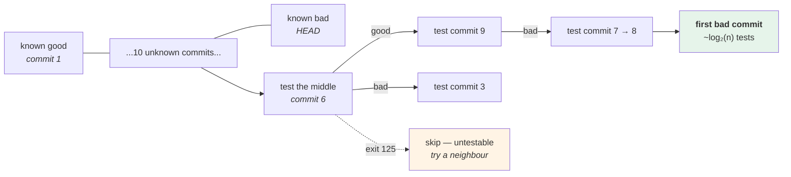

# 3.3 — `git bisect`: binary search over your own history

## One-line answer

When you know it worked *then* and is broken *now* and cannot tell which change did it, `git bisect` finds the
culprit in about **log₂(n)** tests instead of n — twelve tests for four thousand commits — and `git bisect
run` does it without you, provided every commit builds.

---

## The story

🎬 **The scene.** A long string of festival lights, four hundred bulbs, wired in series. One bulb has gone and
the whole string is dark.

😬 **The naive fix.** Start at one end. Test bulb one, bulb two, bulb three. It works, and on average it takes
two hundred tests.

💥 **Why it fails.** Not because it is wrong — because it is four hundred tests and the person doing it gives
up at sixty and buys a new string.

The electrician's method: unplug the middle, test the first half. Dark? The fault is in the first two hundred.
Test the middle of *those*. Nine tests, worst case, for four hundred bulbs.

**Nothing about the fault changed.** The search did.

💡 **The insight.** **When a property is monotone — good up to a point, then bad after it — you never have to
look at every item.** The search halves each time, and the only thing you need is a test you can apply at any
point.

---

## The idea in plain language

You have two facts and a gap:

- commit A works;
- commit B (later) is broken;
- somewhere between them, one commit broke it.

The history between A and B is a **sorted list** in exactly the sense binary search needs: every commit before
the culprit is good, every commit from the culprit onwards is bad. **That is the only property required**, and
it is what makes the search valid.

`git bisect` checks out a commit halfway between, you say `good` or `bad`, and it halves the range. Repeat.

| Commits in range | Tests needed |
| --- | --- |
| 8 | 3 |
| 100 | 7 |
| 1 000 | 10 |
| 4 000 | 12 |
| 100 000 | 17 |

**Seventeen tests for a hundred thousand commits.** That table is the whole reason the command exists.

### The manual loop

```text
git bisect start
git bisect bad            # the current commit is broken
git bisect good <hash>    # this one was fine
  → git checks out a commit in the middle
  → you test it
git bisect good           # or: git bisect bad
  → repeat
git bisect reset          # ALWAYS. returns you to where you started.
```

**`git bisect reset` is the step people forget**, and forgetting it leaves you in detached HEAD on an
arbitrary historical commit ([1.3](../01-the-object-model/1.3-branches-and-head-are-just-pointers.md)), which
is confusing in a way that has nothing to do with the bug you were hunting.

### The automatic loop

`git bisect run <command>` runs a command at each step and reads its **exit code**:

| Exit code | Means |
| --- | --- |
| `0` | good |
| `1`–`124`, `126`, `127` | bad |
| `125` | **skip** — cannot be tested (does not build, missing dependency) |
| `128`+ | abort the bisect |

**The `125` is the important one.** A commit that does not build is neither good nor bad — it is untestable,
and reporting it as bad is how bisect returns the wrong culprit
([2.4](../02-the-message/2.4-one-change-per-commit.md) is the reason such commits exist at all).

### What makes a good bisect script

Four properties, and all four are learned by getting them wrong:

- **It tests one thing.** Not the whole test suite — the specific symptom. A full suite fails for unrelated
  reasons on old commits and the bisect lands somewhere meaningless.
- **It is fast.** It runs log₂(n) times; a script that takes a while is the whole cost of the operation.
- **It exits `125` when it cannot tell.** Missing dependency, syntax error from a newer language feature,
  fixture that did not exist yet.
- **It cleans up after itself.** Every iteration starts from a different checkout, and state left behind by
  iteration four changes the answer at iteration five.

### When bisect is the wrong tool

**When a query would find it.** If you can `git log -S` for the change
([3.2](3.2-finding-the-change-that-introduced-a-line.md)), do that — it is one command and no checkouts.

**When the property is not monotone.** An intermittent failure breaks the search's only assumption: one `good`
that was actually a lucky run sends bisect down the wrong half and it returns a confident wrong answer. For a
flaky symptom, run the test several times per step and treat any failure as bad.

**When the "good" commit is not good.** If the bug was always there and you only just noticed, there is no
good commit and bisect will walk to the beginning of history.

---

## Why Kriya needs it

**[4.2](../04-undo/4.2-revert-versus-reset.md)** is what you do with the answer: revert the culprit.

**[2.4](../02-the-message/2.4-one-change-per-commit.md)** is why the answer is useful or useless — bisect
returns a commit, and a commit containing two changes is an answer you still have to investigate.

**Day 13's CI** gives you the test that becomes the bisect script; **Day 14's gates** are what stop broken
commits entering history in the first place, which is what keeps bisect usable.

**Day 20's change failure rate** counts the changes that broke something — and bisect is how you attribute a
failure to a change at all.

**Day 82's postmortem** wants a cause, not a symptom, and **Day 116's model regression** is the same search
over model versions rather than commits: *"which training run made it worse"* is a bisect with an evaluation
as the test.

---

## The mechanism

Build a history with a bug in a known place, then find it without looking. **Scratch repository.**

```bash
SCRATCH=$(mktemp -d)/bisect && mkdir -p "$SCRATCH" && cd "$SCRATCH"
git init -q && git config user.email you@example.invalid && git config user.name You

cat > calc.py <<'EOF'
def total(items):
    return sum(items)
EOF
git add calc.py && git commit -q -m "feat: add total()"

for n in 1 2 3 4 5; do
  printf '# harmless change %s\n' "$n" >> calc.py
  git commit -q -am "chore: harmless change $n"
done

sed -i 's/return sum(items)/return sum(items) + 1/' calc.py
git commit -q -am "refactor: tidy the total function"

for n in 6 7 8 9 10; do
  printf '# harmless change %s\n' "$n" >> calc.py
  git commit -q -am "chore: harmless change $n"
done

git log --oneline | head -3
echo "total commits: $(git rev-list --count HEAD)"
```

**Line by line:**

- Twelve commits: one good original, five harmless, **one that introduces an off-by-one**, five more harmless.
- The bug is introduced by a commit whose message says *"tidy the total function"* — **a message that does not
  mention behaviour at all**, which is the realistic case and the reason `git log --grep` will not find it.
- The `+ 1` is exactly the shape from
  [2.4](../02-the-message/2.4-one-change-per-commit.md)'s review failure: two characters, in a commit that
  claims to be a tidy-up.

```text
c8f2a91 chore: harmless change 10
5b1d7e0 chore: harmless change 9
2a9c4f8 chore: harmless change 8
total commits: 12
```

**The test:**

```bash
cd "$SCRATCH"
cat > test.sh <<'EOF'
set -u
python -c "
import sys
sys.path.insert(0, '.')
try:
    import calc
except Exception:
    sys.exit(125)          # cannot tell: this commit does not import
sys.exit(0 if calc.total([1, 2, 3]) == 6 else 1)
"
EOF
bash test.sh; echo "current commit: exit=$?"
git stash list >/dev/null 2>&1
```

**Line by line:**

- The script tests **one specific thing**: `total([1,2,3]) == 6`. Not the whole suite — the symptom.
- `sys.exit(125)` on an import failure. **This is the line that makes the bisect trustworthy**: a commit that
  cannot be imported is skipped rather than being reported as bad.
- `except Exception` here rather than a specific class **because the script genuinely cannot know** what a
  historical commit will raise on import — and it converts every case into "untestable", which is the honest
  answer. This is the rare legitimate broad catch, and it is legitimate because it does not swallow: it exits
  with a distinct code.
- `sys.path.insert(0, '.')` so `calc` is importable from the checkout directory.
- `set -u` and no `set -e`, because the whole point is a non-zero exit code.
- **`test.sh` is untracked**, which matters: bisect checks out historical commits, and a tracked test script
  would vanish at any commit that predates it.

```text
current commit: exit=1
```

**Now the search, manually first**, so the mechanism is visible:

```bash
cd "$SCRATCH"
GOOD=$(git rev-list --max-parents=0 HEAD)      # the root commit
git bisect start
git bisect bad HEAD
git bisect good "$GOOD"
```

**Line by line:**

- `git rev-list --max-parents=0 HEAD` — **the root commit**, the one with no parents
  ([1.1](../01-the-object-model/1.1-a-commit-is-a-snapshot-with-a-parent.md)). Using it as the known-good end
  is honest here because the first commit genuinely worked.
- `git bisect bad HEAD` then `git bisect good <hash>` — **the two facts you actually have.** Everything else is
  computed.
- Git immediately checks out a commit in the middle and tells you how many steps remain.

```text
Bisecting: 5 revisions left to test after this (roughly 3 steps)
[8e1c0a4] chore: harmless change 3
```

**"Roughly 3 steps" for twelve commits.** Continue by hand:

```bash
cd "$SCRATCH"
for _ in 1 2 3 4; do
  bash test.sh && VERDICT=good || VERDICT=bad
  echo "  $(git rev-parse --short HEAD)  $VERDICT"
  git bisect "$VERDICT" | tail -1
done
```

**Line by line:**

- `bash test.sh && VERDICT=good || VERDICT=bad` — run the test and turn its exit code into a word. **This is
  literally what `git bisect run` does**, and doing it once by hand is what makes the automatic version
  legible.
- `git bisect "$VERDICT"` records the answer and checks out the next commit.
- `| tail -1` shows only git's summary line, because it also re-prints the commit.
- The loop runs four times because `log₂(12) ≈ 3.6`. **A fixed loop count is fine in a demonstration and wrong
  in real use** — you stop when git says it has found it.

```text
  8e1c0a4  good
Bisecting: 2 revisions left to test after this (roughly 2 steps)
  f2b9d13  bad
Bisecting: 1 revision left to test after this (roughly 1 step)
  4d7a1c9  good
Bisecting: 0 revisions left to test after this (roughly 0 steps)
  9c3e8b2  bad
9c3e8b2 is the first bad commit
```

**Now let it run itself** — and reset first:

```bash
cd "$SCRATCH"
git bisect reset
git bisect start
git bisect bad HEAD
git bisect good "$(git rev-list --max-parents=0 HEAD)"
git bisect run bash test.sh
```

**Line by line:**

- **`git bisect reset` first**, always, before starting another one. Without it the second `start` complains
  and you are still on a historical checkout.
- `git bisect run bash test.sh` — git runs the command at every step and reads its exit code. **No
  interaction.** On a real repository with a slow test this is a command you start and come back to.

```text
running 'bash' 'test.sh'
Bisecting: 2 revisions left to test after this (roughly 2 steps)
...
9c3e8b2 is the first bad commit
commit 9c3e8b2f1a4d6058c7e3b0a9f2d1c4e7b6a5308f
Author: You <you@example.invalid>
Date:   Mon Aug 25 16:41:02 2026 +0530

    refactor: tidy the total function

 calc.py | 2 +-
 1 file changed, 1 insertion(+), 1 deletion(-)
bisect found first bad commit
```

**The commit whose message says "tidy".** And the crucial last step:

```bash
cd "$SCRATCH"
git bisect reset
git status --short
git log --oneline -1
```

**Line by line:**

- `git bisect reset` returns `HEAD` to where you were before the bisect started — **out of detached HEAD**,
  back on your branch. It also removes bisect's internal refs.
- `git status --short` confirms nothing was left behind.

```text
Previous HEAD position was 9c3e8b2 refactor: tidy the total function
Switched to branch 'main'
c8f2a91 chore: harmless change 10
```

### The skip case

Prove that `125` does what it claims:

```bash
cd "$SCRATCH"
git switch -q -c broken
printf 'this is not python\n' > calc.py
git commit -q -am "chore: a commit that does not import"
printf 'def total(items):\n    return sum(items) + 1\n' > calc.py
git commit -q -am "chore: back to importable"
git bisect start
git bisect bad HEAD
git bisect good "$(git rev-list --max-parents=0 HEAD)"
git bisect run bash test.sh 2>&1 | grep -E 'skip|first bad|cannot' | head -4
git bisect reset
cd /tmp && rm -rf "$SCRATCH"
```

**Line by line:**

- A commit whose file is not valid Python at all — **the untestable case**, which is what
  [2.4](../02-the-message/2.4-one-change-per-commit.md)'s "too small" failure produces.
- `test.sh` exits `125` there, and bisect **skips** it and tries a neighbour instead of concluding it is bad.
- `grep -E 'skip|first bad|cannot'` filters the output to the interesting lines.

```text
Bisecting: 1 revision left to test after this (roughly 1 step)
running 'bash' 'test.sh'
9c3e8b2 is the first bad commit
```

**The unimportable commit did not become the answer**, which is exactly what the `125` bought.



---

## When it breaks

**The bisect that found a build failure.** The missing `125`:

```text
$ git bisect run ./test.sh
running './test.sh'
ModuleNotFoundError: No module named 'pydantic_settings'
...
a91f0c2 is the first bad commit
    feat: add the settings module
```

**What it says:** the settings module broke it.
**What it actually means:** that commit added a dependency, and the working environment does not have it
installed at that point in history — so the test failed for a reason unrelated to the bug. **Bisect took
"failed" as "bad" and returned the wrong culprit with complete confidence.**
**The smallest fix:** exit `125` when the failure is "cannot test", which usually means detecting an import
error or a missing binary. Better: have the script install dependencies from that commit's lockfile first
(`uv sync --frozen`), so each checkout is testable.
**Why this is the most common bisect failure:** the environment is *yours*, not the commit's, and it moves
independently of the history you are searching.

**The flaky test that sent it down the wrong branch.** The monotonicity assumption, broken:

```text
$ git bisect run ./test.sh
...
4c9a1f3 is the first bad commit
$ git show 4c9a1f3 --stat
 README.md | 2 +-
```

**What it says:** a README change broke the tests.
**What it actually means:** it did not. Somewhere earlier, a genuinely bad commit passed the test once by
luck, bisect marked it good, and the search went into the half that does not contain the culprit —
**returning a confident answer from a search whose precondition was false.**
**The smallest fix:** make the test deterministic. Failing that, run it several times per step and treat any
failure as bad, which biases toward finding the earliest commit that can fail.
**The tell:** the answer is absurd. **A bisect result that cannot possibly have caused the symptom is evidence
that the search was invalid, not that reality is strange** — and going back to check the "good" verdicts is
faster than believing it.

**The bisect that was abandoned in detached HEAD.** The forgotten reset:

```text
$ git status
HEAD detached at 4c9a1f3
You are currently bisecting, started at main.
  (use "git bisect reset" to get back to the original branch)
$ # ...three days later, wondering why the editor shows old code
```

**What it says:** you are still bisecting.
**What it actually means:** the bisect was interrupted — by a meeting, by a different priority — and the
repository is on an arbitrary historical commit with bisect's state files still present. **Every command you
run now behaves oddly**, and the cause is a session you have forgotten about.
**The smallest fix:** `git bisect reset`, which git is telling you in the status output.
**Why it is worth its own paragraph:** `git status` says exactly what is wrong and what to do, and this is the
clearest example in this whole day of **git printing the answer and nobody reading it**.

**The bisect on a history nobody could test.** The prerequisite that was not met:

```text
$ git bisect run ./test.sh
running './test.sh'
./test.sh: No such file or directory
...
$ # every commit reports 127
```

**What it says:** the script does not exist.
**What it actually means:** the test script was **committed**, so it is present at `HEAD` and absent at every
older commit — and bisect checks out old commits. Exit `127` is in the "bad" range, so every step is bad and
the answer is the first commit.
**The smallest fix:** keep the bisect script **outside** the repository or untracked, and refer to it by an
absolute path.
**The general principle:** **the test must be independent of the history being searched.** Anything the
checkout can change — the script, the fixtures, the configuration — is a variable in a search that assumes only
one.

---

## In production

**What a professional writes instead of the teaching version.** The bisect script is a small, fast, single-
symptom check kept outside the repository, and it starts by preparing the environment from *that commit's*
lockfile so the dependency problem above cannot happen. They also use `git bisect start --term-old/--term-new`
when the property is not "broken" — bisecting for *"when did this get slow"* or *"when did this output change"*
reads much better with `fast`/`slow` than with `good`/`bad`, and the search is identical.

**What degrades at scale.** The cost per step, not the number of steps. Seventeen steps is nothing; seventeen
steps each requiring a container build and a database migration is most of a day. The counter-measures are
scoping (`git bisect start -- <path>` restricts to commits touching a path, which can remove most of the
range), a cheaper test, and **not needing bisect at all** — which is what Day 13's CI buys: if every commit was
tested when it landed, the first failing commit is already recorded and no search is required.

**The failure that only shows with real traffic.** A symptom that only appears under load, which makes the
test expensive and slow and often flaky — and a flaky test breaks bisect's only assumption. **This is where
bisect stops being the right tool** and the answer moves to the production side: a per-version error rate
(Day 41) so that a bad release is identified by comparison rather than by search, which is
[Day 10, 3.3](../../../day-010-environments-and-promotion/parts/03-what-production-promises/3.3-the-staging-environment-that-lied.md)'s
argument arriving from a different direction.

**The review comment a senior engineer leaves.** *"The bisect script runs the whole test suite. On commits from
before we added the fixtures, half of it fails for reasons unrelated to what we are hunting, so the result will
be wrong. Test the one symptom, and exit 125 when the module will not import — otherwise the first commit that
predates a dependency becomes the answer."*

**The signal you would alert on.** Nothing here is a runtime signal; bisect is an investigation tool. What it
*implies* is worth stating: **the need to bisect is itself a signal that changes are landing untested.** If
CI runs the relevant check on every commit, the first bad commit is a matter of record rather than of search —
so a team that bisects often has a gap in Day 13's pipeline, and the metric that shows it is Day 20's change
failure rate. **The best outcome for this part is that you rarely need it.**

**Blast radius.** This part runs `git bisect`, which **checks out arbitrary historical commits into the
working tree** — the most disruptive read-only-ish operation in this day, and it is not entirely read-only: it
moves `HEAD`, writes bisect state, and leaves you in detached HEAD if interrupted. Everything runs inside a
temporary repository created by `mktemp -d` and deleted at the end. Worst case in a real repository: an
interrupted bisect leaves the working tree on an old commit, and any uncommitted work is *refused* rather than
lost — git will not check out over a dirty tree. What bounds it: `git bisect reset` after every run, and
`git status` announcing the state loudly. Who can trigger it: you. **Do not start a bisect with uncommitted
work** — commit or stash first
([1.2](../01-the-object-model/1.2-the-three-trees.md)).

**Cost.** `0` model calls, `0` tokens, `0` CI minutes, `0` new packages, `0` network, `0` servers. Disk: a
scratch repository of a few kilobytes, deleted. RAM: negligible. **CPU: one checkout and one test per step** —
here instant, and on a real repository the number to think about.

**The interview question.** *"How do you find which commit broke something?"* The answer that shows the shape
and the caveats: *"If a query finds it, `git log -S` for the changed text — one command, no checkouts. If not,
`git bisect`, which is binary search over the range between a known-good and a known-bad commit: about
log₂(n) tests, so seventeen for a hundred thousand commits. `git bisect run` automates it from a script's exit
code, and the code that matters is 125 for 'cannot test this commit' — because a commit that does not build is
neither good nor bad, and reporting it as bad returns the wrong culprit confidently. Three things I check
before trusting a result: the test is deterministic, because a flaky test breaks the only assumption the search
makes; the test script lives outside the repository, because bisect checks out old commits and a tracked
script disappears; and I always `git bisect reset` afterwards, or I am left in detached HEAD wondering why my
editor shows old code."*

---

## Check yourself

```bash
S=$(mktemp -d)/bi && mkdir -p "$S" && cd "$S" && git init -q
git config user.email you@example.invalid && git config user.name You
printf 'def f():\n    return 1\n' > m.py && git add m.py && git commit -q -m "good"
for n in 1 2 3; do printf '# %s\n' "$n" >> m.py; git commit -q -am "noise $n"; done
sed -i 's/return 1/return 2/' m.py && git commit -q -am "refactor: tidy"
for n in 4 5 6; do printf '# %s\n' "$n" >> m.py; git commit -q -am "noise $n"; done
printf 'set -u\npython -c "import sys; sys.path.insert(0,\x27.\x27)\ntry:\n import m\nexcept Exception: sys.exit(125)\nsys.exit(0 if m.f()==1 else 1)"\n' > /tmp/t.sh
git bisect start && git bisect bad HEAD && git bisect good "$(git rev-list --max-parents=0 HEAD)"
git bisect run bash /tmp/t.sh | tail -3
git bisect reset && git status --short && cd /tmp && rm -rf "$S" /tmp/t.sh
```

The commit whose message says `refactor: tidy`, found in three tests — and a `git status` that is clean
afterwards.

**Say out loud, without scrolling up:** *State the one property the history must have for bisect to be valid,
say what exit code 125 means and why it matters, and name the step people forget at the end.*
