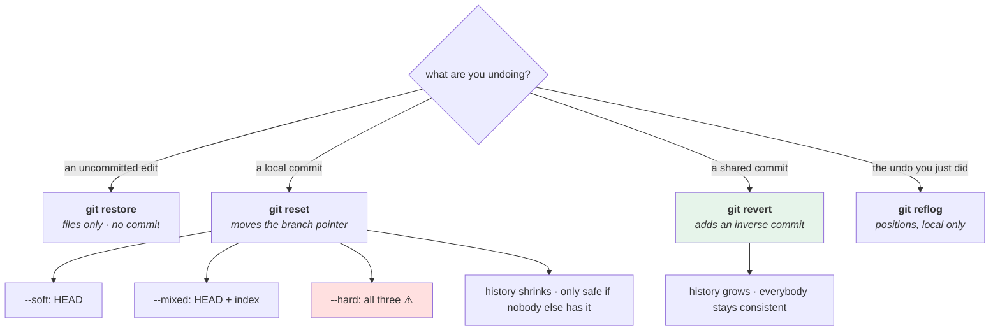

# 4.1 — The four undos: restore, reset, revert, reflog

## One-line answer

Git has four different undos and they operate on four different things — **`restore`** on files,
**`reset`** on a branch pointer, **`revert`** by adding a new commit, and **`reflog`** on positions a
reference used to hold — so the question is never "how do I undo" but "**what** am I undoing, and has anybody
else seen it".

---

## The story

🎬 **The scene.** A small print shop with four different ways to fix a mistake, and a foreman who knows which
is which.

The proof is still on the screen: **change it**. Nobody has seen it and nothing has been printed.

The plates are cut but the run has not started: **re-cut the plate**. Costs a plate, costs an hour, and the
job is as if the mistake never happened.

Five thousand copies have gone out to shops: **print a correction slip**. You cannot un-send them. The
correction is itself a thing that exists, dated, and everybody who has the original also gets the slip.

And the fourth: the foreman's day book, where every job's state is written down as it changes, so when
somebody has done the wrong one of the first three, there is a record of what it looked like before.

😬 **The naive fix.** A new manager standardises on one procedure for all mistakes: re-cut the plate.

💥 **Why it fails.** For the proof it is wasteful and harmless. **For the five thousand copies it is
incoherent** — you cannot re-cut a plate for paper that is in a shop in another county. The procedure quietly
becomes "pretend the mistake did not happen", which works internally and is invisible to everybody who already
has the wrong version.

💡 **The insight.** **The right undo depends on how far the thing has travelled**, not on how wrong it is. And
the distinction that matters is exactly one question: *has anybody else got a copy?*

---

## The idea in plain language

| Undo | Operates on | Creates a commit? | Safe on shared history? |
| --- | --- | --- | --- |
| **`git restore`** | files — working tree, index | no | yes (it touches nothing shared) |
| **`git reset`** | the branch pointer, and optionally the other trees | no | **no** — it rewrites what the branch means |
| **`git revert`** | history, by **adding** a commit that undoes another | yes | **yes** — this is the one for shared history |
| **`git reflog`** | positions a reference used to hold | no | local only — it is your record, not the repository's |

Each maps onto something from section 1:

- **`restore`** moves between the three trees ([1.2](../01-the-object-model/1.2-the-three-trees.md)) and never
  touches a commit.
- **`reset`** moves a branch pointer ([1.3](../01-the-object-model/1.3-branches-and-head-are-just-pointers.md))
  and, depending on the flag, the index and working tree with it.
- **`revert`** creates a new commit whose content is the inverse of another — **history is append-only**
  ([1.1](../01-the-object-model/1.1-a-commit-is-a-snapshot-with-a-parent.md)), so the only way to undo forward
  is to add.
- **`reflog`** reads the record of where references have been
  ([1.4](../01-the-object-model/1.4-nothing-is-lost-the-object-database.md)).

### The decision, in one question

**Has anybody else got these commits?**

- **No** (local branch, unpushed) → `reset` is fine, and is usually what you want. The history becomes what
  you wish it had been.
- **Yes** (pushed, shared, deployed) → `revert`, always. `reset` plus a force-push rewrites history other
  people have, which is [4.3](4.3-the-force-push-and-the-reflog.md)'s subject and is how work gets destroyed.

**That is the whole decision procedure**, and it is worth committing to memory because the alternative is
deciding it under pressure.

### `reset`'s three flags, precisely

From [1.2](../01-the-object-model/1.2-the-three-trees.md): the flags say **how many of the three trees move**.

| Flag | `HEAD` | index | working tree | Use it when |
| --- | --- | --- | --- | --- |
| `--soft` | ✅ | — | — | you want the changes back **staged**, to re-commit differently |
| `--mixed` (default) | ✅ | ✅ | — | you want the changes back **unstaged** |
| `--hard` | ✅ | ✅ | ✅ | you want the changes **gone** |

**Only `--hard` can lose work**, and it loses exactly the work that was never committed — because the working
tree is the one tree git has not stored.

### The fourth undo nobody lists

There is a fifth thing people mean by "undo" and it is worth naming so it does not get confused with these:
**`git restore --source=<commit> <path>`** — take one file's content from an old commit into the working tree,
without moving anything. It is a *targeted* undo, it creates no commit until you make one, and it is often the
right answer during an incident when you want one file back and nothing else.

---

## Why Kriya needs it

**[4.2](4.2-revert-versus-reset.md)** is the shared-history half in depth, and **[4.3](4.3-the-force-push-and-the-reflog.md)**
is what happens when you get it wrong.

**Day 10 used `git reset --hard` twice**
([Day 10, 2.4](../../../day-010-environments-and-promotion/parts/02-promotion/2.4-the-rebuild-that-promoted-something-different.md))
and required a clean tree first — this part is why that requirement was there.

**Day 19's rollback** is `revert` at the level of a deployment: an undo that goes *forward*, recorded, rather
than pretending the change never happened.

**Day 12's review** decides which of these is acceptable on a shared branch, as a written rule.

**Day 82's postmortem** and **Day 217's audit** both depend on history being a record — which `revert`
preserves and `reset` plus force-push destroys.

---

## The mechanism

All four, on the same mistake, so the difference is visible. **Scratch repository.**

```bash
SCRATCH=$(mktemp -d)/undo && mkdir -p "$SCRATCH" && cd "$SCRATCH"
git init -q && git config user.email you@example.invalid && git config user.name You
printf 'TIMEOUT = 1.0\n' > client.py
git add client.py && git commit -q -m "feat: add the client"

state() {
  printf '%-24s working=%-16s index=%-16s HEAD=%-16s log=%s\n' "$1" \
    "$(tr -d '\n' < client.py)" \
    "$(git show :client.py 2>/dev/null | tr -d '\n')" \
    "$(git show HEAD:client.py 2>/dev/null | tr -d '\n')" \
    "$(git rev-list --count HEAD)"
}
state "start"
```

**Line by line:**

- `state()` prints all three trees plus the commit count on one line — the same technique as
  [1.2](../01-the-object-model/1.2-the-three-trees.md), extended with `log=` so a *new commit* is visible as
  well as a moved pointer.
- `tr -d '\n'` strips the newline so each value fits in a column.
- `git rev-list --count HEAD` is the number of commits reachable — **the field that distinguishes `revert`
  from everything else.**

```text
start                    working=TIMEOUT = 1.0    index=TIMEOUT = 1.0    HEAD=TIMEOUT = 1.0    log=1
```

**Undo one — `restore`, on an uncommitted edit:**

```bash
cd "$SCRATCH"
printf 'TIMEOUT = 999.0\n' > client.py
state "edited (not staged)"
git restore client.py
state "after git restore"
```

**Line by line:**

- `git restore <path>` copies from the **index** into the **working tree**, discarding the edit.
- **Nothing else moves**: no commit, no pointer. `log=1` throughout.
- **This is destructive with no undo** — the edit was never in the object database
  ([1.4](../01-the-object-model/1.4-nothing-is-lost-the-object-database.md)) — and it is the smallest possible
  undo.

```text
edited (not staged)      working=TIMEOUT = 999.0  index=TIMEOUT = 1.0    HEAD=TIMEOUT = 1.0    log=1
after git restore        working=TIMEOUT = 1.0    index=TIMEOUT = 1.0    HEAD=TIMEOUT = 1.0    log=1
```

**Undo two — `reset`, on a local commit**, in all three strengths:

```bash
cd "$SCRATCH"
printf 'TIMEOUT = 999.0\n' > client.py
git commit -q -am "fix: set the timeout to 999 (a mistake)"
state "committed the mistake"

git reset --soft HEAD~1
state "after reset --soft"
git reset --mixed HEAD
state "after reset --mixed"
git checkout -q -- client.py
state "after discarding"
```

**Line by line:**

- `--soft HEAD~1` moves **`HEAD` only**: the commit is gone from the branch and the change is back **staged**.
  Look at the `index=` column — it still has `999.0`. **This is the flag for "I committed too early"**: reset
  soft, then re-commit with more, or with a better message.
- `--mixed HEAD` — note the target is `HEAD`, not `HEAD~1`. It moves nothing (`HEAD` is already there) and
  **resets the index to `HEAD`**, so the change becomes unstaged. `git reset` with no flag and no target does
  exactly this, which is why "unstage everything" is just `git reset`.
- `git checkout -q -- client.py` is the older spelling of `git restore` — shown once because you will meet it
  in every existing script and answer written before `restore` existed
  ([1.2](../01-the-object-model/1.2-the-three-trees.md)).
- Three commands, three trees, one at a time: `log` goes 2 → 1 at the first, `index` changes at the second,
  `working` at the third.

```text
committed the mistake    working=TIMEOUT = 999.0  index=TIMEOUT = 999.0  HEAD=TIMEOUT = 999.0  log=2
after reset --soft       working=TIMEOUT = 999.0  index=TIMEOUT = 999.0  HEAD=TIMEOUT = 1.0    log=1
after reset --mixed      working=TIMEOUT = 999.0  index=TIMEOUT = 1.0    HEAD=TIMEOUT = 1.0    log=1
after discarding         working=TIMEOUT = 1.0    index=TIMEOUT = 1.0    HEAD=TIMEOUT = 1.0    log=1
```

**`log=2` became `log=1` with no commit created.** The mistake is not in the history at all — which is exactly
what makes `reset` unsafe once somebody else has it.

**Undo three — `revert`, on a commit that has been shared:**

```bash
cd "$SCRATCH"
printf 'TIMEOUT = 999.0\n' > client.py
git commit -q -am "fix: set the timeout to 999 (a mistake, and this one shipped)"
BAD=$(git rev-parse --short HEAD)
state "the mistake shipped"

git revert --no-edit "$BAD"
state "after git revert"
git log --oneline
```

**Line by line:**

- `git revert <commit>` computes the **inverse diff** of that commit and applies it as a **new commit**.
- `--no-edit` accepts the generated message (`Revert "..."`) rather than opening an editor. **In real use,
  edit it** — the generated message says what was undone and not why, which is
  [2.1](../02-the-message/2.1-what-a-commit-message-is-for.md)'s whole argument.
- `log=` goes **up**, not down. That is the defining property: **the history grows and the bad commit is still
  in it**, which is why everybody who already has it stays consistent with you.

```text
the mistake shipped      working=TIMEOUT = 999.0  index=TIMEOUT = 999.0  HEAD=TIMEOUT = 999.0  log=2
after git revert         working=TIMEOUT = 1.0    index=TIMEOUT = 1.0    HEAD=TIMEOUT = 1.0    log=3
```

```text
b7d2f1a Revert "fix: set the timeout to 999 (a mistake, and this one shipped)"
4e9c0b3 fix: set the timeout to 999 (a mistake, and this one shipped)
8a1f5d7 feat: add the client
```

**Three commits, both the mistake and its correction visible.** The file content is identical to the
`reset` outcome; the *history* is completely different, and the history is what other people have.

**Undo four — `reflog`, when you did the wrong one of the first three:**

```bash
cd "$SCRATCH"
git reset --hard HEAD~2
state "after a --hard too far"
git reflog -4
git reset --hard 'HEAD@{1}'
state "recovered"
```

**Line by line:**

- `--hard HEAD~2` throws away two commits **and** the working tree — the destructive one.
- `git reflog -4` shows the last four positions. **The entry above the `reset` is where you were.**
- `'HEAD@{1}'` in quotes ([1.4](../01-the-object-model/1.4-nothing-is-lost-the-object-database.md)) — a
  position in the reflog, not an ancestor.

```text
after a --hard too far   working=TIMEOUT = 1.0    index=TIMEOUT = 1.0    HEAD=TIMEOUT = 1.0    log=1
b7d2f1a HEAD@{1}: revert: Revert "fix: set the timeout to 999..."
4e9c0b3 HEAD@{2}: commit: fix: set the timeout to 999...
recovered                working=TIMEOUT = 1.0    index=TIMEOUT = 1.0    HEAD=TIMEOUT = 1.0    log=3
```

**And the fifth — one file, from an old commit:**

```bash
cd "$SCRATCH"
printf 'TIMEOUT = 5.0\nEXTRA = True\n' > client.py
git commit -q -am "feat: add EXTRA and change the timeout"
git restore --source=HEAD~1 -- client.py
state "one file from HEAD~1"
git log --oneline -1
cd /tmp && rm -rf "$SCRATCH"
```

**Line by line:**

- `git restore --source=<commit> -- <path>` takes that file's content **from that commit** into the working
  tree. `HEAD` does not move and no commit is created — `log` is unchanged.
- **This is the targeted incident undo**: one file back to a known state, nothing else touched, and you decide
  afterwards whether to commit it.

```text
one file from HEAD~1     working=TIMEOUT = 1.0    index=TIMEOUT = 5.0EXTRA = True  HEAD=TIMEOUT = 5.0EXTRA = True  log=4
2f8c1e9 feat: add EXTRA and change the timeout
```

**Look at the columns:** the working tree is the old content, the index and `HEAD` are the new one, and the
commit count did not move. Three trees, one changed.



---

## When it breaks

**`reset --hard` with uncommitted work.** The one that actually loses things:

```text
$ git reset --hard HEAD~1
HEAD is now at 8a1f5d7 feat: add the client
$ git status
nothing to commit, working tree clean
$ # ...and the afternoon's uncommitted edits are gone
```

**What it says:** a clean working tree.
**What it actually means:** `--hard` reset all three trees, and the working tree's contents **were never in
the object database**, so the reflog cannot help
([1.4](../01-the-object-model/1.4-nothing-is-lost-the-object-database.md)). The *committed* part is
recoverable; the uncommitted part is not.
**The smallest fix:** none. **The prevention:** `git status --short` before any destructive command, and
`git stash` if it is not empty — a stash is a commit, so it is recoverable.
**Why this is worth stating as a rule:** it is the single most common way work is genuinely lost in git, and
the command that does it is one people run casually.

**`revert` on a merge commit.** The one that errors confusingly:

```text
$ git revert a91f0c2
error: commit a91f0c2 is a merge but no -m option was given.
fatal: revert failed
```

**What it says:** a missing option.
**What it actually means:** a merge commit has **two parents**
([1.1](../01-the-object-model/1.1-a-commit-is-a-snapshot-with-a-parent.md)), so "the inverse of this commit"
is ambiguous — inverse relative to which parent? `-m 1` means "keep the first parent's line of history", which
is usually the branch you merged *into*.
**The smallest fix:** `git revert -m 1 <merge>`.
**The consequence nobody warns you about:** reverting a merge marks that branch as merged-and-undone, so
**merging the same branch again brings in nothing.** You have to revert the revert first. This is a
genuinely confusing corner and it is worth knowing the name of before meeting it.

**`reset` on a branch somebody else has.** The failure this whole section builds to:

```text
$ git reset --hard HEAD~3
$ git push --force
$ # ...and a colleague's next pull
error: Your local changes to the following files would be overwritten by merge
$ # ...or worse, a silent divergence nobody notices for a day
```

**What it says:** a conflict on their side.
**What it actually means:** you changed what the branch means. Their clone still has the three commits and
now disagrees with the remote about what the history is. **You have not undone a change; you have created two
incompatible histories** ([4.3](4.3-the-force-push-and-the-reflog.md)).
**The smallest fix:** `revert` instead, always, once anything is shared.
**Why "but I told them in chat" is not a fix:** the recovery work is theirs, it is fiddly, and it will be done
by whoever is least equipped to do it.

**`restore` that restored the wrong thing.** The flag that changes the meaning:

```text
$ git restore --staged client.py
$ # ...expected the file back to its committed state, got the edit still on disk
```

**What it says:** nothing; it succeeded.
**What it actually means:** `--staged` restores the **index** from `HEAD` (unstage), leaving the working tree
alone. Without the flag it restores the **working tree** from the index (discard the edit). **Two different
operations, one flag apart, and only the second is destructive.**
**The smallest fix:** `git restore --staged --worktree <path>` does both, and `git restore --source=HEAD
<path>` is the explicit "make this file look like the last commit".
**The habit:** say out loud which tree you are restoring *from* and *to* before pressing enter. The command
names them if you let it.

---

## In production

**What a professional writes instead of the teaching version.** They ask the shared-or-not question first and
reflexively, and they use `revert` far more often than people expect — including on their own unshared
branches when the history is worth keeping honest. They also `git stash` before anything destructive, not
because they expect to need it but because it costs two seconds and converts the one unrecoverable case into a
recoverable one. And the generated revert message gets edited to say *why*, because a bare `Revert "..."` is
[2.1](../02-the-message/2.1-what-a-commit-message-is-for.md)'s "update config.py" wearing different clothes.

**What degrades at scale.** The shared-or-not question gets harder to answer. On a small team "has anybody
pulled this" is answerable; on a large one, with forks, mirrors, CI caches and a deployment pipeline that has
already built the commit, the answer is always yes and the honest rule becomes **"once it is pushed, only
`revert`"** with no case-by-case judgement. The other thing that degrades is the reflog's usefulness: it is
per-clone, so on shared infrastructure the person who made the mistake and the person who has to recover from
it are often not the same person
([1.4](../01-the-object-model/1.4-nothing-is-lost-the-object-database.md)).

**The failure that only shows with real traffic.** Not applicable to git itself. **The production-shaped
analogue is a rollback**: `reset`-thinking applied to a deployment is *"put it back as if it never happened"*,
which loses the record of what was deployed and when — and Day 10's release ledger exists precisely so that a
rollback is a **new release pointing at an old build**, which is `revert`-shaped
([Day 10, 2.2](../../../day-010-environments-and-promotion/parts/02-promotion/2.2-build-release-run.md)).
**The four undos are a model for undo in general, not just for git**, and Day 19 makes the argument in full.

**The review comment a senior engineer leaves.** *"This branch was force-pushed to remove a commit that was
already on `main` for two days. Please revert instead and push normally — three people have that commit, our
CI has built it, and the deploy history references it. The file contents end up the same either way; the
difference is whether the record still says what happened."*

**The signal you would alert on.** Nothing runtime. The gate that matters is a **protected branch** on the
server that refuses non-fast-forward pushes to `main`
([4.3](4.3-the-force-push-and-the-reflog.md)) — which makes the shared-history rule mechanical rather than
cultural. Locally, the equivalent is a habit rather than a check: `git status --short` before anything
destructive. **A pre-command hook for `reset --hard` does not exist and inventing one would be worse than the
habit**, because the command is legitimate and frequent.

**Blast radius.** This part runs every destructive git command in the day — `restore`, `reset --hard`,
`revert`, `checkout --` — inside a temporary repository created by `mktemp -d` and deleted at the end. Nothing
runs against the Kriya repository. **The capability being taught is genuinely dangerous in real use**: two of
the four undos can destroy uncommitted work with no recovery, and one of them can destroy other people's work
when combined with a force-push. What bounds it here: the scratch repository. What bounds it in practice: the
shared-or-not question, `git status --short` first, and `git stash` when the tree is not clean. Who can trigger
it: you.

**Cost.** `0` model calls, `0` tokens, `0` CI minutes, `0` new packages, `0` network, `0` servers. Disk: a
scratch repository of a few kilobytes, deleted. RAM: negligible.

**The interview question.** *"How do you undo a commit?"* The answer that shows the decision rather than a
command: *"It depends on one thing: has anybody else got it. If it is local and unpushed, `git reset` moves
the branch pointer and the commit is simply not in the history any more — `--soft` keeps the changes staged,
`--mixed` unstaged, `--hard` throws them away, and those three flags are just how many of the three trees
move. If it has been pushed or deployed, `git revert`, which adds a new commit containing the inverse — the
history grows, the mistake stays visible, and everybody who already has it stays consistent with me. The
mistake I have seen cost the most is `reset` plus a force-push on a shared branch, because the file contents
end up the same and the record of what actually happened does not. And the only genuinely unrecoverable one is
`reset --hard` with uncommitted work, because the working tree is the one thing git never stored — which is
why I stash before anything destructive."*

---

## Check yourself

```bash
S=$(mktemp -d)/u && mkdir -p "$S" && cd "$S" && git init -q
git config user.email you@example.invalid && git config user.name You
printf 'A = 1\n' > f.py && git add f.py && git commit -q -m one
printf 'A = 2\n' > f.py && git commit -q -am "two (a mistake)"
git revert --no-edit HEAD && git log --oneline && cat f.py
git reset --hard HEAD~2 && git log --oneline && cat f.py
git reflog -3
cd /tmp && rm -rf "$S"
```

A revert that makes the history **three** commits, then a reset that makes it **one** — same file content,
opposite records — and a reflog holding both.

**Say out loud, without scrolling up:** *Name the four undos and what each operates on, give the single
question that chooses between `reset` and `revert`, and say which one can lose work that no reflog can
recover.*
